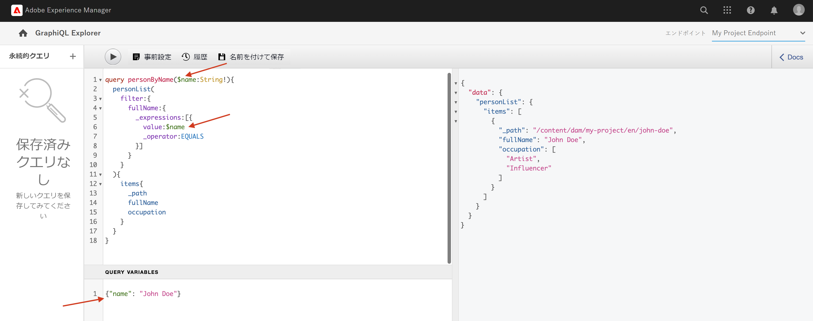

# GraphQL API の探索 {#explore-graphql-apis}

AEM の GraphQL API は、コンテンツフラグメントのデータをダウンストリームアプリケーションに公開する強力なクエリ言語を提供します。 コンテンツフラグメントモデルは、コンテンツフラグメントで使用されるデータスキーマを定義します。 コンテンツフラグメントモデルが作成または更新されるたびに、スキーマが解釈され、GraphQL API を構成する「グラフ」に追加されます。

この章では、「[GraphiQL](https://github.com/graphql/graphiql)」という IDE を使用してコンテンツを収集する一般的な GraphQL クエリをいくつか見ていきます。  GraphiQL IDE を使用すると、返されるクエリとデータを素早くテストして調整できます。また、GraphiQL ではドキュメントへのアクセスも容易になり、どのようなメソッドがあるのかを簡単に学習して理解できます。

## 前提条件 {#prerequisites}

このマルチパートチュートリアルでは、「[コンテンツフラグメントのオーサリング](./author-content-fragments.md)」の手順が完了していることが想定されています。

## 目的 {#objectives}

* GraphiQL ツールを使用して、GraphQL 構文でクエリを作成する方法を学びます
* コンテンツフラグメントのリストと単一のコンテンツフラグメントでクエリを実行する方法を学びます
* 特定のデータ属性をフィルタリングしてリクエストする方法を理解します
* 複数のコンテンツフラグメントモデルのクエリを結合する方法を理解します
* GraphQL クエリを永続化する方法を学びます。

## GraphQL エンドポイントを有効にする {#enable-graphql-endpoint}

GraphQL エンドポイントは、コンテンツフラグメントに対してGraphQL API クエリを有効にするように設定する必要があります。

1. AEM の開始画面で、**ツール**／**一般**／**GraphQL** に移動します。 

   

1. 右上の「**作成**」をタップし、表示されたダイアログで次の値を入力します。

   * 名前*：**マイプロジェクトエンドポイント**.
   * 次により提供される GraphQL を使用... *：**マイプロジェクト**

   

   「**作成**」をクリックしてエンドポイントを保存します。

   プロジェクト設定に基づいて作成された GraphQL エンドポイントでは、そのプロジェクトに属するモデルに対するクエリのみが有効になります。 ここでは、**人物**&#x200B;および&#x200B;**チーム**&#x200B;モデルに対するクエリのみを使用できます。

   >[!NOTE]
   >
   > また、グローバルエンドポイントを作成して、複数の設定をまたいでモデルに対するクエリを有効にすることもできます。 これは、環境にセキュリティの脆弱性がもたらされ、AEM の管理が全体的に複雑になる可能性があるため、慎重に使用する必要があります。

1. これで、お使いの環境で 1 つの GraphQL エンドポイントが有効になりました。

   

## GraphiQL IDE の使用

[GraphiQL](https://experienceleague.adobe.com/docs/experience-manager-cloud-service/content/headless/graphql-api/graphiql-ide.html?lang=ja) ツールを使用すると、開発者は現在の AEM 環境のコンテンツに対するクエリを作成およびテストできます。 GraphiQL ツールを使用すると、実稼働設定でクライアントアプリケーションで使用されるクエリを&#x200B;**永続化または保存**&#x200B;することができます。

次に、組み込みの GraphiQL IDE を使用してAEM の GraphQL API の機能を見ていきます。

1. AEM の開始画面で、**ツール**／**一般**／**GraphQL クエリエディター**&#x200B;に移動します。 

   

   >[!NOTE]
   >
   > AEM の古いバージョンでは、GraphiQL IDE を使用できない場合があります。 その場合は、次の[説明](#install-graphiql)に従って手動でインストールします。

1. 右上で、エンドポイントが&#x200B;**マイプロジェクトエンドポイント**&#x200B;に設定されていることを確認します。

   

これにより、 すべてのクエリで&#x200B;**マイプロジェクト**&#x200B;プロジェクトに作成されたモデルが対象となります。

### コンテンツフラグメントのリストでのクエリ {#query-list-cf}

共通の要件は、複数のコンテンツフラグメントでクエリを実行することです。

1. 次のクエリをメインパネルに貼り付けます（コメントリストの置き換え）。

   ```graphql
   query allTeams {
     teamList {
       items {
         _path
         title
       }
     }
   } 
   ```

1. 上のメニューにある&#x200B;**再生**&#x200B;ボタンを押してクエリを実行します。 前の章で作成したコンテンツフラグメントの結果が表示されます。

   

1. `title` テキストの下にカーソルを合わせ、**Ctrl +スペース**&#x200B;キーを押してコードのヒントをトリガーします。 `shortname` および `description` をクエリに追加します。

   

1. **再生**&#x200B;ボタンをクリックしてクエリを再度実行すると、`shortname` と `description` の追加プロパティを含む結果が表示されます。

   

   `shortname` は単純なプロパティで、`description` は複数行のテキストフィールドです。GraphQL API を使用すると、 `html`、`markdown`、`json` または `plaintext` など、様々な形式の結果から選択できます。

### ネストされたフラグメントのクエリ

次に、クエリのテストでネストされたフラグメントを取得します。 **チーム**&#x200B;モデルが参照する&#x200B;**人物**&#x200B;モデルを思い出してください。

1. `teamMembers` プロパティ含めるをようにクエリを更新します。 これは、フィールドから人物モデルへの&#x200B;**フラグメント参照**&#x200B;フィールドです。次のように、人物モデルのプロパティを返すことができます。

   ```graphql
   query allTeams {
       teamList {
           items {
               _path
               title
               shortName
               description {
                   plaintext
               }
               teamMembers {
                   fullName
                   occupation
               }
           }
       }
   }
   ```

   JSON 応答

   ```json
   {
       "data": {
           "teamList": {
           "items": [
               {
               "_path": "/content/dam/my-project/en/team-alpha",
               "title": "Team Alpha",
               "shortName": "team-alpha",
               "description": {
                   "plaintext": "This is a description of Team Alpha!"
               },
               "teamMembers": [
                   {
                   "fullName": "John Doe",
                   "occupation": [
                       "Artist",
                       "Influencer"
                   ]
                   },
                   {
                   "fullName": "Alison Smith",
                   "occupation": [
                       "Photographer"
                   ]
                   }
                 ]
           }
           ]
           }
       }
   }
   ```

   ネストされたフラグメントに対してクエリを実行できるのは、AEM GraphQL API の優れた機能です。 この簡単な例ではネストが 2 レベルのみですが、フラグメントをさらにネストすることは可能です。 例えば、 **人物**&#x200B;に関連付けられた&#x200B;**住所**&#x200B;モデルがある場合、3 つのモデルすべてから 1 つのクエリでデータを返すことができます。

### コンテンツフラグメントのリストのフィルタリング {#filter-list-cf}

ここからは、プロパティ値に基づいて結果をコンテンツフラグメントのサブセットでフィルタリングする方法を見ていきましょう。

1. GraphiQL UI で次のクエリを入力します。

   ```graphql
   query personByName($name:String!){
     personList(
       filter:{
         fullName:{
           _expressions:[{
             value:$name
             _operator:EQUALS
           }]
         }
       }
     ){
       items{
         _path
         fullName
         occupation
       }
     }
   }  
   ```

   上記のクエリは、システム内のすべての「人物」フラグメントに対して検索を実行します。 クエリの先頭に追加されたフィルターにより、`name` フィールドと変数文字列 `$name`で比較が行われます。

1. 「**クエリ変数**」パネルに以下を入力します。

   ```json
   {"name": "John Doe"}
   ```

1. クエリを実行する際、「**人物**」コンテンツフラグメントが `John Doe` の値を返すことが想定されます。

   

   複雑なクエリをフィルタリングして作成する方法は他にも多数あります。詳しくは、「[AEM での GraphQL の使用方法 - サンプルコンテンツとサンプルクエリ](https://experienceleague.adobe.com/docs/experience-manager-cloud-service/content/headless/graphql-api/sample-queries.html?lang=ja)」をご覧ください。

1. 上のクエリを強化してプロファイル画像を取得します。

   ```graphql
   query personByName($name:String!){
     personList(
       filter:{
         fullName:{
           _expressions:[{
             value:$name
             _operator:EQUALS
           }]
         }
       }
     ){
       items{  
         _path
         fullName
         occupation
         profilePicture{
           ... on ImageRef{
             _path
             _authorUrl
             _publishUrl
             height
             width
   
           }
         }
       }
     }
   } 
   ```

   `profilePicture` はコンテンツ参照であり、画像であると想定されるので、組み込みの `ImageRef` オブジェクトが使用されます。 これにより、参照されている画像に関する追加データ（`width` および `height`など）をリクエストできます。

### 単一のコンテンツフラグメントのクエリ {#query-single-cf}

単一のコンテンツフラグメントに対して直接クエリを実行することもできます。 AEM のコンテンツは階層的に保存され、フラグメントの一意の識別子はフラグメントのパスに基づきます。

1. GraphiQL エディターに次のクエリを入力します。

   ```graphql
   query personByPath($path: String!) {
       personByPath(_path: $path) {
           item {
           fullName
           occupation
           }
       }
   }
   ```

1. 「**クエリ変数**」に以下を入力します。 

   ```json
   {"path": "/content/dam/my-project/en/alison-smith"}
   ```

1. クエリを実行し、単一の結果が返されることを確認します。

## クエリの永続化 {#persist-queries}

クエリとクエリから返された結果データに満足したら、次の手順はクエリを AEM に保存または永続化することです。 [永続クエリ](https://experienceleague.adobe.com/docs/experience-manager-cloud-service/content/headless/graphql-api/persisted-queries.html?lang=ja) は、GraphQL API をクライアントアプリケーションに公開するための推奨されるメカニズムです。 クエリが永続化されると、GET リクエストを使用してリクエストでき、Dispatcher および CDN レイヤーでキャッシュできます。 そして、永続化されたクエリのパフォーマンスが大幅に向上します。 永続クエリを使用すると、パフォーマンスのメリットに加えて、余計なデータが誤ってクライアントアプリケーションに公開されるのを防ぐことができます。 永続クエリについて詳しくは、[こちら](https://experienceleague.adobe.com/docs/experience-manager-cloud-service/content/headless/graphql-api/persisted-queries.html?lang=ja)を参照してください。

次に、2 つのシンプルなクエリを永続化します。これらは次の章で使用します。

1. GraphiQL IDE で次のクエリを入力します。

   ```graphql
   query allTeams {
       teamList {
           items {
               _path
               title
               shortName
               description {
                   plaintext
               }
               teamMembers {
                   fullName
                   occupation
               }
           }
       }
   }
   ```

   クエリが機能することを確認します。

1. 次に、「**名前を付けて保存**」をタップし、**クエリ名**&#x200B;として `all-teams` と入力します。 

   クエリは、左パネルの「**永続クエリ**」に表示されます。

   
1. 次に、永続クエリの横にある「**...**」をタップし、「**URL をコピー**」をタップしてパスをクリップボードにコピーします。

   

1. 新しいタブを開き、コピーしたパスをブラウザーに貼り付けます。

   ```plain
   https://$YOUR-AEMasCS-INSTANCEID$.adobeaemcloud.com/graphql/execute.json/my-project/all-teams
   ```

   パスは上記のようになります。 クエリの JSON 結果が返されたことを確認できます。

   上記の URL の分類：

   | 名前 | 説明 |
   | ---------|---------- |
   | `/graphql/execute.json` | 永続クエリのエンドポイント |
   | `/my-project` | `/conf/my-project` のプロジェクト設定 |
   | `/all-teams` | 永続クエリの名前 |

1. GraphiQL IDE に戻り、「**+**」ボタンを使って新しいクエリを永続化します

   ```graphql
   query personByName($name: String!) {
     personList(
       filter: {
         fullName:{
           _expressions: [{
             value: $name
             _operator:EQUALS
           }]
         }
       }){
       items {
         _path
         fullName
         occupation
         biographyText {
           json
         }
         profilePicture {
           ... on ImageRef {
             _path
             _authorUrl
             _publishUrl
             width
             height
           }
         }
       }
     }
   }
   ```

1. クエリに `person-by-name` という名前を付けて保存します。
1. 次の 2 つの永続クエリを保存する必要があります。

   


## GraphQL エンドポイントと永続クエリの公開

レビューと検証で `GraphQL Endpoint` と `Persisted Queries` を公開します

1. AEM の開始画面で、**ツール**／**一般**／ **GraphQL** に移動します。 

1. **マイプロジェクトエンドポイント**&#x200B;の横にあるチェックボックスをタップし、「**公開**」をタップします。

   

1. AEM の開始画面で、**ツール**／**一般**／**GraphQL クエリエディター**&#x200B;に移動します。 

1. 永続クエリパネルで **all-teams** クエリをタップし、「**公開**」をタップします。

   

1. `person-by-name` クエリで上記の手順を繰り返します

## ソリューションファイル {#solution-files}

最後の 3 つの章で作成したコンテンツ、モデル、永続クエリをダウンロードします（[basic-tutorial-solution.content.zip](assets/explore-graphql-api/basic-tutorial-solution.content.zip)）。

## その他のリソース

GraphQLクエリの詳細については、[AEM での GraphQL の使用方法 - サンプルコンテンツとサンプルクエリ](https://experienceleague.adobe.com/docs/experience-manager-cloud-service/content/headless/graphql-api/sample-queries.html?lang=ja)を参照してください。

## おめでとうございます。 {#congratulations}

これで完了です。GraphQL クエリを複数作成して実行しました。

## 次の手順 {#next-steps}

次の章の [React アプリの構築](./graphql-and-react-app.md)では、外部アプリケーションが AEM の GraphQL エンドポイントに対してクエリを実行する方法と、2 つの永続クエリを使用する方法を見ていきます。 また、GraphQL クエリの実行中に発生する基本的なエラー処理についても説明します。

## GraphiQL ツールのインストール（オプション） {#install-graphiql}

AEM の一部のバージョン（6.X.X）では、GraphiQL IDE ツールを手動でインストールする必要があります。その場合は、[こちらの手順](../how-to/install-graphiql-aem-6-5.md)に従ってください。

