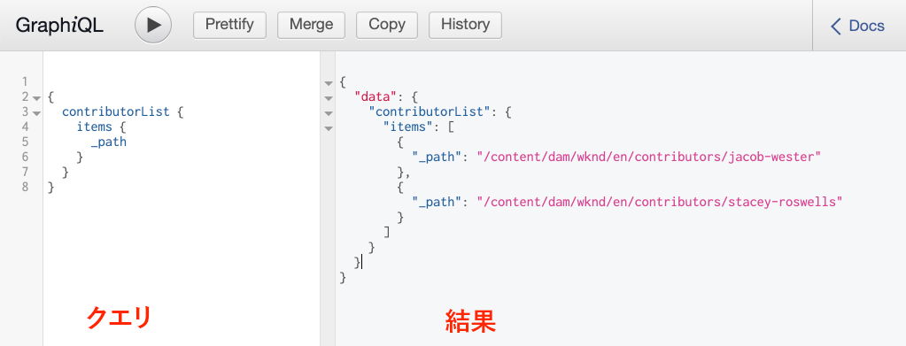

# GraphQL APIの参照{#explore-graphql-apis}

AEMのGraphQL APIは、コンテンツフラグメントのデータをダウンストリームアプリケーションに公開する強力なクエリ言語を提供します。 コンテンツフラグメントモデルは、コンテンツフラグメントで使用されるデータスキーマを定義します。 コンテンツフラグメントモデルが作成または更新されるたびに、スキーマが翻訳され、GraphQL APIを構成する「グラフ」に追加されます。

この章では、[GraphiQL](https://github.com/graphql/graphiql)と呼ばれるIDEを使用してコンテンツを収集するための、一般的なGraphQLクエリをいくつか調べます。 GraphiQL IDEを使用すると、返されるクエリとデータをすばやくテストし、調整できます。 また、GraphiQLはドキュメントに簡単にアクセスでき、使用可能な方法を簡単に学習し、理解できます。

## 前提条件 {#prerequisites}

これは複数のパートから成るチュートリアルで、[コンテンツフラグメントのオーサリング](./author-content-fragments.md)で説明されている手順が完了していることを前提としています。

## 目的 {#objectives}

* GraphQLツールを使用して、GraphQL構文を使用してクエリを作成する方法を説明します。
* コンテンツフラグメントのリストと単一のコンテンツフラグメントを照会する方法を説明します。
* 特定のデータ属性をフィルターしてリクエストする方法を説明します。
* コンテンツフラグメントのバリエーションをクエリする方法を説明します。
* 複数のコンテンツフラグメントモデルのクエリを結合する方法を説明します

## GraphiQLツール{#install-graphiql}のインストール

GraphiQL IDEは開発ツールで、開発インスタンスやローカルインスタンスなど、下位レベルの環境でのみ必要です。 したがって、AEMプロジェクトには含まれませんが、アドホックベースでインストールできる個別のパッケージとして提供されます。

1. **[ソフトウェア配布ポータル](https://experience.adobe.com/#/downloads/content/software-distribution/ja/aemcloud.html)** > **AEM as aCloud Service**&#x200B;に移動します。
1. 「GraphiQL」を検索します（**GraphiQL**&#x200B;に&#x200B;**i**&#x200B;を必ず含めてください）。
1. 最新の&#x200B;**GraphiQLコンテンツパッケージv.x.x.x**&#x200B;をダウンロードします。

   

   zipファイルは、直接インストールできるAEMパッケージです。

1. **AEM Start**&#x200B;メニューから、**ツール** / **デプロイ** / **パッケージ**&#x200B;に移動します。
1. 「**パッケージをアップロード**」をクリックし、前の手順でダウンロードしたパッケージを選択します。 「**インストール**」をクリックして、パッケージをインストールします。

   

## コンテンツフラグメントのリストのクエリ{#query-list-cf}

共通の要件は、複数のコンテンツフラグメントをクエリすることです。

1. [http://localhost:4502/content/graphiql.html](http://localhost:4502/content/graphiql.html)にあるGraphiQL IDEに移動します。
1. 次のクエリを、左側のパネル（コメントのリストの下）に貼り付けます。

   ```graphql
   {
     contributorList {
       items {
           _path
         }
     }
   }
   ```

1. 上部のメニューの「**再生**」ボタンを押して、クエリを実行します。 前の章の寄稿者コンテンツフラグメントの結果が表示されます。

   

1. カーソルを`_path`テキストの下に置き、**Ctrl +スペース**&#x200B;を入力して、コードのヒントをトリガーします。 `fullName`と`occupation`をクエリに追加します。

   

1. **Play**&#x200B;ボタンを押してクエリを再実行すると、`fullName`と`occupation`の追加のプロパティが結果に含まれていることがわかります。

   

   `fullName` とは単 `occupation` 純なプロパティです。[コンテンツフラグメントモデルの定義](./content-fragment-models.md)の章から、`fullName`と`occupation`は、各フィールドの&#x200B;**プロパティ名**&#x200B;を定義する際に使用する値です。

1. `pictureReference` とは、よ `biographyText` り複雑なフィールドを表します。`pictureReference`フィールドと`biographyText`フィールドに関するデータを返すには、次のようにクエリを更新します。

   ```graphql
   {
   contributorList {
       items {
         _path
         fullName
         occupation
         biographyText {
           html
         }
         pictureReference {
           ... on ImageRef {
               _path
               width
               height
               }
           }
       }
     }
   }
   ```

   `biographyText` は複数行テキストフィールドで、GraphQL APIを使用すると、、、などの結果に対して様々な形式を選 `html`択で `markdown`き `json` ま `plaintext`す。

   `pictureReference` はコンテンツ参照で、画像である必要があるので、組み込みオブジェクトが使 `ImageRef` 用されます。これにより、`width`や`height`など、参照中の画像に関する追加データを要求できます。

1. 次に、**冒険**&#x200B;のリストをクエリしてみましょう。 次のクエリを実行します。

   ```graphql
   {
     adventureList {
       items {
         adventureTitle
         adventureType
         adventurePrimaryImage {
           ...on ImageRef {
             _path
             mimeType
           }
         }
       }
     }
   }
   ```

   **Adventures**&#x200B;のリストが返されます。 クエリにフィールドを追加して、自由に試してみてください。

## コンテンツフラグメントのリストのフィルタリング{#filter-list-cf}

次に、プロパティ値に基づいて結果をコンテンツフラグメントのサブセットにフィルタリングする方法を見てみましょう。

1. GraphiQL UIで次のクエリを入力します。

   ```graphql
   {
   contributorList(filter: {
     occupation: {
       _expressions: {
         value: "Photographer"
         }
       }
     }) {
       items {
         _path
         fullName
         occupation
       }
     }
   }
   ```

   上記のクエリは、システム内のすべてのコントリビューターに対して検索を実行します。 クエリの先頭に追加されたフィルターは、`occupation`フィールドと文字列「**Photographer**」で比較を実行します。

1. クエリを実行すると、1つの&#x200B;**Contributor**&#x200B;のみが返されます。
1. 次のクエリを入力して、**Adventures**&#x200B;のリストをクエリします。`adventureActivity`は&#x200B;**で**&quot;Surfing&quot;**と等しくない**&#x200B;です。

   ```graphql
   {
     adventureList(filter: {
       adventureActivity: {
           _expressions: {
               _operator: EQUALS_NOT
               value: "Surfing"
           }
       }
   }) {
       items {
       _path
       adventureTitle
       adventureActivity
       }
     }
   }
   ```

1. クエリを実行し、結果を検査します。 結果に`adventureType`が&#x200B;**&quot;Surfing&quot;**&#x200B;に等しくないことを確認します。

複雑なクエリをフィルタリングして作成するためのその他のオプションは多数ありますが、上記の例はほんの一部です。

## 単一のコンテンツフラグメントのクエリ{#query-single-cf}

単一のコンテンツフラグメントに対して直接クエリを実行することもできます。 AEMのコンテンツは階層的に保存され、フラグメントの一意の識別子はフラグメントのパスに基づきます。 単一のフラグメントに関するデータを返す場合は、パスを使用し、モデルに直接クエリを実行することをお勧めします。 この構文を使用すると、クエリの複雑さが非常に低くなり、より高速な結果が得られます。

1. GraphiQLエディターで次のクエリを入力します。

   ```graphql
   {
    contributorByPath(_path: "/content/dam/wknd/en/contributors/stacey-roswells") {
       item {
         _path
         fullName
         biographyText {
           html
         }
       }
     }
   }
   ```

1. クエリを実行し、**Stacey Roswells**&#x200B;フラグメントに対する単一の結果が返されることを確認します。

   前の練習では、フィルタを使用して結果のリストを絞り込みました。 同様の構文を使用してパスでフィルタリングすることもできますが、パフォーマンス上の理由から、上記の構文をお勧めします。

1. [コンテンツフラグメントのオーサリング](./author-content-fragments.md)の章で、**概要**&#x200B;のバリエーションが&#x200B;**Stacey Roswells**&#x200B;に対して作成されたことを思い出してください。 クエリを更新して、**概要**&#x200B;のバリエーションを返します。

   ```graphql
   {
   contributorByPath
   (
       _path: "/content/dam/wknd/en/contributors/stacey-roswells"
       variation: "summary"
   ) {
       item {
         _path
         fullName
         biographyText {
           html
         }
       }
     }
   }
   ```

   バリエーションの名前が&#x200B;**Summary**&#x200B;であったとしても、バリエーションは小文字で保持されるので、`summary`が使用されます。

1. クエリを実行し、`biography`フィールドの結果がはるかに短いことを確認します。`html`

## 複数のコンテンツフラグメントモデルのクエリ{#query-multiple-models}

別々のクエリを1つのクエリに組み合わせることもできます。 これは、アプリケーションの電源を入れるために必要なHTTP要求の数を最小限に抑えるのに役立ちます。 例えば、アプリケーションの&#x200B;*ホーム*&#x200B;ビューには、異なる&#x200B;**2つの**&#x200B;コンテンツフラグメントモデルに基づいてコンテンツが表示されます。 **2つの**&#x200B;個別のクエリを実行する代わりに、1つのリクエストにクエリを組み合わせることができます。

1. GraphiQLエディターで次のクエリを入力します。

   ```graphql
   {
     adventureList {
       items {
         _path
         adventureTitle
       }
     }
     contributorList {
       items {
         _path
         fullName
       }
     }
   }
   ```

1. クエリを実行し、結果セットに&#x200B;**Adventures**&#x200B;および&#x200B;**Contributors**&#x200B;のデータが含まれていることを確認します。

```json
{
  "data": {
    "adventureList": {
      "items": [
        {
          "_path": "/content/dam/wknd/en/adventures/bali-surf-camp/bali-surf-camp",
          "adventureTitle": "Bali Surf Camp"
        },
        {
          "_path": "/content/dam/wknd/en/adventures/beervana-portland/beervana-in-portland",
          "adventureTitle": "Beervana in Portland"
        },
        ...
      ]
    },
    "contributorList": {
      "items": [
        {
          "_path": "/content/dam/wknd/en/contributors/jacob-wester",
          "fullName": "Jacob Wester"
        },
        {
          "_path": "/content/dam/wknd/en/contributors/stacey-roswells",
          "fullName": "Stacey Roswells"
        }
      ]
    }
  }
}
```

## その他のリソース

GraphQLクエリのその他の例の多くは、次を参照してください。[AEMでのGraphQLの使用方法の学習 — サンプルコンテンツとクエリ](https://experienceleague.adobe.com/docs/experience-manager-cloud-service/assets/admin/content-fragments-graphql-samples.html?lang=ja)。

## バリデーターが {#congratulations}

これで、複数のGraphQLクエリを作成し、実行しました。

## 次の手順 {#next-steps}

次の章「[ReactアプリからのAEMのクエリ](./graphql-and-external-app.md)」では、外部アプリケーションがAEM GraphQLエンドポイントをクエリする方法を調べます。 サンプルWKND GraphQL Reactアプリを変更してフィルタリングGraphQLクエリを追加した外部アプリを使用すると、アプリのユーザーは、アクティビティでアドベンチャーをフィルタリングできます。 また、基本的なエラー処理についても説明します。
