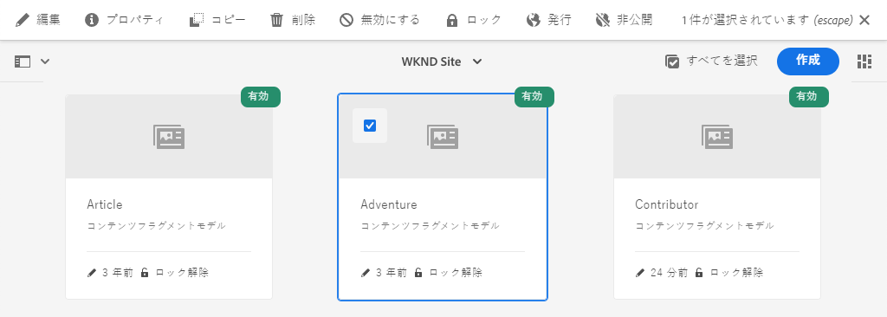
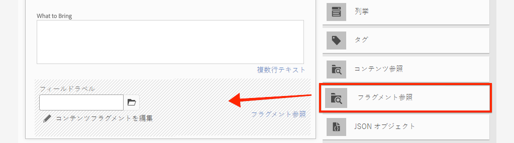
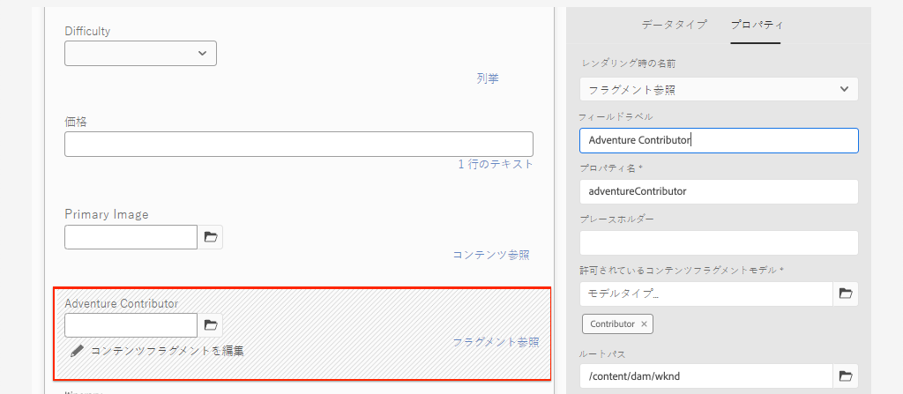
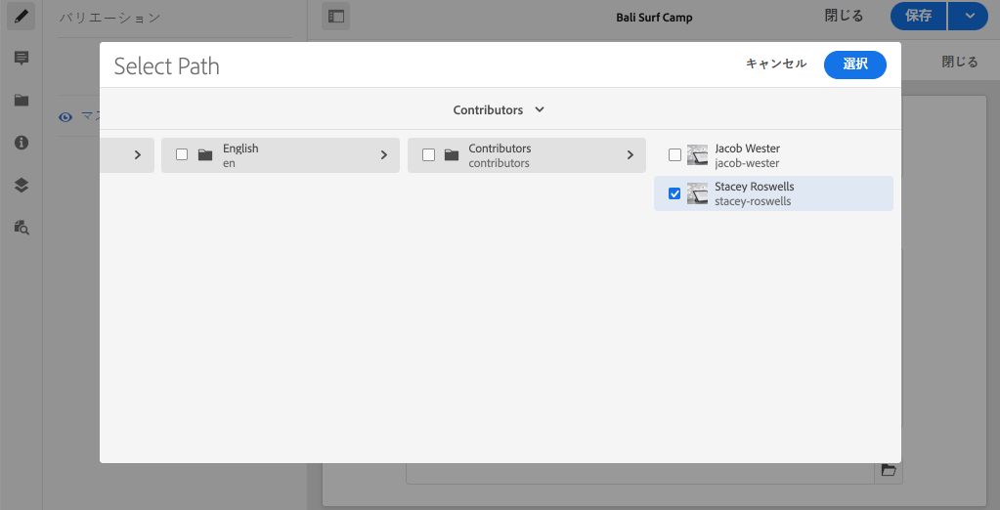
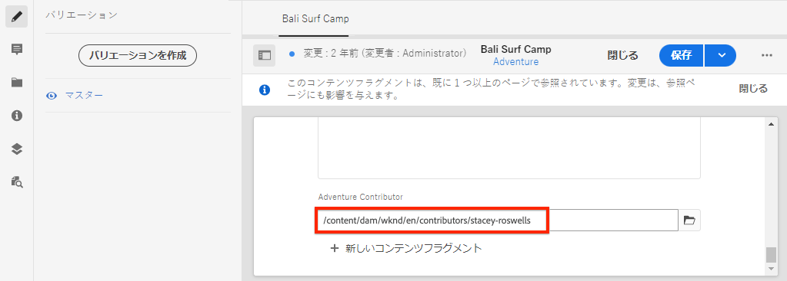

# フラグメントリファレンスを使用した高度なデータモデリング

別のコンテンツフラグメント内からコンテンツフラグメントを参照できます。 これにより、フラグメント間の関係を持つ複雑なデータモデルを作成できます。

この章では、「**フラグメント参照**」フィールドを使用して、コントリビューターモデルへの参照を含めるようにアドベンチャーモデルを更新します。 また、GraphQLクエリを変更して、参照モデルのフィールドを含める方法についても学習します。

## 前提条件

これは複数のパートから成るチュートリアルで、前のパートで説明した手順が完了していることを前提としています。

## 目的

この章では、次の方法について説明します。

* 「フラグメント参照」フィールドを使用するようにコンテンツフラグメントモデルを更新する
* 参照モデルからフィールドを返すGraphQLクエリを作成する

## フラグメント参照の追加{#add-fragment-reference}

コントリビューターモデルへの参照を追加するために、アドベンチャーコンテンツフラグメントモデルを更新します。

1. 新しいブラウザーを開き、AEMに移動します。
1. **AEM Start**&#x200B;メニューから、**ツール** / **アセット** / **コンテンツフラグメントモデル** / **WKNDサイト**&#x200B;に移動します。
1. **アドベンチャー**&#x200B;コンテンツフラグメントモデルを開きます。

   

1. **データタイプ**&#x200B;の下で、**フラグメント参照**&#x200B;フィールドをメインパネルにドラッグ&amp;ドロップします。

   

1. このフィールドの&#x200B;**プロパティ**&#x200B;を次のように更新します。

   * レンダリング時の名前 - `fragmentreference`
   * フィールドラベル — **アドベンチャーコントリビューター**
   * プロパティ名 - `adventureContributor`
   * モデルタイプ — **コントリビューター**&#x200B;モデルを選択します。
   * ルートパス - `/content/dam/wknd`

   

   プロパティ名`adventureContributor`を使用して、コントリビューターコンテンツフラグメントを参照できるようになりました。

1. 変更内容をモデルに保存します。

## コントリビューターのアドベンチャーへの割り当て

アドベンチャーコンテンツフラグメントモデルが更新されたので、既存のフラグメントを編集し、コントリビューターを参照できます。 コンテンツフラグメントモデル&#x200B;*を編集すると、そのモデルから作成された既存のコンテンツフラグメントが*&#x200B;影響を受けることに注意してください。

1. **アセット** > **ファイル** > **WKNDサイト** > **英語** > **冒険**[&#x200B;バリCamp&lt;a11/](http://localhost:4502/assets.html/content/dam/wknd/en/adventures/bali-surf-camp)に移動します。2/>.****

   

1. **Bali Surf Camp**&#x200B;コンテンツフラグメントをクリックして、コンテンツフラグメントエディターを開きます。
1. **アドベンチャーコントリビューター**&#x200B;フィールドを更新し、フォルダーアイコンをクリックしてコントリビューターを選択します。

   

   *寄稿者フラグメントへのパスを選択します*

   

   **寄稿者**&#x200B;モデルを使用して作成されたフラグメントのみを選択できます。

1. フラグメントに対する変更を保存します。

1. 上記の手順を繰り返して、[Yosemite Backpacking](http://localhost:4502/editor.html/content/dam/wknd/en/adventures/yosemite-backpacking/yosemite-backpacking)や[Colorado Rock Climing](http://localhost:4502/editor.html/content/dam/wknd/en/adventures/colorado-rock-climbing/colorado-rock-climbing)のような冒険に貢献者を割り当てます。

## GraphiQLを使用したクエリネストされたコンテンツフラグメント

次に、アドベンチャーのクエリを実行し、参照されるコントリビューターモデルのネストされたプロパティを追加します。 GraphiQLツールを使用して、クエリの構文をすばやく確認します。

1. AEMのGraphiQLツールに移動します。[http://localhost:4502/content/graphiql.html](http://localhost:4502/content/graphiql.html)

1. 次のクエリを入力します。

   ```graphql
   {
     adventureByPath(_path:"/content/dam/wknd/en/adventures/bali-surf-camp/bali-surf-camp") {
        item {
          _path
          adventureTitle
          adventureContributor {
            fullName
            occupation
            pictureReference {
           ...on ImageRef {
             _path
           }
         }
       }
     }
    }
   }
   ```

   上記のクエリは、パスによる単一のアドベンチャー用です。 `adventureContributor`プロパティは寄稿者モデルを参照し、ネストされたコンテンツフラグメントからプロパティを要求できます。

1. クエリを実行すると、次のような結果が得られます。

   ```json
   {
     "data": {
       "adventureByPath": {
           "item": {
               "_path": "/content/dam/wknd/en/adventures/bali-surf-camp/bali-surf-camp",
               "adventureTitle": "Bali Surf Camp",
               "adventureContributor": {
                   "fullName": "Stacey Roswells",
                   "occupation": "Photographer",
                   "pictureReference": {
                       "_path": "/content/dam/wknd/en/contributors/stacey-roswells.jpg"
                   }
               }
           }
        }
     }
   }
   ```

1. `adventureList`などの他のクエリを試し、参照されるコンテンツフラグメントのプロパティを`adventureContributor`の下に追加します。

## Reactアプリを更新してコントリビューターコンテンツを表示する

次に、Reactアプリケーションで使用されるクエリを更新し、新しい寄稿者を含めて、その寄稿者に関する情報をアドベンチャーの詳細ビューの一部として表示します。

1. IDEでWKND GraphQL Reactアプリを開きます。

1. `src/components/AdventureDetail.js` ファイルを開きます。

   

1. 関数`adventureDetailQuery(_path)`を探します。 `adventureDetailQuery(..)`関数は、フィルタリングGraphQLクエリをラップするだけです。このクエリでは、AEM `<modelName>ByPath`構文を使用して、JCRパスで識別される単一のコンテンツフラグメントをクエリします。

1. クエリを更新して、参照先の寄稿者に関する情報を含めます。

   ```javascript
   function adventureDetailQuery(_path) {
       return `{
           adventureByPath (_path: "${_path}") {
           item {
               _path
               adventureTitle
               adventureActivity
               adventureType
               adventurePrice
               adventureTripLength
               adventureGroupSize
               adventureDifficulty
               adventurePrice
               adventurePrimaryImage {
                   ... on ImageRef {
                   _path
                   mimeType
                   width
                   height
                   }
               }
               adventureDescription {
                   html
               }
               adventureItinerary {
                   html
               }
               adventureContributor {
                   fullName
                   occupation
                   pictureReference {
                       ...on ImageRef {
                           _path
                       }
                   }
               }
             }
          }
        }
       `;
   }
   ```

   この更新により、`adventureContributor`、`fullName`、`occupation`および`pictureReference`に関する追加のプロパティがクエリに含まれます。

1. `function Contributor(...)`にある`AdventureDetail.js`ファイルに埋め込まれた`Contributor`コンポーネントをInspectします。 プロパティが存在する場合、このコンポーネントは寄稿者の名前、職業、画像をレンダリングします。

   `Contributor`コンポーネントは、`AdventureDetail(...)` `return`メソッドで参照されます。

   ```javascript
   function AdventureDetail(props) {
       ...
       return (
           ...
            <h2>Itinerary</h2>
           <hr />
           <div className="adventure-detail-itinerary"
                dangerouslySetInnerHTML={{__html: adventureData.adventureItinerary.html}}></div>
           {/* Contributor component is instaniated and 
               is passed the adventureContributor object from the GraphQL Query results */}
           <Contributer {...adventureData.adventureContributor} />
           ...
       )
   }
   ```

1. ファイルに変更を保存します。
1. Reactアプリを起動します（まだ実行していない場合）。

   ```shell
   $ cd aem-guides-wknd-graphql/react-app
   $ npm start
   ```

1. [http://localhost:3000](http://localhost:3000/)に移動し、参照元のコントリビューターを持つアドベンチャーをクリックします。 **旅程**&#x200B;の下に投稿者情報が表示されます。

   

## バリデーターが{#congratulations}

バリデーターが既存のコンテンツフラグメントモデルを更新し、「**フラグメントの参照**」フィールドを使用して、ネストされたコンテンツフラグメントを参照するようにしました。 また、GraphQLクエリを変更して、参照モデルのフィールドを含める方法も学習しました。

## 次の手順 {#next-steps}

次の章の[AEMパブリッシュ環境を使用した実稼動デプロイメント](./production-deployment.md)では、AEMオーサーサービスとパブリッシュサービス、およびヘッドレスアプリケーション向けに推奨されるデプロイメントパターンについて説明します。 環境変数を使用するように既存のアプリケーションを更新し、ターゲット環境に基づいてGraphQLエンドポイントを動的に変更します。 また、クロスオリジンリソース共有(CORS)用にAEMを適切に設定する方法についても説明します。
