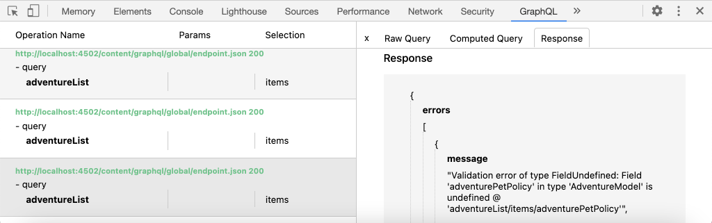

# 外部アプリからGraphQLを使用したクエリAEM

この章では、外部アプリケーションでエクスペリエンスを推進するためにAEM GraphQL APIを使用する方法について説明します。

このチュートリアルでは、シンプルなReactアプリを使用して、AEM GraphQL APIによって公開されたアドベンチャーコンテンツをクエリし、表示します。 Reactの使用はほとんど重要ではなく、消費する外部アプリケーションはあらゆるプラットフォームのあらゆるフレームワークに書き込むことができます。

## 前提条件

これは複数のパートから成るチュートリアルで、前のパートで説明した手順が完了していることを前提としています。

_この章のIDEスクリーンショットは、 [Visual Studio Codeから取得したものです](https://code.visualstudio.com/)_

オプションで、[GraphQL Network](https://chrome.google.com/webstore/detail/graphql-network/igbmhmnkobkjalekgiehijefpkdemocm)などのブラウザー拡張機能をインストールして、GraphQLクエリの詳細を表示できるようにします。

## 目的

この章では、次の方法について説明します。

* サンプルReactアプリの機能を開始および理解する
* 外部アプリからAEM GraphQLエンドポイントへの呼び出しの方法を調べる
* GraphQLクエリを定義し、アクティビティ別にアドベンチャーコンテンツフラグメントのリストをフィルタリングします
* Reactアプリを更新して、GraphQL（アクティビティ別の冒険のリスト）を介してフィルタリングするコントロールを提供します。

## Reactアプリを起動します。

この章では、GraphQL経由でコンテンツフラグメントを使用するクライアントの開発に重点を置いているので、サンプルの[WKND GraphQL Reactアプリソースコードをダウンロードしてローカルマシンに設定](./setup.md#react-app)し、[AEM SDKを[サンプルのWKNDサイトと共に実行します](./setup.md#wknd-site).](./setup.md#aem-sdk)

Reactアプリの起動について詳しくは、[クイックセットアップ](./setup.md)の章で説明していますが、簡潔な説明は以下の通りです。

1. まだの場合、サンプルWKND GraphQL Reactアプリを[Github.com](https://github.com/adobe/aem-guides-wknd-graphql)からコピーしてください。

   ```shell
   $ git clone --branch tutorial/react git@github.com:adobe/aem-guides-wknd-graphql.git
   ```

1. IDEでWKND GraphQL Reactアプリを開きます

   

1. コマンドラインから`react-app`フォルダーに移動します。
1. プロジェクトのルート（`react-app`フォルダー）から次のコマンドを実行して、WKND GraphQL Reactアプリを起動します。

   ```shell
   $ cd aem-guides-wknd-graphql/react-app
   $ npm start
   ```

1. [http://localhost:3000/](http://localhost:3000/)でアプリを確認します。 サンプルReactアプリには、次の2つの主要な部分があります。

   * GraphQLを使用してAEM内のコンテンツフラグメントに対して&#x200B;__アドベンチャー__&#x200B;をクエリすることで、ホームエクスペリエンスはWKNDアドベンチャーのインデックスとして機能します。 この章では、アクティビティによる冒険のフィルタリングをサポートするために、このビューを変更します。

      

   * アドベンチャーの詳細エクスペリエンス。GraphQLを使用して、特定の&#x200B;__アドベンチャー__&#x200B;コンテンツフラグメントをクエリし、さらに多くのデータポイントを表示します。

      

1. ブラウザーの開発ツールと、[GraphQL Network](https://chrome.google.com/webstore/detail/graphql-network/igbmhmnkobkjalekgiehijefpkdemocm)などのブラウザー拡張を使用して、AEMに送信されたGraphQLクエリとそのJSON応答を調べます。 このアプローチは、GraphQL要求と応答を監視して、正しく作成され、応答が期待どおりにおこなわれていることを確認するために使用できます。

   

   *ReactアプリからAEMに送信されたGraphQLクエリ*

   

   *AEMからReactアプリへのJSON応答*

   クエリと応答は、GraphiQL IDEで確認された内容と一致する必要があります。

   >[!NOTE]
   >
   > 開発時に、Reactアプリは、webpack開発サーバーを介してAEMにHTTPリクエストをプロキシするように設定されます。 Reactアプリは、`http://localhost:4502`上で動作するAEMオーサーサービスにプロキシする`http://localhost:3000`にリクエストを送信します。 詳細については、ファイル`src/setupProxy.js`と`env.development`を確認してください。
   >
   > 非開発シナリオでは、ReactアプリはAEMに直接リクエストをおこなうように設定されます。

## アプリのGraphQLコードの参照

1. IDEで`src/api/useGraphQL.js`ファイルを開きます。

   これは、アプリの`query`に対する変更をリッスンする[React効果フック](https://reactjs.org/docs/hooks-overview.html#effect-hook)で、変更時にAEM GraphQLエンドポイントに対してHTTPPOSTリクエストを実行し、アプリにJSON応答を返します。

   Reactアプリは、GraphQLクエリを作成する必要が生じるたびに、このカスタム`useGraphQL(query)`フックを呼び出し、GraphQLを渡してAEMに送信します。

   このフックは、単純な`fetch`モジュールを使用してHTTPPOSTGraphQLリクエストを作成しますが、[Apollo GraphQLクライアント](https://www.apollographql.com/docs/react/)などの他のモジュールも同様に使用できます。

1. IDEで`src/components/Adventures.js`を開き、ホームビューの冒険リストを作成し、`useGraphQL`フックの呼び出しを確認します。

   このコードは、このファイルで下に定義された`query`をデフォルトの`allAdventuresQuery`に設定します。

   ```javascript
   const [query, setQuery] = useState(allAdventuresQuery);
   ```

   と`query`変数が変更されるたびに`useGraphQL`フックが呼び出され、次にAEMに対してGraphQLクエリが実行され、JSONが`data`変数に返されます。この変数は、冒険のリストをレンダリングするために使用されます。

   ```javascript
   const { data, errorMessage } = useGraphQL(query);
   ```

   `allAdventuresQuery`は、ファイルで定義された定数のGraphQLクエリで、すべてのアドベンチャーコンテンツフラグメントに対してフィルタリングを行わずにクエリを実行し、ホームビューをレンダリングする必要のあるデータポイントのみを返します。

   ```javascript
   const allAdventuresQuery = `
   {
       adventureList {
         items {
           _path
           adventureTitle
           adventurePrice
           adventureTripLength
           adventurePrimaryImage {
           ... on ImageRef {
               _path
               mimeType
               width
               height
             }
           }
         }
     }
   }
   `;
   ```

1. `src/components/AdventureDetail.js`を開きます。アドベンチャーの詳細エクスペリエンスを表示するReactコンポーネントです。 この表示は、JCRパスを一意のIDとして使用して、特定のコンテンツフラグメントを要求し、提供された詳細をレンダリングします。

   `Adventures.js`と同様に、カスタムの`useGraphQL` React Hookを使用して、AEMに対してGraphQLクエリを実行します。

   コンテンツフラグメントのパスは、コンポーネントの`props`上部から収集され、クエリ対象のコンテンツフラグメントを指定するために使用されます。

   ```javascript
   const contentFragmentPath = props.location.pathname.substring(props.match.url.length);
   ```

   ...およびGraphQLパラメーター化クエリは、`adventureDetailQuery(..)`関数を使用して構築され、`useGraphQL(query)`に渡されます。このa1/>は、AEMに対してGraphQLクエリを実行し、結果を`data`変数に返します。

   ```javascript
   const { data, errorMessage } = useGraphQL(adventureDetailQuery(contentFragmentPath));
   ```

   `adventureDetailQuery(..)`関数は、フィルタリングGraphQLクエリをラップするだけです。このクエリでは、AEM `<modelName>ByPath`構文を使用して、JCRパスで識別される単一のコンテンツフラグメントをクエリし、アドベンチャーの詳細をレンダリングするために必要な指定したすべてのデータポイントを返します。

   ```javascript
   function adventureDetailQuery(_path) {
   return `{
       adventureByPath (_path: "${_path}") {
         item {
           _path
           adventureTitle
           adventureActivity
           adventureType
           adventurePrice
           adventureTripLength
           adventureGroupSize
           adventureDifficulty
           adventurePrice
           adventurePrimaryImage {
               ... on ImageRef {
               _path
               mimeType
               width
               height
               }
           }
           adventureDescription {
               html
           }
           adventureItinerary {
               html
           }
         }
       }
   }
   `;
   }
   ```

## パラメーター化されたGraphQLクエリの作成

次に、Reactアプリを変更して、パラメーター化されたフィルタリングを実行し、アドベンチャーのアクティビティによってホームビューを制限するGraphQLクエリを実行します。

1. IDEで、次のファイルを開きます。`src/components/Adventures.js`. このファイルは、ホームエクスペリエンスの冒険コンポーネントを表し、冒険カードを照会して表示します。
1. Inspect関数`filterQuery(activity)`は未使用ですが、`activity`によって冒険をフィルターするGraphQLクエリを作成するための準備が整っています。

   `activity`パラメーターは、`adventureActivity`フィールドの`filter`の一部としてGraphQLクエリに挿入され、そのパラメーターの値と一致するためにそのフィールドの値が必要になります。

   ```javascript
   function filterQuery(activity) {
       return `
           {
           adventures (filter: {
               adventureActivity: {
               _expressions: [
                   {
                   value: "${activity}"
                   }
                 ]
               }
           }){
               items {
               _path
               adventureTitle
               adventurePrice
               adventureTripLength
               adventurePrimaryImage {
               ... on ImageRef {
                   _path
                   mimeType
                   width
                   height
               }
               }
             }
         }
       }
       `;
   }
   ```

1. React Adventuresコンポーネントの`return`ステートメントを更新し、新しいパラメーター化`filterQuery(activity)`を呼び出すボタンを追加して、リストに表示するアドベンチャーを指定します。

   ```javascript
   function Adventures() {
       ...
       return (
           <div className="adventures">
   
           {/* Add these three new buttons that set the GraphQL query accordingly */}
   
           {/* The first button uses the default `allAdventuresQuery` */}
           <button onClick={() => setQuery(allAdventuresQuery)}>All</button>
   
           {/* The 2nd and 3rd button use the `filterQuery(..)` to filter by activity */}
           <button onClick={() => setQuery(filterQuery('Camping'))}>Camping</button>
           <button onClick={() => setQuery(filterQuery('Surfing'))}>Surfing</button>
   
           <ul className="adventure-items">
           ...
       )
   }
   ```

1. 変更を保存し、WebブラウザーでReactアプリをリロードします。 上部に3つの新しいボタンが表示され、それらをクリックすると、一致するアクティビティを持つAEM for Adventure Content Fragmentsに対するクエリが自動的に再実行されます。

   

1. アクティビティのフィルターボタンをさらに追加してみます。`Rock Climbing`、`Cycling`および`Skiing`

## GraphQLエラーの処理

GraphQLは厳密に型指定されているので、クエリが無効な場合は役立つエラーメッセージを返す可能性があります。 次に、誤ったクエリをシミュレートして、返されたエラーメッセージを確認します。

1. ファイル`src/api/useGraphQL.js`を再度開きます。 Inspectでエラー処理を確認するには、次のスニペットを使用します。

   ```javascript
   //useGraphQL.js
   .then(({data, errors}) => {
           //If there are errors in the response set the error message
           if(errors) {
               setErrors(mapErrors(errors));
           }
           //Otherwise if data in the response set the data as the results
           if(data) {
               setData(data);
           }
       })
       .catch((error) => {
           setErrors(error);
       });
   ```

   応答に`errors`オブジェクトが含まれているかどうかが調べられます。 GraphQLクエリに問題がある場合（スキーマに基づく未定義のフィールドなど）、AEMから`errors`オブジェクトが送信されます。 `errors`オブジェクトがない場合は、`data`が設定されて返されます。

   `window.fetch`には、*catch*&#x200B;に対する`.catch`ステートメントが含まれます。このステートメントは、無効なHTTPリクエストや、サーバーへの接続を確立できない場合などに発生します。

1. `src/components/Adventures.js` ファイルを開きます。
1. `allAdventuresQuery`を変更して、無効なプロパティ`adventurePetPolicy`を含めます。

   ```javascript
   /**
    * Query for all Adventures
    * adventurePetPolicy has been added beneath items
   */
   const allAdventuresQuery = `
   {
       adventureList {
         items {
           adventurePetPolicy
           _path
           adventureTitle
           adventurePrice
           adventureTripLength
           adventurePrimaryImage {
           ... on ImageRef {
               _path
               mimeType
               width
               height
           }
           }
         }
       }
   }
   `;
   ```

   `adventurePetPolicy`はアドベンチャーモデルの一部ではないので、エラーがトリガーするはずです。

1. 変更を保存し、ブラウザーに戻ります。 次のようなエラーメッセージが表示されます。

   

   GraphQL APIは、`AdventureModel`で`adventurePetPolicy`が定義されていないことを検出し、適切なエラーメッセージを返します。

1. ブラウザーの開発者ツールを使用してAEMからの応答をInspectし、`errors` JSONオブジェクトを確認します。

   

   `errors`オブジェクトは詳細で、形式が正しくないクエリの場所やエラーの分類に関する情報が含まれます。

1. `Adventures.js`に戻り、クエリの変更を元に戻して、アプリを適切な状態に戻します。

## バリデーターが{#congratulations}

バリデーターがサンプルWKND GraphQL Reactアプリのコードを確認し、パラメーター化されたGraphQLクエリを使用してGraphQLクエリをフィルタリングし、アクティビティ別の冒険をリストに追加しました。 また、基本的なエラー処理を調べる機会もありました。

## 次の手順 {#next-steps}

次の章の[フラグメント参照を使用した高度なデータモデリング](./fragment-references.md)では、フラグメント参照機能を使用して2つの異なるコンテンツフラグメント間の関係を作成する方法について説明します。 また、GraphQLクエリを変更して、参照モデルのフィールドを含める方法についても学習します。
