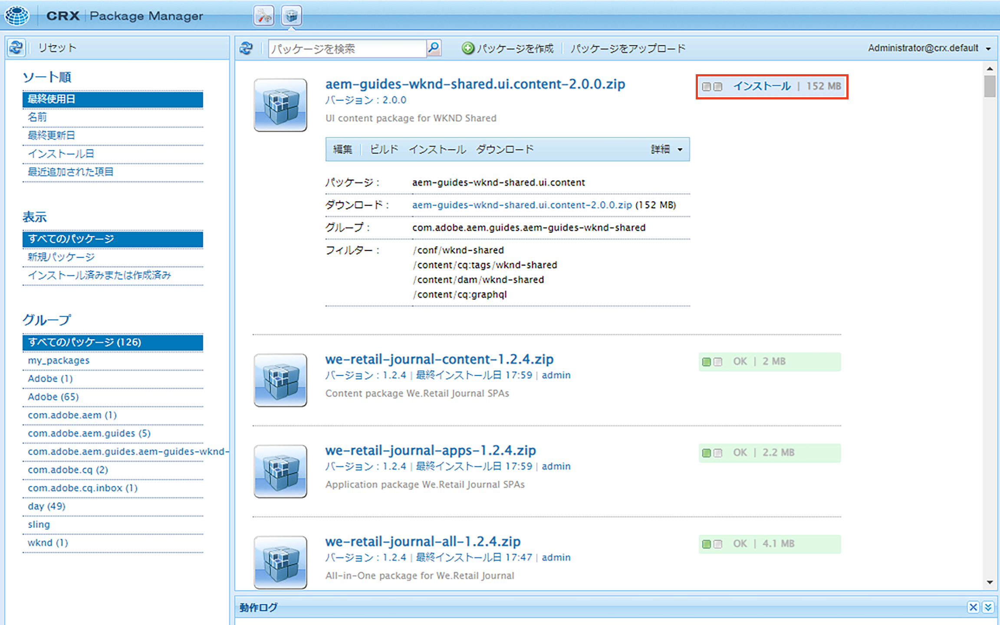

# AEM ヘッドレスの概要 - GraphQL

AEM GraphQL API を使用し、外部アプリで使用するコンテンツをヘッドレス CMS シナリオで構築および公開する方法を示す、エンドツーエンドのチュートリアルです。

このチュートリアルでは、AEM GraphQL API とヘッドレス機能を使用して、外部アプリで表示されるエクスペリエンスを強化する方法を説明します。

このチュートリアルでは、次のトピックについて説明します。

* 新しいプロジェクト設定を作成
* 新しいコンテンツフラグメントモデルを作成してデータをモデル化
* 以前に作成したモデルに基づいて、新しいコンテンツフラグメントを作成します。
* 統合 GraphiQL 開発ツールを使用して、AEMのコンテンツフラグメントを照会する方法を確認します。
* GraphQL クエリをAEMに保存または保持するには
* サンプル React アプリからの永続的な GraphQL クエリを使用

## 前提条件 {#prerequisites}

このチュートリアルに従うには、次の操作が必要です。

* 基本的なHTMLと JavaScript のスキル
* 以下のツールをローカルにインストールする必要があります。
   * [Node.js v10 以降](https://nodejs.org/ja/)
   * [npm 6 以降](https://www.npmjs.com/)
   * [Git](https://git-scm.com/)
   * IDE( 例： [Microsoft® Visual Studio Code](https://code.visualstudio.com/))

### AEM 環境

このチュートリアルを完了するには、Adobe Experience Manager環境が必要です。 次のいずれかを使用できます ( スクリーンショットはAEMas a Cloud Service環境から記録されます )。

* 次を使用したAEMas a Cloud Service環境：
   * [AEM as a Cloud Serviceおよび Cloud Manager へのアクセス](/help/cloud-service/accessing/overview.md)
      * **AEM Administrator** AEM as a Cloud Serviceへのアクセス
      * **Cloud Manager — 開発者** Cloud Manager へのアクセス

### サンプルコンテンツをインストール {#install-sample-content}

サンプルコンテンツがAEM環境で既に利用可能で、参照として使用できる場合に役立つ場合があります。

1. 次に移動： [AEM WKND 共有プロジェクト](https://github.com/adobe/aem-guides-wknd-shared/releases).
1. リリースされた最新のアセットをダウンロードします。 `aem-guides-wknd-shared.ui.content-x.x.x.zip`.
1. チュートリアルに使用するAEMオーサー環境にログインします。
1. AEMの開始画面から、に移動します。 **ツール** > **導入** > **パッケージ**:

   

1. タップ **パッケージをアップロード** を選択し、 `aem-guides-wknd-shared.ui.content-x.x.x.zip` ファイルをダウンロードしました。 タップ **Ok** をクリックしてアップロードします。
1. パッケージのアップロードが完了したら、 **インストール** をクリックして、コンテンツをインストールします。

   

1. 仮想的なには、サンプルコンテンツフラグメント、コンテンツフラグメントモデル、画像などがインストールされます [WKND ブランド](https://wknd.site/). サンプルコンテンツは、チュートリアルの後半で参照します。

## さあ始めましょう！

1. チュートリアルを開始する前に [コンテンツフラグメントモデルの定義](content-fragment-models.md).

## GitHub プロジェクト

ソースコードとコンテンツパッケージは、 [AEMガイド — WKND GraphQL GitHub プロジェクト](https://github.com/adobe/aem-guides-wknd-graphql).

チュートリアルまたはコードに問題がある場合は、 [GitHub の問題](https://github.com/adobe/aem-guides-wknd-graphql/issues).

サンプルコンテンツフラグメント、モデル、クエリは、 [AEM WKND 共有プロジェクト](https://github.com/adobe/aem-guides-wknd-shared)
