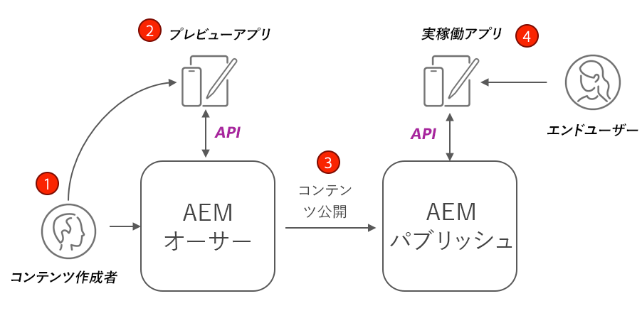
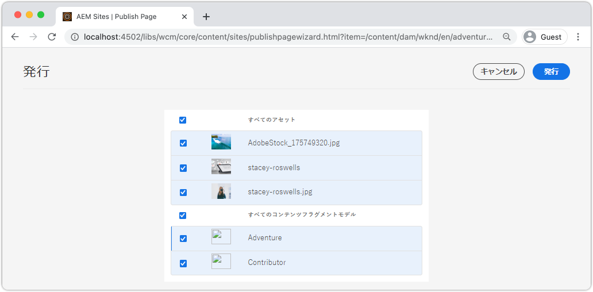

# AEM Publishサービスを使用した実稼働環境へのデプロイメント

このチュートリアルでは、ローカル環境を設定して、オーサーインスタンスからパブリッシュインスタンスにコンテンツが配布されるのをシミュレートします。 また、GraphQL APIを使用して、AEM Publish環境のコンテンツを使用するように設定されたリアクトアプリの実稼働版ビルドを生成します。 この過程で、環境変数を効果的に使用する方法と、AEM CORS設定を更新する方法について学びます。

## 前提条件

このチュートリアルは、マルチパートチュートリアルの一部です。 前述の手順が完了していることを前提としています。

## 目的

次の方法を学習します。

* AEMの作成者と発行のアーキテクチャについて説明します。
* 環境変数を管理するためのベストプラクティスについて説明します。
* 接触チャネル間のリソース共有(CORS)をAEMに適切に設定する方法を説明します。

## 作成発行配置パターン{#deployment-pattern}

完全なAEM環境は、作成者、発行、およびディスパッチャーで構成されます。 Authorサービスは、内部ユーザーがコンテンツを作成、管理およびプレビューする場所です。 発行サービスは「ライブ」環境と見なされ、通常はエンドユーザーが操作します。 コンテンツは、Authorサービスで編集および承認された後、Publishサービスに配信されます。

AEMヘッドレスアプリケーションで最も一般的なデプロイメントパターンは、実稼働版のアプリケーションをAEM Publishサービスに接続させることです。



上の図は、このような一般的な導入パターンを示しています。

1. **コンテンツ作成者**&#x200B;は、AEM authorサービスを使用して、コンテンツを作成、編集、管理します。
2. **コンテンツ作成者**&#x200B;および他の内部ユーザーは、Authorサービスで直接コンテンツをプレビューできます。 Authorサービスに接続するプレビュー版のアプリケーションを設定できます。
3. コンテンツが承認されると、AEM発行サービスに対して&#x200B;**発行済み**&#x200B;にできます。
4. **エンド** ユーザーは、アプリケーションの実稼働版を操作します。実稼動アプリケーションは、発行サービスに接続し、GraphQL APIを使用してコンテンツを要求し、使用します。

このチュートリアルでは、AEM発行インスタンスを現在の設定に追加することで、上記のデプロイメントをシミュレートします。 前の章では、React Appは作成者インスタンスに直接接続することでプレビューとして機能しました。 React Appの実稼動ビルドは、新しい発行インスタンスに接続する静的なNode.jsサーバーにデプロイされます。

最後に、3つのローカルサーバーが実行されます。

* http://localhost:4502 — 作成者インスタンス
* http://localhost:4503 — 発行インスタンス
* http://localhost:5000 — 実稼働モードでアプリを反応させ、発行インスタンスに接続します。

## AEM SDKのインストール — 発行モード{#aem-sdk-publish}

現在、**作成者**&#x200B;モードでSDKの実行インスタンスが存在します。 SDKは、**公開**&#x200B;モードで起動して、AEM公開環境をシミュレートすることもできます。

ローカル開発環境[の設定に関する詳細なガイドは、](https://experienceleague.adobe.com/docs/experience-manager-learn/cloud-service/local-development-environment-set-up/overview.html?lang=ja#local-development-environment-set-up)にあります。

1. ローカルファイルシステムで、発行インスタンスをインストールする専用のフォルダー（`~/aem-sdk/publish`という名前）を作成します。
1. 前のチャプターの作成者インスタンスに使用するQuickstart jarファイルをコピーし、`publish`ディレクトリに貼り付けます。 または、[ソフトウェア配布ポータル](https://experience.adobe.com/#/downloads/content/software-distribution/en/aemcloud.html)に移動し、最新のSDKをダウンロードしてQuickstart jarファイルを抽出します。
1. jarファイルの名前を`aem-publish-p4503.jar`に変更します。

   `publish`文字列は、発行モードでのQuickstart jar開始を指定します。 `p4503`は、Quickstartサーバーがポート4503で動作することを指定します。

1. 新しいターミナルウィンドウを開き、jarファイルを含むフォルダに移動します。 AEMインスタンスをインストールして開始します。

   ```shell
   $ cd ~/aem-sdk/publish
   $ java -jar aem-publish-p4503.jar
   ```

1. 管理者パスワードを`admin`として指定します。 任意の管理者パスワードを使用できますが、余分な設定を避けるために、ローカル開発のデフォルトを使用することをお勧めします。
1. AEMインスタンスのインストールが完了すると、新しいブラウザーウィンドウが[http://localhost:4503/content.html](http://localhost:4503/content.html)に開きます。

   404エラーページが返されることが予想されます。 これは新しいAEMインスタンスで、コンテンツがインストールされていません。

## サンプルコンテンツとGraphQLエンドポイント{#wknd-site-content-endpoints}をインストールします。

作成者インスタンスと同様に、発行インスタンスはGraphQLエンドポイントを有効にし、サンプルコンテンツを必要とします。 次に、WKNDリファレンスサイトを発行インスタンスにインストールします。

1. WKND用に最新のコンパイル済みAEMパッケージをダウンロードします。[aem-guides-wknd.all-x.x.x.zip](https://github.com/adobe/aem-guides-wknd/releases/latest)

   >[!NOTE]
   >
   > AEMと互換性のある標準バージョンをCloud Serviceとしてダウンロードし、`classic`バージョンでは&#x200B;**なく**&#x200B;してください。

1. 次の場所に直接移動して、発行インスタンスにログインします。[http://localhost:4503/libs/granite/core/content/login.html](http://localhost:4503/libs/granite/core/content/login.html)、ユーザー名`admin`、パスワード`admin`。
1. 次に、[http://localhost:4503/crx/packmgr/index.jsp](http://localhost:4503/crx/packmgr/index.jsp)にあるPackage Managerに移動します。
1. 「**パッケージをアップロード**」をクリックし、前の手順でダウンロードしたWKNDパッケージを選択します。 **「**&#x200B;をインストール」をクリックして、パッケージをインストールします。
1. パッケージのインストール後、WKNDリファレンスサイトが[http://localhost:4503/content/wknd/us/en.html](http://localhost:4503/content/wknd/us/en.html)で利用できるようになりました。
1. メニューバーの「サインアウト」ボタンをクリックして、`admin`ユーザーとしてサインアウトします。

   

   AEM作成者インスタンスとは異なり、AEM発行インスタンスは、デフォルトで匿名読み取り専用アクセスに設定されます。 Reactアプリケーションを実行する際の匿名ユーザーの体験をシミュレートします。

## 環境変数を更新して、発行インスタンス{#react-app-publish}を指すようにします。

次に、Reactアプリケーションが使用する環境変数を更新して、発行インスタンスを指定します。 リアクトアプリは、実稼働モードで発行インスタンスに&#x200B;**のみ**&#x200B;接続する必要があります。

次に、新しいファイル`.env.production.local`を追加して、実稼働環境をシミュレートします。

1. IDEでWKND GraphQL Reactアプリを開きます。

1. `aem-guides-wknd-graphql/react-app`の下に、`.env.production.local`という名前のファイルを追加します。
1. `.env.production.local` に以下を入力します。

   ```plain
   REACT_APP_HOST_URI=http://localhost:4503
   REACT_APP_GRAPHQL_ENDPOINT=/content/graphql/global/endpoint.json
   ```

   

   環境変数を使用すると、アプリケーションコード内にロジックを追加することなく、GraphQLエンドポイントを「作成者」エンドポイントと「発行」環境の間で簡単に切り替えることができます。 Reactの[カスタム環境変数について詳しくは、](https://create-react-app.dev/docs/adding-custom-environment-variables)を参照してください。

   >[!NOTE]
   >
   > 公開環境は、デフォルトでコンテンツへの匿名アクセスを提供するので、認証情報は含まれていないことを確認してください。

## 静的ノードサーバー{#static-server}を展開する

ReactアプリはWebPackサーバーを使用して起動できますが、開発のみを目的としています。 次に、[serve](https://github.com/vercel/serve)を使用して実稼働環境でのデプロイメントをシミュレートし、Node.jsを使用したReactアプリの実稼働環境でのビルドをホストします。

1. 新しいターミナルウィンドウを開き、`aem-guides-wknd-graphql/react-app`ディレクトリに移動します

   ```shell
   $ cd aem-guides-wknd-graphql/react-app
   ```

1. [serve](https://github.com/vercel/serve)を次のコマンドでインストールします。

   ```shell
   $ npm install serve --save-dev
   ```

1. `package.json`（`react-app/package.json`）ファイルを開きます。&lt;a0/追加>という名前のスクリプト：`serve`

   ```diff
    "scripts": {
       "start": "react-scripts start",
       "build": "react-scripts build",
       "test": "react-scripts test",
       "eject": "react-scripts eject",
   +   "serve": "npm run build && serve -s build"
   },
   ```

   `serve`スクリプトは2つの操作を実行します。 まず、React Appの実稼働版ビルドが生成されます。 2つ目は、Node.jsサーバーの開始と実稼働版のビルドを使用することです。

1. ターミナルに戻り、次のコマンドを入力して静的サーバーを開始します。

   ```shell
   $ npm run serve
   
   ┌────────────────────────────────────────────────────┐
   │                                                    │
   │   Serving!                                         │
   │                                                    │
   │   - Local:            http://localhost:5000        │
   │   - On Your Network:  http://192.168.86.111:5000   │
   │                                                    │
   │   Copied local address to clipboard!               │
   │                                                    │
   └────────────────────────────────────────────────────┘
   ```

1. 新しいブラウザーを開き、[http://localhost:5000/](http://localhost:5000/)に移動します。 React Appが提供されます。

   

   GraphQLクエリがホームページで動作していることに注意してください。 **XHR**&#x200B;リクエストをInspectが開発者ツールを使用して送信します。 GraphQLPOSTが`http://localhost:4503/content/graphql/global/endpoint.json`の発行インスタンスに対するものであることを確認します。

   しかし、ホームページ上の画像はすべて壊れています。

1. アドベンチャーの詳細ページの1つをクリックして選択します。

   

   `adventureContributor`に対してGraphQLエラーがスローされることを確認します。 次の演習では、壊れたイメージと`adventureContributor`の問題を修正します。

## 絶対画像参照{#absolute-image-references}

``タグを作成する際に、`function AdventureItem(props)`の`AdventureItem`コンポーネントを変更して、`_path`プロパティではなく`_publishUrl`を参照します。

   ```diff
   - 
   + 
   ```

1. `AdventureDetail.js`（`react-app/src/components/AdventureDetail.js`）ファイルを開きます。
1. 同じ手順を繰り返してGraphQLクエリを変更し、アドベンチャー用に`_publishUrl`プロパティを追加します

   ```diff
    adventureByPath (_path: "${_path}") {
       item {
           _path
           adventureTitle
           adventureActivity
           adventureType
           adventurePrice
           adventureTripLength
           adventureGroupSize
           adventureDifficulty
           adventurePrice
           adventurePrimaryImage {
               ... on ImageRef {
               _path
   +           _publishUrl
               mimeType
               width
               height
               }
           }
           adventureDescription {
               html
           }
           adventureItinerary {
               html
           }
           adventureContributor {
               fullName
               occupation
               pictureReference {
                   ...on ImageRef {
                       _path
   +                   _publishUrl
                   }
               }
           }
       }
       }
   } 
   ```

1. `AdventureDetail.js`内のアドベンチャープライマリ画像と寄稿者画像参照の2つの``タグを変更します。

   ```diff
   /* AdventureDetail.js */
   ...
   
   ...
   pictureReference =  
   ```

1. ターミナルに戻り、静的サーバーの開始を確認します。

   ```shell
   $ npm run serve
   ```

1. [http://localhost:5000/](http://localhost:5000/)に移動し、画像が表示され、``属性が`http://localhost:4503`を指していることを確認します。

   

## コンテンツ公開をシミュレート{#content-publish}

アドベンチャーの詳細ページが要求されると、`adventureContributor`に対してGraphQLエラーがスローされます。 **寄稿者**&#x200B;コンテンツフラグメントモデルは、まだ発行インスタンスに存在しません。 **アドベンチャー**&#x200B;コンテンツフラグメントモデルに対する更新も、発行インスタンスでは使用できません。 これらの変更は作成者インスタンスに直接行われたので、発行インスタンスに配布する必要があります。

これは、コンテンツフラグメントまたはコンテンツフラグメントモデルの更新に依存するアプリケーションに新しい更新を展開する際に考慮する必要があります。

次に、ローカルの作成者インスタンスと発行インスタンス間でのコンテンツの公開をシミュレートします。

1. オーサーインスタンスを開始し（まだ起動していない場合）、Package Manager([http://localhost:4502/crx/packmgr/index.jsp](http://localhost:4502/crx/packmgr/index.jsp))に移動します。
1. パッケージ[EnableReplicationAgent.zip](./assets/publish-deployment/EnableReplicationAgent.zip)をダウンロードし、Package Managerを使用してインストールします。

   このパッケージは、作成者インスタンスがコンテンツを発行インスタンスに発行できるようにする設定をインストールします。 [この設定の手動の手順は、](https://experienceleague.adobe.com/docs/experience-manager-learn/cloud-service/local-development-environment-set-up/aem-runtime.html?lang=en#content-distribution)にあります。

   >[!NOTE]
   >
   > Cloud Service環境としてのAEMでは、作成者層は、コンテンツを発行層に配布するように自動的に設定されます。

1. **AEM開始**&#x200B;メニューから、**ツール**/**アセット**/**コンテンツフラグメントモデル**&#x200B;に移動します。

1. **WKND Site**&#x200B;フォルダーをクリックします。

1. 3つのモデルをすべて選択し、**発行**&#x200B;をクリックします。

   

   確認ダイアログが表示されたら、「**発行**」をクリックします。

1. [http://localhost:4502/editor.html/content/dam/wknd/en/adventures/bali-surf-camp/bali-surf-camp](http://localhost:4502/editor.html/content/dam/wknd/en/adventures/bali-surf-camp/bali-surf-camp)にあるBali Surf Camp Content Fragmentに移動します。

1. 上部のメニューバーの「**公開**」ボタンをクリックします。

   

1. 発行ウィザードに、発行する必要がある依存アセットが表示されます。 この場合、参照先のフラグメント&#x200B;**stacey-roswells**&#x200B;が一覧表示され、複数の画像も参照されます。 参照されたアセットは、フラグメントと共に発行されます。

   

   「**発行**」ボタンをもう一度クリックして、コンテンツフラグメントと依存アセットを発行します。

1. [http://localhost:5000/](http://localhost:5000/)で実行されているReact Appに戻ります。 バリサーフキャンプをクリックして、アドベンチャーの詳細を見ることができます。

1. [http://localhost:4502/editor.html/content/dam/wknd/en/adventures/bali-surf-camp/bali-surf-camp](http://localhost:4502/editor.html/content/dam/wknd/en/adventures/bali-surf-camp/bali-surf-camp)にあるAEM作成者インスタンスに戻り、フラグメントの&#x200B;**タイトル**&#x200B;を更新します。 **フラグメントを保存して** 閉じます。次に、フラグメントを&#x200B;**発行**&#x200B;します。
1. [http://localhost:5000/adventure:/content/dam/wknd/en/adventures/bali-surf-camp/bali-surf-camp](http://localhost:5000/adventure:/content/dam/wknd/en/adventures/bali-surf-camp/bali-surf-camp)に戻り、公開された変更を確認します。

   

## COR構成の更新

AEMはデフォルトで保護されており、AEM以外のwebプロパティでクライアント側の呼び出しを行うことはできません。 AEMクロス接触チャネルリソース共有(CORS)設定では、特定のドメインがAEMに対する呼び出しを行えるように設定できます。

次に、AEM発行インスタンスのCORS設定を試します。

1. `npm run serve`コマンドを実行してReact Appを実行しているターミナルウィンドウに戻ります。

   ```shell
   ┌────────────────────────────────────────────────────┐
   │                                                    │
   │   Serving!                                         │
   │                                                    │
   │   - Local:            http://localhost:5000        │
   │   - On Your Network:  http://192.168.86.205:5000   │
   │                                                    │
   │   Copied local address to clipboard!               │
   │                                                    │
   └────────────────────────────────────────────────────┘
   ```

   2つのURLが提供されることを確認します。 1つは`localhost`を使用し、もう1つはローカルネットワークのIPアドレスを使用します。

1. [http://192.168.86.XXX:5000](http://192.168.86.XXX:5000)で始まるアドレスに移動します。 アドレスは、ローカルコンピューターごとに少し異なります。 データを取得する際に、CORSエラーが発生することを確認します。 これは、現在のCORS設定では`localhost`からのリクエストのみが許可されているためです。

   

   次に、AEM発行CORSの設定を更新して、ネットワークIPアドレスからの要求を許可します。

1. [http://localhost:4503/content/wknd/us/en/errors/sign-in.html](http://localhost:4503/content/wknd/us/en/errors/sign-in.html)に移動し、ユーザー名`admin`とパスワード`admin`を使用してサインインします。

1. [http://localhost:4503/system/console/configMgr](http://localhost:4503/system/console/configMgr)に移動し、`com.adobe.granite.cors.impl.CORSPolicyImpl~wknd-graphql`にあるWKND GraphQL設定を探します。

1. **許可されている接触チャネル**&#x200B;フィールドを更新して、ネットワークIPアドレスを含めます。

   

   また、特定のサブドメインからのすべてのリクエストを許可する正規式を含めることもできます。 変更内容を保存します。

1. **Apache Sling転送者フィルター**&#x200B;を検索し、設定を確認します。 外部ドメインからのGraphQL要求を有効にするには、**Allow Empty**&#x200B;設定も必要です。

   

   これらは、WKNDリファレンスサイトの一部として設定されています。 [GitHubリポジトリ](https://github.com/adobe/aem-guides-wknd/tree/master/ui.config/src/main/content/jcr_root/apps/wknd/osgiconfig)を介して、OSGiの完全な構成を表示できます。

   >[!NOTE]
   >
   > OSGi構成は、ソース管理にコミットされているAEMプロジェクトで管理されます。 AEMプロジェクトは、Cloud Managerを使用して、Cloud Service環境としてAEMにデプロイできます。 [AEMプロジェクトのアーキタイプ](https://github.com/adobe/aem-project-archetype)は、特定の実装用のプロジェクトを生成するのに役立ちます。

1. [http://192.168.86.XXX:5000](http://192.168.86.XXX:5000)で始まるReact Appに戻り、アプリケーションがCORSエラーをスローしないことを確認します。

   

## これで完了です! {#congratulations}

バリデーターがこれで、AEM Publish環境を使用した実稼働環境の完全なデプロイメントをシミュレートしました。 また、AEMでのCORS設定の使用方法も学習しました。

## その他のリソース

コンテンツフラグメントとGraphQLの詳細については、次のリソースを参照してください。

* [GraphQL のコンテンツフラグメントを使用したヘッドレスコンテンツ配信](https://experienceleague.adobe.com/docs/experience-manager-cloud-service/assets/content-fragments/content-fragments-graphql.html?lang=ja)
* [コンテンツフラグメントと共に使用する AEM GraphQL API](https://experienceleague.adobe.com/docs/experience-manager-cloud-service/assets/admin/graphql-api-content-fragments.html?lang=ja)
* [トークンベースの認証](https://experienceleague.adobe.com/docs/experience-manager-learn/getting-started-with-aem-headless/authentication/overview.html?lang=ja#authentication)
* [Cloud ServiceとしてのAEMへのコードのデプロイ](https://experienceleague.adobe.com/docs/experience-manager-learn/cloud-service/cloud-manager/devops/deploy-code.html?lang=en#cloud-manager)
