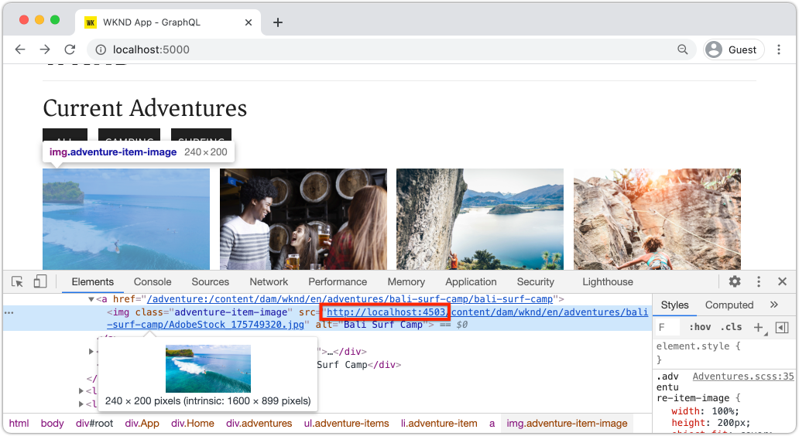
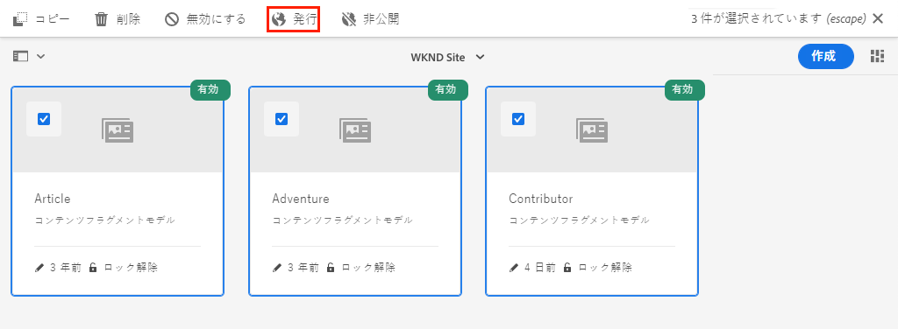
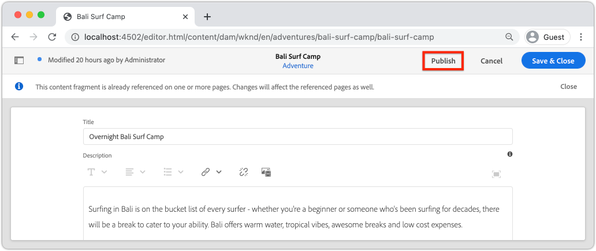

# AEM パブリッシュサービスを使用した実稼動のデプロイメント

このチュートリアルでは、オーサーインスタンスからパブリッシュインスタンスに配信されるコンテンツをシミュレートするローカル環境を設定します。 また、GraphQL API を使用して、AEM パブリッシュ環境のコンテンツを使用するように設定された React アプリの実稼動ビルドを生成します。 この過程で、環境変数を効果的に使用する方法と、AEM CORS 設定を更新する方法について学びます。

## 前提条件

このチュートリアルは、マルチパートチュートリアルの一部です。 前述の手順が完了したと仮定します。

## 目的

以下の方法を学ぶ：

* AEM オーサーとパブリッシュのアーキテクチャを理解します。
* 環境変数を管理するためのベストプラクティスについて説明します。
* クロスオリジンリソース共有 (CORS) 用にAEMを適切に設定する方法を説明します。

## オーサー公開デプロイメントパターン {#deployment-pattern}

完全な AEM 環境は、オーサー、パブリッシュ、ディスパッチャーで構成されます。オーサーサービスでは、内部ユーザーがコンテンツの作成、管理、プレビューを行います。パブリッシュサービスは「ライブ」環境と見なされ、通常はエンドユーザーがやり取りする環境です。 コンテンツは、オーサーサービスで編集および承認された後、パブリッシュサービスに配信されます。

AEM ヘッドレスアプリケーションで最も一般的なデプロイメントパターンは、実稼動版のアプリケーションを AEM パブリッシュサービスに接続させることです。


上の図は、この一般的なデプロイメントパターンを示しています。

1. A **コンテンツ作成者** は、AEMオーサーサービスを使用して、コンテンツを作成、編集および管理します。
2. **コンテンツ作成者**&#x200B;とその他の内部ユーザーは、コンテンツをオーサーサービスで直接プレビューできます。オーサーサービスに接続する、アプリケーションのプレビューバージョンをセットアップできます。
3. 承認されたコンテンツは、 **公開済み** を AEM パブリッシュサービスに追加します。
4. **エンドユーザーは、アプリケーションの実稼動バージョンを操作します。**&#x200B;実稼動アプリケーションは、パブリッシュサービスに接続し、GraphQL API を使用してコンテンツを要求して使用します。

このチュートリアルでは、AEM パブリッシュインスタンスを現在の設定に追加することで、上記のデプロイメントをシミュレートします。 以前の章では、React アプリは、オーサーインスタンスに直接接続することで、プレビューとして機能しました。 React App の実稼動ビルドは、新しいパブリッシュインスタンスに接続する静的な Node.js サーバーにデプロイされます。

最後に、3 台のローカルサーバーが実行されています。

* http://localhost:4502 — オーサーインスタンス
* http://localhost:4503 — パブリッシュインスタンス
* http://localhost:5000 — 実稼動モードでの React アプリ。パブリッシュインスタンスに接続します。

## AEM SDK — 公開モードのインストール {#aem-sdk-publish}

現在、で SDK の実行インスタンスを使用しています。 **作成者** モード。 SDK は、 **公開** モードを使用して、AEM パブリッシュ環境をシミュレートします。

ローカル開発環境の設定に関する詳細なガイド [ここにあります](https://experienceleague.adobe.com/docs/experience-manager-learn/cloud-service/local-development-environment-set-up/overview.html?lang=ja#local-development-environment-set-up).

1. ローカルファイルシステムで、パブリッシュインスタンスをインストールする専用のフォルダーを作成します。名前は次のとおりです。 `~/aem-sdk/publish`.
1. 以前の章のオーサーインスタンスで使用したクイックスタート JAR ファイルをコピーし、次の場所に貼り付けます。 `publish` ディレクトリ。 または、 [ソフトウェア配布ポータル](https://experience.adobe.com/#/downloads/content/software-distribution/en/aemcloud.html) 最新の SDK をダウンロードし、クイックスタート jar ファイルを抽出します。
1. jar ファイルの名前をに変更します。 `aem-publish-p4503.jar`.

   この `publish` string は、クイックスタート jar が公開モードで開始することを指定します。 この `p4503` は、クイックスタートサーバーがポート 4503 で実行されることを指定します。

1. 新しいターミナルウィンドウを開き、jar ファイルを含むフォルダーに移動します。 AEMインスタンスをインストールして起動します。

   ```shell
   $ cd ~/aem-sdk/publish
   $ java -jar aem-publish-p4503.jar
   ```

1. 管理者パスワードをとして入力 `admin`. admin パスワードはすべて使用できますが、追加の設定を避けるために、ローカル開発のデフォルトを使用することをお勧めします。
1. AEMインスタンスのインストールが完了すると、新しいブラウザーウィンドウが [http://localhost:4503/content.html](http://localhost:4503/content.html)

   404 Not Found（404 が見つかりません）というページが返されることが想定されています。 これは新しいAEMインスタンスであり、コンテンツがインストールされていません。

## サンプルコンテンツと GraphQL エンドポイントのインストール {#wknd-site-content-endpoints}

オーサーインスタンスと同様に、パブリッシュインスタンスも GraphQL エンドポイントを有効にし、サンプルコンテンツを必要とします。 次に、WKND 参照サイトをパブリッシュインスタンスにインストールします。

1. WKND サイト用に最新のコンパイル済みAEMパッケージをダウンロードします。 [aem-guides-wknd.all-x.x.x.zip](https://github.com/adobe/aem-guides-wknd/releases/latest).

   >[!NOTE]
   >
   > AEM as a Cloud Serviceおよび **not** の `classic` バージョン。

1. 次の場所に直接移動して、パブリッシュインスタンスにログインします。 [http://localhost:4503/libs/granite/core/content/login.html](http://localhost:4503/libs/granite/core/content/login.html) とユーザー名 `admin` およびパスワード `admin`.
1. 次に、パッケージマネージャー ( ) に移動します。 [http://localhost:4503/crx/packmgr/index.jsp](http://localhost:4503/crx/packmgr/index.jsp).
1. クリック **パッケージをアップロード** 前の手順でダウンロードした WKND パッケージを選択します。 「**インストール**」をクリックして、パッケージをインストールします。
1. パッケージをインストールした後、WKND リファレンスサイトを次の場所で利用できるようになりました。 [http://localhost:4503/content/wknd/us/en.html](http://localhost:4503/content/wknd/us/en.html).
1. を `admin` ユーザーがメニューバーの「サインアウト」ボタンをクリックすると、

   

   AEM オーサーインスタンスとは異なり、AEM パブリッシュインスタンスは、デフォルトで匿名の読み取り専用アクセス権を持ちます。 React アプリケーションの実行時に、匿名ユーザーのエクスペリエンスをシミュレートします。

## 環境変数を更新して、パブリッシュインスタンスを指すようにします。 {#react-app-publish}

次に、React アプリケーションで使用される環境変数を更新し、パブリッシュインスタンスを指すようにします。 React アプリが実行する手順 **のみ** 実稼働モードでパブリッシュインスタンスに接続します。

次に、新しいファイルを追加します。 `.env.production.local` 実稼働環境をシミュレートする場合。

1. IDE で WKND GraphQL React アプリを開きます。

1. の下 `aem-guides-wknd-graphql/react-app`、という名前のファイルを追加します。 `.env.production.local`.
1. `.env.production.local` に以下を入力します。

   ```plain
   REACT_APP_HOST_URI=http://localhost:4503
   REACT_APP_GRAPHQL_ENDPOINT=/content/graphql/global/endpoint.json
   ```

   

   環境変数を使用すると、アプリケーションコード内にロジックを追加することなく、オーサー環境とパブリッシュ環境の間で GraphQL エンドポイントを簡単に切り替えることができます。 詳細情報： [React のカスタム環境変数は、こちらを参照してください。](https://create-react-app.dev/docs/adding-custom-environment-variables).

   >[!NOTE]
   >
   > パブリッシュ環境は、デフォルトでコンテンツへの匿名アクセスを提供するので、認証情報は含まれていないことを確認します。

## 静的ノードサーバの展開 {#static-server}

React アプリは webpack サーバーを使用して起動できますが、開発専用です。 次に、次を使用して実稼動環境の配置をシミュレートします。 [提供する](https://github.com/vercel/serve) Node.js を使用して React アプリの実稼動ビルドをホストする場合。

1. 新しいターミナルウィンドウを開き、 `aem-guides-wknd-graphql/react-app` directory

   ```shell
   $ cd aem-guides-wknd-graphql/react-app
   ```

1. インストール [提供する](https://github.com/vercel/serve) 次のコマンドを使用します。

   ```shell
   $ npm install serve --save-dev
   ```

1. `package.json`（`react-app/package.json`）ファイルを開きます。という名前のスクリプトを追加します。 `serve`:

   ```diff
    "scripts": {
       "start": "react-scripts start",
       "build": "react-scripts build",
       "test": "react-scripts test",
       "eject": "react-scripts eject",
   +   "serve": "npm run build && serve -s build"
   },
   ```

   この `serve` スクリプトは 2 つのアクションを実行します。 まず、React App の実稼動ビルドが生成されます。 次に、Node.js サーバーが起動し、実稼動ビルドを使用します。

1. ターミナルに戻り、次のコマンドを入力して静的サーバーを起動します。

   ```shell
   $ npm run serve
   
   ┌────────────────────────────────────────────────────┐
   │                                                    │
   │   Serving!                                         │
   │                                                    │
   │   - Local:            http://localhost:5000        │
   │   - On Your Network:  http://192.168.86.111:5000   │
   │                                                    │
   │   Copied local address to clipboard!               │
   │                                                    │
   └────────────────────────────────────────────────────┘
   ```

1. 新しいブラウザーを開き、に移動します。 [http://localhost:5000/](http://localhost:5000/). React アプリが提供されていることを確認します。

   

   GraphQL クエリは、ホームページで動作しています。 Inspect **XHR** リクエストに使用できます。 GraphQLPOSTがパブリッシュインスタンスに対してであることを確認します。 `http://localhost:4503/content/graphql/global/endpoint.json`.

   ただし、ホームページ上のすべての画像が壊れます。

1. アドベンチャーの詳細ページの 1 つをクリックします。

   

   GraphQL エラーが `adventureContributor`. 次の演習では、壊れた画像と `adventureContributor` 問題が修正されました。

## 絶対画像参照 {#absolute-image-references}

画像は、 `` タグ：

   ```diff
   - 
   + 
   ```

1. `AdventureDetail.js`（`react-app/src/components/AdventureDetail.js`）ファイルを開きます。
1. 同じ手順を繰り返して、GraphQL クエリを変更し、 `_publishUrl` 冒険の財産

   ```diff
    adventureByPath (_path: "${_path}") {
       item {
           _path
           adventureTitle
           adventureActivity
           adventureType
           adventurePrice
           adventureTripLength
           adventureGroupSize
           adventureDifficulty
           adventurePrice
           adventurePrimaryImage {
               ... on ImageRef {
               _path
   +           _publishUrl
               mimeType
               width
               height
               }
           }
           adventureDescription {
               html
           }
           adventureItinerary {
               html
           }
           adventureContributor {
               fullName
               occupation
               pictureReference {
                   ...on ImageRef {
                       _path
   +                   _publishUrl
                   }
               }
           }
       }
       }
   } 
   ```

1. 2 つを変更 `` アドベンチャープライマリの画像とコントリビューター画像の参照用のタグ ( `AdventureDetail.js`:

   ```diff
   /* AdventureDetail.js */
   ...
   
   ...
   pictureReference =  
   ```

1. ターミナルに戻り、静的サーバーを起動します。

   ```shell
   $ npm run serve
   ```

1. に移動します。 [http://localhost:5000/](http://localhost:5000/) そして画像が現れ `` 属性が指す `http://localhost:4503`.

   

## コンテンツ公開をシミュレート {#content-publish}

GraphQL エラーが `adventureContributor` アドベンチャーの詳細ページがリクエストされたとき。 この **寄稿者** コンテンツフラグメントモデルがパブリッシュインスタンスにまだ存在しません。 更新： **冒険** コンテンツフラグメントモデルは、パブリッシュインスタンスでは使用できません。 これらの変更はオーサーインスタンスに直接加えられたので、パブリッシュインスタンスに配布する必要があります。

これは、コンテンツフラグメントまたはコンテンツフラグメントモデルの更新に依存するアプリケーションに対して新しい更新を展開する際に考慮すべきことです。

次に、ローカルのオーサーインスタンスとパブリッシュインスタンス間でのコンテンツの公開をシミュレートします。

1. オーサーインスタンスを起動し（まだ起動していない場合）、パッケージマネージャー ( ) に移動します。 [http://localhost:4502/crx/packmgr/index.jsp](http://localhost:4502/crx/packmgr/index.jsp)
1. パッケージをダウンロード [EnableReplicationAgent.zip](./assets/publish-deployment/EnableReplicationAgent.zip) をクリックし、パッケージマネージャーを使用してインストールします。

   このパッケージでは、オーサーインスタンスがパブリッシュインスタンスにコンテンツを公開できるようにする設定がインストールされます。 手動手順 [この設定は、こちらから参照できます。](https://experienceleague.adobe.com/docs/experience-manager-learn/cloud-service/local-development-environment-set-up/aem-runtime.html?lang=en#content-distribution).

   >[!NOTE]
   >
   > AEMas a Cloud Service環境では、オーサー層は、コンテンツをパブリッシュ層に配布するように自動的に設定されます。

1. 次の **AEM Start** メニュー、移動 **ツール** > **Assets** > **コンテンツフラグメントモデル**.

1. をクリックして、 **WKND サイト** フォルダー。

1. 3 つのモデルをすべて選択し、 **公開**:

   

   確認ダイアログが表示されます。 **公開**.

1. Bali Surf Camp コンテンツフラグメント ( ) に移動します。 [http://localhost:4502/editor.html/content/dam/wknd/en/adventures/bali-surf-camp/bali-surf-camp](http://localhost:4502/editor.html/content/dam/wknd/en/adventures/bali-surf-camp/bali-surf-camp).

1. 次をクリック： **公開** ボタンをクリックします。

   

1. 公開ウィザードに、公開する必要のある依存アセットが表示されます。 この場合、参照先のフラグメント **積み重ねのロズセル** が一覧表示され、複数の画像も参照されます。 参照されるアセットがフラグメントと共に公開されます。

   

   次をクリック： **公開** ボタンを再度クリックして、コンテンツフラグメントと依存アセットを公開します。

1. で実行中の React アプリに戻る [http://localhost:5000/](http://localhost:5000/). バリサーフキャンプをクリックして、冒険の詳細を見ることができます。

1. AEM オーサーインスタンス ( ) に戻します。 [http://localhost:4502/editor.html/content/dam/wknd/en/adventures/bali-surf-camp/bali-surf-camp](http://localhost:4502/editor.html/content/dam/wknd/en/adventures/bali-surf-camp/bali-surf-camp) を更新し、 **タイトル** 」と入力します。 **保存して閉じる** フラグメント。 次に、 **公開** フラグメント。
1. 戻る [http://localhost:5000/adventure:/content/dam/wknd/en/adventures/bali-surf-camp/bali-surf-camp](http://localhost:5000/adventure:/content/dam/wknd/en/adventures/bali-surf-camp/bali-surf-camp) 公開された変更を確認します。

   

## COR 設定を更新

AEMはデフォルトで保護されており、AEM以外の Web プロパティによるクライアント側呼び出しを許可していません。 AEM Cross-Origin Resource Sharing(CORS) 設定を使用すると、特定のドメインでAEMを呼び出すことができます。

次に、AEM パブリッシュインスタンスの CORS 設定を試します。

1. コマンドを使用して React App を実行しているターミナルウィンドウに戻ります。 `npm run serve`:

   ```shell
   ┌────────────────────────────────────────────────────┐
   │                                                    │
   │   Serving!                                         │
   │                                                    │
   │   - Local:            http://localhost:5000        │
   │   - On Your Network:  http://192.168.86.205:5000   │
   │                                                    │
   │   Copied local address to clipboard!               │
   │                                                    │
   └────────────────────────────────────────────────────┘
   ```

   2 つの URL が提供されていることを確認します。 1 つは `localhost` ローカルネットワークの IP アドレスを使用している別のユーザー

1. で始まるアドレスに移動します。 [http://192.168.86.XXX:5000](http://192.168.86.XXX:5000). アドレスは、ローカルコンピューターごとに少し異なります。 データを取得する際に、CORS エラーが発生することを確認します。 これは、現在の CORS 設定ではからのリクエストのみが許可されているからです。 `localhost`.

   

   次に、「 AEM 公開 CORS 」設定を更新して、ネットワーク IP アドレスからのリクエストを許可します。

1. に移動します。 [http://localhost:4503/content/wknd/us/en/errors/sign-in.html](http://localhost:4503/content/wknd/us/en/errors/sign-in.html) ユーザー名でサインイン `admin` およびパスワード `admin`.

1. に移動します。 [http://localhost:4503/system/console/configMgr](http://localhost:4503/system/console/configMgr) と WKND GraphQL 設定をで見つけます。 `com.adobe.granite.cors.impl.CORSPolicyImpl~wknd-graphql`.

1. を更新します。 **許可されたオリジン** ネットワーク IP アドレスを含めるフィールド：

   

   また、特定のサブドメインからのすべてのリクエストを許可する正規表現を含めることもできます。 変更を保存します。

1. を検索 **Apache Sling Referrer Filter** 設定を確認します。 この **空を許可** 外部ドメインからの GraphQL リクエストを有効にするには、も設定する必要があります。

   

   これらは、WKND リファレンスサイトの一部として設定されています。 OSGi 設定の完全なセットは、 [GitHub リポジトリ](https://github.com/adobe/aem-guides-wknd/tree/master/ui.config/src/main/content/jcr_root/apps/wknd/osgiconfig).

   >[!NOTE]
   >
   > OSGi 設定は、ソース管理にコミットされたAEMプロジェクトで管理されます。 AEMプロジェクトは、Cloud Manager を使用して、AEM環境としてCloud Service環境としてデプロイできます。 この [AEM Project Archetype](https://github.com/adobe/aem-project-archetype) は、特定の実装のプロジェクトを生成するのに役立ちます。

1. React アプリに戻る [http://192.168.86.XXX:5000](http://192.168.86.XXX:5000) また、アプリケーションが CORS エラーをスローしなくなったことを確認します。

   

## おめでとうございます。 {#congratulations}

おめでとうございます。これで、AEM パブリッシュ環境を使用した実稼動デプロイメント全体をシミュレートしました。 また、AEMでの CORS 設定の使用方法についても学習しました。

## その他のリソース

コンテンツフラグメントと GraphQL について詳しくは、次のリソースを参照してください。

* [GraphQL のコンテンツフラグメントを使用したヘッドレスコンテンツ配信](https://experienceleague.adobe.com/docs/experience-manager-cloud-service/assets/content-fragments/content-fragments-graphql.html?lang=ja)
* [コンテンツフラグメントと共に使用する AEM GraphQL API](https://experienceleague.adobe.com/docs/experience-manager-cloud-service/assets/admin/graphql-api-content-fragments.html?lang=ja)
* [トークンベースの認証](https://experienceleague.adobe.com/docs/experience-manager-learn/getting-started-with-aem-headless/authentication/overview.html?lang=ja#authentication)
* [コードのAEMへのデプロイas a Cloud Service](https://experienceleague.adobe.com/docs/experience-manager-learn/cloud-service/cloud-manager/devops/deploy-code.html?lang=en#cloud-manager)
