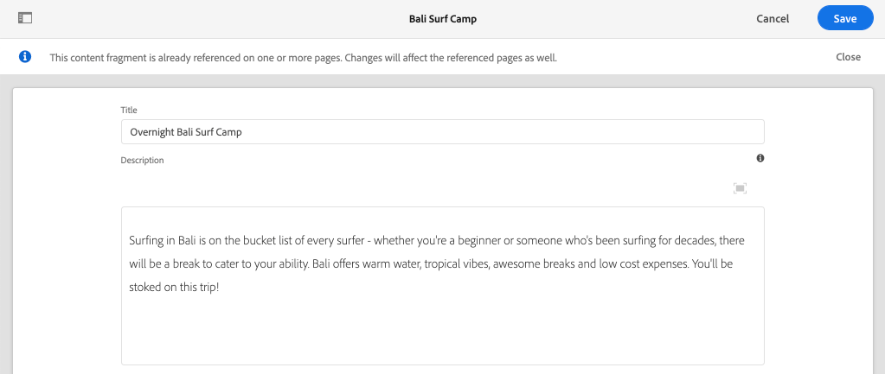

# クイックセットアップ {#setup}

この章では、ローカル環境の簡単なセットアップを提供し、外部アプリケーションがAEM GraphQL APIを使用してAEMのコンテンツを使用することを確認します。 このチュートリアルの後半の章は、この設定から構築されます。

## 前提条件 {#prerequisites}

次のツールをローカルにインストールする必要があります。

* [JDK 11](https://experience.adobe.com/#/downloads/content/software-distribution/en/general.html?1_group.propertyvalues.property=.%2Fjcr%3Acontent%2Fmetadata%2Fdc%3AsoftwareType&amp;1_group.propertyvalues.operation=equals&amp;1_group.propertyvalues.0_values=software-type%3Autoling&amp;fulltext=Oracle%7E+JDK%7E+11%7E&amp;orderby=%40cr%3Acontent%2Fjcr%3AlastModified&amp;orderby.sort=desc&amp;layout=list&amp;p.offset=0&amp;p.limit=14)
* [Node.js v10 以降](https://nodejs.org/ja/)
* [npm 6 以降](https://www.npmjs.com/)
* [Git](https://git-scm.com/)

## 目的 {#objectives}

1. AEM SDKをダウンロードしてインストールします。
1. WKNDリファレンスサイトからサンプルコンテンツをダウンロードしてインストールします。
1. GraphQL APIを使用してコンテンツを使用するサンプルアプリをダウンロードしてインストールします。

## AEM SDKのインストール{#aem-sdk}

このチュートリアルでは、[AEM as aCloud ServiceSDK](https://experienceleague.adobe.com/docs/experience-manager-cloud-service/implementing/developing/aem-as-a-cloud-service-sdk.html?lang=en#aem-as-a-cloud-service-sdk)を使用してAEM GraphQL APIを調べます。 この節では、AEM SDKをインストールしてオーサーモードで実行するクイックガイドを示します。 ローカル開発環境の設定に関する詳細なガイドは[こちら](https://experienceleague.adobe.com/docs/experience-manager-learn/cloud-service/local-development-environment-set-up/overview.html?lang=ja#local-development-environment-set-up)を参照してください。

>[!NOTE]
>
> また、 AEMをチュートリアル環境として使用して、このCloud Serviceに従うこともできます。 クラウド環境を使用する際の注意事項は、このチュートリアル全体で追加されています。

1. **[Software Distribution Portal](https://experience.adobe.com/#/downloads/content/software-distribution/ja/aemcloud.html)** > **AEM as aCloud Service**&#x200B;に移動し、**AEM SDK**&#x200B;の最新バージョンをダウンロードします。

   

   >[!CAUTION]
   >
   > GraphQL機能は、デフォルトで2021-02-04以降のAEM SDKでのみ有効です。

1. ダウンロードを解凍し、クイックスタートjar(`aem-sdk-quickstart-XXX.jar`)を専用のフォルダー(`~/aem-sdk/author`)にコピーします。
1. jarファイルの名前を`aem-author-p4502.jar`に変更します。

   `author`名前は、クイックスタートjarがオーサーモードで起動するように指定します。 `p4502`は、Quickstartサーバーがポート4502で実行されることを指定します。

1. 新しいターミナルウィンドウを開き、jarファイルを含むフォルダーに移動します。 次のコマンドを実行して、AEMインスタンスをインストールして起動します。

   ```shell
   $ cd ~/aem-sdk/author
   $ java -jar aem-author-p4502.jar
   ```

1. 管理パスワードとして`admin`を指定します。 adminパスワードはどれでも問題ありませんが、再設定の必要性を減らすために、ローカル開発のデフォルトを使用することをお勧めします。
1. 数分後にAEMインスタンスのインストールが完了し、新しいブラウザーウィンドウが[http://localhost:4502](http://localhost:4502)に開きます。
1. ユーザー名`admin`とパスワード`admin`を使用してログインします。

## サンプルコンテンツとGraphQLエンドポイント{#wknd-site-content-endpoints}のインストール

**WKNDリファレンスサイト**&#x200B;のサンプルコンテンツが、チュートリアルを高速化するためにインストールされます。 WKNDは架空のライフスタイルブランドで、AEMトレーニングと組み合わせて使用することが多いです。

WKNDリファレンスサイトには、[GraphQLエンドポイント](https://experienceleague.adobe.com/docs/experience-manager-cloud-service/assets/admin/graphql-api-content-fragments.html?lang=en#graphql-aem-endpoint)を公開するために必要な設定が含まれています。 実際の実装では、ドキュメントに記載されている手順に従って、顧客プロジェクトにGraphQLエンドポイント](https://experienceleague.adobe.com/docs/experience-manager-cloud-service/assets/admin/graphql-api-content-fragments.html?lang=en#graphql-aem-endpoint)を含めます。 [[CORS](#cors-config)もWKNDサイトの一部としてパッケージ化されています。 外部アプリケーションへのアクセスを許可するには、CORS設定が必要です。CORS](#cors-config)の詳細については、以下を参照してください。[

1. WKNDサイト用の最新のコンパイル済みAEMパッケージをダウンロードします。[aem-guides-wknd.all-x.x.x.zip](https://github.com/adobe/aem-guides-wknd/releases/latest)

   >[!NOTE]
   >
   > AEM as aCloud Serviceとして互換性のある標準バージョンをダウンロードし、`classic`バージョンでは&#x200B;**ない**&#x200B;をダウンロードしてください。

1. **AEM Start**&#x200B;メニューから、**ツール** / **デプロイ** / **パッケージ**&#x200B;に移動します。

   

1. 「**パッケージをアップロード**」をクリックし、前の手順でダウンロードしたWKNDパッケージを選択します。 「**インストール**」をクリックして、パッケージをインストールします。

1. **AEM Start**&#x200B;メニューから、**Assets**/**Files**&#x200B;に移動します。
1. フォルダーをクリックして、**WKND Site** > **English** > **Adventures**&#x200B;に移動します。

   

   これは、WKNDブランドが推進する様々なアドベンチャーを構成するすべてのアセットのフォルダーです。 これには、画像やビデオなどの従来のメディアタイプと、**コンテンツフラグメント**&#x200B;などのAEM固有のメディアが含まれます。

1. **Downhill Skiing Wyoming**&#x200B;フォルダーをクリックし、**Downhill Skiing Wyoming Content Fragment**&#x200B;カードをクリックします。

   

1. コンテンツフラグメントエディターのUIが開き、Downhill Skiing Wyomingのアドベンチャーに向けて開きます。

   

   **タイトル**、**説明**、**アクティビティ**&#x200B;など、様々なフィールドがフラグメントを定義します。

   **コンテ** ンツフラグメントは、AEMでコンテンツを管理する方法の1つです。コンテンツフラグメントは、テキスト、リッチテキスト、日付、他のコンテンツフラグメントへの参照などの構造化されたデータ要素で構成され、再利用可能で、プレゼンテーションに依存しないコンテンツです。 コンテンツフラグメントについては、このチュートリアルの後半で詳しく説明します。

1. 「**キャンセル**」をクリックして、フラグメントを閉じます。 他のフォルダーの一部に移動して、他のアドベンチャーコンテンツを参照してください。

>[!NOTE]
>
> Cloud Service環境を使用する場合は、 WKNDリファレンスサイトなどのコードベースをCloud Service環境にデプロイする方法に関するドキュメントを参照してください](https://experienceleague.adobe.com/docs/experience-manager-cloud-service/implementing/deploying/overview.html?lang=ja#deploying)。[

## サンプルアプリケーション{#sample-app}をインストールします。

このチュートリアルの目標の1つは、GraphQL APIを使用して外部アプリケーションからAEMコンテンツを使用する方法を示すことです。 このチュートリアルでは、チュートリアルを高速化するために部分的に完了したReact Appの例を使用します。 同じレッスンと概念が、iOS、Androidまたはその他のプラットフォームで作成されたアプリに適用されます。 Reactアプリは、不要な複雑さを避けるために、意図的にシンプルです。参照実装ではありません。

1. 新しいターミナルウィンドウを開き、Gitを使用してTutorial Starterブランチを複製します。

   ```shell
   $ git clone --branch tutorial/react git@github.com:adobe/aem-guides-wknd-graphql.git
   ```

1. 任意のIDEで、`aem-guides-wknd-graphql/react-app/.env.development`にある`.env.development`ファイルを開きます。 `REACT_APP_AUTHORIZATION`行のコメントが解除され、ファイルが次のようになっていることを確認します。

   ```plain
   REACT_APP_HOST_URI=http://localhost:4502
   REACT_APP_GRAPHQL_ENDPOINT=/content/graphql/global/endpoint.json
   # Use Authorization when connecting to an AEM Author environment
   REACT_APP_AUTHORIZATION=admin:admin
   ```

   `React_APP_HOST_URI`がローカルのAEMインスタンスと一致することを確認します。 この章では、ReactアプリをAEM **Author**&#x200B;環境に直接接続します。 **** 認証環境は、デフォルトで認証が必要なので、アプリがユーザーとして接続 `admin` します。これは、AEM環境にすばやく変更を加え、アプリに即座に反映されるので、開発時には一般的な方法です。

   >[!NOTE]
   >
   > 実稼動シナリオでは、アプリはAEM **パブリッシュ**&#x200B;環境に接続します。 詳しくは、[実稼動のデプロイメント](production-deployment.md)の章を参照してください。

1. `aem-guides-wknd-graphql/react-app`フォルダーに移動します。 デスクトップアプリケーションのインストールと起動：

   ```shell
   $ cd aem-guides-wknd-graphql/react-app
   $ npm install
   $ npm start
   ```

1. 新しいブラウザーウィンドウで、[http://localhost:3000](http://localhost:3000)でアプリが自動的に起動されます。

   

   AEMの現在のアドベンチャーコンテンツのリストが表示されます。

1. アドベンチャー画像の1つをクリックして、アドベンチャーの詳細を表示します。 アドベンチャーの詳細を返すようにAEMにリクエストが送信されます。

   

1. ブラウザーの開発者ツールを使用して、**Network**&#x200B;リクエストを調べます。 **XHR**&#x200B;リクエストを表示し、AEM用に設定されたGraphQLエンドポイントである`/content/graphql/global/endpoint.json`に対する複数のPOSTリクエストを監視します。

   

1. また、ネットワークリクエストを調べて、パラメーターとJSON応答を表示することもできます。 クエリと応答をより深く理解するために、Chrome用[GraphQL Network](https://chrome.google.com/webstore/detail/graphql-network/igbmhmnkobkjalekgiehijefpkdemocm)のようなブラウザー拡張機能をインストールすると役立つ場合があります。

   

   *Chrome拡張機能GraphQLネットワークの使用*

## コンテンツフラグメントの変更

Reactアプリが実行されたので、AEMのコンテンツを更新して、変更がアプリに反映されていることを確認します。

1. AEM [http://localhost:4502](http://localhost:4502)に移動します。
1. **アセット** > **ファイル** > **WKNDサイト** > **英語** > **冒険**[&#x200B;バリCamp&lt;a11/](http://localhost:4502/assets.html/content/dam/wknd/en/adventures/bali-surf-camp)に移動します。2/>.****

   

1. **Bali Surf Camp**&#x200B;コンテンツフラグメントをクリックして、コンテンツフラグメントエディターを開きます。
1. アドベンチャーの&#x200B;**タイトル**&#x200B;と&#x200B;**説明**&#x200B;を変更します

   

1. 「**保存**」をクリックして、変更を保存します。
1. [http://localhost:3000](http://localhost:3000)にあるReactアプリに戻り、更新して変更を確認します。

   

## GraphiQLツール{#install-graphiql}のインストール

[](https://github.com/graphql/graphiql) GraphiQLは開発ツールで、開発インスタンスやローカルインスタンスなど、下位レベルの環境でのみ必要です。GraphiQL IDEを使用すると、返されるクエリとデータをすばやくテストし、調整できます。 また、GraphiQLはドキュメントに簡単にアクセスでき、使用可能な方法を簡単に学習し、理解できます。

1. **[ソフトウェア配布ポータル](https://experience.adobe.com/#/downloads/content/software-distribution/en/aemcloud.html)** > **AEM as aCloud Service**&#x200B;に移動します。
1. 「GraphiQL」を検索します（**GraphiQL**&#x200B;に&#x200B;**i**&#x200B;を必ず含めてください）。
1. 最新の&#x200B;**GraphiQLコンテンツパッケージv.x.x.x**&#x200B;をダウンロードします。

   

   zipファイルは、直接インストールできるAEMパッケージです。

1. **AEM Start**&#x200B;メニューから、**ツール** / **デプロイ** / **パッケージ**&#x200B;に移動します。
1. 「**パッケージをアップロード**」をクリックし、前の手順でダウンロードしたパッケージを選択します。 「**インストール**」をクリックして、パッケージをインストールします。

   
1. [http://localhost:4502/content/graphiql.html](http://localhost:4502/content/graphiql.html)でGraphQL IDEに移動し、GraphQL APIの紹介を開始します。

   >[!NOTE]
   >
   > GraphiQLツールとGraphQL APIについては、後述のチュートリアル](./explore-graphql-api.md)で詳しく説明します。[

## バリデーターが {#congratulations}

これで、GraphQLを使用したAEMコンテンツを使用する外部アプリケーションが作成されました。 Reactアプリのコードを調べ、既存のコンテンツフラグメントの変更を引き続き試してみてください。

## 次の手順 {#next-steps}

次の章の[コンテンツフラグメントモデルの定義](content-fragment-models.md)では、コンテンツをモデル化し、**コンテンツフラグメントモデル**&#x200B;を使用してスキーマを構築する方法を説明します。 既存のモデルを確認し、新しいモデルを作成します。 また、モデルの一部としてスキーマを定義するために使用できる様々なデータ型についても学習します。

## （ボーナス）CORS設定{#cors-config}

AEMは、デフォルトでセキュリティで保護されているので、クロスオリジンリクエストをブロックし、権限のないアプリケーションがそのコンテンツに接続して表示されるのを防ぎます。

このチュートリアルのReactアプリがAEM GraphQL APIエンドポイントとやり取りできるように、 WKNDサイト参照プロジェクトでクロスオリジンリソース共有設定が定義されています。


デプロイ済みの設定を表示するには：

1. AEM SDKのWebコンソール([http://localhost:4502/system/console](http://localhost:4502/system/console))に移動します。

   >[!NOTE]
   >
   > Webコンソールは、SDKでのみ使用できます。 AEM as a Cloud Service環境では、この情報は[開発者コンソール](https://experienceleague.adobe.com/docs/experience-manager-learn/cloud-service/debugging/debugging-aem-as-a-cloud-service/developer-console.html)から表示できます。

1. 上部のメニューで、**OSGI** > **Configuration**&#x200B;をクリックして、[OSGi Configurations](http://localhost:4502/system/console/configMgr)をすべて表示します。
1. ページ&#x200B;**下にスクロールし、「Granite Cross-Origin Resource Sharing**」をAdobeします。
1. `com.adobe.granite.cors.impl.CORSPolicyImpl~wknd-graphql`の設定をクリックします。
1. 次のフィールドが更新されました。
   * 許可されたオリジン（正規表現）:`http://localhost:.*`
      * すべてのローカルホスト接続を許可します。
   * 許可されているパス: `/content/graphql/global/endpoint.json`
      * これは、現在設定されている唯一のGraphQLエンドポイントです。 ベストプラクティスとして、CORの設定はできるだけ制限する必要があります。
   * 許可されるメソッド：`GET`、`HEAD`、`POST`
      * GraphQLでは`POST`のみが必要ですが、ヘッドレスにAEMを操作する場合は他のメソッドも役立ちます。
   * サポートされるヘッダー：オーサー環境での基本認証を渡すための&#x200B;**authorization**&#x200B;が追加されました。
   * 資格情報をサポート：`Yes`
      * ReactアプリがAEMオーサーサービス上の保護されたGraphQLエンドポイントと通信するので、これが必要です。

この設定とGraphQLエンドポイントは、AEM WKNDプロジェクトの一部です。 すべての[OSGi設定は、](https://github.com/adobe/aem-guides-wknd/tree/master/ui.config/src/main/content/jcr_root/apps/wknd/osgiconfig)で確認できます。
