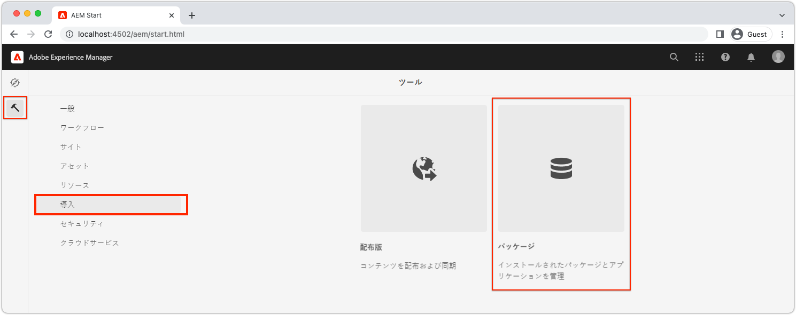
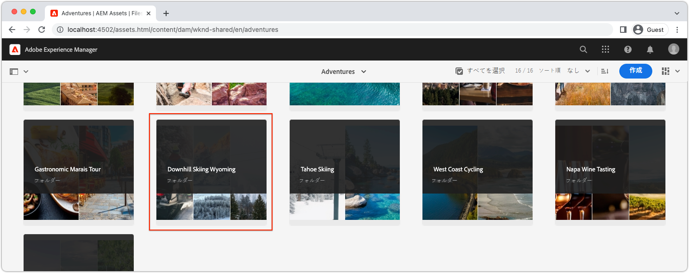
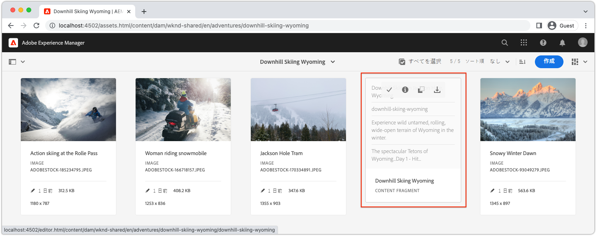
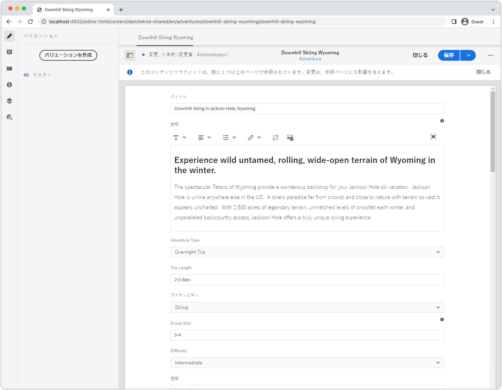
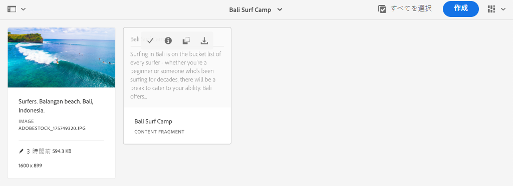

# ローカル AEM SDK を使用した AEM ヘッドレスのクイックセットアップ {#setup}

AEM ヘッドレスのクイックセットアップでは、WKND Site サンプルプロジェクトのコンテンツと、AEM ヘッドレス GraphQL API を介してコンテンツを使用するサンプルの React アプリ（SPA）を使用して、AEM ヘッドレスを実践できます。このガイドでは、[AEM as a Cloud Service SDK](https://experienceleague.adobe.com/docs/experience-manager-cloud-service/content/implementing/developing/aem-as-a-cloud-service-sdk.html?lang=ja) を使用します。

## 前提条件 {#prerequisites}

次のツールをローカルにインストールする必要があります。

* [JDK 11](https://experience.adobe.com/#/downloads/content/software-distribution/jp/general.html?1_group.propertyvalues.property=.%2Fjcr%3Acontent%2Fmetadata%2Fdc%3AsoftwareType&amp;1_group.propertyvalues.operation=equals&amp;1_group.propertyvalues.0_values=software-type%3Atooling&amp;fulltext=Oracle%7E+JDK%7E+11%7E&amp;orderby=%40jcr%3Acontent%2Fjcr%3AlastModified&amp;orderby.sort=desc&amp;layout=list&amp;p.offset=0&amp;p.limit=14)
* [Node.js v18](https://nodejs.org/ja/)
* [Git](https://git-scm.com/)

## 1. AEM SDK をインストールします。 {#aem-sdk}

このセットアップでは、[AEM as a Cloud Service SDK](https://experienceleague.adobe.com/docs/experience-manager-cloud-service/implementing/developing/aem-as-a-cloud-service-sdk.html?lang=ja#aem-as-a-cloud-service-sdk) を使用して AEM の GraphQL API を調べます。この節では、AEM SDK をインストールしてオーサーモードで実行する方法のクイックガイドを示します。ローカル開発環境のセットアップに関する詳細なガイドについては、[こちら](https://experienceleague.adobe.com/docs/experience-manager-learn/cloud-service/local-development-environment-set-up/overview.html?lang=ja#local-development-environment-set-up)を参照してください。

>[!NOTE]
>
> [AEM as a Cloud Service 環境](./cloud-service.md)でチュートリアルを進めることも可能です。クラウド環境を使用する際の追加の注意事項が、このチュートリアルの随所に記載されています。

1. **[ソフトウェア配布ポータル](https://experience.adobe.com/#/downloads/content/software-distribution/jp/aemcloud.html?fulltext=AEM*+SDK*&amp;orderby=%40jcr%3Acontent%2Fjcr%3AlastModified&amp;orderby.sort=desc&amp;layout=list&amp;p.offset=0&amp;p.limit=1)**／**AEM as a Cloud Service** に移動し、**AEM SDK** の最新バージョンをダウンロードします。

   

1. ダウンロードしたファイルを解凍し、クイックスタート JAR（`aem-sdk-quickstart-XXX.jar`）を専用フォルダー（`~/aem-sdk/author`）にコピーします。
1. この JAR ファイルの名前を `aem-author-p4502.jar` に変更します。

   `author` という名前は、クイックスタート JAR がオーサーモードで起動されることを指定しています。`p4502` は、クイックスタートがポート 4502 で実行されることを指定しています。

1. AEM インスタンスをインストールして起動するには、JAR ファイルを含んだフォルダーでコマンドプロンプトを開き、次のコマンドを実行します。

   ```shell
   $ cd ~/aem-sdk/author
   $ java -jar aem-author-p4502.jar
   ```

1. 管理者パスワードを `admin` と入力します。任意の管理者パスワードを使用できますが、ローカル開発には `admin` を使用して、再設定しなくてすむようにすることをお勧めします。
1. AEM サービスのインストールが完了したら、[http://localhost:4502](http://localhost:4502) で新しいブラウザーウィンドウが開きます。
1. ユーザー名 `admin` と、AEM の初回起動時に選択したパスワード（通常 `admin`）でログインします。

## 2. サンプルコンテンツをインストールします。 {#install-sample-content}

**WKND リファレンスサイト**&#x200B;のサンプルコンテンツを使用して、チュートリアルの進行を速めます。WKND は架空のライフスタイルブランドであり、AEM トレーニングでよく使用されます。

WKND サイトには、[GraphQL エンドポイント](https://experienceleague.adobe.com/docs/experience-manager-cloud-service/content/headless/graphql-api/content-fragments.html?lang=ja)の公開に必要な設定が含まれています。実際の実装では、ドキュメントの手順に従って、[GraphQL エンドポイント](https://experienceleague.adobe.com/docs/experience-manager-cloud-service/content/headless/graphql-api/content-fragments.html?lang=ja)をお客様のプロジェクトに組み込みます。[CORS](#cors-config) も、WKND サイトの一部としてパッケージ化されています。外部アプリケーションへのアクセスを許可するには、CORS 設定が必要です。[CORS](#cors-config) について詳しくは、以下を参照してください。

1. WKND サイト用に最新のコンパイル済み AEM パッケージ（[aem-guides-wknd.all-x.x.x.zip](https://github.com/adobe/aem-guides-wknd/releases/latest)）をダウンロードします。

   >[!NOTE]
   >
   > `classic` バージョン&#x200B;**ではなく**、AEM as a Cloud Service と互換性のある標準バージョンをダウンロードします。

1. **AEM スタート**&#x200B;メニューから、**ツール**／**デプロイメント**／**パッケージ**&#x200B;に移動します。

   

1. 「**パッケージをアップロード**」をクリックし、前の手順でダウンロードした WKND パッケージを選択します。「**インストール**」をクリックして、パッケージをインストールします。

1. **AEM スタート**&#x200B;メニューから、**アセット**／**ファイル**／**WKND Shared**／**English**／**Adventures**&#x200B;に移動します。

   

   これは、WKND ブランドがプロモーションしている様々なアドベンチャーで構成されるすべてのアセットのフォルダーです。これには、画像やビデオなどの従来型のメディアや、**コンテンツフラグメント** のように AEM に特有のメディアが含まれます。

1. **Downhill Skiing Wyoming** フォルダーをクリックし、**Downhill Skiing Wyoming** コンテンツフラグメントカードをクリックします。

   

1. Downhill Skiing Wyoming アドベンチャーのコンテンツフラグメントエディターが開きます。

   

   「**タイトル**」、「**説明**」、「**アクティビティ**」などの様々なフィールドでフラグメントが定義されていることがわかります。

   **コンテンツフラグメント**&#x200B;は、AEM でコンテンツを管理する方法の 1 つです。コンテンツフラグメントは、テキスト、リッチテキスト、日付、他のコンテンツフラグメントへの参照などの構造化データ要素で構成された、再利用可能で、プレゼンテーションに依存しないコンテンツです。コンテンツフラグメントについては、後でクイックセットアップで詳しく説明します。

1. 「**キャンセル**」をクリックして、フラグメントを閉じます。他のいくつかのフォルダーに自由に移動して、他のアドベンチャーコンテンツを調べます。

>[!NOTE]
>
> Cloud Service 環境を使用している場合は、[WKND リファレンスサイトのようなコードベースを Cloud Service 環境にデプロイする](https://experienceleague.adobe.com/docs/experience-manager-cloud-service/implementing/deploying/overview.html?lang=ja#coding-against-the-right-aem-version)方法についてのドキュメントを参照してください。

## 3. WKND React アプリのダウンロードと実行 {#sample-app}

このチュートリアルの目的の 1 つは、GraphQL API を使用して外部アプリケーションから AEM コンテンツを使用する方法を示すことです。このチュートリアルでは、サンプル React アプリを使用します。この React アプリは、AEM の GraphQL API との統合に焦点を当てるため、意図的に単純なものになっています。

1. 新しいコマンドプロンプトを開き、GitHub からサンプル React アプリのクローンを作成します。

   ```shell
   $ git clone git@github.com:adobe/aem-guides-wknd-graphql.git
   $ cd aem-guides-wknd-graphql/react-app
   ```

1. 任意の IDE で `aem-guides-wknd-graphql/react-app` 内の React アプリを開きます。
1. IDE で、ファイル `.env.development`（`/.env.development`）を開きます。`REACT_APP_AUTHORIZATION` 行がコメント解除されており、ファイルで次の変数が宣言されていることを確認します。

   ```plain
   REACT_APP_HOST_URI=http://localhost:4502
   REACT_APP_GRAPHQL_ENDPOINT=/content/graphql/global/endpoint.json
   # Use Authorization when connecting to an AEM Author environment
   REACT_APP_AUTHORIZATION=admin:admin
   ```

   `REACT_APP_HOST_URI` がローカルの AEM SDK を指していることを確認します。便宜上、このクイックスタートでは React アプリを **AEM オーサー**&#x200B;に接続します。**オーサー**&#x200B;サービスには認証が必要なので、アプリは `admin` ユーザーを使用して接続を確立します。アプリを AEM オーサーに接続することは、開発時によく行われる手法です。変更を公開する必要がないので、コンテンツを迅速に繰り返し使用できるからです。

   >[!NOTE]
   >
   > 実稼働シナリオでは、アプリは AEM **パブリッシュ**&#x200B;環境に接続します。詳しくは、_実稼動デプロイメント_&#x200B;の節を参照してください。


1. React アプリをインストールして起動します。

   ```shell
   $ cd aem-guides-wknd-graphql/react-app
   $ npm install
   $ npm start
   ```

1. 新しいブラウザーウィンドウに、[http://localhost:3000](http://localhost:3000) でアプリが自動的に開きます。

   

   AEM 内のアドベンチャーコンテンツのリストが表示されます。

1. アドベンチャー画像の 1 つをクリックすると、アドベンチャーの詳細が表示されます。アドベンチャーの詳細を返すように、AEM に対してリクエストが実行されます。

   

1. ブラウザーの開発者ツールを使用して、**ネットワーク**&#x200B;リクエストを調べます。**XHR** リクエストを表示し、`/graphql/execute.json/...` に対する複数の GET リクエストを確認します。このパスプレフィックスにより、AEM の永続クエリのエンドポイントが呼び出され、プレフィックスの後に続く名前とエンコード済みパラメーターを使用して、実行する永続クエリが選択されます。

   

## 4. AEM でのコンテンツの編集

React アプリを実行している状態で、AEM のコンテンツを更新し、変更がアプリに反映されることを確認します。

1. [http://localhost:4502](http://localhost:4502) の AEM に移動します。
1. **Assets**／**ファイル**／**WKND 共有**／**英語**／**アドベンチャー**／**[バリ島サーフキャンプ](http://localhost:4502/assets.html/content/dam/wknd-shared/en/adventures/bali-surf-camp)**&#x200B;に移動します。

   

1. **Bali Surf Camp** のコンテンツフラグメントをクリックして、コンテンツフラグメントエディターを開きます。
1. アドベンチャーの&#x200B;**タイトル**&#x200B;と&#x200B;**説明**&#x200B;を変更します。

   

1. 「**保存**」をクリックして、変更を保存します。
1. [http://localhost:3000](http://localhost:3000) で React アプリを更新して、変更を確認します。

   

## 5. GraphiQL の探索 {#graphiql}

1. **ツール**／**全般**／**GraphQL クエリエディター**&#x200B;に移動して、[GraphiQL](http://localhost:4502/aem/graphiql.html) を開きます。
1. 左側で既存の永続クエリを選択し、クエリを実行して結果を確認します。

   >[!NOTE]
   >
   > GraphiQL ツールとGraphQL API については、[チュートリアルの後半で詳しく説明](../multi-step/explore-graphql-api.md)します。

## おめでとうございます。{#congratulations}

これで、外部アプリケーションが GraphQL で AEM コンテンツを使用できるようになりました。React アプリのコードを自由に調べ、既存のコンテンツフラグメントの変更を引き続き試してください。

### 次の手順

* [AEM ヘッドレスの開始（チュートリアル）](../multi-step/overview.md)
