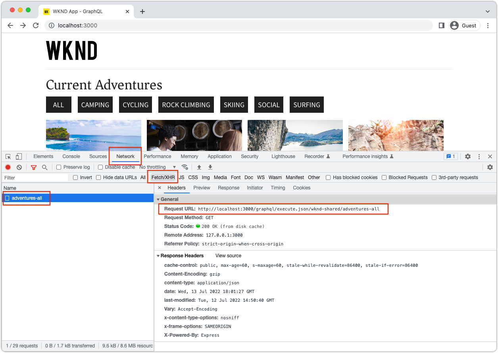

# ローカル SDK を使用したAEMヘッドレスクイックセットアップ {#setup}

AEMヘッドレスのクイックセットアップでは、WKND Site サンプルプロジェクトのコンテンツと、AEM Headless GraphQL API を介してコンテンツを使用するサンプルの React App(SPA) を使用して、AEMヘッドレスを操作できます。 このガイドでは、 [AEMas a Cloud ServiceSDK](https://experienceleague.adobe.com/docs/experience-manager-cloud-service/content/implementing/developing/aem-as-a-cloud-service-sdk.html).

## 前提条件 {#prerequisites}

以下のツールをローカルにインストールする必要があります。

* [JDK 11](https://experience.adobe.com/#/downloads/content/software-distribution/en/general.html?1_group.propertyvalues.property=.%2Fjcr%3Acontent%2Fmetadata%2Fdc%3AsoftwareType&amp;1_group.propertyvalues.operation=equals&amp;1_group.propertyvalues.0_values=software-type%3Autoling&amp;fulltext=Oracle%7E+JDK%7E+11%E&amp;orderby=%40jcr%3Acontent%2Fjcr%3AlastModified&amp;orderby.sort=desc&amp;layout=list&amp;p.offset=0&amp;p.limit=14)
* [Node.js v10 以降](https://nodejs.org/ja/)
* [npm 6 以降](https://www.npmjs.com/)
* [Git](https://git-scm.com/)

## 1. AEM SDK をインストールします。 {#aem-sdk}

この設定では、 [AEMas a Cloud ServiceSDK](https://experienceleague.adobe.com/docs/experience-manager-cloud-service/implementing/developing/aem-as-a-cloud-service-sdk.html?#aem-as-a-cloud-service-sdk) AEM GraphQL API を調べる この節では、AEM SDK をインストールしてオーサーモードで実行する方法のクイックガイドを示します。 ローカル開発環境の設定に関する詳細なガイド [ここにあります](https://experienceleague.adobe.com/docs/experience-manager-learn/cloud-service/local-development-environment-set-up/overview.html#local-development-environment-set-up).

>[!NOTE]
>
> チュートリアルでは、 [AEMas a Cloud Service環境](./cloud-service.md). クラウド環境を使用する場合の追加の注意事項は、このチュートリアル全体に含まれています。

1. 次に移動： **[ソフトウェア配布ポータル](https://experience.adobe.com/#/downloads/content/software-distribution/en/aemcloud.html?fulltext=AEM*+SDK*&amp;orderby=%40jcr%3Acontent%2Fjcr%3AlastModified&amp;orderby.sort=desc&amp;layout=list&amp;p.offset=0&amp;p.limit=1)** > **AEMas a Cloud Service** および最新バージョンの **AEM SDK**.

   

1. ダウンロードを解凍し、クイックスタート jar(`aem-sdk-quickstart-XXX.jar`) を専用のフォルダーにコピーする場合は、 `~/aem-sdk/author`.
1. jar ファイルの名前をに変更します。 `aem-author-p4502.jar`.

   この `author` name は、クイックスタート jar がオーサーモードで開始することを指定します。 この `p4502` は、ポート 4502 でクイックスタートを実行するように指定します。

1. AEMインスタンスをインストールして起動するには、jar ファイルを含むフォルダーでコマンドプロンプトを開き、次のコマンドを実行します。

   ```shell
   $ cd ~/aem-sdk/author
   $ java -jar aem-author-p4502.jar
   ```

1. 管理者パスワードをとして入力 `admin`. 管理者パスワードは使用できますが、 `admin` ローカル開発で再設定の必要性を減らす。
1. AEMサービスのインストールが完了したら、次の場所に新しいブラウザーウィンドウが開きます。 [http://localhost:4502](http://localhost:4502).
1. ユーザー名でログイン `admin` と、AEMの初回起動時に選択したパスワード ( 通常は `admin`) をクリックします。

## 2.サンプルコンテンツをインストールする {#install-sample-content}

のサンプルコンテンツ **WKND リファレンスサイト** を使用して、チュートリアルを高速化します。 WKND は架空のライフスタイルブランドで、AEMトレーニングでよく使用されます。

WKND サイトには、 [GraphQL エンドポイント](https://experienceleague.adobe.com/docs/experience-manager-cloud-service/content/headless/graphql-api/content-fragments.html). 実際の実装では、ドキュメントに記載されている手順に従って、 [GraphQL エンドポイントを含める](https://experienceleague.adobe.com/docs/experience-manager-cloud-service/content/headless/graphql-api/content-fragments.html) を選択します。 A [CORS](#cors-config) は、WKND サイトの一部としてもパッケージ化されています。 外部アプリケーションへのアクセスを許可するには、CORS 設定が必要です。詳しくは、 [CORS](#cors-config) は以下にあります。

1. WKND サイト用に最新のコンパイル済みAEMパッケージをダウンロードします。 [aem-guides-wknd.all-x.x.x.zip](https://github.com/adobe/aem-guides-wknd/releases/latest).

   >[!NOTE]
   >
   > AEM as a Cloud Serviceおよび **not** の `classic` バージョン。

1. 次の **AEM Start** メニュー、移動 **ツール** > **導入** > **パッケージ**.

   

1. クリック **パッケージをアップロード** 前の手順でダウンロードした WKND パッケージを選択します。 「**インストール**」をクリックして、パッケージをインストールします。

1. 次の **AEM Start** メニュー、移動 **Assets** > **ファイル** > **WKND 共有** > **英語** > **冒険**.

   

   これは、WKND ブランドによって促進される様々なアドベンチャーを構成するすべてのアセットのフォルダーです。 これには、画像やビデオなどの従来のメディアタイプや、AEMに特有のメディアが含まれます。 **コンテンツフラグメント**.

1. をクリックして、 **ダウンヒルスキーワイオミング** フォルダーに移動し、 **Downhill Skiing Wyoming コンテンツフラグメント** カード：

   

1. コンテンツフラグメントエディターが開き、Downhill Skiing Wyoming のアドベンチャー用に開きます。

   

   次のような様々なフィールドを確認します。 **タイトル**, **説明**、および **アクティビティ** フラグメントを定義します。

   **コンテンツフラグメント** は、AEMでコンテンツを管理する方法の 1 つです。 コンテンツフラグメントは、テキスト、リッチテキスト、日付、他のコンテンツフラグメントへの参照などの構造化されたデータ要素で構成され、再利用可能で、プレゼンテーションに依存しないコンテンツです。 コンテンツフラグメントについては、後でクイックセットアップで詳しく説明します。

1. クリック **キャンセル** をクリックしてフラグメントを閉じます。 他のフォルダーの一部に移動して、他のアドベンチャーコンテンツを参照できます。

>[!NOTE]
>
> Cloud Service環境を使用する場合は、 [WKND リファレンスサイトなどのコードベースをCloud Service環境にデプロイする](https://experienceleague.adobe.com/docs/experience-manager-cloud-service/implementing/deploying/overview.html#coding-against-the-right-aem-version).

## 3. WKND React アプリをダウンロードして実行します。 {#sample-app}

このチュートリアルの目的の 1 つは、GraphQL API を使用して外部アプリケーションからAEMコンテンツを使用する方法を示すことです。 このチュートリアルでは、React App のサンプルを使用します。 React アプリは、AEM GraphQL API との統合に焦点を当てるために意図的にシンプルです。

1. 新しいコマンドプロンプトを開き、GitHub からサンプル React アプリをクローンします。

   ```shell
   $ git clone git@github.com:adobe/aem-guides-wknd-graphql.git
   $ cd aem-guides-wknd-graphql/react-app
   ```

1. で React アプリを開きます。 `aem-guides-wknd-graphql/react-app` 選択した IDE 内。
1. IDE で、ファイルを開きます。 `.env.development` 時刻 `/.env.development`. を確認します。 `REACT_APP_AUTHORIZATION` 行がコメント解除され、ファイルが次の変数を宣言します。

   ```plain
   REACT_APP_HOST_URI=http://localhost:4502
   REACT_APP_GRAPHQL_ENDPOINT=/content/graphql/global/endpoint.json
   # Use Authorization when connecting to an AEM Author environment
   REACT_APP_AUTHORIZATION=admin:admin
   ```

   確認 `REACT_APP_HOST_URI` はローカルのAEM SDK を指します。 便宜上、このクイックスタートは React アプリを  **AEM オーサー**. **作成者** サービスには認証が必要なので、アプリは `admin` 接続を確立するユーザー。 アプリを AEM オーサーに接続することは、開発時に一般的な方法です。変更を公開する必要なく、コンテンツをすばやく繰り返し処理するのに役立ちます。

   >[!NOTE]
   >
   > 実稼動シナリオでは、アプリはAEMに接続します **公開** 環境。 詳しくは、 _実稼動のデプロイメント_ 」セクションに入力します。


1. React アプリをインストールして起動します。

   ```shell
   $ cd aem-guides-wknd-graphql/react-app
   $ npm install
   $ npm start
   ```

1. 新しいブラウザーウィンドウで、アプリが自動的に開きます。 [http://localhost:3000](http://localhost:3000).

   

   AEMのアドベンチャーコンテンツのリストが表示されます。

1. アドベンチャー画像の 1 つをクリックして、アドベンチャーの詳細を表示します。 アドベンチャーの詳細を返すようにAEMにリクエストが送信されます。

   

1. ブラウザーの開発者ツールを使用して、 **ネットワーク** リクエスト。 次を表示： **XHR** に対する複数のGET要求を監視します。 `/graphql/execute.json/...`. このパスプレフィックスは、名前と、プレフィックスに続くエンコードされたパラメーターを使用して、実行する永続化されたクエリを選択し、AEMの永続化されたクエリエンドポイントを呼び出します。

   

## 4. AEMでコンテンツを編集する

React アプリを実行している状態で、AEMのコンテンツを更新し、変更がアプリに反映されていることを確認します。

1. AEMに移動 [http://localhost:4502](http://localhost:4502).
1. に移動します。 **Assets** > **ファイル** > **WKND 共有** > **英語** > **冒険** > **[バリサーフキャンプ](http://localhost:4502/assets.html/content/dam/wknd-shared/en/adventures/bali-surf-camp)**.

   

1. をクリックして、 **バリサーフキャンプ** コンテンツフラグメントを開き、コンテンツフラグメントエディターを開きます。
1. を変更します。 **タイトル** そして **説明** この冒険の

   

1. 「**保存**」をクリックして、変更を保存します。
1. 次の場所で React アプリを更新する [http://localhost:3000](http://localhost:3000) 変更を確認するには、以下を実行します。

   

## 5. GraphiQL の参照 {#graphiql}

1. 開く [GraphiQL](http://localhost:4502/aem/graphiql.html) 移動して **ツール** > **一般** > **GraphQL クエリエディター**
1. 左側で既存の永続化されたクエリを選択し、クエリを実行して結果を確認します。

   >[!NOTE]
   >
   > GraphiQL ツールと GraphQL API は、 [チュートリアルの後半で詳しく説明します。](../multi-step/explore-graphql-api.md).

## おめでとうございます。{#congratulations}

これで、GraphQL でAEMコンテンツを使用する外部アプリケーションが作成されました。 React アプリのコードを調べ、既存のコンテンツフラグメントの変更を引き続き試してみてください。

### 次の手順

* [AEMヘッドレスチュートリアルの開始](../multi-step/overview.md)
