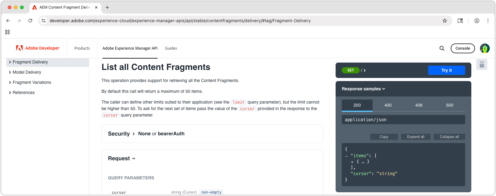

# AEM OpenAPI ベースのコンテンツフラグメント配信 API について

AEMの [OpenAPI を使用したAEM コンテンツフラグメント配信 ](https://developer.adobe.com/experience-cloud/experience-manager-apis/api/stable/contentfragments/delivery/) は、任意のアプリケーションまたはチャネルに構造化コンテンツを配信する強力な方法を提供します。 この章では、OpenAPI を使用して、ドキュメントの **試す** 機能を通じてコンテンツフラグメントを取得する方法を説明します。

## 前提条件 {#prerequisites}

これは複数のパートから成るチュートリアルで、[ コンテンツフラグメントのオーサリング ](./2-author-content-fragments.md) でまとめられている手順が完了していることを前提としています。

必ず以下を用意します。

* `https://publish-<PROGRAM_ID>-e<ENVIRONMENT_ID >.adobeaemcloud.com/` コンテンツフラグメントの公開先 [ のAEM Publish サービスのホスト名（](./2-author-content-fragments.md#publish-content-fragments) など）。 AEM プレビューサービスを公開する場合は、そのホスト名を使用できます（例：`https://preview-<PROGRAM_ID>-e<ENVIRONMENT_ID>.adobeaemcloud.com/`）。

## 目的 {#objectives}

* [AEM コンテンツフラグメント配信と OpenAPI API](https://developer.adobe.com/experience-cloud/experience-manager-apis/api/stable/contentfragments/delivery/) について理解します。
* API ドキュメントの **試す** 機能を使用して API を呼び出します。

## 配信 API

OpenAPI を使用したAEM コンテンツフラグメント配信 API は、コンテンツフラグメントを取得するための RESTful インターフェイスを提供します。 このチュートリアルで説明する API は、AEMのパブリッシュサービスおよびプレビューサービスでのみ使用でき、オーサーサービスでは使用できません。 [AEM オーサーサービス上のコンテンツフラグメントとのやり取り ](https://developer.adobe.com/experience-cloud/experience-manager-apis/api/stable/sites/) 用の他の OpenAPI があります。

## API の探索

[OpenAPI API ドキュメントを使用したAEM コンテンツフラグメント配信には ](https://developer.adobe.com/experience-cloud/experience-manager-apis/api/stable/contentfragments/delivery/)API を参照し、ブラウザーから直接テストできる「試す」機能があります。 これは、API エンドポイントとその機能を理解するための優れた方法です。

[AEM Sites API ドキュメント ](https://developer.adobe.com/experience-cloud/experience-manager-apis/api/stable/contentfragments/delivery/) をブラウザーで開きます。

API は、左側のナビゲーションの「**フラグメント配信** セクションの下に一覧表示されます。 このセクションを展開すると、使用可能な API を確認できます。 API を選択すると、メインパネルに API の詳細が表示され、右側のパネルに「**試す**」セクションが表示され、ブラウザーから直接 API をテストして参照できます。



## コンテンツフラグメントのリスト

1. ブラウザーで、OpenAPI 開発者向けドキュメントを使用して [AEM コンテンツフラグメント配信を開きます ](https://developer.adobe.com/experience-cloud/experience-manager-apis/api/stable/contentfragments/delivery/)
1. 左側のナビゲーションで、「**フラグメント配信**」セクションを展開し、「**すべてのコンテンツフラグメントをリスト**」 API を選択します。

この API を使用すると、すべてのコンテンツフラグメントのページ分割されたリストをAEMからフォルダー別に取得できます。 この API を使用する最も簡単な方法は、コンテンツフラグメントを含むフォルダーへのパスを指定することです。

1. 右側のパネルの上部にある「**試す**」を選択します。
1. API がコンテンツフラグメントを取得するために接続する、AEM サービスの識別子を入力します。 バケットは、AEMのパブリッシュ（またはプレビュー）サービス URL の最初の部分で、通常は `publish-p<PROGRAM_ID>-e<ENVIRONMENT_ID>` または `preview-p<PROGRAM_ID>-e<ENVIRONMENT_ID>` の形式です。

AEM パブリッシュサービスを使用しているため、バケットをAEM パブリッシュサービスの識別子に設定します。 例：

* **バケット**: `publish-p138003-e1400351`


バケットが設定されると、「**Target サーバー**」フィールドの値が、AEM パブリッシュサービスの完全な API URL （例：`https://publish-p138003-e1400351.adobeaemcloud.com/adobe/contentFragments`）に自動的に更新されます。

1. **セキュリティ** セクションを展開し、**セキュリティスキーム** を **なし** に設定します。 これは、AEM パブリッシュサービス（およびプレビューサービス）が、OpenAPI を使用したAEM コンテンツフラグメント配信の認証を必要としないためです。

1. 「**パラメーター**」セクションを展開し、取得するコンテンツフラグメントの詳細を指定します。

* **cursor**：空のままにします。これはページネーションに使用され、初期リクエストです。
* **limit**：空のままにします。これは、結果のページごとに返される結果の数を制限するために使用されます。
* **path**: `/content/dam/my-project/en`

  >[!TIP]
  > パスを入力する場合は、そのプレフィックスが `/content/dam/` であり、末尾がスラッシュ **で終わる** ない `/` ことを確認します。

  

1. 「**送信**」ボタンを選択して、API 呼び出しを実行します。
1. **試す** パネルの「**応答**」タブに、指定したフォルダーのコンテンツフラグメントのリストを含む JSON 応答が表示されます。 応答は次のようになります。

   

1. 応答には、`path` パラメーターの `/content/dam/my-project` フォルダーに、**Person** と **Team** の両方のコンテンツフラグメントを含むサブフォルダーを含むすべてのコンテンツフラグメントが含まれます。
1. `items` 配列をクリックして、`Team Alpha` 項目の `id` 値を特定します。 この ID は、次の節で、単一のコンテンツフラグメントの詳細を取得するために使用します。
1. **試す** パネルの上部にある「**リクエストを編集**」を選択し、API 呼び出しの様々なパラメーターを選択して、応答がどのように変化するかを確認します。 例えば、コンテンツフラグメントを含む別のフォルダーへのパスを変更したり、結果をフィルタリングするクエリパラメーターを追加したりできます。 例えば、パラメーター `path``/content/dam/my-project/teams` に変更して、そのフォルダー（およびサブフォルダー）内のコンテンツフラグメントのみに変更します。

## コンテンツフラグメントの詳細を取得

**すべてのコンテンツフラグメントをリスト** API と同様、**コンテンツフラグメントを取得** API は、ID とオプション参照を使用して 1 つのコンテンツフラグメントを取得します。 この API を探索するには、複数のユーザーコンテンツフラグメントを参照するチームコンテンツフラグメントをリクエストします。

1. 左側のパネルで「**フラグメント配信**」セクションを展開し、「**コンテンツフラグメントの取得** API を選択します。
1. 右側のパネルの上部にある「**試す**」を選択します。
1. `bucket` がAEM as a Cloud Service パブリッシュサービスまたはプレビューサービスを指していることを確認します。
1. **セキュリティ** セクションを展開し、**セキュリティスキーム** を **なし** に設定します。 これは、AEM パブリッシュサービスが OpenAPI を使用したAEM コンテンツフラグメント配信の認証を必要としないためです。
1. 「**パラメーター**」セクションを展開し、取得するコンテンツフラグメントの詳細を指定します。

この例では、前の節で取得した Team コンテンツフラグメントの ID を使用します。 例えば、**すべてのコンテンツフラグメントをリスト** のこのコンテンツフラグメント応答の場合、`id` の `b954923a-0368-4fa2-93ea-2845f599f512` フィールドの値を使用します。 （`id` は、チュートリアルで使用されている値とは異なります）。

```json
{
    "path": "/content/dam/my-project/teams/team-alpha",
    "name": "",
    "title": "Team Alpha",
    "id": "50f28a14-fec7-4783-a18f-2ce2dc017f55", // This is the Content Fragment ID
    "description": "",
    "model": {},
    "fields": {} 
}
```

* **fragmentId**: `50f28a14-fec7-4783-a18f-2ce2dc017f55`
* **参照**: `none`
* **depth**：空のままにします。**references** パラメーターは、参照されるフラグメントの深さを指示します。
* **hydrated**：空のままにします。**references** パラメーターは、参照されるフラグメントのハイドレートを指示します。
* **If-None-Match**：空のままにします

1. 「**送信**」ボタンを選択して、API 呼び出しを実行します。
1. **試す** パネルの **応答** タブで応答を確認します。 プロパティや参照など、コンテンツフラグメントの詳細を含む JSON 応答が表示されます。
1. **試す** パネルの上部にある **リクエストを編集** を選択し、**パラメーター** セクションで、`references` パラメーターを `all-hydrated` に調整して、参照されているすべてのコンテンツフラグメントのコンテンツを API 呼び出しに含めるようにします。

   * **fragmentId**: `50f28a14-fec7-4783-a18f-2ce2dc017f55`
   * **参照**: `all-hydrated`
   * **depth**：空のままにします。**references** パラメーターは、参照されるフラグメントの深さを指示します。
   * **hydrated**：空のままにします。**references** パラメーターは、参照されるフラグメントのハイドレートを指示します。
   * **If-None-Match**：空のままにします

1. 「**再送信**」ボタンを選択して、API 呼び出しを再実行します。
1. **試す** パネルの **応答** タブで応答を確認します。 プロパティや参照先の Person コンテンツフラグメントのプロパティなど、コンテンツフラグメントの詳細を含む JSON 応答が表示されます。

`teamMembers` 配列に、参照される Person コンテンツフラグメントの詳細が含まれるようになりました。 参照をハイドレートすると、1 回の API 呼び出しで必要なデータをすべて取得できます。これは、クライアントアプリケーションによるリクエスト数を減らすために特に役立ちます。

## おめでとうございます。

おめでとうございます。AEM ドキュメントの **試す** 機能を使用して、OpenAPI 呼び出しを含む複数のAEM コンテンツフラグメント配信を作成および実行しました。

## 次の手順

次の章の [React アプリの作成 ](./4-react-app.md) では、外部アプリケーションが OpenAPI を使用してAEM コンテンツフラグメント配信とやり取りする方法を見ていきます。

