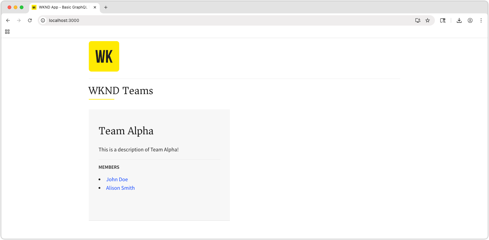

# AEMのコンテンツフラグメント配信 OpenAPI を使用した React アプリの作成

この章では、OpenAPI API を使用したAEM コンテンツフラグメント配信が、外部アプリケーションでのエクスペリエンスをどのように促進するかについて説明します。

シンプルな React アプリを使用してリクエストし、OpenAPI のAEM コンテンツフラグメント配信で公開された **Team** および **Person** コンテンツを表示します。 React の使用はあまり重要ではありません。AEM as a Cloud Serviceに対して HTTP リクエストを行うことができる限り、消費量の多い外部アプリケーションを、あらゆるプラットフォーム向けのあらゆるフレームワークで記述できます。

## 前提条件

このマルチパートチュートリアルの前のパートで説明した手順が完了していることを前提としています。

次のソフトウェアがインストールされている必要があります。

* [Node.js v22 以降 ](https://nodejs.org/ja)
* [Visual Studio Code](https://code.visualstudio.com/)

## 目的

次の方法を学びます。

* サンプルの React アプリをダウンロードして起動します。
* チームとその参照メンバーのリストに対して、OpenAPI API を使用してAEM コンテンツフラグメント配信を呼び出します。
* OpenAPI API を使用してAEM コンテンツフラグメント配信を呼び出し、チームメンバーの詳細を取得します。

## AEM as a Cloud Serviceでの CORS の設定

このサンプル React アプリは、（`http://localhost:3000` 上で）ローカルで実行され、OpenAPI を使用してAEM パブリッシュサービスのAEM コンテンツフラグメント配信に接続します。 この連携を許可するには、AEM Publish （またはプレビュー）サービスで CORS （クロスオリジンリソース共有）が設定されている必要があります。

[`http://localhost:3000` 上で動作する SPA の設定に関する手順で、AEM パブリッシュサービスへの CORS リクエストを許可します ](https://experienceleague.adobe.com/ja/docs/experience-manager-learn/getting-started-with-aem-headless/deployments/spa#different-domains)。

### ローカル CORS プロキシ

または、開発用に、AEMへの CORS に対応した接続を確立する [ ローカル CORS プロキシ ](https://www.npmjs.com/package/local-cors-proxy) を実行します。

```bash
$ npm install --global lcp
$ lcp --proxyUrl https://publish-p<PROGRAM_ID>-e<ENVIRONMENT_ID>.adobeaemcloud.com
```

`--proxyUrl` の値をAEMの公開（またはプレビュー） URL に更新します。

ローカル CORS プロキシが動作している状態で、`http://localhost:8010/proxy` からAEM コンテンツフラグメント配信 API にアクセスして、CORS の問題を回避します。

## サンプル React アプリのクローンの作成

OpenAPI を使用してAEM コンテンツフラグメント配信とやり取りし、そこから取得したチームや人物のデータを表示するために必要なコードを使用して、スタブ化されたサンプル React アプリを実装します。

サンプル React アプリのソースコードは [Github.com で入手 ](https://github.com/adobe/aem-tutorials/tree/main/headless/open-api/basic) できます。

React アプリを取得するには：

1. [ タグ ](https://github.com/adobe/aem-tutorials) から [`headless_open-api_basic`Github.com](https://github.com/adobe/aem-tutorials/tree/headless_open-api_basic) のサンプル WKND OpenAPI React アプリを複製します。

   ```shell
   $ cd ~/Code
   $ git clone git@github.com:adobe/aem-tutorials.git
   $ cd aem-tutorials  
   $ git fetch --tags
   $ git tag
   $ git checkout tags/headless_open-api_basic
   ```

1. `headless/open-api/basic` フォルダーに移動し、IDE で開きます。

   ```shell
   $ cd ~/Code/aem-tutorials/headless/open-api/basic
   $ code .
   ```

1. コンテンツフラグメントが公開されるAEM as a Cloud Service パブリッシュサービスに接続するように、`.env` を更新します。 AEM プレビューサービスでアプリをテストする場合（およびコンテンツフラグメントがそこで公開される場合）は、AEM プレビューサービスを指している可能性があります。

   ```
   # AEM Publish (or Preview) service that provides Content Fragments
   REACT_APP_HOST_URI=https://publish-p123-e456.adobeaemcloud.com
   ```

   [ ローカル CORS プロキシ ](#local-cors-proxy) を使用する場合、`REACT_APP_HOST_URI` を `http://localhost:8010/proxy` に設定します。

   ```
   # AEM Publish (or Preview) service that provides Content Fragments
   REACT_APP_HOST_URI=http://localhost:8010/proxy
   ```

1. React アプリを起動します。

   ```shell
   $ cd ~/Code/aem-tutorials/headless/open-api/basic
   $ npm install
   $ npm start
   ```

1. React アプリは、開発モードで [http://localhost:3000/](http://localhost:3000/) で起動します。 チュートリアルで React アプリに加えた変更は、web ブラウザーにすぐに反映されます。

>[!IMPORTANT]
>
>   この React アプリは部分的に実装されています。このチュートリアルの手順に従って、実装を完了します。 実装が必要な JavaScript ファイルには次のコメントが含まれています。これらのファイルのコードを、必ずこのチュートリアルで指定したコードで追加または更新してください。
>
>
>  //**&#x200B;**&#x200B;**&#x200B;**&#x200B;**&#x200B;**&#x200B;**&#x200B;**&#x200B;**&#x200B;**&#x200B;**&#x200B;**&#x200B;**&#x200B;**&#x200B;**&#x200B;***
>  &#x200B;>  // TODO：これを実装するには、AEM ヘッドレスチュートリアルの手順に従います。
>  &#x200B;>  //**&#x200B;**&#x200B;**&#x200B;**&#x200B;**&#x200B;**&#x200B;**&#x200B;**&#x200B;**&#x200B;**&#x200B;**&#x200B;**&#x200B;**&#x200B;**&#x200B;**&#x200B;***
>

## React アプリの詳細な構造

サンプル React アプリには、更新が必要な 3 つの主要な部分があります。

1. `.env` ファイルには、AEM Publish （またはプレビュー）サービスの URL が含まれています。
1. `src/components/Teams.js` には、チームとそのメンバーのリストが表示されます。
1. `src/components/Person.js` は、1 人のチームメンバーの詳細を表示します。

## チーム機能の実装

React アプリのメインビューにチームとそのメンバーを表示する機能を構築します。 この機能には、次が必要です。

* 新しい [custom React useEffect フック ](https://react.dev/reference/react/useEffect#useeffect) は、取得リクエストを通じて **List all Content Fragments API** を呼び出し、表示する各 `fullName` の `teamMember` 値を取得します。

完了すると、アプリのメインビューに AEM のチームデータが入力されます。



1. `src/components/Teams.js` を開きます。

1. **チーム** コンポーネントを実装して、[ すべてのコンテンツフラグメント API を一覧表示 ](https://developer.adobe.com/experience-cloud/experience-manager-apis/api/stable/contentfragments/delivery/#operation/fragments/getFragments) からチームのリストを取得し、チームコンテンツをレンダリングします。 これは、次の手順に分かれます。

1. AEM `useEffect` すべてのコンテンツフラグメントをリスト **API を呼び出し、データを React コンポーネントのステートに保存する** フックを作成します。
1. 返された **チーム** コンテンツフラグメントごとに、**コンテンツフラグメントを取得** API を呼び出して、メンバーとその `fullNames` を含む、チームの完全にハイドレートされた詳細を取得します。
1. `Team` 関数を使用してチームデータをレンダリングします。

   ```javascript
   import { useEffect, useState } from "react";
   import { Link } from "react-router-dom";
   import "./Teams.scss";
   
   function Teams() {
   
     // The teams folder is the only folder-tree that is allowed to contain Team Content Fragments.
     const TEAMS_FOLDER = '/content/dam/my-project/en/teams';
   
     // State to store the teams data
     const [teams, setTeams] = useState(null);
   
     useEffect(() => {
       /**
       * Fetches all teams and their associated member details
       * This is a two-step process:
       * 1. First, get all team content fragments from the specified folder
       * 2. Then, for each team, fetch the full details including hydrated references to get the team member names
       */
       const fetchData = async () => {
         try {
           // Step 1: Fetch all teams from the teams folder
           const response = await fetch(
             `${process.env.REACT_APP_HOST_URI}/adobe/contentFragments?path=${TEAMS_FOLDER}`
           );
           const allTeams = (await response.json()).items || [];
   
           // Step 2: Fetch detailed information for each team with hydrated references
           const hydratedTeams = [];
           for (const team of allTeams) {
             const hydratedTeamResponse = await fetch(
               `${process.env.REACT_APP_HOST_URI}/adobe/contentFragments/${team.id}?references=direct-hydrated`
             );
             hydratedTeams.push(await hydratedTeamResponse.json());
           }
   
           setTeams(hydratedTeams);
         } catch (error) {
           console.error("Error fetching content fragments:", error);
         }
       };
   
       fetchData();
     }, [TEAMS_FOLDER]);
   
     // Show loading state while teams data is being fetched
     if (!teams) {
       return <div>Loading teams...</div>;
     }
   
     // Render the teams
     return (
       <div className="teams">
         {teams.map((team, index) => {
           return (
             <Team 
               key={index} 
               {..team}
             />
           );
         })}
       </div>
     );
   }
   
   /**
   * Team component - renders a single team with its details and members
   * @param {string} fields - The authorable fields
   * @param {Object} references - Hydrated references containing member details such as fullName
   */
   function Team({ fields, references, path }) {
     if (!fields.title || !fields.teamMembers) {
       return null;
     }
   
     return (
       <div className="team">
         <h2 className="team__title">{fields.title}</h2>
         {/* Render description as HTML using dangerouslySetInnerHTML */}
         <p 
           className="team__description" 
           dangerouslySetInnerHTML={{ __html: fields.description.value }}
         />
         <div>
           <h4 className="team__members-title">Members</h4>
           <ul className="team__members">
             {/* Render each team member as a link to their detail page */}
             {fields.teamMembers.map((teamMember, index) => {
               return (
                 <li key={index} className="team__member">
                   <Link to={`/person/${teamMember}`}>
                     {/* Display the full name from the hydrated reference */}
                     {references[teamMember].value.fields.fullName}
                   </Link>
                 </li>
               );
             })}
           </ul>
         </div>
       </div>
     );
   }
   
   export default Teams;
   ```

## 人物機能の実装

[ チームの機能 ](#implement-teams-functionality) が完成したので、チームメンバーまたは個人の詳細表示を処理する機能を実装します。


次の手順を実行します。

1. `src/components/Person.js` を開きます。
1. `Person` React コンポーネントで、`id` ルートパラメーターを解析します。 React アプリのルートは、以前、`id` URL パラメーターを受け入れるように設定されていました（`/src/App.js` を参照）。
1. [ コンテンツフラグメント API を取得 ](https://developer.adobe.com/experience-cloud/experience-manager-apis/api/stable/contentfragments/delivery/#operation/fragments/getFragment) からAEMに人物データを取得します。

   ```javascript
   import "./Person.scss";
   import { useEffect, useState } from "react";
   import { useParams } from "react-router-dom";
   
   /**
   * Person component - displays detailed information about a single person
   * Fetches person data from AEM using the ID from the URL parameters
   */
   function Person() {
     // Get the person ID from the URL parameter
     const { id } = useParams();
   
     // State to store the person data
     const [person, setPerson] = useState(null);
   
     useEffect(() => {
       /**
       * Fetches person data from AEM Content Fragment Delivery API
       * Uses the ID from URL parameters to get the specific person's details
       */
       const fetchData = async () => {
         try {
           /* Hydrate references for access to profilePicture asset path */
           const response = await fetch(
             `${process.env.REACT_APP_HOST_URI}/adobe/contentFragments/${id}?references=direct-hydrated`
           );
           const json = await response.json();
           setPerson(json || null);
         } catch (error) {
           console.error("Error fetching person data:", error);
         }
       };
       fetchData();
     }, [id]); // Re-fetch when ID changes
   
     // Show loading state while person data is being fetched
     if (!person) {
       return <div>Loading person...</div>;
     }
   
     return (
       <div className="person">
         {/* Person profile image - Look up the profilePicture reference in the references object */}
         
         {/* Display person's occupations */}
         <div className="person__occupations">
           {person.fields.occupation.map((occupation, index) => {
             return (
               <span key={index} className="person__occupation">
                 {occupation}
               </span>
             );
           })}
         </div>
   
         {/* Person's main content: name and biography */}
         <div className="person__content">
           <h1 className="person__full-name">{person.fields.fullName}</h1>
           {/* Render biography as HTML content */}
           <div
             className="person__biography"
             dangerouslySetInnerHTML={{ __html: person.fields.biographyText.value }}
           />
         </div>
       </div>
     );  
   }
   
   export default Person;
   ```

### 完成したコードを取得する

この章の完全なソースコードは [Github.com で入手できます ](https://github.com/adobe/aem-tutorials/tree/headless_open-api_basic_4-end)。

```bash
$ git fetch --tags
$ git tag
$ git checkout tags/headless_open-api_basic_4-end
```

## アプリを試す

アプリ [http://localhost:3000/](http://localhost:3000/) をレビューし、「_チームメンバー_」リンクをクリックします。 また、AEM オーサーサービスでコンテンツフラグメントを追加して公開することで、チームやメンバーをチーム Alphaにさらに追加することもできます。

## 内部の仕組み

React アプリとやり取りする際に、ブラウザーの **開発者ツール/ネットワーク** コンソールと **フィルター** を開いて、取得リクエス `/adobe/contentFragments` を取得します。

## おめでとうございます。

これですべて完了です。OpenAPI を使用してAEM コンテンツフラグメント配信からコンテンツフラグメントを使用および表示する React アプリを正常に作成しました。
