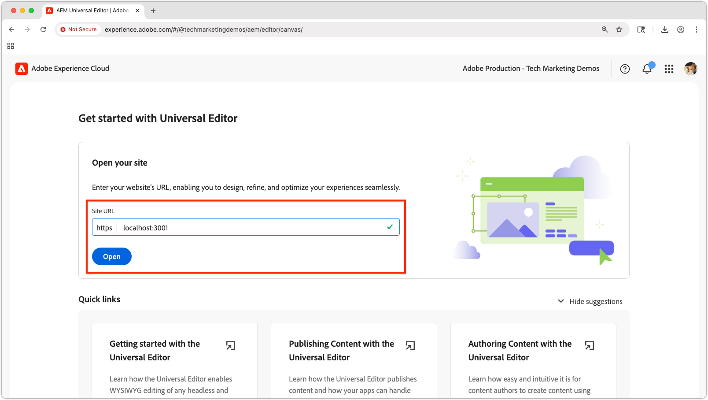

# ユニバーサルエディターを使用した React アプリの編集

この章では、[ 前の章 ](./4-react-app.md) で作成した React アプリを、AEM Universal Editor を使用して編集可能にする方法を説明します。 ユニバーサルエディターを使用すると、コンテンツ作成者は、ヘッドレスアプリケーションのシームレスなエクスペリエンスを維持しながら、React アプリエクスペリエンスのコンテキスト内で直接コンテンツを編集できます。


ユニバーサルエディターは、あらゆる web アプリケーションのコンテキスト内編集を有効にする強力な方法を提供し、作成者は、異なるオーサリングインターフェイスに切り替えることなくコンテンツを編集できます。

## 前提条件

* このチュートリアルの前の手順、特に [AEMのコンテンツフラグメント配信 OpenAPI を使用する React アプリの作成 ](./4-react-app.md) は完了しました
* [ ユニバーサルエディターの使用と実装方法 ](https://experienceleague.adobe.com/ja/docs/experience-manager-cloud-service/content/implementing/developing/universal-editor/introduction) に関する実用的な知識。

## 目的

次の方法を学びます。

* React アプリにユニバーサルエディターインストルメンテーションを追加します。
* ユニバーサルエディター用に React アプリを設定します。
* ユニバーサルエディターを使用して React アプリインターフェイス内で直接コンテンツ編集を有効にします。

## ユニバーサルエディターの実装

ユニバーサルエディターは、編集可能なコンテンツを識別し、UI とHTML コンテンツの間のつながりを確立するために [0&rbrace;AEM属性とメタタグ &rbrace; を必要とします。](https://experienceleague.adobe.com/ja/docs/experience-manager-cloud-service/content/implementing/developing/universal-editor/attributes-types)

### ユニバーサルエディターのタグの追加

まず、React アプリをユニバーサルエディター互換として識別するために必要なメタタグを追加します。

1. React アプリで `public/index.html` を開きます。
1. React アプリの [ セクションに ](https://experienceleague.adobe.com/en/docs/experience-manager-cloud-service/content/implementing/developing/universal-editor/getting-started) ユニバーサルエディターのメタタグと CORS スクリプト `<head>` を追加します。

   ```html
   <!DOCTYPE html>
   <html lang="en">
   <head>
       <meta charset="utf-8" />
       <link rel="icon" href="%PUBLIC_URL%/favicon.ico" />
       <meta name="viewport" content="width=device-width, initial-scale=1" />
       <meta name="theme-color" content="#000000" />
       <meta name="description" content="WKND Teams React App" />
   
       <!-- Universal Editor meta tags and CORS script -->
       <meta name="urn:adobe:aue:system:aemconnection" content="aem:%REACT_APP_AEM_AUTHOR_HOST_URI%" />
       <script src="https://universal-editor-service.adobe.io/cors.js"></script>
   
       <link rel="apple-touch-icon" href="%PUBLIC_URL%/logo192.png" />
       <link rel="manifest" href="%PUBLIC_URL%/manifest.json" />
       <title>WKND Teams</title>
   </head>
   <body>
       <noscript>You need to enable JavaScript to run this app.</noscript>
       <div id="root"></div>
   </body>
   </html>
   ```

1. React アプリの `.env` ファイルを更新して、AEM オーサーサービスホストを含め、ユニバーサルエディターでの書き戻しをサポートするようにします（`urn:adobe:aue:system:aemconnection` メタタグの値で使用）。

   ```bash
   # The AEM Publish (or Preview) service
   REACT_APP_HOST_URI=https://publish-p123-e456.adobeaemcloud.com
   
   # The AEM Author service
   REACT_APP_AEM_AUTHOR_HOST_URI=https://author-p123-e456.adobeaemcloud.com
   ```

### チームコンポーネントの実装

次に、ユニバーサルエディター属性を追加して、チームコンポーネントを編集可能にします。

1. `src/components/Teams.js` を開きます。
1. `Team` コンポーネントを更新して、[ ユニバーサルエディターのデータ属性 ](https://experienceleague.adobe.com/ja/docs/experience-manager-cloud-service/content/implementing/developing/universal-editor/attributes-types) を含めます。

   `data-aue-resource` 属性を設定する場合は、OpenAPI API を使用したAEM コンテンツフラグメント配信によって返されるコンテンツフラグメントへのAEM パスの後に、コンテンツフラグメントバリエーションへのサブパス（この場合は `/jcr:content/data/master`）が付いていることを確認します。

   ```javascript
   import { useEffect, useState } from "react";
   import { Link } from "react-router-dom";
   import "./Teams.scss";
   
   function Teams() {
   
   // The teams folder is the only folder-tree that is allowed to contain Team Content Fragments.
   const TEAMS_FOLDER = '/content/dam/my-project/en/teams';
   
   // State to store the teams data
   const [teams, setTeams] = useState(null);
   
   useEffect(() => {
       /**
       * Fetches all teams and their associated member details
       * This is a two-step process:
       * 1. First, get all team content fragments from the specified folder
       * 2. Then, for each team, fetch the full details including hydrated references to get the team member names
       */
       const fetchData = async () => {
       try {
           // Step 1: Fetch all teams from the teams folder
           const response = await fetch(
           `${process.env.REACT_APP_HOST_URI}/adobe/contentFragments?path=${TEAMS_FOLDER}`
           );
           const allTeams = (await response.json()).items || [];
   
           // Step 2: Fetch detailed information for each team with hydrated references
           const hydratedTeams = [];
           for (const team of allTeams) {
               const hydratedTeamResponse = await fetch(
                   `${process.env.REACT_APP_HOST_URI}/adobe/contentFragments/${team.id}?references=direct-hydrated`
               );
               hydratedTeams.push(await hydratedTeamResponse.json());
           }
   
           setTeams(hydratedTeams);
       } catch (error) {
           console.error("Error fetching content fragments:", error);
       }
       };
   
       fetchData();
   }, [TEAMS_FOLDER]);
   
   // Show loading state while teams data is being fetched
   if (!teams) {
       return <div>Loading teams...</div>;
   }
   
   // Render the teams
   return (
       <div className="teams">
       {teams.map((team, index) => {
           return (
           <Team
               key={index}
               {...team}
           />
           );
       })}
       </div>
   );
   }
   
   /**
   * Team - renders a single team with its details and members
   * @param {Object} fields - The authored Content Fragment fields
   * @param {Object} references - Hydrated references containing member details such as fullName
   * @param {string} path - Path of the team content fragment
   */
   function Team({ fields, references, path }) {
   if (!fields.title || !fields.teamMembers) {
       return null;
   }
   
   return (
       <>
       {/* Specify the correct Content Fragment variation path suffix in the data-aue-resource attribute */}
       <div className="team"
           data-aue-resource={`urn:aemconnection:${path}/jcr:content/data/master`}
           data-aue-type="component"
           data-aue-label={fields.title}>
   
           <h2 className="team__title"
           data-aue-prop="title"
           data-aue-type="text"
           data-aue-label="Team Title">{fields.title}</h2>
           <p className="team__description"
           data-aue-prop="description"
           data-aue-type="richtext"
           data-aue-label="Team Description"
           dangerouslySetInnerHTML={{ __html: fields.description.value }}
           />
           <div>
           <h4 className="team__members-title">Members</h4>
           <ul className="team__members">
               {fields.teamMembers.map((teamMember, index) => {
               return (
                   <li key={index} className="team__member">
                   <Link to={`/person/${teamMember}`}>
                       {references[teamMember].value.fields.fullName}
                   </Link>
                   </li>
               );
               })}
           </ul>
           </div>
       </div>
       </>
   );
   }
   
   export default Teams;
   ```

### 人物コンポーネントの実装

同様に、ユニバーサルエディター属性を人物コンポーネントに追加します。

1. `src/components/Person.js` を開きます。
1. コンポーネントを更新して、[ ユニバーサルエディターのデータ属性 ](https://experienceleague.adobe.com/ja/docs/experience-manager-cloud-service/content/implementing/developing/universal-editor/attributes-types) を含めます。

   `data-aue-resource` 属性を設定する場合は、OpenAPI API を使用したAEM コンテンツフラグメント配信によって返されるコンテンツフラグメントへのAEM パスの後に、コンテンツフラグメントバリエーションへのサブパス（この場合は `/jcr:content/data/master`）が付いていることを確認します。

   ```javascript
   import "./Person.scss";
   import { useEffect, useState } from "react";
   import { useParams } from "react-router-dom";
   
   /**
   * Person component - displays detailed information about a single person
   * Fetches person data from AEM using the ID from the URL parameters
   */
   function Person() {
       const { id } = useParams();
       const [person, setPerson] = useState(null);
   
       useEffect(() => {
           const fetchData = async () => {
           try {
               const response = await fetch(
               `${process.env.REACT_APP_HOST_URI}/adobe/contentFragments/${id}?references=direct-hydrated`
               );
               const json = await response.json();
               setPerson(json || null);
           } catch (error) {
               console.error("Error fetching person data:", error);
           }
           };
           fetchData();
       }, [id]);
   
       if (!person) {
           return <div>Loading person...</div>;
       }
   
       /* Add the Universal Editor data-aue-* attirbutes to the rendered HTML */
       return (
           <div className="person"
               data-aue-resource={`urn:aemconnection:${person.path}/jcr:content/data/master`}
               data-aue-type="component"
               data-aue-label={person.fields.fullName}>
               
               <div className="person__occupations">
                   {person.fields.occupation.map((occupation, index) => {
                   return (
                       <span key={index} className="person__occupation">
                           {occupation}
                       </span>
                   );
                   })}
               </div>
   
               <div className="person__content">
                   <h1 className="person__full-name"
                       data-aue-prop="fullName"
                       data-aue-type="text"
                       data-aue-label="Full Name">
                       {person.fields.fullName}
                   </h1>
                   <div className="person__biography"
                       data-aue-prop="biographyText"
                       data-aue-type="richtext"
                       data-aue-label="Biography"
                       dangerouslySetInnerHTML={{ __html: person.fields.biographyText.value }}
                   />
               </div>
           </div>
       );
   }
   ```

### 完成したコードを取得する

この章の完全なソースコードは [Github.com で入手できます ](https://github.com/adobe/aem-tutorials/tree/headless_open-api_basic_5-end)。


```bash
$ git fetch --tags
$ git tag
$ git checkout tags/headless_open-api_basic_5-end
```

## ユニバーサルエディター統合のテスト

次に、ユニバーサルエディターで React アプリを開いて、ユニバーサルエディターの互換性の更新をテストします。

### React アプリを起動します。

1. React アプリが実行されていることを確認します。

   ```bash
   $ cd ~/Code/aem-guides-wknd-openapi/basic-tutorial
   $ npm install
   $ npm start
   ```

1. アプリが `http://localhost:3000` に読み込まれ、チームと人物のコンテンツが表示されることを検証します。

### ローカル SSL プロキシの実行

ユニバーサルエディターを使用するには、編集可能なアプリケーションを HTTPS で読み込む必要があります。

1. HTTPS 経由でローカル React アプリを実行するには、コマンドラインから [local-ssl-proxy](https://www.npmjs.com/package/local-ssl-proxy) npm モジュールを使用します。

   ```bash
   $ npm install -g local-ssl-proxy
   $ local-ssl-proxy --source 3001 --target 3000
   ```

1. Web ブラウザーで `https://localhost:3001` を開きます
1. 自己署名証明書を受け入れます。
1. React アプリの読み込みを検証します。

### ユニバーサルエディターで開く



1. [ ユニバーサルエディター ](https://experience.adobe.com/#/@myOrg/aem/editor/canvas/) に移動します。
1. 「**サイト URL**」フィールドに、HTTPS React アプリ URL を入力します：`https://localhost:3001`。
1. 「**開く**」を選択します。

ユニバーサルエディターは、編集機能が有効な React アプリを読み込む必要があります。

### 編集機能のテスト


1. ユニバーサルエディターで、React アプリの編集可能な要素にポインタを合わせます。

1. React アプリ内に移動するには、**プレビュー** モードをオンに、もう一度オフに切り替えて編集します。 **プレビュー** は、AEM プレビューサービスとは関係なく、ユニバーサルエディターで編集クロムのオンとオフを切り替えます。

1. 指標の編集が表示され、React アプリの様々な編集可能な要素をクリックできます。

1. チームタイトルを編集してみてください。
   * チームタイトルをクリック
   * プロパティパネルでテキストを編集します
   * 変更内容を保存します。

1. ユーザーのプロフィール写真を編集してみてください：
   * 人物のプロフィール写真をクリックする
   * アセットピッカーから新しい画像を選択
   * 変更内容を保存します。

1. ユニバーサルエディターの右上にある「**公開**」を押して、編集内容をAEM Publish （またはプレビュー）サービスに公開すると、ユニバーサルエディターの React アプリに反映されます。

## ユニバーサルエディターのデータ属性

ユニバーサルエディター用アプリケーションの実装に関する完全なドキュメントについては、[ ユニバーサルエディターのドキュメント ](https://experience.adobe.com/#/@myOrg/aem/editor/canvas/) を参照してください。

## おめでとうございます。

これですべて完了です。ユニバーサルエディターを React アプリと正常に統合しました。 コンテンツ作成者は、React アプリインターフェイス内でコンテンツフラグメントを直接編集できるようになり、ヘッドレスアーキテクチャのメリットを維持しながら、シームレスなオーサリングエクスペリエンスを提供します。

このチュートリアルの最終ソースコードは、`main`GitHub.com リポジトリ [ の ](https://github.com/adobe/aem-tutorials/tree/main) ブランチから取得できます。
