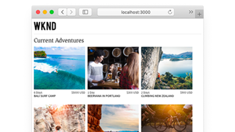

# AEMヘッドレスTutorials

Adobe Experience Manager(AEM) には、ヘッドレスエンドポイントを定義し、そのコンテンツを JSON 形式で配信する複数のオプションが用意されています。 実践チュートリアルを使用して、様々なオプションの使用方法を検討し、適切なオプションを選択します。

>[!TIP]
>
>このチュートリアルは、 **～することで学ぶ**. 詳しくは、次のページを参照してください。 [AEMヘッドレス開発者ジャーニー](https://experienceleague.adobe.com/docs/experience-manager-cloud-service/content/headless/journeys/developer/overview.html). この一連のチュートリアルとジャーニーは互いを補完し合っています。

## Tutorials（API 別）

<table>
<tr>
  <td>
    
    

      <a href="https://experienceleague.adobe.com/docs/experience-manager-learn/getting-started-with-aem-headless/graphql/overview.html">
    <strong>GraphQL API</strong>
    </a>
    

    

    <em>アプリケーションでAEM GraphQL API を使用してコンテンツをクエリする方法を説明します。</em>
    

  </td>
  <td>
    
    

    <a href="https://experienceleague.adobe.com/docs/experience-manager-learn/getting-started-with-aem-headless/authentication/overview.html">
    <strong>トークン認証</strong>
    </a>
    

    

    <em>アプリケーションがAEMで安全に認証される方法を説明します。</em>
    

  </td>
  <td>
    
     

      <a href="https://experienceleague.adobe.com/docs/experience-manager-learn/getting-started-with-aem-headless/content-services/overview.html">
        <strong>コンテンツサービス</strong>
      </a>
    

    

    <em>アプリケーションで REST API を使用してコンテンツを使用する方法を説明します。</em>
    

  </td>
</tr>
</table>

## サンプルアプリケーション

アプリケーション例は、Adobe Experience Manager(AEM) のヘッドレス機能を調べる優れた方法です。 これらの完成した例をダウンロードしてインストールし、すぐに使い始めます。

<table>
<tr>
  <td>
    
    

      <a href="https://experienceleague.adobe.com/docs/experience-manager-learn/getting-started-with-aem-headless/graphql/example-apps/ios-swiftui-app.html">
    <strong>iOS SwiftUI の例</strong>
    </a>
    

    

    <em>AEM GraphQL API を利用したiOSアプリケーション。</em>
    

  </td>
  <td>
    
    

    <a href="https://experienceleague.adobe.com/docs/experience-manager-learn/getting-started-with-aem-headless/graphql/example-apps/android-app.html">
    <strong>Android™の例</strong>
    </a>
    

    

    <em>AEM GraphQL API を利用した Android™アプリケーション。</em>
    

  </td>
  <td>
    
     

      <a href="https://experienceleague.adobe.com/docs/experience-manager-learn/getting-started-with-aem-headless/graphql/example-apps/react-app.html">
        <strong>React の例</strong>
      </a>
    

    

    <em>AEM GraphQL API を利用した React アプリケーション。</em>
    

  </td>
</tr>
</table>

## Tutorials — フレームワーク別

使用するテクノロジーに基づいて、次のチュートリアルを参照します。 コンテキスト内オーサリングとエクスペリエンス管理のオプションを使用して、AEMが純粋なヘッドレスの使用例を超える方法を説明します。

<table>
<tr>
  <td>
    
    

      <a href="https://experienceleague.adobe.com/docs/experience-manager-learn/getting-started-with-aem-headless/graphql/overview.html">
    <strong>React — ヘッドレス</strong>
    </a>
    

    

    <em>純粋なヘッドレスシナリオで GraphQL を使用して React JS アプリを構築します。</em>
    

  </td>
  <td>
    
    

    <a href="https://experienceleague.adobe.com/docs/experience-manager-learn/getting-started-with-aem-headless/spa-editor/remote-spa/overview.html">
    <strong>React — リモートエディター</strong>
    </a>
    

    

    <em>リモートでホストされる React アプリケーションの一部をコンテキスト内で作成する。</em>
    

  </td>
  <td>
    
     

      <a href="https://experienceleague.adobe.com/docs/experience-manager-learn/getting-started-with-aem-headless/spa-editor/react/overview.html">
        <strong>React - SPA Editor</strong>
      </a>
    

    

    <em>AEM SPAエディターを使用して、React アプリの完全なエクスペリエンスを管理します。</em>
    

  </td>
</tr>
<tr>
  <td>
    
    

      <a href="https://experienceleague.adobe.com/docs/experience-manager-learn/getting-started-with-aem-headless/spa-editor/angular/overview.html">
    <strong>Angular- SPA Editor</strong>
    </a>
    

    

    <em>AEM SPAエディターを使用して、アプリケーションの完全なエクスペリエンスをAngularします。</em>
    

  </td>
  <td>
    
    

    <a href="https://experienceleague.adobe.com/docs/experience-manager-learn/getting-started-with-aem-headless/content-services/overview.html">
    <strong>Android — コンテンツサービス</strong>
    </a>
    

    

    <em>Content Services と REST を使用して、モバイル Android™アプリケーションを強化します。</em>
    

  </td>
  <td>
    
     

      <a href="https://experienceleague.adobe.com/docs/experience-manager-learn/getting-started-with-aem-headless/authentication/overview.html">
        <strong>Node.js — 認証</strong>
      </a>
    

    

    <em>開発者とサービストークンを使用して Node.js アプリを構築し、認証します。</em>
    

  </td>
</tr>
</table>
