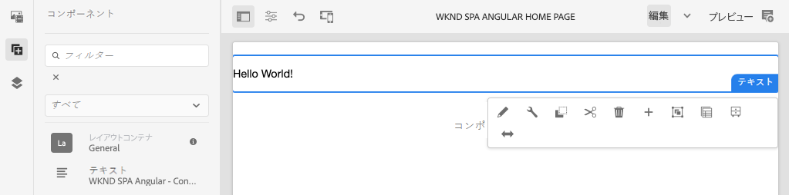
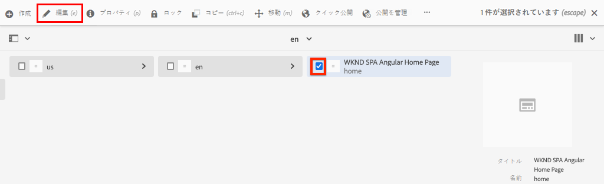
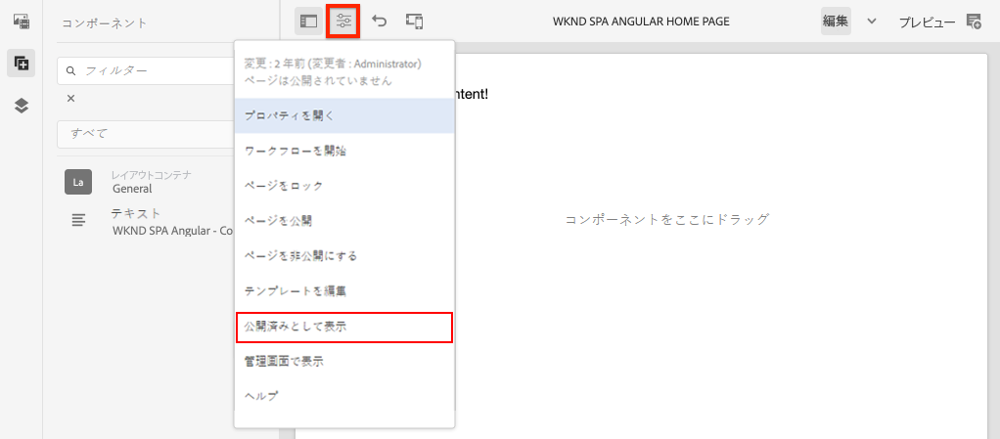

# SPA エディタープロジェクト {#create-project}

AEM SPA エディターと統合された Angular アプリケーションの出発点として、Adobe Experience Manager（AEM）Maven プロジェクトを使用する方法を説明します。

## 目的

1. Maven アーキタイプから作成された新しい AEM SPA エディタープロジェクトの構造を理解します。
2. スタータープロジェクトを AEM のローカルインスタンスにデプロイします。

## 作成する内容

この章では、[AEM プロジェクトアーキタイプ](https://github.com/adobe/aem-project-archetype)に基づいて、新しい AEM プロジェクトをデプロイします。AEM プロジェクトは、Angular SPA の非常にシンプルな出発点でブートストラップされます。この章で使用しているプロジェクトは、WKND SPA の実装の基礎となり、今後の章では、これを前提に説明します。



*従来の Hello World メッセージ。*

## 前提条件

[ローカル開発環境](overview.md#local-dev-environment)の設定に必要なツールや手順を確認します。**オーサー**&#x200B;モードで起動された Adobe Experience Manager の新しいインスタンスがローカルで実行されていることを確認します。

## プロジェクトの取得

AEM 用の Maven マルチモジュールプロジェクトを作成するには、いくつかの選択肢があります。このチュートリアルでは、最新の [AEM プロジェクトアーキタイプ](https://github.com/adobe/aem-project-archetype)をチュートリアルコードのベースとして使用しました。複数のバージョンの AEM をサポートするために、プロジェクトコードが変更されました。[下位互換性に関するメモ](overview.md#compatibility)を確認してください。

>[!CAUTION]
>
>[アーキタイプ](https://github.com/adobe/aem-project-archetype)の&#x200B;**最新**&#x200B;バージョンを使用して、実際の実装用の新しいプロジェクトを生成することをお勧めします。AEM プロジェクトでは、アーキタイプの `aemVersion` プロパティを使用して、単一バージョンの AEM をターゲットにしてください。

1. このチュートリアルの出発点となるものを Git からダウンロードします。

   ```shell
   $ git clone git@github.com:adobe/aem-guides-wknd-spa.git
   $ cd aem-guides-wknd-spa
   $ git checkout Angular/create-project-start
   ```

2. 次のフォルダーとファイル構造は、ローカルファイルシステム上の Maven アーキタイプで生成された AEM プロジェクトを表しています。

   ```plain
   |--- aem-guides-wknd-spa
       |--- all/
       |--- core/
       |--- dispatcher/
       |--- ui.apps/
       |--- ui.apps.structure/
       |--- ui.content/
       |--- ui.frontend /
       |--- it.tests/
       |--- pom.xml
       |--- README.md
       |--- .gitignore
       |--- archetype.properties
   ```

3. [AEM プロジェクトアーキタイプ](https://github.com/Adobe-Marketing-Cloud/aem-project-archetype/releases/tag/aem-project-archetype-14)から AEM プロジェクトを生成する際には、次のプロパティが使用されました。

   | プロパティ | 値 |
   |-----------------|---------------------------------------|
   | aemVersion | cloud |
   | appTitle | WKND SPA Angular |
   | appId | wknd-spa-angular |
   | groupId | com.adobe.aem.guides |
   | frontendModule | angular |
   | package | com.adobe.aem.guides.wknd.spa.angular |
   | includeExamples | n |

   >[!NOTE]
   >
   > `frontendModule=angular` プロパティに注目します。これは、AEM SPA エディターで使用されるスターター [Angular コードベース](https://experienceleague.adobe.com/docs/experience-manager-core-components/using/developing/archetype/uifrontend-angular.html?lang=ja)でプロジェクトをブートストラップするように AEM プロジェクトアーキタイプに指示しています。

## プロジェクトのビルド

次に、Maven を使用して、プロジェクトコードをコンパイル、ビルドし、AEM のローカルインスタンスにデプロイします。

1. AEM のインスタンスがポート **4502** でローカルに実行されていることを確認します。
2. コマンドラインターミナルから、Maven がインストールされていることを確認します。

   ```shell
   $ mvn --version
   Apache Maven 3.6.2
   Maven home: /Library/apache-maven-3.6.2
   Java version: 11.0.4, vendor: Oracle Corporation, runtime: /Library/Java/JavaVirtualMachines/jdk-11.0.4.jdk/Contents/Home
   ```

3. `aem-guides-wknd-spa` ディレクトリから以下の Maven コマンドを実行して、プロジェクトをビルドし、AEM にデプロイします。

   ```shell
   $ mvn -PautoInstallSinglePackage clean install
   ```

   [AEM 6.x](overview.md#compatibility) を使用している場合：

   ```shell
   $ mvn clean install -PautoInstallSinglePackage -Pclassic
   ```

   プロジェクトの複数のモジュールをコンパイルし、AEM にデプロイしてください。

   ```plain
   [INFO] ------------------------------------------------------------------------
   [INFO] Reactor Summary for wknd-spa-angular 1.0.0-SNAPSHOT:
   [INFO] 
   [INFO] wknd-spa-angular ................................... SUCCESS [  0.473 s]
   [INFO] WKND SPA Angular - Core ............................ SUCCESS [ 54.866 s]
   [INFO] wknd-spa-angular.ui.frontend - UI Frontend ......... SUCCESS [02:10 min]
   [INFO] WKND SPA Angular - Repository Structure Package .... SUCCESS [  0.694 s]
   [INFO] WKND SPA Angular - UI apps ......................... SUCCESS [  6.351 s]
   [INFO] WKND SPA Angular - UI content ...................... SUCCESS [  2.885 s]
   [INFO] WKND SPA Angular - All ............................. SUCCESS [  1.736 s]
   [INFO] WKND SPA Angular - Integration Tests Bundles ....... SUCCESS [  2.563 s]
   [INFO] WKND SPA Angular - Integration Tests Launcher ...... SUCCESS [  1.846 s]
   [INFO] WKND SPA Angular - Dispatcher ...................... SUCCESS [  0.270 s]
   [INFO] ------------------------------------------------------------------------
   [INFO] BUILD SUCCESS
   [INFO] ------------------------------------------------------------------------
   ```

   Maven プロファイル ***autoInstallSinglePackage*** では、プロジェクトの個々のモジュールをコンパイルし、単一のパッケージを AEM インスタンスにデプロイします。デフォルトでは、このパッケージは、**admin:admin** の資格情報でポート **4502** でローカルに実行されている AEM インスタンスにデプロイされます。

4. ローカル AEM インスタンスで&#x200B;**[!UICONTROL パッケージマネージャー]**（[http://localhost:4502/crx/packmgr/index.jsp](http://localhost:4502/crx/packmgr/index.jsp)）に移動します。

5. `wknd-spa-angular.all`、`wknd-spa-angular.ui.apps` および `wknd-spa-angular.ui.content` の 3 つのパッケージが表示されます。

   

   プロジェクトに必要なすべてのカスタムコードは、これらのパッケージにバンドルされ、AEM ランタイムにインストールされます。

6. また、`spa.project.core` と `core.wcm.components` のパッケージもいくつか表示されます。これらは、アーキタイプによって自動的に含まれる依存関係です。AEM コア コンポーネントについて詳しくは、[こちらを参照してください](https://experienceleague.adobe.com/docs/experience-manager-core-components/using/introduction.html?lang=ja)。

## 作成者コンテンツ

次に、アーキタイプで生成されたスターター SPA を開き、コンテンツの一部を更新します。

1. **[!UICONTROL Sites]** コンソール（[http://localhost:4502/sites.html/content](http://localhost:4502/sites.html/content)）に移動します。

   WKND SPA は、国、言語、ホームページを含む基本的なサイト構造を含んでいます。この階層は、アーキタイプの `language_country` と `isSingleCountryWebsite` のデフォルト値に基づいています。これらの値は、[使用可能なプロパティ](https://github.com/adobe/aem-project-archetype#avilable-properties)をプロジェクトの生成時に更新することで上書きできます。

2. **[!DNL us]**／**[!DNL en]**／**[!DNL WKND SPA Angular Home Page]** ページを開き、ページを選択してメニューバーの「**[!UICONTROL 編集]**」ボタンをクリックします。

   

3. **[!UICONTROL テキスト]**&#x200B;コンポーネントは既にページに追加されています。このコンポーネントは、AEM の他のコンポーネントと同様に編集できます。

   

4. さらに&#x200B;**[!UICONTROL テキスト]**&#x200B;コンポーネントをページに追加します。

   オーサリングエクスペリエンスは、従来の AEM Sites ページと似ています。 現在、使用できるコンポーネントの数は限られています。チュートリアルの過程で、さらに追加されます。

## 単一ページアプリケーションの検査

次に、ブラウザーのデベロッパーツールを使用して、これが単一ページアプリケーションであることを確認します。

1. **[!UICONTROL ページエディター]**&#x200B;で、**[!UICONTROL ページ情報]**&#x200B;メニュー／**[!UICONTROL 公開済みとして表示]**&#x200B;をクリックします。

   

   これにより、クエリパラメーター `?wcmmode=disabled` を含んだ新しいタブが開き、AEM エディターが効果的にオフになります（[http://localhost:4502/content/wknd-spa-angular/us/en/home.html?wcmmode=disabled](http://localhost:4502/content/wknd-spa-angular/us/en/home.html?wcmmode=disabled)）。

2. ページのソースを表示し、テキストコンテンツ **[!DNL Hello World]** またはその他のコンテンツが見つからないことに注意してください。代わりに、次のような HTML が表示されます。

   ```html
   ...
   <body>
       <noscript>You need to enable JavaScript to run this app.</noscript>
       <div id="spa-root"></div>
       <script type="text/javascript" src="/etc.clientlibs/wknd-spa-angular/clientlibs/clientlib-angular.min.js"></script>
       ...
   </body>
   ...
   ```

   `clientlib-angular.min.js` は、ページに読み込まれてコンテンツのレンダリングを担当する Angular SPA です。

   *コンテンツのソース*

3. タブに戻ります（[http://localhost:4502/content/wknd-spa-angular/us/en/home.html?wcmmode=disabled](http://localhost:4502/content/wknd-spa-angular/us/en/home.html?wcmmode=disabled)）。
4. ブラウザーのデベロッパーツールを開き、更新中にページのネットワークトラフィックを調べます。 **XHR** リクエストを確認します。

   

   [http://localhost:4502/content/wknd-spa-angular/us/en.model.json](http://localhost:4502/content/wknd-spa-angular/us/en.model.json) へのリクエストが表示されています。これには、SPA を駆動するすべてのコンテンツが JSON 形式で含まれます。

5. 新しいタブで、[http://localhost:4502/content/wknd-spa-angular/us/en.model.json](http://localhost:4502/content/wknd-spa-angular/us/en.model.json) を開きます。

   リクエスト `en.model.json` は、アプリケーションを駆動するコンテンツモデルを表しています。JSON 出力を調べると、**[!UICONTROL テキスト]**&#x200B;コンポーネントを表すスニペットが見つかります。

   ```json
   ...
   ":items": {
       "text": {
           "text": "<p>Hello World! Updated content!</p>\r\n",
           "richText": true,
           ":type": "wknd-spa-angular/components/text"
       },
       "text_98796435": {
           "text": "<p>A new text component.</p>\r\n",
           "richText": true,
           ":type": "wknd-spa-angular/components/text"
   },
   ...
   ```

   次の章では、JSON コンテンツを AEM コンポーネントから SPA コンポーネントにマッピングして、AEM SPA エディターエクスペリエンスの基礎として使用する方法を調べます。

   >[!NOTE]
   >
   > JSON 出力を自動的にフォーマットするブラウザー拡張機能をインストールすると役立つ場合があります。

## おめでとうございます。 {#congratulations}

最初の AEM SPA エディタープロジェクトを作成できました。

現在は非常にシンプルですが、今後の数章でさらに機能が追加されます。

### 次の手順 {#next-steps}

[SPA の統合](integrate-spa.md) - SPAソースコードが AEM プロジェクトと統合される仕組みと、SPA を迅速に開発するために使用できるツールについて説明します。
