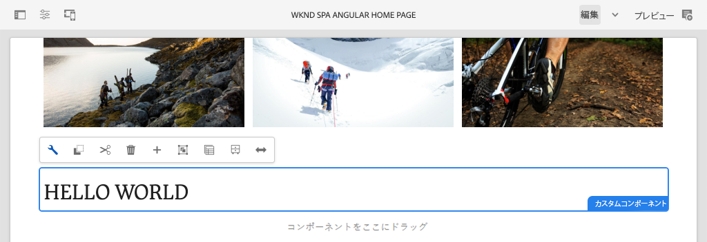
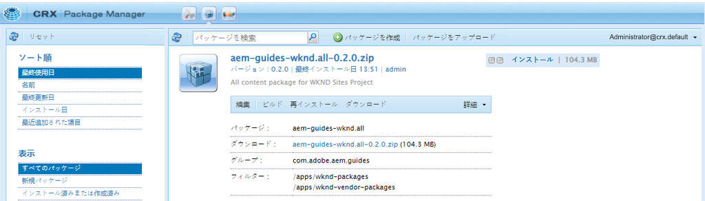
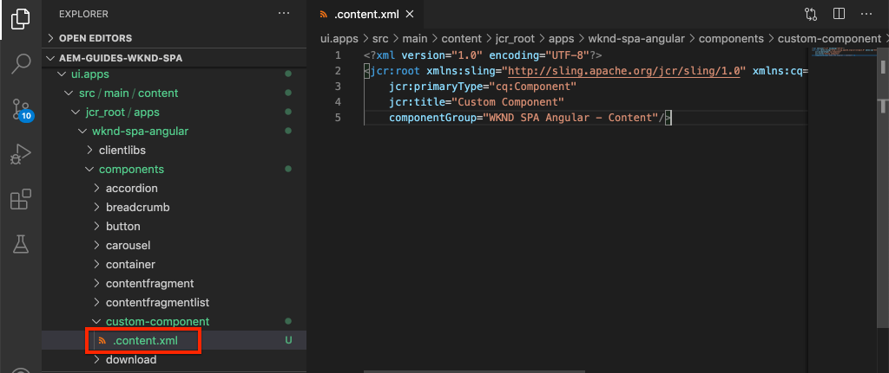
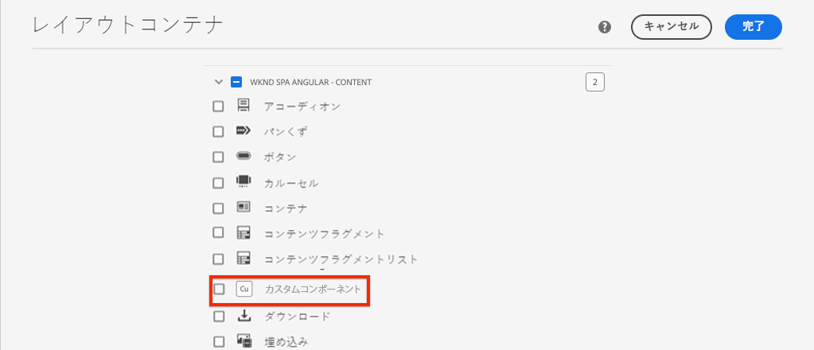
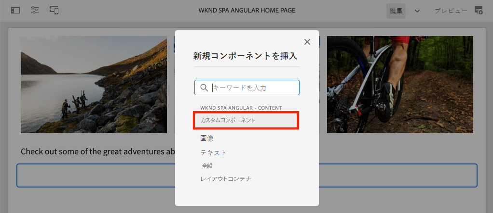

# カスタムコンポーネントの作成 {#custom-component}

AEM SPA エディターで使用するカスタムコンポーネントを作成する方法を説明します。オーサーダイアログと Sling モデルを開発して JSON モデルを拡張し、カスタムコンポーネントを設定する方法について説明します。

## 目的

1. AEM に用意されている JSON モデル API を操作する際の Sling モデルの役割を理解します。
2. AEM コンポーネントダイアログの作成方法を理解します。
3. SPA エディターフレームワークに適合する&#x200B;**カスタム** AEM コンポーネントの作成方法を説明します。

## 作成する内容

前の章では、SPA コンポーネントの開発と、それらを&#x200B;*既存*&#x200B;の AEM コアコンポーネントにマッピングする方法を重点的に説明しました。 この章では、*新規*&#x200B;の AEM コンポーネントを作成および拡張する方法と、AEM から提供される JSON モデルを操作する方法に重点を置いて説明します。

まったく新しい AEM コンポーネントを作成する際に必要な手順をシンプルな `Custom Component` で示しています。



## 前提条件

[ローカル開発環境](overview.md#local-dev-environment)の設定に必要なツールと手順を確認します。

### コードの取得

1. このチュートリアルの出発点となるものを Git からダウンロードします。

   ```shell
   $ git clone git@github.com:adobe/aem-guides-wknd-spa.git
   $ cd aem-guides-wknd-spa
   $ git checkout Angular/custom-component-start
   ```

2. Maven を使用してコードベースをローカルの AEM インスタンスにデプロイします。

   ```shell
   $ mvn clean install -PautoInstallSinglePackage
   ```

   [AEM 6.x](overview.md#compatibility) を使用する場合は、以下の `classic` プロファイルを追加します。

   ```shell
   $ mvn clean install -PautoInstallSinglePackage -Pclassic
   ```

3. 従来の [WKND リファレンスサイト](https://github.com/adobe/aem-guides-wknd/releases/latest)の完成したパッケージをインストールします。[WKND リファレンスサイト](https://github.com/adobe/aem-guides-wknd/releases/latest)から提供された画像は、WKND SPA で再利用されます。パッケージは、[AEM のパッケージマネージャー](http://localhost:4502/crx/packmgr/index.jsp)を使用してインストールできます。

   

いつでも、完成したコードを [GitHub](https://github.com/adobe/aem-guides-wknd-spa/tree/Angular/custom-component-solution) で確認したり、ブランチ `Angular/custom-component-solution` に切り替えてローカルにチェックアウトしたりできます。

## AEM コンポーネントの定義

AEM コンポーネントは、ノードおよびプロパティとして定義されます。 プロジェクトでは、これらのノードおよびプロパティは、`ui.apps` モジュールの XML ファイルとして表されます。 次に、`ui.apps` モジュールに AEM コンポーネントを作成します。

>[!NOTE]
>
> [AEM コンポーネントの基本](https://experienceleague.adobe.com/docs/experience-manager-learn/getting-started-wknd-tutorial-develop/project-archetype/component-basics.html?lang=ja)についてざっと復習しておくと役立つ場合があります。

1. `ui.apps` フォルダーを任意の IDE で開きます。
2. `ui.apps/src/main/content/jcr_root/apps/wknd-spa-angular/components` に移動し、 `custom-component` という名前のフォルダーを作成します。
3. `custom-component` フォルダーの下に `.content.xml` という名前のファイルを作成します。`custom-component/.content.xml` に以下を入力します。

   ```xml
   <?xml version="1.0" encoding="UTF-8"?>
   <jcr:root xmlns:sling="http://sling.apache.org/jcr/sling/1.0" xmlns:cq="http://www.day.com/jcr/cq/1.0" xmlns:jcr="http://www.jcp.org/jcr/1.0"
       jcr:primaryType="cq:Component"
       jcr:title="Custom Component"
       componentGroup="WKND SPA Angular - Content"/>
   ```

   

   `jcr:primaryType="cq:Component"` - このノードが AEM コンポーネントであることを示します。

   `jcr:title` は、コンテンツ作成者に表示される値で、`componentGroup` はオーサリング UI でのコンポーネントのグループ化を決定します。

4. `custom-component` フォルダーの下に、`_cq_dialog` という名前の新しいフォルダーを作成します。
5. `_cq_dialog` フォルダーの下に `.content.xml` という名前のファイルを作成し、次の内容を入力します。

   ```xml
   <?xml version="1.0" encoding="UTF-8"?>
   <jcr:root xmlns:sling="http://sling.apache.org/jcr/sling/1.0" xmlns:granite="http://www.adobe.com/jcr/granite/1.0" xmlns:cq="http://www.day.com/jcr/cq/1.0" xmlns:jcr="http://www.jcp.org/jcr/1.0" xmlns:nt="http://www.jcp.org/jcr/nt/1.0"
       jcr:primaryType="nt:unstructured"
       jcr:title="Custom Component"
       sling:resourceType="cq/gui/components/authoring/dialog">
       <content
           jcr:primaryType="nt:unstructured"
           sling:resourceType="granite/ui/components/coral/foundation/container">
           <items jcr:primaryType="nt:unstructured">
               <tabs
                   jcr:primaryType="nt:unstructured"
                   sling:resourceType="granite/ui/components/coral/foundation/tabs"
                   maximized="{Boolean}true">
                   <items jcr:primaryType="nt:unstructured">
                       <properties
                           jcr:primaryType="nt:unstructured"
                           jcr:title="Properties"
                           sling:resourceType="granite/ui/components/coral/foundation/container"
                           margin="{Boolean}true">
                           <items jcr:primaryType="nt:unstructured">
                               <columns
                                   jcr:primaryType="nt:unstructured"
                                   sling:resourceType="granite/ui/components/coral/foundation/fixedcolumns"
                                   margin="{Boolean}true">
                                   <items jcr:primaryType="nt:unstructured">
                                       <column
                                           jcr:primaryType="nt:unstructured"
                                           sling:resourceType="granite/ui/components/coral/foundation/container">
                                           <items jcr:primaryType="nt:unstructured">
                                               <message
                                                   jcr:primaryType="nt:unstructured"
                                                   sling:resourceType="granite/ui/components/coral/foundation/form/textfield"
                                                   fieldDescription="The text to display on the component."
                                                   fieldLabel="Message"
                                                   name="./message"/>
                                           </items>
                                       </column>
                                   </items>
                               </columns>
                           </items>
                       </properties>
                   </items>
               </tabs>
           </items>
       </content>
   </jcr:root>
   ```

   

   上記の XML ファイルの場合は、`Custom Component` の簡単なダイアログが生成されます。ファイルの重要な部分は、内側の `<message>` ノードです。このダイアログには、`Message` という名前の単純な `textfield` が含まれています。このテキストフィールドの値を `message` という名前のプロパティに保持します。

   次に Sling モデルを作成し、JSON モデルを介して `message` プロパティの値を公開します。

   >[!NOTE]
   >
   > [コア コンポーネントの定義を確認することで、ダイアログのより多くの例](https://github.com/adobe/aem-core-wcm-components/tree/master/content/src/content/jcr_root/apps/core/wcm/components)を確認できます。[CRXDE-Lite ](http://localhost:4502/crx/de/index.jsp#/libs/granite/ui/components/coral/foundation/form) の `/libs/granite/ui/components/coral/foundation/form` の下にある`select`、`textarea`、`pathfield` などの追加のフォームフィールドを表示することもできます。

   従来の AEM コンポーネントでは、通常 [HTL](https://experienceleague.adobe.com/docs/experience-manager-htl/content/overview.html?lang=ja) スクリプトが必要です。SPA がコンポーネントをレンダリングするので、HTL スクリプトは必要ありません。

## Sling モデルの作成

Sling モデルは、JCR から Java™ 変数へのデータのマッピングを容易にする注釈主導の Java™「POJO」（Plain Old Java™ Objects）です。[Sling モデル](https://experienceleague.adobe.com/docs/experience-manager-learn/getting-started-wknd-tutorial-develop/project-archetype/component-basics.html?lang=ja#sling-models)は通常、AEM コンポーネントの複雑なサーバーサイドビジネスロジックをカプセル化する機能を果たします。

SPA エディターのコンテキストでは、Sling モデルは [Sling Model Exporter](https://experienceleague.adobe.com/docs/experience-manager-learn/foundation/development/develop-sling-model-exporter.html?lang=ja) を使用した機能により、JSON モデルを通じてコンポーネントのコンテンツを公開します。

1. 任意に選択した IDE で `core` モジュールを開きます。`CustomComponent.java` と `CustomComponentImpl.java` は既に作成されており、この章の初期コードの一部としてスタブ化されています。

   >[!NOTE]
   >
   > Visual Studio Code IDE を使用している場合は、[Java™ の拡張機能](https://code.visualstudio.com/docs/java/extensions)をインストールすると役立つ可能性があります。

2. `core/src/main/java/com/adobe/aem/guides/wknd/spa/angular/core/models/CustomComponent.java` で Java™ インターフェイス `CustomComponent.java` を開きます。

   

   これは、Sling モデルで実装されている Java™ インターフェイスです。

3. `ComponentExporter` インターフェイスを拡張するように `CustomComponent.java` を更新します。

   ```java
   package com.adobe.aem.guides.wknd.spa.angular.core.models;
   import com.adobe.cq.export.json.ComponentExporter;
   
   public interface CustomComponent extends ComponentExporter {
   
       public String getMessage();
   
   }
   ```

   `ComponentExporter` インターフェイスの実装は、JSON モデル API で Sling モデルが自動的に取得されるための要件です。

   `CustomComponent` インターフェイスには、単一のゲッターメソッド `getMessage()` が含まれています。これは、JSON モデルを通じてオーサーダイアログの値を公開するメソッドです。空のパラメータ `()` を持つゲッターメソッドのみが JSON モデルに書き出されます。

4. `core/src/main/java/com/adobe/aem/guides/wknd/spa/angular/core/models/impl/CustomComponentImpl.java` で `CustomComponentImpl.java` を開きます。

   これは `CustomComponent` インターフェイスの実装です。`@Model` 注釈は、Java™ クラスを Sling モデルとして識別します。`@Exporter` 注釈により、Sling Model Exporter を通じて Java™ クラスをシリアル化して書き出すことができます。

5. 静的変数 `RESOURCE_TYPE` を更新して、前の演習で作成した AEM コンポーネント `wknd-spa-angular/components/custom-component` を指すようにします。

   ```java
   static final String RESOURCE_TYPE = "wknd-spa-angular/components/custom-component";
   ```

   コンポーネントのリソースタイプは、Sling モデルを AEM コンポーネントにバインドし、最終的に Angular コンポーネントにマッピングするものです。

6. コンポーネントのリソースタイプを返す `getExportedType()` メソッドを `CustomComponentImpl` クラスに追加します。

   ```java
   @Override
   public String getExportedType() {
       return CustomComponentImpl.RESOURCE_TYPE;
   }
   ```

   このメソッドは `ComponentExporter` インターフェースを実装する際に必要で、Angular コンポーネントへのマッピングを可能にするリソースタイプを公開します。

7. オーサーダイアログが保持する `message` プロパティの値を返すように、`getMessage()` メソッドを更新します。`@ValueMap` 注釈を使用すると、JCR 値 `message` を Java™ 変数にマッピングできます。

   ```java
   import org.apache.commons.lang3.StringUtils;
   ...
   
   @ValueMapValue
   private String message;
   
   @Override
   public String getMessage() {
       return StringUtils.isNotBlank(message) ? message.toUpperCase() : null;
   }
   ```

   メッセージの値を大文字で返すための「ビジネスロジック」がいくつか追加されています。 これにより、オーサーダイアログに保存されている生の値と、Sling モデルで公開される値の違いを確認できます。

   >[!NOTE]
   >
   > 完成した CustomComponentImpl.java は、[こちら](https://github.com/adobe/aem-guides-wknd-spa/blob/Angular/custom-component-solution/core/src/main/java/com/adobe/aem/guides/wknd/spa/angular/core/models/impl/CustomComponentImpl.java)で確認できます。

## Angular コンポーネントの更新

カスタムコンポーネントの Angular コードは既に作成されています。次に、Angular コンポーネントを AEM コンポーネントにマッピングするために、いくつかの更新を行います。

1. `ui.frontend` モジュールで、ファイル `ui.frontend/src/app/components/custom/custom.component.ts` を開きます。
2. `@Input() message: string;` 行を確認します。変換された大文字の値がこの変数にマッピングされるはずです。
3. `MapTo` オブジェクトを AEM SPA エディター JavaScript SDK から読み込み、それを使用して AEM コンポーネントにマッピングします。

   ```diff
   + import {MapTo} from '@adobe/cq-angular-editable-components';
   
    ...
    export class CustomComponent implements OnInit {
        ...
    }
   
   + MapTo('wknd-spa-angular/components/custom-component')(CustomComponent, CustomEditConfig);
   ```

4. `cutom.component.html` を開いて、`{{message}}` の値が `<h2>` タグ内に表示されていることを確認します。
5. `custom.component.css` を開いて、次のルールを追加します。

   ```css
   :host-context {
       display: block;
   }
   ```

   コンポーネントが空のときに AEM エディターのプレースホルダーを正しく表示するには、`:host-context` または別の `<div>` を `display: block;` に設定する必要があります。

6. Maven のスキルを活用して、プロジェクトディレクトリのルートからローカル AEM 環境にアップデートをデプロイします。

   ```shell
   $ cd aem-guides-wknd-spa
   $ mvn clean install -PautoInstallSinglePackage
   ```

## テンプレートポリシーの更新

次に、AEM に移動してアップデートを確認し、`Custom Component` を SPA に追加できるようにします。

1. [http://localhost:4502/system/console/status-slingmodels](http://localhost:4502/system/console/status-slingmodels) に移動して、新しい Sling モデルの登録を確認します。

   ```plain
   com.adobe.aem.guides.wknd.spa.angular.core.models.impl.CustomComponentImpl - wknd-spa-angular/components/custom-component
   
   com.adobe.aem.guides.wknd.spa.angular.core.models.impl.CustomComponentImpl exports 'wknd-spa-angular/components/custom-component' with selector 'model' and extension '[Ljava.lang.String;@6fb4a693' with exporter 'jackson'
   ```

   `CustomComponentImpl` が `wknd-spa-angular/components/custom-component` コンポーネントに関連付けられていることと、それが Sling Model Exporter を介して登録されていることを示す上記の 2 行があります。

2. [http://localhost:4502/editor.html/conf/wknd-spa-angular/settings/wcm/templates/spa-page-template/structure.html](http://localhost:4502/editor.html/conf/wknd-spa-angular/settings/wcm/templates/spa-page-template/structure.html) にある SPA ページテンプレートに移動します。
3. レイアウトコンテナのポリシーを更新して、新しい `Custom Component` を許可されたコンポーネントとして追加します。

   

   ポリシーへの変更を保存し、許可されたコンポーネントとして `Custom Component` を確認します。

   

## カスタムコンポーネントの作成

次に、AEM SPA エディターを使用して `Custom Component` を作成します。

1. [http://localhost:4502/editor.html/content/wknd-spa-angular/us/en/home.html](http://localhost:4502/editor.html/content/wknd-spa-angular/us/en/home.html) に移動します。
2. `Edit` モードで、`Custom Component` を `Layout Container` に追加します。

   

3. コンポーネントのダイアログを開き、小文字を含んだメッセージを入力します。

   

   これは、この章で前述した XML ファイルに基づいて作成されたダイアログです。

4. 変更を保存します。表示されるメッセージがすべて大文字であることを確認します。

   

5. [http://localhost:4502/content/wknd-spa-angular/us/en.model.json](http://localhost:4502/content/wknd-spa-angular/us/en.model.json) に移動して、JSON モデルを表示します。`wknd-spa-angular/components/custom-component` を検索します。

   ```json
   "custom_component_208183317": {
       "message": "HELLO WORLD",
       ":type": "wknd-spa-angular/components/custom-component"
   }
   ```

   Sling モデルに追加されたロジックに基づいて、JSON 値がすべて大文字に設定されます。

## おめでとうございます。 {#congratulations}

以上、カスタム AEM コンポーネントを作成する方法と、Sling モデルおよびダイアログが JSON モデルと連携する仕組みについて学びました。

いつでも、完成したコードを [GitHub](https://github.com/adobe/aem-guides-wknd-spa/tree/Angular/custom-component-solution) で確認したり、ブランチ `Angular/custom-component-solution` に切り替えてローカルにチェックアウトしたりできます。

### 次の手順 {#next-steps}

[コアコンポーネントの拡張](extend-component.md) - 既存のコアコンポーネントを拡張して AEM SPA エディターで使用できるようにする方法を説明します。既存のコンポーネントにプロパティとコンテンツを追加する方法を理解すると、AEM SPA エディター実装の機能を拡張するための強力な手法になります。
