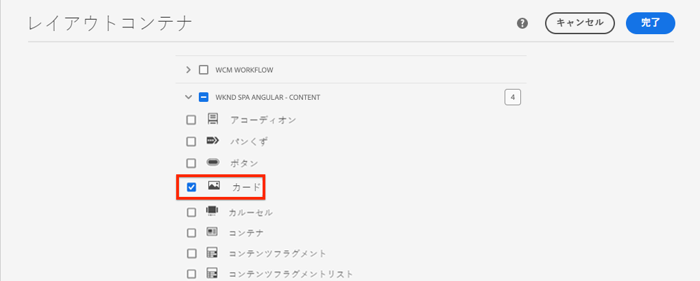
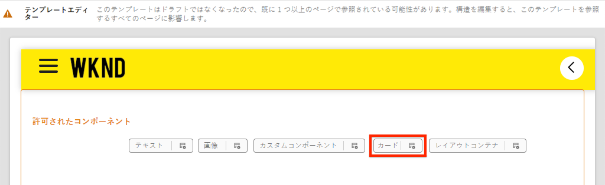
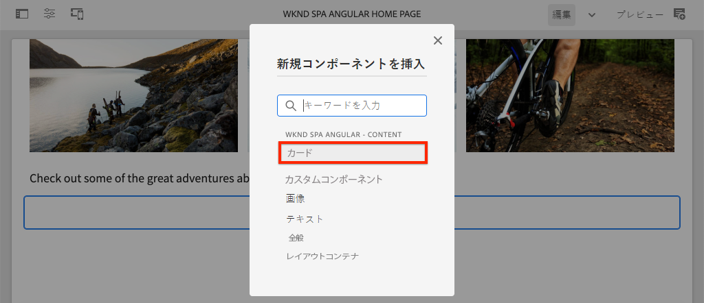
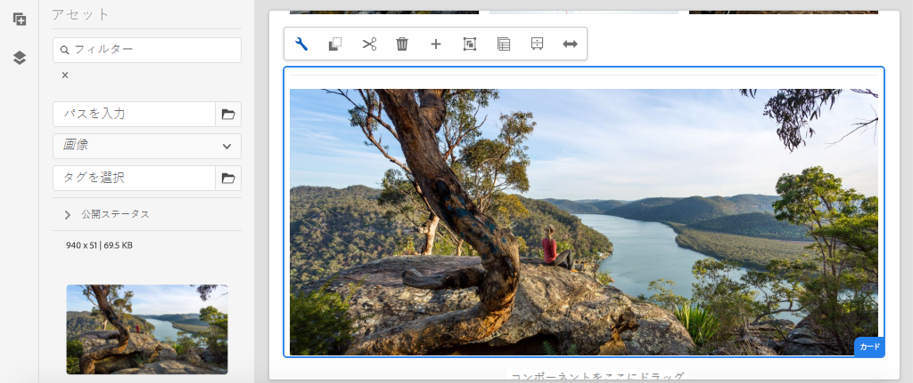
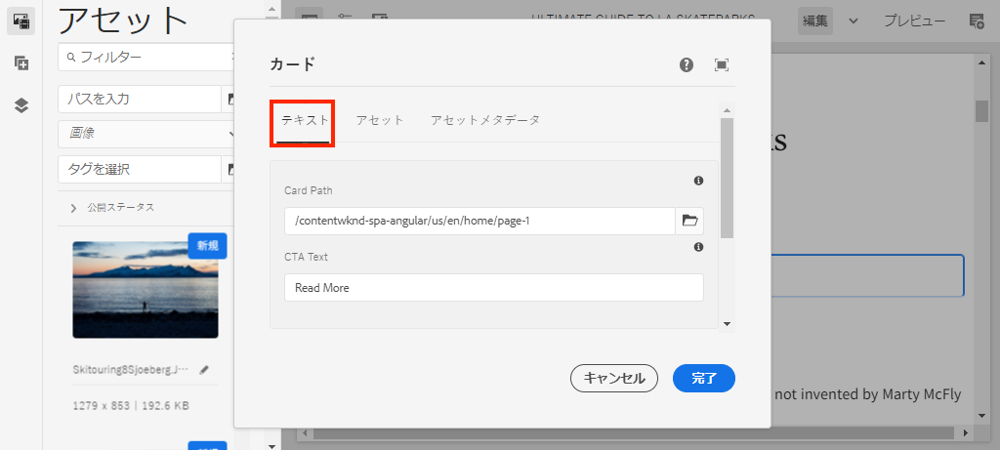
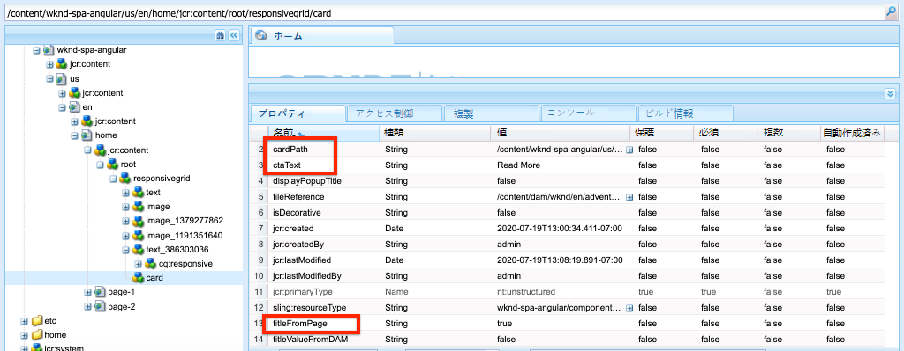
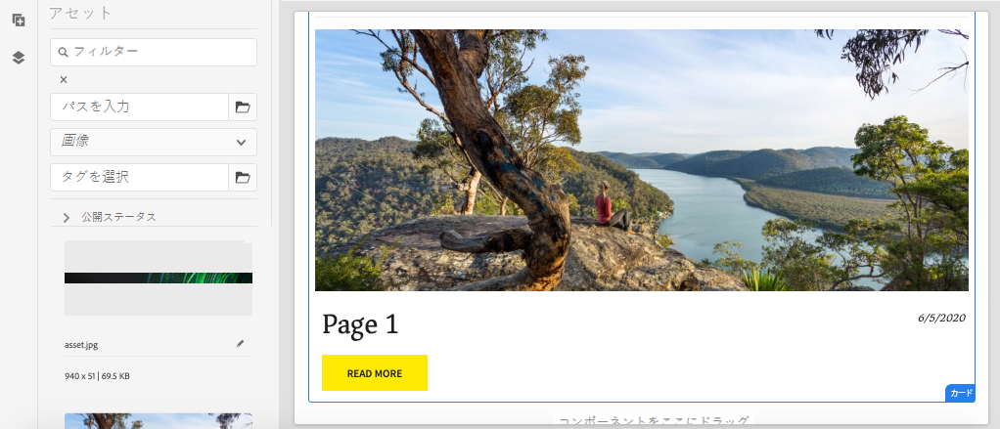

# コアコンポーネントの拡張 {#extend-component}

既存のコアコンポーネントを拡張して、AEM SPA エディターで使用する方法を説明します。 既存のコンポーネントの拡張方法を理解することは、AEM SPA エディター実装の機能をカスタマイズおよび拡張するための強力な手法です。

## 目的

1. 追加のプロパティやコンテンツを使用して、既存のコアコンポーネントを拡張する
2. `sling:resourceSuperType` を使用したコンポーネントの継承の基本を理解する
3. Sling モデルで[デリゲーションパターン](https://github.com/adobe/aem-core-wcm-components/wiki/Delegation-Pattern-for-Sling-Models)を使用して既存のロジックと機能を再利用する方法を学ぶ

## 作成する内容

この章では、新しい `Card` コンポーネントが作成されます。 `Card` コンポーネントは [画像コアコンポーネント](https://experienceleague.adobe.com/docs/experience-manager-core-components/using/components/image.html?lang=ja)を拡張し、タイトルやコールトゥアクションボタンなどのコンテンツフィールドを追加して、SPA 内の他のコンテンツのティーザーの役割を果たします。


>[!NOTE]
>
> 実際の実装では、プロジェクト要件に応じて、[画像コアコンポーネント](https://experienceleague.adobe.com/docs/experience-manager-core-components/using/components/image.html?lang=ja)を拡張して `Card` コンポーネントを作成するよりも、単純に[ティーザーコンポーネント](https://experienceleague.adobe.com/docs/experience-manager-core-components/using/components/teaser.html?lang=ja)を使用する方が適切な場合があります。可能であれば、[コア コンポーネント](https://experienceleague.adobe.com/docs/experience-manager-core-components/using/introduction.html?lang=ja)を直接使用することを常にお勧めします。

## 前提条件

[ローカル開発環境](overview.md#local-dev-environment)の設定に必要なツールと手順を確認します。

### コードの取得

1. このチュートリアルの出発点となるものを Git からダウンロードします。

   ```shell
   $ git clone git@github.com:adobe/aem-guides-wknd-spa.git
   $ cd aem-guides-wknd-spa
   $ git checkout Angular/extend-component-start
   ```

2. Maven を使用してコードベースをローカルの AEM インスタンスにデプロイします。

   ```shell
   $ mvn clean install -PautoInstallSinglePackage
   ```

   [AEM 6.x](overview.md#compatibility) を使用する場合は、以下の `classic` プロファイルを追加します。

   ```shell
   $ mvn clean install -PautoInstallSinglePackage -Pclassic
   ```

3. 従来の [WKND リファレンスサイト](https://github.com/adobe/aem-guides-wknd/releases/tag/aem-guides-wknd-2.1.0)の完成したパッケージをインストールします。[WKND リファレンスサイト](https://github.com/adobe/aem-guides-wknd/releases/latest)から提供された画像は、WKND SPA で再利用されます。パッケージは、[AEM のパッケージマネージャー](http://localhost:4502/crx/packmgr/index.jsp)を使用してインストールできます。

   

いつでも、完成したコードを [GitHub](https://github.com/adobe/aem-guides-wknd-spa/tree/Angular/extend-component-solution) で確認したり、ブランチ `Angular/extend-component-solution` に切り替えてコードをローカルにチェックアウトしたりできます。

## 初期カード実装の調査

最初のカードコンポーネントは、章のスターターターコードによって提供されています。カード実装の出発点を調べます。

1. 任意の IDE で、`ui.apps` モジュールを開きます。
2. `ui.apps/src/main/content/jcr_root/apps/wknd-spa-angular/components/card` に移動して `.content.xml` ファイルを表示します。 

   

   ```xml
   <?xml version="1.0" encoding="UTF-8"?>
   <jcr:root xmlns:sling="http://sling.apache.org/jcr/sling/1.0" xmlns:cq="http://www.day.com/jcr/cq/1.0" xmlns:jcr="http://www.jcp.org/jcr/1.0"
       jcr:primaryType="cq:Component"
       jcr:title="Card"
       sling:resourceSuperType="wknd-spa-angular/components/image"
       componentGroup="WKND SPA Angular - Content"/>
   ```

   プロパティ `sling:resourceSuperType` は、`Card` コンポーネントが WKND SPA 画像コンポーネントから機能を継承することを示す `wknd-spa-angular/components/image` をポイントします。

3. `ui.apps/src/main/content/jcr_root/apps/wknd-spa-angular/components/image/.content.xml` ファイルを調べます。

   ```xml
   <?xml version="1.0" encoding="UTF-8"?>
   <jcr:root xmlns:sling="http://sling.apache.org/jcr/sling/1.0" xmlns:cq="http://www.day.com/jcr/cq/1.0" xmlns:jcr="http://www.jcp.org/jcr/1.0"
       jcr:primaryType="cq:Component"
       jcr:title="Image"
       sling:resourceSuperType="core/wcm/components/image/v2/image"
       componentGroup="WKND SPA Angular - Content"/>
   ```

   `sling:resourceSuperType` が `core/wcm/components/image/v2/image` をポイントしていることに注目してください。これは、WKND SPA 画像コンポーネントがコアコンポーネントの画像から機能を継承していることを示しています。

   [プロキシパターン](https://experienceleague.adobe.com/docs/experience-manager-core-components/using/developing/guidelines.html#proxy-component-pattern?lang=ja)とも呼ばれ、Sling リソースの継承は、子コンポーネントが必要に応じて機能を継承し、動作を拡張/上書きできるようにするための強力なデザインパターンです。 Sling 継承は複数のレベルの継承をサポートするので、最終的に `Card` コンポーネントは、コアコンポーネントの画像の機能を継承します。

   多くの開発チームは、D.R.Y. （don&#39;t repeat yourself：繰り返しを避ける）を目指しています。AEM では、Sling の継承によってこれを実現できます。

4. `card` フォルダーの下で、`_cq_dialog/.content.xml` ファイルを開きます。

   このファイルは、`Card` コンポーネントのコンポーネントダイアログ定義です。Sling 継承を使用している場合、[Sling Resource Merger](https://experienceleague.adobe.com/docs/experience-manager-65/developing/platform/sling-resource-merger.html?lang=ja) 機能を使用して、ダイアログの一部を上書きまたは拡張することができます。このサンプルでは、作成者から追加データをキャプチャしてカードコンポーネントに入力するための新しいタブがダイアログに追加されました。

   `sling:orderBefore` のようなプロパティを使用すると、デベロッパーは新しいタブまたはフォームフィールドを挿入する場所を選択できます。この場合、「`Text`」タブは「`asset`」タブの前に挿入されます。Sling Resource Merger を最大限に活用するには、[画像コンポーネントダイアログ](https://github.com/adobe/aem-core-wcm-components/blob/master/content/src/content/jcr_root/apps/core/wcm/components/image/v2/image/_cq_dialog/.content.xml)の元のダイアログノード構造を知っておくことが重要です。

5. `card` フォルダーの下の、`_cq_editConfig.xml` ファイルを開きます。このファイルは、AEM オーサリング UI でのドラッグ&amp;ドロップ動作を示します。 Image コンポーネントを拡張する場合、リソースタイプがコンポーネント自体に一致することが重要です。 `<parameters>` ノードを確認します。

   ```xml
   <parameters
       jcr:primaryType="nt:unstructured"
       sling:resourceType="wknd-spa-angular/components/card"
       imageCrop=""
       imageMap=""
       imageRotate=""/>
   ```

   ほとんどのコンポーネントは `cq:editConfig` を必要としません。画像、および画像コンポーネントの子の子孫は例外です。

6. IDE で `ui.frontend` モジュールに切り替え、`ui.frontend/src/app/components/card` に移動します。

   

7. `card.component.ts` ファイルを調べます。

   コンポーネントは、標準の `MapTo` 関数を使用して AEM `Card` コンポーネントにマッピングするために既にスタブ化されています。

   ```js
   MapTo('wknd-spa-angular/components/card')(CardComponent, CardEditConfig);
   ```

   クラスで、`src`、`alt`、`title` の 3 つの `@Input` パラメーターを確認してください。これらは、Angular コンポーネントにマッピングされる AEM コンポーネントからの期待される JSON 値です。

8. `card.component.html` ファイルを開きます。

   ```html
   <div class="card"  *ngIf="hasContent">
       <app-image class="card__image" [src]="src" [alt]="alt" [title]="title"></app-image>
   </div>
   ```

   この例では、`card.component.ts` から `@Input` パラメーターを渡すだけで、既存の Angular 画像コンポーネント `app-image` を再利用することを選択しました。チュートリアルの後半で、追加のプロパティが追加および表示されます。

## テンプレートポリシーの更新

この最初の `Card` の実装では、AEM SPA エディターで機能を確認します。 最初の `Card` コンポーネントを表示するには、テンプレートポリシーを更新する必要があります。

1. スターターコードを AEM のローカルインスタンスにデプロイします（まだデプロイしていない場合）。

   ```shell
   $ cd aem-guides-wknd-spa
   $ mvn clean install -PautoInstallSinglePackage
   ```

2. [http://localhost:4502/editor.html/conf/wknd-spa-angular/settings/wcm/templates/spa-page-template/structure.html](http://localhost:4502/editor.html/conf/wknd-spa-angular/settings/wcm/templates/spa-page-template/structure.html) にある SPA ページテンプレートに移動します。 .
3. レイアウトコンテナのポリシーを更新して、新しい `Card` コンポーネントを許可されたコンポーネントとして追加します。

   

   変更をポリシーに保存し、`Card` コンポーネントが許可されたコンポーネントになっていることを確認します。

   

## 最初のカードコンポーネントの作成

次に、AEM SPA エディターを使用して `Card` コンポーネントを作成します。

1. [http://localhost:4502/editor.html/content/wknd-spa-angular/us/en/home.html](http://localhost:4502/editor.html/content/wknd-spa-angular/us/en/home.html) に移動します。
2. `Edit` モードで、`Card` コンポーネントを `Layout Container` に追加します。

   

3. アセットファインダーから `Card` コンポーネントに画像をドラッグ＆ドロップします。

   

4. `Card` コンポーネントダイアログを開き、「**テキスト**」タブが追加されていることを確認してください。
5. 次の値を「**テキスト**」タブに入力します。

   

   **カードのパス** - SPA ホームページの下のページを選択します。

   **CTA テキスト** - 「続きを読む」

   **カードタイトル** - 空白のまま

   **リンクされたページからタイトルを取得する** - true を示すチェックボックスをオンにします。

6. 「**アセットメタデータ**」タブを更新して、「**代替テキスト**」と「**キャプション**」の値を追加します。

   現在は、ダイアログの更新後に追加の変更は表示されません。 新しいフィールドを Angular コンポーネントに公開するには、`Card` コンポーネントの Sling モデルを更新する必要があります。

7. 新しいタブを開き、[CRXDE-Lite](http://localhost:4502/crx/de/index.jsp#/content/wknd-spa-angular/us/en/home/jcr%3Acontent/root/responsivegrid/card) に移動します。 `/content/wknd-spa-angular/us/en/home/jcr:content/root/responsivegrid` の下のコンテンツノードを調べて、`Card` コンポーネントコンテンツを見つけます。

   

   プロパティ `cardPath`、`ctaText`、`titleFromPage` がダイアログによって保持されていることを確認します。

## カード Sling モデルを更新する

コンポーネントダイアログの値を最終的に Angular コンポーネントに公開するには、`Card` コンポーネントの JSON を入力する Sling モデルを更新する必要があります。また、次の 2 つのビジネスロジックを実装することもできます。

* `titleFromPage` が **true** の場合、`cardPath` で指定されたページのタイトルを返します。それ以外の場合は、`cardTitle` テキストフィールドの値を返します。
* `cardPath` で指定されたページの最終更新日を返します。

任意の IDE に戻り、`core` モジュールを開きます。

1. `core/src/main/java/com/adobe/aem/guides/wknd/spa/angular/core/models/Card.java` の `Card.java` ファイルを開きます。

   `Card` インターフェイスは現在 `com.adobe.cq.wcm.core.components.models.Image` を拡張しているため、`Image` インターフェイスのメソッドを継承していることに注意してください。`Image` インターフェイスはすでに `ComponentExporter` インターフェイスを拡張しているため、Sling モデルを JSON としてエクスポートし、SPA エディターでマッピングできます。したがって、[カスタムコンポーネントの章](custom-component.md)で行ったように、`ComponentExporter` インターフェイスを明示的に拡張する必要はありません。

2. インターフェイスに次のメソッドを追加します。

   ```java
   @ProviderType
   public interface Card extends Image {
   
       /***
       * The URL to populate the CTA button as part of the card.
       * The link should be based on the cardPath property that points to a page.
       * @return String URL
       */
       public String getCtaLinkURL();
   
       /***
       * The text to display on the CTA button of the card.
       * @return String CTA text
       */
       public String getCtaText();
   
   
   
       /***
       * The date to be displayed as part of the card.
       * This is based on the last modified date of the page specified by the cardPath
       * @return
       */
       public Calendar getCardLastModified();
   
   
       /**
       * Return the title of the page specified by cardPath if `titleFromPage` is set to true.
       * Otherwise return the value of `cardTitle`
       * @return
       */
       public String getCardTitle();
   }
   ```

   これらのメソッドは、JSON モデル API を介して公開され、Angular コンポーネントに渡されます。

3. `CardImpl.java` を開きます。これは、`Card.java` インターフェイスの実装です。この実装は、チュートリアルを高速化するために部分的にスタブ化されました。  `@Model` および `@Exporter` アノテーションを使用して、Sling モデルエクスポーターを介して Sling モデルを JSON としてシリアル化できることを確認してください。

   また、`CardImpl.java` は [Sling モデルの委任パターン](https://github.com/adobe/aem-core-wcm-components/wiki/Delegation-Pattern-for-Sling-Models)を使用して、画像コアコンポーネントからのロジックの書き換えを回避します。

4. 次の行をご覧ください。

   ```java
   @Self
   @Via(type = ResourceSuperType.class)
   private Image image;
   ```

   上記のアノテーションは、`Card` コンポーネントの `sling:resourceSuperType` 継承に基づいて `image` という名前の画像オブジェクトをインスタンス化します。

   ```java
   @Override
   public String getSrc() {
       return null != image ? image.getSrc() : null;
   }
   ```

   その場合、`image` オブジェクトを使用して `Image` インターフェイスで定義されたメソッドを実装することができるので、自分でロジックを書く必要はありません。この手法は、`getSrc()`、`getAlt()`、`getTitle()` に使用されます。

5. 次に、`cardPath` の値に基づいてプライベート変数 `cardPage` を開始する `initModel()` メソッドを実装します。

   ```java
   @PostConstruct
   public void initModel() {
       if(StringUtils.isNotBlank(cardPath) && pageManager != null) {
           cardPage = pageManager.getPage(this.cardPath);
       }
   }
   ```

   `@PostConstruct initModel()` は Sling モデルが初期化されるときに呼び出されるため、モデル内の他のメソッドで使用される可能性があるオブジェクトを初期化する良い機会です。`pageManager` は、`@ScriptVariable` アノテーションを介して Sling モデルで使用できる、[Java™ でサポートされたグローバルオブジェクト](https://experienceleague.adobe.com/docs/experience-manager-htl/content/global-objects.html?lang=ja)の 1 つです。[getPage](https://developer.adobe.com/experience-manager/reference-materials/cloud-service/javadoc/com/day/cq/wcm/api/PageManager.html) メソッドはパスを受け取り、AEM [Page](https://developer.adobe.com/experience-manager/reference-materials/cloud-service/javadoc/com/day/cq/wcm/api/Page.html) オブジェクトを返します（または、パスが有効なページを指していない場合は null を返します）。

   これにより `cardPage` 変数が初期化されます。この変数は、他の新しいメソッドによって使用され、基になるリンクされたページに関するデータが返されます。

6. 作成者ダイアログで保存された JCR プロパティにすでにマップされているグローバル変数を確認します。`@ValueMapValue` アノテーションは、マッピングを自動的に実行するために使用されます。

   ```java
   @ValueMapValue
   private String cardPath;
   
   @ValueMapValue
   private String ctaText;
   
   @ValueMapValue
   private boolean titleFromPage;
   
   @ValueMapValue
   private String cardTitle;
   ```

   これらの変数は、`Card.java` インターフェイスの追加メソッドを実装するために使用されます。

7. `Card.java` インターフェイスで定義された追加のメソッドを実装します。

   ```java
   @Override
   public String getCtaLinkURL() {
       if(cardPage != null) {
           return cardPage.getPath() + ".html";
       }
       return null;
   }
   
   @Override
   public String getCtaText() {
       return ctaText;
   }
   
   @Override
   public Calendar getCardLastModified() {
      if(cardPage != null) {
          return cardPage.getLastModified();
      }
      return null;
   }
   
   @Override
   public String getCardTitle() {
       if(titleFromPage) {
           return cardPage != null ? cardPage.getTitle() : null;
       }
       return cardTitle;
   }
   ```

   >[!NOTE]
   >
   > 完成した CardImpl.java は[こちら](https://github.com/adobe/aem-guides-wknd-spa/blob/Angular/extend-component-solution/core/src/main/java/com/adobe/aem/guides/wknd/spa/angular/core/models/impl/CardImpl.java)で確認できます。

8. ターミナルウィンドウを開き、`core` ディレクトリの Maven `autoInstallBundle` プロファイルを使用して `core` モジュールへの更新のみをデプロイします。

   ```shell
   $ cd core/
   $ mvn clean install -PautoInstallBundle
   ```

   [AEM 6.x](overview.md#compatibility) を使用している場合は、`classic` プロファイルを追加します。

9. [http://localhost:4502/content/wknd-spa-angular/us/en.model.json](http://localhost:4502/content/wknd-spa-angular/us/en.model.json) で JSON モデルの応答を確認し、`wknd-spa-angular/components/card` を検索します。

   ```json
   "card": {
       "ctaText": "Read More",
       "cardTitle": "Page 1",
       "title": "Woman chillaxing with river views in Australian bushland",
       "src": "/content/wknd-spa-angular/us/en/home/_jcr_content/root/responsivegrid/card.coreimg.jpeg/1595190732886/adobestock-216674449.jpeg",
       "alt": "Female sitting on a large rock relaxing in afternoon dappled light the Australian bushland with views over the river",
       "cardLastModified": 1591360492414,
       "ctaLinkURL": "/content/wknd-spa-angular/us/en/home/page-1.html",
       ":type": "wknd-spa-angular/components/card"
   }
   ```

   `CardImpl` Sling モデルのメソッドを更新した後、追加のキーと値のペアで JSON モデルが更新されていることを確認してください。

## Angular コンポーネントを更新する

JSON モデルに `ctaLinkURL`、`ctaText`、`cardTitle`、`cardLastModified` の新しいプロパティが入力されたので、これらを表示するように Angular コンポーネントを更新できます。

1. IDE に戻り、`ui.frontend` モジュールを開きます。必要に応じて、新しいターミナルウィンドウから webpack 開発サーバーを起動し、変更をリアルタイムで確認します。

   ```shell
   $ cd ui.frontend
   $ npm install
   $ npm start
   ```

2. `ui.frontend/src/app/components/card/card.component.ts` で `card.component.ts` を開きます。新しいモデルをキャプチャするために `@Input` アノテーションを追加します。

   ```diff
   export class CardComponent implements OnInit {
   
        @Input() src: string;
        @Input() alt: string;
        @Input() title: string;
   +    @Input() cardTitle: string;
   +    @Input() cardLastModified: number;
   +    @Input() ctaLinkURL: string;
   +    @Input() ctaText: string;
   ```

3. コールトゥアクションの準備ができているかどうかを確認するメソッドと、`cardLastModified` 入力に基づいて日時文字列を返すメソッドを追加します。

   ```js
   export class CardComponent implements OnInit {
       ...
       get hasCTA(): boolean {
           return this.ctaLinkURL && this.ctaLinkURL.trim().length > 0 && this.ctaText && this.ctaText.trim().length > 0;
       }
   
       get lastModifiedDate(): string {
           const lastModifiedDate = this.cardLastModified ? new Date(this.cardLastModified) : null;
   
           if (lastModifiedDate) {
           return lastModifiedDate.toLocaleDateString();
           }
           return null;
       }
       ...
   }
   ```

4. `card.component.html` を開き、次のマークアップを追加して、タイトル、行動を促すフレーズ、最終更新日を表示するようにします。

   ```html
   <div class="card"  *ngIf="hasContent">
       <app-image class="card__image" [src]="src" [alt]="alt" [title]="title"></app-image>
       <div class="card__content">
           <h2 class="card__title">
               {{cardTitle}}
               <span class="card__lastmod" *ngIf="lastModifiedDate">{{lastModifiedDate}}</span>
           </h2>
           <div class="card__action-container" *ngIf="hasCTA">
               <a [routerLink]="ctaLinkURL" class="card__action-link" [title]="ctaText">
                   {{ctaText}}
               </a>
           </div>
       </div>
   </div>
   ```

   `card.component.scss` には、タイトル、最終更新日のスタイルを設定する Sass ルールが既に追加されています。

   >[!NOTE]
   >
   > 完了した Angular カードコンポーネントのコードは[こちら](https://github.com/adobe/aem-guides-wknd-spa/tree/Angular/extend-component-solution/ui.frontend/src/app/components/card)で確認できます。

5. Maven を使用して、プロジェクトのルートから、すべての変更を AEM にデプロイします。

   ```shell
   $ cd aem-guides-wknd-spa
   $ mvn clean install -PautoInstallSinglePackage
   ```

6. [http://localhost:4502/editor.html/content/wknd-spa-angular/us/en/home.html](http://localhost:4502/editor.html/content/wknd-spa-angular/us/en/home.html) に移動して、更新されたコンポーネントを確認します。

   

7. 次のようなページを作成するには、既存のコンテンツを再オーサリングできるはずです。

   

## おめでとうございます。 {#congratulations}

これで、AEM コンポーネントの拡張方法と、Sling モデルとダイアログが JSON モデルと連携する仕組みを学びました。

完成したコードは、[GitHub](https://github.com/adobe/aem-guides-wknd-spa/tree/Angular/extend-component-solution)で確認できます。また、`Angular/extend-component-solution` ブランチに切り替えて、コードをローカルでチェックアウトすることもできます。
