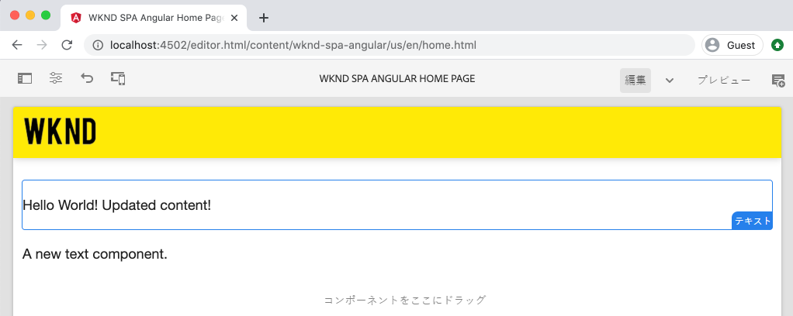
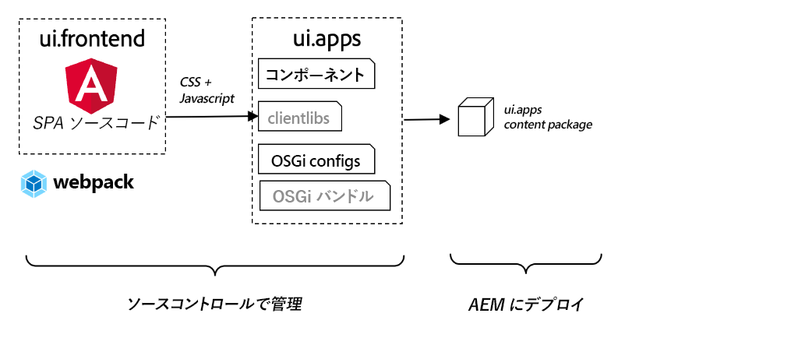
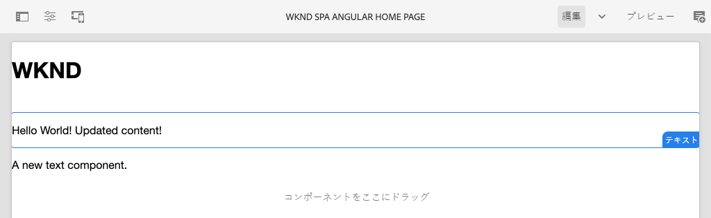

# SPA の統合 {#integrate-spa}

Angular で記述された単一ページアプリケーション（SPA）のソースコードを、Adobe Experience Manager（AEM）プロジェクトと統合する方法を説明します。webpack 開発サーバーなどの最新のフロントエンドツールを使用して、AEM JSON モデル API に対する SPA を迅速に開発する方法を説明します。

## 目的

1. SPA プロジェクトが AEM とクライアントサイドライブラリを統合する仕組みを説明します。
2. 専用のフロントエンド開発にローカル開発サーバーを使用する方法を説明します。
3. AEM JSON モデル API に対する開発における&#x200B;**プロキシ**&#x200B;および静的&#x200B;**モック**&#x200B;ファイルの使用について

## 作成する内容

この章では、簡単な `Header` コンポーネントを SPA に追加します。この静的 `Header` コンポーネントを構築する過程では、AEM SPA 開発に対するいくつかのアプローチが使用されます。



*SPA を拡張して静的 `Header` コンポーネントを追加する*

## 前提条件

[ローカル開発環境](overview.md#local-dev-environment)の設定に必要なツールと手順を確認します。

### コードの取得

1. このチュートリアルの出発点となるものを Git からダウンロードします。

   ```shell
   $ git clone git@github.com:adobe/aem-guides-wknd-spa.git
   $ cd aem-guides-wknd-spa
   $ git checkout Angular/integrate-spa-start
   ```

2. Maven を使用してコードベースをローカルの AEM インスタンスにデプロイします。

   ```shell
   $ mvn clean install -PautoInstallSinglePackage
   ```

   [AEM 6.x](overview.md#compatibility) を使用する場合、次の `classic` プロファイルを追加します。

   ```shell
   $ mvn clean install -PautoInstallSinglePackage -Pclassic
   ```

完成したコードは、[GitHub](https://github.com/adobe/aem-guides-wknd-spa/tree/Angular/integrate-spa-solution) で確認するか、またはブランチ `Angular/integrate-spa-solution` に切り替えてコードをローカルで確認します。

## アプローチの統合 {#integration-approach}

AEM プロジェクトの一部として、`ui.apps` および `ui.frontend` の 2 つのモジュールが作成されました。

`ui.frontend` モジュールは、すべての SPA ソースコードを含む [webpack](https://webpack.js.org/) プロジェクトです。SPA の開発とテストの大部分は、webpack プロジェクトで行われます。 実稼動ビルドがトリガーされると、SPA は webpack を使用して構築およびコンパイルされます。コンパイル済みのアーティファクト（CSS および JavaScript）が `ui.apps` モジュールにコピーされ、AEM ランタイムにデプロイされます。



*SPA 統合の大まかな概要を示します。*

フロントエンドビルドに関する追加情報は、[こちらを参照](https://experienceleague.adobe.com/docs/experience-manager-core-components/using/developing/archetype/uifrontend-angular.html?lang=ja)してください。

## SPA 統合を検査する {#inspect-spa-integration}

次に、`ui.frontend` モジュールを検査して、[AEM プロジェクトアーキタイプ](https://experienceleague.adobe.com/docs/experience-manager-core-components/using/developing/archetype/uifrontend-angular.html?lang=ja)によって自動生成される SPA について説明します。

1. 任意の IDE で、WKND SPA 用の AEM プロジェクトを開きます。このチュートリアルでは、[Visual Studio のコード IDE](https://experienceleague.adobe.com/docs/experience-manager-learn/cloud-service/local-development-environment-set-up/development-tools.html?lang=ja#microsoft-visual-studio-code) を使用します。

   

2. `ui.frontend` フォルダーを展開して調べます。ファイル `ui.frontend/package.json` を開きます

3. `dependencies` の下に `@angular` に関連するものがいくつか表示されます。

   ```json
   "@angular/animations": "~9.1.11",
   "@angular/common": "~9.1.11",
   "@angular/compiler": "~9.1.11",
   "@angular/core": "~9.1.11",
   "@angular/forms": "~9.1.10",
   "@angular/platform-browser": "~9.1.10",
   "@angular/platform-browser-dynamic": "~9.1.10",
   "@angular/router": "~9.1.10",
   ```

   `ui.frontend` モジュールは、ルーティングを含む [Angular CLI ツール](https://angular.io/cli)を使用して生成される [Angular アプリケーション](https://angular.io)です。

4. また、`@adobe` のというプレフィックスが付く依存関係も 3 つあります。

   ```json
   "@adobe/cq-angular-editable-components": "^2.0.2",
   "@adobe/cq-spa-component-mapping": "^1.0.3",
   "@adobe/cq-spa-page-model-manager": "^1.1.3",
   ```

   上記のモジュールは、[AEM SPA Editor JS SDK](https://experienceleague.adobe.com/docs/experience-manager-65/developing/spas/spa-blueprint.html?lang=ja) を構成し、SPA コンポーネントを AEM コンポーネントにマッピングできる機能を提供します。

5. `package.json` ファイルでは、次のように複数の `scripts` が定義されています。

   ```json
   "scripts": {
       "start": "ng serve --open --proxy-config ./proxy.conf.json",
       "build": "ng lint && ng build && clientlib",
       "build:production": "ng lint && ng build --prod && clientlib",
       "test": "ng test",
       "sync": "aemsync -d -w ../ui.apps/src/main/content"
   }
   ```

   これらのスクリプトは、一般的な [Angular CLI コマンド](https://angular.io/cli/build)に基づいていますが、より大きめの AEM プロジェクトで動作するように、少し変更されています。

   `start` - ローカル web サーバーを使用して、サーバーアプリをローカルで実行します。 ローカルの AEM インスタンスのコンテンツをプロキシするように更新されました。

   `build` - 実稼動用に Angular アプリをコンパイルします。`&& clientlib` の追加は、ビルド時にコンパイル済みの SPA をクライアントサイドライブラリとして `ui.apps` モジュールを作成します。npm モジュールの [aem-clientlib-generator](https://github.com/wcm-io-frontend/aem-clientlib-generator) を使用すると、この処理が容易になります。

   使用可能なスクリプトの詳細については、[こちら](https://experienceleague.adobe.com/docs/experience-manager-core-components/using/developing/archetype/uifrontend-angular.html?lang=ja)を参照してください。

6. `ui.frontend/clientlib.config.js` ファイルを検査します。この設定ファイルは、クライアントライブラリの生成方法を決定するために [aem-clientlib-generator](https://github.com/wcm-io-frontend/aem-clientlib-generator#clientlibconfigjs) によって使用されます。

7. `ui.frontend/pom.xml` ファイルを検査します。このファイルは、`ui.frontend` フォルダーを [Maven モジュール](https://maven.apache.org/guides/mini/guide-multiple-modules.html)に変換します。`pom.xml` ファイルは [frontend-maven-plugin](https://github.com/eirslett/frontend-maven-plugin) を使用して Maven のビルド時に SPA を&#x200B;**テスト**&#x200B;および&#x200B;**ビルド**&#x200B;されます。

8. ファイル `app.component.ts` を `ui.frontend/src/app/app.component.ts` で検査します。

   ```js
   import { Constants } from '@adobe/cq-angular-editable-components';
   import { ModelManager } from '@adobe/cq-spa-page-model-manager';
   import { Component } from '@angular/core';
   
   @Component({
   selector: '#spa-root', // tslint:disable-line
   styleUrls: ['./app.component.css'],
   templateUrl: './app.component.html'
   })
   export class AppComponent {
       ...
   
       constructor() {
           ModelManager.initialize().then(this.updateData);
       }
   
       private updateData = pageModel => {
           this.path = pageModel[Constants.PATH_PROP];
           this.items = pageModel[Constants.ITEMS_PROP];
           this.itemsOrder = pageModel[Constants.ITEMS_ORDER_PROP];
       }
   }
   ```

   `app.component.js` は、SPA のエントリポイントです。`ModelManager` は、AEM SPA Editor JS SDK によって提供されます。`pageModel`（JSON コンテンツ）を呼び出し、アプリケーションに挿入する役割を担っています。

## ヘッダーコンポーネントの追加 {#header-component}

次に、SPA に新しいコンポーネントを追加し、変更をローカル AEM インスタンスにデプロイして、統合を確認します。

1. 新しいターミナルウィンドウを開き、`ui.frontend` フォルダーに移動します。

   ```shell
   $ cd aem-guides-wknd-spa/ui.frontend
   ```

2. [Angular CLI](https://angular.io/cli#installing-angular-cli) をグローバルにインストール、Angular コンポーネントを生成し、**ng** コマンドを介して Angular アプリケーションの構築と提供に使用されます。

   ```shell
   $ npm install -g @angular/cli
   ```

   >[!CAUTION]
   >
   > このプロジェクトで使用される **@angular/cli** のバージョンは、**9.1.7** です。Angular CLI のバージョンを同期させておくことをお勧めします。

3. `ui.frontend` フォルダー内から Angular CLI `ng generate component` コマンドを実行して、新しい `Header` コンポーネントを作成します。

   ```shell
   $ ng generate component components/header
   
   CREATE src/app/components/header/header.component.css (0 bytes)
   CREATE src/app/components/header/header.component.html (21 bytes)
   CREATE src/app/components/header/header.component.spec.ts (628 bytes)
   CREATE src/app/components/header/header.component.ts (269 bytes)
   UPDATE src/app/app.module.ts (1809 bytes)
   ```

   これにより、`ui.frontend/src/app/components/header` に新規 Angular ヘッダーコンポーネントのスケルトンが作成されます。

4. 選択した IDE 内の `aem-guides-wknd-spa` プロジェクトを開きます。`ui.frontend/src/app/components/header` フォルダーに移動します。

   

5. ファイル `header.component.html` を開き、コンテンツを次に置き換えます。

   ```html
   <!--/* header.component.html */-->
   <header className="header">
       <div className="header-container">
           <h1>WKND</h1>
       </div>
   </header>
   ```

   これは静的なコンテンツを表示するので、この Angular コンポーネントでは、デフォルトで生成される `header.component.ts` に対するいかなる調整も必要としないことに注意してください。

6. `ui.frontend/src/app/app.component.html` でファイル **app.component.html** を開きます。`app-header` を追加します。

   ```html
   <app-header></app-header>
   <router-outlet></router-outlet>
   ```

   これにより、すべてのページコンテンツの上に `header` コンポーネントが含まれることになります。

7. 新しいターミナルを開き、`ui.frontend` フォルダーに移動して、`npm run build` コマンドを実行します。

   ```shell
   $ cd ui.frontend
   $ npm run build
   
   Linting "angular-app"...
   All files pass linting.
   Generating ES5 bundles for differential loading...
   ES5 bundle generation complete.
   ```

8. `ui.apps` フォルダーに移動します。`ui.apps/src/main/content/jcr_root/apps/wknd-spa-angular/clientlibs/clientlib-angular` の下に `ui.frontend/build` フォルダーからコピーされたコンパイル済みの SPA ファイルが表示されます。

   

9. ターミナルに戻り、`ui.apps` フォルダーに移動します。次の Maven コマンドを実行します。

   ```shell
   $ cd ../ui.apps
   $ mvn clean install -PautoInstallPackage
   ...
   [INFO] ------------------------------------------------------------------------
   [INFO] BUILD SUCCESS
   [INFO] ------------------------------------------------------------------------
   [INFO] Total time:  9.629 s
   [INFO] Finished at: 2020-05-04T17:48:07-07:00
   [INFO] ------------------------------------------------------------------------
   ```

   これにより、`ui.apps` パッケージが AEM のローカルの実行中のインスタンスにデプロイされます。

10. ブラウザータブを開き、[http://localhost:4502/editor.html/content/wknd-spa-angular/us/en/home.html](http://localhost:4502/editor.html/content/wknd-spa-angular/us/en/home.html) に移動します。これで、SPA に表示されている `Header` コンポーネントのコンテンツが表示されます。

   

   手順 **7-9** は、プロジェクトのルート（例：`mvn clean install -PautoInstallSinglePackage`）から Maven ビルドをトリガーすると、自動的に実行されます。これで、SPA と AEM クライアントサイドライブラリ間の統合の基本を理解しました。なお、AEM の `Text` コンポーネントは引き続き編集および追加できますが、`Header` コンポーネントは編集できません。

## webpack 開発サーバー - JSON API のプロキシ化 {#proxy-json}

前の演習でお分かりのように、ビルドを実行してクライアントライブラリを AEM のローカルインスタンスに同期するには、数分かかります。これは、最終テストでは許容できますが、SPA 開発の大部分には理想的ではありません。

[webpack 開発サーバー](https://webpack.js.org/configuration/dev-server/)を使用すると、SPA を迅速に開発できます。SPA は、AEM で生成された JSON モデルによって駆動されます。この演習では、AEM の実行中のインスタンスから得られる JSON コンテンツを、[Angular プロジェクト](https://angular.io/guide/build)で設定した開発サーバーに&#x200B;**プロキシ化**&#x200B;します。

1. IDE に戻り、ファイル **proxy.conf.json**（`ui.frontend/proxy.conf.json`）を開きます。

   ```json
   [
       {
           "context": [
                       "/content/**/*.(jpg|jpeg|png|model.json)",
                       "/etc.clientlibs/**/*"
                   ],
           "target": "http://localhost:4502",
           "auth": "admin:admin",
           "logLevel": "debug"
       }
   ]
   ```

   [Angular アプリ](https://angular.io/guide/build#proxying-to-a-backend-server)には、API リクエストをプロキシ化するための簡単なメカニズムが用意されています。`context` で指定されたパターンは、ローカル AEM クイックスタートである `localhost:4502` を通じてプロキシ化されます。

2. ファイル **index.html**（`ui.frontend/src/index.html`）を開きます。これは、開発サーバーで使用されるルート HTML ファイルです。

   `base href="/"` のエントリがあることに注意してください。[ベースタグ](https://angular.io/guide/deployment#the-base-tag)は、アプリで相対 URL を解決するためにきわめて重要です。

   ```html
   <base href="/">
   ```

3. ターミナルウィンドウを開き、`ui.frontend` フォルダーに移動します。`npm start` コマンドを実行します。

   ```shell
   $ cd ui.frontend
   $ npm start
   
   > wknd-spa-angular@0.1.0 start /Users/dgordon/Documents/code/aem-guides-wknd-spa/ui.frontend
   > ng serve --open --proxy-config ./proxy.conf.json
   
   10% building 3/3 modules 0 active[HPM] Proxy created: [ '/content/**/*.(jpg|jpeg|png|model.json)', '/etc.clientlibs/**/*' ]  ->  http://localhost:4502
   [HPM] Subscribed to http-proxy events:  [ 'error', 'close' ]
   ℹ ｢wds｣: Project is running at http://localhost:4200/webpack-dev-server/
   ℹ ｢wds｣: webpack output is served from /
   ℹ ｢wds｣: 404s will fallback to //index.html
   ```

4. （まだ開いていない場合は）新規ブラウザータブを開き、[http://localhost:4200/content/wknd-spa-angular/us/en/home.html](http://localhost:4200/content/wknd-spa-angular/us/en/home.html) に移動します。

   

   AEM と同じコンテンツが表示されますが、オーサリング機能は有効になっていません。

5. IDE に戻り、`ui.frontend/src/assets` に `img` という名前の新しいフォルダーを作成します。
6. 次の WKND ロゴをダウンロードして `img` フォルダーに追加します。

   

7. **header.component.html**（`ui.frontend/src/app/components/header/header.component.html`）を開き、ロゴを含めます。

   ```html
   <header class="header">
       <div class="header-container">
           <div class="logo">
               
           </div>
       </div>
   </header>
   ```

   変更内容を **header.component.html** に保存します。

8. ブラウザーに戻ります。アプリケーションに対する変更がすぐに反映されていることを確認します。

   

   コンテンツをプロキシ化しているため、**AEM** で引き続きコンテンツの更新を行い、**webpack 開発サーバー**&#x200B;に更新内容が反映されるのを確認できます。なお、コンテンツの変更は、**webpack 開発サーバー**&#x200B;でのみ表示されます。

9. ターミナルで `ctrl+c` を使用してローカル web サーバーを停止します。

## webpack 開発サーバー - JSON API のモック {#mock-json}

迅速な開発へのもう 1 つのアプローチは、JSON モデルとして機能する静的 JSON ファイルを使用することです。JSON を「モック」することで、ローカルの AEM インスタンスへの依存関係を解消できます。また、フロントエンド開発者は JSON モデルを更新して、機能をテストしたり、後でバックエンド開発者が実装する JSON API に変更を加えたりすることができます。

モック JSON の初期セットアップには、**ローカルの AEM インスタンスが必要です**。

1. ブラウザーで [http://localhost:4502/content/wknd-spa-angular/us/en.model.json](http://localhost:4502/content/wknd-spa-angular/us/en.model.json) に移動します。

   これは、アプリケーションを実行している AEM から書き出した JSON です。JSON 出力をコピーします。

2. IDE に戻り、`ui.frontend/src` に移動して、**mocks** と **json** という名前の新しいフォルダーを追加して、次のフォルダー構造に一致させます。

   ```plain
   |-- ui.frontend
       |-- src
           |-- mocks
               |-- json
   ```

3. `ui.frontend/public/mocks/json` の直下に **en.model.json** という名前の新しいファイルを作成します。**手順 1** で得られた JSON 出力をここにペーストします。

   

4. `ui.frontend` の直下に新しいファイル **proxy.mock.conf.json** を作成します。ファイルに以下のように入力します。

   ```json
   [
       {
       "context": [
           "/content/**/*.model.json"
       ],
       "pathRewrite": { "^/content/wknd-spa-angular/us" : "/mocks/json"} ,
       "target": "http://localhost:4200",
       "logLevel": "debug"
       }
   ]
   ```

   このプロキシ設定では、`/content/wknd-spa-angular/us` で始まるリクエストを `/mocks/json` に書き換え、対応する静的 JSON ファイルを提供します。次に例を示します。

   ```plain
   /content/wknd-spa-angular/us/en.model.json -> /mocks/json/en.model.json
   ```

5. ファイル **angular.json** を開きます。作成された **mocks** フォルダーを参照する更新後の **assets** 配列を含んだ新しい **dev** 設定を追加します。

   ```json
    "dev": {
             "assets": [
               "src/mocks",
               "src/assets",
               "src/favicon.ico",
               "src/logo192.png",
               "src/logo512.png",
               "src/manifest.json"
             ]
       },
   ```

   

   専用の **dev** 設定を作成すると、**mocks** フォルダーは開発時にのみ使用され、実稼働ビルドで AEM にデプロイされなくなります。

6. 次に、**angular.json** ファイルで **browserTarget** 設定を更新して、新しい **dev** 設定を使用するようにします。

   ```diff
     ...
     "serve": {
         "builder": "@angular-devkit/build-angular:dev-server",
         "options": {
   +       "browserTarget": "angular-app:build:dev"
   -       "browserTarget": "angular-app:build"
         },
     ...
   ```

   

7. ファイル `ui.frontend/package.json` を開き、新しい **start:mock** コマンドを追加して **proxy.mock.conf.json** ファイルを参照します。

   ```diff
       "scripts": {
           "start": "ng serve --open --proxy-config ./proxy.conf.json",
   +       "start:mock": "ng serve --open --proxy-config ./proxy.mock.conf.json",
           "build": "ng lint && ng build && clientlib",
           "build:production": "ng lint && ng build --prod && clientlib",
           "test": "ng test",
           "sync": "aemsync -d -w ../ui.apps/src/main/content"
       }
   ```

   新しいコマンドを追加すると、プロキシ設定を簡単に切り替えることができます。

8. 現在実行中の場合は、**webpack 開発サーバー**&#x200B;を停止します。**start:mock** スクリプトを使用して **webpack 開発サーバー**&#x200B;を開始します。

   ```shell
   $ npm run start:mock
   
   > wknd-spa-angular@0.1.0 start:mock /Users/dgordon/Documents/code/aem-guides-wknd-spa/ui.frontend
   > ng serve --open --proxy-config ./proxy.mock.conf.json
   ```

   [http://localhost:4200/content/wknd-spa-angular/us/en/home.html](http://localhost:4200/content/wknd-spa-angular/us/en/home.html) に移動すると同じ SPA が表示されますが、コンテンツは JSON ファイルの&#x200B;**モック**&#x200B;から取得されています。

9. 前に作成した **en.model.json** ファイルを少し変更します。更新されたコンテンツは **webpack 開発サーバー**&#x200B;にすぐに反映されます。

   

   JSON モデルを操作し、実稼働中の SPA に対する影響を確認できることで、開発者が JSON モデル API を理解しやすくなります。また、フロントエンドとバックエンドの両方の開発を並行して行うことができます。

## Sass でスタイルを追加

次に、更新されたいくつかのスタイルをプロジェクトに追加します。このプロジェクトでは、変数などのいくつかの便利な機能のために、[Sass](https://sass-lang.com/) のサポートを追加します。

1. ターミナルウィンドウを開き、**webpack 開発サーバー**&#x200B;が起動している場合は停止します。`ui.frontend` フォルダー内から次のコマンドを入力して、Angular アプリを更新し、**.scss** ファイルを処理します。

   ```shell
   $ cd ui.frontend
   $ ng config schematics.@schematics/angular:component.styleext scss
   ```

   これにより、ファイルの下部にある新規エントリで `angular.json` ファイルが更新されます。

   ```json
   "schematics": {
       "@schematics/angular:component": {
       "styleext": "scss"
       }
   }
   ```

2. `normalize-scss` をインストールして、ブラウザー間でスタイルを標準化します。

   ```shell
   $ npm install normalize-scss --save
   ```

3. IDE に戻り、`ui.frontend/src` の下に `styles` という名前の新規フォルダーを作成します。
4. `ui.frontend/src/styles` の下に `_variables.scss` という名前の新規ファイルを作成し、次の変数を入力します。

   ```scss
   //_variables.scss
   
   //== Colors
   //
   //## Gray and brand colors for use across theme.
   
   $black:                  #202020;
   $gray:                   #696969;
   $gray-light:             #EBEBEB;
   $gray-lighter:           #F7F7F7;
   $white:                  #FFFFFF;
   $yellow:                 #FFEA00;
   $blue:                   #0045FF;
   
   
   //== Typography
   //
   //## Font, line-height, and color for body text, headings, and more.
   
   $font-family-sans-serif:  "Helvetica Neue", Helvetica, Arial, sans-serif;
   $font-family-serif:       Georgia, "Times New Roman", Times, serif;
   $font-family-base:        $font-family-sans-serif;
   $font-size-base:          18px;
   
   $line-height-base:        1.5;
   $line-height-computed:    floor(($font-size-base * $line-height-base));
   
   // Functional Colors
   $brand-primary:             $yellow;
   $body-bg:                   $white;
   $text-color:                $black;
   $text-color-inverse:        $gray-light;
   $link-color:                $blue;
   
   //Layout
   $max-width: 1024px;
   $header-height: 75px;
   
   // Spacing
   $gutter-padding: 12px;
   ```

5. `ui.frontend/src/styles.css` でファイル **styles.css** の拡張子を **styles.scss** に変更します。内容を以下のように置き換えます。

   ```scss
   /* styles.scss * /
   
   /* Normalize */
   @import '~normalize-scss/sass/normalize';
   
   @import './styles/variables';
   
   body {
       background-color: $body-bg;
       font-family: $font-family-base;
       margin: 0;
       padding: 0;
       font-size: $font-size-base;
       text-align: left;
       color: $text-color;
       line-height: $line-height-base;
   }
   
   body.page {
       max-width: $max-width;
       margin: 0 auto;
       padding: $gutter-padding;
       padding-top: $header-height;
   }
   ```

6. **angular.json** を更新し、**style.css** へのすべての参照の名前を **styles.scss** に変更します。3 つの参照があるはずです。

   ```diff
     "styles": [
   -    "src/styles.css"
   +    "src/styles.scss"
      ],
   ```

## ヘッダースタイルを更新

次に、Sass を使用して&#x200B;**ヘッダー**&#x200B;コンポーネントにブランド固有のスタイルをいくつか追加します。

1. **webpack 開発サーバー**&#x200B;を開始して、スタイルの更新をリアルタイムで確認します。

   ```shell
   $ npm run start:mock
   ```

2. `ui.frontend/src/app/components/header` で **header.component.css** の名前を **header.component.scss** に変更します。ファイルに以下のように入力します。

   ```scss
   @import "~src/styles/variables";
   
   .header {
       width: 100%;
       position: fixed;
       top: 0;
       left:0;
       z-index: 99;
       background-color: $brand-primary;
       box-shadow: 0px 0px 10px 0px rgba(0, 0, 0, 0.24);
   }
   
   .header-container {
       display: flex;
       max-width: $max-width;
       margin: 0 auto;
       padding-left: $gutter-padding;
       padding-right: $gutter-padding;
   }
   
   .logo {
       z-index: 100;
       display: flex;
       padding-top: $gutter-padding;
       padding-bottom: $gutter-padding;
   }
   
   .logo-img {
       width: 100px;
   }
   ```

3. **header.component.scss** を参照するように **header.component.ts** を更新します。

   ```diff
   ...
     @Component({
       selector: 'app-header',
       templateUrl: './header.component.html',
   -   styleUrls: ['./header.component.css']
   +   styleUrls: ['./header.component.scss']
     })
   ...
   ```

4. ブラウザーと **webpack 開発サーバー**&#x200B;に戻ります。

   

   **ヘッダー**&#x200B;コンポーネントに追加された、更新済みスタイルが表示されます。

## AEM への SPA アップデートのデプロイ

**ヘッダー**&#x200B;に加えられた変更は、現在 **webpack 開発サーバー**&#x200B;を通じてのみ表示されます。更新された SPA を AEM にデプロイして、変更を確認します。

1. **webpack 開発サーバー**&#x200B;を停止します。
2. プロジェクト `/aem-guides-wknd-spa` のルートに移動し、Maven を使用してプロジェクトを AEM にデプロイします。

   ```shell
   $ cd ..
   $ mvn clean install -PautoInstallSinglePackage
   ```

3. [http://localhost:4502/editor.html/content/wknd-spa-angular/us/en/home.html](http://localhost:4502/editor.html/content/wknd-spa-angular/us/en/home.html) に移動します。ロゴとスタイルを適用した、更新済み&#x200B;**ヘッダー**&#x200B;が表示されます。

   

   更新された SPA が AEM にあるので、オーサリングを続行できます。

## おめでとうございます。 {#congratulations}

おめでとうございます。SPA を更新し、AEM との統合を確認しました。これで、**webpack 開発サーバー**&#x200B;を使用して AEM JSON モデル API に対して SPA を開発する 2 つの異なるアプローチを理解できました。

完成したコードは、[GitHub](https://github.com/adobe/aem-guides-wknd-spa/tree/Angular/integrate-spa-solution) で確認するか、またはブランチ `Angular/integrate-spa-solution` に切り替えてコードをローカルで確認します。

### 次の手順 {#next-steps}

[SPA コンポーネントの AEM コンポーネントへのマッピング](map-components.md) - AEM SPA Editor JS SDK を使用して、Angular コンポーネントを Adobe Experience Manager (AEM) コンポーネントにマッピングする方法について説明します。コンポーネントマッピングを使用すると、作成者は、従来の AEM オーサリングと同様に、AEM SPA エディター内で SPA コンポーネントを動的に更新できます。
