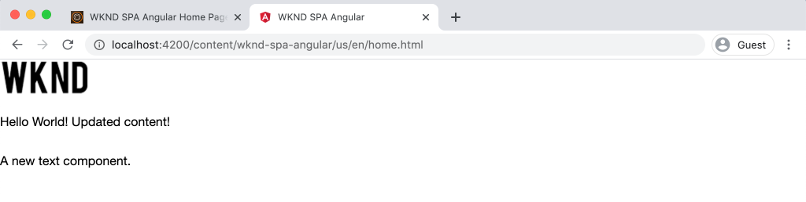

# SPAの統合 {#integrate-spa}

angularで記述されたシングルページアプリケーション (SPA) のソースコードを、Adobe Experience Manager(AEM) プロジェクトと統合する方法を説明します。 webpack 開発サーバーなどの最新のフロントエンドツールを使用して、AEM JSON モデル API に対するSPAを迅速に開発する方法を説明します。

## 目的

1. SPAプロジェクトがAEMとクライアント側ライブラリを統合する方法を説明します。
2. 専用のフロントエンド開発にローカル開発サーバーを使用する方法を説明します。
3. の使用に関する詳細 **プロキシ** および静的 **mock** AEM JSON モデル API に対する開発用ファイル

## 作成する内容

この章では、 `Header` コンポーネントをSPAに追加します。 この静的を構築中 `Header` コンポーネントは、AEM SPA開発に対するいくつかのアプローチを使用します。


*SPAを拡張して静的を追加します。 `Header` コンポーネント*

## 前提条件

設定に必要なツールと手順を確認します。 [ローカル開発環境](overview.md#local-dev-environment).

### コードの取得

1. このチュートリアルの開始点を Git からダウンロードします。

   ```shell
   $ git clone git@github.com:adobe/aem-guides-wknd-spa.git
   $ cd aem-guides-wknd-spa
   $ git checkout Angular/integrate-spa-start
   ```

2. Maven を使用して、ローカルのAEMインスタンスにコードベースをデプロイします。

   ```shell
   $ mvn clean install -PautoInstallSinglePackage
   ```

   を使用する場合 [AEM 6.x](overview.md#compatibility) 追加 `classic` プロファイル：

   ```shell
   $ mvn clean install -PautoInstallSinglePackage -Pclassic
   ```

完成したコードは、 [GitHub](https://github.com/adobe/aem-guides-wknd-spa/tree/Angular/integrate-spa-solution) または、ブランチに切り替えて、コードをローカルでチェックアウトします。 `Angular/integrate-spa-solution`.

## 統合アプローチ {#integration-approach}

AEMプロジェクトの一部として、次の 2 つのモジュールが作成されました。 `ui.apps` および `ui.frontend`.

この `ui.frontend` モジュールは [webpack](https://webpack.js.org/) すべてのSPAソースコードを含むプロジェクト。 SPAの開発とテストの大部分は、webpack プロジェクトでおこなわれます。 実稼動ビルドがトリガーされると、SPAは webpack を使用して構築およびコンパイルされます。 コンパイル済みのアーティファクト（CSS および JavaScript）が `ui.apps` モジュールをAEMランタイムにデプロイします。


*SPA統合の概要です。*

フロントエンドビルドに関する追加情報は、次のとおりです。 [ここにある](https://experienceleague.adobe.com/docs/experience-manager-core-components/using/developing/archetype/uifrontend-angular.html).

## Inspect SPA統合 {#inspect-spa-integration}

次に、 `ui.frontend` モジュールを使用して、 [AEMプロジェクトアーキタイプ](https://experienceleague.adobe.com/docs/experience-manager-core-components/using/developing/archetype/uifrontend-angular.html).

1. 任意の IDE で、WKND SPA用のAEMプロジェクトを開きます。 このチュートリアルでは、 [Visual Studio Code IDE](https://experienceleague.adobe.com/docs/experience-manager-learn/cloud-service/local-development-environment-set-up/development-tools.html?lang=ja#microsoft-visual-studio-code).

   

2. を展開して検査します。 `ui.frontend` フォルダー。 ファイルを開きます。 `ui.frontend/package.json`

3. 以下 `dependencies` 関連する `@angular`:

   ```json
   "@angular/animations": "~9.1.11",
   "@angular/common": "~9.1.11",
   "@angular/compiler": "~9.1.11",
   "@angular/core": "~9.1.11",
   "@angular/forms": "~9.1.10",
   "@angular/platform-browser": "~9.1.10",
   "@angular/platform-browser-dynamic": "~9.1.10",
   "@angular/router": "~9.1.10",
   ```

   この `ui.frontend` モジュールは [Angular適用](https://angular.io) を使用して生成 [AngularCLI ツール](https://angular.io/cli) ルーティングを含む

4. また、 `@adobe`:

   ```json
   "@adobe/cq-angular-editable-components": "^2.0.2",
   "@adobe/cq-spa-component-mapping": "^1.0.3",
   "@adobe/cq-spa-page-model-manager": "^1.1.3",
   ```

   上記のモジュールは、 [AEM SPA Editor JS SDK](https://experienceleague.adobe.com/docs/experience-manager-65/developing/headless/spas/spa-blueprint.html) とは、SPAコンポーネントをAEMコンポーネントにマッピングできる機能を提供します。

5. 内 `package.json` 複数の `scripts` が定義されている：

   ```json
   "scripts": {
       "start": "ng serve --open --proxy-config ./proxy.conf.json",
       "build": "ng lint && ng build && clientlib",
       "build:production": "ng lint && ng build --prod && clientlib",
       "test": "ng test",
       "sync": "aemsync -d -w ../ui.apps/src/main/content"
   }
   ```

   これらのスクリプトは、共通の [AngularCLI コマンド](https://angular.io/cli/build) 大きなAEMプロジェクトで使用できるように、少し変更を加えてあります。

   `start`  — ローカル WebAngularを使用して、サーバーアプリをローカルで実行します。 ローカルのAEMインスタンスのコンテンツをプロキシするように更新されました。

   `build`  — 実稼動用にAngularアプリをコンパイルします。 この `&& clientlib` は、コンパイル済みのSPAを `ui.apps` ビルド時にクライアントサイドライブラリとしてモジュールを作成する。 npm モジュール [aem-clientlib-generator](https://github.com/wcm-io-frontend/aem-clientlib-generator) を使用すると、この処理が容易になります。

   使用可能なスクリプトの詳細については、を参照してください。 [ここ](https://experienceleague.adobe.com/docs/experience-manager-core-components/using/developing/archetype/uifrontend-angular.html).

6. `ui.frontend/clientlib.config.js` ファイルを検査します。この設定ファイルは、 [aem-clientlib-generator](https://github.com/wcm-io-frontend/aem-clientlib-generator#clientlibconfigjs) を参照して、クライアントライブラリの生成方法を確認してください。

7. `ui.frontend/pom.xml` ファイルを検査します。このファイルは、 `ui.frontend` フォルダーを [Maven モジュール](https://maven.apache.org/guides/mini/guide-multiple-modules.html). この `pom.xml` ファイルを更新して [frontend-maven-plugin](https://github.com/eirslett/frontend-maven-plugin) から **テスト** および **ビルド** Maven のビルド時にSPAが生成されます。

8. Inspectファイル `app.component.ts` 時刻 `ui.frontend/src/app/app.component.ts`:

   ```js
   import { Constants } from '@adobe/cq-angular-editable-components';
   import { ModelManager } from '@adobe/cq-spa-page-model-manager';
   import { Component } from '@angular/core';
   
   @Component({
   selector: '#spa-root', // tslint:disable-line
   styleUrls: ['./app.component.css'],
   templateUrl: './app.component.html'
   })
   export class AppComponent {
       ...
   
       constructor() {
           ModelManager.initialize().then(this.updateData);
       }
   
       private updateData = pageModel => {
           this.path = pageModel[Constants.PATH_PROP];
           this.items = pageModel[Constants.ITEMS_PROP];
           this.itemsOrder = pageModel[Constants.ITEMS_ORDER_PROP];
       }
   }
   ```

   `app.component.js` は、SPAのエントリポイントです。 `ModelManager` は、AEM SPA Editor JS SDK で提供されます。 これは、 `pageModel` （JSON コンテンツ）をアプリケーションにコピーします。

## ヘッダーコンポーネントの追加 {#header-component}

次に、SPAに新しいコンポーネントを追加し、変更をローカルAEMインスタンスにデプロイして、統合を確認します。

1. 新しいターミナルウィンドウを開き、`ui.frontend` フォルダーに移動します。

   ```shell
   $ cd aem-guides-wknd-spa/ui.frontend
   ```

2. インストール [AngularCLI](https://angular.io/cli#installing-angular-cli) グローバルに使用して、Angularコンポーネントを生成し、を介してAngularアプリケーションを構築して提供します。 **ng** コマンドを使用します。

   ```shell
   $ npm install -g @angular/cli
   ```

   >[!CAUTION]
   >
   > のバージョン。 **@angular/cli** このプロジェクトで使用 **9.1.7**. angularCLI のバージョンを同期しておくことをお勧めします。

3. 新しい `Header` コンポーネントをAngularCLI を実行 `ng generate component` 内から命令 `ui.frontend` フォルダー。

   ```shell
   $ ng generate component components/header
   
   CREATE src/app/components/header/header.component.css (0 bytes)
   CREATE src/app/components/header/header.component.html (21 bytes)
   CREATE src/app/components/header/header.component.spec.ts (628 bytes)
   CREATE src/app/components/header/header.component.ts (269 bytes)
   UPDATE src/app/app.module.ts (1809 bytes)
   ```

   これにより、に新しいAngularヘッダーコンポーネントのスケルトンが作成されます。 `ui.frontend/src/app/components/header`.

4. を開きます。 `aem-guides-wknd-spa` 選択した IDE 内のプロジェクト。 `ui.frontend/src/app/components/header` フォルダーに移動し、

   

5. ファイルを開きます。 `header.component.html` コンテンツを以下に置き換えます。

   ```html
   <!--/* header.component.html */-->
   <header className="header">
       <div className="header-container">
           <h1>WKND</h1>
       </div>
   </header>
   ```

   これにより静的コンテンツが表示されるので、このAngularコンポーネントでは、デフォルトで生成される `header.component.ts`.

6. ファイルを開きます。 **app.component.html** 時刻  `ui.frontend/src/app/app.component.html`. を `app-header`:

   ```html
   <app-header></app-header>
   <router-outlet></router-outlet>
   ```

   これには、 `header` コンポーネントを、すべてのページコンテンツの上に配置します。

7. 新しいターミナルを開き、 `ui.frontend` フォルダーを作成し、 `npm run build` コマンド：

   ```shell
   $ cd ui.frontend
   $ npm run build
   
   Linting "angular-app"...
   All files pass linting.
   Generating ES5 bundles for differential loading...
   ES5 bundle generation complete.
   ```

8. `ui.apps` フォルダーに移動し、の下 `ui.apps/src/main/content/jcr_root/apps/wknd-spa-angular/clientlibs/clientlib-angular` コンパイル済みのSPAファイルが`ui.frontend/build` フォルダー。

   

9. ターミナルに戻り、 `ui.apps` フォルダー。 次の Maven コマンドを実行します。

   ```shell
   $ cd ../ui.apps
   $ mvn clean install -PautoInstallPackage
   ...
   [INFO] ------------------------------------------------------------------------
   [INFO] BUILD SUCCESS
   [INFO] ------------------------------------------------------------------------
   [INFO] Total time:  9.629 s
   [INFO] Finished at: 2020-05-04T17:48:07-07:00
   [INFO] ------------------------------------------------------------------------
   ```

   これにより、 `ui.apps` AEMのローカル実行インスタンスにパッケージ化します。

10. ブラウザータブを開き、に移動します。 [http://localhost:4502/editor.html/content/wknd-spa-angular/us/en/home.html](http://localhost:4502/editor.html/content/wknd-spa-angular/us/en/home.html). これで、 `Header` コンポーネントがSPAに表示されている状態。

   

   手順 **7-9** は、プロジェクトのルートから Maven ビルドをトリガーすると、自動的に実行されます ( `mvn clean install -PautoInstallSinglePackage`) をクリックします。 これで、SPAとAEMのクライアント側ライブラリ間の統合の基本を理解する必要があります。 編集や追加は可能です。 `Text` AEMのコンポーネント `Header` コンポーネントは編集できません。

## Webpack Dev Server - JSON API のプロキシ {#proxy-json}

前の演習で見たように、クライアントライブラリをビルドして、AEMのローカルインスタンスに同期するには、数分かかります。 これは最終テストで使用できますが、SPAの開発の大部分には理想的ではありません。

A [webpack dev server](https://webpack.js.org/configuration/dev-server/) を使用して、SPAを迅速に開発できます。 SPAは、AEMで生成された JSON モデルによって駆動されます。 この演習では、AEMの実行中のインスタンスの JSON コンテンツを次のようにします。 **プロキシ化** を、 [Angular計画](https://angular.io/guide/build).

1. IDE に戻り、ファイルを開きます。 **proxy.conf.json** 時刻 `ui.frontend/proxy.conf.json`.

   ```json
   [
       {
           "context": [
                       "/content/**/*.(jpg|jpeg|png|model.json)",
                       "/etc.clientlibs/**/*"
                   ],
           "target": "http://localhost:4502",
           "auth": "admin:admin",
           "logLevel": "debug"
       }
   ]
   ```

   この [Angularアプリ](https://angular.io/guide/build#proxying-to-a-backend-server) は、API リクエストをプロキシするための簡単なメカニズムを提供します。 指定したパターン `context` はを通じてプロキシされます `localhost:4502`ローカルのAEM Quickstart

2. ファイルを開きます。 **index.html** 時刻 `ui.frontend/src/index.html`. これは、開発HTMLが使用するルートサーバーファイルです。

   次の項目があることに注意してください： `base href="/"`. この [ベースタグ](https://angular.io/guide/deployment#the-base-tag) は、相対 URL を解決するためにアプリが重要です。

   ```html
   <base href="/">
   ```

3. ターミナルウィンドウを開き、 `ui.frontend` フォルダー。 `npm start` コマンドを実行します。

   ```shell
   $ cd ui.frontend
   $ npm start
   
   > wknd-spa-angular@0.1.0 start /Users/dgordon/Documents/code/aem-guides-wknd-spa/ui.frontend
   > ng serve --open --proxy-config ./proxy.conf.json
   
   10% building 3/3 modules 0 active[HPM] Proxy created: [ '/content/**/*.(jpg|jpeg|png|model.json)', '/etc.clientlibs/**/*' ]  ->  http://localhost:4502
   [HPM] Subscribed to http-proxy events:  [ 'error', 'close' ]
   ℹ ｢wds｣: Project is running at http://localhost:4200/webpack-dev-server/
   ℹ ｢wds｣: webpack output is served from /
   ℹ ｢wds｣: 404s will fallback to //index.html
   ```

4. 新しいブラウザータブを開き（まだ開いていない場合）、に移動します。 [http://localhost:4200/content/wknd-spa-angular/us/en/home.html](http://localhost:4200/content/wknd-spa-angular/us/en/home.html).

   

   AEMと同じコンテンツが表示されますが、オーサリング機能は有効になっていません。

5. IDE に戻り、という名前の新しいフォルダーを作成します。 `img` 時刻 `ui.frontend/src/assets`.
6. 次の WKND ロゴをダウンロードし、 `img` フォルダー：

   

7. 開く **header.component.html** 時刻 `ui.frontend/src/app/components/header/header.component.html` ロゴを含めます。

   ```html
   <header class="header">
       <div class="header-container">
           <div class="logo">
               
           </div>
       </div>
   </header>
   ```

   変更をに保存します。 **header.component.html**.

8. ブラウザーに戻ります。 アプリケーションの変更が直ちに反映されていることを確認します。

   

   引き続き、でコンテンツを更新できます。 **AEM** そして彼らが反映されているのを見る **webpack dev server**、コンテンツをプロキシしているので。 コンテンツの変更は、 **webpack dev server**.

9. でローカル Web サーバーを停止します。 `ctrl+c` を設定します。

## Webpack Dev Server — モック JSON API {#mock-json}

迅速な開発のもう 1 つの方法は、静的 JSON ファイルを使用して JSON モデルとして機能させることです。 JSON を「モック」することで、ローカルのAEMインスタンスへの依存を削除します。 また、フロントエンド開発者は、機能をテストし、JSON API の変更を促すために JSON モデルを更新できます。この変更は、後でバックエンド開発者によって実装されます。

モック JSON の初期設定は次のようにおこないます。 **ローカルのAEMインスタンスが必要**.

1. ブラウザーで、に移動します。 [http://localhost:4502/content/wknd-spa-angular/us/en.model.json](http://localhost:4502/content/wknd-spa-angular/us/en.model.json).

   これは、アプリケーションを実行している AEM から書き出した JSON です。JSON 出力をコピーします。

2. IDE に戻り、に移動します。 `ui.frontend/src` 次の名前の新しいフォルダを追加します。 **モック** および **json** 次のフォルダー構造に一致させるには：

   ```plain
   |-- ui.frontend
       |-- src
           |-- mocks
               |-- json
   ```

3. という名前の新しいファイルを作成します。 **en.model.json** 下 `ui.frontend/public/mocks/json`. 次の JSON 出力を貼り付けます。 **手順 1** こちら。

   

4. 新しいファイルを作成 **proxy.mock.conf.json** 下 `ui.frontend`. ファイルに以下のように入力します。

   ```json
   [
       {
       "context": [
           "/content/**/*.model.json"
       ],
       "pathRewrite": { "^/content/wknd-spa-angular/us" : "/mocks/json"} ,
       "target": "http://localhost:4200",
       "logLevel": "debug"
       }
   ]
   ```

   このプロキシ設定は、 `/content/wknd-spa-angular/us` と `/mocks/json` 対応する静的 JSON ファイルを提供します。次に例を示します。

   ```plain
   /content/wknd-spa-angular/us/en.model.json -> /mocks/json/en.model.json
   ```

5. ファイルを開きます。 **angular.json**. 新しい **dev** 更新された **アセット** を参照する配列 **モック** フォルダーが作成されました。

   ```json
    "dev": {
             "assets": [
               "src/mocks",
               "src/assets",
               "src/favicon.ico",
               "src/logo192.png",
               "src/logo512.png",
               "src/manifest.json"
             ]
       },
   ```

   

   専用のの作成 **dev** 設定により、 **モック** フォルダーは開発時にのみ使用され、実稼動ビルドではAEMにデプロイされません。

6. 内 **angular.json** ファイル、次の更新 **browserTarget** 新しい **dev** 設定：

   ```diff
     ...
     "serve": {
         "builder": "@angular-devkit/build-angular:dev-server",
         "options": {
   +       "browserTarget": "angular-app:build:dev"
   -       "browserTarget": "angular-app:build"
         },
     ...
   ```

   

7. ファイルを開きます。 `ui.frontend/package.json` 新しい **start:mock** コマンドを使用して **proxy.mock.conf.json** ファイル。

   ```diff
       "scripts": {
           "start": "ng serve --open --proxy-config ./proxy.conf.json",
   +       "start:mock": "ng serve --open --proxy-config ./proxy.mock.conf.json",
           "build": "ng lint && ng build && clientlib",
           "build:production": "ng lint && ng build --prod && clientlib",
           "test": "ng test",
           "sync": "aemsync -d -w ../ui.apps/src/main/content"
       }
   ```

   新しいコマンドを追加すると、プロキシ設定を簡単に切り替えることができます。

8. 現在実行中の場合は、 **webpack dev server**. を開始します。 **webpack dev server** の使用 **start:mock** スクリプト：

   ```shell
   $ npm run start:mock
   
   > wknd-spa-angular@0.1.0 start:mock /Users/dgordon/Documents/code/aem-guides-wknd-spa/ui.frontend
   > ng serve --open --proxy-config ./proxy.mock.conf.json
   ```

   に移動します。 [http://localhost:4200/content/wknd-spa-angular/us/en/home.html](http://localhost:4200/content/wknd-spa-angular/us/en/home.html) 同じSPAが表示されますが、コンテンツが **mock** JSON ファイル。

9. を少し変更します。 **en.model.json** ファイルが作成されました。 更新されたコンテンツは、すぐに **webpack dev server**.

   

   JSON モデルを操作し、実稼働中のSPAに対する影響を確認できることは、開発者が JSON モデル API を理解するのに役立ちます。 また、フロントエンドとバックエンドの両方の開発を並行しておこなうことができます。

## Sass でスタイルを追加

次に、更新された一部のスタイルがプロジェクトに追加されます。 このプロジェクトは [サス](https://sass-lang.com/) 変数などの便利な機能のサポート。

1. ターミナルウィンドウを開き、 **webpack dev server** （開始した場合） 内部から `ui.frontend` フォルダーを次のコマンドで入力して、処理するAngularアプリを更新します **.scss** ファイル。

   ```shell
   $ cd ui.frontend
   $ ng config schematics.@schematics/angular:component.styleext scss
   ```

   これにより、 `angular.json` ファイルの末尾に新しいエントリが追加されます。

   ```json
   "schematics": {
       "@schematics/angular:component": {
       "styleext": "scss"
       }
   }
   ```

2. インストール `normalize-scss` ブラウザー間でスタイルを標準化するには：

   ```shell
   $ npm install normalize-scss --save
   ```

3. IDE との下に戻ります。 `ui.frontend/src` 次の名前の新しいフォルダーを作成します。 `styles`.
4. の下に新しいファイルを作成します。 `ui.frontend/src/styles` 名前付き `_variables.scss` を設定し、次の変数を設定します。

   ```scss
   //_variables.scss
   
   //== Colors
   //
   //## Gray and brand colors for use across theme.
   
   $black:                  #202020;
   $gray:                   #696969;
   $gray-light:             #EBEBEB;
   $gray-lighter:           #F7F7F7;
   $white:                  #FFFFFF;
   $yellow:                 #FFEA00;
   $blue:                   #0045FF;
   
   
   //== Typography
   //
   //## Font, line-height, and color for body text, headings, and more.
   
   $font-family-sans-serif:  "Helvetica Neue", Helvetica, Arial, sans-serif;
   $font-family-serif:       Georgia, "Times New Roman", Times, serif;
   $font-family-base:        $font-family-sans-serif;
   $font-size-base:          18px;
   
   $line-height-base:        1.5;
   $line-height-computed:    floor(($font-size-base * $line-height-base));
   
   // Functional Colors
   $brand-primary:             $yellow;
   $body-bg:                   $white;
   $text-color:                $black;
   $text-color-inverse:        $gray-light;
   $link-color:                $blue;
   
   //Layout
   $max-width: 1024px;
   $header-height: 75px;
   
   // Spacing
   $gutter-padding: 12px;
   ```

5. ファイルの拡張子の名前を変更する **styles.css** 時刻 `ui.frontend/src/styles.css` から **styles.scss**. コンテンツを次の内容に置き換えます。

   ```scss
   /* styles.scss * /
   
   /* Normalize */
   @import '~normalize-scss/sass/normalize';
   
   @import './styles/variables';
   
   body {
       background-color: $body-bg;
       font-family: $font-family-base;
       margin: 0;
       padding: 0;
       font-size: $font-size-base;
       text-align: left;
       color: $text-color;
       line-height: $line-height-base;
   }
   
   body.page {
       max-width: $max-width;
       margin: 0 auto;
       padding: $gutter-padding;
       padding-top: $header-height;
   }
   ```

6. 更新 **angular.json** を参照し、 **style.css** と **styles.scss**. 3 つの参照が必要です。

   ```diff
     "styles": [
   -    "src/styles.css"
   +    "src/styles.scss"
      ],
   ```

## ヘッダースタイルを更新

次に、ブランド固有のスタイルを **ヘッダー** Sass を使用するコンポーネント

1. を開始します。 **webpack dev server** スタイルの更新をリアルタイムで確認するには：

   ```shell
   $ npm run start:mock
   ```

2. の下 `ui.frontend/src/app/components/header` 名前を変更 **header.component.css** から **header.component.scss**. ファイルに以下のように入力します。

   ```scss
   @import "~src/styles/variables";
   
   .header {
       width: 100%;
       position: fixed;
       top: 0;
       left:0;
       z-index: 99;
       background-color: $brand-primary;
       box-shadow: 0px 0px 10px 0px rgba(0, 0, 0, 0.24);
   }
   
   .header-container {
       display: flex;
       max-width: $max-width;
       margin: 0 auto;
       padding-left: $gutter-padding;
       padding-right: $gutter-padding;
   }
   
   .logo {
       z-index: 100;
       display: flex;
       padding-top: $gutter-padding;
       padding-bottom: $gutter-padding;
   }
   
   .logo-img {
       width: 100px;
   }
   ```

3. 更新 **header.component.ts** 参考にする **header.component.scss**:

   ```diff
   ...
     @Component({
       selector: 'app-header',
       templateUrl: './header.component.html',
   -   styleUrls: ['./header.component.css']
   +   styleUrls: ['./header.component.scss']
     })
   ...
   ```

4. ブラウザーに戻り、 **webpack dev server**:

   

   これで、更新されたスタイルが **ヘッダー** コンポーネント。

## AEMへのSPAアップデートのデプロイ

に加えられた変更 **ヘッダー** は現在、 **webpack dev server**. 更新したSPAをAEMにデプロイして、変更を確認します。

1. を停止します。 **webpack dev server**.
2. プロジェクトのルートに移動します。 `/aem-guides-wknd-spa` Maven を使用してAEMにプロジェクトをデプロイします。

   ```shell
   $ cd ..
   $ mvn clean install -PautoInstallSinglePackage
   ```

3. に移動します。 [http://localhost:4502/editor.html/content/wknd-spa-angular/us/en/home.html](http://localhost:4502/editor.html/content/wknd-spa-angular/us/en/home.html). 更新された **ヘッダー** ロゴとスタイルを適用：

   

   更新されたSPAがAEMになったので、オーサリングを続行できます。

## おめでとうございます。 {#congratulations}

これで、SPAを更新し、AEMとの統合を確認しました。 これで、 **webpack dev server**.

完成したコードは、 [GitHub](https://github.com/adobe/aem-guides-wknd-spa/tree/Angular/integrate-spa-solution) または、ブランチに切り替えて、コードをローカルでチェックアウトします。 `Angular/integrate-spa-solution`.

### 次の手順 {#next-steps}

[SPAコンポーネントのAEMコンポーネントへのマッピング](map-components.md) - AEM SPA Editor JS SDK を使用して、AngularコンポーネントをAdobe Experience Manager(AEM) コンポーネントにマッピングする方法について説明します。 コンポーネントマッピングを使用すると、作成者は、従来のSPAオーサリングと同様に、AEM SPAエディター内でAEMコンポーネントを動的に更新できます。
