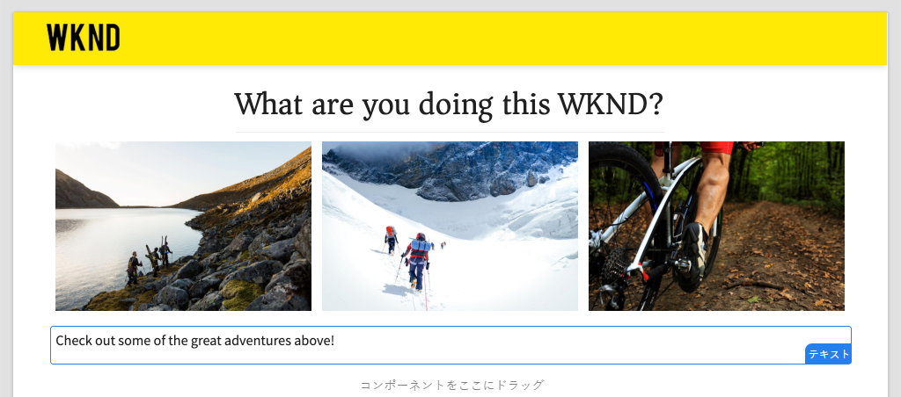
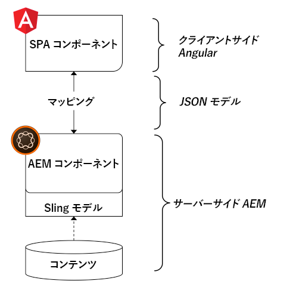
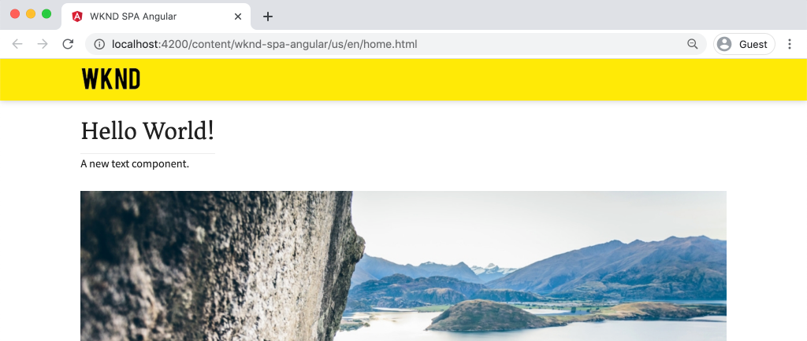
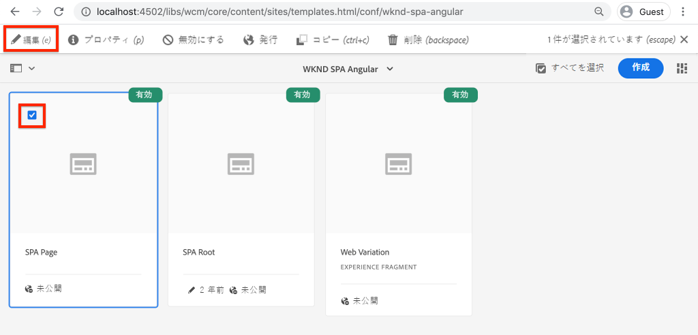
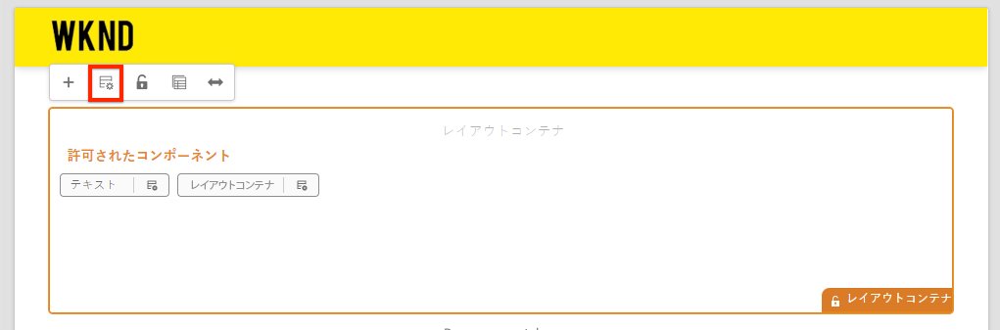
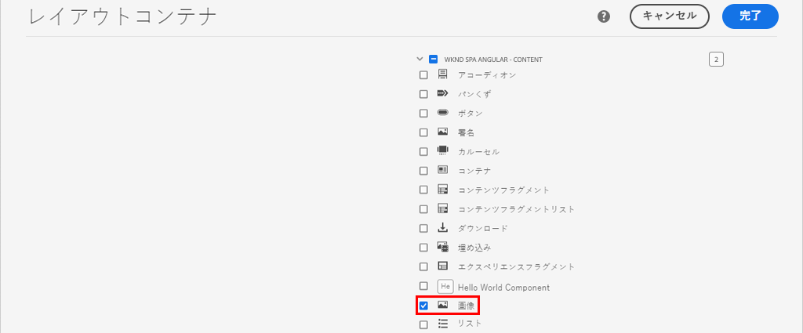
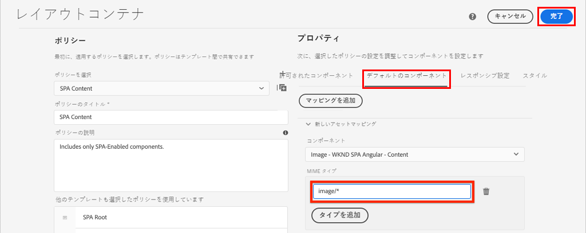
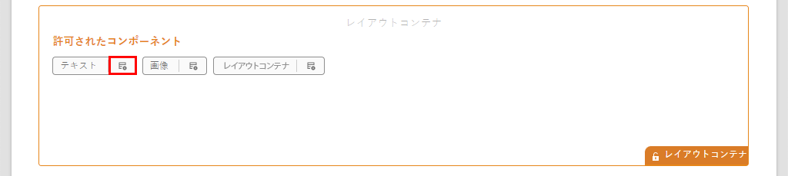
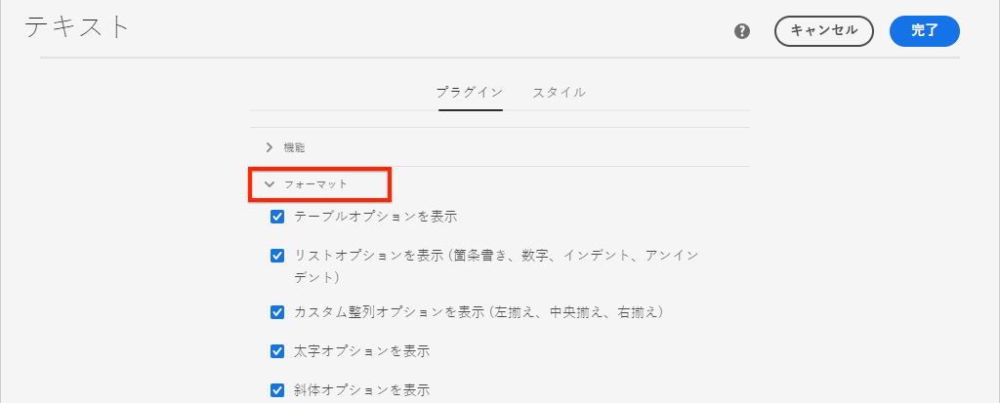
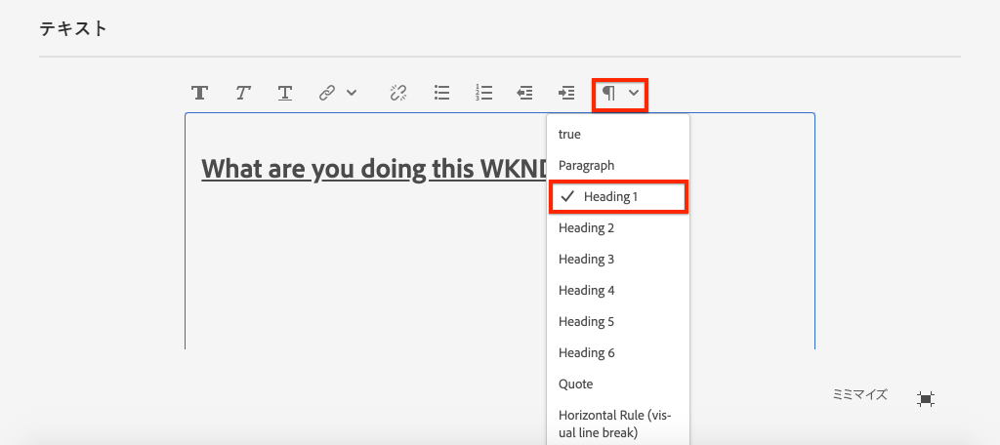

# SPA コンポーネントを AEM コンポーネントへのマッピング {#map-components}

{{spa-editor-deprecation}}

AEM SPA エディター JS SDK を使用して Angular コンポーネントを Adobe Experience Manager（AEM）コンポーネントにマッピングする方法について説明します。コンポーネントマッピングを使用すると、AEM SPA エディター内で、従来の AEM オーサリングと同様に、SPA コンポーネントを動的に更新できます。

この章では、AEM JSON モデル API について詳しく説明し、AEM コンポーネントによって公開された JSON コンテンツを prop として Angular コンポーネントに自動的に挿入する方法についても説明します。

## 目的

1. AEM コンポーネントを SPA コンポーネントにマッピングする方法について説明します。
2. **コンテナ**&#x200B;コンポーネントと&#x200B;**コンテンツ**&#x200B;コンポーネントの違いを理解します。
3. 既存の AEM コンポーネントにマッピングされる新規の Angular コンポーネントを作成します。

## 作成する内容

この章では、提供された`Text` SPA コンポーネントが AEM `Text` コンポーネントにどのようにマッピングされるかを調べます。SPA で使用し AEM でオーサリングできる新規の `Image` SPA コンポーネントが作成されます。**レイアウトコンテナ**&#x200B;および&#x200B;**テンプレートエディター**&#x200B;ポリシーの標準機能を使用して、わずかに外観が異なるビューを作成することもできます。



## 前提条件

[ローカル開発環境](overview.md#local-dev-environment)の設定に必要なツールと手順を確認します。

### コードの取得

1. このチュートリアルの出発点となるものを Git からダウンロードします。

   ```shell
   $ git clone git@github.com:adobe/aem-guides-wknd-spa.git
   $ cd aem-guides-wknd-spa
   $ git checkout Angular/map-components-start
   ```

2. Maven を使用してコードベースをローカルの AEM インスタンスにデプロイします。

   ```shell
   $ mvn clean install -PautoInstallSinglePackage
   ```

   [AEM 6.x](overview.md#compatibility) を使用する場合、次の `classic` プロファイルを追加します。

   ```shell
   $ mvn clean install -PautoInstallSinglePackage -Pclassic
   ```

完成したコードは、[GitHub](https://github.com/adobe/aem-guides-wknd-spa/tree/Angular/map-components-solution) で確認するか、またはブランチ `Angular/map-components-solution` に切り替えてコードをローカルで確認します。

## マッピングアプローチ

基本的な概念は、SPA コンポーネントを AEM コンポーネントにマッピングすることです。AEM コンポーネントは、サーバーサイドで実行され、JSON モデル API の一部としてコンテンツを書き出します。JSON コンテンツは、ブラウザーでクライアントサイドを実行している SPA によって使用されます。SPA コンポーネントと AEM コンポーネントの間に 1 対 1 のマッピングが作成されます。



*AEM コンポーネントから Angular コンポーネントへのマッピングの概要*

## テキストコンポーネントを検査する

[AEM プロジェクトアーキタイプ](https://github.com/adobe/aem-project-archetype)は、AEM [テキストコンポーネント](https://experienceleague.adobe.com/docs/experience-manager-core-components/using/components/text.html?lang=ja)にマッピングされる `Text` コンポーネントを提供します。これは、AEM から&#x200B;*コンテンツ*&#x200B;をレンダリングするという、**コンテンツ**&#x200B;コンポーネントの例です。

コンポーネントの動作を見てみましょう。

### JSON モデルを調べる

1. SPA のコードを調べる前に、AEM が提供する JSON モデルを理解しておくことが重要です。 [コアコンポーネントライブラリ](https://www.aemcomponents.dev/content/core-components-examples/library/core-content/text.html)に移動し、テキストコンポーネントのページを表示します。コアコンポーネントライブラリには、すべての AEM コアコンポーネントの例が記載されています。
2. 例の 1 つである **JSON** タブを選択します。

   

   `text`、`richText`、および `:type` の 3 つのプロパティが表示されます。

   `:type` は、AEM コンポーネントの `sling:resourceType`（またはパス）をリストする予約済みのプロパティです。`:type` の値は、AEM コンポーネントを SPA コンポーネントにマップするために使用されるものです。

   `text` および `richText` は、SPA コンポーネントに公開される追加のプロパティです。

### テキストコンポーネントの検査

1. 新しいターミナルウィンドウを開き、プロジェクト内の `ui.frontend` フォルダーに移動します。`npm install` の後に `npm start` を実行して、**webpack 開発サーバー**&#x200B;を起動します。

   ```shell
   $ cd ui.frontend
   $ npm run start:mock
   ```

   `ui.frontend` モジュールは現在、[モック JSON モデル](./integrate-spa.md#mock-json)を使用するように設定されています。

2. 新しいブラウザーウィンドウが開いて、[http://localhost:4200/content/wknd-spa-angular/us/en/home.html](http://localhost:4200/content/wknd-spa-angular/us/en/home.html) に移動します。

   

3. 任意の IDE で、WKND SPA 用の AEM プロジェクトを開きます。`ui.frontend` モジュールを展開し、`ui.frontend/src/app/components/text/text.component.ts` の下の **text.component.ts** ファイルを開きます。

   

4. 最初に検査する領域は、35 行目までの `class TextComponent` です。

   ```js
   export class TextComponent {
       @Input() richText: boolean;
       @Input() text: string;
       @Input() itemName: string;
   
       @HostBinding('innerHtml') get content() {
           return this.richText
           ? this.sanitizer.bypassSecurityTrustHtml(this.text)
           : this.text;
       }
       @HostBinding('attr.data-rte-editelement') editAttribute = true;
   
       constructor(private sanitizer: DomSanitizer) {}
   }
   ```

   [@Input()](https://angular.io/api/core/Input) デコレーターは、先ほど確認した、マッピング済み JSON オブジェクトを通じて値が設定されるフィールドの宣言に使用されます。

   `@HostBinding('innerHtml') get content()` は、`this.text` の値から作成したテキストコンテンツを公開するメソッドです。コンテンツが（`this.richText` フラグで決まる）リッチテキストの場合、Angular の組み込みセキュリティは無視されます。Angular の [DomSanitizer](https://angular.io/api/platform-browser/DomSanitizer) は、未処理の HTMLを「スクラブ」し、クロスサイトスクリプティングの脆弱性を防ぐために使用されます。このメソッドは、[@HostBinding](https://angular.io/api/core/HostBinding) デコレーターを使用して `innerHtml` プロパティにバインドされます。

5. 次に、24 行目までの `TextEditConfig` を調べます。

   ```js
   const TextEditConfig = {
       emptyLabel: 'Text',
       isEmpty: cqModel =>
           !cqModel || !cqModel.text || cqModel.text.trim().length < 1
   };
   ```

   上記のコードは AEM オーサー環境で、プレースホルダーをレンダリングするタイミングを決定する役割を果たします。 この `isEmpty` メソッドが **true** を返した場合、プレースホルダーがレンダリングされます。

6. 最後に、53 行目までの `MapTo` 呼び出しを確認します。

   ```js
   MapTo('wknd-spa-angular/components/text')(TextComponent, TextEditConfig );
   ```

   **MapTo** は、AEM SPA エディター JS SDK（`@adobe/cq-angular-editable-components`）から提供されます。パス `wknd-spa-angular/components/text` は、AEM コンポーネントの `sling:resourceType` を表します。このパスは、前に確認した JSON モデルによって公開された `:type` と一致します。**MapTo** は JSON モデルの応答を解析し、正しい値を SPA コンポーネントの `@Input()` 変数に渡します。

   AEM `Text` コンポーネントの定義は `ui.apps/src/main/content/jcr_root/apps/wknd-spa-angular/components/text` にあります。

7. `ui.frontend/src/mocks/json/en.model.json` の **en.model.json** を変更して実験します。

   62 行目までで、**`H1`** および **`u`** タグを使用するように最初の `Text` 値を更新します。

   ```json
       "text": {
           "text": "<h1><u>Hello World!</u></h1>",
           "richText": true,
           ":type": "wknd-spa-angular/components/text"
       }
   ```

   ブラウザーに戻り、**webpack 開発サーバー**&#x200B;から提供される効果を確認します。

   

   `richText` プロパティを **true** と **false** の間で切り替えて、動作中のレンダリングロジックを確認します。

8. `ui.frontend/src/app/components/text/text.component.html` の **text.component.html** を調べます。

   コンポーネントのコンテンツ全体が `innerHTML` プロパティで設定されるので、このファイルは空です。

9. `ui.frontend/src/app/app.module.ts` の **app.module.ts** を調べます。

   ```js
   @NgModule({
   imports: [
       BrowserModule,
       SpaAngularEditableComponentsModule,
       AppRoutingModule
   ],
   providers: [ModelManagerService, { provide: APP_BASE_HREF, useValue: '/' }],
   declarations: [AppComponent, TextComponent, PageComponent, HeaderComponent],
   entryComponents: [TextComponent, PageComponent],
   bootstrap: [AppComponent]
   })
   export class AppModule {}
   ```

   **TextComponent** は明示的に組み込まれるのではなく、AEM SPA エディター JS SDK から提供される **AEMResponsiveGridComponent** を通じて動的に組み込まれます。したがって、**app.module.ts** の [entryComponents](https://angular.io/guide/entry-components) 配列にリストされている必要があります。

## 画像コンポーネントの作成

次に、AEM の[画像コンポーネント](https://experienceleague.adobe.com/docs/experience-manager-core-components/using/components/image.html?lang=ja)にマッピングされる `Image` Angular コンポーネントを作成します。この `Image` コンポーネントは、**コンテンツ**&#x200B;コンポーネントのもう一つの例です。

### JSO の検査

SPA コードを調べる前に、AEM が指定した JSON モデルを調べます。

1. [コアコンポーネントライブラリに置かれた画像の例](https://www.aemcomponents.dev/content/core-components-examples/library/core-content/image.html)に移動します。

   

   `src`、`alt`、`title` のプロパティは、SPA `Image` コンポーネントの入力に使用されます。

   >[!NOTE]
   >
   > 公開された他の画像プロパティ（`lazyEnabled`、`widths`）があり、これを使用して開発者は、適応型の遅延読み込みコンポーネントを作成することができます。このチュートリアルで作成されたコンポーネントはシンプルで、これらの詳細なプロパティを使用&#x200B;**しません**。

2. IDE に戻り、`en.model.json`（`ui.frontend/src/mocks/json/en.model.json`）を開きます。これはプロジェクトのまったく新しいコンポーネントなので、画像 JSON の「モック」を作成する必要があります。

   70 行目までで、`image` モデルの JSON エントリを追加し（2 番目の `text_386303036` の後にコンマ `,` を入れることを忘れないでください）、`:itemsOrder` 配列を更新します。

   ```json
   ...
   ":items": {
               ...
               "text_386303036": {
                   "text": "<p>A new text component.</p>\r\n",
                   "richText": true,
                   ":type": "wknd-spa-angular/components/text"
                   },
               "image": {
                   "alt": "Rock Climber in New Zealand",
                   "title": "Rock Climber in New Zealand",
                   "src": "/mocks/images/adobestock-140634652.jpeg",
                   ":type": "wknd-spa-angular/components/image"
               }
           },
           ":itemsOrder": [
               "text",
               "text_386303036",
               "image"
           ],
   ```

   このプロジェクトには、**webpack 開発サーバー**&#x200B;と共に使用されるサンプル画像（`/mock-content/adobestock-140634652.jpeg`）が含まれています。

   すべての en.model.json については、[こちら](https://github.com/adobe/aem-guides-wknd-spa/blob/Angular/map-components-solution/ui.frontend/src/mocks/json/en.model.json)を参照してください。

3. コンポーネントに表示するストック写真を追加します。

   `ui.frontend/src/mocks` の下に **images** という名前の新しいフォルダーを作成します。[adobestock-140634652.jpeg](assets/map-components/adobestock-140634652.jpeg) をダウンロードし、新しく作成した **images** フォルダーに格納します。必要に応じて、自分の画像を自由に使用できます。

### 画像コンポーネントの実装

1. **webpack 開発サーバー**&#x200B;が起動されていれば停止します。
2. `ui.frontend` フォルダー内から Angular CLI `ng generate component` コマンドを実行して、新しい画像コンポーネントを作成します。

   ```shell
   $ ng generate component components/image
   ```

3. IDE で、**image.component.ts**（`ui.frontend/src/app/components/image/image.component.ts`）を開いて、次のように更新します。

   ```js
   import {Component, Input, OnInit} from '@angular/core';
   import {MapTo} from '@adobe/cq-angular-editable-components';
   
   const ImageEditConfig = {
   emptyLabel: 'Image',
   isEmpty: cqModel =>
       !cqModel || !cqModel.src || cqModel.src.trim().length < 1
   };
   
   @Component({
   selector: 'app-image',
   templateUrl: './image.component.html',
   styleUrls: ['./image.component.scss']
   })
   export class ImageComponent implements OnInit {
   
   @Input() src: string;
   @Input() alt: string;
   @Input() title: string;
   
   constructor() { }
   
   get hasImage() {
       return this.src && this.src.trim().length > 0;
   }
   
   ngOnInit() { }
   }
   
   MapTo('wknd-spa-angular/components/image')(ImageComponent, ImageEditConfig);
   ```

   `ImageEditConfig` は、`src` プロパティに値が設定されているかどうかに応じて、AEM でオーサープレースホルダーをレンダリングするかどうかを決定するための設定です。

   `src`、`alt` および `title` の `@Input()` は、JSON API からマッピングされるプロパティです。

   `hasImage()` は、画像をレンダリングするかどうかを指定するメソッドです。

   `MapTo` は、SPA コンポーネントを、`ui.apps/src/main/content/jcr_root/apps/wknd-spa-angular/components/image` にある AEM コンポーネントにマッピングします。

4. **image.component.html** を開いて、次のように更新します。

   ```html
   <ng-container *ngIf="hasImage">
       
   </ng-container>
   ```

   これにより、`hasImage` が **true** を返す場合、`` 要素がレンダリングされるようになります。

5. **image.component.scss** を開いて、次のように更新します。

   ```scss
   :host-context {
       display: block;
   }
   
   .image {
       margin: 1rem 0;
       width: 100%;
       border: 0;
   }
   ```

   >[!NOTE]
   >
   > `:host-context` ルールは、AEM SPA エディターのプレースホルダーが正しく機能するために&#x200B;**重要**&#x200B;です。AEM ページエディターで作成するすべての SPA コンポーネントには、少なくともこのルールが必要です。

6. `app.module.ts` を開いて、`entryComponents` 配列に `ImageComponent` を追加します。

   ```js
   entryComponents: [TextComponent, PageComponent, ImageComponent],
   ```

   `TextComponent` と同様に、`ImageComponent` は動的に読み込まれるので、`entryComponents` 配列に含める必要があります。

7. **webpack 開発サーバー**&#x200B;を起動して、`ImageComponent` がレンダリングされることを確認します。

   ```shell
   $ npm run start:mock
   ```

   

   *SPA に追加された画像*

   >[!NOTE]
   >
   > **ボーナスチャレンジ**：`title` の値を画像の下のキャプションとして表示する新しいメソッドを実装します。

## AEM でのポリシーの更新

`ImageComponent` コンポーネントは、**webpack 開発サーバー**&#x200B;でのみ表示されます。次に、更新された SPA を AEM にデプロイし、テンプレートポリシーを更新します。

1. **webpack 開発サーバー**&#x200B;を停止し、プロジェクトの&#x200B;**ルート**&#x200B;から、Maven スキルを使用して変更内容を AEM にデプロイします。

   ```shell
   $ cd aem-guides-wknd-spa
   $ mvn clean install -PautoInstallSinglePackage
   ```

2. AEM 開始画面から、**[!UICONTROL ツール]**／**[!UICONTROL テンプレート]**／**[WKND SPA Angular](http://localhost:4502/libs/wcm/core/content/sites/templates.html/conf/wknd-spa-angular)** に移動します。

   **SPA ページ**&#x200B;を選択して編集します。

   

3. **レイアウトコンテナ**&#x200B;を選択し、「**ポリシー**」アイコンをクリックしてポリシーを編集します。

   

4. **許可されたコンポーネント**／**WKND SPA Angular - コンテンツ**&#x200B;の下で、**画像**&#x200B;コンポーネントにチェックを入れます。

   

   **デフォルトのコンポーネント**／**マッピングを追加**&#x200B;の下で、**画像 - WKND SPA Angular - コンテンツ**&#x200B;コンポーネントを選択します。

   

   `image/*` の **mime タイプ**&#x200B;を入力します。

   「**完了**」をクリックして、ポリシーの更新を保存します。

5. **レイアウトコンテナ**&#x200B;で、**テキスト**&#x200B;コンポーネント用の&#x200B;**ポリシー**&#x200B;アイコンをクリックします。

   

   **WKND SPA テキスト**&#x200B;という名前の新しいポリシーを作成します。**プラグイン**／**書式設定**&#x200B;の下にあるすべてのボックスをオンにして、次の追加の書式設定オプションを有効にします。

   

   **プラグイン**／**段落スタイル**&#x200B;の下で、「**段落スタイルを有効にする**」チェックボックスをオンにします。

   

   「**完了**」をクリックしてポリシーの更新を保存します。

6. **ホームページ** [http://localhost:4502/editor.html/content/wknd-spa-angular/us/en/home.html](http://localhost:4502/editor.html/content/wknd-spa-angular/us/en/home.html) に移動します。

   また、`Text` コンポーネントを編集して、**全画面表示**&#x200B;モードで追加の段落スタイルを追加できます。

   

7. また、画像を&#x200B;**アセットファインダー**&#x200B;からドラッグ＆ドロップできます。

   

8. [AEM Assets](http://localhost:4502/assets.html/content/dam) を介して独自の画像を追加するか、標準の [WKND 参照サイト](https://github.com/adobe/aem-guides-wknd/releases/latest)の完成したコードベースをインストールします。[WKND 参照サイト](https://github.com/adobe/aem-guides-wknd/releases/latest)には、WKND SPAで再利用できる画像が多数含まれています。 パッケージは、[AEM のパッケージマネージャー](http://localhost:4502/crx/packmgr/index.jsp)を使用してインストールできます。

   

## レイアウトコンテナを調べる

**レイアウトコンテナ**&#x200B;のサポートは、AEM SPA Editor SDK によって自動的に提供されます。 **レイアウトコンテナ**&#x200B;は、その名前が示すように&#x200B;**コンテナ**&#x200B;コンポーネントです。コンテナコンポーネントは、*他の*&#x200B;コンポーネントを表す JSON 構造を受け入れ、それらを動的にインスタンス化するコンポーネントです。

ここでは、レイアウトコンテナをさらに詳しく調べます。

1. IDE で `ui.frontend/src/app/components/responsive-grid` の **responsive-grid.component.ts** を開きます。

   ```js
   import { AEMResponsiveGridComponent,MapTo } from '@adobe/cq-angular-editable-components';
   
   MapTo('wcm/foundation/components/responsivegrid')(AEMResponsiveGridComponent);
   ```

   `AEMResponsiveGridComponent` はAEM SPA Editor SDK の一部として実装され、`import-components` を介してプロジェクトに含まれます。

2. ブラウザーで、[http://localhost:4502/content/wknd-spa-angular/us/en.model.json](http://localhost:4502/content/wknd-spa-angular/us/en.model.json) に移動します。

   

   **レイアウトコンテナ**&#x200B;コンポーネントの `sling:resourceType` は `wcm/foundation/components/responsivegrid` であり、`Text` コンポーネントや `Image` コンポーネントと同様に、`:type` プロパティを使用して SPA エディターによって認識されます。

   [レイアウトモード](https://experienceleague.adobe.com/docs/experience-manager-65/authoring/siteandpage/responsive-layout.html?lang=ja#defining-layouts-layout-mode)を使用してコンポーネントのサイズを変更するのと同じ機能が、SPA エディターで利用できます。

3. [http://localhost:4502/editor.html/content/wknd-spa-angular/us/en/home.html](http://localhost:4502/editor.html/content/wknd-spa-angular/us/en/home.html) に戻ります。さらに&#x200B;**画像**&#x200B;コンポーネントを追加し、**レイアウト**&#x200B;オプションを使用してサイズを変更してみてください。

   

4. JSON モデル [http://localhost:4502/content/wknd-spa-angular/us/en.model.json](http://localhost:4502/content/wknd-spa-angular/us/en.model.json) を再度開いて、`columnClassNames` が JSON の一部であることを確認してください。

   

   クラス名 `aem-GridColumn--default--4` は、12 列のグリッドに基づいて幅が 4 列に設定されている必要があることを示します。レスポンシブグリッドについて詳しくは、[こちら](https://adobe-marketing-cloud.github.io/aem-responsivegrid/)をご覧ください。

5. IDE に戻り、`ui.apps` モジュールで、`ui.apps/src/main/content/jcr_root/apps/wknd-spa-angular/clientlibs/clientlib-grid` で定義されたクライアントサイドライブラリがあります。`less/grid.less` ファイルを開きます。

   このファイルは、**レイアウトコンテナ**&#x200B;で使用されるブレークポイント（`default`、`tablet`、`phone`）を特定します。このファイルは、プロジェクトの仕様に応じてカスタマイズされます。 現在、ブレークポイントは `1200px` および `650px` に設定されています。

6. `Text` コンポーネントのレスポンシブ機能と、更新されたリッチテキストポリシーを使用して、次のようなビューを作成できます。

   

## おめでとうございます。 {#congratulations}

これで、SPA コンポーネントを AEM コンポーネントにマッピングする方法を学習し、新しい `Image` コンポーネントを実装しました。また、**レイアウトコンテナ**&#x200B;のレスポンシブ機能について探索する機会もありました。

完成したコードを [GitHub](https://github.com/adobe/aem-guides-wknd-spa/tree/Angular/map-components-solution) で確認する、または、ブランチ `Angular/map-components-solution` に切り替えて、コードをローカルでチェックアウトします。

### 次の手順 {#next-steps}

[ナビゲーションとルーティング](navigation-routing.md) - SPA Editor SDK を使用して AEM ページにマッピングすることで、SPA の複数のビューをサポートする方法について説明します。 Angular ルートを使用して動的ナビゲーションを実装し、既存のヘッダーコンポーネントに追加します。

## （ボーナス）ソースコントロールに対する設定の保持 {#bonus}

多くの場合、特に AEM プロジェクトの開始時に、テンプレートや関連するコンテンツポリシーなどの設定をソースコントロールに保持すると便利です。 これにより、すべての開発者が同じセットのコンテンツと設定に対して作業することが保証され、環境間の一貫性がさらに確保できます。プロジェクトが一定の成熟度に達すると、テンプレートの管理作業を特別なパワーユーザーグループに引き継ぐことができます。

次のいくつかの手順は、Visual Studio Code IDE と [VSCode AEM Sync](https://marketplace.visualstudio.com/items?itemName=yamato-ltd.vscode-aem-sync) を使用して行われますが、AEM のローカルインスタンスからコンテンツを&#x200B;**取り込み**&#x200B;または&#x200B;**読み込む**&#x200B;ように設定した任意のツールと IDE を使用して行うことができます。

1. Visual Studio Code IDE で、Marketplace 拡張機能を介して **VSCode AEM Sync** がインストールされていることを確認します。

   

2. プロジェクトエクスプローラー内の **ui.content** モジュールをを展開して、`/conf/wknd-spa-angular/settings/wcm/templates` に移動します。

3. `templates` フォルダーを&#x200B;**右クリック**&#x200B;し、**AEM サーバーから読み込み**&#x200B;を選択します。

   

4. コンテンツを読み込む手順を繰り返しますが、`/conf/wknd-spa-angular/settings/wcm/policies` に置かれた&#x200B;**ポリシー**&#x200B;フォルダーを選択します。

5. `ui.content/src/main/content/META-INF/vault/filter.xml` にある `filter.xml` ファイルを調べます。

   ```xml
   <!--ui.content filter.xml-->
   <?xml version="1.0" encoding="UTF-8"?>
    <workspaceFilter version="1.0">
        <filter root="/conf/wknd-spa-angular" mode="merge"/>
        <filter root="/content/wknd-spa-angular" mode="merge"/>
        <filter root="/content/dam/wknd-spa-angular" mode="merge"/>
        <filter root="/content/experience-fragments/wknd-spa-angular" mode="merge"/>
    </workspaceFilter>
   ```

   `filter.xml` ファイルは、パッケージと共にインストールされるノードのパスを識別する役割を果たします。各フィルターの `mode="merge"` に注目してください。これは、既存のコンテンツは変更されず、新しいコンテンツのみが追加されることを示しています。コンテンツ作成者がこれらのパスを更新する可能性があるので、コードのデプロイメントでは、コンテンツを上書き&#x200B;**しない**&#x200B;ことが重要です。フィルター要素の操作の詳細については、[FileVault ドキュメント](https://jackrabbit.apache.org/filevault/filter.html)を参照してください。

   `ui.content/src/main/content/META-INF/vault/filter.xml` と `ui.apps/src/main/content/META-INF/vault/filter.xml` を比較して、各モジュールによって管理される様々なノードを理解します。
