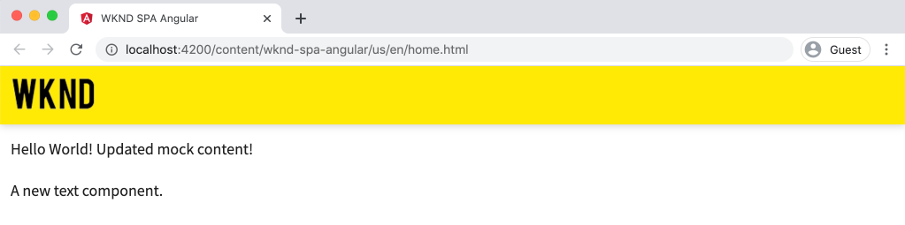

# SPAコンポーネントのAEMコンポーネントへのマッピング {#map-components}

AEM SPA Editor JS SDK を使用して、AngularコンポーネントをAdobe Experience Manager(AEM) コンポーネントにマッピングする方法について説明します。 コンポーネントマッピングを使用すると、AEM SPAエディター内で、従来のAEMオーサリングと同様に、SPAコンポーネントを動的に更新できます。

この章では、AEM JSON モデル API について詳しく説明し、AEMコンポーネントによって公開された JSON コンテンツを prop としてAngularコンポーネントに自動的に挿入する方法について説明します。

## 目的

1. AEMコンポーネントをSPAコンポーネントにマッピングする方法について説明します。
2. 違いを理解する **コンテナ** コンポーネントと **コンテンツ** コンポーネント。
3. 既存のAngularコンポーネントにマッピングする新しいAEMコンポーネントを作成します。

## 作成する内容

この章では、指定された `Text` SPAコンポーネントがAEMにマッピングされている `Text`コンポーネント。 新しい `Image` SPAで使用でき、AEMで作成できるSPAコンポーネントが作成されます。 の標準機能 **レイアウトコンテナ** および **テンプレートエディター** ポリシーを使用して、外観が少し多様なビューを作成することもできます。


## 前提条件

設定に必要なツールと手順を確認します。 [ローカル開発環境](overview.md#local-dev-environment).

### コードの取得

1. このチュートリアルの開始点を Git からダウンロードします。

   ```shell
   $ git clone git@github.com:adobe/aem-guides-wknd-spa.git
   $ cd aem-guides-wknd-spa
   $ git checkout Angular/map-components-start
   ```

2. Maven を使用して、ローカルのAEMインスタンスにコードベースをデプロイします。

   ```shell
   $ mvn clean install -PautoInstallSinglePackage
   ```

   を使用する場合 [AEM 6.x](overview.md#compatibility) 追加 `classic` プロファイル：

   ```shell
   $ mvn clean install -PautoInstallSinglePackage -Pclassic
   ```

完成したコードは、 [GitHub](https://github.com/adobe/aem-guides-wknd-spa/tree/Angular/map-components-solution) または、ブランチに切り替えて、コードをローカルでチェックアウトします。 `Angular/map-components-solution`.

## マッピングアプローチ

基本的な概念は、SPAコンポーネントをAEMコンポーネントにマッピングすることです。 AEMコンポーネントは、サーバー側で実行され、JSON モデル API の一部としてコンテンツを書き出します。 JSON コンテンツは、ブラウザーでクライアント側を実行しているSPAによって使用されます。 SPAコンポーネントとAEMコンポーネントの間に 1 対 1 のマッピングが作成されます。


*AEMコンポーネントとAngularコンポーネントのマッピングの概要*

## Inspect the Text Component

この [AEM Project Archetype](https://github.com/adobe/aem-project-archetype) を提供 `Text` AEM [テキストコンポーネント](https://experienceleague.adobe.com/docs/experience-manager-core-components/using/components/text.html?lang=ja). これは、 **コンテンツ** コンポーネントをレンダリングする *コンテンツ* AEMから

コンポーネントの動作を見てみましょう。

### Inspect JSON モデル

1. SPAのコードを調べる前に、AEMが提供する JSON モデルを理解しておくことが重要です。 次に移動： [コアコンポーネントライブラリ](https://www.aemcomponents.dev/content/core-components-examples/library/core-content/text.html) テキストコンポーネントのページを表示します。 コアコンポーネントライブラリには、すべてのAEMコアコンポーネントの例が記載されています。
2. を選択します。 **JSON** タブで次のいずれかの例を確認できます。

   

   次の 3 つのプロパティが表示されます。 `text`, `richText`、および `:type`.

   `:type` は、 `sling:resourceType` （またはパス）AEMコンポーネントの の値 `:type` は、AEMコンポーネントをSPAコンポーネントにマッピングするために使用されるものです。

   `text` および `richText` は、SPAコンポーネントに公開される追加のプロパティです。

### Inspect Text コンポーネント

1. 新しいターミナルを開き、 `ui.frontend` フォルダーをプロジェクト内に配置します。 実行 `npm install` その後 `npm start` を起動します。 **webpack dev server**:

   ```shell
   $ cd ui.frontend
   $ npm run start:mock
   ```

   この `ui.frontend` モジュールは現在、 [モック JSON モデル](./integrate-spa.md#mock-json).

2. 新しいブラウザーウィンドウが開いて、 [http://localhost:4200/content/wknd-spa-angular/us/en/home.html](http://localhost:4200/content/wknd-spa-angular/us/en/home.html)

   

3. 任意の IDE で、WKND SPA用のAEMプロジェクトを開きます。 を展開します。 `ui.frontend` モジュールを開き、ファイルを開きます。 **text.component.ts** under `ui.frontend/src/app/components/text/text.component.ts`:

   

4. 最初に検査する領域は、 `class TextComponent` ～行 35:

   ```js
   export class TextComponent {
       @Input() richText: boolean;
       @Input() text: string;
       @Input() itemName: string;
   
       @HostBinding('innerHtml') get content() {
           return this.richText
           ? this.sanitizer.bypassSecurityTrustHtml(this.text)
           : this.text;
       }
       @HostBinding('attr.data-rte-editelement') editAttribute = true;
   
       constructor(private sanitizer: DomSanitizer) {}
   }
   ```

   [@Input()](https://angular.io/api/core/Input) decorator は、既に確認した、マッピングされた JSON オブジェクトを介して値が設定されるフィールドを宣言するために使用されます。

   `@HostBinding('innerHtml') get content()` は、作成したテキストコンテンツを `this.text`. コンテンツがリッチテキストの場合 ( `this.richText` フラグ )Angularの組み込みのセキュリティは無視されます。 Angular [DomSanitizer](https://angular.io/api/platform-browser/DomSanitizer) は、生のHTMLを「スクラブ」し、クロスサイトスクリプティングの脆弱性を防ぐために使用されます。 メソッドは `innerHtml` プロパティを [@HostBinding](https://angular.io/api/core/HostBinding) デコレーター。

5. 次に、 `TextEditConfig` ～行 24:

   ```js
   const TextEditConfig = {
       emptyLabel: 'Text',
       isEmpty: cqModel =>
           !cqModel || !cqModel.text || cqModel.text.trim().length < 1
   };
   ```

   上記のコードは、AEMオーサー環境でプレースホルダーをレンダリングするタイミングを決定する役割を果たします。 この `isEmpty` メソッドの戻り値 **true** その後、プレースホルダーがレンダリングされます。

6. 最後に、 `MapTo` ～line 53 でを呼び出します。

   ```js
   MapTo('wknd-spa-angular/components/text')(TextComponent, TextEditConfig );
   ```

   **MapTo** は、AEM SPA Editor JS SDK(`@adobe/cq-angular-editable-components`) をクリックします。 パス `wknd-spa-angular/components/text` は、 `sling:resourceType` AEMコンポーネントの このパスは `:type` 以前に確認された JSON モデルによって公開される。 **MapTo** は JSON モデルの応答を解析し、正しい値を `@Input()` SPAコンポーネントの変数。

   AEM `Text` 次のコンポーネント定義： `ui.apps/src/main/content/jcr_root/apps/wknd-spa-angular/components/text`.

7. を変更して実験する **en.model.json** ～にファイルを送る `ui.frontend/src/mocks/json/en.model.json`.

   ～ライン 62 で、最初の `Text` 使用する値 **`H1`** および **`u`** タグ：

   ```json
       "text": {
           "text": "<h1><u>Hello World!</u></h1>",
           "richText": true,
           ":type": "wknd-spa-angular/components/text"
       }
   ```

   ブラウザーに戻り、 **webpack dev server**:

   

   以下を切り替えてみてください： `richText` 間のプロパティ **true** / **false** をクリックして、実行中のレンダリングロジックを確認します。

8. Inspect **text.component.html** 時刻 `ui.frontend/src/app/components/text/text.component.html`.

   コンポーネントのコンテンツ全体が `innerHTML` プロパティ。

9. Inspect **app.module.ts** 時刻 `ui.frontend/src/app/app.module.ts`.

   ```js
   @NgModule({
   imports: [
       BrowserModule,
       SpaAngularEditableComponentsModule,
       AppRoutingModule
   ],
   providers: [ModelManagerService, { provide: APP_BASE_HREF, useValue: '/' }],
   declarations: [AppComponent, TextComponent, PageComponent, HeaderComponent],
   entryComponents: [TextComponent, PageComponent],
   bootstrap: [AppComponent]
   })
   export class AppModule {}
   ```

   この **TextComponent** が明示的に含まれていないが、より動的に **AEMResponsiveGridComponent** は、AEM SPA Editor JS SDK によって提供されます。 したがって、 **app.module.ts**&#39; [entryComponents](https://angular.io/guide/entry-components) 配列。

## 画像コンポーネントの作成

次に、 `Image` AEMにマッピングされるangularコンポーネント [画像コンポーネント](https://experienceleague.adobe.com/docs/experience-manager-core-components/using/components/image.html?lang=ja). この `Image` コンポーネントは、 **コンテンツ** コンポーネント。

### Inspect the JSON

SPAコードを調べる前に、AEMから提供された JSON モデルを調べます。

1. 次に移動： [コアコンポーネントライブラリの例を示します](https://www.aemcomponents.dev/content/core-components-examples/library/core-content/image.html).

   

   のプロパティ `src`, `alt`、および `title` がSPA `Image` コンポーネント。

   >[!NOTE]
   >
   > 他の画像プロパティが公開されています (`lazyEnabled`, `widths`) を使用して、開発者がアダプティブな遅延読み込みコンポーネントを作成できるようにします。 このチュートリアルで作成されるコンポーネントはシンプルで、以下をおこないます。 **not** これらの詳細プロパティを使用します。

2. IDE に戻り、 `en.model.json` 時刻 `ui.frontend/src/mocks/json/en.model.json`. これはプロジェクトの新しいコンポーネントなので、画像 JSON のモックを作成する必要があります。

   ～行 70 で、 `image` モデル（末尾のコンマを忘れないでください） `,` 二回目以降 `text_386303036`) をクリックし、 `:itemsOrder` 配列。

   ```json
   ...
   ":items": {
               ...
               "text_386303036": {
                   "text": "<p>A new text component.</p>\r\n",
                   "richText": true,
                   ":type": "wknd-spa-angular/components/text"
                   },
               "image": {
                   "alt": "Rock Climber in New Zealand",
                   "title": "Rock Climber in New Zealand",
                   "src": "/mocks/images/adobestock-140634652.jpeg",
                   ":type": "wknd-spa-angular/components/image"
               }
           },
           ":itemsOrder": [
               "text",
               "text_386303036",
               "image"
           ],
   ```

   このプロジェクトには、以下の場所にサンプル画像が含まれています。 `/mock-content/adobestock-140634652.jpeg` それは **webpack dev server**.

   完全な [en.model.json はここに](https://github.com/adobe/aem-guides-wknd-spa/blob/Angular/map-components-solution/ui.frontend/src/mocks/json/en.model.json).

3. コンポーネントに表示するストック写真を追加します。

   という名前の新しいフォルダーを作成します。 **画像** 下 `ui.frontend/src/mocks`. ダウンロード [adobestock-140634652.jpeg](assets/map-components/adobestock-140634652.jpeg) 新しく作成した **画像** フォルダー。 必要に応じて、自分の画像を自由に使用できます。

### 画像コンポーネントの実装

1. を停止します。 **webpack dev server** （開始した場合）
2. angularCLI を実行して新しい画像コンポーネントを作成する `ng generate component` 内から命令 `ui.frontend` フォルダー：

   ```shell
   $ ng generate component components/image
   ```

3. IDE で、を開きます。 **image.component.ts** 時刻 `ui.frontend/src/app/components/image/image.component.ts` およびを次のように更新します。

   ```js
   import {Component, Input, OnInit} from '@angular/core';
   import {MapTo} from '@adobe/cq-angular-editable-components';
   
   const ImageEditConfig = {
   emptyLabel: 'Image',
   isEmpty: cqModel =>
       !cqModel || !cqModel.src || cqModel.src.trim().length < 1
   };
   
   @Component({
   selector: 'app-image',
   templateUrl: './image.component.html',
   styleUrls: ['./image.component.scss']
   })
   export class ImageComponent implements OnInit {
   
   @Input() src: string;
   @Input() alt: string;
   @Input() title: string;
   
   constructor() { }
   
   get hasImage() {
       return this.src && this.src.trim().length > 0;
   }
   
   ngOnInit() { }
   }
   
   MapTo('wknd-spa-angular/components/image')(ImageComponent, ImageEditConfig);
   ```

   `ImageEditConfig` は、AEMでオーサープレースホルダーをレンダリングするかどうかを、 `src` プロパティが設定されている。

   `@Input()` / `src`, `alt`、および `title` は、JSON API からマッピングされるプロパティです。

   `hasImage()` は、イメージをレンダリングする必要があるかどうかを指定するメソッドです。

   `MapTo` はSPAコンポーネントを、次の場所にあるAEMコンポーネントにマッピングします。 `ui.apps/src/main/content/jcr_root/apps/wknd-spa-angular/components/image`.

4. 開く **image.component.html** を更新し、次のようにします。

   ```html
   <ng-container *ngIf="hasImage">
       
   </ng-container>
   ```

   これにより、 `` 要素の場合 `hasImage` 戻り値 **true**.

5. 開く **image.component.scss** を更新し、次のようにします。

   ```scss
   :host-context {
       display: block;
   }
   
   .image {
       margin: 1rem 0;
       width: 100%;
       border: 0;
   }
   ```

   >[!NOTE]
   >
   > この `:host-context` ルール： **重要な** AEM SPAエディターのプレースホルダーが正しく機能するように設定する必要があります。 AEMページエディターで作成するSPAコンポーネントは、すべて、少なくともこのルールが必要です。

6. 開く `app.module.ts` をクリックし、 `ImageComponent` から `entryComponents` 配列：

   ```js
   entryComponents: [TextComponent, PageComponent, ImageComponent],
   ```

   次に類似 `TextComponent`、 `ImageComponent` は動的に読み込まれ、 `entryComponents` 配列。

7. を開始します。 **webpack dev server** 見る `ImageComponent` レンダリング

   ```shell
   $ npm run start:mock
   ```

   

   *画像がSPAに追加されました*

   >[!NOTE]
   >
   > **ボーナスチャレンジ**:新しいメソッドを実装して、 `title` 画像の下のキャプションとして。

## AEMでのポリシーの更新

この `ImageComponent` コンポーネントは、 **webpack dev server**. 次に、更新されたSPAをAEMにデプロイし、テンプレートポリシーを更新します。

1. を停止します。 **webpack dev server** そして **root** を使用して、AEMに変更をデプロイします。

   ```shell
   $ cd aem-guides-wknd-spa
   $ mvn clean install -PautoInstallSinglePackage
   ```

2. AEM Start 画面からに移動します。 **[!UICONTROL ツール]** > **[!UICONTROL テンプレート]** > **[WKNDSPAAngular](http://localhost:4502/libs/wcm/core/content/sites/templates.html/conf/wknd-spa-angular)**.

   を選択して編集します。 **SPA Page**:

   

3. を選択します。 **レイアウトコンテナ** クリックします。 **ポリシー** アイコンを使用してポリシーを編集します。

   

4. の下 **許可されたコンポーネント** > **WKND SPAAngular — コンテンツ** > 「 **画像** コンポーネント：

   

   の下 **デフォルトのコンポーネント** > **マッピングを追加** を選択し、 **画像 — WKND SPAAngular — コンテンツ** コンポーネント：

   

   を入力します。 **mime タイプ** / `image/*`.

   クリック **完了** ポリシーの更新を保存します。

5. 内 **レイアウトコンテナ** クリック **ポリシー** アイコン **テキスト** コンポーネント：

   

   という名前の新しいポリシーを作成します。 **WKND SPA Text**. の下 **プラグイン** > **書式設定** /すべてのボックスをオンにして、追加の書式設定オプションを有効にします。

   

   の下 **プラグイン** > **段落スタイル** /チェックボックスをオンにして **段落スタイルを有効にする**:

   

   クリック **完了** ポリシーの更新を保存します。

6. 次に移動： **ホームページ** [http://localhost:4502/editor.html/content/wknd-spa-angular/us/en/home.html](http://localhost:4502/editor.html/content/wknd-spa-angular/us/en/home.html).

   また、 `Text` コンポーネントと追加の段落スタイルを **フルスクリーン** モード。

   

7. また、画像を **アセットファインダー**:

   

8. で独自の画像を追加 [AEM Assets](http://localhost:4502/assets.html/content/dam) または、標準の完成したコードベースをインストールします。 [WKND リファレンスサイト](https://github.com/adobe/aem-guides-wknd/releases/latest). この [WKND リファレンスサイト](https://github.com/adobe/aem-guides-wknd/releases/latest) には、WKND SPAで再利用できる画像が多数含まれています。 パッケージは、 [AEM Package Manager](http://localhost:4502/crx/packmgr/index.jsp).

   

## レイアウトコンテナのInspect

のサポート **レイアウトコンテナ** は、AEM SPA Editor SDK によって自動的に提供されます。 この **レイアウトコンテナ**（名前で示されている）は、 **コンテナ** コンポーネント。 コンテナコンポーネントは、 *その他* コンポーネントを作成し、動的にインスタンス化します。

ここでは、レイアウトコンテナをさらに詳しく調べます。

1. IDE でを開きます。 **responsive-grid.component.ts** 時刻 `ui.frontend/src/app/components/responsive-grid`:

   ```js
   import { AEMResponsiveGridComponent,MapTo } from '@adobe/cq-angular-editable-components';
   
   MapTo('wcm/foundation/components/responsivegrid')(AEMResponsiveGridComponent);
   ```

   この `AEMResponsiveGridComponent` はAEM SPA Editor SDK の一部として実装され、を介してプロジェクトに含まれます。 `import-components`.

2. ブラウザーで、に移動します。 [http://localhost:4502/content/wknd-spa-angular/us/en.model.json](http://localhost:4502/content/wknd-spa-angular/us/en.model.json)

   

   この **レイアウトコンテナ** コンポーネントに `sling:resourceType` / `wcm/foundation/components/responsivegrid` とは、SPAエディターで `:type` プロパティは、 `Text` および `Image` コンポーネント。

   を使用してコンポーネントのサイズを変更するのと同じ機能 [レイアウトモード](https://experienceleague.adobe.com/docs/experience-manager-65/authoring/siteandpage/responsive-layout.html#defining-layouts-layout-mode) はSPA Editor で使用できます。

3. 戻る [http://localhost:4502/editor.html/content/wknd-spa-angular/us/en/home.html](http://localhost:4502/editor.html/content/wknd-spa-angular/us/en/home.html). 追加 **画像** コンポーネントを再サイズ設定し、 **レイアウト** オプション：

   

4. JSON モデルを再度開く [http://localhost:4502/content/wknd-spa-angular/us/en.model.json](http://localhost:4502/content/wknd-spa-angular/us/en.model.json) そして見てみろ `columnClassNames` を JSON の一部として使用する場合：

   

   クラス名 `aem-GridColumn--default--4` 12 列のグリッドに基づいて、幅が 4 列に設定されている必要があることを示します。 詳細： [レスポンシブグリッドは、ここにあります](https://adobe-marketing-cloud.github.io/aem-responsivegrid/).

5. IDE と、 `ui.apps` モジュールは、次の場所で定義されたクライアント側ライブラリがあります： `ui.apps/src/main/content/jcr_root/apps/wknd-spa-angular/clientlibs/clientlib-grid`. `less/grid.less` ファイルを開きます。

   このファイルは、ブレークポイント (`default`, `tablet`、および `phone`) **レイアウトコンテナ**. このファイルは、プロジェクトの仕様に応じてカスタマイズされます。 現在、ブレークポイントはに設定されています。 `1200px` および `650px`.

6. レスポンシブ機能と、更新されたリッチテキストポリシーを `Text` 次のようなビューを作成するコンポーネント：

   

## おめでとうございます。 {#congratulations}

これで、SPAコンポーネントをAEMコンポーネントにマッピングする方法を学び、新しい `Image` コンポーネント。 また、 **レイアウトコンテナ**.

完成したコードは、 [GitHub](https://github.com/adobe/aem-guides-wknd-spa/tree/Angular/map-components-solution) または、ブランチに切り替えて、コードをローカルでチェックアウトします。 `Angular/map-components-solution`.

### 次の手順 {#next-steps}

[ナビゲーションとルーティング](navigation-routing.md) - SPA Editor SDK を使用してAEMページにマッピングすることで、SPAの複数のビューをサポートする方法について説明します。 動的ナビゲーションは、Angularルーターを使用して実装され、既存のヘッダーコンポーネントに追加されます。

## ボーナス — 構成をソース管理に保持 {#bonus}

多くの場合、特にAEMプロジェクトの開始時に、テンプレートや関連するコンテンツポリシーなどの設定をソース管理に保持すると便利です。 これにより、すべての開発者が同じコンテンツと設定のセットに対して作業を行い、環境間の一貫性をさらに高めることができます。 プロジェクトが一定の成熟度に達すると、テンプレート管理の手法を特別なパワーユーザーグループに引き継ぐことができます。

次の手順は、Visual Studio Code IDE と [VSCode AEM Sync](https://marketplace.visualstudio.com/items?itemName=yamato-ltd.vscode-aem-sync) しかし、任意のツールと、 **取り込む** または **インポート** AEMのローカルインスタンスから取得したコンテンツ。

1. Visual Studio Code IDE で、 **VSCode AEM Sync** Marketplace 拡張機能を介してインストールされる。

   

2. を展開します。 **ui.content** モジュールをプロジェクトエクスプローラーに追加し、に移動します。 `/conf/wknd-spa-angular/settings/wcm/templates`.

3. **右クリック** の `templates` フォルダーと選択 **AEM Server からインポート**:

   

4. コンテンツを読み込む手順を繰り返しますが、「 **ポリシー** 次の場所にあるフォルダー： `/conf/wknd-spa-angular/settings/wcm/policies`.

5. Inspect `filter.xml` 次の場所にあるファイル： `ui.content/src/main/content/META-INF/vault/filter.xml`.

   ```xml
   <!--ui.content filter.xml-->
   <?xml version="1.0" encoding="UTF-8"?>
    <workspaceFilter version="1.0">
        <filter root="/conf/wknd-spa-angular" mode="merge"/>
        <filter root="/content/wknd-spa-angular" mode="merge"/>
        <filter root="/content/dam/wknd-spa-angular" mode="merge"/>
        <filter root="/content/experience-fragments/wknd-spa-angular" mode="merge"/>
    </workspaceFilter>
   ```

   この `filter.xml` ファイルは、パッケージと共にインストールされるノードのパスを識別します。 注意： `mode="merge"` 既存のコンテンツが変更されないことを示す各フィルターで、新しいコンテンツのみが追加されます。 コンテンツ作成者はこれらのパスを更新する可能性があるので、コードのデプロイメントでは **not** コンテンツを上書きします。 詳しくは、 [FileVault ドキュメント](https://jackrabbit.apache.org/filevault/filter.html) を参照してください。

   比較 `ui.content/src/main/content/META-INF/vault/filter.xml` および `ui.apps/src/main/content/META-INF/vault/filter.xml` を参照してください。
