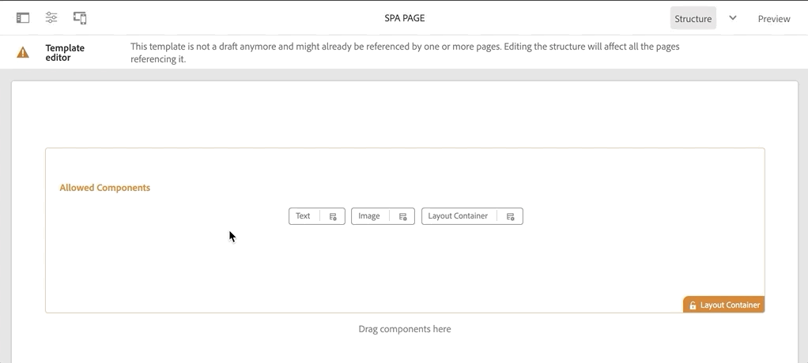

# ナビゲーションとルーティングの追加 {#navigation-routing}

AEM ページと SPA エディター SDK を使用して SPA の複数のビューがサポートされている仕組みについて説明します。Angular ルートを使用して動的ナビゲーションを実装し、既存のヘッダーコンポーネントに追加します。

## 目的

1. SPA エディターを使用する際に利用可能な SPA モデルのルーティングオプションについて説明します。
2.  [Angular ルーティング](https://angular.io/guide/router)を使用して SPA の様々なビュー間を移動する方法を説明します。
3. AEM ページ階層に基づく動的ナビゲーションを実装します。

## 作成する内容

この章では、既存の `Header` コンポーネントにナビゲーションメニューを追加します。 ナビゲーションメニューは AEM のページ階層に基づいて動作し、[ナビゲーションコアコンポーネント](https://experienceleague.adobe.com/docs/experience-manager-core-components/using/components/navigation.html?lang=ja)から提供される JSON モデルを使用します。


## 前提条件

[ローカル開発環境](overview.md#local-dev-environment)の設定に必要なツールと手順を確認します。

### コードの取得

1. このチュートリアルの出発点となるものを Git からダウンロードします。

   ```shell
   $ git clone git@github.com:adobe/aem-guides-wknd-spa.git
   $ cd aem-guides-wknd-spa
   $ git checkout Angular/navigation-routing-start
   ```

2. Maven を使用してコードベースをローカルの AEM インスタンスにデプロイします。

   ```shell
   $ mvn clean install -PautoInstallSinglePackage
   ```

   [AEM 6.x](overview.md#compatibility) を使用する場合は、以下の `classic` プロファイルを追加します。

   ```shell
   $ mvn clean install -PautoInstallSinglePackage -Pclassic
   ```

3. 従来の [WKND リファレンスサイト](https://github.com/adobe/aem-guides-wknd/releases/latest)の完成したパッケージをインストールします。[WKND リファレンスサイト](https://github.com/adobe/aem-guides-wknd/releases/latest)で提供される画像は、WKND SPA で再利用されます。 このパッケージは、[AEM のパッケージマネージャー](http://localhost:4502/crx/packmgr/index.jsp)を使用してインストールできます。

   

いつでも、完成したコードを [GitHub](https://github.com/adobe/aem-guides-wknd-spa/tree/Angular/navigation-routing-solution) で確認したり、ブランチ `Angular/navigation-routing-solution` に切り替えてローカルにチェックアウトしたりできます。

## HeaderComponent の更新の調査 {#inspect-header}

ここまでの章では、`app.component.html` を介して組み込まれる純粋な Angular コンポーネントとして `HeaderComponent` コンポーネントが追加されました。  この章では、 `HeaderComponent` コンポーネントがアプリから削除され、 [テンプレートエディター](https://experienceleague.adobe.com/docs/experience-manager-learn/sites/page-authoring/template-editor-feature-video-use.html?lang=ja)を使用して追加されます。これにより、ユーザーは AEM 内から `HeaderComponent` のナビゲーションメニューを設定できます。

>[!NOTE]
>
> この章を開始するために、コードベースに対して CSS と JavaScript の更新が既にいくつか行われています。 中心概念に的を絞るため、必ずしも&#x200B;**すべての**&#x200B;コード変更について説明しているわけではありません。すべての変更については、[こちら](https://github.com/adobe/aem-guides-wknd-spa/compare/Angular/map-components-solution...Angular/navigation-routing-start)を参照してください。

1. 任意の IDE で、この章の SPA スタータープロジェクトを開きます。
2. `ui.frontend` モジュール下で、ファイル `header.component.ts`（`ui.frontend/src/app/components/header/header.component.ts`）を調べます 。

   コンポーネントを AEM コンポーネント `wknd-spa-angular/components/header` にマッピングできるように、`HeaderEditConfig` と `MapTo` の追加など、いくつかの更新が行われています。

   ```js
   /* header.component.ts */
   ...
   const HeaderEditConfig = {
       ...
   };
   
   @Component({
   selector: 'app-header',
   templateUrl: './header.component.html',
   styleUrls: ['./header.component.scss']
   })
   export class HeaderComponent implements OnInit {
   @Input() items: object[];
       ...
   }
   ...
   MapTo('wknd-spa-angular/components/header')(withRouter(Header), HeaderEditConfig);
   ```

   `items` の `@Input()` 注釈に注意してください。`items` には、AEM から渡されたナビゲーションオブジェクトの配列が含まれます。

3. `ui.apps` モジュールで、AEM `Header` コンポーネントの次のコンポーネント定義を調べます。`ui.apps/src/main/content/jcr_root/apps/wknd-spa-angular/components/header/.content.xml`：

   ```xml
   <?xml version="1.0" encoding="UTF-8"?>
   <jcr:root xmlns:sling="http://sling.apache.org/jcr/sling/1.0" xmlns:cq="http://www.day.com/jcr/cq/1.0"
       xmlns:jcr="http://www.jcp.org/jcr/1.0"
       jcr:primaryType="cq:Component"
       jcr:title="Header"
       sling:resourceSuperType="wknd-spa-angular/components/navigation"
       componentGroup="WKND SPA Angular - Structure"/>
   ```

   AEM `Header` コンポーネントは、`sling:resourceSuperType` プロパティを介して[ナビゲーションコアコンポーネント](https://experienceleague.adobe.com/docs/experience-manager-core-components/using/components/navigation.html?lang=ja)のすべての機能を継承します。

## HeaderComponent を SPA テンプレートに追加する {#add-header-template}

1. ブラウザーを開き、AEMにログインします（[http://localhost:4502/](http://localhost:4502/)）。開始コードベースは、既にデプロイされている必要があります。
2. **[!UICONTROL SPA ページテンプレート]**（[http://localhost:4502/editor.html/conf/wknd-spa-angular/settings/wcm/templates/spa-page-template/structure.html](http://localhost:4502/editor.html/conf/wknd-spa-angular/settings/wcm/templates/spa-page-template/structure.html)）に移動します。
3. 最も外側の&#x200B;**[!UICONTROL ルートレイアウトコンテナ]**&#x200B;を選択し、その&#x200B;**[!UICONTROL ポリシー]**&#x200B;アイコンをクリックします。オーサリングのためにロック解除された&#x200B;**[!UICONTROL レイアウトコンテナ]**&#x200B;を選択&#x200B;**しない**&#x200B;ように注意してください。

   

4. 現在のポリシーをコピーし、**[!UICONTROL SPA 構造]**&#x200B;という名前の新しいポリシーを作成します。

   

   **[!UICONTROL 許可されたコンポーネント]**／**[!UICONTROL 一般]**&#x200B;の下で、**[!UICONTROL レイアウトコンテナ]**&#x200B;コンポーネントを選択します。

   **[!UICONTROL 許可されたコンポーネント]**／**[!UICONTROL WKND SPA ANGULAR - STRUCTURE]**&#x200B;の下で、**[!UICONTROL ヘッダー]**&#x200B;コンポーネントを選択します。

   

   **[!UICONTROL 許可されたコンポーネント]**／**[!UICONTROL WKND SPAANGULAR - コンテンツ]** の下で、**[!UICONTROL 画像]**&#x200B;および&#x200B;**[!UICONTROL テキスト]**&#x200B;コンポーネントを選択します。合計 4 つのコンポーネントを選択する必要があります。

   「**[!UICONTROL 完了]**」をクリックして、変更を保存します。

5. **ページを更新します。**&#x200B;ロック解除された&#x200B;**[!UICONTROL レイアウトコンテナ]**&#x200B;の上に&#x200B;**[!UICONTROL ヘッダー]**&#x200B;コンポーネントを追加します。

   

6. **[!UICONTROL ヘッダー]**&#x200B;コンポーネントを選択して、その&#x200B;**ポリシー**&#x200B;アイコンをクリックして、ポリシーを編集します。

   

7. 「**WKND SPA ヘッダー**」という&#x200B;**[!UICONTROL ポリシータイトル]**&#x200B;を持つポリシーを新規作成します。

   **[!UICONTROL プロパティ]**&#x200B;で次のことを行います。

   * 「**[!UICONTROL ナビゲーションルート]**」を `/content/wknd-spa-angular/us/en` に設定します。
   * 「**[!UICONTROL ルートレベルを除外]**」を **1** に設定します。
   * 「**[!UICONTROL すべての子ページを収集]**」のチェックを外します。
   * 「**[!UICONTROL ナビゲーション構造の深さ]**」を **3** に設定します。

   

   これにより、`/content/wknd-spa-angular/us/en` の 2 レベル下のナビゲーションが収集されます。

8. 変更を保存すると、テンプレートの一部として、入力された `Header` が表示されます。

   

## 子ページの作成

次に、AEM で別のビューとして機能する追加のページを作成します。 また、AEM が提供する JSON モデルの階層構造も調べます。

1. **Sites** コンソール（[http://localhost:4502/sites.html/content/wknd-spa-angular/us/en/home](http://localhost:4502/sites.html/content/wknd-spa-angular/us/en/home)）に移動します。**WKND SPA Angular ホームページ**&#x200B;を選択し、**[!UICONTROL 作成]**／**[!UICONTROL ページ]**&#x200B;をクリックします。

   

2. **[!UICONTROL テンプレート]**&#x200B;の下で **[!UICONTROL SPA ページ]**&#x200B;を選択します。**[!UICONTROL プロパティ]**&#x200B;で、**[!UICONTROL タイトル]**&#x200B;に「**ページ 1**」 と入力し、名前に「**page-1**」と入力します。

   

   「**[!UICONTROL 作成]**」をクリックし、ダイアログのポップアップで「**[!UICONTROL 開く]**」をクリックして、AEM SPA エディターでページを開きます。

3. 新しい&#x200B;**[!UICONTROL テキスト]**&#x200B;コンポーネントをメインの **[!UICONTROL レイアウトコンテナ]**&#x200B;に追加します。コンポーネントを編集し、RTE と **H1** 要素を使用して「**ページ 1**」というテキストを入力します（段落要素を変更するには、フルスクリーンモードにする必要があります）。

   

   画像などのコンテンツを自由に追加できます。

4. AEM Sites コンソールに戻り、上記の手順を繰り返して、**Page 1**&#x200B;の兄弟として「**Page 2**」という名前の 2 つ目のページを作成します。コンテンツを **Page 2** に追加して、容易に識別できるようします。
5. 最後に 3 つ目のページ「**Page 3**」を **Page 2** の&#x200B;**子**&#x200B;として作成します。完了すると、サイト階層は次のようになります。

   

6. 新しいタブで、AEM が提供する JSON モデル API（[http://localhost:4502/content/wknd-spa-angular/us/en.model.json](http://localhost:4502/content/wknd-spa-angular/us/en.model.json)）を開きます。 この JSON コンテンツは、SPAが最初に読み込まれる際にリクエストされます。 外側の構造は次のようになります。

   ```json
   {
   "language": "en",
   "title": "en",
   "templateName": "spa-app-template",
   "designPath": "/libs/settings/wcm/designs/default",
   "cssClassNames": "spa page basicpage",
   ":type": "wknd-spa-angular/components/spa",
   ":items": {},
   ":itemsOrder": [],
   ":hierarchyType": "page",
   ":path": "/content/wknd-spa-angular/us/en",
   ":children": {
       "/content/wknd-spa-angular/us/en/home": {},
       "/content/wknd-spa-angular/us/en/home/page-1": {},
       "/content/wknd-spa-angular/us/en/home/page-2": {},
       "/content/wknd-spa-angular/us/en/home/page-2/page-3": {}
       }
   }
   ```

   `:children` には、作成した各ページのエントリが表示されます。 すべてのページのコンテンツは、この最初の JSON リクエストに含まれます。 ナビゲーションルーティングが実装されると、コンテンツは既にクライアントサイドで使用可能なので、SPA の後続のビューは迅速に読み込まれます。

   最初のページの読み込みが遅くなるため、最初の JSON リクエストでSPAのコンテンツを&#x200B;**すべて**&#x200B;読み込むのは賢明ではありません。次に、ページの階層深度が収集される方法を見ていきましょう。

7. **SPA Root** テンプレート（ [http://localhost:4502/editor.html/conf/wknd-spa-angular/settings/wcm/templates/spa-app-template/structure.html](http://localhost:4502/editor.html/conf/wknd-spa-angular/settings/wcm/templates/spa-app-template/structure.html)）に移動します。

   **[!UICONTROL ページプロパティメニュー]**／**[!UICONTROL ページポリシー]**&#x200B;をクリックします。

   

8. **SPA Root** テンプレートにある「**[!UICONTROL 階層構造]**」タブでは、収集される JSON コンテンツを制御できます。 **[!UICONTROL 構造深度]**&#x200B;では、**root**&#x200B;の下にある子ページのサイト階層内での収集深度が決定されます。また、「**[!UICONTROL 構造パターン]**」フィールドを使用して、正規表現に基づいて追加のページを除外します。

   **[!UICONTROL 構造深度]**&#x200B;を **「2」**&#x200B;に変更します。

   

   「**[!UICONTROL 完了]**」をクリックしてポリシーの変更を保存します。

9. JSON モデル（[http://localhost:4502/content/wknd-spa-angular/us/en.model.json](http://localhost:4502/content/wknd-spa-angular/us/en.model.json)）を再度開きます。

   ```json
   {
   "language": "en",
   "title": "en",
   "templateName": "spa-app-template",
   "designPath": "/libs/settings/wcm/designs/default",
   "cssClassNames": "spa page basicpage",
   ":type": "wknd-spa-angular/components/spa",
   ":items": {},
   ":itemsOrder": [],
   ":hierarchyType": "page",
   ":path": "/content/wknd-spa-angular/us/en",
   ":children": {
       "/content/wknd-spa-angular/us/en/home": {},
       "/content/wknd-spa-angular/us/en/home/page-1": {},
       "/content/wknd-spa-angular/us/en/home/page-2": {}
       }
   }
   ```

   **Page 3** のパス `/content/wknd-spa-angular/us/en/home/page-2/page-3` が最初の JSON モデルから削除されています。

   後で、AEM SPA Editor SDK が追加のコンテンツを動的に読み込む方法を確認します。

## ナビゲーションの実装

次に、新しい `NavigationComponent` でナビゲーションメニューを実装します。コードを `header.component.html` で直接追加できますが、大きなコンポーネントを避ける方が良い方法です。 代わりに、 後で再利用できる可能性がある `NavigationComponent` を実装します。

1. 次の場所の AEM `Header` コンポーネントによって公開された JSON をレビューします。[http://localhost:4502/content/wknd-spa-angular/us/en.model.json](http://localhost:4502/content/wknd-spa-angular/us/en.model.json)

   ```json
   ...
   "header": {
       "items": [
       {
       "level": 0,
       "active": true,
       "path": "/content/wknd-spa-angular/us/en/home",
       "description": null,
       "url": "/content/wknd-spa-angular/us/en/home.html",
       "lastModified": 1589062597083,
       "title": "WKND SPA Angular Home Page",
       "children": [
               {
               "children": [],
               "level": 1,
               "active": false,
               "path": "/content/wknd-spa-angular/us/en/home/page-1",
               "description": null,
               "url": "/content/wknd-spa-angular/us/en/home/page-1.html",
               "lastModified": 1589429385100,
               "title": "Page 1"
               },
               {
               "level": 1,
               "active": true,
               "path": "/content/wknd-spa-angular/us/en/home/page-2",
               "description": null,
               "url": "/content/wknd-spa-angular/us/en/home/page-2.html",
               "lastModified": 1589429603507,
               "title": "Page 2",
               "children": [
                   {
                   "children": [],
                   "level": 2,
                   "active": false,
                   "path": "/content/wknd-spa-angular/us/en/home/page-2/page-3",
                   "description": null,
                   "url": "/content/wknd-spa-angular/us/en/home/page-2/page-3.html",
                   "lastModified": 1589430413831,
                   "title": "Page 3"
                   }
               ],
               }
           ]
           }
       ],
   ":type": "wknd-spa-angular/components/header"
   ```

   AEM ページの階層の本質は、ナビゲーションメニューの入力に使用できる JSON 形式でモデル化されます。先に説明したように、`Header` コンポーネントは[ナビゲーションコアコンポーネント](https://www.aemcomponents.dev/content/core-components-examples/library/core-structure/navigation.html)のすべての機能を継承し、JSON から公開されるコンテンツは自動的に Angular `@Input` の注釈にマッピングされます。

2. 新しいターミナルウィンドウを開き、SPAプロジェクトの `ui.frontend` フォルダーに移動します。Angular CLI ツールを使用して新しい `NavigationComponent` を作成します。

   ```shell
   $ cd ui.frontend
   $ ng generate component components/navigation
   CREATE src/app/components/navigation/navigation.component.scss (0 bytes)
   CREATE src/app/components/navigation/navigation.component.html (25 bytes)
   CREATE src/app/components/navigation/navigation.component.spec.ts (656 bytes)
   CREATE src/app/components/navigation/navigation.component.ts (286 bytes)
   UPDATE src/app/app.module.ts (2032 bytes)
   ```

3. 次に、新しく作成した `components/navigation` ディレクトリで Angular CLI を使用して、`NavigationLink` という名前のクラスを作成します。 

   ```shell
   $ cd src/app/components/navigation/
   $ ng generate class NavigationLink
   CREATE src/app/components/navigation/navigation-link.spec.ts (187 bytes)
   CREATE src/app/components/navigation/navigation-link.ts (32 bytes)
   ```

4. 任意の IDE に戻り、`navigation-link.ts`こちら`/src/app/components/navigation/navigation-link.ts`にあるファイルを開きます。

   

5. `navigation-link.ts` に以下を入力します。

   ```js
   export class NavigationLink {
   
       title: string;
       path: string;
       url: string;
       level: number;
       children: NavigationLink[];
       active: boolean;
   
       constructor(data) {
           this.path = data.path;
           this.title = data.title;
           this.url = data.url;
           this.level = data.level;
           this.active = data.active;
           this.children = data.children.map( item => {
               return new NavigationLink(item);
           });
       }
   }
   ```

   これは、個々のナビゲーションリンクを表す単純なクラスです。 クラスコンストラクターでは、`data` を AEM から渡す JSON オブジェクトにすることが想定されます。ナビゲーション構造を容易に入力できるようにするために、このクラスは `NavigationComponent` と `HeaderComponent` の両方で使用します。

   データ変換は実行されません。このクラスは主に JSON モデルを強く入力するために作成されます。 `this.children` は `NavigationLink[]` のように入力され、コンストラクターよって再帰的に `children` 配列の各項目に、新しい `NavigationLink` オブジェクトが作成されます。先に説明したように、`Header` の JSON モデルは階層になっています。

6. `navigation-link.spec.ts` ファイルを開きます。これは、`NavigationLink` クラス向けのテストファイルです。 以下を使用して更新します。

   ```js
   import { NavigationLink } from './navigation-link';
   
   describe('NavigationLink', () => {
       it('should create an instance', () => {
           const data = {
               children: [],
               level: 1,
               active: false,
               path: '/content/wknd-spa-angular/us/en/home/page-1',
               description: null,
               url: '/content/wknd-spa-angular/us/en/home/page-1.html',
               lastModified: 1589429385100,
               title: 'Page 1'
           };
           expect(new NavigationLink(data)).toBeTruthy();
       });
   });
   ```

   `const data` は、単一のリンクについて以前に調べたのと同じ JSON モデルに従います。これは堅牢な単体テストとは程遠いものですが、`NavigationLink` のコンストラクターをテストするには十分です。

7. `navigation.component.ts` ファイルを開きます。以下を使用して更新します。

   ```js
   import { Component, OnInit, Input } from '@angular/core';
   import { NavigationLink } from './navigation-link';
   
   @Component({
   selector: 'app-navigation',
   templateUrl: './navigation.component.html',
   styleUrls: ['./navigation.component.scss']
   })
   export class NavigationComponent implements OnInit {
   
       @Input() items: object[];
   
       constructor() { }
   
       get navigationLinks(): NavigationLink[] {
   
           if (this.items && this.items.length > 0) {
               return this.items.map(item => {
                   return new NavigationLink(item);
               });
           }
   
           return null;
       }
   
       ngOnInit() {}
   
   }
   ```

   `NavigationComponent` では、AEM の JSON モデルである `items` という名前の `object[]` が想定されます。このクラスは、`NavigationLink` オブジェクトの配列を返す単一のメソッド `get navigationLinks()` を公開します。

8. `navigation.component.html` ファイルを開き、次のようにアップデートします。

   ```html
   <ul *ngIf="navigationLinks && navigationLinks.length > 0" class="navigation__group">
       <ng-container *ngTemplateOutlet="recursiveListTmpl; context:{ links: navigationLinks }"></ng-container>
   </ul>
   ```

   これにより、最初の `<ul>` が生成され、`navigation.component.ts` から `get navigationLinks()` メソッドが呼び出されます。`<ng-container>` は、`recursiveListTmpl` という名前のテンプレートを呼び出すために使用され、`links` という名前の変数として、`navigationLinks` を渡します。

   次に `recursiveListTmpl` を追加します。

   ```html
   <ng-template #recursiveListTmpl let-links="links">
       <li *ngFor="let link of links" class="{{'navigation__item navigation__item--' + link.level}}">
           <a [routerLink]="link.url" class="navigation__item-link" [title]="link.title" [attr.aria-current]="link.active">
               {{link.title}}
           </a>
           <ul *ngIf="link.children && link.children.length > 0">
               <ng-container *ngTemplateOutlet="recursiveListTmpl; context:{ links: link.children }"></ng-container>
           </ul>
       </li>
   </ng-template>
   ```

   ここでは、ナビゲーションリンクの残りのレンダリングが実装されます。 変数 `link` は `NavigationLink` 型であり、そのクラスによって作成されたすべてのメソッドやプロパティが利用可能です。[`[routerLink]`](https://angular.io/api/router/RouterLink) は、通常の `href` 属性の代わりに使用されます。これにより、ページ全体を更新することなく、アプリ内の特定のルートにリンクできます。

   ナビゲーションの再帰部分は、現在の `link` に空でない `children` 配列がある場合、別の `<ul>` を作成することによっても実装されます。

9. `navigation.component.spec.ts` を更新して `RouterTestingModule` のサポートを追加します。

   ```diff
    ...
   + import { RouterTestingModule } from '@angular/router/testing';
    ...
    beforeEach(async(() => {
       TestBed.configureTestingModule({
   +   imports: [ RouterTestingModule ],
       declarations: [ NavigationComponent ]
       })
       .compileComponents();
    }));
    ...
   ```

   `RouterTestingModule` の追加は、コンポーネントが `[routerLink]` を使用しているため必須です。

10. `navigation.component.scss` を更新して、いくつかの基本的なスタイルを `NavigationComponent` に追加します。

   ```scss
   @import "~src/styles/variables";
   
   $link-color: $black;
   $link-hover-color: $white;
   $link-background: $black;
   
   :host-context {
       display: block;
       width: 100%;
   }
   
   .navigation__item {
       list-style: none;
   }
   
   .navigation__item-link {
       color: $link-color;
       font-size: $font-size-large;
       text-transform: uppercase;
       padding: $gutter-padding;
       display: flex;
       border-bottom: 1px solid $gray;
   
       &:hover {
           background: $link-background;
           color: $link-hover-color;
       }
   
   }
   ```

## ヘッダーコンポーネントのアップデート

`NavigationComponent` が実装されたので、これを参照するように `HeaderComponent` を更新する必要があります。

1. ターミナルを開き、SPA プロジェクト内の `ui.frontend` フォルダーに移動します。**webpack 開発サーバー**&#x200B;を開始します。

   ```shell
   $ npm start
   ```

2. ブラウザータブを開き、[http://localhost:4200/](http://localhost:4200/) に移動します。

   **webpack 開発サーバー** は、AEM のローカル インスタンス（`ui.frontend/proxy.conf.json`）から JSON モデルをプロキシするように設定する必要があります。これにより、チュートリアルの前の段階に AEM 内で作成されたコンテンツに対して、直接コーディングすることができます。

   

   `HeaderComponent` は現在、メニュー切り替え機能を実装しています。 次に、ナビゲーションコンポーネントを追加します。

3. 選択した IDE に戻り、ファイル `header.component.ts` を `ui.frontend/src/app/components/header/header.component.ts` で開きます。
4. `setHomePage()` メソッドをアップデートして、ハードコーディングされた文字列を削除し、AEM コンポーネントによって渡された動的な prop を使用します。

   ```js
   /* header.component.ts */
   import { NavigationLink } from '../navigation/navigation-link';
   ...
    setHomePage() {
       if (this.hasNavigation) {
           const rootNavigationLink: NavigationLink = new NavigationLink(this.items[0]);
           this.isHome = rootNavigationLink.path === this.route.snapshot.data.path;
           this.homePageUrl = rootNavigationLink.url;
       }
   }
   ...
   ```

   AEM から渡されたナビゲーション JSON モデルのルートである `items[0]` に基づいて、`NavigationLink` の新しいインスタンスが作成されます。`this.route.snapshot.data.path` は、現在の Angular ルートのパスを返します。この値は、現在のルートが&#x200B;**ホームページ**&#x200B;であるかどうかを判断するために使用されます。`this.homePageUrl` を使用して、**ロゴ**&#x200B;上のアンカーリンクを入力します。

5. `header.component.html` を開き、ナビゲーションの静的プレースホルダーを、新規作成された `NavigationComponent` への参照に置き換えます。

   ```diff
       <div class="header-navigation">
           <div class="navigation">
   -            Navigation Placeholder
   +           <app-navigation [items]="items"></app-navigation>
           </div>
       </div>
   ```

   `[items]=items` 属性は `@Input() items` を、`HeaderComponent` から `NavigationComponent` に渡し、そこでナビゲーションを構築します。

6. `header.component.spec.ts` を開き、`NavigationComponent` の宣言を追加します。

   ```diff
       /* header.component.spect.ts */
   +   import { NavigationComponent } from '../navigation/navigation.component';
   
       describe('HeaderComponent', () => {
       let component: HeaderComponent;
       let fixture: ComponentFixture<HeaderComponent>;
   
       beforeEach(async(() => {
           TestBed.configureTestingModule({
           imports: [ RouterTestingModule ],
   +       declarations: [ HeaderComponent, NavigationComponent ]
           })
           .compileComponents();
       }));
   ```

   `NavigationComponent` は `HeaderComponent` の一部として使用されるようになったため、テストベッドの一部として宣言する必要があります。

7. 開いているファイルへの変更を保存し、**webpack 開発サーバー**： [http://localhost:4200/](http://localhost:4200/) に戻ります

   

   メニューの切替スイッチをクリックしてナビゲーションを開くと、入力されたナビゲーションリンクが表示されます。 SPA の様々なビューに移動できるはずです。

## SPA ルーティングについて

ナビゲーションが実装されたので、AEM のルーティングを検査します。

1. IDE で、`ui.frontend/src/app` に置かれたファイル `app-routing.module.ts` を開きます。

   ```js
   /* app-routing.module.ts */
   import { AemPageDataResolver, AemPageRouteReuseStrategy } from '@adobe/cq-angular-editable-components';
   import { NgModule } from '@angular/core';
   import { RouteReuseStrategy, RouterModule, Routes, UrlMatchResult, UrlSegment } from '@angular/router';
   import { PageComponent } from './components/page/page.component';
   
   export function AemPageMatcher(url: UrlSegment[]): UrlMatchResult {
       if (url.length) {
           return {
               consumed: url,
               posParams: {
                   path: url[url.length - 1]
               }
           };
       }
   }
   
   const routes: Routes = [
       {
           matcher: AemPageMatcher,
           component: PageComponent,
           resolve: {
               path: AemPageDataResolver
           }
       }
   ];
   @NgModule({
       imports: [RouterModule.forRoot(routes)],
       exports: [RouterModule],
       providers: [
           AemPageDataResolver,
           {
           provide: RouteReuseStrategy,
           useClass: AemPageRouteReuseStrategy
           }
       ]
   })
   export class AppRoutingModule {}
   ```

   `routes: Routes = [];` 配列は、Angular コンポーネントマッピングへのルートまたはナビゲーションパスを定義します。

   `AemPageMatcher` はカスタム Angular ルーター [UrlMatcher](https://angular.io/api/router/UrlMatcher) であり、この Angular アプリケーションの一部である AEM にあるページに「似ている」ものすべてに一致します。

   `PageComponent` は AEM にあるページを表す Angular コンポーネントであり、一致したルートをレンダリングするために使用されます。この `PageComponent` は、チュートリアルの後半でレビューします。

   AEM SPA Editor JS SDK が提供する`AemPageDataResolver` は、拡張子 .html を含む AEM のパスであるルート URL を、拡張子を除いたページパスである AEM のリソースパスに変換するためのカスタム [Angular Router Resolver](https://angular.io/api/router/Resolve) です。

   例えば `AemPageDataResolver` は、`content/wknd-spa-angular/us/en/home.html` のルートの URL を `/content/wknd-spa-angular/us/en/home` のパスに変換します。これは、JSON モデル API のパスに基づいてページのコンテンツを解決するために使用されます。

   AEM SPA Editor JS SDK が提供する `AemPageRouteReuseStrategy` は、ルート間での `PageComponent` の再利用を防ぐカスタム [RouteReuseStrategy](https://angular.io/api/router/RouteReuseStrategy) です。再利用を防がないと、ページ「B」に移動すると、ページ「A」のコンテンツが表示される場合があります。

2. `ui.frontend/src/app/components/page/` の `page.component.ts` ファイルを開きます。

   ```js
   ...
   export class PageComponent {
       items;
       itemsOrder;
       path;
   
       constructor(
           private route: ActivatedRoute,
           private modelManagerService: ModelManagerService
       ) {
           this.modelManagerService
           .getData({ path: this.route.snapshot.data.path })
           .then(data => {
               this.path = data[Constants.PATH_PROP];
               this.items = data[Constants.ITEMS_PROP];
               this.itemsOrder = data[Constants.ITEMS_ORDER_PROP];
           });
       }
   }
   ```

   `PageComponent` は、AEM から取得した JSON を処理するために必要であり、ルートをレンダリングするための Angular コンポーネントとして使用されます。

   Angular Router モジュールが提供する `ActivatedRoute` には、この Angular ページコンポーネントインスタンスに読み込む必要がある AEM ページの JSON コンテンツを示す状態が含まれています。

   `ModelManagerService` は、ルートに基づいて JSON データを取得し、データをクラス変数 `path`、`items`、`itemsOrder` にマッピングします。これらは、その後、[AEMPageComponent](https://www.npmjs.com/package/@adobe/cq-angular-editable-components#aempagecomponent.md) に渡されます

3. `ui.frontend/src/app/components/page/` でファイル `page.component.html` を開きます

   ```html
   <aem-page 
       class="structure-page" 
       [attr.data-cq-page-path]="path" 
       [cqPath]="path" 
       [cqItems]="items" 
       [cqItemsOrder]="itemsOrder">
   </aem-page>
   ```

   `aem-page` は [AEMPageComponent](https://www.npmjs.com/package/@adobe/cq-angular-editable-components#aempagecomponent.md) を含みます。変数 `path`、`items`、`itemsOrder` が `AEMPageComponent` に渡されます。`AemPageComponent` は SPA Editor JavaScript SDK を介して提供され、次にこのデータを繰り返し処理し、[コンポーネントのマッピングチュートリアル](./map-components.md)見られるように、JSON データに基づいて Angular コンポーネントを動的にインスタンス化します。

   `PageComponent` は、実際には `AEMPageComponent` のプロキシにすぎません。JSON モデルを Angular コンポーネントに正しくマッピングする重要な作業の大部分を実行するのは `AEMPageComponent` です。

## AEM で SPA ルーティングを調べる

1. ターミナルを開いて、**webpack 開発サーバー**&#x200B;を停止します（開始している場合） 。プロジェクトのルートに移動し、Maven のスキルを使用して AEMにプロジェクトをデプロイします。

   ```shell
   $ cd aem-guides-wknd-spa
   $ mvn clean install -PautoInstallSinglePackage
   ```

   >[!CAUTION]
   >
   > Angular プロジェクトで、非常に厳密な lint ルールが有効になっています。Maven ビルドに失敗した場合は、エラーを確認し、**リストされたファイルで lint エラーを探します**。lint で見つかった問題を修正し、Maven コマンドを再実行します。

2. AEM の SPA ホームページ（[http://localhost:4502/content/wknd-spa-angular/us/en/home.html](http://localhost:4502/content/wknd-spa-angular/us/en/home.html)）に移動し、ブラウザーのデベロッパーツールを開きます。以下のスクリーンショットは、Google Chrome ブラウザーからキャプチャしたものです。

   ページを更新すると、`/content/wknd-spa-angular/us/en.model.json` への XHR リクエストが表示されます。これは SPAのルートです。このチュートリアルで前述した SPA ルートテンプレートの階層の深さ設定に基づいて、3 つの子ページのみが含まれます。 これには、**Page 3** は含まれません。

   

3. デベロッパーツールを開き、**Page 3** に移動します。

   

   `/content/wknd-spa-angular/us/en/home/page-2/page-3.model.json` に対する新しい XHR リクエストが行われることを確認します。

   

   AEM Model Manager は、**Page 3** JSON コンテンツは使用できず、追加の XHR リクエストを自動的にトリガーします。

4. 様々なナビゲーションリンクを使用して SPA 内を移動し続けます。 追加の XHR リクエストが行われず、完全なページ更新が行われないことを確認します。これにより、エンドユーザーにとって SPA の処理が高速になり、AEM に返される不要なリクエストが減ります。

   

5. [http://localhost:4502/content/wknd-spa-angular/us/en/home/page-2.html](http://localhost:4502/content/wknd-spa-angular/us/en/home/page-2.html) に直接移動して、ディープリンクを試してみます。ブラウザーの「戻る」ボタンが引き続き機能することを確認します。

## おめでとうございます。 {#congratulations}

これで、SPA Editor SDK で AEM ページにマッピングすることで、SPA の複数のビューをサポートする方法を学びました。 動的ナビゲーションは Angular ルーティングを使用して実装され、`Header` コンポーネントに追加されています。

完成したコードを [GitHub](https://github.com/adobe/aem-guides-wknd-spa/tree/Angular/navigation-routing-solution) で確認する、または、ブランチ `Angular/navigation-routing-solution` に切り替えて、コードをローカルでチェックアウトします。

### 次の手順 {#next-steps}

[カスタムコンポーネントの作成](custom-component.md) - AEM SPA エディターで使用するカスタムコンポーネントを作成する方法を説明します。 オーサーダイアログと Sling モデルを開発して JSON モデルを拡張し、カスタムコンポーネントを設定する方法について説明します。
