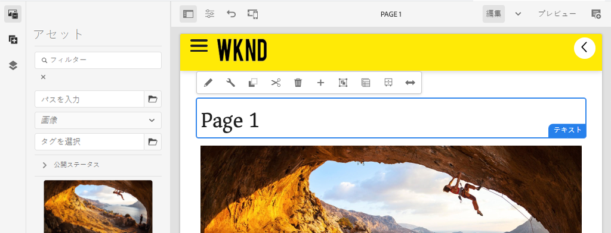

# ナビゲーションとルーティングを追加 {#navigation-routing}

AEMページとSPA Editor SDK を使用して、SPAの複数のビューがサポートされる仕組みについて説明します。 動的ナビゲーションは、Angularルートを使用して実装され、既存のヘッダーコンポーネントに追加されます。

## 目的

1. SPA Editor を使用する場合に使用できるSPAモデルのルーティングオプションについて説明します。
2. 使用方法を学ぶ [Angularルーティング](https://angular.io/guide/router) をクリックして、SPAの様々なビュー間を移動します。
3. AEMページ階層によって駆動される動的ナビゲーションを実装します。

## 作成する内容

この章では、既存の `Header` コンポーネント。 ナビゲーションメニューはAEMのページ階層によって駆動され、 [Navigation コアコンポーネント](https://experienceleague.adobe.com/docs/experience-manager-core-components/using/components/navigation.html).


## 前提条件

設定に必要なツールと手順を確認します。 [ローカル開発環境](overview.md#local-dev-environment).

### コードの取得

1. このチュートリアルの開始点を Git からダウンロードします。

   ```shell
   $ git clone git@github.com:adobe/aem-guides-wknd-spa.git
   $ cd aem-guides-wknd-spa
   $ git checkout Angular/navigation-routing-start
   ```

2. Maven を使用して、ローカルのAEMインスタンスにコードベースをデプロイします。

   ```shell
   $ mvn clean install -PautoInstallSinglePackage
   ```

   を使用する場合 [AEM 6.x](overview.md#compatibility) 追加 `classic` プロファイル：

   ```shell
   $ mvn clean install -PautoInstallSinglePackage -Pclassic
   ```

3. 従来の [WKND リファレンスサイト](https://github.com/adobe/aem-guides-wknd/releases/latest). が提供する画像 [WKND リファレンスサイト](https://github.com/adobe/aem-guides-wknd/releases/latest) は、WKND SPAで再利用されます。 パッケージは、 [AEM Package Manager](http://localhost:4502/crx/packmgr/index.jsp).

   

完成したコードは、 [GitHub](https://github.com/adobe/aem-guides-wknd-spa/tree/Angular/navigation-routing-solution) または、ブランチに切り替えて、コードをローカルでチェックアウトします。 `Angular/navigation-routing-solution`.

## Inspect HeaderComponent の更新 {#inspect-header}

以前の章では、 `HeaderComponent` を介して含まれる純粋なAngularコンポーネントとして追加されました `app.component.html`. この章では、 `HeaderComponent` コンポーネントがアプリから削除され、 [テンプレートエディター](https://experienceleague.adobe.com/docs/experience-manager-learn/sites/page-authoring/template-editor-feature-video-use.html?lang=ja). これにより、ユーザーは、 `HeaderComponent` AEM内から

>[!NOTE]
>
> この章を開始するために、コードベースに対して、いくつかの CSS および JavaScript が既に更新されています。 ではなく、中心概念に焦点を当てる **すべて** コードの変更について説明します。 すべての変更を表示できます [ここ](https://github.com/adobe/aem-guides-wknd-spa/compare/Angular/map-components-solution...Angular/navigation-routing-start).

1. 任意の IDE で、この章のSPAスタータープロジェクトを開きます。
2. の `ui.frontend` モジュールはファイルを検査します。 `header.component.ts` 時刻： `ui.frontend/src/app/components/header/header.component.ts`.

   追加された `HeaderEditConfig` および `MapTo` コンポーネントをAEMコンポーネントにマッピングするには `wknd-spa-angular/components/header`.

   ```js
   /* header.component.ts */
   ...
   const HeaderEditConfig = {
       ...
   };
   
   @Component({
   selector: 'app-header',
   templateUrl: './header.component.html',
   styleUrls: ['./header.component.scss']
   })
   export class HeaderComponent implements OnInit {
   @Input() items: object[];
       ...
   }
   ...
   MapTo('wknd-spa-angular/components/header')(withRouter(Header), HeaderEditConfig);
   ```

   次の点に注意してください。 `@Input()` ～に対する注釈 `items`. `items` には、AEMから渡されたナビゲーションオブジェクトの配列が含まれます。

3. 内 `ui.apps` モジュールは、AEMのコンポーネント定義を検査します `Header` コンポーネント： `ui.apps/src/main/content/jcr_root/apps/wknd-spa-angular/components/header/.content.xml`:

   ```xml
   <?xml version="1.0" encoding="UTF-8"?>
   <jcr:root xmlns:sling="http://sling.apache.org/jcr/sling/1.0" xmlns:cq="http://www.day.com/jcr/cq/1.0"
       xmlns:jcr="http://www.jcp.org/jcr/1.0"
       jcr:primaryType="cq:Component"
       jcr:title="Header"
       sling:resourceSuperType="wknd-spa-angular/components/navigation"
       componentGroup="WKND SPA Angular - Structure"/>
   ```

   AEM `Header` コンポーネントは、 [Navigation コアコンポーネント](https://experienceleague.adobe.com/docs/experience-manager-core-components/using/components/navigation.html) 経由 `sling:resourceSuperType` プロパティ。

## HeaderComponent をSPAテンプレートに追加する {#add-header-template}

1. ブラウザーを開き、AEMにログインします。 [http://localhost:4502/](http://localhost:4502/). 開始コードベースは、既にデプロイされている必要があります。
2. 次に移動： **[!UICONTROL SPA Page Template]**: [http://localhost:4502/editor.html/conf/wknd-spa-angular/settings/wcm/templates/spa-page-template/structure.html](http://localhost:4502/editor.html/conf/wknd-spa-angular/settings/wcm/templates/spa-page-template/structure.html).
3. 最外側を選択 **[!UICONTROL ルートレイアウトコンテナ]** をクリックします。 **[!UICONTROL ポリシー]** アイコン 注意 **not** をクリックし、 **[!UICONTROL レイアウトコンテナ]** オーサリング用にロック解除されました。

   

4. 現在のポリシーをコピーし、という名前の新しいポリシーを作成します。 **[!UICONTROL SPA構造]**:

   

   の下 **[!UICONTROL 許可されたコンポーネント]** > **[!UICONTROL 一般]** /を選択します。 **[!UICONTROL レイアウトコンテナ]** コンポーネント。

   の下 **[!UICONTROL 許可されたコンポーネント]** > **[!UICONTROL WKND SPAANGULAR — 構造]** /を選択します。 **[!UICONTROL ヘッダー]** コンポーネント：

   

   の下 **[!UICONTROL 許可されたコンポーネント]** > **[!UICONTROL WKND SPAANGULAR — コンテンツ]** /を選択します。 **[!UICONTROL 画像]** および **[!UICONTROL テキスト]** コンポーネント。 合計 4 つのコンポーネントを選択する必要があります。

   「**[!UICONTROL 完了]**」をクリックして、変更を保存します。

5. **ページを更新します。**&#x200B;を **[!UICONTROL ヘッダー]** ロック解除されたコンポーネントの上の **[!UICONTROL レイアウトコンテナ]**:

   

6. を選択します。 **[!UICONTROL ヘッダー]** コンポーネントとその **ポリシー** アイコンをクリックして、ポリシーを編集します。

   

7. を使用して新しいポリシーを作成 **[!UICONTROL ポリシーのタイトル]** / **&quot;WKND SPA Header&quot;**.

   以下 **[!UICONTROL プロパティ]**:

   * を **[!UICONTROL ナビゲーションルート]** から `/content/wknd-spa-angular/us/en`.
   * を **[!UICONTROL ルートレベルを除外]** から **1**.
   * オフ **[!UICONTROL すべての子ページを収集]**.
   * を **[!UICONTROL ナビゲーション構造の深さ]** から **3**.

   

   これにより、の 2 レベル下のナビゲーションが収集されます。 `/content/wknd-spa-angular/us/en`.

8. 変更を保存すると、 `Header` テンプレートの一部として：

   

## 子ページの作成

次に、AEMで別のビューとして機能する追加のページを作成します。 また、AEMが提供する JSON モデルの階層構造も調べます。

1. 次に移動： **サイト** コンソール： [http://localhost:4502/sites.html/content/wknd-spa-angular/us/en/home](http://localhost:4502/sites.html/content/wknd-spa-angular/us/en/home). を選択します。 **WKND SPAAngularホームページ** をクリックし、 **[!UICONTROL 作成]** > **[!UICONTROL ページ]**:

   

2. の下 **[!UICONTROL テンプレート]** 選択 **[!UICONTROL SPA Page]**. の下 **[!UICONTROL プロパティ]** 入力 **&quot;1 ページ目&quot;** の **[!UICONTROL タイトル]** および **&quot;page-1&quot;** 名前として。

   

   クリック **[!UICONTROL 作成]** ダイアログのポップアップで、 **[!UICONTROL 開く]** をクリックして、AEM SPA Editor でページを開きます。

3. 新しい **[!UICONTROL テキスト]** コンポーネントをメインに **[!UICONTROL レイアウトコンテナ]**. コンポーネントを編集し、次のテキストを入力します。 **&quot;1 ページ目&quot;** RTE と **H1** 要素（段落要素を変更するには、フルスクリーンモードに入る必要があります）

   

   画像などのコンテンツを自由に追加できます。

4. AEM Sitesコンソールに戻り、上記の手順を繰り返して、という名前の 2 番目のページを作成します。 **&quot;Page 2&quot;** 兄弟として **1 ページ目**. コンテンツの追加先 **2 ページ目** その結果、容易に識別できるようになります。
5. 最後に、3 番目のページを作成します。 **&quot;3 ページ&quot;** しかし **子** / **2 ページ目**. 完了すると、サイト階層は次のようになります。

   

6. 新しいタブで、AEMが提供する JSON モデル API を開きます。 [http://localhost:4502/content/wknd-spa-angular/us/en.model.json](http://localhost:4502/content/wknd-spa-angular/us/en.model.json). この JSON コンテンツは、SPAが最初に読み込まれる際にリクエストされます。 外側の構造は次のようになります。

   ```json
   {
   "language": "en",
   "title": "en",
   "templateName": "spa-app-template",
   "designPath": "/libs/settings/wcm/designs/default",
   "cssClassNames": "spa page basicpage",
   ":type": "wknd-spa-angular/components/spa",
   ":items": {},
   ":itemsOrder": [],
   ":hierarchyType": "page",
   ":path": "/content/wknd-spa-angular/us/en",
   ":children": {
       "/content/wknd-spa-angular/us/en/home": {},
       "/content/wknd-spa-angular/us/en/home/page-1": {},
       "/content/wknd-spa-angular/us/en/home/page-2": {},
       "/content/wknd-spa-angular/us/en/home/page-2/page-3": {}
       }
   }
   ```

   の下 `:children` 作成した各ページのエントリが表示されます。 すべてのページのコンテンツは、この最初の JSON リクエストに含まれます。 ナビゲーションルーティングが実装されると、コンテンツは既にクライアント側で使用可能になるので、SPAの後続のビューは迅速に読み込まれます。

   読み込むのは賢明ではない **すべて** SPAのコンテンツを最初の JSON リクエストで取得すると、最初のページの読み込みが遅くなります。 次に、ページの階層の深さが収集される方法を見てみましょう。

7. 次に移動： **SPA Root** テンプレートの場所： [http://localhost:4502/editor.html/conf/wknd-spa-angular/settings/wcm/templates/spa-app-template/structure.html](http://localhost:4502/editor.html/conf/wknd-spa-angular/settings/wcm/templates/spa-app-template/structure.html).

   次をクリック： **[!UICONTROL ページプロパティメニュー]** > **[!UICONTROL ページポリシー]**:

   

8. この **SPA Root** テンプレートに追加の **[!UICONTROL 階層構造]** タブをクリックして、収集される JSON コンテンツを制御します。 この **[!UICONTROL 構造の深さ]** は、サイト階層内での子ページの収集レベルを **root**. また、 **[!UICONTROL 構造パターン]** フィールドを使用して、正規表現に基づいて追加のページを除外します。

   を更新します。 **[!UICONTROL 構造の深さ]** から **&quot;2&quot;**:

   

   クリック **[!UICONTROL 完了]** をクリックして、ポリシーに対する変更を保存します。

9. JSON モデルを再度開く [http://localhost:4502/content/wknd-spa-angular/us/en.model.json](http://localhost:4502/content/wknd-spa-angular/us/en.model.json).

   ```json
   {
   "language": "en",
   "title": "en",
   "templateName": "spa-app-template",
   "designPath": "/libs/settings/wcm/designs/default",
   "cssClassNames": "spa page basicpage",
   ":type": "wknd-spa-angular/components/spa",
   ":items": {},
   ":itemsOrder": [],
   ":hierarchyType": "page",
   ":path": "/content/wknd-spa-angular/us/en",
   ":children": {
       "/content/wknd-spa-angular/us/en/home": {},
       "/content/wknd-spa-angular/us/en/home/page-1": {},
       "/content/wknd-spa-angular/us/en/home/page-2": {}
       }
   }
   ```

   この **3 ページ目** パスが削除されました： `/content/wknd-spa-angular/us/en/home/page-2/page-3` を最初の JSON モデルから取得します。

   後で、AEM SPA Editor SDK が追加のコンテンツを動的に読み込む方法を確認します。

## ナビゲーションの実装

次に、新しい `NavigationComponent`. コードを `header.component.html` ただし、大きなコンポーネントを避ける方がよい方法です。 代わりに、 `NavigationComponent` 後で再利用できる可能性があります。

1. AEMによって公開された JSON の確認 `Header` コンポーネント [http://localhost:4502/content/wknd-spa-angular/us/en.model.json](http://localhost:4502/content/wknd-spa-angular/us/en.model.json):

   ```json
   ...
   "header": {
       "items": [
       {
       "level": 0,
       "active": true,
       "path": "/content/wknd-spa-angular/us/en/home",
       "description": null,
       "url": "/content/wknd-spa-angular/us/en/home.html",
       "lastModified": 1589062597083,
       "title": "WKND SPA Angular Home Page",
       "children": [
               {
               "children": [],
               "level": 1,
               "active": false,
               "path": "/content/wknd-spa-angular/us/en/home/page-1",
               "description": null,
               "url": "/content/wknd-spa-angular/us/en/home/page-1.html",
               "lastModified": 1589429385100,
               "title": "Page 1"
               },
               {
               "level": 1,
               "active": true,
               "path": "/content/wknd-spa-angular/us/en/home/page-2",
               "description": null,
               "url": "/content/wknd-spa-angular/us/en/home/page-2.html",
               "lastModified": 1589429603507,
               "title": "Page 2",
               "children": [
                   {
                   "children": [],
                   "level": 2,
                   "active": false,
                   "path": "/content/wknd-spa-angular/us/en/home/page-2/page-3",
                   "description": null,
                   "url": "/content/wknd-spa-angular/us/en/home/page-2/page-3.html",
                   "lastModified": 1589430413831,
                   "title": "Page 3"
                   }
               ],
               }
           ]
           }
       ],
   ":type": "wknd-spa-angular/components/header"
   ```

   AEMページの階層性は、ナビゲーションメニューの入力に使用できる JSON 形式でモデル化されます。 以下を思い出してください。 `Header` コンポーネントは、 [Navigation コアコンポーネント](https://www.aemcomponents.dev/content/core-components-examples/library/core-structure/navigation.html) と、JSON を通じて公開されるコンテンツは、自動的にAngular `@Input` 注釈。

2. 新しいターミナルウィンドウを開き、 `ui.frontend` SPAプロジェクトのフォルダー。 新しい `NavigationComponent` angularCLI ツールを使用：

   ```shell
   $ cd ui.frontend
   $ ng generate component components/navigation
   CREATE src/app/components/navigation/navigation.component.scss (0 bytes)
   CREATE src/app/components/navigation/navigation.component.html (25 bytes)
   CREATE src/app/components/navigation/navigation.component.spec.ts (656 bytes)
   CREATE src/app/components/navigation/navigation.component.ts (286 bytes)
   UPDATE src/app/app.module.ts (2032 bytes)
   ```

3. 次に、という名前のクラスを作成します。 `NavigationLink` 新しく作成したAngularの CLI を使用 `components/navigation` ディレクトリ：

   ```shell
   $ cd src/app/components/navigation/
   $ ng generate class NavigationLink
   CREATE src/app/components/navigation/navigation-link.spec.ts (187 bytes)
   CREATE src/app/components/navigation/navigation-link.ts (32 bytes)
   ```

4. 任意の IDE に戻り、次の場所にあるファイルを開きます。 `navigation-link.ts` 時刻 `/src/app/components/navigation/navigation-link.ts`.

   

5. `navigation-link.ts` に以下を入力します。

   ```js
   export class NavigationLink {
   
       title: string;
       path: string;
       url: string;
       level: number;
       children: NavigationLink[];
       active: boolean;
   
       constructor(data) {
           this.path = data.path;
           this.title = data.title;
           this.url = data.url;
           this.level = data.level;
           this.active = data.active;
           this.children = data.children.map( item => {
               return new NavigationLink(item);
           });
       }
   }
   ```

   これは、個々のナビゲーションリンクを表す単純なクラスです。 クラスコンストラクタでは、 `data` をAEMから渡す JSON オブジェクトにする。 このクラスは、 `NavigationComponent` および `HeaderComponent` ナビゲーション構造を容易に設定する。

   データ変換は実行されません。このクラスは主に JSON モデルを強く入力するために作成されます。 次の点に注意してください。 `this.children` は次のように入力されます。 `NavigationLink[]` コンストラクタが再帰的に新しい `NavigationLink` オブジェクトを選択します。 `children` 配列。 の JSON モデルを思い出してください `Header` は階層的です。

6. `navigation-link.spec.ts` ファイルを開きます。これは、 `NavigationLink` クラス。 次のように更新します。

   ```js
   import { NavigationLink } from './navigation-link';
   
   describe('NavigationLink', () => {
       it('should create an instance', () => {
           const data = {
               children: [],
               level: 1,
               active: false,
               path: '/content/wknd-spa-angular/us/en/home/page-1',
               description: null,
               url: '/content/wknd-spa-angular/us/en/home/page-1.html',
               lastModified: 1589429385100,
               title: 'Page 1'
           };
           expect(new NavigationLink(data)).toBeTruthy();
       });
   });
   ```

   次の点に注意してください。 `const data` は、前に検査した単一のリンクに関する同じ JSON モデルに従います。 これは、堅牢な単体テストとは程遠いものですが、 `NavigationLink`.

7. `navigation.component.ts` ファイルを開きます。次のように更新します。

   ```js
   import { Component, OnInit, Input } from '@angular/core';
   import { NavigationLink } from './navigation-link';
   
   @Component({
   selector: 'app-navigation',
   templateUrl: './navigation.component.html',
   styleUrls: ['./navigation.component.scss']
   })
   export class NavigationComponent implements OnInit {
   
       @Input() items: object[];
   
       constructor() { }
   
       get navigationLinks(): NavigationLink[] {
   
           if (this.items && this.items.length > 0) {
               return this.items.map(item => {
                   return new NavigationLink(item);
               });
           }
   
           return null;
       }
   
       ngOnInit() {}
   
   }
   ```

   `NavigationComponent` 期待する `object[]` 名前付き `items` AEMの JSON モデルです。 このクラスは、単一のメソッドを公開します `get navigationLinks()` は、 `NavigationLink` オブジェクト。

8. ファイルを開きます。 `navigation.component.html` 次のように更新します。

   ```html
   <ul *ngIf="navigationLinks && navigationLinks.length > 0" class="navigation__group">
       <ng-container *ngTemplateOutlet="recursiveListTmpl; context:{ links: navigationLinks }"></ng-container>
   </ul>
   ```

   これにより、 `<ul>` および `get navigationLinks()` メソッド `navigation.component.ts`. An `<ng-container>` は、 `recursiveListTmpl` そしてそれを渡す `navigationLinks` という名前の変数 `links`.

   を `recursiveListTmpl` 次：

   ```html
   <ng-template #recursiveListTmpl let-links="links">
       <li *ngFor="let link of links" class="{{'navigation__item navigation__item--' + link.level}}">
           <a [routerLink]="link.url" class="navigation__item-link" [title]="link.title" [attr.aria-current]="link.active">
               {{link.title}}
           </a>
           <ul *ngIf="link.children && link.children.length > 0">
               <ng-container *ngTemplateOutlet="recursiveListTmpl; context:{ links: link.children }"></ng-container>
           </ul>
       </li>
   </ng-template>
   ```

   ここでは、ナビゲーションリンクの残りのレンダリングが実装されます。 変数 `link` タイプが `NavigationLink` と、そのクラスで作成されたすべてのメソッド/プロパティを使用できます。 [`[routerLink]`](https://angular.io/api/router/RouterLink) は、通常の `href` 属性。 これにより、完全にページを更新することなく、アプリ内の特定のルートにリンクできます。

   ナビゲーションの再帰的な部分は、別の `<ul>` 現在の `link` には、空でない `children` 配列。

9. 更新 `navigation.component.spec.ts` 支援を追加する `RouterTestingModule`:

   ```diff
    ...
   + import { RouterTestingModule } from '@angular/router/testing';
    ...
    beforeEach(async(() => {
       TestBed.configureTestingModule({
   +   imports: [ RouterTestingModule ],
       declarations: [ NavigationComponent ]
       })
       .compileComponents();
    }));
    ...
   ```

   の追加 `RouterTestingModule` は必須です。コンポーネントが `[routerLink]`.

10. 更新 `navigation.component.scss` 基本スタイルを `NavigationComponent`:

   ```scss
   @import "~src/styles/variables";
   
   $link-color: $black;
   $link-hover-color: $white;
   $link-background: $black;
   
   :host-context {
       display: block;
       width: 100%;
   }
   
   .navigation__item {
       list-style: none;
   }
   
   .navigation__item-link {
       color: $link-color;
       font-size: $font-size-large;
       text-transform: uppercase;
       padding: $gutter-padding;
       display: flex;
       border-bottom: 1px solid $gray;
   
       &:hover {
           background: $link-background;
           color: $link-hover-color;
       }
   
   }
   ```

## ヘッダーコンポーネントの更新

これで、 `NavigationComponent` が実装されている場合、 `HeaderComponent` を参照するように更新する必要があります。

1. ターミナルを開き、 `ui.frontend` フォルダーをSPAプロジェクト内に追加します。 を開始します。 **webpack dev server**:

   ```shell
   $ npm start
   ```

2. ブラウザータブを開き、に移動します。 [http://localhost:4200/](http://localhost:4200/).

   この **webpack dev server** AEMのローカルインスタンス (`ui.frontend/proxy.conf.json`) をクリックします。 これにより、チュートリアルの前の段階で、AEMで作成されたコンテンツに対して直接コードを作成できます。

   

   この `HeaderComponent` は、現在、メニュー切り替え機能を実装しています。 次に、ナビゲーションコンポーネントを追加します。

3. 選択した IDE に戻り、ファイルを開きます。 `header.component.ts` 時刻 `ui.frontend/src/app/components/header/header.component.ts`.
4. を更新します。 `setHomePage()` メソッドを使用して、ハードコードされた String を削除し、AEMコンポーネントによって渡された動的 prop を使用します。

   ```js
   /* header.component.ts */
   import { NavigationLink } from '../navigation/navigation-link';
   ...
    setHomePage() {
       if (this.hasNavigation) {
           const rootNavigationLink: NavigationLink = new NavigationLink(this.items[0]);
           this.isHome = rootNavigationLink.path === this.route.snapshot.data.path;
           this.homePageUrl = rootNavigationLink.url;
       }
   }
   ...
   ```

   の新しいインスタンス `NavigationLink` 次を基に作成： `items[0]`:AEMから渡されたナビゲーション JSON モデルのルート。 `this.route.snapshot.data.path` 現在のパスルートのAngularを返します。 この値は、現在のルートが **ホームページ**. `this.homePageUrl` を使用して、 **ロゴ**.

5. 開く `header.component.html` をクリックし、新しく作成した `NavigationComponent`:

   ```diff
       <div class="header-navigation">
           <div class="navigation">
   -            Navigation Placeholder
   +           <app-navigation [items]="items"></app-navigation>
           </div>
       </div>
   ```

   `[items]=items` 属性が `@Input() items` から `HeaderComponent` から `NavigationComponent` ナビゲーションを構築する場所。

6. 開く `header.component.spec.ts` をクリックし、 `NavigationComponent`:

   ```diff
       /* header.component.spect.ts */
   +   import { NavigationComponent } from '../navigation/navigation.component';
   
       describe('HeaderComponent', () => {
       let component: HeaderComponent;
       let fixture: ComponentFixture<HeaderComponent>;
   
       beforeEach(async(() => {
           TestBed.configureTestingModule({
           imports: [ RouterTestingModule ],
   +       declarations: [ HeaderComponent, NavigationComponent ]
           })
           .compileComponents();
       }));
   ```

   以降 `NavigationComponent` が `HeaderComponent` テストベッドの一部として宣言する必要があります。

7. 開いているファイルに変更を保存し、 **webpack dev server**: [http://localhost:4200/](http://localhost:4200/)

   

   メニューの切り替えをクリックしてナビゲーションを開くと、入力されたナビゲーションリンクが表示されます。 SPAの様々なビューに移動できるようになります。

## SPAルーティングについて

ナビゲーションが実装されたので、AEMでルーティングを調べます。

1. IDE でファイルを開きます。 `app-routing.module.ts` 時刻 `ui.frontend/src/app`.

   ```js
   /* app-routing.module.ts */
   import { AemPageDataResolver, AemPageRouteReuseStrategy } from '@adobe/cq-angular-editable-components';
   import { NgModule } from '@angular/core';
   import { RouteReuseStrategy, RouterModule, Routes, UrlMatchResult, UrlSegment } from '@angular/router';
   import { PageComponent } from './components/page/page.component';
   
   export function AemPageMatcher(url: UrlSegment[]): UrlMatchResult {
       if (url.length) {
           return {
               consumed: url,
               posParams: {
                   path: url[url.length - 1]
               }
           };
       }
   }
   
   const routes: Routes = [
       {
           matcher: AemPageMatcher,
           component: PageComponent,
           resolve: {
               path: AemPageDataResolver
           }
       }
   ];
   @NgModule({
       imports: [RouterModule.forRoot(routes)],
       exports: [RouterModule],
       providers: [
           AemPageDataResolver,
           {
           provide: RouteReuseStrategy,
           useClass: AemPageRouteReuseStrategy
           }
       ]
   })
   export class AppRoutingModule {}
   ```

   この `routes: Routes = [];` 配列は、ルートコンポーネントのマッピングへのAngularまたはナビゲーションパスを定義します。

   `AemPageMatcher` は、カスタムAngularルータです [UrlMatcher](https://angular.io/api/router/UrlMatcher)を検索し、AEM内でこのAngularアプリケーションの一部である「類似」ページに一致します。

   `PageComponent` は、AEMのAngularを表すページコンポーネントで、一致したルートをレンダリングするために使用されます。 この `PageComponent` は、チュートリアルの後半で確認します。

   `AemPageDataResolver`は、AEM SPA Editor JS SDK が提供する、カスタム [Angularルーターリゾルバー](https://angular.io/api/router/Resolve) これは、拡張子を含むAEMのパスであるルート URL を、拡張子よりも小さいページパスであるAEMのリソースパスに変換するために使用されます。

   例えば、 `AemPageDataResolver` 次のルートの URL を変換 `content/wknd-spa-angular/us/en/home.html` ～の道に入る `/content/wknd-spa-angular/us/en/home`. これは、JSON モデル API のパスに基づいてページのコンテンツを解決するために使用されます。

   `AemPageRouteReuseStrategy`は、AEM SPA Editor JS SDK が提供する、カスタム [RouteReuseStrategy](https://angular.io/api/router/RouteReuseStrategy) それが `PageComponent` ルート間 そうしないと、ページ「B」に移動すると、ページ「A」のコンテンツが表示される場合があります。

2. `page.component.ts`（`ui.frontend/src/app/components/page/`）ファイルを開きます。

   ```js
   ...
   export class PageComponent {
       items;
       itemsOrder;
       path;
   
       constructor(
           private route: ActivatedRoute,
           private modelManagerService: ModelManagerService
       ) {
           this.modelManagerService
           .getData({ path: this.route.snapshot.data.path })
           .then(data => {
               this.path = data[Constants.PATH_PROP];
               this.items = data[Constants.ITEMS_PROP];
               this.itemsOrder = data[Constants.ITEMS_ORDER_PROP];
           });
       }
   }
   ```

   この `PageComponent` は、AEMから取得した JSON を処理するために必要で、ルートをレンダリングするAngularコンポーネントとして使用されます。

   `ActivatedRoute`angularルーターモジュールが提供する、このAngularページコンポーネントインスタンスに読み込む必要があるAEMページの JSON コンテンツを示す状態が含まれます。

   `ModelManagerService`は、ルートに基づいて JSON データを取得し、データをクラス変数にマッピングします `path`, `items`, `itemsOrder`. これらは、その後、 [AEMPageComponent](https://www.npmjs.com/package/@adobe/cq-angular-editable-components#aempagecomponent.md)

3. ファイルを開きます。 `page.component.html` 時刻 `ui.frontend/src/app/components/page/`

   ```html
   <aem-page 
       class="structure-page" 
       [attr.data-cq-page-path]="path" 
       [cqPath]="path" 
       [cqItems]="items" 
       [cqItemsOrder]="itemsOrder">
   </aem-page>
   ```

   `aem-page` 次を含む [AEMPageComponent](https://www.npmjs.com/package/@adobe/cq-angular-editable-components#aempagecomponent.md). 変数 `path`, `items`、および `itemsOrder` が `AEMPageComponent`. この `AemPageComponent`はSPA Editor JavaScript SDK を介して提供され、次にこのデータを繰り返し処理し、 [コンポーネントのマッピングチュートリアル](./map-components.md).

   この `PageComponent` は、実際には `AEMPageComponent` そしてそれが `AEMPageComponent` これにより、JSON モデルをAngularコンポーネントに正しくマッピングする重要な作業の大部分が実行されます。

## AEMでのSPAルーティングのInspect

1. ターミナルを開いて、 **webpack dev server** （開始した場合） プロジェクトのルートに移動し、Maven のスキルを使用してAEMにプロジェクトをデプロイします。

   ```shell
   $ cd aem-guides-wknd-spa
   $ mvn clean install -PautoInstallSinglePackage
   ```

   >[!CAUTION]
   >
   > angularプロジェクトで、非常に厳密なリンクルールが有効になっています。 Maven ビルドに失敗した場合は、エラーを確認し、 **リストされたファイルに Lint エラーが見つかりました。** を使用して作成します。リンターで見つかった問題を修正し、Maven コマンドを再実行します。

2. AEMのSPAホームページに移動します。 [http://localhost:4502/content/wknd-spa-angular/us/en/home.html](http://localhost:4502/content/wknd-spa-angular/us/en/home.html) ブラウザーの開発者ツールを開きます。 以下のスクリーンショットは、Google Chrome ブラウザーからキャプチャしたものです。

   ページを更新すると、次の XHR リクエストが表示されます。 `/content/wknd-spa-angular/us/en.model.json`:SPAのルート。 このチュートリアルで前述したSPAルートテンプレートの階層の深さ設定に基づいて、3 つの子ページのみが含まれます。 これには、 **3 ページ目**.

   

3. 開発者ツールを開き、に移動します。 **3 ページ目**:

   

   次に対する新しい XHR リクエストがおこなわれることを確認します。 `/content/wknd-spa-angular/us/en/home/page-2/page-3.model.json`

   

   AEM Model Manager は、 **3 ページ目** JSON コンテンツは使用できず、追加の XHR リクエストを自動的にトリガー化します。

4. 様々なナビゲーションリンクを使用してSPA内を移動し続けます。 追加の XHR リクエストがおこなわれず、完全なページ更新がおこなわれないことを確認します。 これにより、エンドユーザーにとってSPAの処理が高速になり、AEMに返される不要なリクエストが減ります。

   

5. 次の場所に直接移動して、ディープリンクを試してみます。 [http://localhost:4502/content/wknd-spa-angular/us/en/home/page-2.html](http://localhost:4502/content/wknd-spa-angular/us/en/home/page-2.html). ブラウザーの戻るボタンが引き続き機能することを確認します。

## おめでとうございます。 {#congratulations}

これで、SPA Editor SDK でAEMページにマッピングすることで、SPAの複数のビューをサポートする方法を学びました。 動的ナビゲーションはAngularルーティングを使用して実装され、 `Header` コンポーネント。

完成したコードは、 [GitHub](https://github.com/adobe/aem-guides-wknd-spa/tree/Angular/navigation-routing-solution) または、ブランチに切り替えて、コードをローカルでチェックアウトします。 `Angular/navigation-routing-solution`.

### 次の手順 {#next-steps}

[カスタムコンポーネントの作成](custom-component.md) - AEM SPA Editor で使用するカスタムコンポーネントを作成する方法を説明します。 JSON モデルを拡張してカスタムコンポーネントを設定するためのオーサーダイアログと Sling モデルの開発方法について説明します。
