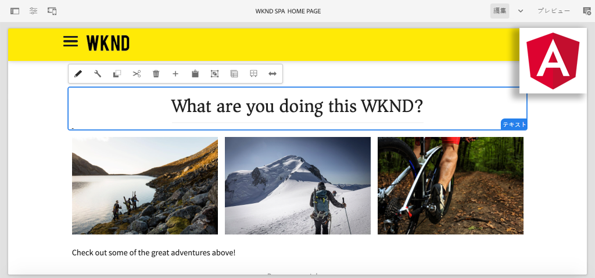

# AEM での初めての Angular SPA の作成 {#introduction}

{{edge-delivery-services}}

Adobe Experience Manager（AEM）の **SPA エディター**&#x200B;機能を初めて使用する開発者向けに設計されたマルチパートチュートリアルへようこそ。このチュートリアルでは、架空のライフスタイルブランド WKND の Angular アプリケーションの実装について順を追って説明します。Angular アプリは、AEM の SPA エディターを使用してデプロイされるように開発および設計されています。SPA エディターは、Angular コンポーネントを AEM コンポーネントにマッピングします。AEM にデプロイされた完成した SPA は、AEM の従来のインライン編集ツールを使用して動的にオーサリングすることができます。



*WKND SPA の実装*

## 概要

複数のパートから成るこのチュートリアルの目的は、AEM の SPA エディター機能と連携する Angular アプリケーションを実装する方法をデベロッパー向けに説明することです。現実世界では、開発アクティビティは担当者（多くの場合、**フロントエンド開発者**&#x200B;と&#x200B;**バックエンド開発者**）が分担します。このチュートリアルを修了することは、AEM SPA エディタープロジェクトに関与するすべての開発者にとって有益であると考えています。

このチュートリアルは、**AEM as a Cloud Service** で動作するように作られており、**AEM 6.5.4 以降**&#x200B;と **AEM 6.4.8 以降**&#x200B;と下位互換性があります。SPA は以下を使用して実装されます。

* [Maven AEM プロジェクトアーキタイプ](https://experienceleague.adobe.com/docs/experience-manager-core-components/using/developing/archetype/overview.html?lang=ja)
* [AEM SPA エディター](https://experienceleague.adobe.com/docs/experience-manager-65/developing/headless/spas/spa-walkthrough.html?lang=ja#content-editing-experience-with-spa)
* [コアコンポーネント](https://experienceleague.adobe.com/docs/experience-manager-core-components/using/introduction.html?lang=ja)
* [Angular](https://angular.io/)

*チュートリアルの各パートの推定所要時間は 1～2 時間です。*

## 最新のコード

チュートリアルコードはすべて [GitHub](https://github.com/adobe/aem-guides-wknd-spa) にあります。

この[最新のコードベース](https://github.com/adobe/aem-guides-wknd-spa/releases)は、ダウンロード可能な AEM パッケージとして入手できます。

## 前提条件

このチュートリアルを開始するにあたって、以下が必要です。

* HTML、CSS および JavaScript の基礎知識
* [Angular](https://angular.io/) についての基本的な知識
* [AEM as a Cloud Service SDK](https://experienceleague.adobe.com/docs/experience-manager-learn/cloud-service/local-development-environment-set-up/aem-runtime.html?lang=ja#download-the-aem-as-a-cloud-service-sdk)、[AEM 6.5.4 以上](https://helpx.adobe.com/jp/experience-manager/aem-releases-updates.html#65)または [AEM 6.4.8 以上](https://helpx.adobe.com/jp/experience-manager/aem-releases-updates.html#64)
* [Java](https://downloads.experiencecloud.adobe.com/content/software-distribution/en/general.html)
* [Apache Maven](https://maven.apache.org/)（3.3.9 以降）
* [Node.js](https://nodejs.org/ja/) および [npm](https://www.npmjs.com/)

*必須ではありませんが、[従来の AEM Sites コンポーネントの開発](https://experienceleague.adobe.com/docs/experience-manager-learn/getting-started-wknd-tutorial-develop/overview.html?lang=ja)の基礎知識があると役に立ちます。*

## ローカル開発環境 {#local-dev-environment}

このチュートリアルを完了するには、ローカル開発環境が必要です。スクリーンショットとビデオは、[Visual Studio Code](https://code.visualstudio.com/) を IDE とする Mac OS 環境で動作する AEM as a Cloud Service SDK を使用してキャプチャされています。コマンドとコードは、特に明記されていない限り、ローカルオペレーティングシステムから独立している必要があります。

>[!NOTE]
>
> **AEM as a Cloud Service を初めて使用する場合は、**[AEM as a Cloud Service SDK を使用してローカル開発環境をセットアップするためのガイド](https://experienceleague.adobe.com/docs/experience-manager-learn/cloud-service/local-development-environment-set-up/overview.html?lang=ja)を確認してください。
>
> **AEM 6.5 を初めて使用する場合は、**[ローカル開発環境のセットアップに関するガイド](https://experienceleague.adobe.com/docs/experience-manager-learn/foundation/development/set-up-a-local-aem-development-environment.html?lang=ja)を参照してください。

## 次の手順 {#next-steps}

すぐに取りかかりましょう。[SPA エディタープロジェクト](create-project.md)の章に移動してチュートリアルを開始し、AEM プロジェクトアーキタイプを使用して SPA エディター対応のプロジェクトを生成する方法を学びます。

## 下位互換性 {#compatibility}

このチュートリアルのプロジェクトコードは、AEM as a Cloud Service 用に作成されています。プロジェクトコードが **6.5.4 以上**&#x200B;および **6.4.8 以上**&#x200B;との下位互換性を保つように、いくつかの変更が加えられました。

[UberJar](https://experienceleague.adobe.com/docs/experience-manager-65/developing/devtools/ht-projects-maven.html?lang=ja#what-is-the-uberjar) **v6.4.4** は依存関係として含まれています。

```xml
<!-- Adobe AEM 6.x Dependencies -->
<dependency>
    <groupId>com.adobe.aem</groupId>
    <artifactId>uber-jar</artifactId>
    <version>6.4.4</version>
    <classifier>apis</classifier>
    <scope>provided</scope>
</dependency>
```

ビルドを変更して AEM 6.x 環境をターゲットにするために、`classic` という名前の Maven プロファイルが追加されています。

```xml
  <!-- AEM 6.x Profile to include Core Components-->
    <profile>
        <id>classic</id>
        <activation>
            <activeByDefault>false</activeByDefault>
        </activation>
        <build>
        ...
    </profile>
```

`classic` プロファイルはデフォルトで無効になっています。AEM 6.x を使用してチュートリアルに従う場合は、Maven ビルドの実行を指示されるたびに、`classic` プロファイルを追加してください。

```shell
$ mvn clean install -PautoInstallSinglePackage -Pclassic
```

AEM 実装用の新しいプロジェクトを生成する際は、常に最新バージョンの [AEM プロジェクトアーキタイプ](https://github.com/adobe/aem-project-archetype)を使用し、AEM の意図したバージョンをターゲットにするには `aemVersion` をアップデートしてください。
