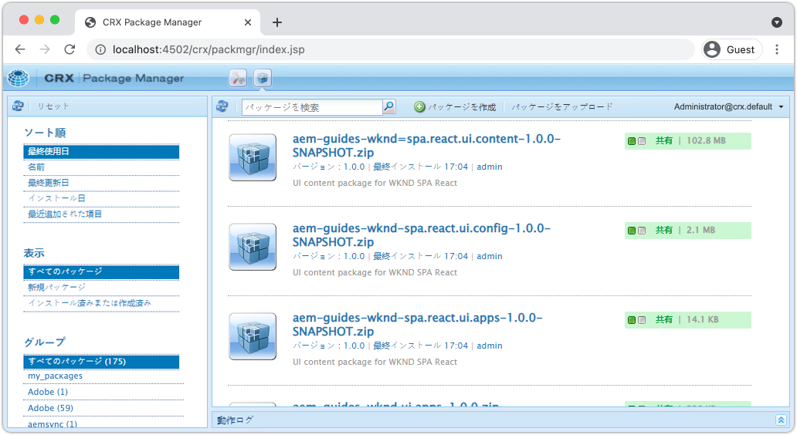
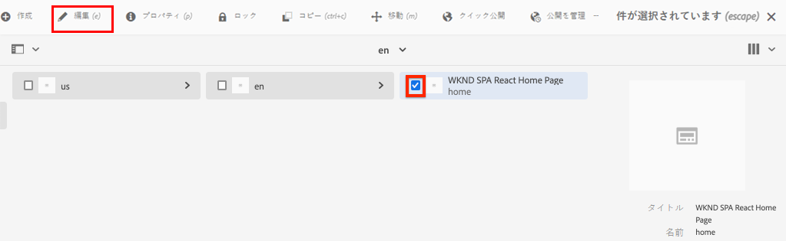
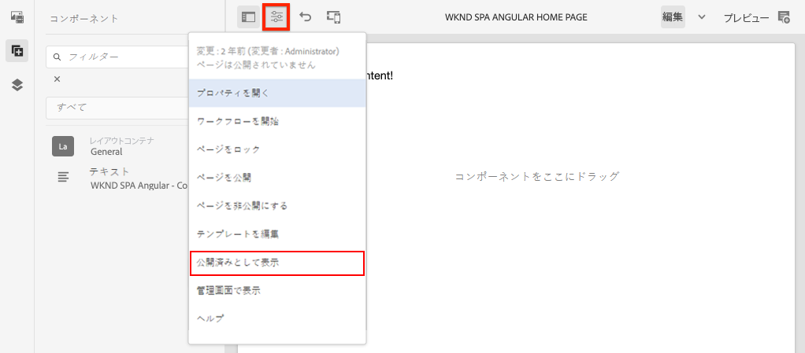

# プロジェクトを作成 {#spa-editor-project}

AEM SPA エディターと統合された React アプリケーションの出発点として、Adobe Experience Manager（AEM）Maven プロジェクトを生成する方法を説明します。

## 目的

1. AEM プロジェクトアーキタイプを使用して、SPA エディターで有効なプロジェクトを生成します。
2. スタータープロジェクトを AEM のローカルインスタンスにデプロイします。

## 作成する内容 {#what-build}

この章では、[AEM プロジェクトアーキタイプ](https://github.com/adobe/aem-project-archetype)に基づいて、AEM プロジェクトを新規生成します。AEM プロジェクトは、React SPA の非常にシンプルな開始点でブートストラップ処理されます。

**Maven プロジェクトについて** - [Apache Maven](https://maven.apache.org/) は、プロジェクトを構築するためのソフトウェア管理ツールです。*すべての Adobe Experience Manager* の実装で、Maven プロジェクトを使用して、AEM上にカスタムコードを作成、管理およびデプロイします。

**Maven アーキタイプについて** - [Maven アーキタイプ](https://maven.apache.org/archetype/index.html)は、プロジェクトを新規生成するためのテンプレートまたはパターンです。AEM プロジェクトアーキタイプを使用すると、カスタム名前空間を持つ新しいプロジェクトを生成し、ベストプラクティスに従ったプロジェクト構造を含めて、プロジェクトを大幅に高速化できます。

## 前提条件

[ローカル開発環境](overview.md#local-dev-environment)の設定に必要なツールや手順を確認します。**オーサー**&#x200B;モードで起動した Adobe Experience Manager の新しいインスタンスが、ローカルで実行されていることを確認します。

## プロジェクトの作成 {#create}

>[!NOTE]
>
>このチュートリアルでは、バージョン **35** のアーキタイプを使用します。

1. コマンドラインターミナルを開き、次の Maven コマンドを入力します。

   ```shell
   mvn -B org.apache.maven.plugins:maven-archetype-plugin:3.2.1:generate \
    -D archetypeGroupId=com.adobe.aem \
    -D archetypeArtifactId=aem-project-archetype \
    -D archetypeVersion=35 \
    -D appTitle="WKND SPA React" \
    -D appId="wknd-spa-react" \
    -D artifactId="aem-guides-wknd-spa.react" \
    -D groupId="com.adobe.aem.guides.wkndspa.react" \
    -D frontendModule="react" \
    -D aemVersion="cloud"
   ```

   >[!NOTE]
   >
   > AEM 6.5.5 以降を対象にする場合は、`aemVersion="cloud"` を `aemVersion="6.5.5"` に置き換えます。6.4.8 以降を対象にする場合は、`aemVersion="6.4.8"` を使用します。

   `frontendModule=react` プロパティに注目します。これにより、AEM SPA エディターで使用するスターター [React コードベース](https://experienceleague.adobe.com/docs/experience-manager-core-components/using/developing/archetype/uifrontend-react.html?lang=ja)でプロジェクトをブートストラップするように、AEM プロジェクトアーキタイプに指示します。次のようなプロパティ `appTitle`、`appId`、`artifactId` および `groupId` を使用して、プロジェクトと目的を特定します。

   プロジェクトの設定で使用できるプロパティの完全なリストは、[こちら](https://github.com/adobe/aem-project-archetype#avilable-properties)にあります。

1. 次のフォルダーおよびファイル構造が、ローカルファイルシステム上の Maven アーキタイプによって生成されます。

   ```plain
   |--- aem-guides-wknd-spa.react/
       |--- LICENSE
       |--- README.md
       |--- all/
       |--- archetype.properties
       |--- core/
       |--- dispatcher/
       |--- it.tests/
       |--- pom.xml
       |--- ui.apps/
       |--- ui.apps.structure/
       |--- ui.config/
       |--- ui.content/
       |--- ui.frontend/
       |--- ui.tests /
       |--- .gitignore
   ```

   各フォルダーはそれぞれの Maven モジュールを表します。このチュートリアルでは、主に、React アプリである `ui.frontend` モジュールを扱います。それぞれのモジュールの詳細については、[AEM プロジェクトアーキタイプドキュメント](https://experienceleague.adobe.com/docs/experience-manager-core-components/using/developing/archetype/overview.html?lang=ja)に記載されています。

## プロジェクトをデプロイしてビルドします。

次に、Maven を使用して、プロジェクトコードをコンパイル、ビルドし、AEM のローカルインスタンスにデプロイします。

1. AEM のインスタンスが、ポート **4502** 上でローカルで実行されていることを確認します。
1. コマンドラインから、`aem-guides-wknd-spa.react` プロジェクトディレクトリに移動します。

   ```shell
   $ cd aem-guides-wknd-spa.react
   ```

1. 以下のコマンドを実行してプロジェクト全体をビルドし、AEM にデプロイします。

   ```shell
   $ mvn clean install -PautoInstallSinglePackage
   ```

   ビルドは約 1 分かかり、最後に次のメッセージが表示されます。

   ```shell
   ...
   [INFO] ------------------------------------------------------------------------
   [INFO] Reactor Summary for aem-guides-wknd-spa.react 1.0.0-SNAPSHOT:
   [INFO]
   [INFO] aem-guides-wknd-spa.react .......................... SUCCESS [  0.257 s]
   [INFO] WKND SPA React - Core .............................. SUCCESS [ 12.553 s]
   [INFO] WKND SPA React - UI Frontend ....................... SUCCESS [01:46 min]
   [INFO] WKND SPA React - Repository Structure Package ...... SUCCESS [  1.082 s]
   [INFO] WKND SPA React - UI apps ........................... SUCCESS [  8.237 s]
   [INFO] WKND SPA React - UI content ........................ SUCCESS [  5.633 s]
   [INFO] WKND SPA React - UI config ......................... SUCCESS [  0.234 s]
   [INFO] WKND SPA React - All ............................... SUCCESS [  0.643 s]
   [INFO] WKND SPA React - Integration Tests ................. SUCCESS [ 12.377 s]
   [INFO] WKND SPA React - Dispatcher ........................ SUCCESS [  0.066 s]
   [INFO] WKND SPA React - UI Tests .......................... SUCCESS [  0.074 s]
   [INFO] WKND SPA React - Project Analyser .................. SUCCESS [ 31.287 s]
   [INFO] ------------------------------------------------------------------------
   [INFO] BUILD SUCCESS
   [INFO] ------------------------------------------------------------------------
   ```

   Maven プロファイル `autoInstallSinglePackage` は、プロジェクトの各モジュールをコンパイルし、AEM インスタンスに単一のパッケージをデプロイします。デフォルトでは、このパッケージは、ポート **4502** 上で `admin:admin` の認証情報を使用してローカルで稼働する AEM インスタンスにデプロイされます。

1. ローカルの AEM インスタンス（[http://localhost:4502/crx/packmgr/index.jsp](http://localhost:4502/crx/packmgr/index.jsp)）で&#x200B;**パッケージマネージャー**&#x200B;に移動します。

1. `aem-guides-wknd-spa.react` というプレフィックスがついた複数のパッケージが表示されます。

   

   *AEM パッケージマネージャー*

   プロジェクトに必要なすべてのカスタムコードは、これらのパッケージにバンドルされ、AEM 環境にインストールされます。

## 作成者コンテンツ

次に、アーキタイプで生成されたスターター SPA を開き、コンテンツの一部を更新します。

1. **Sites** コンソール（[http://localhost:4502/sites.html/content](http://localhost:4502/sites.html/content)）に移動します。

   WKND SPA は、国、言語、ホームページを含む基本的なサイト構造を含んでいます。この階層は、アーキタイプの `language_country` と `isSingleCountryWebsite` のデフォルト値に基づいています。これらの値は、プロジェクトを生成する際に[使用可能なプロパティ](https://github.com/adobe/aem-project-archetype#avilable-properties)で上書きされる場合があります。

2. **us**／**en**／**WKND SPA React ホームページ**&#x200B;ページを選択し、メニューバーの「**編集**」ボタンをクリックしてページを開きます。

   

3. **テキスト**&#x200B;コンポーネントは既にページに追加されています。このコンポーネントは、AEM の他のコンポーネントと同様に編集できます。

   

4. さらに&#x200B;**テキスト**&#x200B;コンポーネントをページに追加します。

   オーサリングエクスペリエンスは、従来の AEM Sites ページと似ています。 現在、使用できるコンポーネントの数は限られています。チュートリアルの過程で、さらに追加されます。

## 単一ページアプリケーションの検査

次に、ブラウザーのデベロッパーツールを使用して、これが単一ページアプリケーションであることを確認します。

1. **ページエディター**&#x200B;で、「**ページ情報**」ボタン／「**公開済みとして表示**」ボタンを順にクリックします。

   

   これにより、AEM エディター（[http://localhost:4502/content/wknd-spa-react/us/en/home.html?wcmmode=disabled](http://localhost:4502/content/wknd-spa-react/us/en/home.html?wcmmode=disabled)）を実質的にオフにするクエリパラメーター `?wcmmode=disabled` を含む新しいタブが開きます。

2. ページのソースを表示し、テキストコンテンツ **[!DNL Hello World]** や他のコンテンツが見あたらないことに注目してください 。代わりに、次のような HTML が表示されます。

   ```html
   ...
   <body>
       <noscript>You need to enable JavaScript to run this app.</noscript>
       <div id="spa-root"></div>
       <script type="text/javascript" src="/etc.clientlibs/wknd-spa-react/clientlibs/clientlib-react.lc-xxxx-lc.min.js"></script>
   </body>
   ...
   ```

   `clientlib-react.min.js` は、ページに読み込まれ、コンテンツのレンダリングを担当する React SPA です。

   しかし、*このコンテンツはどこから取得されるのでしょうか。*

3. タブに戻ります。[http://localhost:4502/content/wknd-spa-react/us/en/home.html?wcmmode=disabled](http://localhost:4502/content/wknd-spa-react/us/en/home.html?wcmmode=disabled)
4. ブラウザーのデベロッパーツールを開き、更新中にページのネットワークトラフィックを調べます。 **XHR** リクエストを確認します。

   

   [http://localhost:4502/content/wknd-spa-react/us/en.model.json](http://localhost:4502/content/wknd-spa-react/us/en.model.json) へのリクエストがあるはずです。これには、SPA を駆動するすべてのコンテンツが JSON 形式で含まれます。

5. 新しいタブで [http://localhost:4502/content/wknd-spa-react/us/en.model.json](http://localhost:4502/content/wknd-spa-react/us/en.model.json) を開きます。

   リクエスト `en.model.json` は、アプリケーションを駆動するコンテンツモデルを表します。 JSON 出力を調査すると、**[!UICONTROL テキスト]**&#x200B;コンポーネントを表すスニペットが見つかるはずです。

   ```json
   ...
   ":items": {
       "text": {
           "text": "<p>Hello World! Updated content!</p>\r\n",
           "richText": true,
           ":type": "wknd-spa-react/components/text"
       },
       "text_98796435": {
           "text": "<p>A new text component.</p>\r\n",
           "richText": true,
           ":type": "wknd-spa-react/components/text"
       },
   }
   ...
   ```

   次の章では、この JSON コンテンツが AEM コンポーネントから SPA コンポーネントにどのようにマッピングされ、AEM SPA エディターのエクスペリエンスの基盤が形成されるかを調べます。

   >[!NOTE]
   >
   > JSON 出力を自動的にフォーマットするブラウザー拡張機能をインストールすると役立つ場合があります。

## おめでとうございます。 {#congratulations}

最初の AEM SPA エディタープロジェクトを作成できました。

SPA は非常に簡単です。この後の複数の章では、さらに機能を追加していきます。

### 次の手順 {#next-steps}

[SPA の統合](integrate-spa.md) - SPA ソースコードが AEM プロジェクトと統合される仕組みと、SPA を迅速に開発するために使用できるツールについて説明します。
