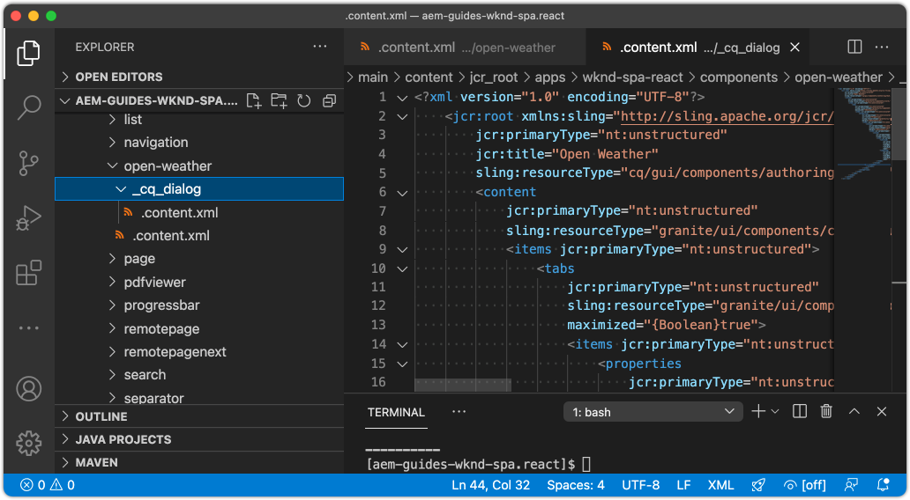
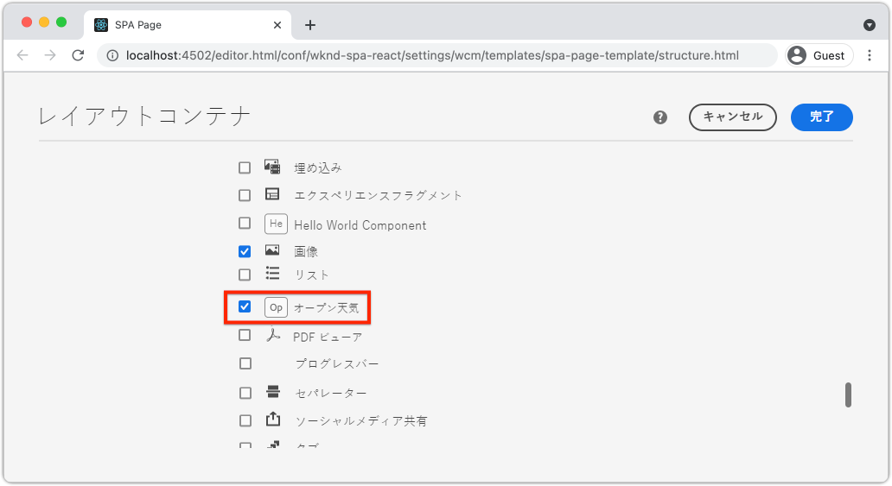
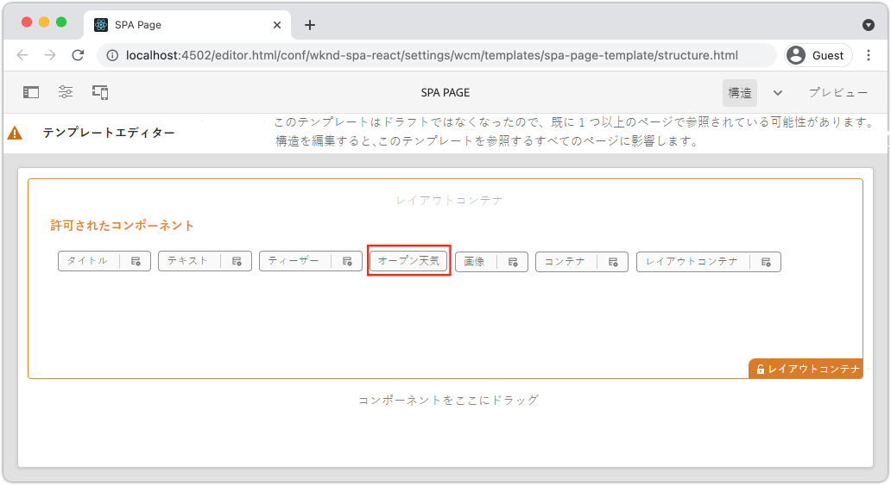

# カスタム天気予報コンポーネントの作成 {#custom-component}

{{spa-editor-deprecation}}

AEM SPA Editor で使用するカスタム天気予報コンポーネントを作成する方法について説明します。オーサーダイアログと Sling モデルを開発して JSON モデルを拡張し、カスタムコンポーネントを設定する方法について説明します。[Open Weather API](https://openweathermap.org) と [React Open Weather コンポーネント](https://www.npmjs.com/package/react-open-weather)を使用します。

## 目的

1. AEM に用意されている JSON モデル API を操作する際の Sling モデルの役割を理解します。
2. 新しい AEM コンポーネントダイアログの作成方法について説明します。
3. SPA エディターフレームワークと互換性のある&#x200B;**カスタム** AEM コンポーネントの作成方法について説明します。

## 作成する内容

シンプルな天気予報コンポーネントを構築します。このコンポーネントは、コンテンツ作成者が SPA に追加できます。作成者は、AEM ダイアログを使用して、表示する天気の地域を設定できます。このコンポーネントの実装では、AEM SPA Editor フレームワークと互換性のある AEM コンポーネントを新規作成するために必要な手順を示しています。


## 前提条件

[ローカル開発環境](overview.md#local-dev-environment)の設定に必要なツールと手順を確認します。この章は、「[ナビゲーションとルーティング](navigation-routing.md)」の章の続きですが、必要な操作をすべて実行するには、SPA 対応 AEM プロジェクトをローカル AEM インスタンスにデプロイする必要があります。

### Open Weather API キー

チュートリアルを進めるには、[Open Weather](https://openweathermap.org/) API キーが必要です。[登録は無料です](https://home.openweathermap.org/users/sign_up)が、API 呼び出し回数は制限されています。

## AEM コンポーネントの定義

AEM コンポーネントは、ノードおよびプロパティとして定義されます。 プロジェクトでは、これらのノードとプロパティは `ui.apps` モジュールで XML ファイルとして表されます。次に、`ui.apps` モジュールに AEM コンポーネントを作成します。

>[!NOTE]
>
> [AEM コンポーネントの基本に関する簡単な復習が役立つ場合があります](https://experienceleague.adobe.com/docs/experience-manager-learn/getting-started-wknd-tutorial-develop/project-archetype/component-basics.html?lang=ja)。

1. 選択した IDE で `ui.apps` フォルダーを開きます。
2. `ui.apps/src/main/content/jcr_root/apps/wknd-spa-react/components` に移動して、`open-weather` という名前の新規フォルダーを作成します。
3. `open-weather` フォルダーの下に `.content.xml` という名前の新規ファイルを作成します。`open-weather/.content.xml` に以下を入力します。

   ```xml
   <?xml version="1.0" encoding="UTF-8"?>
   <jcr:root xmlns:sling="http://sling.apache.org/jcr/sling/1.0" xmlns:cq="http://www.day.com/jcr/cq/1.0" xmlns:jcr="http://www.jcp.org/jcr/1.0"
       jcr:primaryType="cq:Component"
       jcr:title="Open Weather"
       componentGroup="WKND SPA React - Content"/>
   ```

   

   `jcr:primaryType="cq:Component"` - このノードが AEM コンポーネントであることを示します。

   `jcr:title` は、コンテンツ作成者に表示される値で、`componentGroup` はオーサリング UI でのコンポーネントのグループ化を決定します。

4. `custom-component` フォルダーの下に、`_cq_dialog` という名前の別のフォルダーを作成します。
5. `_cq_dialog` フォルダーの下に `.content.xml` という名前の新規ファイルを作成し、次のように入力します。

   ```xml
   <?xml version="1.0" encoding="UTF-8"?>
   <jcr:root xmlns:sling="http://sling.apache.org/jcr/sling/1.0" xmlns:granite="http://www.adobe.com/jcr/granite/1.0" xmlns:cq="http://www.day.com/jcr/cq/1.0" xmlns:jcr="http://www.jcp.org/jcr/1.0" xmlns:nt="http://www.jcp.org/jcr/nt/1.0"
       jcr:primaryType="nt:unstructured"
       jcr:title="Open Weather"
       sling:resourceType="cq/gui/components/authoring/dialog">
       <content
           jcr:primaryType="nt:unstructured"
           sling:resourceType="granite/ui/components/coral/foundation/container">
           <items jcr:primaryType="nt:unstructured">
               <tabs
                   jcr:primaryType="nt:unstructured"
                   sling:resourceType="granite/ui/components/coral/foundation/tabs"
                   maximized="{Boolean}true">
                   <items jcr:primaryType="nt:unstructured">
                       <properties
                           jcr:primaryType="nt:unstructured"
                           jcr:title="Properties"
                           sling:resourceType="granite/ui/components/coral/foundation/container"
                           margin="{Boolean}true">
                           <items jcr:primaryType="nt:unstructured">
                               <columns
                                   jcr:primaryType="nt:unstructured"
                                   sling:resourceType="granite/ui/components/coral/foundation/fixedcolumns"
                                   margin="{Boolean}true">
                                   <items jcr:primaryType="nt:unstructured">
                                       <column
                                           jcr:primaryType="nt:unstructured"
                                           sling:resourceType="granite/ui/components/coral/foundation/container">
                                           <items jcr:primaryType="nt:unstructured">
                                               <label
                                                   jcr:primaryType="nt:unstructured"
                                                   sling:resourceType="granite/ui/components/coral/foundation/form/textfield"
                                                   fieldDescription="The label to display for the component"
                                                   fieldLabel="Label"
                                                   name="./label"/>
                                               <lat
                                                   jcr:primaryType="nt:unstructured"
                                                   sling:resourceType="granite/ui/components/coral/foundation/form/numberfield"
                                                   fieldDescription="The latitude of the location."
                                                   fieldLabel="Latitude"
                                                   step="any"
                                                   name="./lat" />
                                               <lon
                                                   jcr:primaryType="nt:unstructured"
                                                   sling:resourceType="granite/ui/components/coral/foundation/form/numberfield"
                                                   fieldDescription="The longitude of the location."
                                                   fieldLabel="Longitude"
                                                   step="any"
                                                   name="./lon"/>
                                           </items>
                                       </column>
                                   </items>
                               </columns>
                           </items>
                       </properties>
                   </items>
               </tabs>
           </items>
       </content>
   </jcr:root>
   ```

   

   上記の XML ファイルでは、`Weather Component` の非常にシンプルなダイアログが生成されます。ファイルの重要な部分は、内部の `<label>`、`<lat>`、`<lon>` ノードです。このダイアログには、2 つの `numberfield` と `textfield` が含まれており、ユーザーは表示する天気を設定できます。

   次に、Sling モデルを作成し、JSON モデルを使用して `label`、`lat`、`long` プロパティの値を公開します。

   >[!NOTE]
   >
   > [コアコンポーネントの定義を確認すると、さらに多くのダイアログの例](https://github.com/adobe/aem-core-wcm-components/tree/master/content/src/content/jcr_root/apps/core/wcm/components)を見ることができます。[CRXDE-Lite ](http://localhost:4502/crx/de/index.jsp#/libs/granite/ui/components/coral/foundation/form) の `/libs/granite/ui/components/coral/foundation/form` の下にある`select`、`textarea`、`pathfield` などの追加のフォームフィールドを表示することもできます。

   従来の AEM コンポーネントでは、[HTL](https://experienceleague.adobe.com/docs/experience-manager-htl/using/overview.html?lang=ja) スクリプトは通常必要です。 SPA はコンポーネントをレンダリングするので、HTL スクリプトは不要です。

## Sling モデルの作成

Sling モデルは、JCR から Java 変数へのデータのマッピングを容易にする注釈駆動の Java「POJO」（Plain Old Java Objects）です。 [Sling モデル](https://experienceleague.adobe.com/docs/experience-manager-learn/getting-started-wknd-tutorial-develop/project-archetype/component-basics.html?lang=ja#sling-models)は通常、AEM コンポーネントの複雑なサーバーサイドビジネスロジックをカプセル化する機能を果たします。

SPA エディターのコンテキストでは、Sling モデルは、[Sling モデルエクスポーター](https://experienceleague.adobe.com/docs/experience-manager-learn/foundation/development/develop-sling-model-exporter.html?lang=ja)を使用する機能を通じて、JSON モデルを介してコンポーネントのコンテンツを表示します。

1. 選択した IDE で、`aem-guides-wknd-spa.react/core` にある `core` モジュールを開きます。
1. `core/src/main/java/com/adobe/aem/guides/wkndspa/react/core/models` に `OpenWeatherModel.java` という名前のファイルを作成します。
1. `OpenWeatherModel.java` に以下を入力します。

   ```java
   package com.adobe.aem.guides.wkndspa.react.core.models;
   
   import com.adobe.cq.export.json.ComponentExporter;
   
   // Sling Models intended to be used with SPA Editor must extend ComponentExporter interface
   public interface OpenWeatherModel extends ComponentExporter {
       public String getLabel();
       public double getLat();
       public double getLon();
   }
   ```

   これは、コンポーネントの Java インターフェイスです。 Sling モデルと SPA エディターフレームワークとの互換性を保つには、`ComponentExporter` クラスを拡張する必要があります。

1. `core/src/main/java/com/adobe/aem/guides/wkndspa/react/core/models` の下に `impl` という名前のフォルダーを作成します。
1. `impl` の下に `OpenWeatherModelImpl.java` という名前のファイルを作成し、次の情報を入力します。

   ```java
   package com.adobe.aem.guides.wkndspa.react.core.models.impl;
   
   import org.apache.sling.models.annotations.*;
   import org.apache.sling.models.annotations.injectorspecific.ValueMapValue;
   import com.adobe.cq.export.json.ComponentExporter;
   import com.adobe.cq.export.json.ExporterConstants;
   import org.apache.commons.lang3.StringUtils;
   import org.apache.sling.api.SlingHttpServletRequest;
   import com.adobe.aem.guides.wkndspa.react.core.models.OpenWeatherModel;
   
   // Sling Model annotation
   @Model(
       adaptables = SlingHttpServletRequest.class, 
       adapters = { OpenWeatherModel.class, ComponentExporter.class }, 
       resourceType = OpenWeatherModelImpl.RESOURCE_TYPE, 
       defaultInjectionStrategy = DefaultInjectionStrategy.OPTIONAL
   )
   @Exporter( //Exporter annotation that serializes the modoel as JSON
       name = ExporterConstants.SLING_MODEL_EXPORTER_NAME, 
       extensions = ExporterConstants.SLING_MODEL_EXTENSION
   )
   public class OpenWeatherModelImpl implements OpenWeatherModel {
   
       @ValueMapValue
       private String label; //maps variable to jcr property named "label" persisted by Dialog
   
       @ValueMapValue
       private double lat; //maps variable to jcr property named "lat"
   
       @ValueMapValue
       private double lon; //maps variable to jcr property named "lon"
   
       // points to AEM component definition in ui.apps
       static final String RESOURCE_TYPE = "wknd-spa-react/components/open-weather";
   
       // public getter method to expose value of private variable `label`
       // adds additional logic to default the label to "(Default)" if not set.
       @Override
       public String getLabel() {
           return StringUtils.isNotBlank(label) ? label : "(Default)";
       }
   
       // public getter method to expose value of private variable `lat`
       @Override
       public double getLat() {
           return lat;
       }
   
       // public getter method to expose value of private variable `lon`
       @Override
       public double getLon() {
           return lon;
       }
   
       // method required by `ComponentExporter` interface
       // exposes a JSON property named `:type` with a value of `wknd-spa-react/components/open-weather`
       // required to map the JSON export to the SPA component props via the `MapTo`
       @Override
       public String getExportedType() {
           return OpenWeatherModelImpl.RESOURCE_TYPE;
       }
   } 
   ```

   静的変数 `RESOURCE_TYPE` は、コンポーネントの `ui.apps` 内のパスを指している必要があります。`getExportedType()` は、`MapTo` を介して JSON プロパティを SPA コンポーネントにマップするために使用されます。`@ValueMapValue` は、ダイアログで保存された jcr プロパティを読み取る注釈です。

## SPA を更新

次に、React コードを更新して [React Open Weather コンポーネント](https://www.npmjs.com/package/react-open-weather) を含め、前の手順で作成した AEM コンポーネントにマッピングします。

1. React Open Weather コンポーネントを **npm** 依存関係としてインストールします。

   ```shell
   $ cd aem-guides-wknd-spa.react/ui.frontend
   $ npm i react-open-weather
   ```

1. `ui.frontend/src/components/OpenWeather` に `OpenWeather` という名前の新しいフォルダーを作成します。
1. `OpenWeather.js` という名前のファイルを追加し、次の情報を入力します。

   ```js
   import React from 'react';
   import {MapTo} from '@adobe/aem-react-editable-components';
   import ReactWeather, { useOpenWeather } from 'react-open-weather';
   
   // Open weather API Key
   // For simplicity it is hard coded in the file, ideally this is extracted in to an environment variable
   const API_KEY = 'YOUR_API_KEY';
   
   // Logic to render placeholder or component
   const OpenWeatherEditConfig = {
   
       emptyLabel: 'Weather',
       isEmpty: function(props) {
           return !props || !props.lat || !props.lon || !props.label;
       }
   };
   
   // Wrapper function that includes react-open-weather component
   function ReactWeatherWrapper(props) {
       const { data, isLoading, errorMessage } = useOpenWeather({
           key: API_KEY,
           lat: props.lat, // passed in from AEM JSON
           lon: props.lon, // passed in from AEM JSON
           lang: 'en',
           unit: 'imperial', // values are (metric, standard, imperial)
       });
   
       return (
           <div className="cmp-open-weather">
               <ReactWeather
                   isLoading={isLoading}
                   errorMessage={errorMessage}
                   data={data}
                   lang="en"
                   locationLabel={props.label} // passed in from AEM JSON
                   unitsLabels={{ temperature: 'F', windSpeed: 'mph' }}
                   showForecast={false}
                 />
           </div>
       );
   }
   
   export default function OpenWeather(props) {
   
           // render nothing if component not configured
           if (OpenWeatherEditConfig.isEmpty(props)) {
               return null;
           }
   
           // render ReactWeather component if component configured
           // pass props to ReactWeatherWrapper. These props include the mapped properties from AEM JSON
           return ReactWeatherWrapper(props);
   
   }
   
   // Map OpenWeather to AEM component
   MapTo('wknd-spa-react/components/open-weather')(OpenWeather, OpenWeatherEditConfig);
   ```

1. `ui.frontend/src/components/import-components.js` で `import-components.js` を更新して `OpenWeather` コンポーネントを含めます。

   ```diff
     // import-component.js
     import './Container/Container';
     import './ExperienceFragment/ExperienceFragment';
   + import './OpenWeather/OpenWeather';
   ```

1. Maven のスキルを使用して、すべてのアップデートをプロジェクトディレクトリのルートからローカル AEM 環境にデプロイします。

   ```shell
   $ cd aem-guides-wknd-spa.react
   $ mvn clean install -PautoInstallSinglePackage
   ```

## テンプレートポリシーの更新

次に、AEM に移動して更新を確認し、`OpenWeather` コンポーネントを SPA に追加できるようにします。

1. 次の場所に移動して、新しい Sling モデルの登録を検証します。[http://localhost:4502/system/console/status-slingmodels](http://localhost:4502/system/console/status-slingmodels)。

   ```plain
   com.adobe.aem.guides.wkndspa.react.core.models.impl.OpenWeatherModelImpl - wknd-spa-react/components/open-weather
   
   com.adobe.aem.guides.wkndspa.react.core.models.impl.OpenWeatherModelImpl exports 'wknd-spa-react/components/open-weather' with selector 'model' and extension '[Ljava.lang.String;@2fd80fc5' with exporter 'jackson'
   ```

   `OpenWeatherModelImpl` が `wknd-spa-react/components/open-weather` コンポーネントに関連付けられており、Sling モデルエクスポーターを介して登録されていることを示す上記の 2 行が表示されます。

1. 次の場所にある SPA ページ テンプレートに移動します。[http://localhost:4502/editor.html/conf/wknd-spa-react/settings/wcm/templates/spa-page-template/structure.html](http://localhost:4502/editor.html/conf/wknd-spa-react/settings/wcm/templates/spa-page-template/structure.html)。
1. レイアウトコンテナのポリシーを更新して、新しい `Open Weather` を許可されたコンポーネントとして追加します。

   

   ポリシーへの変更を保存し、許可されたコンポーネントとして `Open Weather` を確認します。

   

## Open Weather コンポーネントを作成

次に、AEM SPA エディターを使用して `Open Weather` コンポーネントを作成します。

1. [http://localhost:4502/editor.html/content/wknd-spa-react/us/en/home.html](http://localhost:4502/editor.html/content/wknd-spa-react/us/en/home.html) に移動します。
1. `Edit` モードで、`Open Weather` を `Layout Container` に追加します。

   

1. コンポーネントのダイアログを開き、**ラベル**、**緯度**、および&#x200B;**経度**&#x200B;を入力します。例えば、**サンディエゴ**、**32.7157**、および **-117.1611** などです。西半球と南半球の数は、Open Weather API で負の数として表されます

   

   これは、この章で前述した XML ファイルに基づいて作成されたダイアログです。

1. 変更を保存します。**サンディエゴ**&#x200B;の天気が表示されていることを確認します。

   

1. [http://localhost:4502/content/wknd-spa-react/us/en.model.json](http://localhost:4502/content/wknd-spa-react/us/en.model.json) に移動して、JSON モデルを表示します。`wknd-spa-react/components/open-weather` を検索します。

   ```json
   "open_weather": {
       "label": "San Diego",
       "lat": 32.7157,
       "lon": -117.1611,
       ":type": "wknd-spa-react/components/open-weather"
   }
   ```

   この JSON 値は、Sling モデルによって出力されます。 これらの JSON 値は、prop として React コンポーネントに渡されます。

## おめでとうございます。 {#congratulations}

これで、SPA Editor で使用するカスタム AEM コンポーネントの作成方法を学びました。 また、ダイアログ、JCR プロパティ、Sling モデルが相互にやり取りして JSON モデルを出力する方法についても学びました。

### 次の手順 {#next-steps}

[コアコンポーネントの拡張](extend-component.md) - 既存の AEM コアコンポーネントを拡張して、AEM SPA Editor で使用する方法を説明します。 既存のコンポーネントにプロパティとコンテンツを追加する方法を理解すると、AEM SPA エディター実装の機能を拡張するための強力な手法になります。
