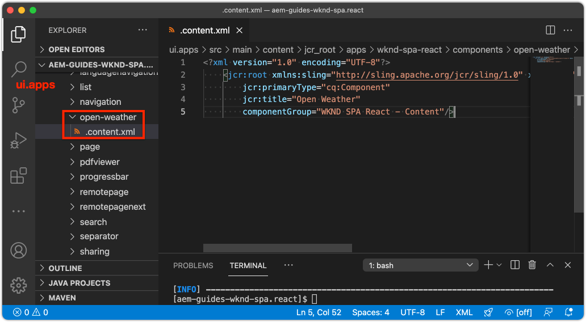

# カスタム天気コンポーネントを作成する {#custom-component}

AEM SPA Editorで使用するカスタム天気コンポーネントを作成する方法を説明します。 JSONモデルを拡張してカスタムコンポーネントを設定するためのオーサーダイアログとSlingモデルの開発方法について説明します。 [オープンウェザーAPI](https://openweathermap.org)と[Reactオープンウェザーコンポーネント](https://www.npmjs.com/package/react-open-weather)が使用されます。

## 目的

1. AEMが提供するJSONモデルAPIを操作する際のSlingモデルの役割を理解します。
2. 新しいAEMコンポーネントダイアログの作成方法を説明します。
3. SPAエディターフレームワークと互換性のある&#x200B;**カスタム** AEMコンポーネントの作成について説明します。

## 作成する内容

簡単な気象コンポーネントが構築されます。 このコンポーネントは、コンテンツ作成者がSPAに追加できます。 作成者は、AEMダイアログを使用して、天気が表示される場所を設定できます。  このコンポーネントの実装は、AEM SPA Editorフレームワークと互換性のある新しいAEMコンポーネントを作成するために必要な手順を示します。


## 前提条件

[ローカル開発環境](overview.md#local-dev-environment)の設定に必要なツールと手順を確認します。 この章は、「[ナビゲーションとルーティング](navigation-routing.md)」の章の続きですが、必要な操作は、ローカルのAEMインスタンスにデプロイされるSPA対応のAEMプロジェクトだけです。

### オープンウェザーAPIキー

このチュートリアルに従うには、[Open Weather](https://openweathermap.org/)のAPIキーが必要です。 [登録は、限ら](https://home.openweathermap.org/users/sign_up) れた量のAPI呼び出しに対して無料です。

## AEMコンポーネントの定義

AEMコンポーネントは、ノードおよびプロパティとして定義されます。 プロジェクトでは、これらのノードとプロパティは`ui.apps`モジュール内でXMLファイルとして表されます。 次に、`ui.apps`モジュールにAEMコンポーネントを作成します。

>[!NOTE]
>
> AEMコンポーネントの[基本に関する簡単なリフレッシャーが役立つ場合があります。](https://experienceleague.adobe.com/docs/experience-manager-learn/getting-started-wknd-tutorial-develop/project-archetype/component-basics.html)

1. 任意のIDEで、`ui.apps`フォルダーを開きます。
2. `ui.apps/src/main/content/jcr_root/apps/wknd-spa-react/components`に移動し、`open-weather`という名前の新しいフォルダーを作成します。
3. `open-weather`フォルダーの下に`.content.xml`という名前の新しいファイルを作成します。 `open-weather/.content.xml`に以下を入力します。

   ```xml
   <?xml version="1.0" encoding="UTF-8"?>
   <jcr:root xmlns:sling="http://sling.apache.org/jcr/sling/1.0" xmlns:cq="http://www.day.com/jcr/cq/1.0" xmlns:jcr="http://www.jcp.org/jcr/1.0"
       jcr:primaryType="cq:Component"
       jcr:title="Open Weather"
       componentGroup="WKND SPA React - Content"/>
   ```

   

   `jcr:primaryType="cq:Component"`  — このノードがAEMコンポーネントであることを示します。

   `jcr:title` は、コンテンツ作成者に表示される値で、はオーサリングUI `componentGroup` でのコンポーネントのグループを決定します。

4. `custom-component`フォルダーの下に、`_cq_dialog`という名前の別のフォルダーを作成します。
5. `_cq_dialog`フォルダーの下に、`.content.xml`という名前の新しいファイルを作成し、次のように設定します。

   ```xml
   <?xml version="1.0" encoding="UTF-8"?>
   <jcr:root xmlns:sling="http://sling.apache.org/jcr/sling/1.0" xmlns:granite="http://www.adobe.com/jcr/granite/1.0" xmlns:cq="http://www.day.com/jcr/cq/1.0" xmlns:jcr="http://www.jcp.org/jcr/1.0" xmlns:nt="http://www.jcp.org/jcr/nt/1.0"
       jcr:primaryType="nt:unstructured"
       jcr:title="Open Weather"
       sling:resourceType="cq/gui/components/authoring/dialog">
       <content
           jcr:primaryType="nt:unstructured"
           sling:resourceType="granite/ui/components/coral/foundation/container">
           <items jcr:primaryType="nt:unstructured">
               <tabs
                   jcr:primaryType="nt:unstructured"
                   sling:resourceType="granite/ui/components/coral/foundation/tabs"
                   maximized="{Boolean}true">
                   <items jcr:primaryType="nt:unstructured">
                       <properties
                           jcr:primaryType="nt:unstructured"
                           jcr:title="Properties"
                           sling:resourceType="granite/ui/components/coral/foundation/container"
                           margin="{Boolean}true">
                           <items jcr:primaryType="nt:unstructured">
                               <columns
                                   jcr:primaryType="nt:unstructured"
                                   sling:resourceType="granite/ui/components/coral/foundation/fixedcolumns"
                                   margin="{Boolean}true">
                                   <items jcr:primaryType="nt:unstructured">
                                       <column
                                           jcr:primaryType="nt:unstructured"
                                           sling:resourceType="granite/ui/components/coral/foundation/container">
                                           <items jcr:primaryType="nt:unstructured">
                                               <label
                                                   jcr:primaryType="nt:unstructured"
                                                   sling:resourceType="granite/ui/components/coral/foundation/form/textfield"
                                                   fieldDescription="The label to display for the component"
                                                   fieldLabel="Label"
                                                   name="./label"/>
                                               <lat
                                                   jcr:primaryType="nt:unstructured"
                                                   sling:resourceType="granite/ui/components/coral/foundation/form/numberfield"
                                                   fieldDescription="The latitude of the location."
                                                   fieldLabel="Latitude"
                                                   step="any"
                                                   name="./lat" />
                                               <lon
                                                   jcr:primaryType="nt:unstructured"
                                                   sling:resourceType="granite/ui/components/coral/foundation/form/numberfield"
                                                   fieldDescription="The longitude of the location."
                                                   fieldLabel="Longitude"
                                                   step="any"
                                                   name="./lon"/>
                                           </items>
                                       </column>
                                   </items>
                               </columns>
                           </items>
                       </properties>
                   </items>
               </tabs>
           </items>
       </content>
   </jcr:root>
   ```

   

   上記のXMLファイルは、`Weather Component`のための非常に単純なダイアログを生成します。 ファイルの重要な部分は、内部の`<label>`、`<lat>`、`<lon>`ノードです。 このダイアログには、2つの`numberfield`と`textfield`が含まれ、これらを使用して天気を表示するように設定できます。

   次にSlingモデルが作成され、JSONモデルを使用して`label`、`lat`および`long`プロパティの値が公開されます。

   >[!NOTE]
   >
   > コアコンポーネントの定義](https://github.com/adobe/aem-core-wcm-components/tree/master/content/src/content/jcr_root/apps/core/wcm/components)を参照すると、さらに多くの[ダイアログの例を確認できます。 [CRXDE-Lite](http://localhost:4502/crx/de/index.jsp#/libs/granite/ui/components/coral/foundation/form)の`/libs/granite/ui/components/coral/foundation/form`の下にある`select`、`textarea`、`pathfield`など、追加のフォームフィールドを表示することもできます。

   従来のAEMコンポーネントでは、通常、[HTL](https://experienceleague.adobe.com/docs/experience-manager-htl/using/overview.html?lang=ja)スクリプトが必要です。 SPAはコンポーネントをレンダリングするので、HTLスクリプトは不要です。

## Slingモデルの作成

Slingモデルは、JCRからJava変数へのデータのマッピングを容易にする注釈駆動型のJava「POJO」(Plain Old Java Objects)です。 [Sling Modelstypcalに](https://experienceleague.adobe.com/docs/experience-manager-learn/getting-started-wknd-tutorial-develop/project-archetype/component-basics.html?lang=en#sling-models) より、AEM Components用の複雑なサーバー側のビジネスロジックがカプセル化されます。

SPA Editorのコンテキストでは、Sling Modelsは、[Sling Model Exporter](https://experienceleague.adobe.com/docs/experience-manager-learn/foundation/development/develop-sling-model-exporter.html)を使用する機能を使用して、JSONモデルを介してコンポーネントのコンテンツを公開します。

1. 任意のIDEで、`aem-guides-wknd-spa.react/core`にある`core`モジュールを開きます。
1. `OpenWeatherModel.java`の`core/src/main/java/com/adobe/aem/guides/wkndspa/react/core/models`に、という名前のファイルを作成します。
1. `OpenWeatherModel.java` に以下を入力します。

   ```java
   package com.adobe.aem.guides.wkndspa.react.core.models;
   
   import com.adobe.cq.export.json.ComponentExporter;
   
   // Sling Models intended to be used with SPA Editor must extend ComponentExporter interface
   public interface OpenWeatherModel extends ComponentExporter {
   
       public String getLabel();
   
       public double getLat();
   
       public double getLon();
   
   }
   ```

   これは、コンポーネントのJavaインターフェイスです。 Sling ModelをSPA Editorフレームワークと互換性を持たせるには、`ComponentExporter`クラスを拡張する必要があります。

1. `core/src/main/java/com/adobe/aem/guides/wkndspa/react/core/models`の下に`impl`という名前のフォルダーを作成します。
1. `impl`の下に`OpenWeatherModelImpl.java`という名前のファイルを作成し、次のように値を設定します。

   ```java
   package com.adobe.aem.guides.wkndspa.react.core.models.impl;
   
   import org.apache.sling.models.annotations.*;
   import org.apache.sling.models.annotations.injectorspecific.ValueMapValue;
   import com.adobe.cq.export.json.ComponentExporter;
   import com.adobe.cq.export.json.ExporterConstants;
   import org.apache.commons.lang3.StringUtils;
   import org.apache.sling.api.SlingHttpServletRequest;
   import com.adobe.aem.guides.wkndspa.react.core.models.OpenWeatherModel;
   
   // Sling Model annotation
   @Model(
       adaptables = SlingHttpServletRequest.class, 
       adapters = { OpenWeatherModel.class, ComponentExporter.class }, 
       resourceType = OpenWeatherModelImpl.RESOURCE_TYPE, 
       defaultInjectionStrategy = DefaultInjectionStrategy.OPTIONAL
       )
   @Exporter( //Exporter annotation that serializes the modoel as JSON
       name = ExporterConstants.SLING_MODEL_EXPORTER_NAME, 
       extensions = ExporterConstants.SLING_MODEL_EXTENSION
       )
   public class OpenWeatherModelImpl implements OpenWeatherModel {
   
       @ValueMapValue
       private String label; //maps variable to jcr property named "label" persisted by Dialog
   
       @ValueMapValue
       private double lat; //maps variable to jcr property named "lat"
   
       @ValueMapValue
       private double lon; //maps variable to jcr property named "lon"
   
       // points to AEM component definition in ui.apps
       static final String RESOURCE_TYPE = "wknd-spa-react/components/open-weather";
   
       // public getter method to expose value of private variable `label`
       // adds additional logic to default the label to "(Default)" if not set.
       @Override
       public String getLabel() {
           return StringUtils.isNotBlank(label) ? label : "(Default)";
       }
   
       // public getter method to expose value of private variable `lat`
       @Override
       public double getLat() {
           return lat;
       }
   
       // public getter method to expose value of private variable `lon`
       @Override
       public double getLon() {
           return lon;
       }
   
       // method required by `ComponentExporter` interface
       // exposes a JSON property named `:type` with a value of `wknd-spa-react/components/open-weather`
       // required to map the JSON export to the SPA component props via the `MapTo`
       @Override
       public String getExportedType() {
           return OpenWeatherModelImpl.RESOURCE_TYPE;
       }
   } 
   ```

   静的変数`RESOURCE_TYPE`は、コンポーネントの`ui.apps`内のパスを指している必要があります。 `getExportedType()`は、`MapTo`を介してJSONプロパティをSPAコンポーネントにマッピングするために使用します。 `@ValueMapValue` は、ダイアログで保存されたjcrプロパティを読み取る注釈です。

## SPAの更新

次に、Reactコードを更新して、[React Open Weatherコンポーネント](https://www.npmjs.com/package/react-open-weather)を含め、前の手順で作成したAEMコンポーネントにマッピングします。

1. React Open Weatherコンポーネントを&#x200B;**npm**&#x200B;依存関係としてインストールします。

   ```shell
   $ cd aem-guides-wknd-spa.react/ui.frontend
   $ npm i react-open-weather
   ```

1. `OpenWeather`という名前の新しいフォルダーを`ui.frontend/src/components/OpenWeather`に作成します。
1. `OpenWeather.js`という名前のファイルを追加し、次のように設定します。

   ```js
   import React from 'react';
   import {MapTo} from '@adobe/aem-react-editable-components';
   import ReactWeather, { useOpenWeather } from 'react-open-weather';
   
   // Open weather API Key
   // For simplicity it is hard coded in the file, ideally this is extracted in to an environment variable
   const API_KEY = 'YOUR_API_KEY';
   
   // Logic to render placeholder or component
   const OpenWeatherEditConfig = {
   
       emptyLabel: 'Weather',
       isEmpty: function(props) {
           return !props || !props.lat || !props.lon || !props.label;
       }
   };
   
   // Wrapper function that includes react-open-weather component
   function ReactWeatherWrapper(props) {
       const { data, isLoading, errorMessage } = useOpenWeather({
           key: API_KEY,
           lat: props.lat, // passed in from AEM JSON
           lon: props.lon, // passed in from AEM JSON
           lang: 'en',
           unit: 'imperial', // values are (metric, standard, imperial)
       });
   
       return (
           <div className="cmp-open-weather">
               <ReactWeather
                   isLoading={isLoading}
                   errorMessage={errorMessage}
                   data={data}
                   lang="en"
                   locationLabel={props.label} // passed in from AEM JSON
                   unitsLabels={{ temperature: 'F', windSpeed: 'mph' }}
                   showForecast={false}
                 />
           </div>
       );
   }
   
   export default function OpenWeather(props) {
   
           // render nothing if component not configured
           if(OpenWeatherEditConfig.isEmpty(props)) {
               return null;
           }
   
           // render ReactWeather component if component configured
           // pass props to ReactWeatherWrapper. These props include the mapped properties from AEM JSON
           return ReactWeatherWrapper(props);
   
   }
   
   // Map OpenWeather to AEM component
   MapTo('wknd-spa-react/components/open-weather')(OpenWeather, OpenWeatherEditConfig);
   ```

1. `ui.frontend/src/components/import-components.js`の`import-components.js`を更新して、`OpenWeather`コンポーネントを含めます。

   ```diff
     // import-component.js
     import './Container/Container';
     import './ExperienceFragment/ExperienceFragment';
   + import './OpenWeather/OpenWeather';
   ```

1. Mavenのスキルを使用して、すべての更新をローカルAEM環境にプロジェクトディレクトリのルートからデプロイします。

   ```shell
   $ cd aem-guides-wknd-spa.react
   $ mvn clean install -PautoInstallSinglePackage
   ```

## テンプレートポリシーの更新

次に、AEMに移動して更新を確認し、`OpenWeather`コンポーネントをSPAに追加できるようにします。

1. [http://localhost:4502/system/console/status-slingmodels](http://localhost:4502/system/console/status-slingmodels)に移動して、新しいSling Modelの登録を確認します。

   ```plain
   com.adobe.aem.guides.wkndspa.react.core.models.impl.OpenWeatherModelImpl - wknd-spa-react/components/open-weather
   
   com.adobe.aem.guides.wkndspa.react.core.models.impl.OpenWeatherModelImpl exports 'wknd-spa-react/components/open-weather' with selector 'model' and extension '[Ljava.lang.String;@2fd80fc5' with exporter 'jackson'
   ```

   上記の2行が表示され、`OpenWeatherModelImpl`が`wknd-spa-react/components/open-weather`コンポーネントに関連付けられ、Sling Model Exporterを介して登録されていることを示しています。

1. [http://localhost:4502/editor.html/conf/wknd-spa-react/settings/wcm/templates/spa-page-template/structure.html](http://localhost:4502/editor.html/conf/wknd-spa-react/settings/wcm/templates/spa-page-template/structure.html)にあるSPAページテンプレートに移動します。
1. レイアウトコンテナのポリシーを更新し、新しい`Open Weather`を許可されたコンポーネントとして追加します。

   

   ポリシーに対する変更を保存し、`Open Weather`を許可されたコンポーネントとして監視します。

   

## Open Weatherコンポーネントのオーサリング

次に、AEM SPA Editorを使用して`Open Weather`コンポーネントを作成します。

1. [http://localhost:4502/editor.html/content/wknd-spa-react/us/en/home.html](http://localhost:4502/editor.html/content/wknd-spa-react/us/en/home.html)に移動します。
1. `Edit`モードで、`Open Weather`を`Layout Container`に追加します。

   

1. コンポーネントのダイアログを開き、**ラベル**、**緯度**、**経度**&#x200B;を入力します。 例えば、**San Diego**、**32.7157**、**-117.1611**&#x200B;のようにします。 西半球と南半球の数は、Open Weather APIで負の数として表されます

   

   これは、前の章のXMLファイルに基づいて作成されたダイアログです。

1. 変更内容を保存します。**San Diego**&#x200B;の天気が表示されるのを確認します。

   

1. [http://localhost:4502/content/wknd-spa-react/us/en.model.json](http://localhost:4502/content/wknd-spa-react/us/en.model.json)に移動して、JSONモデルを表示します。 `wknd-spa-react/components/open-weather`を検索します。

   ```json
   "open_weather": {
       "label": "San Diego",
       "lat": 32.7157,
       "lon": -117.1611,
       ":type": "wknd-spa-react/components/open-weather"
   }
   ```

   JSON値はSling Modelから出力されます。 これらのJSON値は、propとしてReactコンポーネントに渡されます。

## おめでとうございます。 {#congratulations}

これで、SPA Editorで使用するカスタムAEMコンポーネントの作成方法を学びました。 また、ダイアログ、JCRプロパティ、Sling ModelがJSONモデルを出力する方法も学びました。

### 次の手順 {#next-steps}

[コアコンポーネントの拡張](extend-component.md)  - AEM SPA Editorで使用する既存のAEMコアコンポーネントを拡張する方法を説明します。既存のコンポーネントにプロパティとコンテンツを追加する方法を理解することは、AEM SPA Editor実装の機能を拡張する強力な手法です。
