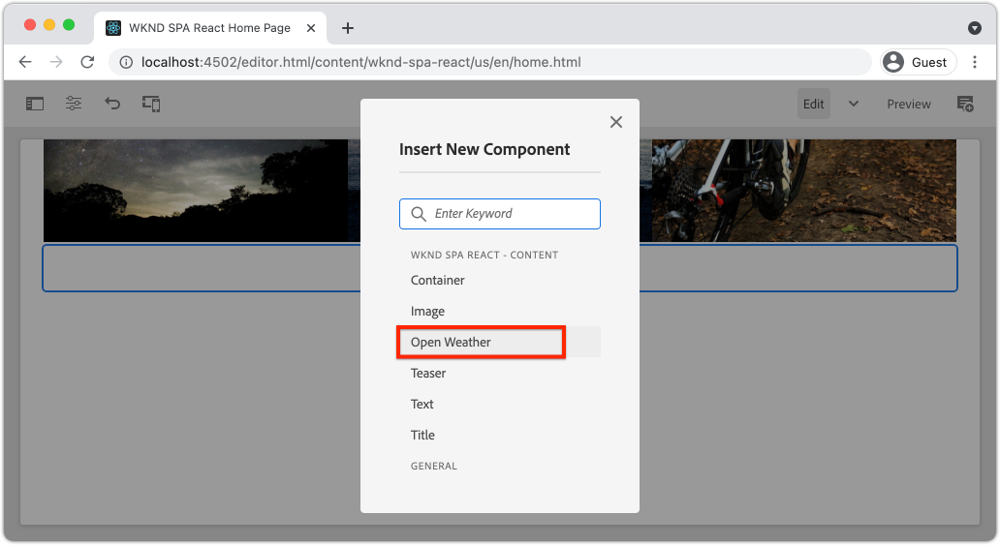

# カスタム WeatherComponent を作成する {#custom-component}

AEM SPA Editor で使用するカスタム天気コンポーネントを作成する方法を説明します。 JSON モデルを拡張してカスタムコンポーネントを設定するためのオーサーダイアログと Sling モデルの開発方法について説明します。 この [オープンウェザー API](https://openweathermap.org) および [React オープンウェザーコンポーネント](https://www.npmjs.com/package/react-open-weather) が使用されます。

## 目的

1. AEMが提供する JSON モデル API を操作する際の Sling モデルの役割を理解します。
2. 新しいAEMコンポーネントダイアログの作成方法を説明します。
3. 作成方法 **カスタム** SPAエディターフレームワークと互換性のあるAEMコンポーネント。

## 作成する内容

簡単な気象コンポーネントが構築されます。 このコンポーネントは、コンテンツ作成者がSPAに追加できます。 作成者は、AEMダイアログを使用して、表示する天気の位置を設定できます。  このコンポーネントの実装は、AEM SPA Editor フレームワークと互換性のある新しいAEMコンポーネントを作成するために必要な手順を示します。


## 前提条件

設定に必要なツールと手順を確認します。 [ローカル開発環境](overview.md#local-dev-environment). この章は、 [ナビゲーションとルーティング](navigation-routing.md) ただし、必要な操作をすべて実行するには、SPA対応AEMプロジェクトをローカルAEMインスタンスにデプロイする必要があります。

### Open Weather API キー

からの API キー [進行中の天気](https://openweathermap.org/) は、チュートリアルに従う必要があります。 [新規登録は無料です](https://home.openweathermap.org/users/sign_up) の呼び出し回数が制限されています。

## AEMコンポーネントの定義

AEMコンポーネントは、ノードおよびプロパティとして定義されます。 プロジェクトでは、これらのノードおよびプロパティは、 `ui.apps` モジュール。 次に、 `ui.apps` モジュール。

>[!NOTE]
>
> に関する簡単なリフレッシャー [AEMコンポーネントの基本が役立つ場合があります](https://experienceleague.adobe.com/docs/experience-manager-learn/getting-started-wknd-tutorial-develop/project-archetype/component-basics.html).

1. 任意の IDE で、 `ui.apps` フォルダー。
2. に移動します。 `ui.apps/src/main/content/jcr_root/apps/wknd-spa-react/components` をクリックし、 `open-weather`.
3. という名前の新しいファイルを作成します。 `.content.xml` の下 `open-weather` フォルダー。 次の項目に `open-weather/.content.xml` を次のように設定します。

   ```xml
   <?xml version="1.0" encoding="UTF-8"?>
   <jcr:root xmlns:sling="http://sling.apache.org/jcr/sling/1.0" xmlns:cq="http://www.day.com/jcr/cq/1.0" xmlns:jcr="http://www.jcp.org/jcr/1.0"
       jcr:primaryType="cq:Component"
       jcr:title="Open Weather"
       componentGroup="WKND SPA React - Content"/>
   ```

   

   `jcr:primaryType="cq:Component"`  — このノードがAEMコンポーネントであることを示します。

   `jcr:title` は、コンテンツ作成者に表示される値で、 `componentGroup` オーサリング UI でのコンポーネントのグループ化を決定します。

4. の `custom-component` フォルダー、名前を付けた別のフォルダーを作成 `_cq_dialog`.
5. の `_cq_dialog` フォルダ作成新しいファイル名： `.content.xml` を設定し、次のように設定します。

   ```xml
   <?xml version="1.0" encoding="UTF-8"?>
   <jcr:root xmlns:sling="http://sling.apache.org/jcr/sling/1.0" xmlns:granite="http://www.adobe.com/jcr/granite/1.0" xmlns:cq="http://www.day.com/jcr/cq/1.0" xmlns:jcr="http://www.jcp.org/jcr/1.0" xmlns:nt="http://www.jcp.org/jcr/nt/1.0"
       jcr:primaryType="nt:unstructured"
       jcr:title="Open Weather"
       sling:resourceType="cq/gui/components/authoring/dialog">
       <content
           jcr:primaryType="nt:unstructured"
           sling:resourceType="granite/ui/components/coral/foundation/container">
           <items jcr:primaryType="nt:unstructured">
               <tabs
                   jcr:primaryType="nt:unstructured"
                   sling:resourceType="granite/ui/components/coral/foundation/tabs"
                   maximized="{Boolean}true">
                   <items jcr:primaryType="nt:unstructured">
                       <properties
                           jcr:primaryType="nt:unstructured"
                           jcr:title="Properties"
                           sling:resourceType="granite/ui/components/coral/foundation/container"
                           margin="{Boolean}true">
                           <items jcr:primaryType="nt:unstructured">
                               <columns
                                   jcr:primaryType="nt:unstructured"
                                   sling:resourceType="granite/ui/components/coral/foundation/fixedcolumns"
                                   margin="{Boolean}true">
                                   <items jcr:primaryType="nt:unstructured">
                                       <column
                                           jcr:primaryType="nt:unstructured"
                                           sling:resourceType="granite/ui/components/coral/foundation/container">
                                           <items jcr:primaryType="nt:unstructured">
                                               <label
                                                   jcr:primaryType="nt:unstructured"
                                                   sling:resourceType="granite/ui/components/coral/foundation/form/textfield"
                                                   fieldDescription="The label to display for the component"
                                                   fieldLabel="Label"
                                                   name="./label"/>
                                               <lat
                                                   jcr:primaryType="nt:unstructured"
                                                   sling:resourceType="granite/ui/components/coral/foundation/form/numberfield"
                                                   fieldDescription="The latitude of the location."
                                                   fieldLabel="Latitude"
                                                   step="any"
                                                   name="./lat" />
                                               <lon
                                                   jcr:primaryType="nt:unstructured"
                                                   sling:resourceType="granite/ui/components/coral/foundation/form/numberfield"
                                                   fieldDescription="The longitude of the location."
                                                   fieldLabel="Longitude"
                                                   step="any"
                                                   name="./lon"/>
                                           </items>
                                       </column>
                                   </items>
                               </columns>
                           </items>
                       </properties>
                   </items>
               </tabs>
           </items>
       </content>
   </jcr:root>
   ```

   

   上記の XML ファイルは、 `Weather Component`. ファイルの重要な部分は、内部 `<label>`, `<lat>` および `<lon>` ノード。 このダイアログには、次の 2 つが含まれます `numberfield`s および a `textfield` これにより、ユーザーは表示する天気を設定できます。

   次に Sling モデルが作成され、の値が公開されます。 `label`,`lat` および `long` JSON モデルを使用したプロパティ。

   >[!NOTE]
   >
   > もっと多くを見ることができます [コアコンポーネントの定義を表示したダイアログの例](https://github.com/adobe/aem-core-wcm-components/tree/master/content/src/content/jcr_root/apps/core/wcm/components). また、 `select`, `textarea`, `pathfield`の `/libs/granite/ui/components/coral/foundation/form` in [CRXDE-Lite](http://localhost:4502/crx/de/index.jsp#/libs/granite/ui/components/coral/foundation/form).

   従来のAEMコンポーネントでは、 [HTL](https://experienceleague.adobe.com/docs/experience-manager-htl/using/overview.html?lang=ja) スクリプトは通常必要です。 SPAはコンポーネントをレンダリングするので、HTL スクリプトは不要です。

## Sling モデルの作成

Sling モデルは、JCR から Java 変数へのデータのマッピングを容易にする注釈駆動の Java「POJO」(Plain Old Java Objects) です。 [Sling モデル](https://experienceleague.adobe.com/docs/experience-manager-learn/getting-started-wknd-tutorial-develop/project-archetype/component-basics.html?lang=en#sling-models) 通常は、AEMコンポーネント用の複雑なサーバー側のビジネスロジックをカプセル化するために関数を使用します。

SPA Editor のコンテキストでは、 Sling Models は、 [Sling Model Exporter](https://experienceleague.adobe.com/docs/experience-manager-learn/foundation/development/develop-sling-model-exporter.html?lang=ja).

1. 任意の IDE で、 `core` モジュール `aem-guides-wknd-spa.react/core`.
1. 次の場所にという名前のファイルを作成します。 `OpenWeatherModel.java` 時刻 `core/src/main/java/com/adobe/aem/guides/wkndspa/react/core/models`.
1. `OpenWeatherModel.java` に以下を入力します。

   ```java
   package com.adobe.aem.guides.wkndspa.react.core.models;
   
   import com.adobe.cq.export.json.ComponentExporter;
   
   // Sling Models intended to be used with SPA Editor must extend ComponentExporter interface
   public interface OpenWeatherModel extends ComponentExporter {
   
       public String getLabel();
   
       public double getLat();
   
       public double getLon();
   
   }
   ```

   これは、コンポーネントの Java インターフェイスです。 Sling Model とSPA Editor フレームワークとの互換性を保つには、を拡張する必要があります。 `ComponentExporter` クラス。

1. という名前のフォルダーを作成します。 `impl` 下 `core/src/main/java/com/adobe/aem/guides/wkndspa/react/core/models`.
1. という名前のファイルを作成します。 `OpenWeatherModelImpl.java` 下 `impl` に以下を入力します。

   ```java
   package com.adobe.aem.guides.wkndspa.react.core.models.impl;
   
   import org.apache.sling.models.annotations.*;
   import org.apache.sling.models.annotations.injectorspecific.ValueMapValue;
   import com.adobe.cq.export.json.ComponentExporter;
   import com.adobe.cq.export.json.ExporterConstants;
   import org.apache.commons.lang3.StringUtils;
   import org.apache.sling.api.SlingHttpServletRequest;
   import com.adobe.aem.guides.wkndspa.react.core.models.OpenWeatherModel;
   
   // Sling Model annotation
   @Model(
       adaptables = SlingHttpServletRequest.class, 
       adapters = { OpenWeatherModel.class, ComponentExporter.class }, 
       resourceType = OpenWeatherModelImpl.RESOURCE_TYPE, 
       defaultInjectionStrategy = DefaultInjectionStrategy.OPTIONAL
       )
   @Exporter( //Exporter annotation that serializes the modoel as JSON
       name = ExporterConstants.SLING_MODEL_EXPORTER_NAME, 
       extensions = ExporterConstants.SLING_MODEL_EXTENSION
       )
   public class OpenWeatherModelImpl implements OpenWeatherModel {
   
       @ValueMapValue
       private String label; //maps variable to jcr property named "label" persisted by Dialog
   
       @ValueMapValue
       private double lat; //maps variable to jcr property named "lat"
   
       @ValueMapValue
       private double lon; //maps variable to jcr property named "lon"
   
       // points to AEM component definition in ui.apps
       static final String RESOURCE_TYPE = "wknd-spa-react/components/open-weather";
   
       // public getter method to expose value of private variable `label`
       // adds additional logic to default the label to "(Default)" if not set.
       @Override
       public String getLabel() {
           return StringUtils.isNotBlank(label) ? label : "(Default)";
       }
   
       // public getter method to expose value of private variable `lat`
       @Override
       public double getLat() {
           return lat;
       }
   
       // public getter method to expose value of private variable `lon`
       @Override
       public double getLon() {
           return lon;
       }
   
       // method required by `ComponentExporter` interface
       // exposes a JSON property named `:type` with a value of `wknd-spa-react/components/open-weather`
       // required to map the JSON export to the SPA component props via the `MapTo`
       @Override
       public String getExportedType() {
           return OpenWeatherModelImpl.RESOURCE_TYPE;
       }
   } 
   ```

   静的変数 `RESOURCE_TYPE` は、 `ui.apps` コンポーネントの。 この `getExportedType()` は、を介して JSON プロパティをSPAコンポーネントにマッピングするために使用されます。 `MapTo`. `@ValueMapValue` は、ダイアログで保存された jcr プロパティを読み取る注釈です。

## SPAの更新

次に、React コードを更新して、 [React オープンウェザーコンポーネント](https://www.npmjs.com/package/react-open-weather) 前の手順で作成したAEMコンポーネントにマッピングします。

1. React Open Weather コンポーネントを **npm** 依存関係：

   ```shell
   $ cd aem-guides-wknd-spa.react/ui.frontend
   $ npm i react-open-weather
   ```

1. という名前の新しいフォルダーを作成します。 `OpenWeather` 時刻 `ui.frontend/src/components/OpenWeather`.
1. という名前のファイルを追加します。 `OpenWeather.js` を設定し、次のように設定します。

   ```js
   import React from 'react';
   import {MapTo} from '@adobe/aem-react-editable-components';
   import ReactWeather, { useOpenWeather } from 'react-open-weather';
   
   // Open weather API Key
   // For simplicity it is hard coded in the file, ideally this is extracted in to an environment variable
   const API_KEY = 'YOUR_API_KEY';
   
   // Logic to render placeholder or component
   const OpenWeatherEditConfig = {
   
       emptyLabel: 'Weather',
       isEmpty: function(props) {
           return !props || !props.lat || !props.lon || !props.label;
       }
   };
   
   // Wrapper function that includes react-open-weather component
   function ReactWeatherWrapper(props) {
       const { data, isLoading, errorMessage } = useOpenWeather({
           key: API_KEY,
           lat: props.lat, // passed in from AEM JSON
           lon: props.lon, // passed in from AEM JSON
           lang: 'en',
           unit: 'imperial', // values are (metric, standard, imperial)
       });
   
       return (
           <div className="cmp-open-weather">
               <ReactWeather
                   isLoading={isLoading}
                   errorMessage={errorMessage}
                   data={data}
                   lang="en"
                   locationLabel={props.label} // passed in from AEM JSON
                   unitsLabels={{ temperature: 'F', windSpeed: 'mph' }}
                   showForecast={false}
                 />
           </div>
       );
   }
   
   export default function OpenWeather(props) {
   
           // render nothing if component not configured
           if(OpenWeatherEditConfig.isEmpty(props)) {
               return null;
           }
   
           // render ReactWeather component if component configured
           // pass props to ReactWeatherWrapper. These props include the mapped properties from AEM JSON
           return ReactWeatherWrapper(props);
   
   }
   
   // Map OpenWeather to AEM component
   MapTo('wknd-spa-react/components/open-weather')(OpenWeather, OpenWeatherEditConfig);
   ```

1. 更新 `import-components.js` 時刻 `ui.frontend/src/components/import-components.js` を含めるには `OpenWeather` コンポーネント：

   ```diff
     // import-component.js
     import './Container/Container';
     import './ExperienceFragment/ExperienceFragment';
   + import './OpenWeather/OpenWeather';
   ```

1. Maven のスキルを使用して、すべてのアップデートをプロジェクトディレクトリのルートからローカルAEM環境にデプロイします。

   ```shell
   $ cd aem-guides-wknd-spa.react
   $ mvn clean install -PautoInstallSinglePackage
   ```

## テンプレートポリシーの更新

次に、AEMに移動して更新を確認し、 `OpenWeather` SPAに追加するコンポーネント。

1. 次の場所に移動して、新しい Sling Model の登録を検証します。 [http://localhost:4502/system/console/status-slingmodels](http://localhost:4502/system/console/status-slingmodels).

   ```plain
   com.adobe.aem.guides.wkndspa.react.core.models.impl.OpenWeatherModelImpl - wknd-spa-react/components/open-weather
   
   com.adobe.aem.guides.wkndspa.react.core.models.impl.OpenWeatherModelImpl exports 'wknd-spa-react/components/open-weather' with selector 'model' and extension '[Ljava.lang.String;@2fd80fc5' with exporter 'jackson'
   ```

   上記の 2 行が、 `OpenWeatherModelImpl` が `wknd-spa-react/components/open-weather` コンポーネントに書き込まれ、Sling Model Exporter を介して登録されていること。

1. SPA Page Template( ) に移動します。 [http://localhost:4502/editor.html/conf/wknd-spa-react/settings/wcm/templates/spa-page-template/structure.html](http://localhost:4502/editor.html/conf/wknd-spa-react/settings/wcm/templates/spa-page-template/structure.html).
1. レイアウトコンテナのポリシーを更新して、新しい `Open Weather` 許可されたコンポーネントとして：

   

   変更をポリシーに保存し、 `Open Weather` 許可されたコンポーネントとして：

   

## オープンウェザーコンポーネントのオーサリング

次に、 `Open Weather` コンポーネントを使用して、AEM SPA Editor を使用します。

1. に移動します。 [http://localhost:4502/editor.html/content/wknd-spa-react/us/en/home.html](http://localhost:4502/editor.html/content/wknd-spa-react/us/en/home.html).
1. In `Edit` モード、 `Open Weather` から `Layout Container`:

   

1. コンポーネントのダイアログを開き、 **ラベル**, **緯度**、および **経度**. 例： **サンディエゴ**, **32.7157**、および **-117.1611**. 西半球と南半球の数は、Open Weather API で負の数として表されます

   

   これは、の章で前述した XML ファイルに基づいて作成されたダイアログです。

1. 変更内容を保存します。～の天気を観察しなさい **サンディエゴ** が表示されました。

   

1. に移動して、JSON モデルを表示します。 [http://localhost:4502/content/wknd-spa-react/us/en.model.json](http://localhost:4502/content/wknd-spa-react/us/en.model.json). を検索 `wknd-spa-react/components/open-weather`:

   ```json
   "open_weather": {
       "label": "San Diego",
       "lat": 32.7157,
       "lon": -117.1611,
       ":type": "wknd-spa-react/components/open-weather"
   }
   ```

   この JSON 値は、Sling モデルによって出力されます。 これらの JSON 値は、prop として React コンポーネントに渡されます。

## おめでとうございます。 {#congratulations}

これで、SPA Editor で使用するカスタムAEMコンポーネントの作成方法を学びました。 また、ダイアログ、JCR プロパティ、Sling モデルが相互にやり取りして JSON モデルを出力する方法についても学びました。

### 次の手順 {#next-steps}

[コアコンポーネントの拡張](extend-component.md)  — 既存のAEMコアコンポーネントを拡張して、AEM SPA Editor で使用する方法を説明します。 既存のコンポーネントにプロパティとコンテンツを追加する方法を理解することは、AEM SPA Editor の実装の機能を拡張するための強力な手法です。
