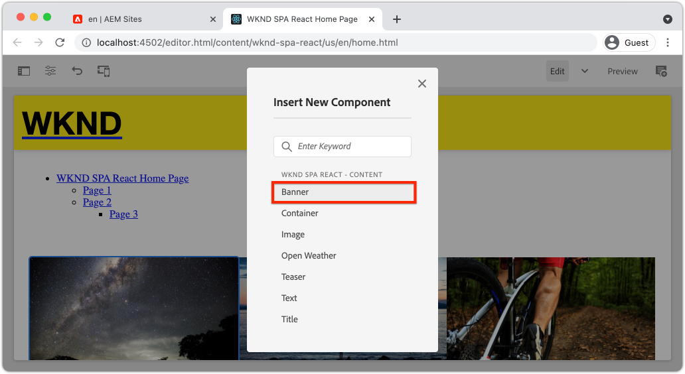

# コアコンポーネントの拡張 {#extend-component}

既存のコアコンポーネントを拡張して、AEM SPA エディターで使用する方法を説明します。 既存のコンポーネントの拡張方法を理解することは、AEM SPA エディター実装の機能をカスタマイズおよび拡張するための強力な手法です。

## 目的

1. 追加のプロパティやコンテンツを使用して、既存のコアコンポーネントを拡張する
2. `sling:resourceSuperType` を使用したコンポーネントの継承の基本を理解する。
3. Sling モデルで[デリゲーションパターン](https://github.com/adobe/aem-core-wcm-components/wiki/Delegation-Pattern-for-Sling-Models)を使用して既存のロジックと機能を再利用する方法を学びます。

## 作成する内容

この章では、新しい `Banner` コンポーネントの要件を満たすために、標準の `Image` コンポーネントに追加のプロパティを追加するのに必要な追加コードについて説明します。`Banner` コンポーネントには標準の `Image` コンポーネントと同じプロパティがすべて含まれていますが、ユーザーが **バナーテキスト** を入力するための追加プロパティが含まれています。


## 前提条件

[ローカル開発環境](overview.md#local-dev-environment)の設定に必要なツールと手順を確認してください。この時点で、チュートリアルのユーザーが AEM SPA エディターの機能を確実に理解していることを前提としています。

## Sling リソーススーパータイプでの継承 {#sling-resource-super-type}

既存のコンポーネントを拡張するには、コンポーネントの定義に `sling:resourceSuperType` という名前のプロパティを設定します。`sling:resourceSuperType`は、別のコンポーネントを指す AEM コンポーネントの定義に設定できる[プロパティ](https://sling.apache.org/documentation/the-sling-engine/resources.html#resource-properties)です。これにより、`sling:resourceSuperType` として識別されるコンポーネントのすべての機能を継承するようにコンポーネントが明示的に設定されます。

`wknd-spa-react/components/image` にある `Image` コンポーネントを拡張したい場合は、`ui.apps` モジュールのコードを更新する必要があります。

1. `ui.apps/src/main/content/jcr_root/apps/wknd-spa-react/components/banner` にある `banner` の `ui.apps` モジュールの下に新しいフォルダーを作成します。
1. `banner` の下に、次のようなコンポーネント定義（`.content.xml`）を作成します。

   ```xml
   <?xml version="1.0" encoding="UTF-8"?>
   <jcr:root xmlns:sling="http://sling.apache.org/jcr/sling/1.0" xmlns:cq="http://www.day.com/jcr/cq/1.0" xmlns:jcr="http://www.jcp.org/jcr/1.0"
       jcr:primaryType="cq:Component"
       jcr:title="Banner"
       sling:resourceSuperType="wknd-spa-react/components/image"
       componentGroup="WKND SPA React - Content"/>
   ```

   これにより、`wknd-spa-react/components/image` のすべての機能を継承するように `wknd-spa-react/components/banner` が設定されます。

## cq:editConfig {#cq-edit-config}

`_cq_editConfig.xml` ファイルは、AEM オーサリング UI でのドラッグ＆ドロップ動作を示します。Image コンポーネントを拡張する場合、リソースタイプがコンポーネント自体に一致することが重要です。

1. `ui.apps` モジュールで、`banner` の下に `_cq_editConfig.xml` という名前の別のファイルを作成します。
1. `_cq_editConfig.xml` に以下の XML を入力します。

   ```xml
   <?xml version="1.0" encoding="UTF-8"?>
   <jcr:root xmlns:sling="http://sling.apache.org/jcr/sling/1.0" xmlns:cq="http://www.day.com/jcr/cq/1.0" xmlns:jcr="http://www.jcp.org/jcr/1.0" xmlns:nt="http://www.jcp.org/jcr/nt/1.0"
       jcr:primaryType="cq:EditConfig">
       <cq:dropTargets jcr:primaryType="nt:unstructured">
           <image
               jcr:primaryType="cq:DropTargetConfig"
               accept="[image/gif,image/jpeg,image/png,image/webp,image/tiff,image/svg\\+xml]"
               groups="[media]"
               propertyName="./fileReference">
               <parameters
                   jcr:primaryType="nt:unstructured"
                   sling:resourceType="wknd-spa-react/components/banner"
                   imageCrop=""
                   imageMap=""
                   imageRotate=""/>
           </image>
       </cq:dropTargets>
       <cq:inplaceEditing
           jcr:primaryType="cq:InplaceEditingConfig"
           active="{Boolean}true"
           editorType="image">
           <inplaceEditingConfig jcr:primaryType="nt:unstructured">
               <plugins jcr:primaryType="nt:unstructured">
                   <crop
                       jcr:primaryType="nt:unstructured"
                       supportedMimeTypes="[image/jpeg,image/png,image/webp,image/tiff]"
                       features="*">
                       <aspectRatios jcr:primaryType="nt:unstructured">
                           <wideLandscape
                               jcr:primaryType="nt:unstructured"
                               name="Wide Landscape"
                               ratio="0.6180"/>
                           <landscape
                               jcr:primaryType="nt:unstructured"
                               name="Landscape"
                               ratio="0.8284"/>
                           <square
                               jcr:primaryType="nt:unstructured"
                               name="Square"
                               ratio="1"/>
                           <portrait
                               jcr:primaryType="nt:unstructured"
                               name="Portrait"
                               ratio="1.6180"/>
                       </aspectRatios>
                   </crop>
                   <flip
                       jcr:primaryType="nt:unstructured"
                       supportedMimeTypes="[image/jpeg,image/png,image/webp,image/tiff]"
                       features="-"/>
                   <map
                       jcr:primaryType="nt:unstructured"
                       supportedMimeTypes="[image/jpeg,image/png,image/webp,image/tiff,image/svg+xml]"
                       features="*"/>
                   <rotate
                       jcr:primaryType="nt:unstructured"
                       supportedMimeTypes="[image/jpeg,image/png,image/webp,image/tiff]"
                       features="*"/>
                   <zoom
                       jcr:primaryType="nt:unstructured"
                       supportedMimeTypes="[image/jpeg,image/png,image/webp,image/tiff]"
                       features="*"/>
               </plugins>
               <ui jcr:primaryType="nt:unstructured">
                   <inline
                       jcr:primaryType="nt:unstructured"
                       toolbar="[crop#launch,rotate#right,history#undo,history#redo,fullscreen#fullscreen,control#close,control#finish]">
                       <replacementToolbars
                           jcr:primaryType="nt:unstructured"
                           crop="[crop#identifier,crop#unlaunch,crop#confirm]"/>
                   </inline>
                   <fullscreen jcr:primaryType="nt:unstructured">
                       <toolbar
                           jcr:primaryType="nt:unstructured"
                           left="[crop#launchwithratio,rotate#right,flip#horizontal,flip#vertical,zoom#reset100,zoom#popupslider]"
                           right="[history#undo,history#redo,fullscreen#fullscreenexit]"/>
                       <replacementToolbars jcr:primaryType="nt:unstructured">
                           <crop
                               jcr:primaryType="nt:unstructured"
                               left="[crop#identifier]"
                               right="[crop#unlaunch,crop#confirm]"/>
                           <map
                               jcr:primaryType="nt:unstructured"
                               left="[map#rectangle,map#circle,map#polygon]"
                               right="[map#unlaunch,map#confirm]"/>
                       </replacementToolbars>
                   </fullscreen>
               </ui>
           </inplaceEditingConfig>
       </cq:inplaceEditing>
   </jcr:root>
   ```

1. このファイルのユニークな点は、resourceType を `wknd-spa-react/components/banner` に設定する `<parameters>` ノードです。

   ```xml
   <parameters
       jcr:primaryType="nt:unstructured"
       sling:resourceType="wknd-spa-react/components/banner"
       imageCrop=""
       imageMap=""
       imageRotate=""/>
   ```

   ほとんどのコンポーネントでは、`_cq_editConfig` は必要ありません。画像コンポーネントと子孫は例外です。

## ダイアログの拡張 {#extend-dialog}

`Banner` コンポーネントでは、`bannerText` をキャプチャするためにダイアログに追加のテキストフィールドが必要です。Sling 継承を使用している場合、[Sling Resource Merger](https://experienceleague.adobe.com/docs/experience-manager-65/developing/platform/sling-resource-merger.html?lang=ja) 機能を使用して、ダイアログの一部を上書きまたは拡張することができます。このサンプルでは、作成者から追加データをキャプチャしてカードコンポーネントに入力するための新しいタブがダイアログに追加されました。

1. `ui.apps` モジュールで、`banner` の下で `_cq_dialog` という名前のフォルダーを作成します。
1. `_cq_dialog` の下に、ダイアログ定義ファイル `.content.xml` を作成します。以下のように記述します。

   ```xml
   <?xml version="1.0" encoding="UTF-8"?>
   <jcr:root xmlns:sling="http://sling.apache.org/jcr/sling/1.0" xmlns:granite="http://www.adobe.com/jcr/granite/1.0" xmlns:cq="http://www.day.com/jcr/cq/1.0" xmlns:jcr="http://www.jcp.org/jcr/1.0" xmlns:nt="http://www.jcp.org/jcr/nt/1.0"
       jcr:primaryType="nt:unstructured"
       jcr:title="Banner"
       sling:resourceType="cq/gui/components/authoring/dialog">
       <content jcr:primaryType="nt:unstructured">
           <items jcr:primaryType="nt:unstructured">
               <tabs jcr:primaryType="nt:unstructured">
                   <items jcr:primaryType="nt:unstructured">
                       <text
                           jcr:primaryType="nt:unstructured"
                           jcr:title="Text"
                           sling:orderBefore="asset"
                           sling:resourceType="granite/ui/components/coral/foundation/container"
                           margin="{Boolean}true">
                           <items jcr:primaryType="nt:unstructured">
                               <columns
                                   jcr:primaryType="nt:unstructured"
                                   sling:resourceType="granite/ui/components/coral/foundation/fixedcolumns"
                                   margin="{Boolean}true">
                                   <items jcr:primaryType="nt:unstructured">
                                       <column
                                           jcr:primaryType="nt:unstructured"
                                           sling:resourceType="granite/ui/components/coral/foundation/container">
                                           <items jcr:primaryType="nt:unstructured">
                                               <textGroup
                                                   granite:hide="${cqDesign.titleHidden}"
                                                   jcr:primaryType="nt:unstructured"
                                                   sling:resourceType="granite/ui/components/coral/foundation/well">
                                                   <items jcr:primaryType="nt:unstructured">
                                                       <bannerText
                                                           jcr:primaryType="nt:unstructured"
                                                           sling:resourceType="granite/ui/components/coral/foundation/form/textfield"
                                                           fieldDescription="Text to display on top of the banner."
                                                           fieldLabel="Banner Text"
                                                           name="./bannerText"/>
                                                   </items>
                                               </textGroup>
                                           </items>
                                       </column>
                                   </items>
                               </columns>
                           </items>
                       </text>
                   </items>
               </tabs>
           </items>
       </content>
   </jcr:root>
   ```

   上記の XML 定義により、**テキストt**&#x200B;という名前の新しいタブが作成され、既存の **Asset** タブの&#x200B;*前*&#x200B;に配置されます。1 つのフィールド「**バナーテキスト**」が含まれます。

1. 最終的なコードは次のようになります。

   

   **アセット**&#x200B;と&#x200B;**メタデータ**&#x200B;のタブを定義する必要がなかったことを確認します。これらは `sling:resourceSuperType` プロパティを介して継承されます。

   ダイアログをプレビューする前に、SPA コンポーネントと `MapTo` 関数を実装する必要があります。

## SPA コンポーネントの実装 {#implement-spa-component}

SPA エディターでバナーコンポーネントを使用するには、`wknd-spa-react/components/banner` にマッピングされる SPA コンポーネントを新規作成する必要があります。これは `ui.frontend` モジュールで実行されます。

1. `ui.frontend` モジュールの `ui.frontend/src/components/Banner` に `Banner` のフォルダーを新規作成します。
1. `Banner` フォルダーの下に `Banner.js` という名前の新規ファイルを作成します。以下のように記述します。

   ```js
   import React, {Component} from 'react';
   import {MapTo} from '@adobe/aem-react-editable-components';
   
   export const BannerEditConfig = {
       emptyLabel: 'Banner',
   
       isEmpty: function(props) {
           return !props || !props.src || props.src.trim().length < 1;
       }
   };
   
   export default class Banner extends Component {
   
       get content() {
           return ;
       }
   
       // display our custom bannerText property!
       get bannerText() {
           if(this.props.bannerText) {
               return <h4>{this.props.bannerText}</h4>;
           }
   
           return null;
       }
   
       render() {
           if (BannerEditConfig.isEmpty(this.props)) {
               return null;
           }
   
           return (
               <div className="Banner">
                   {this.bannerText}
                   <div className="BannerImage">{this.content}</div>
               </div>
           );
       }
   }
   
   MapTo('wknd-spa-react/components/banner')(Banner, BannerEditConfig);
   ```

   この SPA コンポーネントは、作成済みの `wknd-spa-react/components/banner` AEM コンポーネントにマッピングされます。

1. `ui.frontend/src/components/import-components.js` で `import-components.js` を更新して新しい `Banner` SPA コンポーネントを含めます。

   ```diff
     import './ExperienceFragment/ExperienceFragment';
     import './OpenWeather/OpenWeather';
   + import './Banner/Banner';
   ```

1. この時点で、プロジェクトを AEM にデプロイして、ダイアログをテストできます。Maven のスキルを使用してプロジェクトをデプロイします。

   ```shell
   $ cd aem-guides-wknd-spa.react
   $ mvn clean install -PautoInstallSinglePackage
   ```

1. SPA テンプレートのポリシーを更新して、`Banner` コンポーネントを&#x200B;**許可されたコンポーネント**&#x200B;として追加します。

1. SPA ページに移動し、 `Banner` コンポーネントを SPA ページの 1 つに配置します。

   

   >[!NOTE]
   >
   > このダイアログでは、**バナーテキスト**&#x200B;の値を保存できますが、この値は SPA コンポーネントには反映されません。有効にするには、コンポーネントの Sling モデルを拡張する必要があります。

## Java インターフェイスを追加 {#java-interface}

コンポーネントダイアログの値を最終的に React コンポーネントに公開するには、`Banner` コンポーネントの JSON を入力する Sling モデルを更新する必要があります。これは、SPA プロジェクトのすべての Java コードを含む `core` モジュールで行われます。

まず、`Image` Java インターフェイスを拡張する `Banner` の Java インターフェイスを新規作成します。

1. `core` モジュールで、`core/src/main/java/com/adobe/aem/guides/wkndspa/react/core/models` に `BannerModel.java` という名前の新しいファイルを作成します。
1. `BannerModel.java` に以下を入力します。

   ```java
   package com.adobe.aem.guides.wkndspa.react.core.models;
   
   import com.adobe.cq.wcm.core.components.models.Image;
   import org.osgi.annotation.versioning.ProviderType;
   
   @ProviderType
   public interface BannerModel extends Image {
   
       public String getBannerText();
   
   }
   ```

   これにより、コアコンポーネント `Image` インターフェイスからすべてのメソッドが継承され、1 つの新しいメソッド `getBannerText()` が追加されます。

## Sling モデルの実装 {#sling-model}

次に、`BannerModel` インターフェイスの Sling モデルを実装します。

1. `core` モジュールで、`core/src/main/java/com/adobe/aem/guides/wkndspa/react/core/models/impl` に `BannerModelImpl.java` という名前のファイルを新規作成します。

1. `BannerModelImpl.java` に以下を入力します。

   ```java
   package com.adobe.aem.guides.wkndspa.react.core.models.impl;
   
   import com.adobe.aem.guides.wkndspa.react.core.models.BannerModel;
   import com.adobe.cq.export.json.ComponentExporter;
   import com.adobe.cq.export.json.ExporterConstants;
   import com.adobe.cq.wcm.core.components.models.Image;
   import org.apache.sling.models.annotations.*;
   import org.apache.sling.api.SlingHttpServletRequest;
   import org.apache.sling.models.annotations.Model;
   import org.apache.sling.models.annotations.injectorspecific.Self;
   import org.apache.sling.models.annotations.injectorspecific.ValueMapValue;
   import org.apache.sling.models.annotations.via.ResourceSuperType;
   
   @Model(
       adaptables = SlingHttpServletRequest.class, 
       adapters = { BannerModel.class,ComponentExporter.class}, 
       resourceType = BannerModelImpl.RESOURCE_TYPE, 
       defaultInjectionStrategy = DefaultInjectionStrategy.OPTIONAL
   )
   @Exporter(name = ExporterConstants.SLING_MODEL_EXPORTER_NAME, extensions = ExporterConstants.SLING_MODEL_EXTENSION)
   public class BannerModelImpl implements BannerModel {
   
       // points to the the component resource path in ui.apps
       static final String RESOURCE_TYPE = "wknd-spa-react/components/banner";
   
       @Self
       private SlingHttpServletRequest request;
   
       // With sling inheritance (sling:resourceSuperType) we can adapt the current resource to the Image class
       // this allows us to re-use all of the functionality of the Image class, without having to implement it ourself
       // see https://github.com/adobe/aem-core-wcm-components/wiki/Delegation-Pattern-for-Sling-Models
       @Self
       @Via(type = ResourceSuperType.class)
       private Image image;
   
       // map the property saved by the dialog to a variable named `bannerText`
       @ValueMapValue
       private String bannerText;
   
       // public getter to expose the value of `bannerText` via the Sling Model and JSON output
       @Override
       public String getBannerText() {
           return bannerText;
       }
   
       // Re-use the Image class for all other methods:
   
       @Override
       public String getSrc() {
           return null != image ? image.getSrc() : null;
       }
   
       @Override
       public String getAlt() {
           return null != image ? image.getAlt() : null;
       }
   
       @Override
       public String getTitle() {
           return null != image ? image.getTitle() : null;
       }
   
       // method required by `ComponentExporter` interface
       // exposes a JSON property named `:type` with a value of `wknd-spa-react/components/banner`
       // required to map the JSON export to the SPA component props via the `MapTo`
       @Override
       public String getExportedType() {
           return BannerModelImpl.RESOURCE_TYPE;
       }
   }
   ```

   `@Model` および `@Exporter` 注釈を使用して、Sling モデルエクスポーターを介して Sling モデルを JSON としてシリアル化できることを確認してください。

   `BannerModelImpl.java` は [Sling Model のデリゲーションパターン](https://github.com/adobe/aem-core-wcm-components/wiki/Delegation-Pattern-for-Sling-Models)を使用して、画像コアコンポーネントからのロジックの書き換えを回避します。

1. 次の行を確認します。

   ```java
   @Self
   @Via(type = ResourceSuperType.class)
   private Image image;
   ```

   上記の注釈は、`Banner` コンポーネントの `sling:resourceSuperType` 継承に基づいて `image` という名前の画像オブジェクトをインスタンス化します。

   ```java
   @Override
   public String getSrc() {
       return null != image ? image.getSrc() : null;
   }
   ```

   その場合、`image` オブジェクトを使用して `Image` インターフェイスで定義されたメソッドを実装することができるので、自分でロジックを書く必要はありません。この手法は、`getSrc()`、`getAlt()`、`getTitle()` に使用されます。

1. ターミナルウィンドウを開き、`core` ディレクトリの Maven `autoInstallBundle` プロファイルを使用して `core` モジュールへの更新のみをデプロイします。

   ```shell
   $ cd core/
   $ mvn clean install -PautoInstallBundle
   ```

## まとめ {#put-together}

1. AEMに戻り、`Banner` コンポーネントを含む SPA ページを開きます。
1. `Banner` コンポーネントを更新して、**バナーテキストt**&#x200B;を含めます。

   

1. コンポーネントに画像を入力します。

   

   ダイアログの更新を保存します。

1. これで、**バナーテキスト**&#x200B;のレンダリング値が表示されます。


1. [http://localhost:4502/content/wknd-spa-angular/us/en.model.json](http://localhost:4502/content/wknd-spa-react/us/en.model.json) で JSON モデルの応答を確認し、`wknd-spa-react/components/card` を検索します。

   ```json
   "banner": {
       "bannerText": "My Banner Text",
       "src": "/content/wknd-spa-react/us/en/home/_jcr_content/root/responsivegrid/banner.coreimg.jpeg/1622167884688/sport-climbing.jpeg",
       "alt": "alt banner rock climber",
       ":type": "wknd-spa-react/components/banner"
    },
   ```

   `BannerModelImpl.java` で Sling モデルを実装した後、追加のキーと値のペアで JSON モデルが更新されていることに注目してください。

## おめでとうございます。 {#congratulations}

これで、AEM コンポーネントの拡張方法と、Sling モデルとダイアログが JSON モデルと連携する仕組みを学びました。
