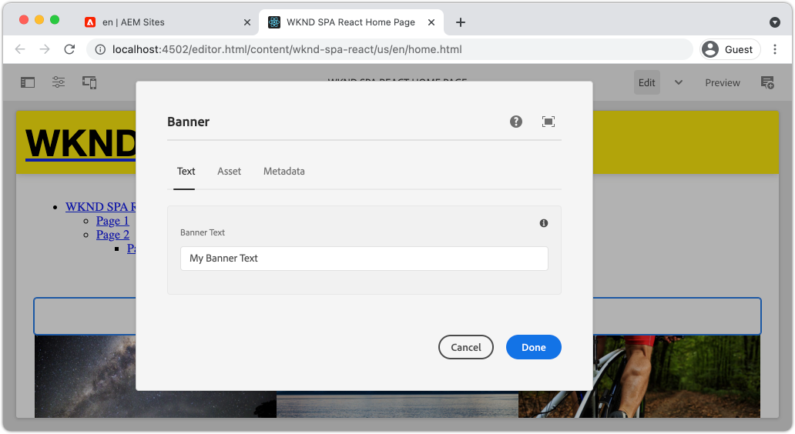

# コアコンポーネントの拡張{#extend-component}

既存のコアコンポーネントを拡張してAEM SPA Editorで使用する方法を説明します。 既存のコンポーネントの拡張方法を理解することは、AEM SPA Editor実装の機能をカスタマイズおよび拡張する強力な手法です。

## 目的

1. 追加のプロパティとコンテンツを使用して、既存のコアコンポーネントを拡張します。
2. `sling:resourceSuperType`を使用して、コンポーネントの継承の基本を理解します。
3. Slingモデルの[委任パターン](https://github.com/adobe/aem-core-wcm-components/wiki/Delegation-Pattern-for-Sling-Models)を活用して、既存のロジックと機能を再利用する方法を説明します。

## 作成する内容

この章では、新しい`Banner`コンポーネントの要件を満たすために、標準の`Image`コンポーネントに追加のプロパティを追加するために必要な追加コードを示します。 `Banner`コンポーネントには、標準の`Image`コンポーネントと同じプロパティがすべて含まれますが、**バナーテキスト**&#x200B;に入力するための追加のプロパティが含まれています。


## 前提条件

[ローカル開発環境](overview.md#local-dev-environment)の設定に必要なツールと手順を確認します。 この時点で、チュートリアルのユーザーがAEM SPA Editorの機能について明確に理解していることを前提としています。

## Slingリソーススーパータイプ{#sling-resource-super-type}による継承

既存のコンポーネントを拡張するには、コンポーネントの定義に`sling:resourceSuperType`という名前のプロパティを設定します。  `sling:resourceSuperType`は、別のコ [](https://sling.apache.org/documentation/the-sling-engine/resources.html#resource-properties) ンポーネントを指すAEMコンポーネントの定義に設定できるプロパティです。これにより、`sling:resourceSuperType`と識別されたコンポーネントのすべての機能を継承するようにコンポーネントを明示的に設定します。

`Image`コンポーネントを`wknd-spa-react/components/image`で拡張する場合は、`ui.apps`モジュールのコードを更新する必要があります。

1. `ui.apps`モジュールの下に、`ui.apps/src/main/content/jcr_root/apps/wknd-spa-react/components/banner`に`banner`用の新しいフォルダーを作成します。
1. `banner`の下に、次のようなコンポーネント定義(`.content.xml`)を作成します。

   ```xml
   <?xml version="1.0" encoding="UTF-8"?>
   <jcr:root xmlns:sling="http://sling.apache.org/jcr/sling/1.0" xmlns:cq="http://www.day.com/jcr/cq/1.0" xmlns:jcr="http://www.jcp.org/jcr/1.0"
       jcr:primaryType="cq:Component"
       jcr:title="Banner"
       sling:resourceSuperType="wknd-spa-react/components/image"
       componentGroup="WKND SPA React - Content"/>
   ```

   これにより、`wknd-spa-react/components/banner`が`wknd-spa-react/components/image`のすべての機能を継承するよう設定されます。

## cq:editConfig {#cq-edit-config}

`_cq_editConfig.xml`ファイルは、AEMオーサリングUIでのドラッグ&amp;ドロップ動作を指示します。 画像コンポーネントを拡張する場合、リソースタイプがコンポーネント自体に一致することが重要です。

1. `ui.apps`モジュールで、`banner`の下に`_cq_editConfig.xml`という名前の別のファイルを作成します。
1. `_cq_editConfig.xml`に次のXMLを入力します。

   ```xml
   <?xml version="1.0" encoding="UTF-8"?>
   <jcr:root xmlns:sling="http://sling.apache.org/jcr/sling/1.0" xmlns:cq="http://www.day.com/jcr/cq/1.0" xmlns:jcr="http://www.jcp.org/jcr/1.0" xmlns:nt="http://www.jcp.org/jcr/nt/1.0"
       jcr:primaryType="cq:EditConfig">
       <cq:dropTargets jcr:primaryType="nt:unstructured">
           <image
               jcr:primaryType="cq:DropTargetConfig"
               accept="[image/gif,image/jpeg,image/png,image/webp,image/tiff,image/svg\\+xml]"
               groups="[media]"
               propertyName="./fileReference">
               <parameters
                   jcr:primaryType="nt:unstructured"
                   sling:resourceType="wknd-spa-react/components/banner"
                   imageCrop=""
                   imageMap=""
                   imageRotate=""/>
           </image>
       </cq:dropTargets>
       <cq:inplaceEditing
           jcr:primaryType="cq:InplaceEditingConfig"
           active="{Boolean}true"
           editorType="image">
           <inplaceEditingConfig jcr:primaryType="nt:unstructured">
               <plugins jcr:primaryType="nt:unstructured">
                   <crop
                       jcr:primaryType="nt:unstructured"
                       supportedMimeTypes="[image/jpeg,image/png,image/webp,image/tiff]"
                       features="*">
                       <aspectRatios jcr:primaryType="nt:unstructured">
                           <wideLandscape
                               jcr:primaryType="nt:unstructured"
                               name="Wide Landscape"
                               ratio="0.6180"/>
                           <landscape
                               jcr:primaryType="nt:unstructured"
                               name="Landscape"
                               ratio="0.8284"/>
                           <square
                               jcr:primaryType="nt:unstructured"
                               name="Square"
                               ratio="1"/>
                           <portrait
                               jcr:primaryType="nt:unstructured"
                               name="Portrait"
                               ratio="1.6180"/>
                       </aspectRatios>
                   </crop>
                   <flip
                       jcr:primaryType="nt:unstructured"
                       supportedMimeTypes="[image/jpeg,image/png,image/webp,image/tiff]"
                       features="-"/>
                   <map
                       jcr:primaryType="nt:unstructured"
                       supportedMimeTypes="[image/jpeg,image/png,image/webp,image/tiff,image/svg+xml]"
                       features="*"/>
                   <rotate
                       jcr:primaryType="nt:unstructured"
                       supportedMimeTypes="[image/jpeg,image/png,image/webp,image/tiff]"
                       features="*"/>
                   <zoom
                       jcr:primaryType="nt:unstructured"
                       supportedMimeTypes="[image/jpeg,image/png,image/webp,image/tiff]"
                       features="*"/>
               </plugins>
               <ui jcr:primaryType="nt:unstructured">
                   <inline
                       jcr:primaryType="nt:unstructured"
                       toolbar="[crop#launch,rotate#right,history#undo,history#redo,fullscreen#fullscreen,control#close,control#finish]">
                       <replacementToolbars
                           jcr:primaryType="nt:unstructured"
                           crop="[crop#identifier,crop#unlaunch,crop#confirm]"/>
                   </inline>
                   <fullscreen jcr:primaryType="nt:unstructured">
                       <toolbar
                           jcr:primaryType="nt:unstructured"
                           left="[crop#launchwithratio,rotate#right,flip#horizontal,flip#vertical,zoom#reset100,zoom#popupslider]"
                           right="[history#undo,history#redo,fullscreen#fullscreenexit]"/>
                       <replacementToolbars jcr:primaryType="nt:unstructured">
                           <crop
                               jcr:primaryType="nt:unstructured"
                               left="[crop#identifier]"
                               right="[crop#unlaunch,crop#confirm]"/>
                           <map
                               jcr:primaryType="nt:unstructured"
                               left="[map#rectangle,map#circle,map#polygon]"
                               right="[map#unlaunch,map#confirm]"/>
                       </replacementToolbars>
                   </fullscreen>
               </ui>
           </inplaceEditingConfig>
       </cq:inplaceEditing>
   </jcr:root>
   ```

1. ファイルの固有の側面は、resourceTypeを`wknd-spa-react/components/banner`に設定する`<parameters>`ノードです。

   ```xml
   <parameters
       jcr:primaryType="nt:unstructured"
       sling:resourceType="wknd-spa-react/components/banner"
       imageCrop=""
       imageMap=""
       imageRotate=""/>
   ```

   ほとんどのコンポーネントには`_cq_editConfig`は必要ありません。 画像コンポーネントと子孫は例外です。

## ダイアログ{#extend-dialog}の拡張

`Banner`コンポーネントでは、`bannerText`を取り込むために、ダイアログに追加のテキストフィールドが必要です。 Sling継承を使用しているので、[Sling Resource Merger](https://experienceleague.adobe.com/docs/experience-manager-65/developing/platform/sling-resource-merger.html?lang=ja)の機能を使用して、ダイアログの一部を上書きまたは拡張できます。 このサンプルでは、作成者から追加データを取り込み、カードコンポーネントに入力するための新しいタブがダイアログに追加されています。

1. `ui.apps`モジュールの`banner`フォルダーの下に、`_cq_dialog`という名前のフォルダーを作成します。
1. `_cq_dialog`の下に、ダイアログ定義ファイル`.content.xml`を作成します。 以下のように記述します。

   ```xml
   <?xml version="1.0" encoding="UTF-8"?>
   <jcr:root xmlns:sling="http://sling.apache.org/jcr/sling/1.0" xmlns:granite="http://www.adobe.com/jcr/granite/1.0" xmlns:cq="http://www.day.com/jcr/cq/1.0" xmlns:jcr="http://www.jcp.org/jcr/1.0" xmlns:nt="http://www.jcp.org/jcr/nt/1.0"
       jcr:primaryType="nt:unstructured"
       jcr:title="Banner"
       sling:resourceType="cq/gui/components/authoring/dialog">
       <content jcr:primaryType="nt:unstructured">
           <items jcr:primaryType="nt:unstructured">
               <tabs jcr:primaryType="nt:unstructured">
                   <items jcr:primaryType="nt:unstructured">
                       <text
                           jcr:primaryType="nt:unstructured"
                           jcr:title="Text"
                           sling:orderBefore="asset"
                           sling:resourceType="granite/ui/components/coral/foundation/container"
                           margin="{Boolean}true">
                           <items jcr:primaryType="nt:unstructured">
                               <columns
                                   jcr:primaryType="nt:unstructured"
                                   sling:resourceType="granite/ui/components/coral/foundation/fixedcolumns"
                                   margin="{Boolean}true">
                                   <items jcr:primaryType="nt:unstructured">
                                       <column
                                           jcr:primaryType="nt:unstructured"
                                           sling:resourceType="granite/ui/components/coral/foundation/container">
                                           <items jcr:primaryType="nt:unstructured">
                                               <textGroup
                                                   granite:hide="${cqDesign.titleHidden}"
                                                   jcr:primaryType="nt:unstructured"
                                                   sling:resourceType="granite/ui/components/coral/foundation/well">
                                                   <items jcr:primaryType="nt:unstructured">
                                                       <bannerText
                                                           jcr:primaryType="nt:unstructured"
                                                           sling:resourceType="granite/ui/components/coral/foundation/form/textfield"
                                                           fieldDescription="Text to display on top of the banner."
                                                           fieldLabel="Banner Text"
                                                           name="./bannerText"/>
                                                   </items>
                                               </textGroup>
                                           </items>
                                       </column>
                                   </items>
                               </columns>
                           </items>
                       </text>
                   </items>
               </tabs>
           </items>
       </content>
   </jcr:root>
   ```

   上記のXML定義では、**Text**&#x200B;という名前の新しいタブが作成され、**&#x200B;の前に&#x200B;**Asset**&#x200B;という名前のタブが並べられます。 1つのフィールド&#x200B;**バナーテキスト**&#x200B;が含まれます。

1. ダイアログは次のようになります。

   

   **Asset**&#x200B;または&#x200B;**Metadata**&#x200B;のタブを定義する必要がないことを確認します。 これらは`sling:resourceSuperType`プロパティを介して継承されます。

   ダイアログをプレビューする前に、SPAコンポーネントと`MapTo`関数を実装する必要があります。

## SPAコンポーネント{#implement-spa-component}の実装

SPAエディターでバナーコンポーネントを使用するには、`wknd-spa-react/components/banner`にマッピングする新しいSPAコンポーネントを作成する必要があります。 これは`ui.frontend`モジュールで行います。

1. `ui.frontend`モジュールで、`ui.frontend/src/components/Banner`に`Banner`用の新しいフォルダーを作成します。
1. `Banner`フォルダーの下に`Banner.js`という名前の新しいファイルを作成します。 以下のように記述します。

   ```js
   import React, {Component} from 'react';
   import {MapTo} from '@adobe/aem-react-editable-components';
   
   export const BannerEditConfig = {
   
       emptyLabel: 'Banner',
   
       isEmpty: function(props) {
           return !props || !props.src || props.src.trim().length < 1;
       }
   };
   
   export default class Banner extends Component {
   
       get content() {
           return ;
       }
   
       // display our custom bannerText property!
       get bannerText() {
           if(this.props.bannerText) {
               return <h4>{this.props.bannerText}</h4>;
           }
   
           return null;
       }
   
       render() {
           if(BannerEditConfig.isEmpty(this.props)) {
               return null;
           }
   
           return (
               <div className="Banner">
                   {this.bannerText}
                   <div className="BannerImage">{this.content}</div>
               </div>
           );
       }
   }
   
   MapTo('wknd-spa-react/components/banner')(Banner, BannerEditConfig);
   ```

   このSPAコンポーネントは、前に作成したAEMコンポーネント`wknd-spa-react/components/banner`にマッピングされます。

1. `ui.frontend/src/components/import-components.js`の`import-components.js`を更新して、新しい`Banner` SPAコンポーネントを含めます。

   ```diff
     import './ExperienceFragment/ExperienceFragment';
     import './OpenWeather/OpenWeather';
   + import './Banner/Banner';
   ```

1. この時点で、プロジェクトをAEMにデプロイして、ダイアログをテストできます。 Mavenのスキルを使用してプロジェクトをデプロイします。

   ```shell
   $ cd aem-guides-wknd-spa.react
   $ mvn clean install -PautoInstallSinglePackage
   ```

1. SPAテンプレートのポリシーを更新し、`Banner`コンポーネントを&#x200B;**許可されたコンポーネント**&#x200B;として追加します。

1. SPAページに移動し、次のいずれかのSPAページに`Banner`コンポーネントを追加します。

   

   >[!NOTE]
   >
   > このダイアログでは、**Banner Text**&#x200B;の値を保存できますが、この値はSPAコンポーネントには反映されません。 有効にするには、コンポーネントのSling Modelを拡張する必要があります。

## Javaインターフェイスの追加{#java-interface}

最終的にコンポーネントダイアログの値をReactコンポーネントに公開するには、`Banner`コンポーネントのJSONを入力するSling Modelを更新する必要があります。 これは、SPAプロジェクトのすべてのJavaコードを含む`core`モジュールで実行されます。

まず、`Image` Javaインターフェイスを拡張する`Banner`用の新しいJavaインターフェイスを作成します。

1. `core`モジュールで、`core/src/main/java/com/adobe/aem/guides/wkndspa/react/core/models`に`BannerModel.java`という名前の新しいファイルを作成します。
1. `BannerModel.java` に以下を入力します。

   ```java
   package com.adobe.aem.guides.wkndspa.react.core.models;
   
   import com.adobe.cq.wcm.core.components.models.Image;
   import org.osgi.annotation.versioning.ProviderType;
   
   @ProviderType
   public interface BannerModel extends Image {
   
       public String getBannerText();
   
   }
   ```

   これにより、すべてのメソッドがコアコンポーネントの`Image`インターフェイスから継承され、新しいメソッド`getBannerText()`が1つ追加されます。

## Slingモデル{#sling-model}の実装

次に、`BannerModel`インターフェイス用のSling Modelを実装します。

1. `core`モジュールで、`core/src/main/java/com/adobe/aem/guides/wkndspa/react/core/models/impl`に`BannerModelImpl.java`という名前の新しいファイルを作成します。

1. `BannerModelImpl.java` に以下を入力します。

   ```java
   package com.adobe.aem.guides.wkndspa.react.core.models.impl;
   
   import com.adobe.aem.guides.wkndspa.react.core.models.BannerModel;
   import com.adobe.cq.export.json.ComponentExporter;
   import com.adobe.cq.export.json.ExporterConstants;
   import com.adobe.cq.wcm.core.components.models.Image;
   import org.apache.sling.models.annotations.*;
   import org.apache.sling.api.SlingHttpServletRequest;
   import org.apache.sling.models.annotations.Model;
   import org.apache.sling.models.annotations.injectorspecific.Self;
   import org.apache.sling.models.annotations.injectorspecific.ValueMapValue;
   import org.apache.sling.models.annotations.via.ResourceSuperType;
   
   @Model(
       adaptables = SlingHttpServletRequest.class, 
       adapters = { BannerModel.class,ComponentExporter.class}, 
       resourceType = BannerModelImpl.RESOURCE_TYPE, 
       defaultInjectionStrategy = DefaultInjectionStrategy.OPTIONAL
       )
   @Exporter(name = ExporterConstants.SLING_MODEL_EXPORTER_NAME, extensions = ExporterConstants.SLING_MODEL_EXTENSION)
   public class BannerModelImpl implements BannerModel {
   
       // points to the the component resource path in ui.apps
       static final String RESOURCE_TYPE = "wknd-spa-react/components/banner";
   
       @Self
       private SlingHttpServletRequest request;
   
       // With sling inheritance (sling:resourceSuperType) we can adapt the current resource to the Image class
       // this allows us to re-use all of the functionality of the Image class, without having to implement it ourself
       // see https://github.com/adobe/aem-core-wcm-components/wiki/Delegation-Pattern-for-Sling-Models
       @Self
       @Via(type = ResourceSuperType.class)
       private Image image;
   
       // map the property saved by the dialog to a variable named `bannerText`
       @ValueMapValue
       private String bannerText;
   
       // public getter to expose the value of `bannerText` via the Sling Model and JSON output
       @Override
       public String getBannerText() {
           return bannerText;
       }
   
       // Re-use the Image class for all other methods:
   
       @Override
       public String getSrc() {
           return null != image ? image.getSrc() : null;
       }
   
       @Override
       public String getAlt() {
           return null != image ? image.getAlt() : null;
       }
   
       @Override
       public String getTitle() {
           return null != image ? image.getTitle() : null;
       }
   
   
       // method required by `ComponentExporter` interface
       // exposes a JSON property named `:type` with a value of `wknd-spa-react/components/banner`
       // required to map the JSON export to the SPA component props via the `MapTo`
       @Override
       public String getExportedType() {
           return BannerModelImpl.RESOURCE_TYPE;
       }
   
   }
   ```

   `@Model`および`@Exporter`注釈を使用して、Sling Model Exporterを介してSling ModelをJSONとしてシリアル化できることに注意してください。

   `BannerModelImpl.java` は、Sling Modelの委 [任パターンを使用](https://github.com/adobe/aem-core-wcm-components/wiki/Delegation-Pattern-for-Sling-Models) して、画像コアコンポーネントからすべてのロジックが書き換えられないようにします。

1. 次の行を確認します。

   ```java
   @Self
   @Via(type = ResourceSuperType.class)
   private Image image;
   ```

   上記の注釈は、`Banner`コンポーネントの`sling:resourceSuperType`継承に基づいて、`image`という名前の画像オブジェクトをインスタンス化します。

   ```java
   @Override
   public String getSrc() {
       return null != image ? image.getSrc() : null;
   }
   ```

   その後、`image`オブジェクトを使用するだけで、ロジックを自分で書く必要なく、`Image`インターフェイスで定義されたメソッドを実装できます。 この手法は、`getSrc()`、`getAlt()`および`getTitle()`に使用されます。

1. ターミナルウィンドウを開き、`core`ディレクトリのMaven `autoInstallBundle`プロファイルを使用して、`core`モジュールの更新のみをデプロイします。

   ```shell
   $ cd core/
   $ mvn clean install -PautoInstallBundle
   ```

## まとめ {#put-together}

1. AEMに戻り、`Banner`コンポーネントを含むSPAページを開きます。
1. `Banner`コンポーネントを更新して、**Banner Text**&#x200B;を含めます。

   

1. コンポーネントに画像を設定します。

   

   ダイアログの更新を保存します。

1. これで、**バナーテキスト**&#x200B;のレンダリング値が表示されます。

   

1. JSONモデルの応答を次の場所に表示します。[http://localhost:4502/content/wknd-spa-react/us/en.model.json](http://localhost:4502/content/wknd-spa-react/us/en.model.json)を探し、`wknd-spa-react/components/card`を探します。

   ```json
   "banner": {
       "bannerText": "My Banner Text",
       "src": "/content/wknd-spa-react/us/en/home/_jcr_content/root/responsivegrid/banner.coreimg.jpeg/1622167884688/sport-climbing.jpeg",
       "alt": "alt banner rock climber",
       ":type": "wknd-spa-react/components/banner"
    },
   ```

   JSONモデルは、`BannerModelImpl.java`にSlingモデルを実装した後、追加のキーと値のペアで更新されます。

## バリデーターが {#congratulations}

これで、を使用してAEMコンポーネントを拡張する方法と、SlingのモデルとダイアログがJSONモデルと連携する方法を学びました。

