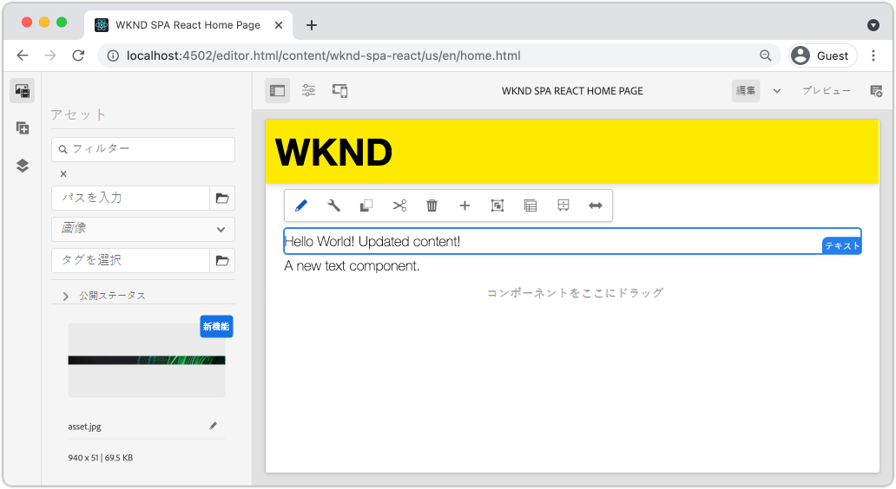
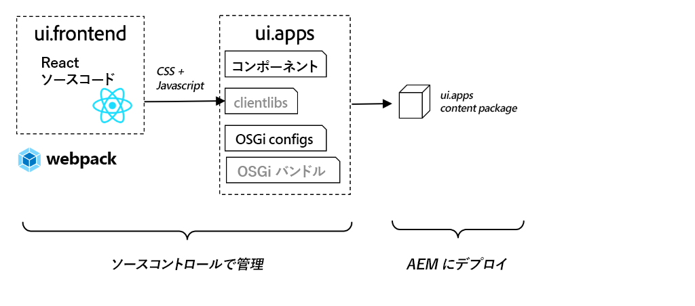
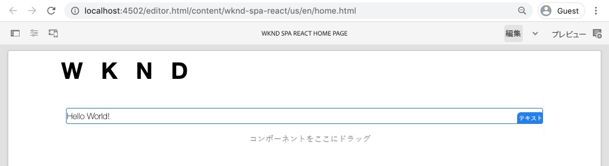
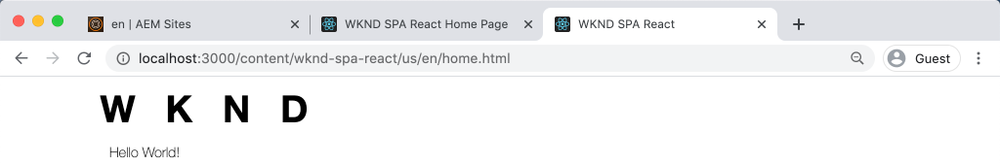

# SPA を統合 {#developer-workflow}

React で記述された単一ページアプリケーション（SPA）のソースコードを Adobe Experience Manager（AEM）プロジェクトと統合する方法を説明します。webpack 開発サーバーなどの最新のフロントエンドツールを使用して、AEM JSON モデル API に対する SPA を迅速に開発する方法を説明します。

## 目的

1. SPA プロジェクトが AEM とクライアントサイドライブラリを統合する仕組みを説明します。
2. 専用のフロントエンド開発に Webpack 開発サーバーを使用する方法を説明します。
3. AEM JSON モデル API に対して開発するための&#x200B;**プロキシ**&#x200B;および静的&#x200B;**モック**&#x200B;ファイルの使用を調べます。

## 作成する内容

この章では、SPA が AEM とどのように統合されているかを理解するために、SPA にいくつかの小さな変更を加えます。
この章では、簡単な `Header` コンポーネントを SPA に追加します。この **静的** `Header` コンポーネントを構築するプロセスでは、AEM SPA 開発に対していくつかのアプローチを使用します。



*SPA を拡張して静的 `Header` コンポーネントを追加する*

## 前提条件

[ローカル開発環境](overview.md#local-dev-environment)を設定するために必要なツールや説明を確認してください。この章は[プロジェクトを作成](create-project.md)の章の続きですが、SPA 対応の、動作している AEM プロジェクトさえあれば内容についていくことができます。

## アプローチの統合 {#integration-approach}

AEM プロジェクトの一部として、`ui.apps` および `ui.frontend` の 2 つのモジュールが作成されました。

`ui.frontend` モジュールは、すべての SPA ソースコードを含む [webpack](https://webpack.js.org/) プロジェクトです。SPA の開発とテストの大部分は、webpack プロジェクトで行われます。 実稼動ビルドがトリガーされると、SPA は webpack を使用して構築およびコンパイルされます。コンパイル済みのアーティファクト（CSS および JavaScript）が `ui.apps` モジュールにコピーされ、AEM ランタイムにデプロイされます。



*SPA 統合の大まかな概要を示します。*

フロントエンドビルドに関する追加情報は、[こちらを参照](https://experienceleague.adobe.com/docs/experience-manager-core-components/using/developing/archetype/uifrontend-react.html?lang=ja)してください。

## SPA 統合を検査する {#inspect-spa-integration}

次に、`ui.frontend` モジュールを調べて、[AEM プロジェクトアーキタイプ](https://experienceleague.adobe.com/docs/experience-manager-core-components/using/developing/archetype/uifrontend-react.html?lang=ja)によって自動生成された SPA を理解します。

1. 任意の IDE で、AEM プロジェクトを開きます。このチュートリアルでは、 [Visual Studio Code IDE](https://experienceleague.adobe.com/docs/experience-manager-learn/cloud-service/local-development-environment-set-up/development-tools.html?lang=ja#microsoft-visual-studio-code) を使用します。

   

1. `ui.frontend` フォルダーを展開して調べます。`ui.frontend/package.json` をファイルを開きます。

1. `dependencies` の下に、`react-scripts` を含む `react` に関連するいくつかの項目が表示されます。

   `ui.frontend` は [Create React App](https://create-react-app.dev/)（略して CRA）に基づく React アプリケーションです。`react-scripts` バージョンは、使用される CRA のバージョンを示します。

1. また、`@adobe` プレフィックスが付いた複数の依存関係もあります。

   ```json
   "@adobe/aem-react-editable-components": "~1.1.2",
   "@adobe/aem-spa-component-mapping": "~1.1.0",
   "@adobe/aem-spa-page-model-manager": "~1.3.3",
   "@adobe/aem-core-components-react-base": "1.1.8",
   "@adobe/aem-core-components-react-spa": "1.1.7",
   ```

   上記のモジュールは、[AEM SPA Editor JS SDK](https://experienceleague.adobe.com/docs/experience-manager-65/developing/spas/spa-blueprint.html?lang=ja) を構成し、SPA コンポーネントを AEM コンポーネントにマッピングできる機能を提供します。

   また、[AEM WCM コンポーネント - React コア実装](https://github.com/adobe/aem-react-core-wcm-components-base)および [AEM WCM コンポーネント - Spa エディター - React コア実装](https://github.com/adobe/aem-react-core-wcm-components-spa)も含まれます。これらは、すぐに使用できる AEM コンポーネントのセットにマッピングされる、再利用可能な UI コンポーネントです。 これらは、そのまま使用するように設計され、プロジェクトのニーズに合わせてスタイルが設定されます。

1. `package.json` ファイルには複数の `scripts` が定義されています。

   ```json
   "scripts": {
       "start": "react-scripts start",
       "build": "react-scripts build && clientlib",
       "test": "react-scripts test",
       "eject": "react-scripts eject",
   }
   ```

   これらは、Create React アプリによって[利用可能](https://create-react-app.dev/docs/available-scripts)になった標準ビルドスクリプトです。

   唯一の違いは `build` スクリプトに `&& clientlib` が追加されたことです。この追加の命令は、ビルド時にコンパイル済みの SPA をクライアントサイドライブラリとして `ui.apps` モジュールを作成する役割を担います。

   npm モジュール [aem-clientlib-generator](https://github.com/wcm-io-frontend/aem-clientlib-generator) を使用すると、この処理が容易になります。

1. `ui.frontend/clientlib.config.js` ファイルを調べます。この設定ファイルは、クライアントライブラリの生成方法を決定するために [aem-clientlib-generator](https://github.com/wcm-io-frontend/aem-clientlib-generator#clientlibconfigjs) によって使用されます。

1. `ui.frontend/pom.xml` ファイルを検査します。このファイルは、`ui.frontend` フォルダーを [Maven モジュール](https://maven.apache.org/guides/mini/guide-multiple-modules.html)に変換します。`pom.xml` ファイルは [frontend-maven-plugin](https://github.com/eirslett/frontend-maven-plugin) を使用して Maven のビルド時に SPA を&#x200B;**テスト**&#x200B;および&#x200B;**ビルド**&#x200B;されます。

1. ファイル `index.js` を `ui.frontend/src/index.js` で検査します。

   ```js
   //ui.frontend/src/index.js
   ...
   document.addEventListener('DOMContentLoaded', () => {
       ModelManager.initialize().then(pageModel => {
           const history = createBrowserHistory();
           render(
           <Router history={history}>
               <App
               history={history}
               cqChildren={pageModel[Constants.CHILDREN_PROP]}
               cqItems={pageModel[Constants.ITEMS_PROP]}
               cqItemsOrder={pageModel[Constants.ITEMS_ORDER_PROP]}
               cqPath={pageModel[Constants.PATH_PROP]}
               locationPathname={window.location.pathname}
               />
           </Router>,
           document.getElementById('spa-root')
           );
       });
   });
   ```

   `index.js` は、SPA のエントリポイントです。`ModelManager` は、AEM SPA Editor JS SDK によって提供されます。これは、`pageModel`（JSON コンテンツ）を呼び出してアプリケーションにコピーする役割を担います。

1. `ui.frontend/src/components/import-components.js` でファイル `import-components.js` を検査します。このファイルは、標準の **React コアコンポーネント**&#x200B;を読み込んで、プロジェクトで使用できるようにします。次の章では、AEM コンテンツと SPA コンポーネントのマッピングを調べます。

## 静的な SPA コンポーネントの追加 {#static-spa-component}

次に、SPA に新しいコンポーネントを追加し、変更をローカルの AEM インスタンスにデプロイします。 これは、SPA の更新方法を示すための簡単な変更です。

1. `ui.frontend` モジュールで、`ui.frontend/src/components` の下で `Header` という名前の新しいフォルダーを作成します。
1. `Header` フォルダーの下に、`Header.js` という名前のファイルを追加します。

   

1. `Header.js` に以下を入力します。

   ```js
   //Header.js
   import React, {Component} from 'react';
   
   export default class Header extends Component {
   
       render() {
           return (
                   <header className="Header">
                       <div className="Header-container">
                           <h1>WKND</h1>
                       </div>
                   </header>
           );
       }
   }
   ```

   上記は、静的テキスト文字列を出力する標準の React コンポーネントです。

1. `ui.frontend/src/App.js` ファイルを開きます。これは、アプリケーションのエントリポイントです。
1. 静的な `Header` を含めるには、`App.js` で次の更新を行います。

   ```diff
     import { Page, withModel } from '@adobe/aem-react-editable-components';
     import React from 'react';
   + import Header from './components/Header/Header';
   
     // This component is the application entry point
     class App extends Page {
     render() {
         return (
         <div>
   +       <Header />
            {this.childComponents}
            {this.childPages}
        </div>
   ```

1. 新しいターミナルを開いて `ui.frontend` フォルダーに移動し、`npm run build` コマンドを実行します。

   ```shell
   $ cd aem-guides-wknd-spa
   $ cd ui.frontend
   $ npm run build
   ...
   Compiled successfully.
   
   File sizes after gzip:
   
   118.95 KB (-33 B)  build/static/js/2.489f399a.chunk.js
   1.11 KB (+48 B)    build/static/js/main.6cfa5095.chunk.js
   806 B              build/static/js/runtime-main.42b998df.js
   451 B              build/static/css/main.e57bbe8a.chunk.css
   ```

1. `ui.apps` フォルダーに移動します。`ui.apps/src/main/content/jcr_root/apps/wknd-spa-react/clientlibs/clientlib-react` の下に `ui.frontend/build` フォルダーからコピーされたコンパイル済みの SPA ファイルが表示されます。

   

1. ターミナルに戻り、`ui.apps` フォルダーに移動します。次の Maven コマンドを実行します。

   ```shell
   $ cd ../ui.apps
   $ mvn clean install -PautoInstallPackage
   ...
   [INFO] ------------------------------------------------------------------------
   [INFO] BUILD SUCCESS
   [INFO] ------------------------------------------------------------------------
   [INFO] Total time:  9.629 s
   [INFO] Finished at: 2020-05-04T17:48:07-07:00
   [INFO] ------------------------------------------------------------------------
   ```

   これにより、AEM のローカル実行インスタンスに `ui.apps` パッケージがデプロイされます。

1. ブラウザータブを開き、[http://localhost:4502/editor.html/content/wknd-spa-react/us/en/home.html](http://localhost:4502/editor.html/content/wknd-spa-react/us/en/home.html) に移動します。`Header` コンポーネントのコンテンツが SPA に表示されているのがわかるはずです。

   

   上記の手順は、プロジェクトのルート（つまり `mvn clean install -PautoInstallSinglePackage`）から Maven ビルドをトリガーするときに実行されます。これで、SPA と AEM クライアントサイドライブラリ間の統合の基本を理解しました。`Text` コンポーネントを AEM 内で静的 `Header` コンポーネントの下に追加できます。

## webpack 開発サーバー - JSON API のプロキシ化 {#proxy-json}

前の演習でお分かりのように、ビルドを実行してクライアントライブラリを AEM のローカルインスタンスに同期するには、数分かかります。これは、最終テストでは許容できますが、SPA 開発の大部分には理想的ではありません。

[webpack-dev-server](https://webpack.js.org/configuration/dev-server/) を使用して、SPA を迅速に開発できます。 SPA は、AEM で生成された JSON モデルによって駆動されます。この演習では、AEM の実行中のインスタンスの JSON コンテンツが開発サーバーに&#x200B;**プロキシ化**&#x200B;されます。

1. IDE に戻り、ファイル `ui.frontend/package.json` を開きます。

   次のような行を探します。

   ```json
   "proxy": "http://localhost:4502",
   ```

   この [React アプリを作成](https://create-react-app.dev/docs/proxying-api-requests-in-development)は、API リクエストをプロキシするための容易なメカニズムを提供します。すべての未知のリクエストは、ローカルの AEM クイックスタートの `localhost:4502` を通じてプロキシされます。

1. 新しいターミナルウィンドウを開き、`ui.frontend` フォルダーに移動します。`npm start` コマンドを実行します。

   ```shell
   $ cd ui.frontend
   $ npm start
   ...
   Compiled successfully!
   
   You can now view wknd-spa-react in the browser.
   
   Local:            http://localhost:3000
   On Your Network:  http://192.168.86.136:3000
   
   Note that the development build is not optimized.
   To create a production build, use npm run build.
   ```

1. 新しいブラウザーのタブを開き（まだ開いていない場合）、[http://localhost:3000/content/wknd-spa-react/us/en/home.html](http://localhost:3000/content/wknd-spa-react/us/en/home.html) に移動します。

   

   AEM と同じコンテンツが表示されますが、オーサリング機能は有効になっていません。

   >[!NOTE]
   >
   > AEM のセキュリティ要件により、同じブラウザーで、別のタブでローカルの AEM インスタンス（http://localhost:4502）にログインする必要があります。

1. IDE に戻り、`src/components/Header` フォルダーに `Header.css` という名前のファイルを作成します。
1. `Header.css` に次のように入力します。

   ```css
   .Header {
       background-color: #FFEA00;
       width: 100%;
       position: fixed;
       top: 0;
       left: 0;
       z-index: 99;
       box-shadow: 0px 0px 10px 0px rgba(0, 0, 0, 0.24);
   }
   
   .Header-container {
       display: flex;
       max-width: 1024px;
       margin: 0 auto;
       padding: 12px;
   }
   
   .Header-container h1 {
       letter-spacing: 0;
       font-size: 48px;
   }
   ```

   

1. `Header.js` を再度開き、`Header.css` を参照するために次の行を追加します。

   ```diff
     //Header.js
     import React, {Component} from 'react';
   + require('./Header.css');
   ```

   変更を保存します。

1. [http://localhost:3000/content/wknd-spa-react/us/en/home.html](http://localhost:3000/content/wknd-spa-react/us/en/home.html) に移動し、スタイルの変更が自動的に反映されていることを確認します。

1. `ui.frontend/src/components/Page` の `Page.css` ファイルを開きます。次の変更を行い、パディングを修正します。

   ```css
   .page {
     max-width: 1024px;
     margin: 0 auto;
     padding: 12px;
     padding-top: 50px;
   }
   ```

1. [http://localhost:3000/content/wknd-spa-react/us/en/home.html](http://localhost:3000/content/wknd-spa-react/us/en/home.html) のブラウザーに戻ります。アプリケーションに対する変更がすぐに反映されていることを確認します。

   

   コンテンツをプロキシしているため、AEM でコンテンツを更新して、**webpack-dev-server** に反映されるのを確認できます。

1. ターミナルで `ctrl+c` と入力して、webpack 開発サーバーを停止します。

## AEM への SPA アップデートのデプロイ

`Header` に加えられた変更は、現在 **webpack-dev-server** でのみ表示できます。更新された SPA を AEM にデプロイして、変更を確認します。

1. プロジェクトのルート（`aem-guides-wknd-spa`）をクリックし、Maven を使用して AEM にプロジェクトをデプロイします。

   ```shell
   $ cd ..
   $ mvn clean install -PautoInstallSinglePackage
   ```

2. [http://localhost:4502/editor.html/content/wknd-spa-react/us/en/home.html](http://localhost:4502/editor.html/content/wknd-spa-react/us/en/home.html) に移動します。更新された `Header` とスタイルが適用されているのが確認できます。

   

   更新された SPA が AEM にあるので、オーサリングを続行できます。

## おめでとうございます。 {#congratulations}

これで完了です。SPA を更新し、AEM との統合を確認しました。これで、**webpack-dev-server** を使用して AEM JSON モデル API に対して SPA を開発する方法を理解できました。

### 次の手順 {#next-steps}

[SPA コンポーネントの AEM コンポーネントへのマッピング](map-components.md) - AEM SPA Editor JS SDK を使用して、React コンポーネントを Adobe Experience Manager（AEM）コンポーネントにマッピングする方法について説明します。コンポーネントマッピングを使用すると、AEM SPA エディター内で、従来の AEM オーサリングと同様に、SPA コンポーネントを動的に更新できます。

## （ボーナス）Webpack 開発サーバー - JSON API のモック {#mock-json}

迅速な開発へのもう 1 つのアプローチは、JSON モデルとして機能する静的 JSON ファイルを使用することです。JSON を「モック」することで、ローカルの AEM インスタンスへの依存関係を解消できます。また、フロントエンド開発者は JSON モデルを更新して、機能をテストしたり、後でバックエンド開発者が実装する JSON API に変更を加えたりすることができます。

モック用 JSON の初期設定には、**ローカルの AEM インスタンス**&#x200B;が必要です。

1. IDE に戻り、`ui.frontend/public` に移動して `mock-content` という名前の新しいフォルダーを追加します。
1. `ui.frontend/public/mock-content` の下に `mock.model.json` という名前のファイルを新規作成します。
1. ブラウザーで、[http://localhost:4502/content/wknd-spa-react/us/en.model.json](http://localhost:4502/content/wknd-spa-react/us/en.model.json) に移動します。

   これは、アプリケーションを実行している AEM から書き出した JSON です。JSON 出力をコピーします。

1. 前の手順で出力された JSON をファイル `mock.model.json` に貼り付けます。

   

1. `ui.frontend/public/index.html` の `index.html` ファイルを開きます。AEM ページモデルのメタデータプロパティを更新して、変数 `%REACT_APP_PAGE_MODEL_PATH%` を指すようにします。

   ```html
       <!-- AEM page model -->
       <meta
          property="cq:pagemodel_root_url"
          content="%REACT_APP_PAGE_MODEL_PATH%"
       />
   ```

   `cq:pagemodel_root_url` の値に変数を使うことで、プロキシとモック json モデルを容易に切り替えることができます。

1. ファイル `ui.frontend/.env.development` を開き、次のように更新して `REACT_APP_PAGE_MODEL_PATH` および `REACT_APP_API_HOST` の以前の値をコメントアウトします。

   ```diff
   + PUBLIC_URL=/
   - PUBLIC_URL=/etc.clientlibs/wknd-spa-react/clientlibs/clientlib-react/resources
   
   - REACT_APP_PAGE_MODEL_PATH=/content/wknd-spa-react/us/en.model.json
   + REACT_APP_PAGE_MODEL_PATH=/mock-content/mock.model.json
   
   - REACT_APP_API_HOST=http://localhost:4502
   + #REACT_APP_API_HOST=http://localhost:4502
   
   REACT_APP_ROOT=/content/wknd-spa-react/us/en/home.html
   ```

1. 現在実行中の場合は、**webpack-dev-server** を停止します。ターミナルから **webpack-dev-server** を起動します。

   ```shell
   $ cd ui.frontend
   $ npm start
   ```

   [http://localhost:3000/content/wknd-spa-react/us/en/home.html](http://localhost:3000/content/wknd-spa-react/us/en/home.html) に移動すると、**プロキシ** json で使用されているのと同じコンテンツの SPA が表示されます。

1. 先ほど作成した `mock.model.json` ファイルを少し変更します。更新された内容は、すぐに **webpack-dev-server** に反映されます。

   

JSON モデルを操作し、実稼働中の SPA に対する影響を確認できることで、開発者が JSON モデル API を理解しやすくなります。また、フロントエンドとバックエンドの両方の開発を並行して行うことができます。

`env.development` ファイルのエントリを切り替えることで、JSON コンテンツを使用する場所を切り替えることができるようになりました。

```plain
# JSON API via proxy to AEM
#REACT_APP_PAGE_MODEL_PATH=/content/wknd-spa-react/us/en.model.json
#REACT_APP_API_HOST=http://localhost:4502

# JSON API via static mock file
REACT_APP_PAGE_MODEL_PATH=/mock-content/mock.model.json
```
