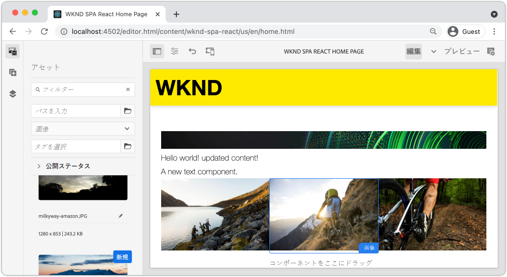
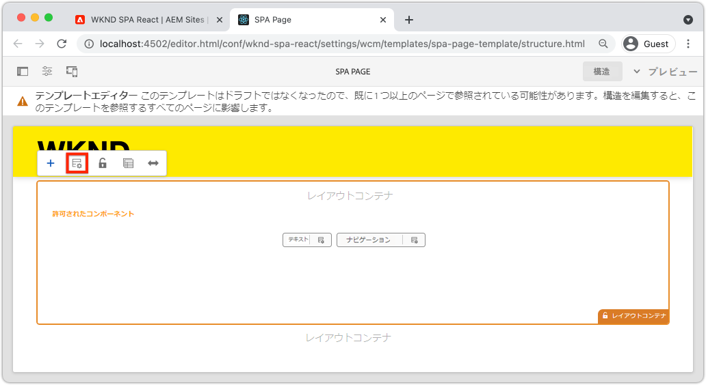
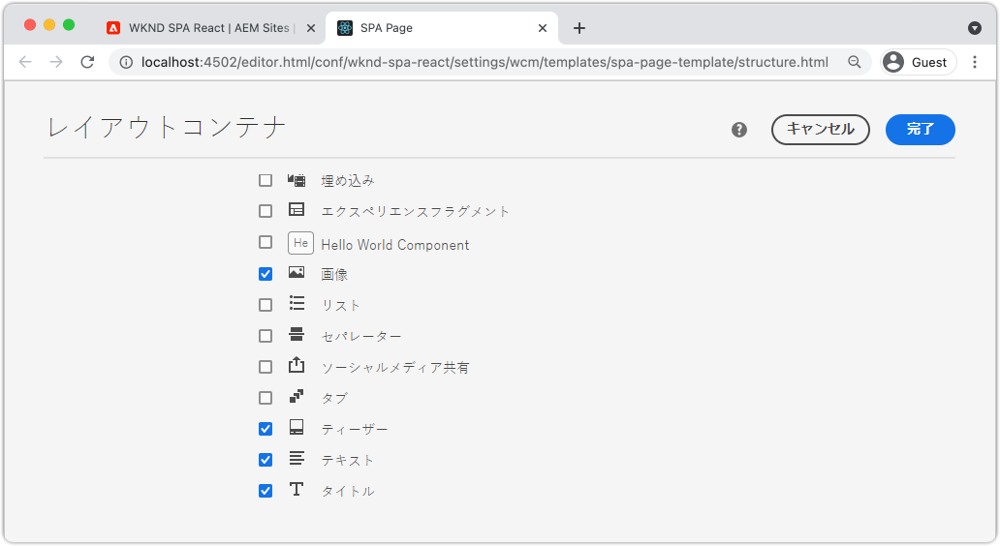
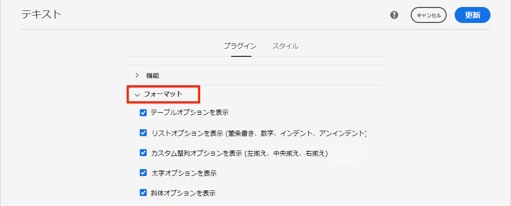
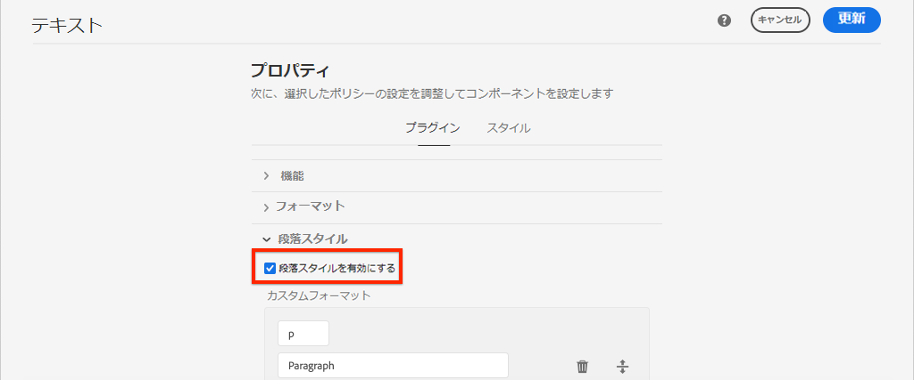
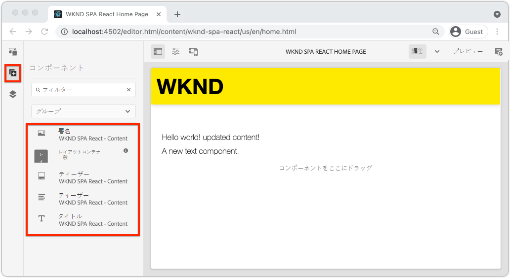
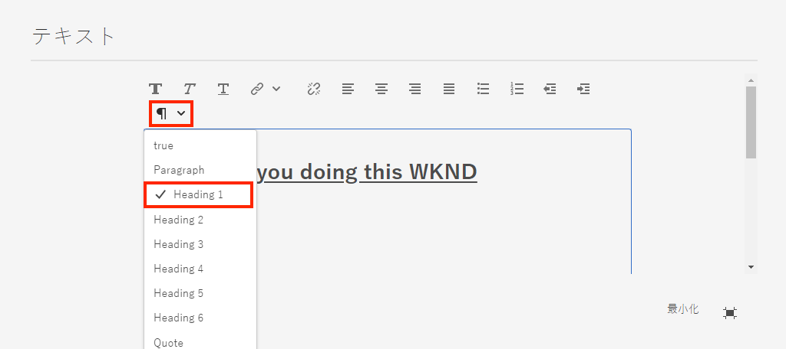
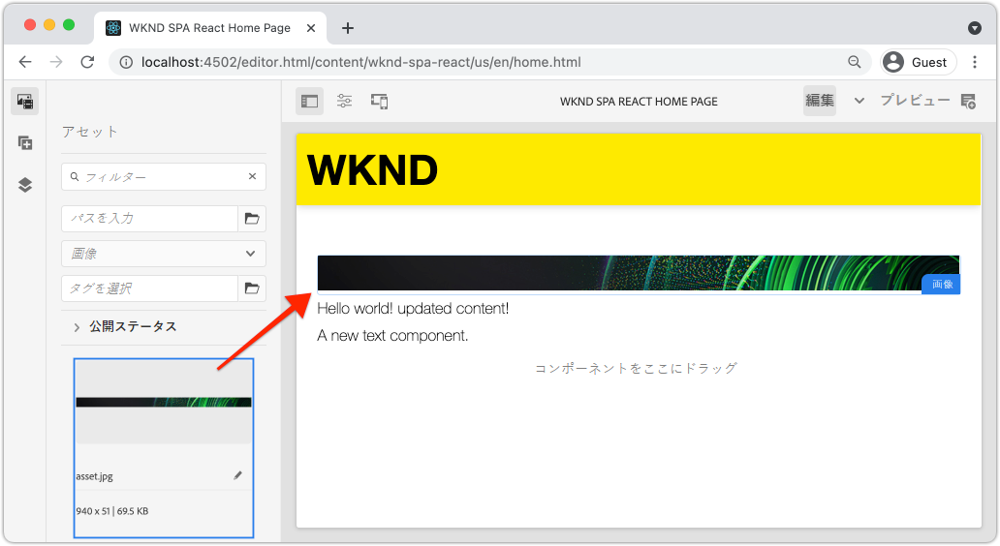
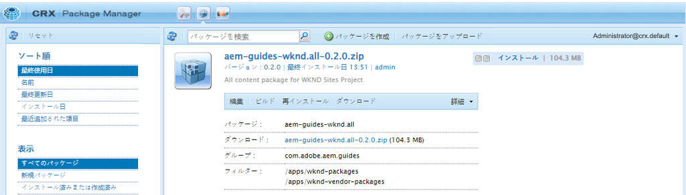

# SPA コンポーネントを AEM コンポーネントへのマッピング {#map-components}

AEM SPA Editor JS SDK を使用して、React コンポーネントを Adobe Experience Manager（AEM）コンポーネントにマッピングする方法について説明します。コンポーネントマッピングを使用すると、AEM SPA エディター内で、従来の AEM オーサリングと同様に、SPA コンポーネントを動的に更新できます。

この章では、AEM JSON モデル API について詳しく説明し、AEM コンポーネントによって公開された JSON コンテンツを prop として React コンポーネントに自動的に挿入する方法についても説明します。

## 目的

1. AEM コンポーネントを SPA コンポーネントにマッピングする方法について説明します。
1. React コンポーネントが AEM から渡された動的プロパティをどのように使用するかを調べます。
1. 標準搭載の [React AEM コアコンポーネント](https://github.com/adobe/aem-react-core-wcm-components-examples)の使用方法を学びます。

## 作成する内容

この章では、提供された`Text` SPA コンポーネントが AEM `Text` コンポーネントにどのようにマッピングされるかを調べます。`Image` SPA コンポーネントなどの React コアコンポーネントは、SPA で使用され、AEM でオーサリングされます。**レイアウトコンテナ**&#x200B;および&#x200B;**テンプレートエディター**&#x200B;ポリシーの標準機能を使用して、わずかに外観が異なるビューを作成することもできます。



## 前提条件

[ローカル開発環境](overview.md#local-dev-environment)の設定に必要なツールと手順を確認してください。この章は、[SPA の統合](integrate-spa.md)の章の続きですが、SPA 対応の AEM プロジェクトさえあれば内容についていくことができます。

## マッピングアプローチ

基本的な概念は、SPA コンポーネントを AEM コンポーネントにマッピングすることです。AEM コンポーネントは、サーバーサイドで実行され、JSON モデル API の一部としてコンテンツを書き出します。JSON コンテンツは、ブラウザーでクライアントサイドを実行している SPA によって使用されます。SPA コンポーネントと AEM コンポーネントの間に 1 対 1 のマッピングが作成されます。


*AEM コンポーネントと React コンポーネントのマッピングの概要*

## テキストコンポーネントを検査する

[AEM プロジェクトアーキタイプ](https://github.com/adobe/aem-project-archetype)は、AEM [テキストコンポーネント](https://experienceleague.adobe.com/docs/experience-manager-core-components/using/components/text.html?lang=ja)にマッピングされる `Text` コンポーネントを提供します。これは、AEM から&#x200B;*コンテンツ*&#x200B;をレンダリングするという、**コンテンツ**&#x200B;コンポーネントの例です。

コンポーネントの動作を見てみましょう。

### JSON モデルを調べる

1. SPA のコードを調べる前に、AEM が提供する JSON モデルを理解しておくことが重要です。 [コアコンポーネントライブラリ](https://www.aemcomponents.dev/content/core-components-examples/library/core-content/text.html)に移動し、テキストコンポーネントのページを表示します。コアコンポーネントライブラリには、すべての AEM コアコンポーネントの例が記載されています。
1. 例の 1 つである **JSON** タブを選択します。

   

   `text`、`richText`、および `:type` の 3 つのプロパティが表示されます。

   `:type` は、AEM コンポーネントの `sling:resourceType`（またはパス）をリストする予約済みのプロパティです。`:type` の値は、AEM コンポーネントを SPA コンポーネントにマップするために使用されるものです。

   `text` および `richText` は、SPA コンポーネントに公開される追加のプロパティです。

1. JSON 出力を [http://localhost:4502/content/wknd-spa-react/us/en.model.json](http://localhost:4502/content/wknd-spa-react/us/en.model.json) に表示します。次のようなエントリが見つかるはずです。

   ```json
   "text": {
       "id": "text-a647cec03a",
       "text": "<p>Hello World! Updated content!</p>\r\n",
       "richText": true,
       ":type": "wknd-spa-react/components/text",
       "dataLayer": {}
      }
   ```

### テキスト SPA コンポーネントを検査する

1. 任意の IDE で、SPA の AEM プロジェクトを開きます。 `ui.frontend` モジュールを展開し、`ui.frontend/src/components/Text/Text.js` の下の `Text.js` ファイルを開きます。

1. 最初に検査する領域は、40 行目までの `class Text` です。

   ```js
   class Text extends Component {
   
       get richTextContent() {
           return (<div
                   id={extractModelId(this.props.cqPath)}
                   data-rte-editelement
                   dangerouslySetInnerHTML={{__html: DOMPurify.sanitize(this.props.text)}} />
                   );
       }
   
       get textContent() {
           return <div>{this.props.text}</div>;
       }
   
       render() {
           return this.props.richText ? this.richTextContent : this.textContent;
       }
   }
   ```

   `Text` は、標準の React コンポーネントです。 コンポーネントは `this.props.richText` を使用して、レンダリングするコンテンツがリッチテキストかプレーンテキストかを判断します。使用される実際の「コンテンツ」は `this.props.text` に由来します。

   潜在的な XSS 攻撃を避けるために、[dangerouslySetInnerHTML](https://reactjs.org/docs/dom-elements.html#dangerouslysetinnerhtml) を使用してコンテンツをレンダリングする前に、リッチテキストは `DOMPurify` を経由してエスケープされます。演習の前半で JSON モデルから取得した `richText` および `text` のプロパティです。

1. 次に `ui.frontend/src/components/import-components.js` を開き、`TextEditConfig` の 86 行目までを確認します。

   ```js
   const TextEditConfig = {
   emptyLabel: 'Text',
   
       isEmpty: function(props) {
           return !props || !props.text || props.text.trim().length < 1;
       }
   };
   ```

   上記のコードは AEM オーサー環境で、プレースホルダーをレンダリングするタイミングを決定する役割を果たします。 この `isEmpty` メソッドが **true** を返した場合、プレースホルダーがレンダリングされます。

1. 最後に、94 行目までの `MapTo` 呼び出しを確認します。

   ```js
   export default MapTo('wknd-spa-react/components/text')(LazyTextComponent, TextEditConfig);
   ```

   `MapTo` は、AEM SPA Editor JS SDK（`@adobe/aem-react-editable-components`）によって指定されます。パス `wknd-spa-react/components/text` は、AEM コンポーネントの `sling:resourceType` を表します。このパスは、前に確認した JSON モデルによって公開された `:type` と一致します。`MapTo` は JSON モデルの応答を解析し、正しい値を `props` として SPA コンポーネントに渡します。

   AEM `Text` コンポーネントの定義は `ui.apps/src/main/content/jcr_root/apps/wknd-spa-react/components/text` にあります。

## React コアコンポーネントの使用

[AEM WCM コンポーネント - React コア実装](https://github.com/adobe/aem-react-core-wcm-components-base) および [AEM WCM コンポーネント - Spa エディター - React コア実装](https://github.com/adobe/aem-react-core-wcm-components-spa)。これらは、すぐに使用できる AEM コンポーネントのセットにマッピングされる、再利用可能な UI コンポーネントです。 ほとんどのプロジェクトでは、これらのコンポーネントを、独自の実装の出発点として再利用できます。

1. プロジェクトコードで、`ui.frontend/src/components` にあるファイル `import-components.js` を開きます。
このファイルは、AEM コンポーネントにマッピングされているすべての SPA コンポーネントを読み込みます。 SPA エディター実装の動的な特性を考慮すると、作成可能な AEM コンポーネントに関連付けられているすべての SPA コンポーネントを明示的に参照する必要があります。 これにより AEM オーサーは、アプリケーション内の任意の場所におけるコンポーネントの使用を選択することができます。
1. 以下の import ステートメントには、プロジェクトで記述された SPA コンポーネントが含まれています。

   ```js
   import './Page/Page';
   import './Text/Text';
   import './Container/Container';
   import './ExperienceFragment/ExperienceFragment';
   ```

1. `@adobe/aem-core-components-react-spa` と `@adobe/aem-core-components-react-base` から、他のいくつかの `imports` があります。これらは、React コアコンポーネントを読み込んで、現在のプロジェクトで使用できるようにします。これらは前述の `Text` コンポーネントの例と同様に、`MapTo` を使用してプロジェクト固有の AEM コンポーネントにマッピングされます。

### AEM ポリシーの更新

ポリシーは AEM テンプレートの機能であり、開発者やパワーユーザーが、どのコンポーネントを使用できるかを細かく制御できます。React コアコンポーネントは SPA コードに含まれていますが、アプリケーションで使用する前に、ポリシーを介して有効にする必要があります。

1. AEM 開始画面から、**ツール**／**テンプレート**／**[WKND SPA React](http://localhost:4502/libs/wcm/core/content/sites/templates.html/conf/wknd-spa-react)** に移動します。

1. **SPA ページ**&#x200B;編集用テンプレートを選択して、開きます。

1. **レイアウトコンテナ**&#x200B;を選択し、「**ポリシー**」アイコンをクリックしてポリシーを編集します。

   

1. **許可されたコンポーネント**／**WKND SPA React - コンテンツ**／**画像**&#x200B;の下で、**ティーザー**&#x200B;および **タイトル**&#x200B;を検査します。

   

   **デフォルトのコンポーネント**／**マッピングを追加**&#x200B;の下で、 **画像 - WKND SPA React - コンテンツ**&#x200B;コンポーネントを選択します。

   

   `image/*` の **mime タイプ**&#x200B;を入力します。

   「**完了**」をクリックして、ポリシーの更新を保存します。

1. **レイアウトコンテナ**&#x200B;内の&#x200B;**テキスト**&#x200B;コンポーネント用の「**ポリシー**」アイコンをクリックします。

   **WKND SPA テキスト**&#x200B;という名前の新しいポリシーを作成します。**プラグイン**／**書式設定**&#x200B;の下にあるすべてのボックスをオンにして、次の追加の書式設定オプションを有効にします。

   

   **プラグイン**／**段落スタイル**&#x200B;の下で、「**段落スタイルを有効にする**」チェックボックスをオンにします。

   

   「**完了**」をクリックしてポリシーの更新を保存します。

### 作成者コンテンツ

1. **ホームページ** [http://localhost:4502/editor.html/content/wknd-spa-react/us/en/home.html](http://localhost:4502/editor.html/content/wknd-spa-react/us/en/home.html)に移動します。

1. これで、ページで追加の&#x200B;**画像**、**ティーザー**、**タイトル**&#x200B;各コンポーネントを使用できるようになります。

   

1. また、`Text` コンポーネントを編集して、**全画面表示**&#x200B;モードで追加の段落スタイルを追加できます。

   

1. また、画像を&#x200B;**アセットファインダー**&#x200B;からドラッグ＆ドロップできます。

   

1. **タイトル**&#x200B;コンポーネントおよび&#x200B;**ティーザー**&#x200B;コンポーネントで実験してください。

1. [AEM Assets](http://localhost:4502/assets.html/content/dam) を介して独自の画像を追加するか、標準の [WKND 参照サイト](https://github.com/adobe/aem-guides-wknd/releases/latest)の完成したコードベースをインストールします。[WKND 参照サイト](https://github.com/adobe/aem-guides-wknd/releases/latest)には、WKND SPAで再利用できる画像が多数含まれています。 パッケージは、[AEM のパッケージマネージャー](http://localhost:4502/crx/packmgr/index.jsp)を使用してインストールできます。

   

## レイアウトコンテナを調べる

**レイアウトコンテナ**&#x200B;のサポートは、AEM SPA Editor SDK によって自動的に提供されます。 **レイアウトコンテナ**&#x200B;は、その名前が示すように&#x200B;**コンテナ**&#x200B;コンポーネントです。コンテナコンポーネントは、*他の*&#x200B;コンポーネントを表す JSON 構造を受け入れ、それらを動的にインスタンス化するコンポーネントです。

ここでは、レイアウトコンテナをさらに詳しく調べます。

1. ブラウザーで、[http://localhost:4502/content/wknd-spa-react/us/en.model.json](http://localhost:4502/content/wknd-spa-react/us/en.model.json) に移動します。

   

   **レイアウトコンテナ**&#x200B;コンポーネントの `sling:resourceType` は `wcm/foundation/components/responsivegrid` であり、`Text` コンポーネントや `Image` コンポーネントと同様に、`:type` プロパティを使用して SPA エディターによって認識されます。

   [レイアウトモード](https://experienceleague.adobe.com/docs/experience-manager-65/authoring/siteandpage/responsive-layout.html?lang=ja#defining-layouts-layout-mode)を使用してコンポーネントのサイズを変更するのと同じ機能が、SPA エディターで利用できます。

2. [http://localhost:4502/editor.html/content/wknd-spa-react/us/en/home.html](http://localhost:4502/editor.html/content/wknd-spa-react/us/en/home.html) に戻ります。さらに&#x200B;**画像**&#x200B;コンポーネントを追加し、**レイアウト**&#x200B;オプションを使用してサイズを変更してみてください。

   

3. JSON モデル [http://localhost:4502/content/wknd-spa-react/us/en.model.json](http://localhost:4502/content/wknd-spa-react/us/en.model.json) を再度開いて、 `columnClassNames` が JSON の一部であることを確認してください。

   

   クラス名 `aem-GridColumn--default--4` は、12 列のグリッドに基づいて幅が 4 列に設定されている必要があることを示します。レスポンシブグリッドについて詳しくは、[こちら](https://adobe-marketing-cloud.github.io/aem-responsivegrid/)をご覧ください。

4. IDE に戻り、`ui.apps` モジュールで、`ui.apps/src/main/content/jcr_root/apps/wknd-spa-react/clientlibs/clientlib-grid` で定義されたクライアントサイドライブラリがあります。`less/grid.less` ファイルを開きます。

   このファイルは、**レイアウトコンテナ**&#x200B;で使用されるブレークポイント（`default`、`tablet`、`phone`）を特定します。このファイルは、プロジェクトの仕様に応じてカスタマイズされます。 現在、ブレークポイントは `1200px` および `768px` に設定されています。

5. `Text` コンポーネントのレスポンシブ機能と、更新されたリッチテキストポリシーを使用して、次のようなビューを作成できます。

   

## おめでとうございます。 {#congratulations}

これで、SPA コンポーネントを AEM コンポーネントにマッピングする方法を学習し、React コアコンポーネントを使用しました。 また、**レイアウトコンテナ**&#x200B;のレスポンシブ機能について探索する機会もありました。

### 次の手順 {#next-steps}

[ナビゲーションとルーティング](navigation-routing.md) - SPA Editor SDK を使用して AEM ページにマッピングすることで、SPA の複数のビューをサポートする方法について説明します。 動的ナビゲーションは、React Router と React Core Components を使用して実装されています。

## （ボーナス）ソースコントロールに対する設定の保持 {#bonus-configs}

多くの場合、特に AEM プロジェクトの開始時に、テンプレートや関連するコンテンツポリシーなどの設定をソースコントロールに保持すると便利です。 これにより、すべての開発者が同じセットのコンテンツと設定に対して作業することが保証され、環境間の一貫性がさらに確保できます。プロジェクトが一定の成熟度に達すると、テンプレートの管理作業を特別なパワーユーザーグループに引き継ぐことができます。

次のいくつかの手順は、Visual Studio Code IDE と [VSCode AEM Sync](https://marketplace.visualstudio.com/items?itemName=yamato-ltd.vscode-aem-sync) を使用して行われますが、AEM のローカルインスタンスからコンテンツを&#x200B;**取り込み**&#x200B;または&#x200B;**読み込む**&#x200B;ように設定した任意のツールと IDE を使用して行うことができます。

1. Visual Studio Code IDE で、Marketplace 拡張機能を介して **VSCode AEM Sync** がインストールされていることを確認します。

   

2. プロジェクトエクスプローラー内の **ui.content** モジュールをを展開して、`/conf/wknd-spa-react/settings/wcm/templates` に移動します。

3. `templates` フォルダーを&#x200B;**右クリック**&#x200B;し、**AEM サーバーから読み込み**&#x200B;を選択します。

   

4. コンテンツを読み込む手順を繰り返しますが、`/conf/wknd-spa-react/settings/wcm/templates/policies` に置かれた&#x200B;**ポリシー**&#x200B;フォルダーを選択します。

5. `ui.content/src/main/content/META-INF/vault/filter.xml` にある `filter.xml` ファイルを調べます。

   ```xml
   <!--ui.content filter.xml-->
   <?xml version="1.0" encoding="UTF-8"?>
    <workspaceFilter version="1.0">
        <filter root="/conf/wknd-spa-react" mode="merge"/>
        <filter root="/content/wknd-spa-react" mode="merge"/>
        <filter root="/content/dam/wknd-spa-react" mode="merge"/>
        <filter root="/content/experience-fragments/wknd-spa-react" mode="merge"/>
    </workspaceFilter>
   ```

   `filter.xml` ファイルは、パッケージと共にインストールされるノードのパスを識別する役割を果たします。各フィルターの `mode="merge"` に注目してください。これは、既存のコンテンツは変更されず、新しいコンテンツのみが追加されることを示しています。コンテンツ作成者がこれらのパスを更新する可能性があるので、コードのデプロイメントでは、コンテンツを上書き&#x200B;**しない**&#x200B;ことが重要です。フィルター要素の操作の詳細については、[FileVault ドキュメント](https://jackrabbit.apache.org/filevault/filter.html)を参照してください。

   `ui.content/src/main/content/META-INF/vault/filter.xml` と `ui.apps/src/main/content/META-INF/vault/filter.xml` を比較して、各モジュールによって管理される様々なノードを理解します。

## （ボーナス）カスタム画像コンポーネントの作成 {#bonus-image}

SPA 画像コンポーネントは、React コアコンポーネントによって既に指定されています。 ただし、追加のプラクティスが必要な場合は、AEM [画像コンポーネント](https://experienceleague.adobe.com/docs/experience-manager-core-components/using/components/image.html?lang=ja)にマップする独自の React 実装を作成します。この `Image` コンポーネントは、**コンテンツ**&#x200B;コンポーネントのもう一つの例です。

### JSO の検査

SPA コードを調べる前に、AEM が指定した JSON モデルを調べます。

1. [コアコンポーネントライブラリに置かれた画像の例](https://www.aemcomponents.dev/content/core-components-examples/library/core-content/image.html)に移動します。

   

   `src`、`alt`、`title` のプロパティは、SPA `Image` コンポーネントの入力に使用されます。

   >[!NOTE]
   >
   > 公開された他の画像プロパティ（`lazyEnabled`、`widths`）があり、これを使用して開発者は、適応型の遅延読み込みコンポーネントを作成することができます。このチュートリアルで作成されたコンポーネントはシンプルで、これらの詳細なプロパティを使用&#x200B;**しません**。

### 画像コンポーネントの実装

1. 次に、`Image` という名前の新しいフォルダーを `ui.frontend/src/components` の下に作成します。
1. `Image` フォルダーの下に、`Image.js` という名前の新しいファイルを作成します。

   

1. 次の `import` ステートメントを `Image.js` に追加します。

   ```js
   import React, {Component} from 'react';
   import {MapTo} from '@adobe/aem-react-editable-components';
   ```

1. 次に `ImageEditConfig` を追加して、AEM でプレースホルダーを表示するタイミングを決定します。

   ```js
   export const ImageEditConfig = {
   
       emptyLabel: 'Image',
   
       isEmpty: function(props) {
           return !props || !props.src || props.src.trim().length < 1;
       }
   };
   ```

   `src` プロパティが設定されていない場合、プレースホルダーが表示されます。

1. 次に、`Image` クラスを実装します。

   ```js
    export default class Image extends Component {
   
       get content() {
           return ;
       }
   
       render() {
           if(ImageEditConfig.isEmpty(this.props)) {
               return null;
           }
   
           return (
                   <div className="Image">
                       {this.content}
                   </div>
           );
       }
   }
   ```

   上記のコードは、JSON モデルが渡した props `src`、`alt`、`title` に基づいて `` をレンダリングします。

1. `MapTo` コードを追加して、React コンポーネントを AEM コンポーネントにマップします。

   ```js
   MapTo('wknd-spa-react/components/image')(Image, ImageEditConfig);
   ```

   文字列 `wknd-spa-react/components/image` は、`ui.apps/src/main/content/jcr_root/apps/wknd-spa-react/components/image` の `ui.apps` にある AEM コンポーネントの場所に対応していることにご注意ください。

1. 同じディレクトリ内に `Image.css` という名前の新しいファイルを作成し、以下を追加します。

   ```scss
   .Image-src {
       margin: 1rem 0;
       width: 100%;
       border: 0;
   }
   ```

1. `Image.js` で、`import` ステートメントの下の最上部のファイルに、参照を追加します。

   ```js
   import React, {Component} from 'react';
   import {MapTo} from '@adobe/aem-react-editable-components';
   
   require('./Image.css');
   ```

1. ファイル `ui.frontend/src/components/import-components.js` を開き、新しい `Image` コンポーネントに参照を追加します。

   ```js
   import './Page/Page';
   import './Text/Text';
   import './Container/Container';
   import './ExperienceFragment/ExperienceFragment';
   import './Image/Image'; //add reference to Image component
   ```

1. `import-components.js` で、React コアコンポーネント画像をコメントアウトします。

   ```js
   //MapTo('wknd-spa-react/components/image')(ImageV2, {isEmpty: ImageV2IsEmptyFn});
   ```

   これにより、代わりにカスタム画像コンポーネントが確実に使用されます。

1. プロジェクトのルートから、Maven を使用して SPA コードを AEM にデプロイします。

   ```shell
   $ cd aem-guides-wknd-spa.react
   $ mvn clean install -PautoInstallSinglePackage
   ```

1. AEM で SPA を検査します。ページ上のすべての画像コンポーネントは引き続き機能するはずです。レンダリングされた出力を調べると、React コアコンポーネントではなく、カスタム画像コンポーネントのマークアップが表示されます。

   *カスタム画像コンポーネントのマークアップ*

   ```html
   <div class="Image">
       
   </div>
   ```

   *React コアコンポーネント画像のマークアップ*

   ```html
   <div class="cmp-image cq-dd-image">
       
   </div>
   ```

   独自のコンポーネントを拡張および実装するための導入に適しています。
