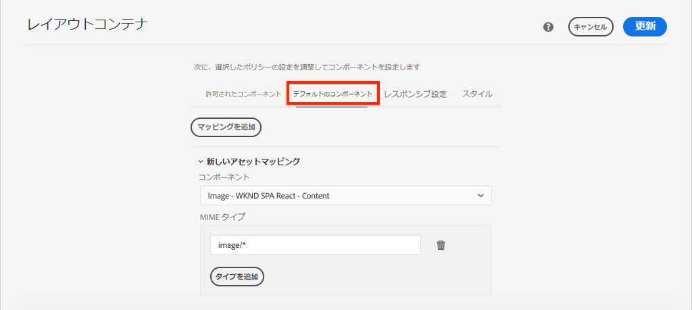

# SPAコンポーネントのAEMコンポーネントへのマッピング {#map-components}

AEM SPA Editor JS SDK を使用して、React コンポーネントをAdobe Experience Manager(AEM) コンポーネントにマッピングする方法について説明します。 コンポーネントマッピングを使用すると、AEM SPAエディター内で、従来のAEMオーサリングと同様に、SPAコンポーネントを動的に更新できます。

この章では、AEM JSON モデル API について詳しく説明し、AEMコンポーネントによって公開された JSON コンテンツを prop として React コンポーネントに自動的に挿入する方法についても説明します。

## 目的

1. AEMコンポーネントをSPAコンポーネントにマッピングする方法について説明します。
1. Inspectでは、AEMから渡された動的プロパティを React コンポーネントで使用します。
1. 標準搭載の使用方法を学ぶ [React AEM Core Components](https://github.com/adobe/aem-react-core-wcm-components-examples).

## 作成する内容

この章では、指定した `Text` SPAコンポーネントがAEMにマッピングされている `Text`コンポーネント。 同様の React コアコンポーネント `Image` SPAコンポーネントは、SPAで使用され、AEMでオーサリングされます。 の標準機能 **レイアウトコンテナ** および **テンプレートエディター** ポリシーを使用して、外観が少し多様なビューを作成することもできます。


## 前提条件

設定に必要なツールと手順を確認します。 [ローカル開発環境](overview.md#local-dev-environment). この章は、 [SPAの統合](integrate-spa.md) ただし、必要な操作はすべてSPA対応AEMプロジェクトに限られます。

## マッピングアプローチ

基本的な概念は、SPAコンポーネントをAEMコンポーネントにマッピングすることです。 AEMコンポーネントは、サーバー側で実行され、JSON モデル API の一部としてコンテンツを書き出します。 JSON コンテンツは、ブラウザーでクライアント側を実行しているSPAによって使用されます。 SPAコンポーネントとAEMコンポーネントの間に 1 対 1 のマッピングが作成されます。


*AEMコンポーネントと React コンポーネントのマッピングの概要*

## Inspect the Text Component

この [AEM Project Archetype](https://github.com/adobe/aem-project-archetype) を提供 `Text` AEM [テキストコンポーネント](https://experienceleague.adobe.com/docs/experience-manager-core-components/using/components/text.html?lang=ja). これは、 **コンテンツ** コンポーネントをレンダリングする *コンテンツ* AEMから

コンポーネントの動作を見てみましょう。

### Inspect JSON モデル

1. SPAのコードを調べる前に、AEMが提供する JSON モデルを理解しておくことが重要です。 次に移動： [コアコンポーネントライブラリ](https://www.aemcomponents.dev/content/core-components-examples/library/core-content/text.html) テキストコンポーネントのページを表示します。 コアコンポーネントライブラリには、すべてのAEMコアコンポーネントの例が記載されています。
1. を選択します。 **JSON** タブで次のいずれかの例を確認できます。

   

   次の 3 つのプロパティが表示されます。 `text`, `richText`、および `:type`.

   `:type` は、 `sling:resourceType` （またはパス）AEMコンポーネントの の値 `:type` は、AEMコンポーネントをSPAコンポーネントにマッピングするために使用されるものです。

   `text` および `richText` は、SPAコンポーネントに公開される追加のプロパティです。

1. JSON 出力の表示先： [http://localhost:4502/content/wknd-spa-react/us/en.model.json](http://localhost:4502/content/wknd-spa-react/us/en.model.json). 次のようなエントリが見つかるはずです。

   ```json
   "text": {
       "id": "text-a647cec03a",
       "text": "<p>Hello World! Updated content!</p>\r\n",
       "richText": true,
       ":type": "wknd-spa-react/components/text",
       "dataLayer": {}
      }
   ```

### Inspect Text SPAコンポーネント

1. 任意の IDE で、SPAのAEMプロジェクトを開きます。 を展開します。 `ui.frontend` モジュールを開き、ファイルを開きます。 `Text.js` under `ui.frontend/src/components/Text/Text.js`.

1. 最初に、 `class Text` ～行 40:

   ```js
   class Text extends Component {
   
       get richTextContent() {
           return (<div
                   id={extractModelId(this.props.cqPath)}
                   data-rte-editelement
                   dangerouslySetInnerHTML={{__html: DOMPurify.sanitize(this.props.text)}} />
                   );
       }
   
       get textContent() {
           return <div>{this.props.text}</div>;
       }
   
       render() {
           return this.props.richText ? this.richTextContent : this.textContent;
       }
   }
   ```

   `Text` は、標準の React コンポーネントです。 コンポーネントは、 `this.props.richText` レンダリングするコンテンツをリッチテキストにするかプレーンテキストにするかを指定します。 実際に使用される「コンテンツ」は、 `this.props.text`.

   潜在的な XSS 攻撃を避けるために、リッチテキストは `DOMPurify` 使用する前に [dangerlySetInnerHTML](https://reactjs.org/docs/dom-elements.html#dangerouslysetinnerhtml) コンテンツをレンダリングします。 を呼び出す `richText` および `text` のプロパティは、この演習の前の JSON モデルから取得したものです。

1. 次に、を開きます。 `ui.frontend/src/components/import-components.js` を見る `TextEditConfig` ～行 86:

   ```js
   const TextEditConfig = {
   emptyLabel: 'Text',
   
       isEmpty: function(props) {
           return !props || !props.text || props.text.trim().length < 1;
       }
   };
   ```

   上記のコードは、AEMオーサー環境でプレースホルダーをレンダリングするタイミングを決定する役割を果たします。 この `isEmpty` メソッドの戻り値 **true** 次に、プレースホルダーがレンダリングされます。

1. 最後に、 `MapTo` ～line 94 でを呼び出します。

   ```js
   export default MapTo('wknd-spa-react/components/text')(LazyTextComponent, TextEditConfig);
   ```

   `MapTo` は、AEM SPA Editor JS SDK(`@adobe/aem-react-editable-components`) をクリックします。 パス `wknd-spa-react/components/text` は、 `sling:resourceType` AEMコンポーネントの このパスは `:type` 以前に確認された JSON モデルによって公開される。 `MapTo` は、JSON モデルの応答を解析し、正しい値を `props` をSPAコンポーネントに追加します。

   AEM `Text` 次のコンポーネント定義： `ui.apps/src/main/content/jcr_root/apps/wknd-spa-react/components/text`.

## React コアコンポーネントの使用

[AEM WCM コンポーネント — React Core 実装](https://github.com/adobe/aem-react-core-wcm-components-base) および [AEM WCM コンポーネント — Spa エディター — React Core 実装](https://github.com/adobe/aem-react-core-wcm-components-spa). これらは、すぐに使用できるAEMコンポーネントのセットにマッピングされる、再利用可能な UI コンポーネントです。 ほとんどのプロジェクトでは、これらのコンポーネントを、独自の実装の出発点として再利用できます。

1. プロジェクトコードで、ファイルを開きます。 `import-components.js` 時刻 `ui.frontend/src/components`.
このファイルは、AEMコンポーネントにマッピングされているすべてのSPAコンポーネントを読み込みます。 SPA Editor 実装の動的な特性を考慮し、作成可能なAEMコンポーネントに結び付けられているすべてのSPAコンポーネントを明示的に参照する必要があります。 これにより、AEM作成者は、アプリケーション内の任意の場所でコンポーネントを使用するように選択できます。
1. 次の import 文は、プロジェクトに書き込まれたSPAコンポーネントを含みます。

   ```js
   import './Page/Page';
   import './Text/Text';
   import './Container/Container';
   import './ExperienceFragment/ExperienceFragment';
   ```

1. 他にもいくつかある `imports` から `@adobe/aem-core-components-react-spa` および `@adobe/aem-core-components-react-base`. これらは React コアコンポーネントを読み込み、現在のプロジェクトで使用できるようにします。 これらは、次のコードを使用して、プロジェクト固有のAEMコンポーネントにマッピングされます。 `MapTo`と同じように `Text` コンポーネントの例を以前に参照してください。

### AEM Policies を更新

ポリシーは、AEMテンプレートの機能で、開発者やパワーユーザーは、使用可能なコンポーネントを詳細に制御できます。 React コアコンポーネントはSPAコードに含まれていますが、アプリケーションで使用する前に、ポリシーを介して有効にする必要があります。

1. AEM Start 画面からに移動します。 **ツール** > **テンプレート** > **[WKND SPA React](http://localhost:4502/libs/wcm/core/content/sites/templates.html/conf/wknd-spa-react)**.

1. を選択して、 **SPA Page** 編集用のテンプレート。

1. を選択します。 **レイアウトコンテナ** クリックします。 **ポリシー** アイコンを使用してポリシーを編集します。

   

1. の下 **許可されたコンポーネント** > **WKND SPA React — コンテンツ** > check **画像**, **ティーザー**、および **タイトル**.

   

   の下 **デフォルトのコンポーネント** > **マッピングを追加** を選択し、 **画像 — WKND SPA React — コンテンツ** コンポーネント：

   

   を入力します。 **mime タイプ** / `image/*`.

   クリック **完了** ポリシーの更新を保存します。

1. 内 **レイアウトコンテナ** クリック **ポリシー** アイコン **テキスト** コンポーネント。

   という名前の新しいポリシーを作成します。 **WKND SPA Text**. の下 **プラグイン** > **書式設定** /すべてのボックスをオンにして、追加の書式設定オプションを有効にします。

   

   の下 **プラグイン** > **段落スタイル** /チェックボックスをオンにして **段落スタイルを有効にする**:

   

   クリック **完了** ポリシーの更新を保存します。

### コンテンツを作成

1. 次に移動： **ホームページ** [http://localhost:4502/editor.html/content/wknd-spa-react/us/en/home.html](http://localhost:4502/editor.html/content/wknd-spa-react/us/en/home.html).

1. これで、追加のコンポーネントを使用できるようになります **画像**, **ティーザー**、および **タイトル** をクリックします。

   

1. また、 `Text` コンポーネントと追加の段落スタイルを **フルスクリーン** モード。

   

1. また、画像を **アセットファインダー**:

   

1. を使用したエクスペリエンス **タイトル** および **ティーザー** コンポーネント。

1. で独自の画像を追加 [AEM Assets](http://localhost:4502/assets.html/content/dam) または、標準の完成したコードベースをインストールします。 [WKND リファレンスサイト](https://github.com/adobe/aem-guides-wknd/releases/latest). この [WKND リファレンスサイト](https://github.com/adobe/aem-guides-wknd/releases/latest) には、WKND SPAで再利用できる画像が多数含まれています。 パッケージは、 [AEM Package Manager](http://localhost:4502/crx/packmgr/index.jsp).

   

## レイアウトコンテナのInspect

のサポート **レイアウトコンテナ** は、AEM SPA Editor SDK によって自動的に提供されます。 この **レイアウトコンテナ**（名前で示されている）は、 **コンテナ** コンポーネント。 コンテナコンポーネントは、 *その他* コンポーネントを作成し、動的にインスタンス化します。

ここでは、レイアウトコンテナをさらに詳しく調べます。

1. ブラウザーで、に移動します。 [http://localhost:4502/content/wknd-spa-react/us/en.model.json](http://localhost:4502/content/wknd-spa-react/us/en.model.json)

   

   この **レイアウトコンテナ** コンポーネントに `sling:resourceType` / `wcm/foundation/components/responsivegrid` とは、SPAエディターで `:type` プロパティは、 `Text` および `Image` コンポーネント。

   を使用してコンポーネントのサイズを変更するのと同じ機能 [レイアウトモード](https://experienceleague.adobe.com/docs/experience-manager-65/authoring/siteandpage/responsive-layout.html#defining-layouts-layout-mode) はSPA Editor で使用できます。

2. 戻る [http://localhost:4502/editor.html/content/wknd-spa-react/us/en/home.html](http://localhost:4502/editor.html/content/wknd-spa-react/us/en/home.html). 追加 **画像** コンポーネントを再サイズ設定し、 **レイアウト** オプション：

   

3. JSON モデルを再度開く [http://localhost:4502/content/wknd-spa-react/us/en.model.json](http://localhost:4502/content/wknd-spa-react/us/en.model.json) そして見てみろ `columnClassNames` を JSON の一部として使用する場合：

   

   クラス名 `aem-GridColumn--default--4` 12 列のグリッドに基づいて、幅が 4 列に設定されている必要があることを示します。 詳細： [レスポンシブグリッドは、ここにあります](https://adobe-marketing-cloud.github.io/aem-responsivegrid/).

4. IDE と、 `ui.apps` モジュールは、次の場所で定義されたクライアント側ライブラリがあります： `ui.apps/src/main/content/jcr_root/apps/wknd-spa-react/clientlibs/clientlib-grid`. `less/grid.less` ファイルを開きます。

   このファイルは、ブレークポイント (`default`, `tablet`、および `phone`) **レイアウトコンテナ**. このファイルは、プロジェクトの仕様に応じてカスタマイズされます。 現在、ブレークポイントはに設定されています。 `1200px` および `768px`.

5. レスポンシブ機能と、更新されたリッチテキストポリシーを `Text` 次のようなビューを作成するコンポーネント：

   

## おめでとうございます。 {#congratulations}

これで、SPAコンポーネントをAEMコンポーネントにマッピングする方法を学習し、React コアコンポーネントを使用しました。 また、 **レイアウトコンテナ**.

### 次の手順 {#next-steps}

[ナビゲーションとルーティング](navigation-routing.md) - SPA Editor SDK を使用してAEMページにマッピングすることで、SPAの複数のビューをサポートする方法について説明します。 動的ナビゲーションは、React Router と React Core Components を使用して実装されています。

## （ボーナス）ソース管理に対する設定の保持 {#bonus-configs}

多くの場合、特にAEMプロジェクトの開始時に、テンプレートや関連するコンテンツポリシーなどの設定をソース管理に保持すると便利です。 これにより、すべての開発者が同じコンテンツと設定のセットに対して作業を行い、環境間の一貫性をさらに高めることができます。 プロジェクトが一定の成熟度に達すると、テンプレート管理の手法を特別なパワーユーザーグループに引き継ぐことができます。

次の手順は、Visual Studio Code IDE と [VSCode AEM Sync](https://marketplace.visualstudio.com/items?itemName=yamato-ltd.vscode-aem-sync) しかし、任意のツールと、 **取り込む** または **インポート** AEMのローカルインスタンスから取得したコンテンツ。

1. Visual Studio Code IDE で、 **VSCode AEM Sync** Marketplace 拡張機能を介してインストールされる。

   

2. を展開します。 **ui.content** モジュールをプロジェクトエクスプローラーに追加し、に移動します。 `/conf/wknd-spa-react/settings/wcm/templates`.

3. **右クリック** の `templates` フォルダーと選択 **AEM Server からインポート**:

   

4. コンテンツを読み込む手順を繰り返しますが、「 **ポリシー** 次の場所にあるフォルダー： `/conf/wknd-spa-react/settings/wcm/templates/policies`.

5. Inspect `filter.xml` 次の場所にあるファイル： `ui.content/src/main/content/META-INF/vault/filter.xml`.

   ```xml
   <!--ui.content filter.xml-->
   <?xml version="1.0" encoding="UTF-8"?>
    <workspaceFilter version="1.0">
        <filter root="/conf/wknd-spa-react" mode="merge"/>
        <filter root="/content/wknd-spa-react" mode="merge"/>
        <filter root="/content/dam/wknd-spa-react" mode="merge"/>
        <filter root="/content/experience-fragments/wknd-spa-react" mode="merge"/>
    </workspaceFilter>
   ```

   この `filter.xml` ファイルは、パッケージと共にインストールされるノードのパスを識別します。 注意： `mode="merge"` 既存のコンテンツが変更されないことを示す各フィルターで、新しいコンテンツのみが追加されます。 コンテンツ作成者はこれらのパスを更新する可能性があるので、コードのデプロイメントでは **not** コンテンツを上書きします。 詳しくは、 [FileVault ドキュメント](https://jackrabbit.apache.org/filevault/filter.html) を参照してください。

   比較 `ui.content/src/main/content/META-INF/vault/filter.xml` および `ui.apps/src/main/content/META-INF/vault/filter.xml` を参照してください。

## （ボーナス）カスタム画像コンポーネントの作成 {#bonus-image}

SPA画像コンポーネントは、React コアコンポーネントによって既に提供されています。 ただし、追加のプラクティスが必要な場合は、AEMにマッピングする独自の React 実装を作成します [画像コンポーネント](https://experienceleague.adobe.com/docs/experience-manager-core-components/using/components/image.html?lang=ja). この `Image` コンポーネントは、 **コンテンツ** コンポーネント。

### Inspect the JSON

SPAコードを調べる前に、AEMから提供された JSON モデルを調べます。

1. 次に移動： [コアコンポーネントライブラリの例を示します](https://www.aemcomponents.dev/content/core-components-examples/library/core-content/image.html).

   

   のプロパティ `src`, `alt`、および `title` を使用して、SPA `Image` コンポーネント。

   >[!NOTE]
   >
   > 他の画像プロパティが公開されています (`lazyEnabled`, `widths`) を使用して、開発者がアダプティブな遅延読み込みコンポーネントを作成できるようにします。 このチュートリアルで作成されるコンポーネントは簡単で、実行も簡単です **not** これらの詳細プロパティを使用します。

### 画像コンポーネントの実装

1. 次に、という名前の新しいフォルダーを作成します。 `Image` under `ui.frontend/src/components`.
1. の `Image` フォルダ作成新しいファイル名： `Image.js`.

   

1. 以下を追加します。 `import` 次に示す `Image.js`:

   ```js
   import React, {Component} from 'react';
   import {MapTo} from '@adobe/aem-react-editable-components';
   ```

1. 次に、 `ImageEditConfig` AEMでプレースホルダーを表示するタイミングを指定するには：

   ```js
   export const ImageEditConfig = {
   
       emptyLabel: 'Image',
   
       isEmpty: function(props) {
           return !props || !props.src || props.src.trim().length < 1;
       }
   };
   ```

   プレースホルダーは、 `src` プロパティが設定されていません。

1. 次の実装 `Image` クラス：

   ```js
    export default class Image extends Component {
   
       get content() {
           return ;
       }
   
       render() {
           if(ImageEditConfig.isEmpty(this.props)) {
               return null;
           }
   
           return (
                   <div className="Image">
                       {this.content}
                   </div>
           );
       }
   }
   ```

   上記のコードは、 `` prop に基づく `src`, `alt`、および `title` JSON モデルによって渡されます。

1. を `MapTo` React コンポーネントをAEMコンポーネントにマッピングするコード：

   ```js
   MapTo('wknd-spa-react/components/image')(Image, ImageEditConfig);
   ```

   文字列をメモします。 `wknd-spa-react/components/image` は、 `ui.apps` 時刻： `ui.apps/src/main/content/jcr_root/apps/wknd-spa-react/components/image`.

1. という名前の新しいファイルを作成します。 `Image.css` を同じディレクトリに追加し、以下を追加します。

   ```scss
   .Image-src {
       margin: 1rem 0;
       width: 100%;
       border: 0;
   }
   ```

1. In `Image.js` ファイルへの参照を `import` ステートメント：

   ```js
   import React, {Component} from 'react';
   import {MapTo} from '@adobe/aem-react-editable-components';
   
   require('./Image.css');
   ```

1. ファイルを開きます。 `ui.frontend/src/components/import-components.js` 新しい `Image` コンポーネント：

   ```js
   import './Page/Page';
   import './Text/Text';
   import './Container/Container';
   import './ExperienceFragment/ExperienceFragment';
   import './Image/Image'; //add reference to Image component
   ```

1. In `import-components.js` React コアコンポーネントの画像をコメントアウトします。

   ```js
   //MapTo('wknd-spa-react/components/image')(ImageV2, {isEmpty: ImageV2IsEmptyFn});
   ```

   これにより、カスタムの画像コンポーネントが代わりに使用されるようになります。

1. プロジェクトのルートから、Maven を使用してSPAコードをAEMにデプロイします。

   ```shell
   $ cd aem-guides-wknd-spa.react
   $ mvn clean install -PautoInstallSinglePackage
   ```

1. SPAをAEMでInspectします。 ページ上の画像コンポーネントは、引き続き機能します。 Inspectでレンダリングした出力に、React コアコンポーネントではなく、カスタム画像コンポーネントのマークアップが表示されます。

   *カスタム画像コンポーネントマークアップ*

   ```html
   <div class="Image">
       
   </div>
   ```

   *React コアコンポーネントの画像マークアップ*

   ```html
   <div class="cmp-image cq-dd-image">
       
   </div>
   ```

   これは、独自のコンポーネントを拡張および実装するための良い紹介です。
