# ナビゲーションとルーティングの追加 {#navigation-routing}

SPA Editor SDK を使用して AEM ページにマッピングすることで、SPA の複数のビューをサポートする方法について説明します。 動的ナビゲーションは、React Router と React Core Components を使用して実装されています。

## 目的

1. SPA エディターを使用する際に利用可能な SPA モデルのルーティングオプションについて説明します。
1. [React Router](https://reacttraining.com/react-router) を使用して SPA の様々なビューを移動する方法を説明します。
1. AEM React コアコンポーネントを使用して、AEM のページ階層に基づく動的ナビゲーションを学ぶ。

## 作成する内容

この章では、AEM の SPA にナビゲーションを追加します。 ナビゲーションメニューは AEM のページ階層によって起動され、[ナビゲーションコアコンポーネント](https://experienceleague.adobe.com/docs/experience-manager-core-components/using/wcm-components/navigation.html?lang=ja)が提供する JSON モデルを活用します。


## 前提条件

[ローカル開発環境](overview.md#local-dev-environment)の設定に必要なツールや手順を確認します。この章は、[コンポーネントのマッピング](map-components.md)の続きとなりますが、必要な操作をすべて実行するには、SPA 対応 AEM プロジェクトをローカル AEM インスタンスにデプロイする必要があります。

## テンプレートへのナビゲーションの追加 {#add-navigation-template}

1. ブラウザーを開き、AEM（[http://localhost:4502/](http://localhost:4502/)）にログインします。開始コードベースは、既にデプロイされている必要があります。
1. **SPA ページテンプレート**（[http://localhost:4502/editor.html/conf/wknd-spa-react/settings/wcm/templates/spa-page-template/structure.html](http://localhost:4502/editor.html/conf/wknd-spa-react/settings/wcm/templates/spa-page-template/structure.html)）に移動します。
1. 一番外にある「**ルートレイアウトコンテナ**」を選択し、その&#x200B;**ポリシー**&#x200B;アイコンをクリックします。オーサリングのためにロック解除された&#x200B;**レイアウトコンテナ**&#x200B;を選択&#x200B;**しない**&#x200B;ように注意してください。

   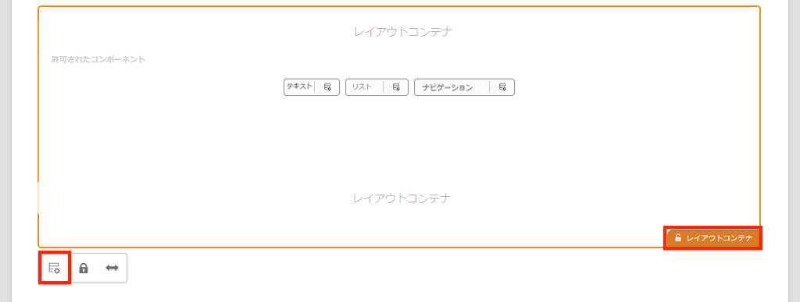

1. **SPA 構造**&#x200B;という名前の新しいポリシーを作成します。 

   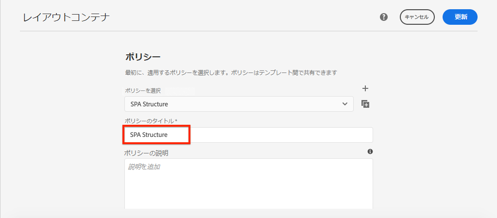

    **許可されたコンポーネント**／**一般**&#x200B;で&#x200B;**レイアウトコンテナ**&#x200B;のコンポーネントを選択します。

   **許可されたコンポーネント**／**WKND SPA REACT - 構造** で&#x200B;**ナビゲーション**&#x200B;コンポーネントを選択します。 

   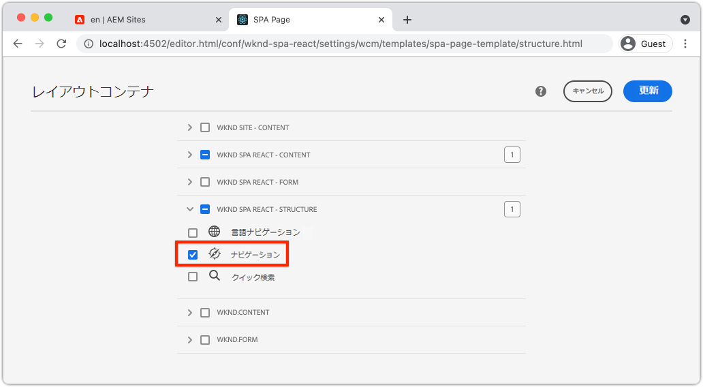

   **許可されたコンポーネント**／**WKND SPA REACT - コンテンツ**&#x200B;で、**画像**&#x200B;および&#x200B;**テキスト**&#x200B;のコンポーネントを選択します。合計 4 つのコンポーネントを選択する必要があります。

   「**完了**」をクリックして、変更を保存します。

1. ページを更新し、ロック解除された&#x200B;**レイアウトコンテナ**&#x200B;の上に&#x200B;**ナビゲーション**&#x200B;コンポーネントを追加します。

   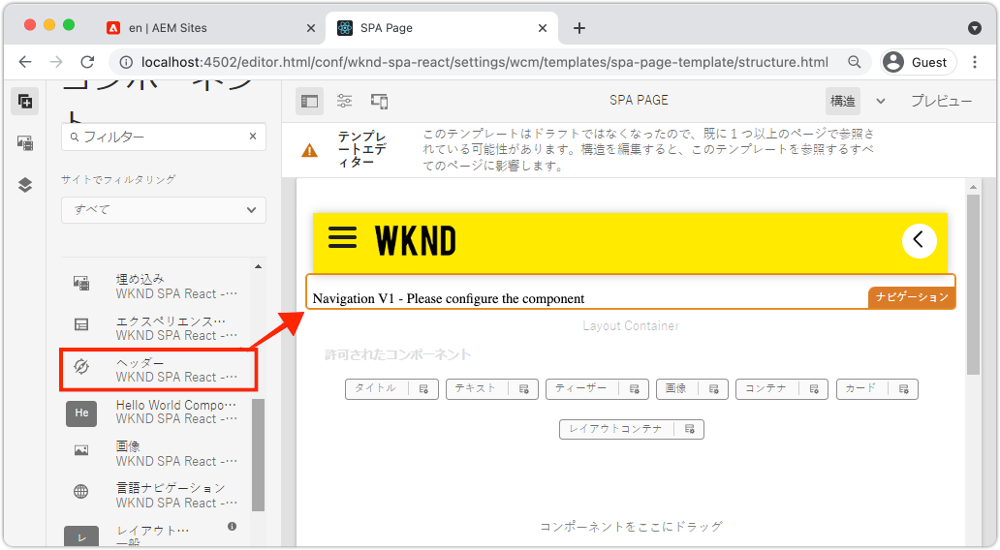

1. **ナビゲーション**&#x200B;コンポーネントを選択し、その&#x200B;**ポリシー**&#x200B;アイコンをクリックして、ポリシーを編集します。
1. **SPA ナビゲーション**&#x200B;の&#x200B;**ポリシーのタイトル**&#x200B;を使用して新しいポリシーを作成します。

   「**プロパティ**」で、次の手順を実行します。

   * 「**ナビゲーションルート**」を `/content/wknd-spa-react/us/en` に設定します。
   * 「**ルートレベルを除外**」を **1** に設定します。
   * 「**すべての子ページを収集**」チェックボックスをオフにします。
   * 「**ナビゲーション構造の深度**」を **3** に設定します。

   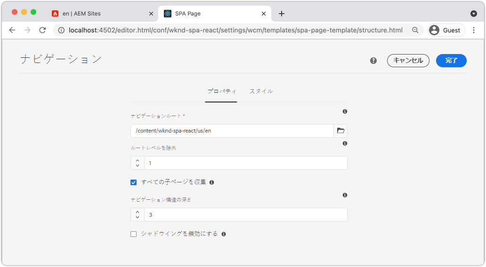

   これにより、`/content/wknd-spa-react/us/en` の 2 レベル下のナビゲーションが収集されます。

1. 変更を保存すると、テンプレートの一部として入力された `Navigation` が表示されます。

   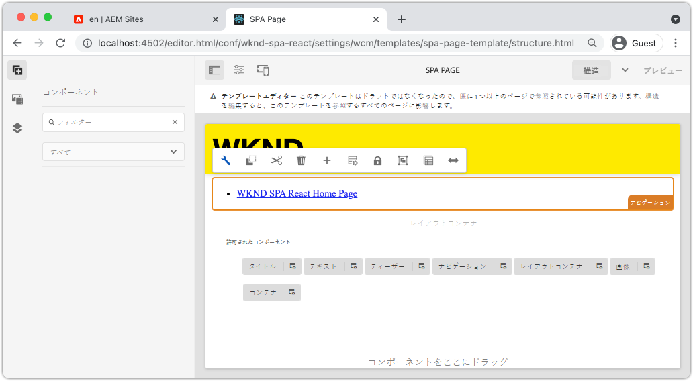

## 子ページの作成

次に、AEM で別のビューとして機能する追加のページを作成します。 また、AEM が提供する JSON モデルの階層構造も調べます。

1. **Sites** コンソール（[http://localhost:4502/sites.html/content/wknd-spa-react/us/en/home](http://localhost:4502/sites.html/content/wknd-spa-react/us/en/home)）に移動します。「**WKND SPA React ホームページ**」を選択し、**作成**／**ページ**&#x200B;をクリックします。

   

1. 「**テンプレート**」で「**SPA ページ**」を選択します。**プロパティ**&#x200B;で、**タイトル**&#x200B;に「**Page 1**」、名前に「**page-1**」と入力します。

   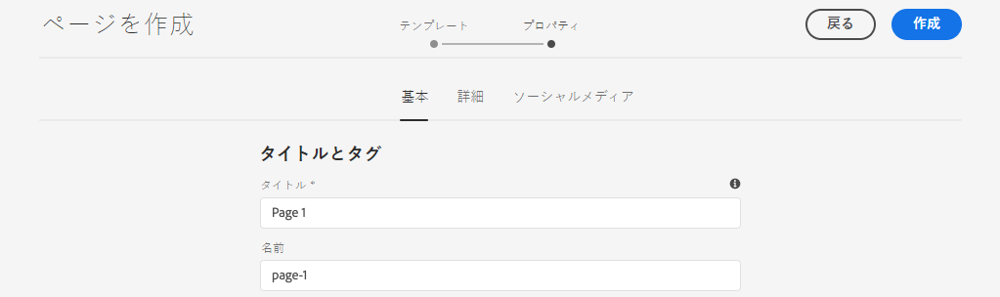

   「**作成**」をクリックし、ダイアログのポップアップで「**開く**」をクリックして、AEM SPA エディターでページを開きます。

1. 新規&#x200B;**テキスト**&#x200B;コンポーネントをメインの&#x200B;**レイアウトコンテナ**&#x200B;に追加します。コンポーネントを編集し、RTE と **H2** 要素を使用して「**Page 1**」というテキストを入力します。

   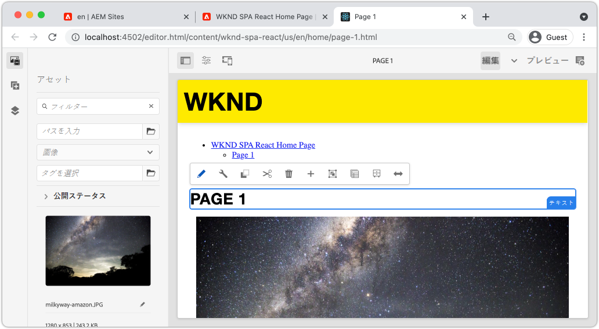

   画像などのコンテンツを自由に追加できます。

1. AEM Sites コンソールに戻り、上記の手順を繰り返して、**Page 1** の兄弟として **Page 2** という名前の 2 番目のページを作成します。
1. 最後に、3 番目のページである **Page 3** を、**Page 2** の&#x200B;**子**&#x200B;として作成します。完了すると、サイト階層は次のようになります。

   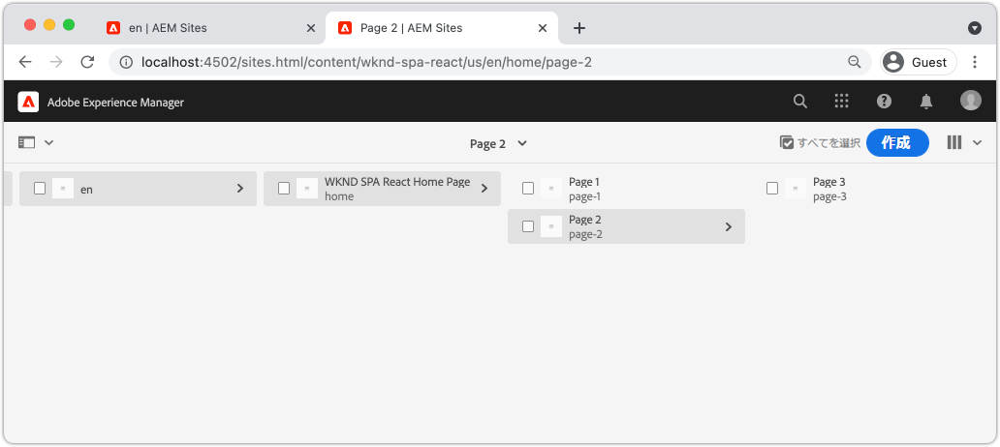

1. ナビゲーションコンポーネントを使用して、SPA の様々な領域に移動できるようになりました。

   

1. AEM エディターの外部でページを開きます。[http://localhost:4502/content/wknd-spa-react/us/en/home.html](http://localhost:4502/content/wknd-spa-react/us/en/home.html)。**ナビゲーション**&#x200B;コンポーネントを使用して、アプリの様々なビューに移動します。

1. ブラウザーのデベロッパーツールを使用して、ナビゲート中にネットワークリクエストを調べます。以下のスクリーンショットは、Google Chrome ブラウザーからキャプチャしたものです。

   

   最初のページを読み込んだ後、後続のナビゲーションでページ全体が更新されず、以前訪問したページに戻る際にネットワークトラフィックが最小化されていることを確認します。

## 階層ページの JSON モデル {#hierarchy-page-json-model}

次に、SPA のマルチビューエクスペリエンスを推進する JSON モデルを調べます。

1. 新規タブで、AEM が提供する JSON モデル API を開きます。[http://localhost:4502/content/wknd-spa-react/us/en.model.json](http://localhost:4502/content/wknd-spa-react/us/en.model.json)。ブラウザー拡張機能を使用して [JSON の形式を設定する](https://chrome.google.com/webstore/detail/json-formatter/bcjindcccaagfpapjjmafapmmgkkhgoa)と役立つ場合があります。

   この JSON コンテンツは、SPAが最初に読み込まれる際にリクエストされます。 外側の構造は次のようになります。

   ```json
   {
   "language": "en",
   "title": "en",
   "templateName": "spa-app-template",
   "designPath": "/libs/settings/wcm/designs/default",
   "cssClassNames": "spa page basicpage",
   ":type": "wknd-spa-react/components/spa",
   ":items": {},
   ":itemsOrder": [],
   ":hierarchyType": "page",
   ":path": "/content/wknd-spa-react/us/en",
   ":children": {
      "/content/wknd-spa-react/us/en/home": {},
      "/content/wknd-spa-react/us/en/home/page-1": {},
      "/content/wknd-spa-react/us/en/home/page-2": {},
      "/content/wknd-spa-react/us/en/home/page-2/page-3": {}
      }
   }
   ```

   `:children` には、作成した各ページのエントリが表示されます。 すべてのページのコンテンツは、この最初の JSON リクエストに含まれます。 ナビゲーションルーティングを使用すると、コンテンツが既にクライアントサイドで使用可能になっているため、SPA の後続のビューが素早く読み込まれます。

   最初のページの読み込みが遅くなるため、最初の JSON リクエストで SPA の&#x200B;**すべて**&#x200B;のコンテンツを読み込むのは得策ではありません。次に、ページの階層の深度を収集する方法について説明します。

1. **SPA Root**&#x200B;テンプレートに移動します。[http://localhost:4502/editor.html/conf/wknd-spa-react/settings/wcm/templates/spa-app- template/structure.html](http://localhost:4502/editor.html/conf/wknd-spa-react/settings/wcm/templates/spa-app-template/structure.html)。

   **ページプロパティメニュー**／**ページポリシー**&#x200B;をクリックします。

   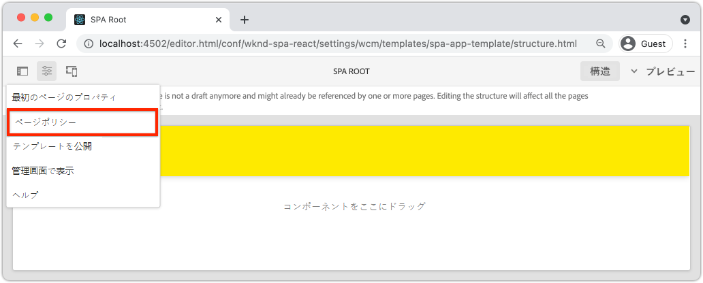

1. **SPA Root** テンプレートにある「**階層構造**」タブでは、収集される JSON コンテンツを制御できます。 **構造深度**&#x200B;では、**root**&#x200B;の下にある子ページのサイト階層内での収集深度が決定されます。「**構造パターン**」フィールドを使用して、正規表現に基づいて追加のページを除外することもできます。

   「**構造の深度**」を **2** に更新します。

   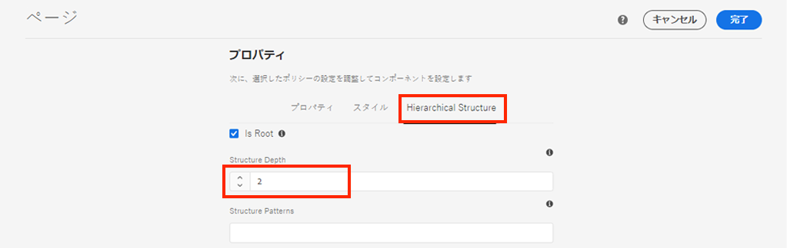

   「**完了**」をクリックして、変更をポリシーに保存します。

1. JSON モデルを再度開きます。 [http://localhost:4502/content/wknd-spa-react/us/en.model.json](http://localhost:4502/content/wknd-spa-react/us/en.model.json)

   ```json
   {
   "language": "en",
   "title": "en",
   "templateName": "spa-app-template",
   "designPath": "/libs/settings/wcm/designs/default",
   "cssClassNames": "spa page basicpage",
   ":type": "wknd-spa-react/components/spa",
   ":items": {},
   ":itemsOrder": [],
   ":hierarchyType": "page",
   ":path": "/content/wknd-spa-react/us/en",
   ":children": {
      "/content/wknd-spa-react/us/en/home": {},
      "/content/wknd-spa-react/us/en/home/page-1": {},
      "/content/wknd-spa-react/us/en/home/page-2": {}
      }
   }
   ```

   **Page 3** のパス（最初の JSON モデルの `/content/wknd-spa-react/us/en/home/page-2/page-3`）が削除されています。これは、**Page 3** が階層のレベル 3 にあり、レベル 2 の最大深度のコンテンツのみを含めるようにポリシーを更新したためです。

1. SPA ホームページ（[http://localhost:4502/content/wknd-spa-react/us/en/home.html](http://localhost:4502/content/wknd-spa-react/us/en/home.html)）を再度開き、ブラウザーのデベロッパーツールを開きます。

   ページを更新すると、SPA Root である `/content/wknd-spa-react/us/en.model.json` への XHR リクエストが表示されます。このチュートリアルで前述した SPA ルートテンプレートの階層の深さ設定に基づいて、3 つの子ページのみが含まれます。 これには、**Page 3** は含まれません。

   

1. デベロッパーツールを開いた状態で、`Navigation` コンポーネントを使用して **Page 3** に直接移動します。

   `/content/wknd-spa-react/us/en/home/page-2/page-3.model.json` に対して新しい XHR リクエストが行われることを確認します。

   

   AEM Model Manager では、**Page 3** の JSON コンテンツは使用せず、追加の XHR リクエストを自動的にトリガーします。

1. [http://localhost:4502/content/wknd-spa-react/us/en/home/page-2.html](http://localhost:4502/content/wknd-spa-react/us/en/home/page-2.html) に直接移動して、ディープリンクを試します。また、ブラウザーの「戻る」ボタンが引き続き機能することを確認します。

## React ルーティングの検査  {#react-routing}

ナビゲーションとルーティングは [React Router](https://reactrouter.com/en/main) で実装されています。React Router は、React アプリケーション用のナビゲーションコンポーネントのコレクションです。[AEM React コアコアコンポーネント](https://github.com/adobe/aem-react-core-wcm-components-base)は、React Router の機能を使用して、前の手順で使用した&#x200B;**ナビゲーション**&#x200B;コンポーネントを実装します。

次に、React Router が SPA とどのように統合されているかを調べ、React Router の[リンク](https://reactrouter.com/en/main/components/link)コンポーネントを使用して実験します。

1. IDE で、`ui.frontend/src/index.js` にあるファイル `index.js` を開きます。

   ```js
   /* index.js */
   import { Router } from 'react-router-dom';
   ...
   ...
    ModelManager.initialize().then(pageModel => {
       const history = createBrowserHistory();
       render(
       <Router history={history}>
           <App
           history={history}
           cqChildren={pageModel[Constants.CHILDREN_PROP]}
           cqItems={pageModel[Constants.ITEMS_PROP]}
           cqItemsOrder={pageModel[Constants.ITEMS_ORDER_PROP]}
           cqPath={pageModel[Constants.PATH_PROP]}
           locationPathname={window.location.pathname}
           />
       </Router>,
       document.getElementById('spa-root')
       );
   });
   ```

   `App` が [React Router](https://reacttraining.com/react-router) の `Router` コンポーネントにラップされていることを確認します。`ModelManager` は AEM SPA Editor JS SDK で提供され、JSON モデル API に基づいて動的ルートを AEM ページに追加します。

1. `ui.frontend/src/components/Page/Page.js` でファイル `Page.js` を開きます

   ```js
   class AppPage extends Page {
     get containerProps() {
       let attrs = super.containerProps;
       attrs.className =
         (attrs.className || '') + ' page ' + (this.props.cssClassNames || '');
       return attrs;
     }
   }
   
   export default MapTo('wknd-spa-react/components/page')(
     withComponentMappingContext(withRoute(AppPage))
   );
   ```

   `Page` SPA コンポーネントは、`MapTo` 関数を使用して、AEM の&#x200B;**ページ**&#x200B;を対応する SPA コンポーネントにマップします。`withRoute` ユーティリティは、`cqPath` プロパティに基づいて、SPA を適切な AEM 子ページに動的にルーティングするのに役立ちます。

1. `ui.frontend/src/components/Header/Header.js` で `Header.js` コンポーネントを開きます。
1. `Header` を更新して、ホームページへの[リンク](https://reactrouter.com/en/main/components/link)で `<h1>` タグをラップします。

   ```diff
     //Header.js
     import React, {Component} from 'react';
   + import {Link} from 'react-router-dom';
     require('./Header.css');
   
   export default class Header extends Component {
   
       render() {
           return (
               <header className="Header">
               <div className="Header-container">
   +              <Link to="/content/wknd-spa-react/us/en/home.html">
                       <h1>WKND</h1>
   +              </Link>
               </div>
               </header>
           );
       }
   ```

   デフォルトの `<a>` アンカータグを使用する代わりに、React Router が提供する `<Link>` を使用します。`to=` が有効なルートを指す場合、SPA はそのルートに切り替わり、ページ全体の更新は実行&#x200B;**しません**。ここでは、単にホームページへのリンクをハードコードして、`Link` の使用法について説明します。

1. `ui.frontend/src/App.test.js` で `App.test.js` のテストを更新します。

   ```diff
   + import { BrowserRouter as Router } from 'react-router-dom';
     import App from './App';
   
     it('renders without crashing', () => {
       const div = document.createElement('div');
   -   ReactDOM.render(<App />, div);
   +   ReactDOM.render(<Router><App /></Router>, div);
     });
   ```

   `App.js` で参照される静的コンポーネント内で React Router の機能を使用しているため、単体テストを更新する際には考慮が必要です。

1. ターミナルを開き、プロジェクトのルートに移動して、Maven スキルを使用して AEM にプロジェクトをデプロイします。

   ```shell
   $ cd aem-guides-wknd-spa.react
   $ mvn clean install -PautoInstallSinglePackage
   ```

1. AEM で SPA のいずれかのページに移動します。[http://localhost:4502/content/wknd-spa-react/us/en/home/page-1.html](http://localhost:4502/content/wknd-spa-react/us/en/home/page-1.html)

   `Navigation` コンポーネントを使用して移動する代わりに、`Header` 内のリンクを使用します。

   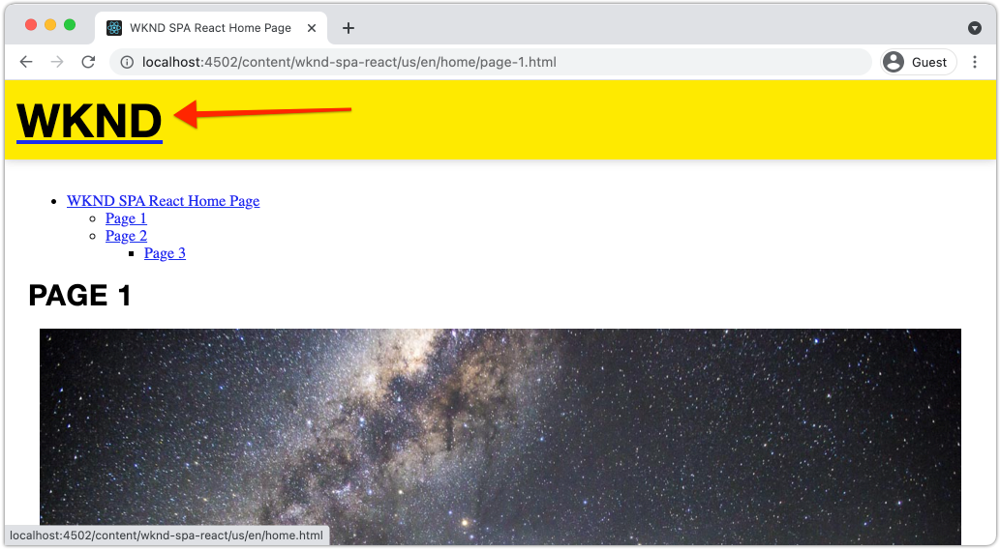

   ページ全体の更新がトリガー&#x200B;**されず**、SPA ルーティングが機能していることを確認します。

1. 必要に応じて、標準の `<a>` アンカータグを使用して `Header.js` ファイルで試します。

   ```js
   <a href="/content/wknd-spa-react/us/en/home.html">
       <h1>WKND</h1>
   </a>
   ```

   これは、SPA ルーティングと通常の web ページリンクの違いを説明するのに役立ちます。

## おめでとうございます。 {#congratulations}

これで、SPA Editor SDK で AEM ページにマッピングすることで、SPA の複数のビューをサポートする方法を学びました。 React Router を使用して動的ナビゲーションが実装され、`Header` コンポーネントに追加されました。
