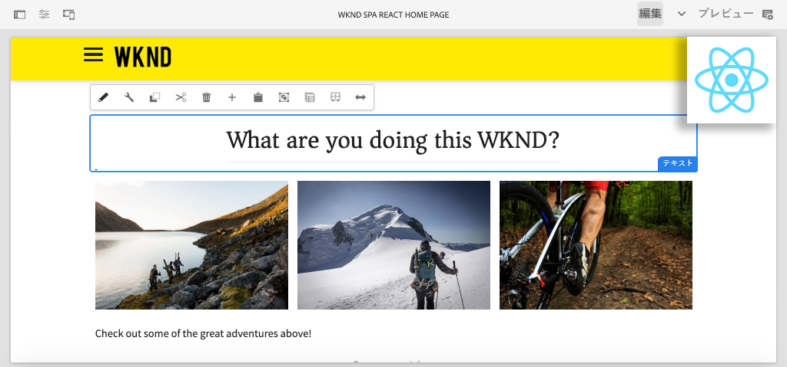

# AEM での React SPA の作成（チュートリアル） {#overview}

{{spa-editor-deprecation}}

Adobe Experience Manager（AEM）の **SPA エディター**&#x200B;機能を初めて使用する開発者向けに設計されたマルチパートチュートリアルへようこそ。このチュートリアルでは、架空のライフスタイルブランド WKND の React アプリケーションの実装について順を追って説明します。React アプリは、AEM の SPA エディターを使用してデプロイされるように開発および設計されています。このエディターは、React コンポーネントを AEM コンポーネントにマッピングします。AEM にデプロイされた完成した SPA は、AEM の従来のインライン編集ツールを使用して動的にオーサリングすることができます。

*WKND SPA の実装*

## 概要

このチュートリアルは、**AEM as a Cloud Service** で動作するように設計されており、**AEM 6.5.4+** および **AEM 6.4.8+** と下位互換性があります。

## 最新のコード

チュートリアルコードはすべて [GitHub](https://github.com/adobe/aem-guides-wknd-spa) にあります。

この[最新のコードベース](https://github.com/adobe/aem-guides-wknd-spa/releases)は、ダウンロード可能な AEM パッケージとして入手できます。

## 前提条件

このチュートリアルを開始するにあたって、以下が必要です。

* HTML、CSS および JavaScript の基礎知識
* [React](https://ja.reactjs.org/tutorial/tutorial.html) の基本的な知識

*必須ではありませんが、[従来の AEM Sites コンポーネントの開発](https://experienceleague.adobe.com/docs/experience-manager-learn/getting-started-wknd-tutorial-develop/overview.html?lang=ja)に関する基本的な知識があると役に立ちます。*

## ローカル開発環境 {#local-dev-environment}

このチュートリアルを完了するには、ローカル開発環境が必要です。スクリーンショットとビデオは、[Visual Studio Code](https://code.visualstudio.com/) を IDE とする Mac OS 環境で動作する AEM as a Cloud Service SDK を使用してキャプチャされています。コマンドとコードは、特に明記されていない限り、ローカルオペレーティングシステムから独立している必要があります。

### 必要なソフトウェア

* [AEM as a Cloud Service SDK](https://experienceleague.adobe.com/docs/experience-manager-learn/cloud-service/local-development-environment-set-up/aem-runtime.html?lang=ja)、[AEM 6.5.4 以降](https://experienceleague.adobe.com/docs/experience-manager-release-information/aem-release-updates/aem-releases-updates.html?lang=ja#aem-65) または [AEM 6.4.8 以降](https://experienceleague.adobe.com/docs/experience-manager-release-information/aem-release-updates/aem-releases-updates.html?lang=ja#aem-64)
* [Java](https://downloads.experiencecloud.adobe.com/content/software-distribution/en/general.html)
* [Apache Maven](https://maven.apache.org/)（3.3.9 以降）
* [Node.js](https://nodejs.org/ja/) および [npm](https://www.npmjs.com/)

>[!NOTE]
>
> **AEM as a Cloud Service を初めて使用する場合は、**[AEM as a Cloud Service SDK を使用してローカル開発環境をセットアップするためのガイド](https://experienceleague.adobe.com/docs/experience-manager-learn/cloud-service/local-development-environment-set-up/overview.html?lang=ja)を確認してください。
>
> **AEM 6.5 を初めて使用する場合は、**[ローカル開発環境のセットアップに関するガイド](https://experienceleague.adobe.com/docs/experience-manager-learn/foundation/development/set-up-a-local-aem-development-environment.html?lang=ja)を参照してください。

## 次の手順 {#next-steps}

すぐに取りかかりましょう。[プロジェクトの作成](create-project.md)の章に移動してチュートリアルを開始し、AEM プロジェクトアーキタイプを使用して SPA エディター対応のプロジェクトを生成する方法を学びます。
