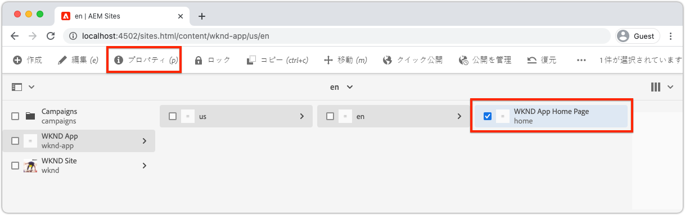
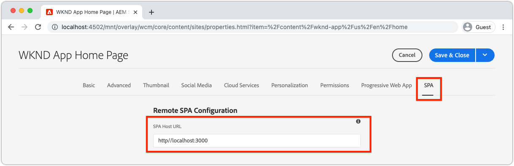

# SPAエディタ用のAEMの設定

SPAのコードベースはAEMの外部で管理されますが、サポートする設定とコンテンツの要件を設定するにはAEMプロジェクトが必要です。 この章では、必要な設定を含むAEMプロジェクトの作成に関する手順を説明します。

+ AEM WCMコアコンポーネントプロキシ
+ AEMリモートSPAページプロキシ
+ AEMリモートSPAページテンプレート
+ ベースラインリモートSPA AEMページ
+ SPAとAEM URLのマッピングを定義するサブプロジェクト
+ OSGi構成フォルダ

## AEMプロジェクトの作成

設定と基本コンテンツが管理されるAEMプロジェクトを作成します。

_常に [AEMアーキタイプの最新バージョンを使用してください](https://github.com/adobe/aem-project-archetype)。_


```
$ mkdir -p ~/Code/wknd-app
$ cd ~/Code/wknd-app
$ mvn -B archetype:generate \
 -D archetypeGroupId=com.adobe.aem \
 -D archetypeArtifactId=aem-project-archetype \
 -D archetypeVersion=27 \
 -D aemVersion=cloud \
 -D appTitle="WKND App" \
 -D appId="wknd-app" \
 -D groupId="com.adobe.aem.guides.wkndapp" \
 -D frontendModule="react"
$ mv ~/Code/wknd-app/wknd-app ~/Code/wknd-app/com.adobe.aem.guides.wknd-app
```

_最後のコマンドは、AEMプロジェクトフォルダの名前を変更するだけで、AEMプロジェクトであることが明確になり、Remote SPA__と混同しないようにします。

`frontendModule="react"`が指定されている場合、`ui.frontend`プロジェクトはリモートSPAの使用例には使用されません。 SPAは、AEMに対して外部的に開発および管理され、コンテンツAPIとしてAEMのみを使用します。 プロジェクトには`frontendModule="react"`フラグが必要です。`spa-project` AEM Java™依存関係を含め、リモートSPAページテンプレートを設定します。

AEMプロジェクトのアーキタイプは、SPAとの統合用にAEMを設定するために使用する次の要素を生成します。

+ __AEM WCMコアコンポーネント__ の問題  `ui.content/src/.../apps/wknd-app/components`
+ __AEM SPAリモートページ__ プロキシ  `ui.content/src/.../apps/wknd-app/components/remotepage`
+ __AEM Page__ Templatesat  `ui.content/src/.../conf/wknd-app/settings/wcm/templates`
+ __コンテンツの__ マッピングを定義するサブプロジェクト  `ui.content/src/...`
+ __ベースラインリモートSPA AEM__ ページ  `ui.content/src/.../content/wknd-app`
+ __OSGi設定__ フォルダ  `ui.config/src/.../apps/wknd-app/osgiconfig`

基本AEMプロジェクトを生成する場合、いくつかの調整によってSPAエディタとリモートSPAとの互換性が確保されます。

## ui.frontendプロジェクトを削除

SPAはリモートのSPAであるため、AEMプロジェクトの外部で開発および管理されていると想定します。 競合を回避するには、`ui.frontend`プロジェクトを展開から削除します。 `ui.frontend`プロジェクトが削除されない場合は、2つのSPA(`ui.frontend`プロジェクトにデフォルトで提供されるSPAとリモートSPA)が、AEM SPAエディタに同時に読み込まれます。

1. IDEでAEMプロジェクト(`~/Code/wknd-app/com.adobe.aem.guides.wknd-app`)を開きます。
1. ルート`pom.xml`を開きます
1. `<module>ui.frontend</module`を`<modules>`リストからコメントアウトします

   ```
   <modules>
       <module>all</module>
       <module>core</module>
   
       <!-- <module>ui.frontend</module> -->
   
       <module>ui.apps</module>
       <module>ui.apps.structure</module>
       <module>ui.config</module>
       <module>ui.content</module>
       <module>it.tests</module>
       <module>dispatcher</module>
       <module>ui.tests</module>
       <module>analyse</module>
   </modules>
   ```

   `pom.xml`ファイルは次のようになります。

   

1. `ui.apps/pom.xml`を開く
1. `<artifactId>wknd-app.ui.frontend</artifactId>`の`<dependency>`をコメントアウト

   ```
   <dependencies>
   
       <!-- Remote SPA project will provide all frontend resources
       <dependency>
           <groupId>com.adobe.aem.guides.wkndapp</groupId>
           <artifactId>wknd-app.ui.frontend</artifactId>
           <version>${project.version}</version>
           <type>zip</type>
       </dependency>
       --> 
   </dependencies>
   ```

   `ui.apps/pom.xml`ファイルは次のようになります。

   

これらの変更の前にAEMプロジェクトが構築された場合は、`ui.apps/src/main/content/jcr_root/apps/wknd-app/clientlibs/clientlib-react`の`ui.apps`プロジェクトから`ui.frontend`生成されたクライアントライブラリを手動で削除します。

## AEMコンテンツマッピング

AEMがSPAエディタでリモートSPAを読み込むには、SPAルートと、コンテンツを開いてオーサリングするために使用するAEMページとの間のマッピングを確立する必要があります。

この設定の重要性は、後で説明します。

マッピングは、`/etc/map`で定義された[Sling Mapping](https://sling.apache.org/documentation/the-sling-engine/mappings-for-resource-resolution.html#root-level-mappings-1)で行うことができます。

1. IDEで`ui.content`サブプロジェクトを開きます。
1. `src/main/content/jcr_root/etc` に移動します。
1. フォルダーの作成 `map`
1. `map`にフォルダー`http`を作成します
1. `http`に、ファイル`.content.xml`を作成し、内容を指定します。

   ```
   <?xml version="1.0" encoding="UTF-8"?>
   <jcr:root xmlns:sling="http://sling.apache.org/jcr/sling/1.0" xmlns:jcr="http://www.jcp.org/jcr/1.0"
       jcr:primaryType="sling:Mapping">
       <localhost_any/>
   </jcr:root>
   ```

1. `http`にフォルダー`localhost_any`を作成します
1. `localhost_any`に、ファイル`.content.xml`を作成し、内容を指定します。

   ```
   <?xml version="1.0" encoding="UTF-8"?>
   <jcr:root xmlns:sling="http://sling.apache.org/jcr/sling/1.0" xmlns:jcr="http://www.jcp.org/jcr/1.0"
       jcr:primaryType="sling:Mapping"
       sling:match="localhost\\.\\d+">
       <wknd-app-routes-adventure/>
   </jcr:root>
   ```

1. `localhost_any`にフォルダー`wknd-app-routes-adventure`を作成します
1. `wknd-app-routes-adventure`に、ファイル`.content.xml`を作成し、内容を指定します。

   ```
   <?xml version="1.0" encoding="UTF-8"?>
   
   <!--
   The 'wknd-app-routes-adventure' mapping, maps requests to the SPA's adventure route 
   to it's corresponding page in AEM at /content/wknd-app/us/en/home/adventure/xxx.
   
   Note the adventure AEM pages will be created directly in AEM.
   -->
   
   <jcr:root xmlns:sling="http://sling.apache.org/jcr/sling/1.0" xmlns:jcr="http://www.jcp.org/jcr/1.0"
       jcr:primaryType="sling:Mapping"
       sling:match="adventure:.*/([^/]+)/?$"
       sling:internalRedirect="/content/wknd-app/us/en/home/adventure/$1"/>
   ```

1. AEMパッケージに含ま追加れる`ui.content/src/main/content/META-INF/vault/filter.xml`にノードをマッピングします。

   ```
   <?xml version="1.0" encoding="UTF-8"?>
   <workspaceFilter version="1.0">
       <filter root="/conf/wknd-app" mode="merge"/>
       <filter root="/content/wknd-app" mode="merge"/>
       <filter root="/content/dam/wknd-app/asset.jpg" mode="merge"/>
       <filter root="/content/experience-fragments/wknd-app" mode="merge"/>
   
       <!-- Add the Sling Mapping rules for the WKND App -->
       <filter root="/etc/map" mode="merge"/>
   </workspaceFilter>
   ```

フォルダー構造と`.context.xml`ファイルは次のようになります。


`filter.xml`ファイルは次のようになります。


現在は、AEMプロジェクトがデプロイされると、これらの設定が自動的に含まれます。

Slingマッピングは、`http`と`localhost`上で動作するAEMに影響するので、ローカル開発のみをサポートします。 AEMにCloud Serviceとして展開する場合は、同様のSling Mappingsを追加して、ターゲット`https`と適切なAEMをCloud Serviceドメインとして追加する必要があります。 詳しくは、[Sling Mappingのドキュメント](https://sling.apache.org/documentation/the-sling-engine/mappings-for-resource-resolution.html)を参照してください。

## 接触チャネル間のリソース共有セキュリティポリシー

次に、AEMを設定してコンテンツを保護し、SPAだけがAEMコンテンツにアクセスできるようにします。 C AEM](https://experienceleague.adobe.com/docs/experience-manager-learn/foundation/security/develop-for-cross-origin-resource-sharing.html)で[接触チャネル間のリソース共有を設定します。

1. IDEで、`ui.config` Mavenサブプロジェクトを開きます。
1. 移動する `src/main/content/jcr_root/apps/wknd-app/osgiconfig/config`
1. `com.adobe.granite.cors.impl.CORSPolicyImpl~wknd-app_remote-spa.cfg.json`という名前のファイルを作成します
1. ファイル追加に次の情報が追加されます。

   ```
   {
       "supportscredentials":true,
       "exposedheaders":[
           ""
       ],
       "supportedmethods":[
           "GET",
           "HEAD",
           "POST",
           "OPTIONS"
       ],
       "alloworigin":[
           "https://external-hosted-app", "localhost:3000"
       ],
       "maxage:Integer":1800,
       "alloworiginregexp":[
           ".*"
       ],
       "allowedpaths":[
           ".*"
       ],
       "supportedheaders":[
           "Origin",
           "Accept",
           "X-Requested-With",
           "Content-Type",
           "Access-Control-Request-Method",
           "Access-Control-Request-Headers",
           "Authorization"
       ]
   }
   ```

`com.adobe.granite.cors.impl.CORSPolicyImpl~wknd-app_remote-spa.cfg.json`ファイルは次のようになります。


主な設定要素は次のとおりです。

+ `alloworigin` AEMからコンテンツを取得できるホストを指定します。
   + `localhost:3000` は、ローカルで実行されているSPAをサポートするために追加されます。
   + `https://external-hosted-app` は、リモートSPAがホストされているドメインに置き換えられるプレースホルダーとして機能します。
+ `allowedpaths` AEMのどのパスがこのCORS設定の対象となるかを指定します。デフォルトではAEM内のすべてのコンテンツへのアクセスが許可されていますが、SPAがアクセスできる特定のパスにのみアクセスできます。例：`/content/wknd-app`.

## AEMページをリモートSPAページテンプレートとして設定

AEM Project Archetypeは、リモートSPAとのAEM統合を前提としたプロジェクトを生成しますが、自動生成されたAEMページ構造に対しては、小さながら重要な調整が必要です。 自動生成されるAEMページのタイプは、__SPAページ__&#x200B;ではなく、__リモートSPAページ__&#x200B;に変更する必要があります。

1. IDEで`ui.content`サブプロジェクトを開きます。
1. `src/main/content/jcr_root/content/wknd-app/us/en/home/.content.xml`を開く
1. この`.content.xml`ファイルを次で更新：

   ```
   <?xml version="1.0" encoding="UTF-8"?>
   <jcr:root xmlns:sling="http://sling.apache.org/jcr/sling/1.0" xmlns:cq="http://www.day.com/jcr/cq/1.0" xmlns:jcr="http://www.jcp.org/jcr/1.0" xmlns:nt="http://www.jcp.org/jcr/nt/1.0"
           jcr:primaryType="cq:Page">
       <jcr:content
           cq:template="/conf/wknd-app/settings/wcm/templates/spa-remote-page"
           jcr:primaryType="cq:PageContent"
           jcr:title="WKND App Home Page"
           sling:resourceType="wknd-app/components/remotepage">
           <root
               jcr:primaryType="nt:unstructured"
               sling:resourceType="wcm/foundation/components/responsivegrid">
               <responsivegrid
                   jcr:primaryType="nt:unstructured"
                   sling:resourceType="wcm/foundation/components/responsivegrid">
                   <text
                       jcr:primaryType="nt:unstructured"
                       sling:resourceType="wknd-app/components/text"
                       text="&lt;p>Hello World!&lt;/p>"
                       textIsRich="true">
                       <cq:responsive jcr:primaryType="nt:unstructured"/>
                   </text>
               </responsivegrid>
           </root>
       </jcr:content>
   </jcr:root>
   ```

キーの変更は`jcr:content`ノードの更新です。

+ `cq:template`コピー先：`/conf/wknd-app/settings/wcm/templates/spa-remote-page`
+ `sling:resourceType`コピー先：`wknd-app/components/remotepage`

`src/main/content/jcr_root/content/wknd-app/us/en/home/.content.xml`ファイルは次のようになります。


これらの変更により、AEMのSPAルートとして機能するこのページで、SPAエディタでリモートSPAを読み込むことができます。

>[!NOTE]
>
>このプロジェクトが以前AEM向けのものであった場合は、__update__&#x200B;ではなく&#x200B;__merge__&#x200B;ノードに設定されているので、AEMページを&#x200B;__Sites/>WKND App > us > en > WKND Appホームページ__&#x200B;として削除してください。`ui.content`

このページは、AEM自体でリモートSPAページとして削除し、再作成することもできますが、このページは`ui.content`プロジェクトで自動的に作成されるので、コードベースで更新することをお勧めします。

## AEMプロジェクトのAEM SDKへのデプロイ

1. AEM Authorサービスがポート4502で実行されていることを確認します。
1. コマンドラインからAEM Mavenプロジェクトのルートに移動します
1. Mavenを使用して、ローカルのAEM SDK Authorサービスにプロジェクトをデプロイします。

   ```
   $ mvn clean install -PautoInstallSinglePackage
   ```

   

## ルートAEMページの設定

AEM Projectをデプロイした後、最後にSPA Editorを準備してRemote SPAを読み込むための手順が1つあります。 AEMで、AEMプロジェクトアーキタイプで生成されたSPAルート`/content/wknd-app/us/en/home`に対応するAEMページにマークを付けます。

1. AEM作成者にログインする
1. __サイト/WKND App > us > en__&#x200B;に移動します。
1. __WKNDアプリホームページ__&#x200B;を選択し、__プロパティ__&#x200B;をタップします

   

1. __SPA__&#x200B;タブに移動します
1. __リモートSPA設定__&#x200B;に入力します。
   + __SPA Host URL__:  `http://localhost:3000`
      + リモートSPAのルートへのURL

   

1. 「__保存して閉じる__」をタップします

このページのタイプを&#x200B;__リモートSPAページ__&#x200B;のタイプに変更しました。これにより、__ページプロパティ__&#x200B;に&#x200B;__SPA__&#x200B;タブが表示されます。

この設定は、SPAのルートに対応するAEMページでのみ設定する必要があります。 このページの下にあるすべてのAEMページが値を継承します。

## これで完了です

AEM設定を準備し、ローカルのAEM作成者に展開しました。 これで、次の方法がわかりました。

+ `ui.frontend`内の依存関係をコメントアウトして、AEMプロジェクトのアーキタイプ生成SPAを削除します。
+ AEM追加のリソースにSPAルートをマッピングするAEMへのSlingマッピング
+ リモートSPAがAEMのコンテンツを消費できるようにするAEMクロス接触チャネルリソース共有セキュリティポリシーの設定
+ ローカルのAEM SDKオーサーサービスにAEMプロジェクトをデプロイします。
+ SPA Host URLページのプロパティを使用して、AEMページをリモートSPAルートとしてマークする

## 次の手順

AEMが設定されている場合、AEM SPAエディタを使用して、編集可能な領域をサポートする[リモートSPA](./spa-bootstrap.md)をブートストラップすることに重点を置くことができます。