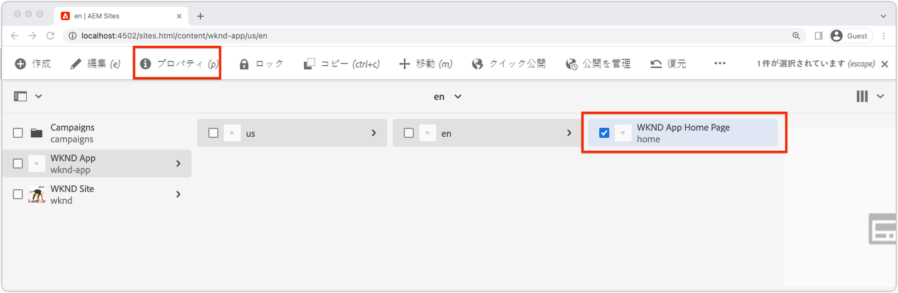
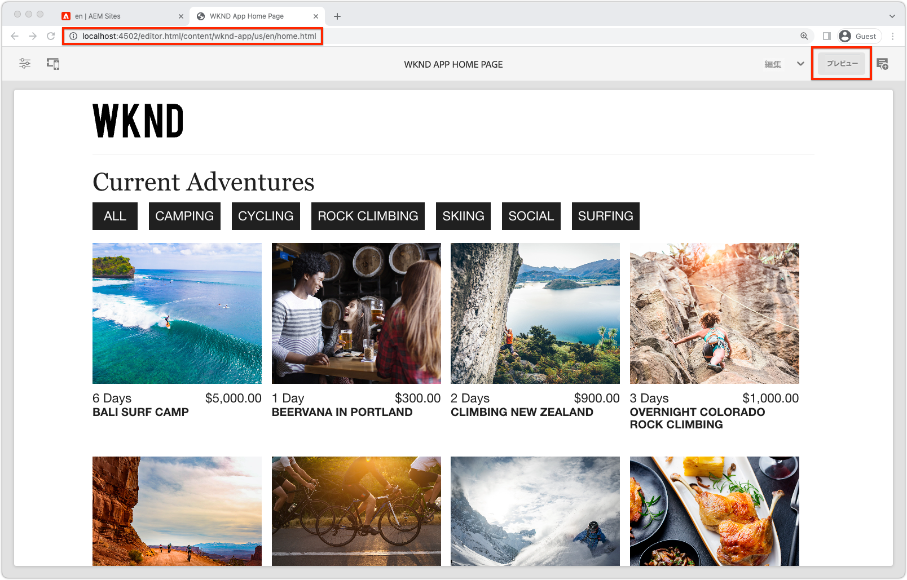

# SPAエディタ用のリモートSPAのBootstrap

編集可能な領域をリモートSPAに追加する前に、AEM SPAエディタJavaScript SDKおよびその他の設定でブートストラップする必要があります。

## AEM 追加 SPAエディタJS SDK npmの依存関係

まず、AEM SPA npm依存関係をReactプロジェクトに追加します。

```
$ cd ~/Code/wknd-app/aem-guides-wknd-graphql/react-app
$ npm install --save \
    @adobe/aem-spa-page-model-manager \
    @adobe/aem-spa-component-mapping \
    @adobe/aem-react-editable-components \
    @adobe/aem-core-components-react-base \
    @adobe/aem-core-components-react-spa
```

+ `@adobe/aem-spa-page-model-manager` AEMからコンテンツを取得するためのAPIを提供します。
+ `@adobe/aem-spa-component-mapping` AEMコンテンツをSPAコンポーネントにマッピングするAPIを提供します。
+ ` @adobe/aem-react-editable-components` は、カスタムSPAコンポーネントを作成するためのAPIを提供し、 `AEMPage` Reactコンポーネントなどの一般的な導入を提供します。
+ `@adobe/aem-core-components-react-base` には、AEM WCMコアコンポーネントとシームレスに統合でき、SPAエディタにとって重要な機能を持つ、使いやすいReactコンポーネントのスイートが用意されています。主に、次のようなコンテンツコンポーネントが含まれます。
   + title（タイトル）
   + テキスト
   + パンくずリスト
   + その他。
+ `@adobe/aem-core-components-react-spa` には、AEM WCM Core Componentsとシームレスに統合できるが、SPA Editorが必要な、使いやすいReactコンポーネントのスイートが用意されています。主に`@adobe/aem-core-components-react-base`のコンテンツコンポーネントを含むコンポーネントが含まれます。例：
   + コンテナ
   + カルーセル
   + など。

## SPA環境変数の確認

いくつかの環境変数は、AEMとのやり取り方法を知るために、リモートSPAに公開する必要があります。

1. IDEの`~/Code/wknd-app/aem-guides-wknd-graphql/react-app`にあるリモートSPAプロジェクトを開きます。
1. ファイル`.env.development`を開きます
1. フ追加ァイルは、キーに特に注意を払っています。

   ```
   REACT_APP_HOST_URI=http://localhost:4502
   REACT_APP_AUTHORIZATION=admin:admin
   ```

   

   *React内のカスタム環境変数の前には必ずプレフィックスを付ける必要があり `REACT_APP_`ます。*

   + `REACT_APP_AEM_URI`:リモートSPAが接続するAEMサービスのスキームとホスト。
      + この値は、AEM環境（ローカル、開発、ステージまたは実稼働）とAEMサービスのタイプ（作成者と公開）に基づいて変化します
   + `REACT_APP_AEM_AUTH`:SPAが使用する秘密鍵証明書は、AEMに対して認証され、コンテンツを取得します。
      + AEM作成者で使用する場合は必須
      + AEM Publishでの使用に必要な場合があります（コンテンツが保護されている場合）
      + AEM SDKに対する開発では、基本認証を介したローカルアカウントがサポートされます。 これは、このチュートリアルで使用する方法です。
      + AEMとのCloud Serviceとの統合時には、[アクセストークン](https://experienceleague.adobe.com/docs/experience-manager-learn/getting-started-with-aem-headless/authentication/overview.html)を使用します

## ModelManager APIの統合

アプリケーションで使用できるAEM SPA npm依存関係を使用して、`ReactDOM.render(...)`を呼び出す前に、プロジェクトの`index.js`でAEM `ModelManager`を初期化します。

[ModelManager](https://www.npmjs.com/package/@adobe/aem-spa-page-model-manager)は、AEMに接続して編集可能なコンテンツを取得します。

1. IDEでリモートSPAプロジェクトを開きます
1. ファイル`src/index.js`を開きます
1. 追加`ModelManager`を読み込んで、`ReactDOM.render(..)`呼び出しの前に初期化し、

   ```
   ...
   import { ModelManager } from "@adobe/aem-spa-page-model-manager";
   
   // Initialize the ModelManager before invoking ReactDOM.render(...).
   ModelManager.initializeAsync();
   
   ReactDOM.render(...);
   ```

`src/index.js`ファイルは次のようになります。


## 内部SPAプロキシの設定

SPAのAEMから編集可能コンテンツを作成する場合は、SPA](https://create-react-app.dev/docs/proxying-api-requests-in-development/#configuring-the-proxy-manually)に[内部プロキシを設定し、適切なリクエストをAEMにルーティングするように設定することをお勧めします。 これは、[http-proxy-middleware](https://www.npmjs.com/package/http-proxy-middleware) npmモジュールを使用して行います。このモジュールは、ベースWKND GraphQL Appによって既にインストールされています。

1. IDEでリモートSPAプロジェクトを開きます
1. `src/proxy/setupProxy.spa-editor.auth.basic.js`にファイルを作成
1. 次のコードをファイルに追加しました。

   ```
   const { createProxyMiddleware } = require('http-proxy-middleware');
   const {REACT_APP_HOST_URI, REACT_APP_AUTHORIZATION } = process.env;
   
   /*
       Set up a proxy with AEM for local development
       In a production environment this proxy should be set up at the webserver level or absolute URLs should be used.
   */
   module.exports = function(app) {
   
       /**
       * Filter to check if the request should be re-routed to AEM. The paths to be re-routed at:
       * - Starts with /content (AEM content)
       * - Starts with /graphql (AEM graphQL endpoint)
       * - Ends with .model.json (AEM Content Services)
       * 
       * @param {*} path the path being requested of the SPA
       * @param {*} req the request object
       * @returns true if the SPA request should be re-routed to AEM
       */
       const toAEM = function(path, req) {
           return path.startsWith('/content') || 
               path.startsWith('/graphq') ||
               path.endsWith('.model.json')
       }
   
       /**
       * Re-writes URLs being proxied to AEM such that they can resolve to real AEM resources
       * - The "root" case of `/.model.json` are rewritten to the SPA's home page in AEM
       * - .model.json requests for /adventure:xxx routes are rewritten to their corresponding adventure page under /content/wknd-app/us/en/home/adventure/ 
       * 
       * @param {*} path the path being requested of the SPA
       * @param {*} req the request object
       * @returns returns a re-written path, or nothing to use the @param path
       */
       const pathRewriteToAEM = function (path, req) { 
           if (path === '/.model.json') {
               return '/content/wknd-app/us/en/home.model.json';
           } else if (path.startsWith('/adventure:') && path.endsWith('.model.json')) {
               return '/content/wknd-app/us/en/home/adventure/' + path.split('/').pop();
           }    
       }
   
       /**
       * Register the proxy middleware using the toAEM filter and pathRewriteToAEM rewriter 
       */
       app.use(
           createProxyMiddleware(
               toAEM, // Only route the configured requests to AEM
               {
                   target: REACT_APP_HOST_URI,
                   changeOrigin: true,
                   // Pass in credentials when developing against an Author environment
                   auth: REACT_APP_AUTHORIZATION,
                   pathRewrite: pathRewriteToAEM // Rewrite SPA paths being sent to AEM
               }
           )
       );
   
       /**
       * Enable CORS on requests from the SPA to AEM
       * 
       * If this rule is not in place, CORS errors will occur when running the SPA on http://localhost:3000
       */
       app.use((req, res, next) => {
           res.header("Access-Control-Allow-Origin", REACT_APP_HOST_URI);
           next();
       });
   };
   ```

   `setupProxy.spa-editor.auth.basic.js`ファイルは次のようになります。

   

   このプロキシ設定は、主に次の2つの処理を行います。

   1. SPA、`http://localhost:3000`、AEM `http://localhost:4502`に対して行われたプロキシ固有の要求
      + `toAEM(path, req)`で定義されているように、AEMが提供する必要があることを示すパターンと一致するパスを持つリクエストのみをプロキシします。
      + `pathRewriteToAEM(path, req)`で定義されているように、SPAのパスを対応するAEMページに書き換えます。
   1. `res.header("Access-Control-Allow-Origin", REACT_APP_HOST_URI);`の定義に従って、AEMコンテンツへのアクセスを許可するために、すべてのリクエストにCORSヘッダーを追加します。
      + このエラーが追加されない場合、SPAでAEMコンテンツを読み込む際にCORSエラーが発生します。

1. ファイル`src/setupProxy.js`を開きます
1. `const proxy = require('./proxy/setupProxy.auth.basic')`の行をコメントアウトします。
1. 新追加しいプロキシ設定ファイルを指す行。

   ```
   // Proxy configuration for SPA Editor (and GraphQL) using Basic Auth
   const proxy = require('./proxy/setupProxy.spa-editor.auth.basic')
   ```

   `setupProxy.js`ファイルは次のようになります。

   

注意：`src/setupProxy.js`や参照ファイルに変更を加えた場合は、SPAを再起動する必要があります。

## 静的SPAリソース

WKNDロゴや読み込みグラフィックなどの静的なSPAリソースは、リモートSPAホストから強制的に読み込むために、src URLを更新する必要があります。 相対パスが左の場合、SPAがオーサリングのためにSPA Editorに読み込まれると、これらのURLはデフォルトでSPAではなくAEMホストを使用し、結果として以下の画像に示すように404個のリクエストが生成されます。


この問題を解決するには、リモートSPAでホストされる静的リソースに、リモートSPA接触チャネルを含む絶対パスを使用するようにします。

1. IDEでSPAプロジェクトを開きます
1. SPA環境変数ファイル`src/.env.development`を開き、SPAパブリックURIの変数を追加します。

   ```
   ...
   # The base URI the SPA is accessed from
   REACT_APP_PUBLIC_URI=http://localhost:3000
   ```

   _AEMにCloud Serviceとして展開する場合は、対応する `.env` ファイルに対しても同じファイルを指定する必要があります。_

1. ファイル`src/App.js`を開きます
1. SPAパブリックURIのSPA環境変数からの読み込み

   ```
   const {  REACT_APP_PUBLIC_URI } = process.env;
   
   function App() { ... }
   ```

1. SPAに対して解決を強制するには、WKNDロゴ``の先頭に`REACT_APP_PUBLIC_URI`を付けます。

   ```
   
   ```

1. `src/components/Loading.js`に画像を読み込む場合も同様にする

   ```
   const { REACT_APP_PUBLIC_URI } = process.env;
   
   class Loading extends Component {
   
       render() {
           return (<div className="loading">
               
           </div>);
       }
   }
   ```

1. ... __`src/components/AdventureDetails.js`の「戻る」ボタンの2つのインスタンス__&#x200B;に対して

   ```
   const { REACT_APP_PUBLIC_URI } = process.env;
   
   function AdventureDetail(props) {
       ...
       render() {
           
       }
   }
   ```

`App.js`、`Loading.js`、`AdventureDetails.js`ファイルは次のようになります。


## AEMレスポンシブグリッド

SPAの編集可能な領域でSPA Editorのレイアウトモードをサポートするには、AEMレスポンシブグリッドCSSをSPAに統合する必要があります。 このグリッドシステムは編集可能なコンテナにのみ使用され、選択したグリッドシステムを使用して残りのSPAのレイアウトを駆動できます。

AEMレス追加ポンシブグリッドSCSSファイルをSPAに送信します。

1. IDEでSPAプロジェクトを開きます
1. 次の2つのファイルを`src/styles`にダウンロードしてコピーします
   + [_grid.scss](./assets/spa-bootstrap/_grid.scss)
      + AEMレスポンシブグリッドSCSSジェネレーター
   + [_grid-init.scs](./assets/spa-bootstrap/_grid.scss)
      + SPA固有のブレークポイント（デスクトップおよびモバイル）と列(12)を使用して`_grid.scss`を呼び出します。
1. `src/App.scss`を開き、`./styles/grid-init.scss`を読み込みます

   ```
   ...
   @import './styles/grid-init';
   ...
   ```

`_grid.scss`ファイルと`_grid-init.scss`ファイルは次のようになります。


AEMコンテナに追加されたコンポーネントのAEMレイアウトモードをサポートするために必要なCSSがSPAに含まれるようになりました。

## 開始SPA

SPAがAEMとの統合のためにブートストラップされたので、SPAを実行して、どのように表示されるかを確認しましょう。

1. コマンドラインで、SPAプロジェクトのルートに移動します
1. 通常のコマンドを使用してSPAを開始する（まだ実行していない場合は`npm install`を実行）

   ```
   $ cd ~/Code/wknd-app/aem-guides-wknd-graphql/react-app
   $ npm install 
   $ npm run start
   ```

1. [http://localhost:3000](http://localhost:3000)のSPAを参照します。 何もかもうまく見えるはずだ！


## AEM SPAエディタでSPAを開きます。

SPAが[http://localhost:3000](http://localhost:3000)上で動作している状態で、AEM SPAエディタを使用して開きましょう。 SPAでは、まだ編集できるものはありません。AEMでSPAを検証するだけです。

1. AEM作成者にログインする
1. __サイト/WKND App > us > en__&#x200B;に移動します。
1. __WKND Appホームページ__&#x200B;を選択し、「__編集__」をタップすると、SPAが表示されます。

   

1. 右上のプレビュー切り替えボタンを使用して、__モード__&#x200B;に切り替えます。
1. SPAの周りをクリック

   

## バリデーターが

AEM SPAエディタと互換性を持つようにリモートSPAをブートストラップしました。 これで、次の方法がわかりました。

+ AEM 追加 SPAエディタJS SDK npmのSPAプロジェクトへの依存関係
+ SPA環境変数の設定
+ ModelManager APIとSPAの統合
+ SPAの内部プロキシを設定し、適切なコンテンツリクエストをAEMにルーティングする
+ SPAエディターのコンテキストでの静的なSPAリソースの解決に関する問題の解決
+ AEM追加レスポンシブグリッドCSS(AEM編集可能なコンテナでのレイアウトをサポート)

## 次の手順

AEM SPAエディタとの互換性の基準を達成したので、編集可能領域の開始を行うことができます。 まず、SPAに[固定された編集可能コンポーネント](./spa-fixed-component.md)を配置する方法を見てみます。
