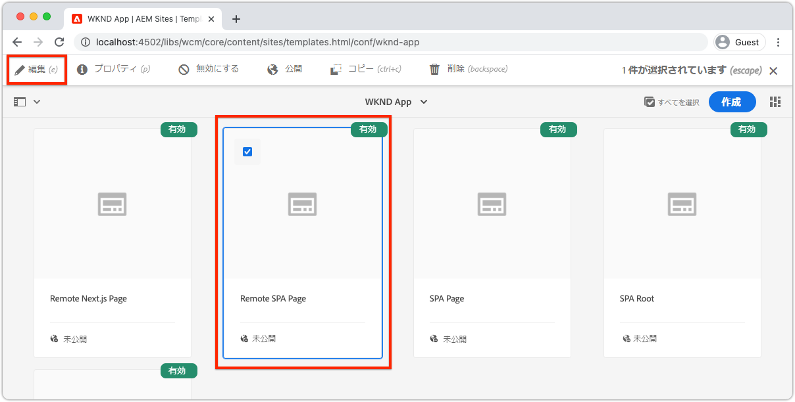
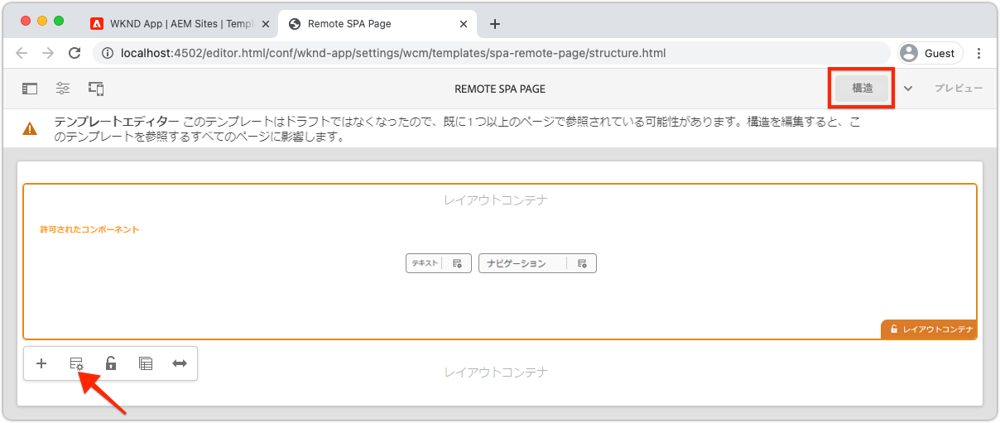
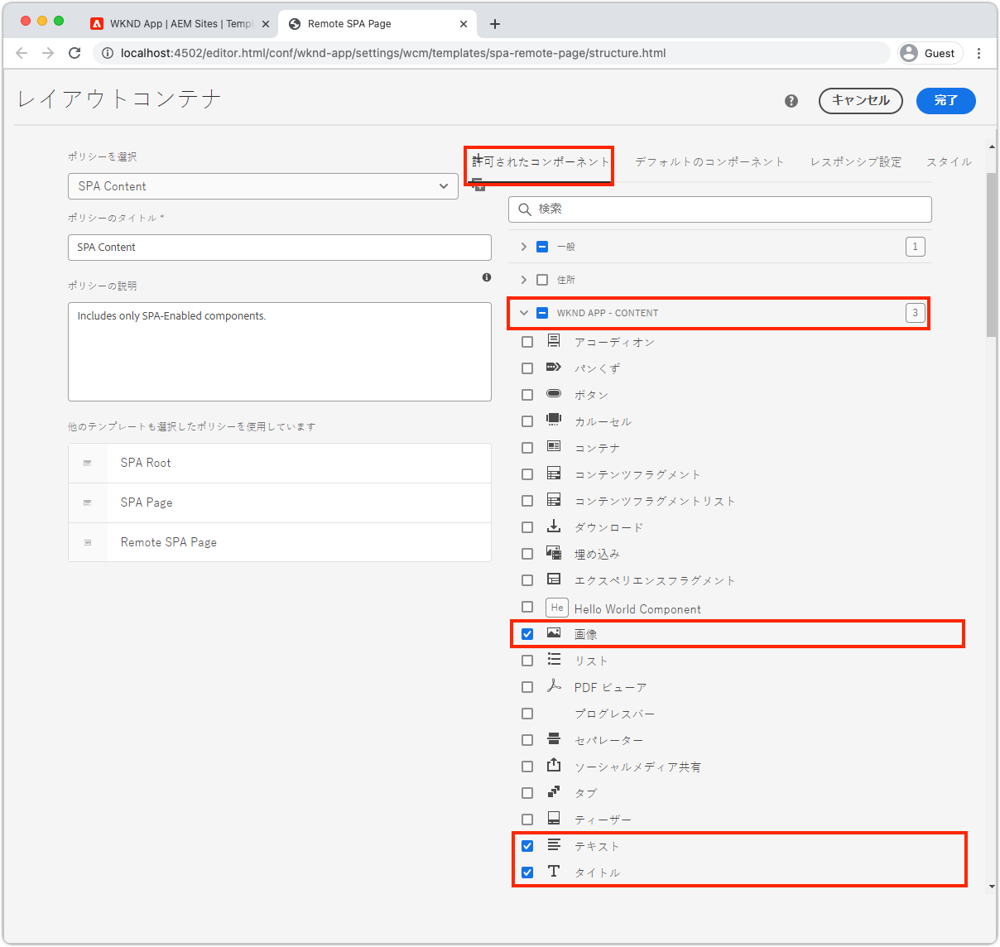
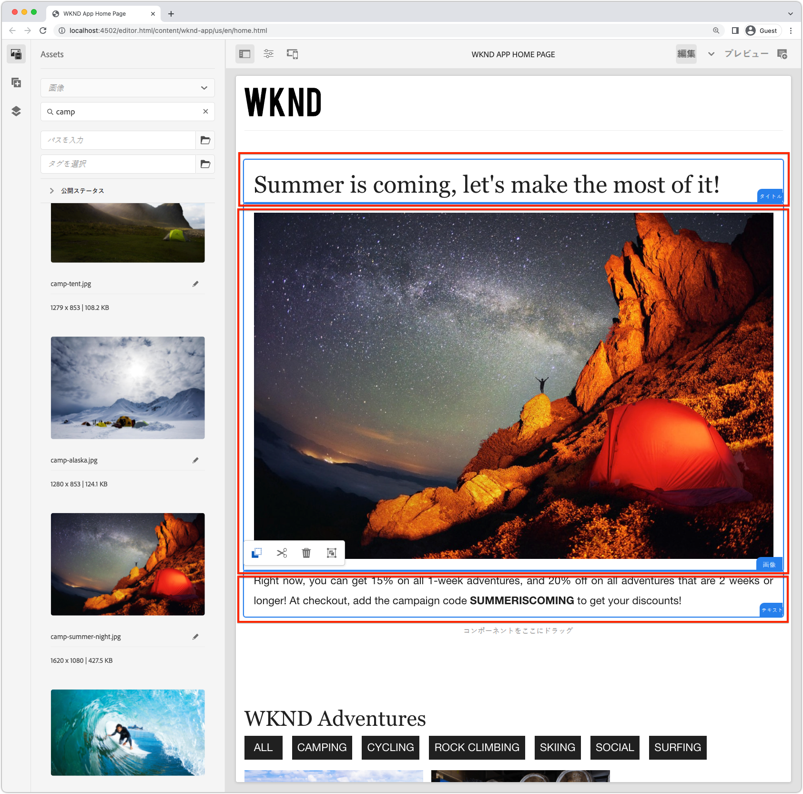
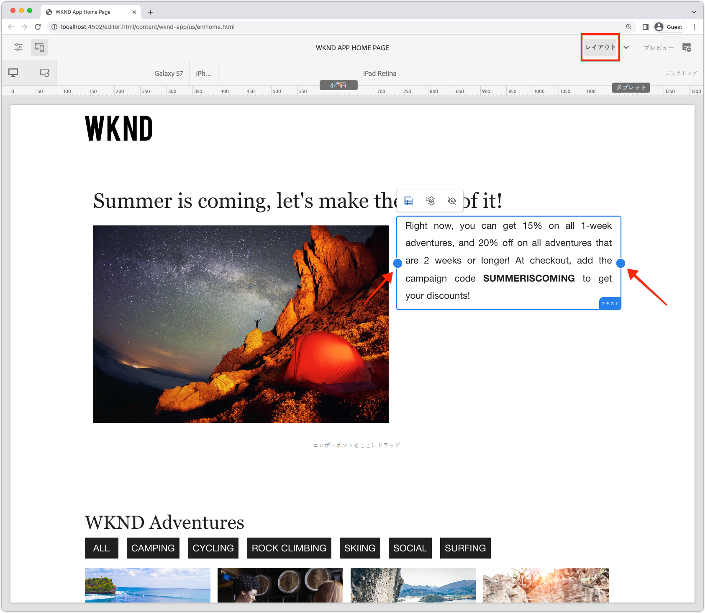

# 編集可能なコンテナコンポーネント

[固定](./spa-fixed-component.md) コンポーネントはSPAコンテンツを柔軟にオーサリングできますが、このアプローチは厳密で、開発者は編集可能コンテンツの正確な構成を定義する必要があります。作成者が例外的なエクスペリエンスを作成できるように、SPA EditorはSPAでのコンテナコンポーネントの使用をサポートしています。 コンテナコンポーネントを使用すると、作成者は許可されたコンポーネントをコンテナにドラッグ&amp;ドロップし、従来のAEM Sitesオーサリングと同様にオーサリングできます。


この章では、編集可能なコンテナをホーム表示に追加して、作成者がSPAで直接AEM React Core Componentsを使用して、リッチコンテンツのエクスペリエンスを作成およびレイアウトできるようにします。

## WKNDアプリの更新

コンテナコンポーネントをホーム表示に追加するには：

+ AEM React EditableコンポーネントのResponsiveGridコンポーネントの読み込み
+ AEM React Core Components（テキストと画像）を読み込んで登録し、コンテナコンポーネントで使用する

### ResponsiveGridコンテナコンポーネントでの読み込み

編集可能な領域をホーム表示に配置するには、次の操作を行う必要があります。

1. `@adobe/aem-react-editable-components`からResponsiveGridコンポーネントを読み込みます
1. `withMappable`を使って登録し、開発者がSPAに置けるようにする
1. また、他のコンテナコンポーネントで再利用できるように、`MapTo`に登録し、コンテナを効果的にネストします。

次の手順を実行します。

1. IDEでSPAプロジェクトを開きます
1. `src/components/aem/AEMResponsiveGrid.js`にReactコンポーネントを作成
1. 追加次のコードを`AEMResponsiveGrid.js`に送信

   ```
   // Import the withMappable API provided bu the AEM SPA Editor JS SDK
   import { withMappable, MapTo } from '@adobe/aem-react-editable-components';
   
   // Import the base ResponsiveGrid component
   import { ResponsiveGrid } from "@adobe/aem-react-editable-components";
   
   // The sling:resourceType for which this Core Component is registered with in AEM
   const RESOURCE_TYPE = "wcm/foundation/components/responsivegrid";
   
   // Create an EditConfig to allow the AEM SPA Editor to properly render the component in the Editor's context
   const EditConfig = {
       emptyLabel: "Layout Container",  // The component placeholder in AEM SPA Editor
       isEmpty: function(props) { 
           return props.cqItemsOrder == null || props.cqItemsOrder.length === 0;
       },                              // The function to determine if this component has been authored
       resourceType: RESOURCE_TYPE     // The sling:resourceType this SPA component is mapped to
   };
   
   // MapTo allows the AEM SPA Editor JS SDK to dynamically render components added to SPA Editor Containers
   MapTo(RESOURCE_TYPE)(ResponsiveGrid, EditConfig);
   
   // withMappable allows the component to be hardcoded into the SPA; <AEMResponsiveGrid .../>
   const AEMResponsiveGrid = withMappable(ResponsiveGrid, EditConfig);
   
   export default AEMResponsiveGrid;
   ```

このコードは、[AEM Reach Core Components&#39; Titleコンポーネント](./spa-fixed-component.md)を読み込んだ`AEMTitle.js`と似ています。


`AEMResponsiveGrid.js`ファイルは次のようになります。


### AEMResponsiveGrid SPAコンポーネントの使用

AEM ResponsiveGridコンポーネントがSPAに登録され、内で使用できるようになったので、ホーム表示に配置できます。

1. `react-app/src/App.js`を開いて編集
1. `AEMResponsiveGrid`コンポーネントを読み込み、`<AEMTitle ...>`コンポーネントの上に配置します。
1. `<AEMResponsiveGrid...>`コンポーネントに次の属性を設定します
   + `pagePath = '/content/wknd-app/us/en/home'`
   + `itemPath = 'root/responsivegrid'`

   これは、この`AEMResponsiveGrid`コンポーネントにAEMリソースからコンテンツを取得するよう指示します。

   + `/content/wknd-app/us/en/home/jcr:content/root/responsivegrid`

   `itemPath`は、`Remote SPA Page` AEMテンプレートで定義された`responsivegrid`ノードにマッピングされ、`Remote SPA Page` AEMテンプレートから作成された新しいAEMページに自動的に作成されます。

   `App.js`を更新して`<AEMResponsiveGrid...>`コンポーネントを追加します。

   ```
   ...
   import AEMResponsiveGrid from './components/aem/AEMResponsiveGrid';
   ...
   
   function Home() {
   return (
       <div className="Home">
           <AEMResponsiveGrid
               pagePath='/content/wknd-app/us/en/home' 
               itemPath='root/responsivegrid'/>
   
           <AEMTitle
               pagePath='/content/wknd-app/us/en/home' 
               itemPath='title'/>
           <Adventures />
       </div>
   );
   }
   ```

`Apps.js`ファイルは次のようになります。


## 編集可能なコンポーネントの作成

SPA Editorで提供される柔軟なオーサリング体験のコンテナを最大限に活用する。 編集可能なタイトルコンポーネントを既に作成しましたが、新しく追加したコンテナコンポーネントでテキストと画像のAEM WCMコアコンポーネントを使用できるように、さらにいくつか作成します。

### テキストコンポーネント

1. IDEでSPAプロジェクトを開きます
1. `src/components/aem/AEMText.js`にReactコンポーネントを作成
1. 追加次のコードを`AEMText.js`に送信

   ```
   import { withMappable, MapTo } from '@adobe/aem-react-editable-components';
   import { TextV2, TextV2IsEmptyFn } from "@adobe/aem-core-components-react-base";
   
   const RESOURCE_TYPE = "wknd-app/components/text";
   
   const EditConfig = {    
       emptyLabel: "Text",
       isEmpty: TextV2IsEmptyFn,
       resourceType: RESOURCE_TYPE
   };
   
   MapTo(RESOURCE_TYPE)(TextV2, EditConfig);
   
   const AEMText = withMappable(TextV2, EditConfig);
   
   export default AEMText;
   ```

`AEMText.js`ファイルは次のようになります。


### 画像コンポーネント

1. IDEでSPAプロジェクトを開きます
1. `src/components/aem/AEMImage.js`にReactコンポーネントを作成
1. 追加次のコードを`AEMImage.js`に送信

   ```
   import { withMappable, MapTo } from '@adobe/aem-react-editable-components';
   import { ImageV2, ImageV2IsEmptyFn } from "@adobe/aem-core-components-react-base";
   
   const RESOURCE_TYPE = "wknd-app/components/image";
   
   const EditConfig = {    
       emptyLabel: "Image",
       isEmpty: ImageV2IsEmptyFn,
       resourceType: RESOURCE_TYPE
   };
   
   MapTo(RESOURCE_TYPE)(ImageV2, EditConfig);
   
   const AEMImage = withMappable(ImageV2, EditConfig);
   
   export default AEMImage;
   ```

1. `AEMImage.scss`のカスタムスタイルを提供するSCSSファイル`src/components/aem/AEMImage.scss`を作成します。 これらのスタイルは、AEM React CoreコンポーネントのBEM表記CSSクラスをターゲットします。
1. 追加次のSCSSから`AEMImage.scss`

   ```
   .cmp-image__image {
       margin: 1rem 0;
       width: 100%;
       border: 0;
    }
   ```

1. `AEMImage.scss`を`AEMImage.js`にインポート

   ```
   ...
   import './AEMImage.scss';
   ...
   ```

`AEMImage.js`と`AEMImage.scss`は次のようになります。


### 編集可能コンポーネントの読み込み

新しく作成された`AEMText`と`AEMImage` SPAコンポーネントはSPAで参照され、AEMから返されたJSONに基づいて動的にインスタンス化されます。 これらのコンポーネントがSPAで確実に使用できるようにするには、`App.js`にこれらのコンポーネントのインポート文を作成します。

1. IDEでSPAプロジェクトを開きます
1. ファイル`src/App.js`を開きます
1. `AEMText`および`AEMImage`の追加インポート文

   ```
   ...
   import AEMText from './components/aem/AEMText';
   import AEMImage from './components/aem/AEMImage';
   ...
   ```


結果は次のようになります。


これらのインポートが&#x200B;_追加されない_&#x200B;場合、`AEMText`および`AEMImage`コードはSPAによって呼び出されないので、指定されたリソースタイプに対してコンポーネントが登録されません。

## AEMでのコンテナの設定

AEMコンテナコンポーネントは、ポリシーを使用して、許可されているコンポーネントを指定します。 SPAエディタを使用する場合は、SPAコンポーネントをマッピングしたAEM WCMコアコンポーネントのみがSPAでレンダリング可能なので、これは重要な設定です。 SPA実装を提供したコンポーネントのみが許可されていることを確認します。

+ `AEMTitle` マッピング済み  `wknd-app/components/title`
+ `AEMText` マッピング済み  `wknd-app/components/text`
+ `AEMImage` マッピング済み  `wknd-app/components/image`

リモートSPAページテンプレートのReponsiveGridコンテナを構成するには：

1. AEM作成者にログインする
1. __ツール/一般/テンプレート/WKNDアプリ__&#x200B;に移動します。
1. __レポートSPAページ__&#x200B;を編集

   

1. 右上のモード切り替えボタンで&#x200B;__構造__&#x200B;を選択します
1. タップして&#x200B;__レイアウトコンテナ__&#x200B;を選択します
1. ポップアップバーの&#x200B;__ポリシー__&#x200B;アイコンをタップします

   

1. 右側の「__許可されているコンポーネント__」タブの下で、__WKND APP - CONTENT__&#x200B;を展開します
1. 次の項目のみが選択されていることを確認します。
   + 画像
   + テキスト
   + title（タイトル）

   

1. __完了__&#x200B;をタップします

## AEMでのコンテナのオーサリング

SPAが`<AEMResponsiveGrid...>`の埋め込み、AEM React Coreコンポーネント(`AEMTitle`、`AEMText`、`AEMImage`)のラッパーを3つアップデートし、AEMが一致するテンプレートポリシーでアップデートされると、コンテナコンポーネントでコンテンツのオーサリングを開始できます。

1. AEM作成者にログインする
1. __サイト/WKNDアプリ__&#x200B;に移動します。
1. 「__ホーム__」をタップし、上部のアクションバーで「__編集__」を選択します
   + 「Hello World」テキストコンポーネントが表示されます。これは、AEMプロジェクトのアーキタイプからプロジェクトを生成する際に自動的に追加されたものです
1. ページエディターの右上にあるモードセレクターで、「__編集__」を選択します。
1. タイトルの下の&#x200B;__レイアウトコンテナ__&#x200B;編集可能な領域を見つけます
1. __ページエディターのサイドバー__&#x200B;を開き、__コンポーネント表示__&#x200B;を選択します
1. 次のコンポーネントを&#x200B;__レイアウトコンテナ__&#x200B;にドラッグします
   + 画像
   + タイトル
1. コンポーネントをドラッグして次の順序に並べ替えます。
   1. title（タイトル）
   1. 画像
   1. テキスト
1. __Authorthe__  ____ Titlecomponent
   1. タイトルコンポーネントをタップし、__レンチ__&#x200B;アイコンをタップして、タイトルコンポーネントを&#x200B;__編集__&#x200B;します
   1. 追加次のテキスト：
      + タイトル：__夏が来るぞ、それを最大限に活かそう！__
      + タイプ：__H1__
   1. __完了__&#x200B;をタップします
1. __Authorthe__  ____ Imagecomponent
   1. 画像コンポーネントのサイドバー(アセット表示に切り替えた後)から画像をドラッグします
   1. 画像コンポーネントをタップし、__レンチ__&#x200B;アイコンをタップして編集します
   1. 「__画像は装飾的な__」チェックボックスをオンにします。
   1. __完了__&#x200B;をタップします
1. ____ Authorthe  ____ Textcomponent
   1. テキストコンポーネントを編集するには、テキストコンポーネントをタップし、__レンチ__&#x200B;アイコンをタップします
   1. 追加次のテキスト：
      + _1週間の冒険では15%、2週間以上の冒険では20%の割引ができます。チェックアウト時に、キャンペーンコードSUMMERISCOMINGを追加して割引を受け取ります。_
   1. __完了__&#x200B;をタップします

1. コンポーネントはオーサリングされますが、垂直方向にスタックされます。

   

   AEMレイアウトモードを使用して、コンポーネントのサイズとレイアウトを調整できます。

1. 右上のモードセレクターを使用して&#x200B;__レイアウトモード__&#x200B;に切り替えます
1. __画像コンポーネントとテキストコンポーネントを並べて表示するようにサイズを__ 変更します
   + ____ Imagecomponentは __8列幅にする必要があります__
   + ____ Textcomponentは __3列幅にする必要があります__

   

1. __AEM Page Editorでの変更の__ プレビュー
1. [http://localhost:3000](http://localhost:3000)上でローカルで実行中のWKNDアプリを更新し、作成した変更を確認します。

   


## バリデーターが

編集可能なコンポーネントを作成者がWKND Appに追加できるコンテナコンポーネントが追加されました。 これで、次の方法がわかりました。

+ SPAでAEM React EditableコンポーネントのResponsiveGridコンポーネントを使用します。
+ AEM React Core Components（テキストと画像）を登録し、コンテナコンポーネントを介してSPAで使用する
+ SPA対応のコアコンポーネントを許可するようにリモートSPAページテンプレートを設定する
+ コンテナコンポー追加ネントに対する編集可能コンポーネント
+ SPAエディターでのオーサリングコンポーネントとレイアウトコンポーネント

## 次の手順

次の手順は、同じ方法を使用してSPAのAdventure Detailsルート](./spa-dynamic-routes.md)に編集可能コンポーネントを追加します。[
