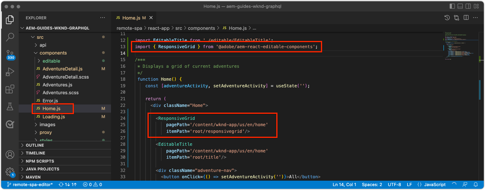

# 編集可能なコンテナコンポーネント

[固定コンポーネント](./spa-fixed-component.md)では、SPA コンテンツを柔軟にオーサリングできますが、このアプローチは堅牢で、開発者は編集可能コンテンツの正確な構成を定義する必要があります。作成者が優れたエクスペリエンスを作成できるように、SPA エディターでは、SPA でのコンテナコンポーネントの使用をサポートしています。コンテナコンポーネントを使用すると、作成者は、従来の AEM Sites オーサリングと同様に、許可されたコンポーネントをコンテナにドラッグ＆ドロップしたり、オーサリングしたりできます。


この章では、編集可能なコンテナをホームビューに追加し、作成者が、SPA 内で直接編集可能な React コンポーネントを使用して、リッチなコンテンツエクスペリエンスを作成およびレイアウトできるようにします。

## WKND アプリの更新

次のように、コンテナコンポーネントをホームビューに追加します。

+ AEM React 編集可能コンポーネントの `ResponsiveGrid` コンポーネントを読み込む
+ ResponsiveGrid コンポーネントで使用するカスタム編集可能 React コンポーネント（テキストおよび画像）を読み込んで登録します

### ResponsiveGrid コンポーネントの使用

次のように、固定コンポーネントをホームビューに追加します。

1. `react-app/src/components/Home.js` を開いて編集する
1. `@adobe/aem-react-editable-components` から `ResponsiveGrid` コンポーネントを読み込み、`Home` コンポーネントに追加します。
1. `<ResponsiveGrid...>` コンポーネントに次の属性を設定します。
   + `pagePath = '/content/wknd-app/us/en/home'`
   + `itemPath = 'root/responsivegrid'`

   これは、`ResponsiveGrid` コンポーネントが AEM リソースからコンテンツを取得するように指示するものです。

   + `/content/wknd-app/us/en/home/jcr:content/root/responsivegrid`

   `itemPath` は、`Remote SPA Page` AEM テンプレートで定義された `responsivegrid` ノードにマッピングされ、`Remote SPA Page` AEM テンプレートから作成された新しい AEM ページに自動的に作成されます。

   `Home.js` を更新して `<ResponsiveGrid...>` コンポーネントを追加します。

   ```javascript
   ...
   import { ResponsiveGrid } from '@adobe/aem-react-editable-components';
   ...
   
   function Home() {
       return (
           <div className="Home">
               <ResponsiveGrid
                   pagePath='/content/wknd-app/us/en/home' 
                   itemPath='root/responsivegrid'/>
   
               <EditableTitle
                   pagePath='/content/wknd-app/us/en/home' 
                   itemPath='title'/>
   
               <Adventures />
           </div>
       );
   }
   ```

`Home.js` ファイルは次のようになります。



## 編集可能なコンポーネントの作成

SPA エディターでコンテナが提供する柔軟なオーサリングエクスペリエンスの効果を最大限に引き出すために、編集可能なタイトルコンポーネントは既に作成されていますが、新しく追加された ResponsiveGrid コンポーネントで編集可能なテキストコンポーネントと画像コンポーネントを作成者が使用できるように、さらにいくつか作成します。

新しい編集可能なテキストおよび画像 React コンポーネントは、[編集可能な固定コンポーネント](./spa-fixed-component.md)で期限切れになった編集可能なコンポーネント定義パターンを使用して作成されます。

### 編集可能なテキストコンポーネント

1. IDE で SPA プロジェクトを開きます。
1. `src/components/editable/core/Text.js` で React コンポーネントを作成
1. `Text.js` に次のコードを追加します。

   ```javascript
   import React from 'react'
   
   const TextPlain = (props) => <div className={props.baseCssClass}><p className="cmp-text__paragraph">{props.text}</p></div>;
   const TextRich = (props) => {
   const text = props.text;
   const id = (props.id) ? props.id : (props.cqPath ? props.cqPath.substr(props.cqPath.lastIndexOf('/') + 1) : "");
       return <div className={props.baseCssClass} id={id} data-rte-editelement dangerouslySetInnerHTML={{ __html: text }} />
   };
   
   export const Text = (props) => {
       if (!props.baseCssClass) {
           props.baseCssClass = 'cmp-text'
       }
   
       const { richText = false } = props
   
       return richText ? <TextRich {...props} /> : <TextPlain {...props} />
       }
   
       export function textIsEmpty(props) {
       return props.text == null || props.text.length === 0;
   }
   ```

1. 編集可能な React タイトルコンポーネントの作成`src/components/editable/EditableText.js`
1. `EditableText.js` に次のコードを追加します。

   ```javascript
   import React from 'react'
   import { EditableComponent, MapTo } from '@adobe/aem-react-editable-components';
   import { Text, textIsEmpty } from "./core/Text";
   import { withConditionalPlaceHolder } from "./core/util/withConditionalPlaceholder";
   import { withStandardBaseCssClass } from "./core/util/withStandardBaseCssClass";
   
   const RESOURCE_TYPE = "wknd-app/components/text";
   
   const EditConfig = {
       emptyLabel: "Text",
       isEmpty: textIsEmpty,
       resourceType: RESOURCE_TYPE
   };
   
   export const WrappedText = (props) => {
       const Wrapped = withConditionalPlaceHolder(withStandardBaseCssClass(Text, "cmp-text"), textIsEmpty, "Text V2")
       return <Wrapped {...props} />
   };
   
   const EditableText = (props) => <EditableComponent config={EditConfig} {...props}><WrappedText /></EditableComponent>
   
   MapTo(RESOURCE_TYPE)(EditableText);
   
   export default EditableText;
   ```

編集可能なテキストコンポーネントの実装は、次のようになります。


### 画像コンポーネント

1. IDE で SPA プロジェクトを開きます。
1. `src/components/editable/core/Image.js` で React コンポーネントを作成
1. `Image.js` に次のコードを追加します。

   ```javascript
   import React from 'react'
   import { RoutedLink } from "./RoutedLink";
   
   export const imageIsEmpty = (props) => (!props.src) || props.src.trim().length === 0
   
   const ImageInnerContents = (props) => {
   return (<>
       
       {
           !!(props.title) && <span className={props.baseCssClass + '__title'} itemProp="caption">{props.title}</span>
       }
       {
           props.displayPopupTitle && (!!props.title) && <meta itemProp="caption" content={props.title} />
       }
       </>);
   };
   
   const ImageContents = (props) => {
       if (props.link && props.link.trim().length > 0) {
           return (
           <RoutedLink className={props.baseCssClass + '__link'} isRouted={props.routed} to={props.link}>
               <ImageInnerContents {...props} />
           </RoutedLink>
           )
       }
       return <ImageInnerContents {...props} />
   };
   
   export const Image = (props) => {
       if (!props.baseCssClass) {
           props.baseCssClass = 'cmp-image'
       }
   
       const { isInEditor = false } = props;
       const cssClassName = (isInEditor) ? props.baseCssClass + ' cq-dd-image' : props.baseCssClass;
   
       return (
           <div className={cssClassName}>
               <ImageContents {...props} />
           </div>
       )
   };
   ```

1. 編集可能な React タイトルコンポーネントの作成`src/components/editable/EditableImage.js`
1. `EditableImage.js` に次のコードを追加します。

```javascript
import { EditableComponent, MapTo } from '@adobe/aem-react-editable-components';
import { Image, imageIsEmpty } from "./core/Image";
import React from 'react'

import { withConditionalPlaceHolder } from "./core/util/withConditionalPlaceholder";
import { withStandardBaseCssClass } from "./core/util/withStandardBaseCssClass";

const RESOURCE_TYPE = "wknd-app/components/image";

const EditConfig = {
    emptyLabel: "Image",
    isEmpty: imageIsEmpty,
    resourceType: RESOURCE_TYPE
};

const WrappedImage = (props) => {
    const Wrapped = withConditionalPlaceHolder(withStandardBaseCssClass(Image, "cmp-image"), imageIsEmpty, "Image V2");
    return <Wrapped {...props}/>
}

const EditableImage = (props) => <EditableComponent config={EditConfig} {...props}><WrappedImage /></EditableComponent>

MapTo(RESOURCE_TYPE)(EditableImage);

export default EditableImage;
```


1. `EditableImage.scss` にカスタムスタイルを提供する SCSS ファイル `src/components/editable/EditableImage.scss` を作成します。これらのスタイルは、編集可能な React コンポーネントの CSS クラスをターゲットにしています。
1. `EditableImage.scss` に次の SCSS を追加します。

   ```css
   .cmp-image__image {
       margin: 1rem 0;
       width: 100%;
       border: 0;
    }
   ```

1. `EditableImage.scss` を `EditableImage.js` に読み込みます。

   ```javascript
   ...
   import './EditableImage.scss';
   ...
   ```

編集可能な画像コンポーネントの実装は、次のようになります。


### 編集可能なプロジェクトの読み込み

新しく作成された `EditableText` および `EditableImage` React コンポーネントは SPA で参照され、AEM から返された JSON に基づいて動的にインスタンス化されます。これらのコンポーネントをSPAで確実に使用できるようにするには、`Home.js` にそれらの import 文を作成します。

1. IDE で SPA プロジェクトを開きます。
1. ファイル `src/Home.js` を開きます
1. `AEMText` および `AEMImage` の import 文を追加します。

   ```javascript
   ...
   // The following need to be imported, so that MapTo is run for the components
   import EditableText from './editable/EditableText';
   import EditableImage from './editable/EditableImage';
   ...
   ```

結果は次のようになります。


これらの読み込みが追加されて&#x200B;_いない_&#x200B;場合、`EditableText` および `EditableImage` コードは SPA によって呼び出されないため、コンポーネントは指定されたリソースタイプにマッピングされません。

## AEM でのコンテナの設定

AEM コンテナコンポーネントは、ポリシーを使用して、許可されるコンポーネントを指示します。SPA でレンダリングできるのは、対応する SPA コンポーネントがマッピングされている AEM コンポーネントだけであるため、これは SPA エディターを使用する場合に重要な設定です。SPA 実装を提供したコンポーネントのみが許可されていることを確認します。

+ `EditableTitle`（`wknd-app/components/title` にマッピング）
+ `EditableText`（`wknd-app/components/text` にマッピング）
+ `EditableImage`（`wknd-app/components/image` にマッピング）

リモート SPA ページテンプレートの reponsivegrid コンテナを構成するには、次の手順を実行します。

1. AEM オーサーにログインします。
1. __ツール／一般／テンプレート／WKND アプリ__&#x200B;に移動します。
1. __レポート SPA ページ__&#x200B;を編集します。

   

1. 右上のモード切り替えボタンで「__構造__」を選択します。
1. タップして「__レイアウトコンテナ__」を選択します。
1. ポップアップバーの&#x200B;__ポリシー__&#x200B;アイコンをタップします。

   

1. 右側の「__許可されたコンポーネント__」タブで、「__WKND APP - CONTENT__」を展開します。
1. 次の項目のみが選択されていることを確認します。
   + 画像
   + テキスト
   + タイトル

   

1. 「__完了__」をタップします

## AEM でのコンテナの作成

SPA が 3 つの編集可能な React コンポーネント（`EditableTitle`、`EditableText`、`EditableImage`）のラッパーである `<ResponsiveGrid...>` を埋め込むように更新され、AEM が一致するテンプレートポリシーで更新された後、コンテナコンポーネントでコンテンツのオーサリングを開始できます。

1. AEM オーサーにログインします。
1. __サイト／WKND アプリ__&#x200B;に移動します。 
1. 「__ホーム__」をタップし、上部のアクションバーの「__編集__」を選択します。
   + 「Hello World」テキストコンポーネントが表示されます。このコンポーネントは、AEM プロジェクトアーキタイプからプロジェクトを生成する際に、自動的に追加されたものです。
1. ページエディターの右上にある編集モードセレクターから「__編集__」を選択します。
1. タイトルの下にある&#x200B;__レイアウトコンテナ__&#x200B;の編集可能な領域を見つけます。
1. __ページエディターのサイドバー__&#x200B;をクリックし、「__コンポーネント表示__」を選択します。
1. 次のコンポーネントを&#x200B;__レイアウトコンテナ__&#x200B;にドラッグします。
   + 画像
   + タイトル
1. コンポーネントをドラッグして、コンテナ内で次のように並べ替えます。
   1. タイトル
   1. 画像
   1. テキスト
1. __タイトル__&#x200B;コンポーネントを&#x200B;__作成__&#x200B;します。
   1. タイトルコンポーネントをタップし、__レンチ__&#x200B;アイコンをタップしてタイトルコンポーネントを&#x200B;__編集__&#x200B;します。
   1. 次のテキストを追加します。
      + タイトル：__Summer is coming, let&#39;s make the most of it!__
      + タイプ：__H1__
   1. 「__完了__」をタップします
1. __画像__&#x200B;コンポーネントを&#x200B;__作成__&#x200B;します。
   1. 画像コンポーネント上の（アセットビューに切り替えた後の）サイドバーから画像をドラッグします
   1. 画像コンポーネントをタップし、__レンチ__&#x200B;アイコンをタップして編集します
   1. 「__画像は装飾画像__」チェックボックスをオンにします
   1. 「__完了__」をタップします
1. __テキスト__&#x200B;コンポーネントを&#x200B;__作成__&#x200B;します。
   1. テキストコンポーネントをタップし、__レンチ__&#x200B;アイコンをタップして編集します
   1. 次のテキストを追加します。
      + _Right now, you can get 15% on all 1-week adventures, and 20% off on all adventures that are 2 weeks or longer! At checkout, add the campaign code SUMMERISCOMING to get your discounts!_
   1. 「__完了__」をタップします

1. コンポーネントが作成されましたが、垂直方向に積み重ねられて表示されています。

   

AEM のレイアウトモードを使用して、コンポーネントのサイズとレイアウトを調整できます。

1. 右上のモードセレクターを使用して、__レイアウトモード__&#x200B;に切り替えます。
1. 画像コンポーネントとテキスト コンポーネントを並べて&#x200B;__サイズ変更__&#x200B;します。
   + __画像__&#x200B;コンポーネントは __8 列幅__&#x200B;です。
   + __テキスト__&#x200B;コンポーネントは __3 列幅__&#x200B;です。

   

1. AEM ページエディターで変更内容を&#x200B;__プレビュー__
1. [http://localhost:3000](http://localhost:3000) でローカルに実行している WKND アプリを更新し、作成した変更を確認します。

   


## おめでとうございます。

作成者が WKND アプリに編集可能なコンポーネントを追加できる、コンテナコンポーネントが追加されました。次の方法を学習しました。

+ SPA で AEM React Editable Component の `ResponsiveGrid` コンポーネントを使用する
+ コンテナコンポーネントを介して SPA で使用する編集可能な React コンポーネント（テキストと画像）を作成および登録する
+ SPA が有効なコンポーネントを許可するようにリモート SPA ページテンプレートを設定する
+ コンテナコンポーネントに編集可能なコンポーネントを追加する
+ SPA エディターでコンポーネントを作成およびレイアウトする

## 次の手順

次の手順では、同じ方法を使用して、SPA の [Adventure Details ルートに編集可能なコンポーネントを追加](./spa-dynamic-routes.md)します。
