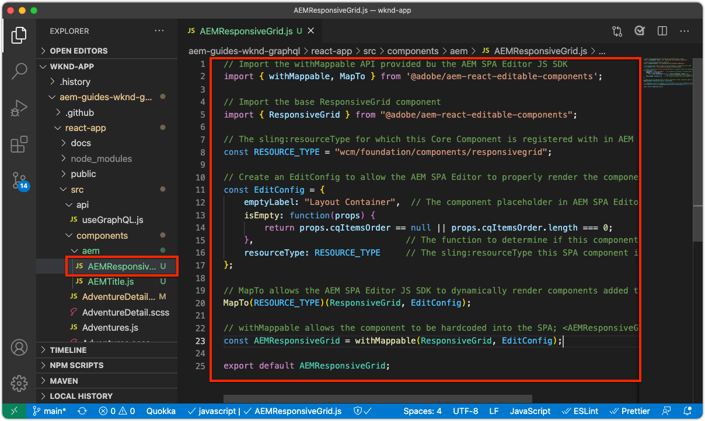

# 編集可能なコンテナコンポーネント

[固定コンポーネント](./spa-fixed-component.md) では、SPAコンテンツを柔軟にオーサリングできますが、このアプローチは堅牢で、開発者は編集可能コンテンツの正確な構成を定義する必要があります。 作成者が例外的なエクスペリエンスを作成できるように、SPA Editor では、SPAでのコンテナコンポーネントの使用をサポートしています。 コンテナコンポーネントを使用すると、作成者は、従来のAEM Sitesオーサリングと同様に、許可されたコンポーネントをコンテナにドラッグ&amp;ドロップしたり、オーサリングしたりできます。


この章では、編集可能なコンテナをホームビューに追加し、作成者がSPAで直接AEM React コアコンポーネントを使用して、リッチなコンテンツエクスペリエンスを作成およびレイアウトできるようにします。

## WKND アプリの更新

コンテナコンポーネントをホームビューに追加するには：

+ AEM React 編集可能コンポーネントの ResponsiveGrid コンポーネントの読み込み
+ コンテナコンポーネントで使用するAEM React コアコンポーネント（テキストおよび画像）を読み込んで登録します

### ResponsiveGrid コンテナコンポーネントでの読み込み

編集可能な領域をホームビューに配置するには、次の操作を行う必要があります。

1. 次の場所に ResponsiveGrid コンポーネントを読み込みます。 `@adobe/aem-react-editable-components`
1. 次を使用して登録 `withMappable` 開発者がSPAに配置できるように
1. また、に登録します。 `MapTo` そのため、他のコンテナコンポーネントで再利用でき、コンテナを効果的にネストできます。

次の手順を実行します。

1. IDE でSPAプロジェクトを開きます。
1. React コンポーネントの作成先 `src/components/aem/AEMResponsiveGrid.js`
1. 次のコードをに追加します。 `AEMResponsiveGrid.js`

   ```
   // Import the withMappable API provided bu the AEM SPA Editor JS SDK
   import { withMappable, MapTo } from '@adobe/aem-react-editable-components';
   
   // Import the base ResponsiveGrid component
   import { ResponsiveGrid } from "@adobe/aem-react-editable-components";
   
   // The sling:resourceType for which this Core Component is registered with in AEM
   const RESOURCE_TYPE = "wcm/foundation/components/responsivegrid";
   
   // Create an EditConfig to allow the AEM SPA Editor to properly render the component in the Editor's context
   const EditConfig = {
       emptyLabel: "Layout Container",  // The component placeholder in AEM SPA Editor
       isEmpty: function(props) { 
           return props.cqItemsOrder == null || props.cqItemsOrder.length === 0;
       },                              // The function to determine if this component has been authored
       resourceType: RESOURCE_TYPE     // The sling:resourceType this SPA component is mapped to
   };
   
   // MapTo allows the AEM SPA Editor JS SDK to dynamically render components added to SPA Editor Containers
   MapTo(RESOURCE_TYPE)(ResponsiveGrid, EditConfig);
   
   // withMappable allows the component to be hardcoded into the SPA; <AEMResponsiveGrid .../>
   const AEMResponsiveGrid = withMappable(ResponsiveGrid, EditConfig);
   
   export default AEMResponsiveGrid;
   ```

コードは似ています `AEMTitle.js` その [AEM Reach コアコンポーネントのタイトルコンポーネントが読み込まれました。](./spa-fixed-component.md).


この `AEMResponsiveGrid.js` ファイルは次のようになります。



### AEMResponsiveGrid SPAコンポーネントの使用

これで、AEM ResponsiveGrid コンポーネントがに登録され、SPA内で使用できるようになったので、ホームビューに配置できます。

1. 開いて編集 `react-app/src/Home.js`
1. 次をインポート： `AEMResponsiveGrid` コンポーネントを選択し、その上に配置します。 `<AEMTitle ...>` コンポーネント。
1. 次の属性を `<AEMResponsiveGrid...>` コンポーネント
   + `pagePath = '/content/wknd-app/us/en/home'`
   + `itemPath = 'root/responsivegrid'`

   これは、 `AEMResponsiveGrid` AEMリソースからコンテンツを取得するコンポーネント：

   + `/content/wknd-app/us/en/home/jcr:content/root/responsivegrid`

   この `itemPath` は `responsivegrid` ノードが `Remote SPA Page` AEMテンプレートが作成され、 `Remote SPA Page` AEM Template.

   更新 `Home.js` を追加します。 `<AEMResponsiveGrid...>` コンポーネント。

   ```
   ...
   import AEMResponsiveGrid from './aem/AEMResponsiveGrid';
   ...
   
   function Home() {
       return (
           <div className="Home">
               <AEMResponsiveGrid
                   pagePath='/content/wknd-app/us/en/home' 
                   itemPath='root/responsivegrid'/>
   
               <AEMTitle
                   pagePath='/content/wknd-app/us/en/home' 
                   itemPath='title'/>
               <Adventures />
           </div>
       );
   }
   ```

この `Home.js` ファイルは次のようになります。


## 編集可能なコンポーネントの作成

柔軟なオーサリングエクスペリエンスコンテナの効果を最大限に引き出すには、SPA Editor に用意されています。 編集可能なタイトルコンポーネントは既に作成されていますが、作成者が新しく追加したコンテナコンポーネントでテキストと画像AEM WCM コアコンポーネントを使用できるように、さらにいくつか作成します。

### テキストコンポーネント

1. IDE でSPAプロジェクトを開きます。
1. React コンポーネントの作成先 `src/components/aem/AEMText.js`
1. 次のコードをに追加します。 `AEMText.js`

   ```
   import { withMappable, MapTo } from '@adobe/aem-react-editable-components';
   import { TextV2, TextV2IsEmptyFn } from "@adobe/aem-core-components-react-base";
   
   const RESOURCE_TYPE = "wknd-app/components/text";
   
   const EditConfig = {    
       emptyLabel: "Text",
       isEmpty: TextV2IsEmptyFn,
       resourceType: RESOURCE_TYPE
   };
   
   MapTo(RESOURCE_TYPE)(TextV2, EditConfig);
   
   const AEMText = withMappable(TextV2, EditConfig);
   
   export default AEMText;
   ```

この `AEMText.js` ファイルは次のようになります。


### 画像コンポーネント

1. IDE でSPAプロジェクトを開きます。
1. React コンポーネントの作成先 `src/components/aem/AEMImage.js`
1. 次のコードをに追加します。 `AEMImage.js`

   ```
   import { withMappable, MapTo } from '@adobe/aem-react-editable-components';
   import { ImageV2, ImageV2IsEmptyFn } from "@adobe/aem-core-components-react-base";
   
   const RESOURCE_TYPE = "wknd-app/components/image";
   
   const EditConfig = {    
       emptyLabel: "Image",
       isEmpty: ImageV2IsEmptyFn,
       resourceType: RESOURCE_TYPE
   };
   
   MapTo(RESOURCE_TYPE)(ImageV2, EditConfig);
   
   const AEMImage = withMappable(ImageV2, EditConfig);
   
   export default AEMImage;
   ```

1. SCSS ファイルの作成 `src/components/aem/AEMImage.scss` には、 `AEMImage.scss`. これらのスタイルは、AEM React コアコンポーネントの BEM 表記の CSS クラスをターゲットにしています。
1. 次の SCSS をに追加します。 `AEMImage.scss`

   ```
   .cmp-image__image {
       margin: 1rem 0;
       width: 100%;
       border: 0;
    }
   ```

1. インポート `AEMImage.scss` in `AEMImage.js`

   ```
   ...
   import './AEMImage.scss';
   ...
   ```

この `AEMImage.js` および `AEMImage.scss` は次のようになります。


### 編集可能なコンポーネントの読み込み

新しく作成された `AEMText` および `AEMImage` SPAコンポーネントはSPAで参照され、AEMから返される JSON に基づいて動的にインスタンス化されます。 これらのコンポーネントをSPAで確実に使用できるようにするには、次の場所にそれらのインポート文を作成します。 `Home.js`

1. IDE でSPAプロジェクトを開きます。
1. ファイルを開きます。 `src/Home.js`
1. 次のインポート文を追加： `AEMText` および `AEMImage`

   ```
   ...
   import AEMText from './components/aem/AEMText';
   import AEMImage from './components/aem/AEMImage';
   ...
   ```


結果は次のようになります。


これらのインポートが _not_ こう付け加えた。 `AEMText` および `AEMImage` コードはSPAによって呼び出されないので、指定されたリソースタイプに対してコンポーネントが登録されません。

## AEMでのコンテナの設定

AEMコンテナコンポーネントは、ポリシーを使用して、許可されるコンポーネントを指定します。 SPAエディターを使用する場合は、SPAコンポーネントが対応するマッピングを持つAEM WCM コアコンポーネントのみがSPAでレンダリング可能なので、これは重要な設定です。 に対してSPA実装を提供したコンポーネントのみが許可されていることを確認します。

+ `AEMTitle` マッピング先 `wknd-app/components/title`
+ `AEMText` マッピング先 `wknd-app/components/text`
+ `AEMImage` マッピング先 `wknd-app/components/image`

リモートSPAページテンプレートの reponsivegrid コンテナを構成するには、次の手順を実行します。

1. AEM オーサーにログインします。
1. に移動します。 __ツール/一般/テンプレート/WKND アプリ__
1. 編集 __レポートSPAページ__

   

1. 選択 __構造__ 右上のモード切り替えボタン
1. タップして __レイアウトコンテナ__
1. 次をタップします。 __ポリシー__ ポップアップバーのアイコン

   

1. 右側の、 __許可されたコンポーネント__ タブ、展開 __WKND アプリ — コンテンツ__
1. 次の項目のみが選択されていることを確認します。
   + 画像
   + テキスト
   + タイトル

   

1. タップ __完了__

## AEMでのコンテナのオーサリング

SPAを更新して `<AEMResponsiveGrid...>`、3 つのAEM React Core コンポーネント (`AEMTitle`, `AEMText`、および `AEMImage`) が適用され、AEMが対応するテンプレートポリシーで更新されました。コンテナコンポーネントでコンテンツのオーサリングを開始できます。

1. AEM オーサーにログインします。
1. に移動します。 __サイト/WKND アプリ__
1. タップ __ホーム__ を選択し、 __編集__ 上部のアクションバーから
   + 「Hello World」テキストコンポーネントが表示されます。これは、AEMプロジェクトアーキタイプからプロジェクトを生成する際に、自動的に追加されたものです
1. 選択 __編集__ ページエディターの右上にあるモードセレクターから
1. を __レイアウトコンテナ__ タイトルの下の編集可能な領域
1. を開きます。 __ページエディターのサイドバー__&#x200B;をクリックし、 __コンポーネント表示__
1. 次のコンポーネントを __レイアウトコンテナ__
   + 画像
   + タイトル
1. コンポーネントをドラッグして、次の順序に並べ替えます。
   1. タイトル
   1. 画像
   1. テキスト
1. __作成者__ の __タイトル__ コンポーネント
   1. タイトルコンポーネントをタップし、 __レンチ__ アイコン __編集__ タイトルコンポーネント
   1. 次のテキストを追加します。
      + タイトル： __夏が来た、それを最大限に活用しよう！__
      + タイプ： __H1__
   1. タップ __完了__
1. __作成者__ の __画像__ コンポーネント
   1. 画像コンポーネント上の（アセットビューに切り替えた後の）サイドバーから画像をドラッグします。
   1. 画像コンポーネントをタップし、 __レンチ__ 編集するアイコン
   1. 次を確認します。 __画像は装飾画像__ チェックボックス
   1. タップ __完了__
1. __作成者__ の __テキスト__ コンポーネント
   1. テキストコンポーネントをタップし、 __レンチ__ アイコン
   1. 次のテキストを追加します。
      + _今すぐ、1 週間の冒険で 15%、2 週間以上の冒険で 20%オフにできます！ チェックアウト時に、キャンペーンコード SUMMERISCOMING を追加して、割引を受け取ります。_
   1. タップ __完了__

1. コンポーネントがオーサリングされましたが、垂直にスタックします。

   

   AEMレイアウトモードを使用して、コンポーネントのサイズとレイアウトを調整できます。

1. 切り替え先 __レイアウトモード__ 右上の mode-selector の使用
1. __サイズ変更__ 画像コンポーネントとテキストコンポーネント（並べて表示されるように）
   + __画像__ コンポーネントは __8 列幅__
   + __テキスト__ コンポーネントは __3 列幅__

   

1. __プレビュー__ AEM Page Editor での変更
1. ローカルで実行している WKND アプリを更新 [http://localhost:3000](http://localhost:3000) 作成した変更を表示するには

   


## おめでとうございます。

作成者が WKND アプリに編集可能なコンポーネントを追加できるコンテナコンポーネントが追加されました。 次の方法を理解できました。

+ SPAでAEM React 編集可能コンポーネントの ResponsiveGrid コンポーネントを使用します。
+ コンテナコンポーネントを使用して、SPAで使用するAEM React コアコンポーネント（テキストおよび画像）を登録します。
+ SPAが有効なコアコンポーネントを許可するようにリモートSPAページテンプレートを設定します
+ コンテナコンポーネントへの編集可能なコンポーネントの追加
+ SPA Editor でのオーサリングおよびレイアウトコンポーネント

## 次の手順

次の手順では、同じ方法を使用して、 [Adventure Details ルートに編集可能なコンポーネントを追加する](./spa-dynamic-routes.md) をSPAに追加します。
