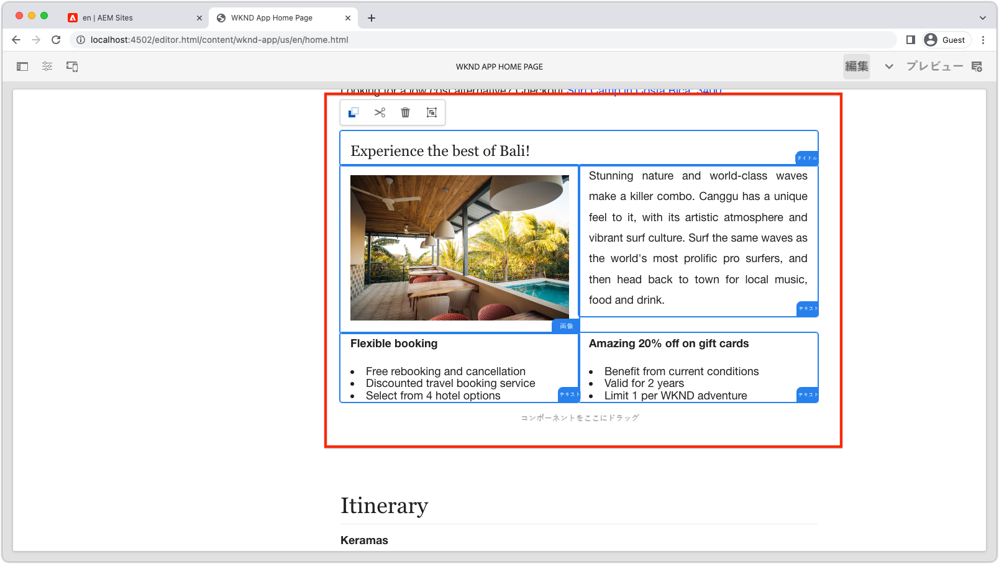

# 動的ルートと編集可能コンポーネント

この章では、2つのダイナミックアドベンチャー詳細ルートを有効にして、編集可能なコンポーネントをサポートします。__バリサーフキャンプ__&#x200B;と&#x200B;__ポートランドのビーバーナ__。


アドベンチャー詳細SPAルートは`/adventure:path`として定義されています。`path`は、詳細を表示するWKNDアドベンチャー（コンテンツフラグメント）へのパスです。

## SPA URLのAEMページへのマッピング

前の2つの章では、SPAホーム表示の編集可能コンポーネントのコンテンツを、AEMの対応するリモートSPAルートページ(`/content/wknd-app/us/en/`)にマッピングしました。

SPA動的ルートの編集可能コンポーネントに対するマッピングの定義は似ていますが、ルートのインスタンスとAEMページの間に1:1マッピングスキームを設定する必要があります。

このチュートリアルでは、パスの最後のセグメントであるWKNDアドベンチャーコンテンツフラグメントの名前を使用し、`/content/wknd-app/us/en/adventure`の下の単純なパスにマッピングします。

| リモートSPAルート | AEMページパス |
|------------------------------------|--------------------------------------------|
| ／ | /content/wknd-app/us/jp/home |
| /adventure/content/dam/wknd/en/adventures/bali-surf-camp/__bali-surf-camp__ | /content-wknd-app/us/en/home/adventure/__bali-surf-camp__ |
| /adventure/content/dam/wknd/en/adventures/beervana-portland/__beervana-portland__ | /content-wknd-app/us/en/home/adventure/__beervana-in-portland__ |

このマッピングに基づいて、次の場所に2つの新しいAEMページを作成する必要があります。

+ `/content/wknd-app/us/en/home/adventure/bali-surf-camp`
+ `/content/wknd-app/us/en/home/adventure/beervana-in-portland`

## リモートSPAマッピング

リモートSPAから離れる要求のマッピングは、SPA](./spa-bootstrap.md)の[Bootstrapで行われる`setupProxy`構成を介して設定されます。

## SPAエディターのマッピング

AEM SPAエディタでSPAを開いたときのSPA要求のマッピングは、[AEM](./aem-configure.md)の設定で行われたSling Mappings設定を使用して設定されます。

## AEMでのコンテンツページの作成

最初に、仲介者の`adventure`ページセグメントを作成します。

1. AEM作成者にログインする
1. __サイト/WKND App > us > en > WKND Appホームページ__&#x200B;に移動します。
   + このAEMページはSPAのルートとしてマッピングされるので、ここで、他のSPAルート用のAEMページ構造の構築を開始します。
1. 「__作成__」をタップし、「__ページ__」を選択します
1. __リモートSPAページ__&#x200B;テンプレートを選択し、__次へ__&#x200B;をタップします
1. ページのプロパティの入力
   + __タイトル__:冒険
   + __名前__：`adventure`
      + この値はAEMページのURLを定義するので、SPAのルートセグメントと一致する必要があります。
1. __完了__&#x200B;をタップします

次に、編集可能な領域を必要とするSPA URLのそれぞれに対応するAEMページを作成します。

1. サイト管理者の新しい&#x200B;__アドベンチャー__&#x200B;ページに移動します。
1. 「__作成__」をタップし、「__ページ__」を選択します
1. __リモートSPAページ__&#x200B;テンプレートを選択し、__次へ__&#x200B;をタップします
1. ページのプロパティの入力
   + __タイトル__:バリサーフキャンプ
   + __名前__：`bali-surf-camp`
      + この値はAEMページのURLを定義するので、SPAのルートの最後のセグメントと一致する必要があります
1. __完了__&#x200B;をタップします
1. 手順3 ～ 6を繰り返して、ポートランド&#x200B;__のページに__ Beervanaを作成し、次の内容を入力します。
   + __タイトル__:ビールヴァナインポートランド
   + __名前__：`beervana-in-portland`
      + この値はAEMページのURLを定義するので、SPAのルートの最後のセグメントと一致する必要があります

これらの2つのAEMページには、対応するSPAルート用に作成されたそれぞれのコンテンツが含まれます。 他のSPAルートでオーサリングが必要な場合、AEMのリモートSPAページのルートページ(`/content/wknd-app/us/en/home`)の下のSPA URLに新しいAEMページを作成する必要があります。

## WKNDアプリの更新

[最後のチャプター](./spa-container-component.md)で作成した`<AEMResponsiveGrid...>`コンポーネントを`AdventureDetail` SPAコンポーネントに配置し、編集可能なコンテナを作成します。

### AEMResponsiveGrid SPAコンポーネントを配置します

`<AEMResponsiveGrid...>`を`AdventureDetail`コンポーネントに配置すると、そのルートに編集可能なコンテナが作成されます。 これは、複数のルートが`AdventureDetail`コンポーネントを使用してレンダリングするので、`<AEMResponsiveGrid...>'s pagePath`属性を動的に調整する必要があるからです。 `pagePath`は、ルートのインスタンスが表示するアドベンチャーに基づいて、対応するAEMページを指すように派生する必要があります。

1. `react-app/src/components/AdventureDetail.js`を開いて編集
1. 2番目の追加`AdventureDetail(..)'s`ステートメントの前の次の行（コンテンツフラグメントパスからアドベンチャー名を引き出します）。`return(..)`

   ```
   ...
   // Get the last segment of the Adventure Content Fragment path to used to generate the pagePath for the AEMResponsiveGrid
   const adventureName = adventureData._path.split('/').pop();
   ...
   ```

1. `AEMResponsiveGrid`コンポーネントを読み込み、`<h2>Itinerary</h2>`コンポーネントの上に配置します。
1. `<AEMResponsiveGrid...>`コンポーネントに次の属性を設定します
   + `pagePath = '/content/wknd-app/us/en/home/adventure/${adventureName}'`
   + `itemPath = 'root/responsivegrid'`

   これは、`AEMResponsiveGrid`コンポーネントにAEMリソースからコンテンツを取得するよう指示します。

   + `/content/wknd-app/us/en/home/adventure/${adventureName}/jcr:content/root/responsivegrid`


`AdventureDetail.js`を次の行で更新します。

```
...
import AEMResponsiveGrid from '../components/aem/AEMResponsiveGrid';
...

function AdventureDetail(props) {
    ...
    // Get the last segment of the Adventure Content Fragment path to used to generate the pagePath for the AEMResponsiveGrid
    const adventureName = adventureData._path.split('/').pop();

    return(
        ...
        <AEMResponsiveGrid 
            pagePath={`/content/wknd-app/us/en/home/adventure/${adventureName}`}
            itemPath="root/responsivegrid"/>
            
        <h2>Itinerary</h2>
        ...
    )
}
```

`AdventureDetail.js`ファイルは次のようになります。


## AEMでのコンテナの作成

`<AEMResponsiveGrid...>`を配置し、レンダリング中のアドベンチャーに基づいて動的に設定する`pagePath`を使用して、コンテンツのオーサリングを試みます。

1. AEM作成者にログインする
1. __サイト/WKND App > us > en__&#x200B;に移動します。
1. ____ WKND Appホーム ____ ページページの編集
   + SPAの&#x200B;__バリサーフキャンプ__&#x200B;ルートに移動して編集します
1. 右上のmode-selectorから&#x200B;__プレビュー__&#x200B;を選択します。
1. SPAの&#x200B;__Bali Surf Camp__&#x200B;カードをタップして、ルートに移動します
1. mode-selectorから「__編集__」を選択します。
1. 編集可能な&#x200B;__レイアウトコンテナ__&#x200B;を&#x200B;__旅程__&#x200B;のすぐ上に配置します
1. __ページエディターのサイドバー__&#x200B;を開き、__コンポーネント表示__&#x200B;を選択します
1. 有効なコンポーネントの一部を&#x200B;__レイアウトコンテナ__&#x200B;にドラッグします。
   + 画像
   + テキスト
   + title（タイトル）

   プロモーションマーケティング資料を作成します。 次のようになります。

   

1. __AEM Page Editorでの変更の__ プレビュー
1. [http://localhost:3000](http://localhost:3000)でローカルで実行しているWKNDアプリを更新し、__Bali Surf Camp__&#x200B;ルートに移動して、作成した変更を確認します。

   

マッピングされたAEMページを持たないアドベンチャー詳細ルートに移動する場合、そのルートインスタンスではオーサリング機能はありません。 これらのページでオーサリングを有効にするには、__アドベンチャー__&#x200B;ページの下に、一致する名前を持つAEMページを作成します。

## バリデーターが

バリデーターがSPAの動的ルートにオーサリング機能が追加されました。

+ 動的ルートにAEM React EditableコンポーネントのResponsiveGridコンポーネントが追加されました。
+ SPAの2つの特定のルートのオーサリングをサポートするAEMページを作成（バリサーフキャンプとポートランドのビーバナ）
+ ダイナミックバリサーフキャンプルートでコンテンツを作成！

これで、AEM SPAエディタを使用して特定の編集可能領域をリモートSPAに追加する方法の最初の手順の詳細が完了しました。


>[!NOTE]
>
>止まれ！ このチュートリアルは、SPA EditorソリューションをCloud ServiceとしてAEMに展開する方法と実稼働環境について、Adobeのベストプラクティスと推奨事項について説明するために拡張されます。