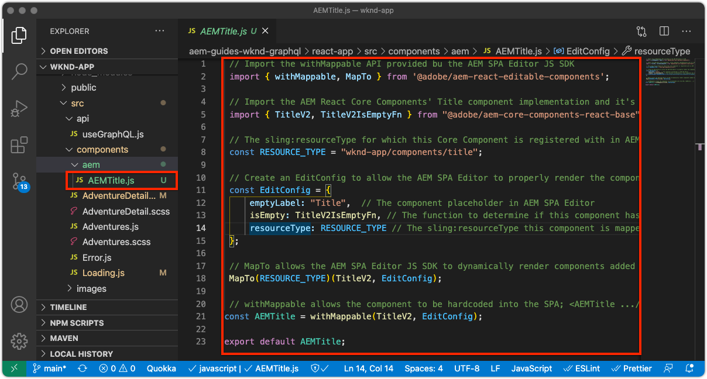

# 編集可能な固定コンポーネント

編集可能な React コンポーネントは、「固定」することも、SPAビューにハードコードすることもできます。 これにより、開発者はSPAエディター互換のコンポーネントをSPAビューに配置し、ユーザーはAEM SPAエディターでコンポーネントのコンテンツを作成できます。


この章では、ホームビューのタイトル「Current Adventures」を置き換えます。これは、 `Home.js` 固定で編集可能なタイトルコンポーネントを使用 固定コンポーネントはタイトルの配置を保証しますが、タイトルのテキストをオーサリングし、開発サイクル外で変更することもできます。

## WKND アプリの更新

を追加するには、以下を実行します。 __固定__ コンポーネントをホームビューに追加します。

+ AEM React コアコンポーネントのタイトルコンポーネントを読み込み、プロジェクトのタイトルのリソースタイプに登録します。
+ 編集可能なタイトルコンポーネントをSPAホームビューに配置する

### AEM React コアコンポーネントのタイトルコンポーネントでの読み込み

SPAホームビューで、ハードコードされたテキストを置き換えます `<h2>Current Adventures</h2>` AEM React コアコンポーネントのタイトルコンポーネント タイトルコンポーネントを使用する前に、次の作業をおこなう必要があります。

1. タイトルコンポーネントのインポート元 `@adobe/aem-core-components-react-base`
1. 次を使用して登録 `withMappable` 開発者がSPAに配置できるように
1. また、に登録します。 `MapTo` そのため、 [コンテナコンポーネントを後で](./spa-container-component.md).

次の手順を実行します。

1. 次の場所にあるリモートSPAプロジェクトを開く `~/Code/wknd-app/aem-guides-wknd-graphql/react-app` IDE 内
1. React コンポーネントの作成先 `react-app/src/components/aem/AEMTitle.js`
1. 次のコードをに追加します。 `AEMTitle.js`.

   ```
   // Import the withMappable API provided by the AEM SPA Editor JS SDK
   import { withMappable, MapTo } from '@adobe/aem-react-editable-components';
   
   // Import the AEM React Core Components' Title component implementation and it's Empty Function 
   import { TitleV2, TitleV2IsEmptyFn } from "@adobe/aem-core-components-react-base";
   
   // The sling:resourceType for which this Core Component is registered with in AEM
   const RESOURCE_TYPE = "wknd-app/components/title";
   
   // Create an EditConfig to allow the AEM SPA Editor to properly render the component in the Editor's context
   const EditConfig = {    
       emptyLabel: "Title",  // The component placeholder in AEM SPA Editor
       isEmpty: TitleV2IsEmptyFn, // The function to determine if this component has been authored
       resourceType: RESOURCE_TYPE // The sling:resourceType this component is mapped to
   };
   
   // MapTo allows the AEM SPA Editor JS SDK to dynamically render components added to SPA Editor Containers
   MapTo(RESOURCE_TYPE)(TitleV2, EditConfig);
   
   // withMappable allows the component to be hardcoded into the SPA; <AEMTitle .../>
   const AEMTitle = withMappable(TitleV2, EditConfig);
   
   export default AEMTitle;
   ```

実装の詳細については、コードのコメントを参照してください。

この `AEMTitle.js` ファイルは次のようになります。



### React AEMTitle コンポーネントの使用

AEM React コアコンポーネントのタイトルコンポーネントがに登録され、React アプリ内で使用できるようになったので、ホームビューのハードコードされたタイトルテキストを置き換えます。

1. 編集 `react-app/src/Home.js`
1. 内 `Home()` 下部の「 」で、ハードコードされたタイトルを新しい `AEMTitle` コンポーネント：

   ```
   <h2>Current Adventures</h2>
   ```

   以下に置き換えます。

   ```
   <AEMTitle
       pagePath='/content/wknd-app/us/en/home' 
       itemPath='root/title'/>
   ```

   更新 `Home.js` を次のコードで置き換えます。

   ```
   ...
   import { AEMTitle } from './aem/AEMTitle';
   ...
   function Home() {
       return (
           <div className="Home">
   
               <AEMTitle
                   pagePath='/content/wknd-app/us/en/home' 
                   itemPath='root/title'/>
   
               <Adventures />
           </div>
       );
   }
   ```

この `Home.js` ファイルは次のようになります。


## AEMでのタイトルコンポーネントのオーサリング

1. AEM オーサーにログインします。
1. に移動します。 __サイト/WKND アプリ__
1. タップ __ホーム__ を選択し、 __編集__ 上部のアクションバーから
1. 選択 __編集__ ページエディターの右上にある編集モードセレクターから、
1. WKND ロゴの下、およびアドベンチャーリストの上にあるデフォルトのタイトルテキストの上にマウスポインターを置き、青い編集のアウトラインが表示されるまでマウスを移動します。
1. をタップしてコンポーネントのアクションバーを表示し、 __レンチ__  編集

   

1. タイトルコンポーネントをオーサリングします。
   + タイトル： __WKND アドベンチャ__
   + 種類/サイズ： __H2__

      

1. タップ __完了__ 保存する
1. AEM SPA Editor で変更をプレビューします。
1. ローカルで実行している WKND アプリを更新 [http://localhost:3000](http://localhost:3000) 作成したタイトルの変更が直ちに反映されることを確認します。

   

## おめでとうございます。

WKND アプリに編集可能な固定コンポーネントが追加されました。 次の方法を理解できました。

+ SPAでのAEM React コアコンポーネントの読み込みと再利用
+ 固定で編集可能なコンポーネントをSPAに追加する
+ AEMでの固定コンポーネントのオーサリング
+ 作成したコンテンツをリモートSPAで確認する

## 次の手順

次の手順は、次のとおりです。 [AEM ResponsiveGrid コンテナコンポーネントの追加](./spa-container-component.md) 作成者がSPAにコンポーネントを追加して編集できるSPAに
