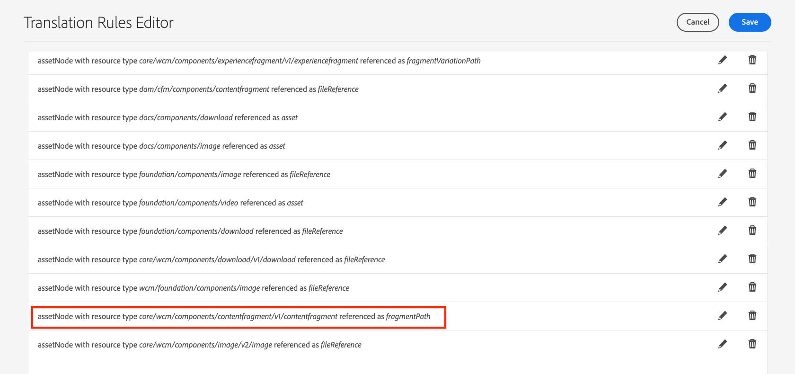

# AEMコンテンツフラグメントの翻訳のサポート{#translation-support-content-fragments}

コンテンツフラグメントをAdobe Experience Managerでローカライズおよび翻訳する方法を説明します。 コンテンツフラグメントに関連付けられた混在メディアアセットも、抽出および変換できます。

>[!VIDEO](https://video.tv.adobe.com/v/18131/?quality=12&learn=on)

## コンテンツフラグメント変換の使用例{#content-fragment-translation-use-cases}

コンテンツフラグメントは、AEMが外部翻訳サービスに送信するために抽出する、認識されるコンテンツタイプです。 次の使用例が初期設定でサポートされています。

1. コンテンツフラグメントは、アセットコンソールで直接選択して、言語コピーと翻訳を行うことができます
2. サイトページで参照されるコンテンツフラグメントは、言語コピーの対象としてサイトページが選択されている場合、適切な言語フォルダーにコピーされ、翻訳用に抽出されます
3. コンテンツフラグメント内に埋め込まれたインラインメディアアセットは、抽出および翻訳が可能です。
4. コンテンツフラグメントに関連付けられたアセットコレクションは、抽出および翻訳の対象となります

## 翻訳ルールエディター {#translation-rules-editor}

Experience Manager変換の動作は、**変換ルールエディター**&#x200B;を使用して更新できます。 翻訳を更新するには、[http://localhost:4502/libs/cq/translation/translationrules/contexts.html](http://localhost:4502/libs/cq/translation/translationrules/contexts.html)にある&#x200B;**ツール**/**一般**/**翻訳設定**&#x200B;に移動します。

初期設定では、`fragmentPath`にあるリソースタイプ`core/wcm/components/contentfragment/v1/contentfragment`のコンテンツフラグメントを参照します。 `v1/contentfragment`から継承するすべてのコンポーネントは、デフォルト設定で認識されます。

