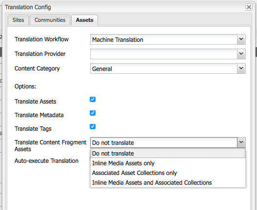

# AEMコンテンツフラグメントでの翻訳の使用{#using-translation-with-aem-content-fragments}

AEM 6.3では、コンテンツフラグメントを翻訳する機能が導入されています。 混在メディアアセットと、コンテンツフラグメントに関連付けられたアセットコレクションも、抽出および翻訳が可能です。

>[!VIDEO](https://video.tv.adobe.com/v/18131/?quality=9&learn=on)

## コンテンツフラグメント変換の使用例{#content-fragment-translation-use-cases}

コンテンツフラグメントは、AEMが抽出して外部翻訳サービスに送信する、認識されるコンテンツタイプです。 次の使用例が初期設定でサポートされています。

1. コンテンツフラグメントは、アセットコンソールで直接選択して、言語コピーと翻訳を行うことができます
2. サイトページで参照されるコンテンツフラグメントは、言語コピー用にサイトページを選択した場合に、適切な言語フォルダーにコピーされ、翻訳用に抽出されます
3. コンテンツフラグメント内に埋め込まれたインラインメディアアセットは、抽出および翻訳が可能です。
4. コンテンツフラグメントに関連付けられたアセットコレクションは、抽出および翻訳の対象となります

## 変換設定オプション{#translation-config-options}

初期設定の翻訳設定では、コンテンツフラグメントの変換に関する複数のオプションがサポートされています。 初期設定では、インラインメディアアセットと関連付けられたアセットコレクションは変換されません。 翻訳設定を更新するには、[http://localhost:4502/etc/cloudservices/translation/default_translation.html](http://localhost:4502/etc/cloudservices/translation/default_translation.html)に移動します。

コンテンツフラグメントアセットの変換には、次の4つのオプションがあります。

1. **翻訳しない（デフォルト）**
2. **インラインメディアアセットのみ**
3. **関連付けられているアセットコレクションのみ**
4. **インラインメディアアセットと関連付けられているコレクション**

