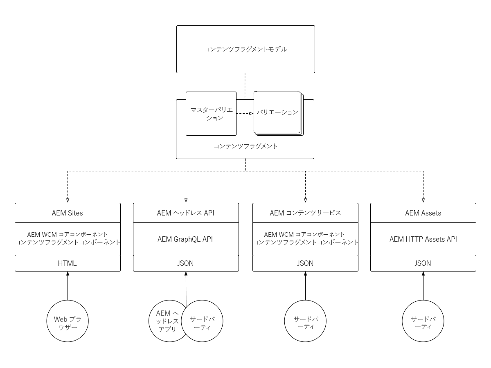
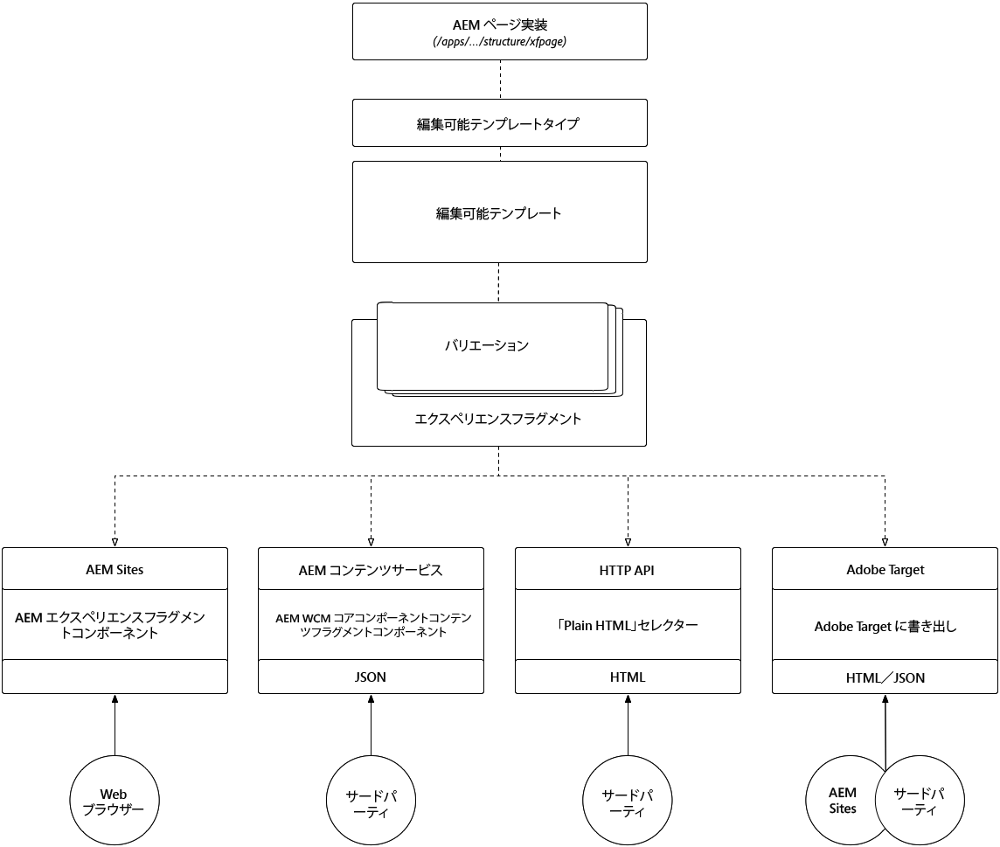

# コンテンツフラグメントとエクスペリエンスフラグメントについて

Adobe Experience Managerのコンテンツフラグメントとエクスペリエンスフラグメントは、表面的には似ているように見えますが、それぞれが異なる使用例で主な役割を果たします。 コンテンツフラグメントとエクスペリエンスフラグメントが似ている点、違う点、およびそれぞれの使用方法について説明します。

## コンテンツフラグメントとエクスペリエンスフラグメントの比較

<table>
<tbody><tr><td><strong> </strong></td>
<td><strong>コンテンツフラグメント（CF）</strong></td>
<td><strong>エクスペリエンスフラグメント(XF)</strong></td>
</tr><tr><td><strong>定義</strong></td>
<td><ul>
<li>再利用可能で、プレゼンテーションに依存しない<strong>コンテンツ</strong>。構造化されたデータ要素（テキスト、日付、参照など）で構成され、</li>
</ul>
</td>
<td><ul>
<li>コンテンツとプレゼンテーションを定義する1つ以上のAEMコンポーネントの再利用可能な複合で、独自に意味のある<strong>エクスペリエンス</strong>を形成します。</li>
</ul>
</td>
</tr><tr><td><strong>コアテナント</strong></td>
<td><ul>
<li>コンテンツ中心の</li>
<li><a href="https://helpx.adobe.com/experience-manager/6-5/assets/using/content-fragments-models.html" target="_blank">構造化されたフォームベースのデータモデルで定義されます。</a></li>
<li>デザインとレイアウトに非依存。</li>
<li>チャネルは、コンテンツフラグメントのコンテンツ（レイアウトとデザイン）のプレゼンテーションを所有します</li>
</ul>
</td>
<td><ul>
<li>プレゼンテーション中心</li>
<li>AEM Componentsの非構造化構成によって定義されます。</li>
<li>コンテンツのデザインとレイアウトを定義します</li>
<li>チャネルで「現状のまま」使用</li>
</ul>
</td>
</tr><tr><td><strong>技術的詳細</strong></td>
<td><ul>
<li><strong>dam:Asset</strong>として実装</li>
<li><a href="https://helpx.adobe.com/experience-manager/6-5/assets/using/content-fragments-models.html" target="_blank">コンテンツフラグメントモデル</a>で定義</li>
</ul>
</td>
<td><ul>
<li><strong>cq:Page</strong>として実装</li>
<li>編集可能なテンプレートで定義</li>
<li>ネイティブHTMLレンディション</li>
</ul>
</td>
</tr><tr><td><strong>バリエーション</strong></td>
<td><ul>
<li>マスターのバリエーションは標準的なバリエーションです</li>
<li>バリエーションは、チャネルに合わせて調整できる使用例に固有です。</li>
</ul>
</td>
<td><ul>
<li>バリエーションは、チャネルまたはコンテキストに固有です</li>
<li>バリエーションは、AEM Live Copyを使用して同期されます。</li>
<li><a href="https://helpx.adobe.com/experience-manager/6-5/sites/authoring/using/experience-fragments.html#BuildingBlocks" target="_blank">バリエー</a> ション間でのブロックローコンテンツの再利用の構築</li>
</ul>
</td>
</tr><tr><td><strong>機能</strong></td>
<td><ul>
<li>バリエーション</li>
<li>バージョン</li>
<li> バリエーション間でのコンテンツの同期</li>
<li><a href="https://helpx.adobe.com/experience-manager/6-5/assets/using/content-fragments-managing.html#ComparingFragmentVersions" target="_blank">視覚的に異な</a> るコンテンツフラグメントのバージョン</li>
<li> 複数行テキスト要素の注釈</li>
<li>複数行のテキスト要素のインテリジェントな<a href="https://helpx.adobe.com/experience-manager/6-5/assets/using/content-fragments-variations.html#SummarizingText" target="_blank">要約</a>。</li>
<li><a href="https://helpx.adobe.com/experience-manager/6-5/assets/using/creating-translation-projects-for-content-fragments.html" target="_blank">翻訳/ローカライゼーション</a></li>
</ul>
</td>
<td><ul>
<li>バリエーション</li>
<li>バリエーションをライブコピーとして</li>
<li>バージョン</li>
<li><a href="https://helpx.adobe.com/experience-manager/6-5/sites/authoring/using/experience-fragments.html#BuildingBlocks" target="_blank">構築ブロック</a></li>
<li>注釈</li>
<li>レスポンシブレイアウトとプレビュー</li>
<li>翻訳/ローカライゼーション</li>
</ul>
</td>
</tr><tr><td><strong>使用方法</strong></td>
<td><ul>
<li><a href="https://docs.adobe.com/content/help/en/experience-manager-core-components/using/components/content-fragment-component.html" target="_blank">AEM Sites、AEM Screens、またはエクスペリエ</a> ンスフラグメントで使用するAEMコアコンポーネントのコンテンツフラグメントコンポーネント。</li>
<li><a href="https://helpx.adobe.com/experience-manager/kt/sites/using/content-services-tutorial-use.html" target="_blank">AEM Content Services</a>を介したJSON書き出しで、サードパーティでの利用が可能</li>
<li>AEM HTTP Assets APIを介したサードパーティでの利用向けJSON。</li>
</ul>
</td>
<td><ul>
<li>AEM Sites、AEM Screens、またはその他のエクスペリエンスフラグメントで使用するAEMエクスペリエンスフラグメントコンポーネント。</li>
<li>サードパーティシステムで使用するために、<a href="https://helpx.adobe.com/experience-manager/6-5/sites/authoring/using/experience-fragments.html#ThePlainHTMLRendition" target="_blank">プレーンHTML</a>として書き出す</li>
<li><a href="https://helpx.adobe.com/jp/experience-manager/6-5/sites/administering/using/experience-fragments-target.html" target="_blank">ターゲットオファー用のAdobe</a> ターゲットへのHTML書き出し</li>
<li>ターゲットオファー用のAdobe TargetへのJSON書き出し</li>
</ul>
</td>
</tr><tr><td><strong>一般的な使用例</strong></td>
<td><ul>
<li>構造化されたデータ入力/フォームベースのコンテンツ</li>
<li>長形式の編集コンテンツ（複数行要素）</li>
<li>配信するチャネルのライフサイクル外で管理されるコンテンツ</li>
</ul>
</td>
<td><ul>
<li>チャネルごとのバリエーションを使用した、マルチチャネルのプロモーション販促資料の一元管理。</li>
<li>コンテンツがWebサイトの複数のページで再利用される。</li>
<li>WebサイトのChrome(例： ヘッダーとフッター)</li>
<li>チャネルを配信するライフサイクル外で管理されるエクスペリエンス</li>
</ul>
</td>
</tr><tr><td><strong>ドキュメント</strong></td>
<td><ul>
<li><a href="https://helpx.adobe.com/experience-manager/6-5/assets/user-guide.html?topic=/experience-manager/6-5/assets/morehelp/content-fragments.ug.js" target="_blank">AEMコンテンツフラグメントユーザーガイド</a></li>
<li><a href="https://helpx.adobe.com/experience-manager/kt/sites/using/content-fragments-feature-video-use.html" target="_blank">AEMでのコンテンツフラグメントの使用</a></li>
</ul>
</td>
<td><ul>
<li><a href="https://helpx.adobe.com/experience-manager/6-5/sites/authoring/using/experience-fragments.html" target="_blank">エクスペリエンスフラグメントに関するAdobeドキュメント</a></li>
</ul>
</td>
</tr></tbody></table>

## コンテンツフラグメントのアーキテクチャ

次の図に、AEMコンテンツフラグメントの全体的なアーキテクチャを示します

!

+ **コンテンツフラグメ** ントモデルは、コンテンツフラグメントが取得して公開するコンテンツを定義する要素（またはフィールド）を定義します。
+ **コンテンツフラグメント**&#x200B;は、論理コンテンツエンティティを表すコンテンツフラグメントモデルのインスタンスです。
+ コンテンツフラグメント&#x200B;**バリエーション**&#x200B;はコンテンツフラグメントモデルに準拠しますが、コンテンツにバリエーションがあります。
+ コンテンツフラグメントは、次の方法で公開/使用できます。
   + AEM WCMコアコンポーネントのコンテンツフラグメントコンポーネントを使用して、**AEM Sites**(またはAEM Screens)上でコンテンツフラグメントを使用します。
   + AEM WCMコアコンポーネントのコンテンツフラグメントコンポーネントを介して&#x200B;**エクスペリエンスフラグメント**&#x200B;にコンテンツフラグメントを埋め込む。任意のエクスペリエンスフラグメントの使用例で使用できます。
   + コンテンツフラグメントバリエーションをJSON形式で公開する(読み取り専用の使用例の場合は、**AEM Content Services**&#x200B;とAPIページを使用)。
   + CRUDの使用例のために、**AEM Assets HTTP API**&#x200B;を介してAEM Assetsに直接呼び出しを介して、コンテンツフラグメントコンテンツ（すべてのバリエーション）をJSONとして直接公開する。

## エクスペリエンスフラグメントのアーキテクチャ

!

+ **編集可能なテンプレート**(編集可能なテンプレートタイプと **AEM Pageコンポーネントの実装**  ****&#x200B;で定義)は、エクスペリエンスフラグメントの作成に使用できるAEMコンポーネントを定義します。
+ **エクスペリエンスフラグメント**&#x200B;は、論理エクスペリエンスを表す編集可能なテンプレートのインスタンスです。
+ エクスペリエンスフラグメント&#x200B;**バリエーション**&#x200B;は、編集可能なテンプレートに準拠しますが、エクスペリエンス（コンテンツとデザイン）のバリエーションがあります。
+ エクスペリエンスフラグメントは、次の方法で公開/利用できます。
   + AEMエクスペリエンスフラグメントコンポーネントを使用して、AEM Sites(またはAEM Screens)上でエクスペリエンスフラグメントを使用する。
   + エクスペリエンスフラグメントバリエーションコンテンツをJSON（埋め込みHTMLを使用）として&#x200B;**AEM Content Services**&#x200B;およびAPIページ経由で公開する。
   + エクスペリエンスフラグメントバリエーションを&#x200B;**&quot;プレーンHTML&quot;**&#x200B;として直接公開する。
   + エクスペリエンスフラグメントをHTMLオファーまたはJSONオファーとして&#x200B;**Adobe Target**&#x200B;に書き出す。
   + AEM SitesはHTMLオファーをネイティブにサポートしますが、JSONオファーにはカスタム開発が必要です。

## コンテンツフラグメントのサポート資料

+ [コンテンツフラグメントユーザーガイド](https://helpx.adobe.com/experience-manager/6-5/assets/user-guide.html?topic=/experience-manager/6-5/assets/morehelp/content-fragments.ug.js)
+ [AEMでのコンテンツフラグメントの使用](https://helpx.adobe.com/experience-manager/kt/sites/using/content-fragments-feature-video-use.html)
+ [AEM WCMコアコンポーネントのコンテンツフラグメントコンポーネント](https://docs.adobe.com/content/help/ja-JP/experience-manager-core-components/using/components/content-fragment-component.html)
+ [コンテンツフラグメントとAEM Content Servicesの使用](https://helpx.adobe.com/experience-manager/kt/sites/using/structured-fragments-content-services-feature-video-use.html)
+ [AEM Content Servicesの概要](https://helpx.adobe.com/jp/experience-manager/kt/sites/using/content-services-tutorial-use.html)

## エクスペリエンスフラグメントのサポート資料

+ [エクスペリエンスフラグメントに関するAdobeドキュメント](https://helpx.adobe.com/experience-manager/6-5/sites/authoring/using/experience-fragments.html)
+ [AEMエクスペリエンスフラグメントについて](https://helpx.adobe.com/experience-manager/kt/sites/using/experience-fragments-feature-video-understand.html)
+ [AEMエクスペリエンスフラグメントの使用](https://helpx.adobe.com/experience-manager/kt/sites/using/experience-fragments-feature-video-use.html)
+ [Adobe TargetでのAEMエクスペリエンスフラグメントの使用](https://medium.com/adobetech/experience-fragments-and-adobe-target-d8d74381b9b2)
