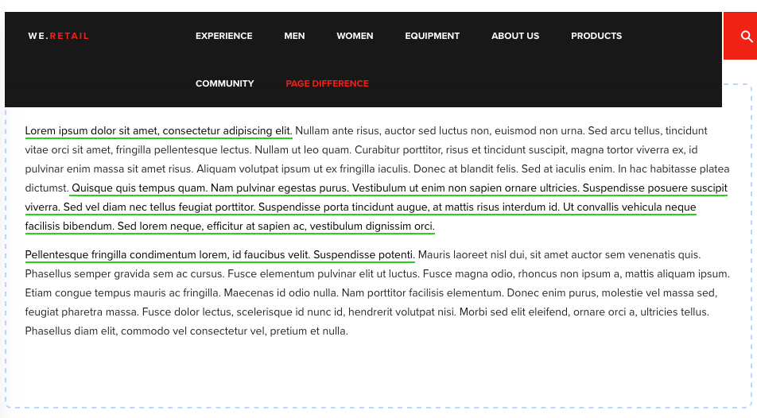

# ページの違いを考慮した開発{#developing-for-page-difference}

このビデオでは、AEMサイトのページの違い機能にカスタムスタイルを設定する方法を示します。

## ページ差異スタイルのカスタマイズ{#customizing-page-difference-styles}

>[!VIDEO](https://video.tv.adobe.com/v/18871/?quality=9&learn=on)

>[!NOTE]
>
>このビデオでは、カスタムCSSをwe.Retailクライアントライブラリに追加します。このライブラリでは、カスタマイザのAEM Sitesプロジェクトに対してこれらの変更を行う必要があります。次のコード例では、`my-project`.

AEMのページ差は、`/libs/cq/gui/components/common/admin/diffservice/clientlibs/diffservice/css/htmldiff.css`の直接読み込みを介してOOTB CSSを取得します。

クライアントライブラリカテゴリを使用する代わりにCSSを直接読み込むので、カスタムスタイルの新しい注入ポイントを見つける必要があります。このカスタム注入ポイントは、プロジェクトのオーサリングclientlibです。

これは、これらのカスタムスタイルの上書きをテナント固有にするメリットを持ちます。

### オーサリングclientlib {#prepare-the-authoring-clientlib}を準備する

`/apps/my-project/clientlib/authoring.`にプロジェクト用の`authoring` clientlibが存在することを確認します

```xml
<?xml version="1.0" encoding="UTF-8"?>
<jcr:root xmlns:cq="http://www.day.com/jcr/cq/1.0" xmlns:jcr="http://www.jcp.org/jcr/1.0"
        jcr:primaryType="cq:ClientLibraryFolder"
        categories="[my-project.authoring]"/>
```

### カスタムCSSを指定{#provide-the-custom-css}

プロジ追加ェクトの`authoring` clientlib a `css.txt`に対して、優先スタイルを提供するLESSファイルを指します。 [この例で](https://lesscss.org/) 使用するクラスラップを含む便利な機能が多数あるので、リストをお勧めします。

```shell
base=./css

htmldiff.less
```

`/apps/my-project/clientlibs/authoring/css/htmldiff.less`に優先スタイルを含む`less`ファイルを作成し、必要に応じてオーバーリングスタイルを指定します。

```css
/* Wrap with body to gives these rules more specificity than the OOTB */
body {

    /* .html-XXXX are the styles that wrap text that has been added or removed */

    .html-added {
        background-color: transparent;
     color: initial;
        text-decoration: none;
     border-bottom: solid 2px limegreen;
    }

    .html-removed {
        background-color: transparent;
     color: initial;
        text-decoration: none;
     border-bottom: solid 2px red;
    }

    /* .cq-component-XXXX require !important as the class these are overriding uses it. */

    .cq-component-changed {
        border: 2px dashed #B9DAFF !important;
        border-radius: 8px;
    }
    
    .cq-component-moved {
        border: 2px solid #B9DAFF !important;
        border-radius: 8px;
    }

    .cq-component-added {
        border: 2px solid #CCEBB8 !important;
        border-radius: 8px;
    }

    .cq-component-removed {
        border: 2px solid #FFCCCC !important;
        border-radius: 8px;
    }
}
```

### ページコンポーネント{#include-the-authoring-clientlib-css-via-the-page-component}を介して、オーサリングclientlib CSSを含めます。

オーサリングclientlibsカテゴリをプロジェクトの基本ページの`/apps/my-project/components/structure/page/customheaderlibs.html`の直前に`</head>`タグに含め、スタイルが読み込まれるようにします。

これらのスタイルは、[!UICONTROL 編集]と[!UICONTROL プレビュー]のWCMモードに制限する必要があります。

```xml
<head>
  ...
  <sly data-sly-test="${wcmmode.preview || wcmmode.edit}" 
       data-sly-call="${clientLib.css @ categories='my-project.authoring'}"/>
</head>
```

上記のスタイルが適用されたdiff&#39;dページの最終結果は、次のようになります（HTMLが追加され、コンポーネントが変更されました）。



## その他のリソース {#additional-resources}

* [we.Retailサンプルサイトのダウンロード](https://github.com/Adobe-Marketing-Cloud/aem-sample-we-retail/releases)
* [AEMクライアントライブラリの使用](https://helpx.adobe.com/jp/experience-manager/6-5/sites/developing/using/clientlibs.html)
* [CSSに関するドキュメントを減らす](https://lesscss.org/)
