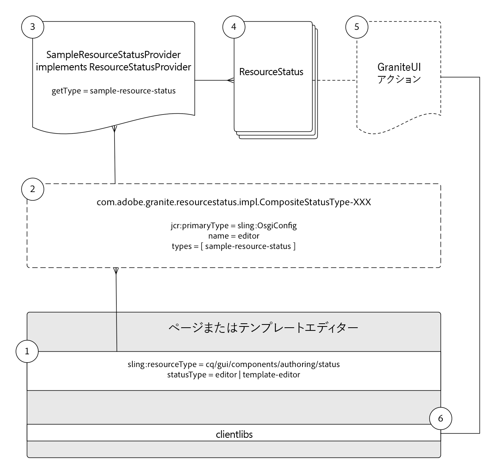

# リソースのステータスの開発{#developing-resource-statuses-in-aem-sites}

Adobe Experience ManagerのリソースステータスAPIは、AEMの各種エディタWeb UIでステータスメッセージを公開するためのプラグ可能なフレームワークです。

## 概要 {#overview}

Resource Status for Editorsフレームワークは、標準的かつ均一な方法で、エディターのステータスを表示し、操作するためのサーバー側およびクライアント側のAPIを提供します。

エディターのステータスバーは、AEMのページエディター、エクスペリエンスフラグメントエディター、テンプレートエディターでネイティブに使用できます。

カスタムのリソースステータスプロバイダーの使用例を次に示します。

* ページがスケジュールされたアクティベーションから2時間以内に表示された場合に作成者に通知する
* 過去15分以内にページがアクティブ化されたことを作成者に通知する
* 過去5分以内にページが編集されたこと、および編集者に通知する


## リソースステータスプロバイダーフレームワーク{#resource-status-provider-framework}

カスタムのリソースステータスを開発する場合、開発作業は次のものから構成されます。

1. ResourceStatusProvider実装。ステータスが必要かどうかを判断し、ステータスに関する基本情報を管理します。タイトル、メッセージ、優先度、バリアント、アイコンおよび使用可能なアクション。
2. 必要に応じて、使用可能な任意のアクションの機能を実装するGraniteUI JavaScript。

   

3. ページ、エクスペリエンスフラグメント、テンプレートエディターの一部として提供されるステータスリソースには、リソースの「[!DNL statusType]」プロパティを介して型が割り当てられます。

   * ページエディタ：`editor`
   * エクスペリエンスフラグメントエディター：`editor`
   * テンプレートエディター: `template-editor`

4. ステータスリソースの`statusType`は、登録された`CompositeStatusType` OSGiが`name`設定したプロパティと一致します。

   すべての一致に対して、`CompositeStatusType's`型が収集され、`ResourceStatusProvider.getType()`を介して、この型を持つ`ResourceStatusProvider`実装を収集するために使用されます。

5. 一致する`ResourceStatusProvider`がエディターの`resource`に渡され、`resource`が表示するステータスを持つかどうかが判断されます。 状態が必要な場合、この実装は0または多数の`ResourceStatuses`を作成して返す必要があります。それぞれが表示する状態を表します。

   通常、`ResourceStatusProvider`は`resource`ごとに0または1 `ResourceStatus`を返します。

6. ResourceStatusは、顧客が実装できるインターフェイスです。または、有用な`com.day.cq.wcm.commons.status.EditorResourceStatus.Builder`を使用してステータスを構築できます。 ステータスは次のもので構成されます。

   * タイトル
   * メッセージ
   * アイコン
   * バリアント
   * 優先度
   * アクション
   * データ

7. 必要に応じて、`ResourceStatus`オブジェクトに`Actions`を指定する場合は、アクションリンクに機能をステータスバーにバインドするために、clientlibをサポートする必要があります。

   ```js
   (function(jQuery, document) {
       'use strict';
   
       $(document).on('click', '.editor-StatusBar-action[data-status-action-id="do-something"]', function () {
           // Do something on the click of the resource status action
   
       });
   })(jQuery, document);
   ```

8. アクションをサポートするJavaScriptまたはCSSをサポートする場合は、フロントエンドコードをエディターで確実に使用できるように、各エディターの対応するクライアントライブラリを通じてプロキシ化する必要があります。

   * ページエディタカテゴリ:`cq.authoring.editor.sites.page`
   * エクスペリエンスフラグメントエディターのカテゴリ:`cq.authoring.editor.sites.page`
   * テンプレートエディターカテゴリ:`cq.authoring.editor.sites.template`

## コード{#view-the-code}の表示

[GitHubのコードを参照](https://github.com/Adobe-Consulting-Services/acs-aem-samples/tree/master/bundle/src/main/java/com/adobe/acs/samples/resourcestatus/impl/SampleEditorResourceStatusProvider.java)

## その他のリソース {#additional-resources}

* [`com.adobe.granite.resourcestatus` JavaDocs](https://helpx.adobe.com/experience-manager/6-5/sites/developing/using/reference-materials/javadoc/com/adobe/granite/resourcestatus/package-summary.html)
* [`com.day.cq.wcm.commons.status.EditorResourceStatus` JavaDocs](https://helpx.adobe.com/experience-manager/6-5/sites/developing/using/reference-materials/javadoc/com/day/cq/wcm/commons/status/EditorResourceStatus.html)
