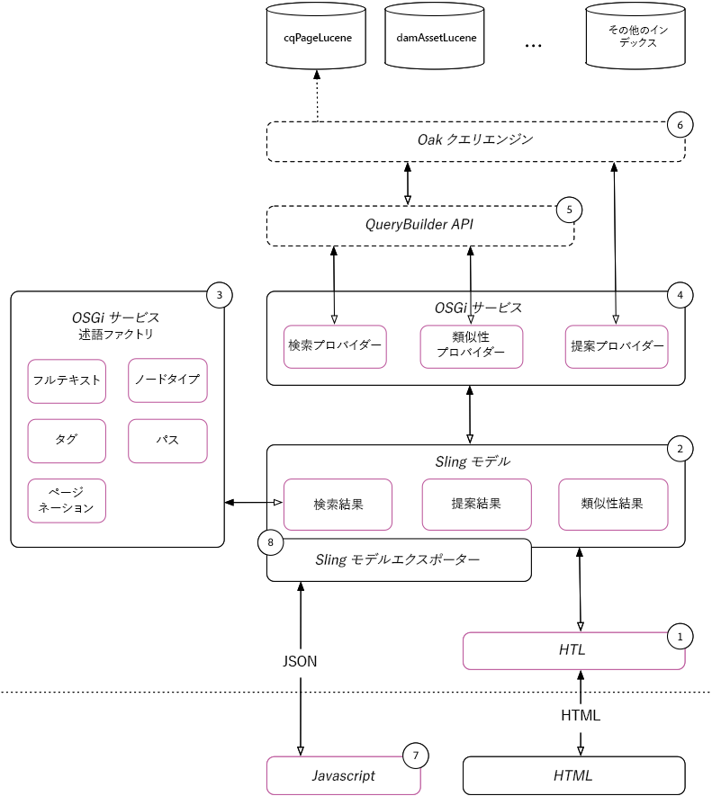

# 簡易検索実装ガイド{#simple-search-implementation-guide}

簡易検索の実装は、**AdobeサミットラボAEM Search Demystified**&#x200B;の資料です。 このページには、このラボの資料が含まれています。 実習のガイド付きツアーについては、このページの「プレゼンテーション」セクションでLabワークブックを参照してください。



## プレゼンテーション資料 {#bookmarks}

* [ラボワークブック](assets/l4080/l4080-lab-workbook.pdf)
* [プレゼンテーション](assets/l4080/l4080-presentation.pdf)

## ブックマーク{#bookmarks-1}

### ツール {#tools}

* [インデックスマネージャー](http://localhost:4502/libs/granite/operations/content/diagnosis/tool.html/granite_oakindexmanager)
* [クエリの説明を実行](http://localhost:4502/libs/granite/operations/content/diagnosis/tool.html/granite_queryperformance)
* [CRXDE Lite](http://localhost:4502/crx/de/index.jsp#/oak%3Aindex/cqPageLucene) > /oak:index/cqPageLucene
* [CRXパッケージマネージャー](http://localhost:4502/crx/packmgr/index.jsp)
* [QueryBuilderデバッガー](http://localhost:4502/libs/cq/search/content/querydebug.html?)
* [Oak Index Definition Generator](https://oakutils.appspot.com/generate/index)

### 章 {#chapters}

*以下のチャプターリンクは、初期パッケージが [AEMオ](#initialpackages) ーサーインストールされていることを前提としています(`http://localhost:4502`*

* [第 1 章](http://localhost:4502/editor.html/content/summit/l4080/chapter-1.html)
* [第 2 章](http://localhost:4502/editor.html/content/summit/l4080/chapter-2.html)
* [第 3 章](http://localhost:4502/editor.html/content/summit/l4080/chapter-3.html)
* [第 4 章](http://localhost:4502/editor.html/content/summit/l4080/chapter-4.html)
* [第 5 章](http://localhost:4502/editor.html/content/summit/l4080/chapter-5.html)
* [第 6 章](http://localhost:4502/editor.html/content/summit/l4080/chapter-6.html)
* [第 7 章](http://localhost:4502/editor.html/content/summit/l4080/chapter-7.html)
* [第 8 章](http://localhost:4502/editor.html/content/summit/l4080/chapter-8.html)
* [第 9 章](http://localhost:4502/editor.html/content/summit/l4080/chapter-9.html)

## パッケージ {#packages}

### 初期パッケージ{#initial-packages}

* [タグ](assets/l4080/summit-tags.zip)
* [シンプル検索アプリケーションパッケージ](assets/l4080/simple.ui.apps-0.0.1-snapshot.zip)

### チャプターパッケージ{#chapter-packages}

* [第一章解決](assets/l4080/l4080-chapter1.zip)
* [第2章解決](assets/l4080/l4080-chapter2.zip)
* [第3章解決](assets/l4080/l4080-chapter3.zip)
* [第4章解決](assets/l4080/l4080-chapter4.zip)
* [第5章の設定](assets/l4080/l4080-chapter5-setup.zip)
* [第五章解決](assets/l4080/l4080-chapter5-solution.zip)
* [第6章解決](assets/l4080/l4080-chapter6.zip)
* [第9章解決](assets/l4080/l4080-chapter9.zip)

## 参照マテリアル{#reference-materials}

* [Githubリポジトリ](https://github.com/Adobe-Marketing-Cloud/aem-guides/tree/master/simple-search-guide)
* [Sling Model](https://sling.apache.org/documentation/bundles/models.html)
* [Sling Model Exporter](https://sling.apache.org/documentation/bundles/models.html#exporter-framework-since-130)
* [QueryBuilder API](https://docs.adobe.com/docs/en/aem/6-2/develop/search/querybuilder-api.html)
* [AEM Chromeプラグイン](https://chrome.google.com/webstore/detail/aem-chrome-plug-in/ejdcnikffjleeffpigekhccpepplaode) ([ドキュメントページ](https://adobe-consulting-services.github.io/acs-aem-tools/aem-chrome-plugin/))

## 修正とフォローアップ{#corrections-and-follow-up}

ラボでのディスカッションの修正と説明、参加者によるフォローアップ質問への回答。

1. **インデックスの再作成を停止する方法**

   インデックス再作成は、[AEM Webコンソール/JMX](http://localhost:4502/system/console/jmx)で利用できるIndexStats MBeanを使用して停止できます

   * [http://localhost:4502/system/console/jmx/org.apache.jackrabbit.oak%3Aname%3Dasync%2Ctype%3DIndexStats](http://localhost:4502/system/console/jmx/org.apache.jackrabbit.oak%3Aname%3Dasync%2Ctype%3DIndexStats)
      * `abortAndPause()`を実行して、インデックス再作成を中止します。 これにより、`resume()`が呼び出されるまで、インデックスがロックされ、さらにインデックスが再作成されます。
      * `resume()`を実行すると、インデックス作成プロセスが再開されます。
   * ドキュメント：[https://jackrabbit.apache.org/oak/docs/query/indexing.html#async-index-mbean](https://jackrabbit.apache.org/oak/docs/query/indexing.html#async-index-mbean)

2. **oakインデックスは複数のテナントをサポートする方法を教えてください。**

   Oakは、コンテンツツリーを介したインデックスの配置をサポートし、これらのインデックスはそのサブツリー内でのみインデックスを作成します。 例えば、**`/content/site-a/oak:index/cqPageLucene`**&#x200B;を作成して、**`/content/site-a`.**&#x200B;の下にのみコンテンツのインデックスを作成できます。

   同等の方法は、**`/oak:index`**&#x200B;の下のインデックスで&#x200B;**`includePaths`**&#x200B;プロパティと&#x200B;**`queryPaths`**&#x200B;プロパティを使用することです。 以下に例を示します。

   * `/oak:index/siteAcqPageLucene@includePaths=/content/site-a`
   * `/oak:index/siteAcqPageLucene@queryPaths=/content/site-a`

   このアプローチの考慮事項は次のとおりです。

   * クエリは、インデックスのクエリパススコープと等しいパス制限を指定するか、またはインデックスのクエリパススコープの子孫を指定する必要があります。
   * より広い範囲のインデックス（`/oak:index/cqPageLucene`など）もデータにインデックスを付けるので、重複した取り込みとディスク使用のコストが発生します。
   * 設定の重複管理(例： 同じクエリセットを満たす必要がある場合、複数のテナントインデックスに同じindexRulesを追加する
   * この方法は、カスタムサイト検索のAEMパブリッシュ層に最適です。AEMオーサーと同様に、クエリは、様々なテナントのコンテンツツリーの上位で実行されるのが一般的です（OmniSearchなど）。インデックス定義が異なると、パス制限に基づいてのみ異なる動作が発生します。


3. **利用可能なすべてのアナライザーのリストはどこにありますか？**

   Oakは、AEMで使用するLucene提供アナライザー設定要素のセットを公開します。

   * [Apache Oak Analyzersドキュメント](http://jackrabbit.apache.org/oak/docs/query/lucene.html#analyzers)
      * [Tokenizers](https://cwiki.apache.org/confluence/display/solr/Tokenizers)
      * [フィルター](https://cwiki.apache.org/confluence/display/solr/Filter+Descriptions)
      * [CharFilters](https://cwiki.apache.org/confluence/display/solr/CharFilterFactories)

4. **同じクエリでページとアセットを検索する方法は？**

   AEM 6.3の新機能は、同じ指定されたクエリで複数のノードタイプをクエリする機能です。 次のQueryBuilderクエリ。 各「サブクエリ」は独自のインデックスに解決できるので、この例では、`cq:Page`サブクエリは`/oak:index/cqPageLucene`に、`dam:Asset`サブクエリは`/oak:index/damAssetLucene`に解決されます。

   ```plain
   group.p.or=true
   group.1_group.type=cq:Page
   # add all page restrictions to this group
   group.2_group.type=dam:Asset
   # add all asset restrictions to this group
   ```

   結果は、次のクエリプランとクエリプランになります。

   ```plain
   QUERY:(//element(*, cq:Page) | //element(*, dam:Asset))
   
   PLAN: [cq:Page] as [a] /* lucene:cqPageLucene(/oak:index/cqPageLucene) *:* */ union [dam:Asset] as [a] /* lucene:damAssetLucene(/oak:index/damAssetLucene) *:* */
   ```

   [QueryBuilder Debugger](http://localhost:4502/libs/cq/search/content/querydebug.html?_charset_=UTF-8&amp;query=group.p.or%3Dtrue%0D%0Agroup.1_group.type%3Dcq%3APage%0D%0A%23+add+all+page+restrictions+to+this+group%0D%0Agroup.2_group.type%3Ddam%3AAsset%0D%0A%23+add+all+asset+restrictions+to+this+group)および[AEM Chromeプラグイン](https://chrome.google.com/webstore/detail/aem-chrome-plug-in/ejdcnikffjleeffpigekhccpepplaode?hl=ja-JP)を使用して、クエリと結果を調べます。

5. **同じクエリで複数のパスを検索する方法は？**

   AEM 6.3の新機能は、同じ指定されたクエリ内の複数のパスに対してクエリを実行する機能です。 次のQueryBuilderクエリ。 各「サブクエリ」は、独自のインデックスに解決される場合があります。

   ```plain
   group.p.or=true
   group.1_group.type=cq:Page
   group.1_group.path=/content/docs/en/6-2
   # add all page restrictions to this group
   group.2_group.type=cq:Page
   group.2_group.path=/content/docs/en/6-3
   # add all asset restrictions to this group
   ```

   結果は、次のクエリとクエリプランになります。

   ```plain
   QUERY: (/jcr:root/content/docs/en/_x0036_-2//element(*, cq:Page) | /jcr:root/content/docs/en/_x0036_-3//element(*, cq:Page))
   
   PLAN: [cq:Page] as [a] /* traverse "/content/docs/en/6-2//*" where isdescendantnode([a], [/content/docs/en/6-2]) */ union [cq:Page] as [a] /* traverse "/content/docs/en/6-3//*" where isdescendantnode([a], [/content/docs/en/6-3]) */
   ```

   [QueryBuilder Debugger](http://localhost:4502/libs/cq/search/content/querydebug.html?_charset_=UTF-8&amp;query=group.p.or%3Dtrue%0D%0Agroup.1_group.type%3Dcq%3APage%0D%0Agroup.1_group.path%3D%2Fcontent%2Fdocs%2Fen%2F6-2%0D%0A%23+add+all+page+restrictions+to+this+group%0D%0Agroup.2_group.type%3Dcq%3APage%0D%0Agroup.2_group.path%3D%2Fcontent%2Fdocs%2Fen%2F6-3%0D%0A%23+add+all+asset+restrictions+to+this+group)および[AEM Chromeプラグイン](https://chrome.google.com/webstore/detail/aem-chrome-plug-in/ejdcnikffjleeffpigekhccpepplaode?hl=en-US)を使用して、クエリと結果を調べます。
