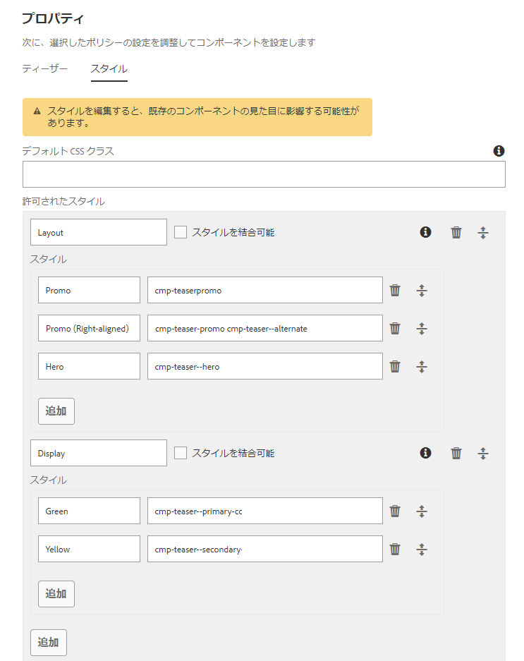
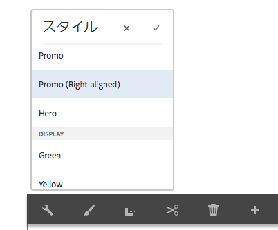
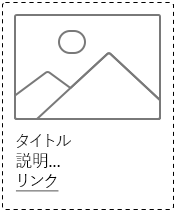
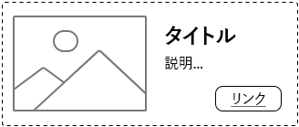
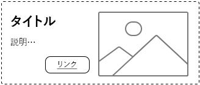
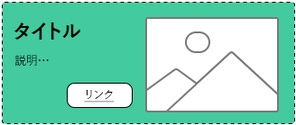
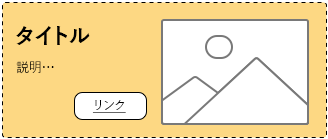
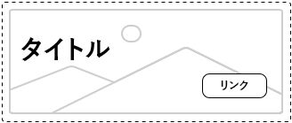
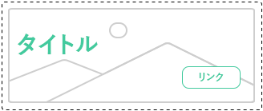

# スタイルシステムのベストプラクティスについて{#understanding-style-organization-with-the-aem-style-system}

>[!NOTE]
>
>AEM Style Systemで使用されるBEMに似た表記規則を確認するには、[Understanding to code for the Style System](style-system-technical-video-understand.md)の内容を確認してください。

AEM Style Systemには、2つの主な種類またはスタイルが実装されています。

* **レイアウトのスタイル**
* **表示スタイル**

**レイアウト** スタイルは、コンポーネントの多くの要素に影響を与え、コンポーネントの適切な定義と識別可能なレンディション（デザインとレイアウト）を作成し、多くの場合、再利用可能な特定のブランドの概念に合わせて調整します。例えば、Teaserコンポーネントは、従来のカードベースのレイアウト、横置きのプロモーション、または画像上にテキストをオーバーレイするヒーローレイアウトとして表示できます。

**表示** スタイルは、レイアウトスタイルの小さなバリエーションに影響を与えるのに使用されますが、レイアウトスタイルの基本的な性質や意図は変わりません。例えば、ヒーローレイアウトスタイルに表示スタイルがあり、その表示スタイルによってプライマリブランドのカラースキームからセカンダリブランドのカラースキームにカラースキームが変更される場合があります。

## スタイル組織のベストプラクティス{#style-organization-best-practices}

AEM作成者が使用できるスタイル名を定義する場合は、次の操作を行うことをお勧めします。

* 作成者が理解したボキャブラリを使用してスタイルに名前を付ける
* スタイルオプションの数を最小限に抑える
* ブランド標準で許可されているスタイルオプションと組み合わせのみを公開します。
* 効果を持つスタイルの組み合わせのみを公開する
   * 無効な組み合わせが暴露された場合は、少なくとも効果が低下しないようにする

AEMの作成者が使用できるスタイルの組み合わせの数が増えるにつれて、ブランド標準に対してQAを行い、検証する必要のある順序が増えます。 また、オプションが多すぎると、意図した効果を生み出すために必要なオプションや組み合わせが不明確になる可能性があるので、作成者を混乱させる可能性もあります。

### スタイル名とCSSクラス{#style-names-vs-css-classes}

スタイル名、またはAEM作成者に提示されるオプション、および実装するCSSクラス名はAEMで切り離されます。

これにより、AEMの作成者が明確で理解できるボキャブラリ内にスタイルオプションのラベルを付けることができますが、CSS開発者は、CSSクラスに将来的な配達確認、意味的な方法で名前を付けることができます。 次に例を示します。

コンポーネントには、ブランドの&#x200B;**プライマリ**&#x200B;と&#x200B;**セカンダリ**&#x200B;の色で色付けするオプションが必要ですが、AEMの作成者は、プライマリとセカンダリのデザイン言語ではなく、**グリーン**&#x200B;と&#x200B;**黄**&#x200B;の色を知っています。

AEMスタイルシステムは、作成者にわかりやすいラベル&#x200B;**緑**&#x200B;と&#x200B;**黄**&#x200B;を使用してこれらの色付き表示スタイルを公開できますが、CSS開発者は`.cmp-component--primary-color`と`.cmp-component--secondary-color`のセマンティックネーミングを使用して、実際のスタイル実装をCSSで定義できます。

**Green**&#x200B;のスタイル名は`.cmp-component--primary-color`に、**Yellow**&#x200B;は`.cmp-component--secondary-color`にマップされます。

会社のブランド色が将来変更される場合、変更が必要なのは、`.cmp-component--primary-color`と`.cmp-component--secondary-color`の単一の実装と、スタイル名だけです。

## Teaserコンポーネントの使用例{#the-teaser-component-as-an-example-use-case}

Teaserコンポーネントのスタイル設定でレイアウトと表示のスタイルが異なる使用例を次に示します。

これは、スタイル名（作成者に公開）の仕組みと、背景となるCSSクラスの編成方法について説明します。

### Teaserコンポーネントスタイルの構成{#component-styles-configuration}

次の図は、使用例で説明されているバリエーションのTeaserコンポーネントの[!UICONTROL スタイル]設定を示しています。

[!UICONTROL スタイルグループ]の名前、レイアウト、表示は、この記事でスタイルの種類を概念的に分類するために使用される表示スタイルとレイアウトスタイルの一般的な概念と一致します。

[!UICONTROL スタイルグループ]の名前と[!UICONTROL スタイルグループ]の数は、コンポーネントの使用例とプロジェクト固有のコンポーネントスタイル規則に合わせて調整する必要があります。

例えば、**表示**&#x200B;スタイルグループ名は、**色**&#x200B;という名前になっている可能性があります。



### スタイル選択メニュー{#style-selection-menu}

次の画像は、[!UICONTROL スタイル]メニュー作成者がコンポーネントに適したスタイルを選択する際の操作を示しています。 [!UICONTROL スタイルグリップ]の名前とスタイル名は、すべて作成者に公開されています。



### デフォルトのスタイル{#default-style}

デフォルトのスタイルは多くの場合、コンポーネントで最も一般的に使用されるスタイルで、ページに追加する際にスタイルが設定されていないデフォルトの表示です。

デフォルトスタイルの共通性に応じて、CSSは`.cmp-teaser`（修飾子なし）または`.cmp-teaser--default`に直接適用されます。

デフォルトのスタイル規則がすべてのバリエーションに適用されるのではなく、多くの場合は、`.cmp-teaser`をデフォルトのスタイルのCSSクラスとして使用することをお勧めします。すべてのバリエーションは暗黙的に継承する必要があります。 そうでない場合は、`.cmp-teaser--default`などの初期設定の修飾子を使用して適用する必要があります。は、[コンポーネントのスタイル設定のデフォルトのCSSクラス](#component-styles-configuration)フィールドに追加する必要があります。

「名前付き」スタイルをデフォルトのスタイルとして割り当てることもできます。例えば、以下に定義するヒーロースタイル`(.cmp-teaser--hero)`を使用できますが、CSSクラス実装`.cmp-teaser`または`.cmp-teaser--default`に対してデフォルトのスタイルを実装する方がより明確です。

>[!NOTE]
>
>デフォルトのレイアウトスタイルには表示スタイル名がありませんが、作成者はAEMスタイルシステム選択ツールで「表示」オプションを選択できます。
>
>これは、ベストプラクティスに違反しています。
>
>**効果を持つスタイルの組み合わせのみを公開する**
>
>作成者が&#x200B;**緑**&#x200B;の表示スタイルを選択した場合は、何も起こりません。
>
>この使用例では、他のすべてのレイアウトスタイルはブランドの色を使用して色付きを付ける必要があるので、この違反を認めます。
>
>以下の&#x200B;**Promo（右揃え）**&#x200B;セクションでは、不要なスタイルの組み合わせを防ぐ方法を説明します。



* **レイアウトのスタイル**
   * デフォルト
* **表示スタイル**
   * なし
* **有効なCSSクラス**: `.cmp-teaser--promo` または  `.cmp-teaser--default`

### プロモーションスタイル{#promo-style}

**プロモーションレイアウトスタイル**&#x200B;は、サイト上の価値の高いコンテンツを宣伝するために使用され、Webページ上の領域を占めるために水平方向にレイアウトされ、ブランドの色別にスタイル可能で、デフォルトのプロモーションレイアウトスタイルは黒のテキストです。

これを達成するため、TeaserコンポーネントのAEMスタイルシステムに、**プロモ**&#x200B;の&#x200B;**レイアウトスタイル**&#x200B;と&#x200B;**グリーン**&#x200B;の&#x200B;**表示スタイル**&#x200B;と&#x200B;**黄**&#x200B;を構成する。

#### Promoのデフォルト



* **レイアウトのスタイル**
   * スタイル名：**プロモーション**
   * CSS クラス: `cmp-teaser--promo`
* **表示スタイル**
   * なし
* **有効なCSSクラス**:  `.cmp-teaser--promo`

#### プロモーションプライマリ


* **レイアウトのスタイル**
   * スタイル名：**プロモーション**
   * CSS クラス: `cmp-teaser--promo`
* **表示スタイル**
   * スタイル名：**緑**
   * CSS クラス: `cmp-teaser--primary-color`
* **有効なCSSクラス**:  `cmp-teaser--promo.cmp-teaser--primary-color`

#### プロモセカンダリ


* **レイアウトのスタイル**
   * スタイル名：**プロモーション**
   * CSS クラス: `cmp-teaser--promo`
* **表示スタイル**
   * スタイル名：**黄色**
   * CSS クラス: `cmp-teaser--secondary-color`
* **有効なCSSクラス**:  `cmp-teaser--promo.cmp-teaser--secondary-color`

### プロモーションの右揃えのスタイル{#promo-r-align}

**Promo Right-aligned**&#x200B;レイアウトスタイルは、プロモーションスタイルの一種です。このスタイルは、画像とテキストの位置を反転します（画像は右、テキストは左）。

右側の線形は、その中核となる表示スタイルです。この場合、AEMスタイルシステムに、Promoレイアウトスタイルと組み合わせて選択した表示スタイルとして入力できます。 これは、次のベストプラクティスに違反します。

**効果を持つスタイルの組み合わせのみを公開する**

...[デフォルトのスタイル](#default-style)で既に違反しています。

右揃えはプロモーションレイアウトスタイルにのみ影響し、他の2つのレイアウトスタイルには影響しないので、次のように指定します。defaultとheroを指定した場合、Promoレイアウトスタイルのコンテンツを右揃えにするCSSクラスを含む、新しいレイアウトスタイルのプロモーション（右揃え）を作成できます。`cmp -teaser--alternate`.

複数のスタイルを1つのスタイルエントリに組み合わせることで、使用可能なスタイルの数やスタイルの順序を減らすこともできます。これは最小限に抑えるのが最適です。

CSSクラスの名前`cmp-teaser--alternate`は、作成者にわかりやすい「右揃え」の命名と一致する必要はありません。

#### プロモーションの右揃えのデフォルト



* **レイアウトのスタイル**
   * スタイル名：**プロモーション（右揃え）**
   * CSS クラス: `cmp-teaser--promo cmp-teaser--alternate`
* **表示スタイル**
   * なし
* **有効なCSSクラス**:  `.cmp-teaser--promo.cmp-teaser--alternate`

#### プロモーションの右揃えのプライマリ



* **レイアウトのスタイル**
   * スタイル名：**プロモーション（右揃え）**
   * CSS クラス: `cmp-teaser--promo cmp-teaser--alternate`
* **表示スタイル**
   * スタイル名：**緑**
   * CSS クラス: `cmp-teaser--primary-color`
* **有効なCSSクラス**:  `.cmp-teaser--promo.cmp-teaser--alternate.cmp-teaser--primary-color`

#### プロモーションのセカンダリ右揃え



* **レイアウトのスタイル**
   * スタイル名：**プロモーション（右揃え）**
   * CSS クラス: `cmp-teaser--promo cmp-teaser--alternate`
* **表示スタイル**
   * スタイル名：**黄色**
   * CSS クラス: `cmp-teaser--secondary-color`
* **有効なCSSクラス**:  `.cmp-teaser--promo.cmp-teaser--alternate.cmp-teaser--secondary-color`

### ヒーロースタイル{#hero-style}

Heroレイアウトスタイルでは、コンポーネントの画像が背景として表示され、タイトルとリンクがオーバーレイされます。 ヒーローレイアウトスタイルは、Promoレイアウトスタイルと同様、ブランドの色で色付きにする必要があります。

ヒーローレイアウトスタイルにブランドの色を付けるには、プロモーションレイアウトスタイルと同じ表示スタイルを使用できます。

コンポーネントごとに、スタイル名はCSSクラスの1つのセットにマップされます。つまり、Promoレイアウトスタイルの背景色を付けるCSSクラス名は、Heroレイアウトスタイルのテキストとリンクに色を付ける必要があります。

これは、CSSルールをスコープすることで簡単に実現できますが、AEMでこれらの順位を適用する方法をCSS開発者が理解する必要はありません。

**プロモート**&#x200B;レイアウトスタイルの背景にプライマリ（緑）カラーのカラーを適用するCSS:

```css
.cmp-teaser--promo.cmp-teaser--primary--color {
   ...
   background-color: green;
   ...
}
```

**Hero**&#x200B;レイアウトスタイルのテキストにプライマリ（緑）カラーを適用するCSS:

```css
.cmp-teaser--hero.cmp-teaser--primary--color {
   ...
   color: green;
   ...
}
```

#### ヒーローのデフォルト



* **レイアウトのスタイル**
   * スタイル名：**ヒーロー**
   * CSS クラス: `cmp-teaser--hero`
* **表示スタイル**
   * なし
* **有効なCSSクラス**:  `.cmp-teaser--hero`

#### ヒーロープライマリ



* **レイアウトのスタイル**
   * スタイル名：**プロモーション**
   * CSS クラス: `cmp-teaser--hero`
* **表示スタイル**
   * スタイル名：**緑**
   * CSS クラス: `cmp-teaser--primary-color`
* **有効なCSSクラス**:  `cmp-teaser--hero.cmp-teaser--primary-color`

#### ヒーローセカンダリ


* **レイアウトのスタイル**
   * スタイル名：**プロモーション**
   * CSS クラス: `cmp-teaser--hero`
* **表示スタイル**
   * スタイル名：**黄色**
   * CSS クラス: `cmp-teaser--secondary-color`
* **有効なCSSクラス**:  `cmp-teaser--hero.cmp-teaser--secondary-color`

## その他のリソース {#additional-resources}

* [スタイルシステムドキュメント](https://helpx.adobe.com/jp/experience-manager/6-5/sites/authoring/using/style-system.html)
* [AEMクライアントライブラリの作成](https://helpx.adobe.com/jp/experience-manager/6-5/sites/developing/using/clientlibs.html)
* [BEM （ブロック・エレメント・モディファイア）ドキュメントのWebサイト](https://getbem.com/)
* [LESSドキュメントWebサイト](https://lesscss.org/)
* [jQuery Webサイト](https://jquery.com/)
