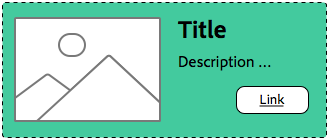

# スタイルシステムのベストプラクティスについて{#understanding-style-organization-with-the-aem-style-system}

>[!NOTE]
>
>次の場所でコンテンツを確認してください： [スタイルシステムのコードを作成する方法について](style-system-technical-video-understand.md)を使用して、AEMスタイルシステムで使用される BEM に似た表記規則を確実に理解できます。

AEMスタイルシステムには、2 つの主なフレーバーまたはスタイルが実装されています。

* **レイアウトスタイル**
* **スタイルを表示**

**レイアウトスタイル** は、コンポーネントの多くの要素に影響を与えて、コンポーネントの明確に定義され識別可能なレンディション（デザインとレイアウト）を作成し、多くの場合、再利用可能な特定の Brand の概念に合わせます。 例えば、ティーザーコンポーネントは、従来のカードベースのレイアウト、水平方向のプロモーションスタイル、または画像上のテキストをオーバーレイするヒーローレイアウトとして表示できます。

**スタイルを表示** は、レイアウトスタイルのマイナーなバリエーションに影響を与えるために使用されますが、レイアウトスタイルの基本的な性質や意図は変更されません。 例えば、ヒーローレイアウトスタイルには、カラースキームをプライマリブランドのカラースキームからセカンダリブランドのカラースキームに変更する表示スタイルが含まれている場合があります。

## スタイル組織のベストプラクティス {#style-organization-best-practices}

AEMの作成者が使用できるスタイル名を定義する場合は、次の方法が最適です。

* 作成者が理解した語彙を使用してスタイルに名前を付ける
* スタイルオプションの数を最小限に抑える
* ブランド標準で許可されているスタイルオプションと組み合わせのみを公開します。
* 効果を持つスタイルの組み合わせのみを表示します
   * 効果のない組み合わせが露呈した場合は、少なくとも効果が低い組み合わせにならないようにしてください

AEMの作成者が使用できるスタイルの組み合わせの数が増えるにつれ、より多くの順列が存在し、ブランド標準に従って QA を実行し検証する必要があります。 また、オプションが多すぎると、作成者を混乱させる可能性があります。これは、目的の効果を生み出すために必要なオプションや組み合わせが不明になる可能性があるからです。

### スタイル名と CSS クラス {#style-names-vs-css-classes}

AEMの作成者に提供されるスタイル名やオプション、実装 CSS クラス名はAEMで切り離されます。

これにより、AEMの作成者が明確で理解できる語彙でスタイルオプションにラベルを付けることができますが、CSS 開発者は、将来にわたって有効な意味的方法で CSS クラスに名前を付けることができます。 次に例を示します。

コンポーネントには、ブランドの **プライマリ** および **セカンダリ** ただし、AEM作成者は、色を **緑** および **黄色**&#x200B;プライマリとセカンダリのデザイン言語ではなく、

AEM Style System は、作成者にわかりやすいラベルを使用して、これらの色付け表示スタイルを公開できます **緑** および **イエロー**&#x200B;を使用する一方、CSS 開発者は `.cmp-component--primary-color` および `.cmp-component--secondary-color` をクリックして、実際のスタイル実装を CSS で定義します。

スタイル名： **緑** は `.cmp-component--primary-color`、および **イエロー** から `.cmp-component--secondary-color`.

今後、同社のブランドカラーが変化する場合、変更が必要なのは、 `.cmp-component--primary-color` および `.cmp-component--secondary-color`、およびスタイル名。

## ティーザーコンポーネントを使用した使用例 {#the-teaser-component-as-an-example-use-case}

ティーザーコンポーネントのスタイルを、レイアウトと表示のスタイルが異なる複数のスタイルに設定する使用例を次に示します。

これは、スタイル名（作成者に公開）の仕組みと、バッキング CSS クラスの編成方法を調べます。

### ティーザーコンポーネントのスタイルの設定 {#component-styles-configuration}

次の画像は、 [!UICONTROL スタイル] 使用例で説明しているバリエーション用のティーザーコンポーネントの設定

この [!UICONTROL スタイルグループ] 名前、レイアウト、表示（ハプナンスによる）は、この記事で概念的にスタイルの種類を分類する際に使用する表示スタイルとレイアウトスタイルの一般的な概念と一致します。

この [!UICONTROL スタイルグループ] 名前と数 [!UICONTROL スタイルグループ] コンポーネントの使用例やプロジェクト固有のコンポーネントスタイル設定規則に合わせてカスタマイズする必要があります。

例えば、 **表示** スタイルグループ名にはという名前を付けることができます。 **色**.


### スタイル選択メニュー {#style-selection-menu}

以下の画像には、 [!UICONTROL スタイル] メニュー作成者はとやり取りして、コンポーネントに適したスタイルを選択します。 次の点に注意してください。 [!UICONTROL スタイルグリッピ] 名前とスタイル名は、すべて作成者に公開されます。


### デフォルトのスタイル {#default-style}

デフォルトスタイルは、多くの場合、コンポーネントで最も一般的に使用されるスタイルで、ページに追加したときのティーザーのデフォルトのスタイル設定されていない表示です。

デフォルトスタイルの一般性に応じて、CSS は `.cmp-teaser` （修飾子なし）または `.cmp-teaser--default`.

デフォルトのスタイルルールがすべてのバリエーションに適用される頻度が多い場合は、 `.cmp-teaser` をデフォルトスタイルの CSS クラスとして使用する場合、すべてのバリエーションは BEM に似た命名規則に従っていると仮定して、それらを暗黙的に継承する必要があるので、 そうでない場合は、次のようなデフォルトの修飾子を使用して適用する必要があります。 `.cmp-teaser--default`を呼び出し、その後に [コンポーネントのスタイル設定のデフォルト CSS クラス](#component-styles-configuration) フィールドに設定されていない場合、これらのスタイルルールは各バリエーションで上書きする必要があります。

「名前付き」スタイルをデフォルトのスタイル（ヒーロースタイルなど）として割り当てることもできます。 `(.cmp-teaser--hero)` 以下に定義しますが、 `.cmp-teaser` または `.cmp-teaser--default` CSS クラスの実装。

>[!NOTE]
>
>デフォルトのレイアウトスタイルには表示スタイル名はありませんが、作成者はAEMスタイルシステムの選択ツールで「表示」オプションを選択できます。
>
>これは、ベストプラクティスに違反しています。
>
>**効果を持つスタイルの組み合わせのみを表示します**
>
>作成者が表示スタイル **緑** 何も起こらない。
>
>他のすべてのレイアウトスタイルはブランドの色を使用して色を付ける必要があるので、この使用例では、この違反を認めます。
>
>内 **プロモ（右揃え）** 以下の節では、不要なスタイルの組み合わせを防ぐ方法を説明します。


* **レイアウトスタイル**
   * デフォルト
* **表示スタイル**
   * なし
* **有効な CSS クラス**: `.cmp-teaser--promo` または `.cmp-teaser--default`

### プロモのスタイル {#promo-style}

この **プロモのレイアウトスタイル** は、価値の高いコンテンツをサイトに宣伝するために使用され、Web ページ上の広範な領域を占めるために水平にレイアウトされます。また、ブランドの色でスタイル設定でき、デフォルトのプロモのレイアウトスタイルは黒いテキストです。

これは、 **レイアウトスタイル** / **プロモ** そして **スタイルを表示** / **緑** および **イエロー** は、ティーザーコンポーネントのAEMスタイルシステムで設定されます。

#### プロモのデフォルト


* **レイアウトスタイル**
   * スタイル名： **プロモ**
   * CSS クラス: `cmp-teaser--promo`
* **表示スタイル**
   * なし
* **有効な CSS クラス**: `.cmp-teaser--promo`

#### プロモプライマリ



* **レイアウトスタイル**
   * スタイル名： **プロモ**
   * CSS クラス: `cmp-teaser--promo`
* **表示スタイル**
   * スタイル名： **緑**
   * CSS クラス: `cmp-teaser--primary-color`
* **有効な CSS クラス**: `cmp-teaser--promo.cmp-teaser--primary-color`

#### プロモセカンダリ


* **レイアウトスタイル**
   * スタイル名： **プロモ**
   * CSS クラス: `cmp-teaser--promo`
* **表示スタイル**
   * スタイル名： **イエロー**
   * CSS クラス: `cmp-teaser--secondary-color`
* **有効な CSS クラス**: `cmp-teaser--promo.cmp-teaser--secondary-color`

### プロモの右揃えのスタイル {#promo-r-align}

この **プロモの右揃え** レイアウトスタイルは、画像とテキスト（画像は右、テキストは左）の場所を反転させるプロモーションスタイルのバリエーションです。

右側の配置は、主に表示スタイルで、プロモーションレイアウトスタイルと組み合わせて選択された表示スタイルとしてAEMスタイルシステムに入力できます。 これは、次のベストプラクティスに違反します。

**効果を持つスタイルの組み合わせのみを表示します**

...それはすでに [デフォルトのスタイル](#default-style).

右揃えはプロモーションレイアウトスタイルにのみ影響し、他の 2 つのレイアウトスタイルには影響しないので、次のようになります。デフォルトとヒーローです。プロモレイアウトスタイルのコンテンツを右揃えにする CSS クラスを含む新しいレイアウトスタイルのプロモ（右揃え）を作成できます。 `cmp -teaser--alternate`.

複数のスタイルを 1 つのスタイルエントリに組み合わせることで、使用可能なスタイルとスタイルの順列の数を減らすこともできます。これは、最小限に抑えるのが最適です。

CSS クラスの名前に注意してください。 `cmp-teaser--alternate`を使用する場合、作成者にとってわかりやすい「右揃え」の命名規則に一致する必要はありません。

#### プロモの右揃えのデフォルト


* **レイアウトスタイル**
   * スタイル名： **プロモ（右揃え）**
   * CSS クラス: `cmp-teaser--promo cmp-teaser--alternate`
* **表示スタイル**
   * なし
* **有効な CSS クラス**: `.cmp-teaser--promo.cmp-teaser--alternate`

#### プロモの右揃えプライマリ


* **レイアウトスタイル**
   * スタイル名： **プロモ（右揃え）**
   * CSS クラス: `cmp-teaser--promo cmp-teaser--alternate`
* **表示スタイル**
   * スタイル名： **緑**
   * CSS クラス: `cmp-teaser--primary-color`
* **有効な CSS クラス**: `.cmp-teaser--promo.cmp-teaser--alternate.cmp-teaser--primary-color`

#### プロモの右揃えのセカンダリ


* **レイアウトスタイル**
   * スタイル名： **プロモ（右揃え）**
   * CSS クラス: `cmp-teaser--promo cmp-teaser--alternate`
* **表示スタイル**
   * スタイル名： **イエロー**
   * CSS クラス: `cmp-teaser--secondary-color`
* **有効な CSS クラス**: `.cmp-teaser--promo.cmp-teaser--alternate.cmp-teaser--secondary-color`

### ヒーロースタイル {#hero-style}

ヒーローレイアウトスタイルでは、コンポーネントの画像を背景として、タイトルとリンクがオーバーレイ表示されます。 ヒーローレイアウトスタイルは、プロモーションレイアウトスタイルと同様に、ブランドの色で色付けする必要があります。

ヒーローレイアウトスタイルにブランドカラーを適用するには、プロモーションレイアウトスタイルと同じ表示スタイルを利用できます。

コンポーネントごとに、スタイル名が単一の CSS クラスのセットにマッピングされます。つまり、プロモーションレイアウトスタイルの背景に色を付ける CSS クラス名は、Hero レイアウトスタイルのテキストとリンクに色を付ける必要があります。

これは、CSS ルールをスコープすることで実現できますが、AEMでこれらの順列がどのように適用されるかを理解するために、CSS 開発者が必要です。

背景を色付けする CSS **昇格** プライマリ（緑）色のレイアウトスタイル：

```css
.cmp-teaser--promo.cmp-teaser--primary--color {
   ...
   background-color: green;
   ...
}
```

テキストの色を設定する CSS **ヒーロー** プライマリ（緑）色のレイアウトスタイル：

```css
.cmp-teaser--hero.cmp-teaser--primary--color {
   ...
   color: green;
   ...
}
```

#### ヒーローのデフォルト


* **レイアウトスタイル**
   * スタイル名： **ヒーロー**
   * CSS クラス: `cmp-teaser--hero`
* **表示スタイル**
   * なし
* **有効な CSS クラス**: `.cmp-teaser--hero`

#### ヒーロープライマリ


* **レイアウトスタイル**
   * スタイル名： **プロモ**
   * CSS クラス: `cmp-teaser--hero`
* **表示スタイル**
   * スタイル名： **緑**
   * CSS クラス: `cmp-teaser--primary-color`
* **有効な CSS クラス**: `cmp-teaser--hero.cmp-teaser--primary-color`

#### ヒーローセカンダリ


* **レイアウトスタイル**
   * スタイル名： **プロモ**
   * CSS クラス: `cmp-teaser--hero`
* **表示スタイル**
   * スタイル名： **イエロー**
   * CSS クラス: `cmp-teaser--secondary-color`
* **有効な CSS クラス**: `cmp-teaser--hero.cmp-teaser--secondary-color`

## その他のリソース {#additional-resources}

* [スタイルシステムドキュメント](https://helpx.adobe.com/jp/experience-manager/6-5/sites/authoring/using/style-system.html)
* [AEMクライアントライブラリの作成](https://helpx.adobe.com/jp/experience-manager/6-5/sites/developing/using/clientlibs.html)
* [BEM（ブロック要素修飾子）ドキュメント Web サイト](https://getbem.com/)
* [LESS ドキュメント Web サイト](https://lesscss.org/)
* [jQuery Web サイト](https://jquery.com/)
